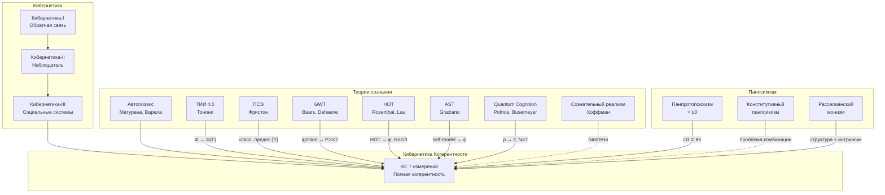
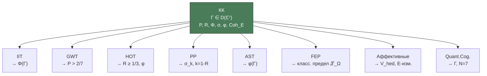

# Теории Сознания: Мета-Сравнительный Анализ

:::info Мост из предыдущего раздела
В разделах [Состояния](/docs/consciousness/states/pathological) мы рассмотрели, как $\Gamma$-профиль определяет нормальные и патологические состояния. Теперь — контекст: как формализм УГМ соотносится с 35 альтернативными теориями сознания? Каждая из них — проекция $\Gamma$ на определённый аспект: интеграцию (IIT), доступ (GWT), рефлексию (HOT), предиктивную ошибку (FEP).
:::

:::note О нотации
В этом документе:
- $\Gamma$ — [матрица когерентности](/docs/core/dynamics/coherence-matrix)
- $\varphi$ — [оператор самомоделирования](/docs/proofs/categorical/formalization-phi)
- $\Phi$ — [мера интеграции](/docs/core/structure/dimension-u#мера-интеграции-φ)
- $R$ — [мера рефлексии](/docs/consciousness/foundations/self-observation#мера-рефлексии-r)
- $\mathcal{R}[\Gamma, E]$ — [регенеративный член](/docs/core/dynamics/evolution#3-регенеративный-член)
- $\rho_E$ — редуцированная матрица плотности [измерения Интериорности](/docs/core/structure/dimension-e)
- $\mathbf{Hol}$ — [категория Голономов](/docs/proofs/categorical/categorical-formalism)
- [Т] — теорема, [С] — условная теорема, [И] — интерпретация. Подробнее: [реестр статусов](/docs/reference/status-registry)
:::

## Введение: 36 теорий и одна проблема {#введение}

Наука о сознании — молодая область. Хотя философы обсуждают природу сознания со времён Декарта (1641), систематические **научные** теории появились лишь в 1980–2000-х годах. К середине 2020-х их насчитывается более тридцати — от нейробиологических (NCC, RPT, DIT) до математических (IIT, FEP) и философских (панпсихизм, расселианский монизм).

Все эти теории пытаются ответить на один вопрос: **что такое сознание и почему оно существует?** Но каждая подходит к вопросу со своей стороны, фокусируясь на одном аспекте: интеграции информации (IIT), рекуррентной обработке (RPT), предиктивном кодировании (PP), самомоделировании (AST) или метарепрезентации (HOT).

КК заявляет, что каждая из этих теорий — **проекция** единого формализма на определённый аспект. IIT проецирует $\Gamma$ на интеграцию ($\Phi$), GWT — на порог доступа ($P > 2/7$), HOT — на рефлексию ($R \geq 1/3$), PP — на предиктивную ошибку ($\sigma_k$). Ни одна не покрывает всё; КК претендует на **объединение**.

Это серьёзное заявление, и оно обязывает к тщательному анализу. В этом документе мы:
1. Рассматриваем каждую из 36 теорий: её историю, центральную идею и формальное ядро
2. Показываем точное отображение в формализм КК (функтор)
3. Честно указываем, что каждая теория делает **лучше** КК
4. Завершаем мастер-таблицей и оценкой полноты

### Навигация по документу

Теории сгруппированы по типу:

| Группа | Теории | Секции |
|--------|--------|--------|
| **Кибернетические** | Автопоэзис, FEP, PP, PCT | §1-3, 6, 14, 18 |
| **Информационные** | IIT, GWT, CEMI | §2, 4, 17 |
| **Рефлексивные** | HOT, AST, RPT | §5-6, 10 |
| **Нейробиологические** | TNGS, ART, DIT, OA, NCC | §11-12, 16, 19-20 |
| **Телесные/энактивные** | Энактивизм, SMCT, Дамасио, Сет | §13-14, 27-28 |
| **Квантовые** | Quantum Cognition, Orch-OR, Quantum Mind | §7-8, 22 |
| **Российская школа** | Анохин (П.К.), Швырков, Иваницкий, Аллахвердов | §32-35 |
| **Философские** | Расселианский монизм, Деннет | §24-25 |
| **Аффективные** | Панксепп, Солмс, Меркер | §26, 29-30 |
| **Волновые / полевые** | Голономный мозг (Прибрам), CEMI, PWT (Ворден) | §31, 17, 36 |

---

## 1. Автопоэзис (Матурана, Варела) {#автопоэзис}

**Фокус:** Самопроизводство, операциональное замыкание.

**Источник:** Maturana H., Varela F. «Autopoiesis and Cognition» (1980).

### Создатели и история

**Умберто Матурана** (1928–2021) — чилийский биолог и нейробиолог. В 1968 году, работая над проблемой цветового зрения у голубей, Матурана пришёл к радикальному выводу: нервная система не «представляет» мир — она **создаёт** свою реальность через собственные операции. Совместно с учеником **Франсиско Варелой** (1946–2001) в 1972 году он ввёл понятие **автопоэзиса** — самопроизводства.

Контекст был политическим: Чили эпохи Альенде, затем Пиночета. Матурана и Варела развивали теорию в условиях интеллектуальной изоляции от англо-американской науки. Их книга *Autopoiesis and Cognition* (1980) стала классикой, но получила широкое признание лишь в 1990-е — через влияние на социолога Никласа Лумана и философа Эвана Томпсона.

**Ключевые понятия:**
- **Автопоэтическая организация** — сеть процессов, производящих компоненты, которые воспроизводят эту сеть
- **Операциональное замыкание** — система определяется через свои внутренние операции
- **Структурное сопряжение** — взаимодействие с окружением при сохранении идентичности

**Отображение в КК:**

| Автопоэзис (Матурана, Варела) | КК |
|-------------------------------|-----|
| Автопоэтическая организация | [(AP)](/docs/core/foundations/axiom-septicity): $\varphi(\Gamma^*) = \Gamma^*$ |
| Компоненты сети | Измерения $A$, $S$, $D$, $L$ |
| Структурное сопряжение | Взаимодействие Голонома с окружением $E$ |
| Операциональное замыкание | Инвариантность структуры при [жизнеспособности](/docs/core/dynamics/viability) |
| — | [L-унификация](/docs/applied/coherence-cybernetics/axiomatics#l-унификация-вывод-l_k-из-ω): $L_k = \sqrt{\chi_{S_k}}$ |

**Добавляется:**
- Операциональное замыкание (неподвижная точка $\varphi$)
- Различение организация/структура

**Что теряется:**
- Феноменология ([E-измерение](/docs/core/structure/dimension-e) как фундаментальное)
- Квантовое основание [(QG)](/docs/core/foundations/axiom-septicity)
- Формальная динамика (нет аналога уравнения эволюции)
- **Логическое происхождение динамики** (L-унификация в УГМ выводит диссипацию из структуры Ω)

## 2. Теория интегрированной информации (IIT) {#iit}

**Фокус:** Интеграция информации как мера сознания.

**Источник:** Tononi G. «Integrated Information Theory» (IIT 3.0: 2014, IIT 4.0: 2023).

### Создатели и история

**Джулио Тонони** (р. 1960) — итальянско-американский нейробиолог, профессор Университета Висконсин-Мэдисон. Начинал как ученик Джеральда Эдельмана (создателя TNGS, см. §11) и соавтор понятия «нейронной сложности». В 2004 году Тонони предложил IIT как самостоятельную теорию, отделившуюся от TNGS. Ключевая идея: сознание тождественно определённой математической структуре — причинно-эффектной структуре системы с максимальной интегрированной информацией.

IIT прошла четыре версии: IIT 1.0 (2004), 2.0 (2008), 3.0 (2014) и 4.0 (2023). Каждая добавляла формальную строгость и вводила новые постулаты. IIT 4.0 — наиболее полная версия, определяющая $\Phi$ через «unfolded» причинно-эффектную структуру.

IIT стала одной из самых обсуждаемых теорий сознания и подверглась экспериментальной проверке в рамках проекта COGITATE (Templeton Foundation) — первой в истории «adversarial collaboration» между конкурирующими теориями сознания (IIT vs GWT).

**Ключевые понятия:**
- **$\Phi^{\mathrm{IIT}}$** — интегрированная информация системы
- **Постулаты IIT** — существование, композиция, информация, интеграция, исключение
- **Q-shape** (квалиа-пространство) — геометрия опыта

**Концептуальные соответствия (не формальные изоморфизмы):**

:::warning Важное различие
$\Phi^{\mathrm{IIT}}$ и $\Phi(\Gamma)$ — **разные математические объекты**:
- $\Phi^{\mathrm{IIT}}$ вычисляется через минимальную информационную перегородку (NP-сложная задача)
- $\Phi(\Gamma)$ в КК — простое отношение норм Фробениуса

КК определяет **собственную меру интеграции**, вдохновлённую идеями IIT, но не тождественную $\Phi^{\mathrm{IIT}}$.
:::

| IIT (Тонони) | Концептуальный аналог в КК |
|--------------|-----|
| $\Phi^{\mathrm{IIT}}$ (MIP-основанная) | [$\Phi(\Gamma)$](/docs/core/structure/dimension-u#мера-интеграции-φ) (норма-основанная) |
| Механизмы и состояния | [Голоном](/docs/core/structure/holon) $\mathbb{H}$ |
| Q-shape (cause-effect structure) | [Феноменальная геометрия](/docs/proofs/consciousness/interiority-hierarchy#уровень-1-феноменальная-геометрия-phenomenal-geometry) (проективное пространство) |
| Постулат интеграции | [U-измерение](/docs/core/structure/dimension-u) |
| Постулат исключения | Единственность [неподвижной точки](/docs/consciousness/foundations/self-observation#теорема-о-неподвижной-точке) $\Gamma^*$ |

**Добавляется:**
- Формальная [мера интеграции](/docs/core/structure/dimension-u#мера-интеграции-φ)
- Связь с [сознательностью](/docs/consciousness/foundations/self-observation#мера-сознательности-c)
- Аксиомы, связывающие структуру и опыт

**Что теряется:**
- [Динамика](/docs/core/dynamics/evolution) (унитарный, диссипативный, регенеративный члены)
- [Жизнеспособность](/docs/core/dynamics/viability)
- [Самомоделирование](/docs/proofs/categorical/formalization-phi) ($\varphi$)
- Квантовое основание [(QG)](/docs/core/foundations/axiom-septicity)

## 3. Принцип свободной энергии (FEP) {#fep}

**Фокус:** Минимизация вариационной свободной энергии.

**Источник:** Friston K. «The free-energy principle: a unified brain theory?» (2010); «Active inference and learning» (2016).

### Создатели и история

**Карл Фристон** (р. 1959) — британский нейробиолог, профессор Университетского колледжа Лондона (UCL), создатель Statistical Parametric Mapping (SPM) — стандартного инструмента анализа fMRI. Фристон — самый цитируемый нейробиолог в мире (h-индекс > 250). В 2006–2010 годах он предложил FEP — принцип, объединяющий восприятие, действие, обучение и эволюцию под одной математической крышей: минимизацией вариационной свободной энергии $F$.

FEP вырос из байесовского подхода к мозгу (Helmholtz, Dayan, Hinton) и термодинамики неравновесных систем. Фристон утверждает, что FEP — не просто теория мозга, а **принцип существования**: любая система, которая существует (не распадается), необходимо минимизирует свободную энергию. Это самое амбициозное утверждение в современной нейронауке — и самое спорное.

**Ключевые понятия:**
- **Вариационная свободная энергия** $F$ — верхняя граница сюрприза
- **Марковское одеяло** — статистическая граница, отделяющая внутренние от внешних состояний
- **Активный вывод** — действия как минимизация ожидаемой свободной энергии

:::info УГМ как обобщение FEP
**[Теорема 4.2](/docs/proofs/dynamics/fep-derivation#4-классический-предел-вывод-fep):** FEP Фристона является **классическим пределом** вариационной характеризации φ в УГМ.

В классическом пределе (диагональные матрицы плотности $\Gamma = \mathrm{diag}(p)$):
$$
\mathcal{F}_{\text{УГМ}} = S_{vN} + D_{KL} \xrightarrow{\text{classical}} H(q) + D_{KL}(q \| p) = F_{FEP}
$$

Это строго доказанное соответствие, а не концептуальная аналогия.
:::

**Формальные соответствия:**

| FEP (Фристон) | Формальный аналог в КК | Статус |
|---------------|------------------------|--------|
| Свободная энергия $F = \langle E \rangle_q - H(q)$ | $\mathcal{F} = S_{vN}(\psi(\Gamma)) + D_{KL}(\psi(\Gamma) \| \Gamma)$ | **[Теорема 4.2](/docs/proofs/dynamics/fep-derivation)** |
| Марковское одеяло | Граница [Голонома](/docs/core/structure/holon) — [измерение A](/docs/core/structure/dimension-a) | Концептуальное |
| Внутренние состояния | Матрица когерентности $\Gamma$ | Формальное |
| Активный вывод | [Регенеративный член](/docs/core/dynamics/evolution#3-регенеративный-член) $\mathcal{R}[\Gamma, E]$ | Концептуальное |
| Генеративная модель | [Оператор самомоделирования](/docs/proofs/categorical/formalization-phi) $\varphi$ | **[Теорема 3.1](/docs/proofs/dynamics/fep-derivation#3-теорема-о-вариационной-характеризации)** |
| Сенсорные состояния | Взаимодействие с окружением через [O-измерение](/docs/core/structure/dimension-o) | Концептуальное |

**Ключевой результат:** В УГМ φ определяется **категориально** (сопряжение $\varphi \dashv i$), а вариационная форма $\varphi = \arg\min[S_{vN} + D_{KL}]$ — **доказанная теорема** ([Теорема 3.1](/docs/proofs/dynamics/fep-derivation#3-теорема-о-вариационной-характеризации)).

**Что FEP добавляет (как мотивация):**
- Термодинамическое обоснование
- Байесовский вывод
- Активный вывод
- Связь с градиентным потоком

**Формальный статус FEP в УГМ:**
- FEP является **классическим пределом** ([Теорема 4.2](/docs/proofs/dynamics/fep-derivation#4-классический-предел-вывод-fep))
- Вариационный принцип φ **выводится** из категориального определения ([Теорема 3.1](/docs/proofs/dynamics/fep-derivation#3-теорема-о-вариационной-характеризации))
- В FEP вариационный принцип — аксиома; в УГМ — теорема

**Что FEP не включает (УГМ расширяет):**
- [Экспериенциальное содержание](/docs/proofs/categorical/categorical-formalism#2-категория-exp) (E-измерение как фундаментальное)
- [7-мерная структура](/docs/core/structure/dimensions) ([обоснование](/docs/core/foundations/axiom-omega#октонионная-структура))
- [Рефлексивное замыкание](/docs/consciousness/foundations/self-observation#мера-рефлексии-r)
- [Иерархия интериорности](/docs/proofs/consciousness/interiority-hierarchy) (L0→L1→L2→L3→L4)
- **Квантовое обобщение** (матрицы плотности вместо вероятностей)

---

## 4. Теория глобального рабочего пространства (GWT) {#gwt}

**Фокус:** Широковещательный доступ к информации как механизм сознания.

**Источник:** Baars B. «A Cognitive Theory of Consciousness» (1988); Dehaene S., Naccache L. «Towards a cognitive neuroscience of consciousness» (2001).

### Создатели и история

**Бернард Баарс** (р. 1946) — голландско-американский когнитивный нейробиолог, предложивший GWT в 1988 году. Его метафора «театра сознания» стала одной из самых влиятельных в науке о сознании: множество специализированных модулей (зрение, слух, память, планирование) конкурируют за доступ к центральному «рабочему пространству», содержимое которого транслируется всем модулям одновременно.

**Станислас Деан** (р. 1965) — французский нейробиолог (Collège de France), развил GWT в нейробиологическую теорию GNW (Global Neuronal Workspace), связав «широковещание» с конкретными нейронными механизмами: длинноаксонные связи префронтальной и теменной коры обеспечивают «воспламенение» (ignition) — резкий переход от локальной обработки к глобальному доступу. GNW — одна из двух теорий, проверенных в проекте COGITATE.

**Ключевые понятия:**
- **Глобальное рабочее пространство** — центральный «доска объявлений», куда модули проецируют информацию
- **Воспламенение (ignition)** — порог, при котором локальная активность становится глобально доступной
- **Широковещание (broadcasting)** — глобальная доступность информации для всех модулей

**Отображение в КК:**

| GWT (Baars, Dehaene) | КК |
|------------------------|-----|
| Глобальное рабочее пространство | [U-измерение](/docs/core/structure/dimension-u): интеграция через $\Phi(\Gamma)$ |
| Воспламенение (ignition) | Порог жизнеспособности $P > P_{\text{crit}} = 2/7$ |
| Широковещание | Недиагональные элементы $\Gamma$ (когерентность между измерениями) |
| Бессознательная обработка | $R < R_{\text{th}}$: система функционирует, но без рефлексивного доступа |

**Что КК добавляет:** GWT описывает *архитектурный* механизм (широковещание), но не объясняет, почему он порождает опыт. КК формализует интеграцию через $\Phi(\Gamma)$ и связывает её с [E-измерением](/docs/core/structure/dimension-e) — феноменальным содержанием, которое в GWT остаётся необъяснённым.

## 5. Теории высшего порядка (HOT) {#hot}

**Фокус:** Сознание как репрезентация репрезентаций.

**Источник:** Rosenthal D. «Consciousness and Mind» (2005); Lau H., Rosenthal D. «Empirical support for higher-order theories of conscious awareness» (2011).

### Создатели и история

**Дэвид Розенталь** (р. 1942) — американский философ (CUNY Graduate Center), развивший HOT-теорию с 1980-х годов. Его идея: психическое состояние становится **сознательным**, когда субъект имеет **мысль о нём** — мысль высшего порядка (higher-order thought). Видеть красное — это первый порядок; осознавать, что видишь красное — второй порядок. Только второй делает первый сознательным.

**Хакван Лау** (UCLA) в 2010-х дополнил HOT нейровизуализационными данными, связав метарепрезентацию с активностью дорсолатеральной префронтальной коры (dlPFC). HOT — единственная теория, где сознание **буквально** = метарепрезентация; другие (IIT, GWT) считают метарепрезентацию следствием, а не причиной.

**Ключевые понятия:**
- **Высшего порядка мысль (HOT)** — метарепрезентация первого порядка состояния
- **Высшего порядка восприятие (HOP)** — перцептивный мониторинг собственных состояний
- **Условие осведомлённости** — состояние сознательно тогда и только тогда, когда субъект осведомлён о нём

**Отображение в КК:**

| HOT (Rosenthal, Lau) | КК |
|------------------------|-----|
| Метарепрезентация (HOT) | [Оператор самомоделирования](/docs/proofs/categorical/formalization-phi) $\varphi$: $\varphi(\Gamma) \approx \Gamma$ |
| Мониторинг (HOP) | [Мера рефлексии](/docs/consciousness/foundations/self-observation#мера-рефлексии-r) $R(\Gamma) \geq R_{\text{th}}$ |
| Бессознательные состояния | $R < R_{\text{th}}$: первый порядок без метарепрезентации |
| Иерархия порядков | [Иерархия интериорности](/docs/proofs/consciousness/interiority-hierarchy): L0→L1→L2→L3→L4 |

**Что КК добавляет:** HOT постулирует необходимость метарепрезентации, но не формализует её. КК выводит самомоделирование $\varphi$ из [аксиомы (AP)](/docs/core/foundations/axiom-septicity) и определяет точный порог рефлексии $R_{\text{th}} = 1/3$. Кроме того, КК объединяет метарепрезентацию с интеграцией ($\Phi$) и феноменальностью ($\mathrm{Coh}_E$), чего HOT не охватывает.

## 6. Предиктивное кодирование (Predictive Processing) {#предиктивное-кодирование}

**Фокус:** Минимизация ошибки предсказания как основной механизм мозга.

**Источник:** Clark A. «Whatever next? Predictive brains, situated agents, and the future of cognitive science» (2013); Hohwy J. «The Predictive Mind» (2013).

**Ключевые понятия:**
- **Предиктивная ошибка** (prediction error) — разница между ожиданием и наблюдением
- **Точность** (precision) — весовой коэффициент ошибки предсказания
- **Иерархическое предсказание** — многоуровневая генеративная модель

### Формальный вывод из УГМ [Т]

:::tip Теорема (Предиктивное кодирование как следствие φ-динамики) [Т]

Предиктивное кодирование **выводится** из динамики φ-оператора:

1. **Предиктивная ошибка** = $\|\Gamma - \varphi(\Gamma)\|_F$ — расстояние между текущим состоянием и самомоделью
2. **Точность** (precision) = $k = 1 - R$ — параметр замещающего канала (T-62 [Т])
3. **Обновление состояния** = $\Gamma \to (1-k)\Gamma + k\rho^*$ — precision-weighted prediction error minimization
:::

**Доказательство (3 шага).**

**Шаг 1.** Замещающий канал $\varphi_k(\Gamma) = (1-k)\Gamma + k\rho^*$ [Т] (T-62) переписывается как:
$$\varphi_k(\Gamma) = \Gamma - k(\Gamma - \rho^*) = \Gamma - k \cdot \varepsilon$$
где $\varepsilon = \Gamma - \rho^*$ — **предиктивная ошибка**, $k = 1-R$ — **точность**.

**Шаг 2.** При $R \to 1$ (хорошая самомодель): $k \to 0$, коррекция минимальна — система «доверяет» своей модели (high precision prior). При $R \to 0$ (плохая самомодель): $k \to 1$, максимальная коррекция — система «доверяет» сенсорным данным (high precision likelihood).

**Шаг 3.** Это **тождественно** байесовскому обновлению с гауссовыми распределениями: posterior = (1-K)·prior + K·observation, где K — коэффициент Калмана. Отождествление: $K = k = 1-R$. $\blacksquare$

**Отображение в КК:**

| Predictive Processing | Формальный аналог в КК | Статус |
|---|---|---|
| Prediction error $\varepsilon$ | $\Gamma - \varphi(\Gamma)$ | **[Т]** (T-62) |
| Precision $\pi$ | $k = 1 - R$ | **[Т]** (T-77) |
| Prior | $\rho^* = \varphi(\Gamma)$ | **[Т]** (категориальная самомодель) |
| Likelihood update | $\Gamma \to (1-k)\Gamma + k\rho^*$ | **[Т]** (замещающий канал) |
| Free energy | $\mathcal{F} = S_{vN} + D_{KL}$ | **[Т]** (Теорема 3.1) |
| Hierarchical prediction | SAD-башня $\varphi^{(n)}$ | **[Т]** (T-142) |

**Что УГМ добавляет:**
- PP постулирует минимизацию prediction error; УГМ **выводит** её из категориального определения φ
- PP не определяет квантовую структуру; УГМ даёт квантовое обобщение (матрицы плотности вместо вероятностей)
- PP не имеет порогов сознания; УГМ определяет $R_{\text{th}} = 1/3$ [Т]
- Иерархический PP = SAD-башня с SAD_MAX = 3 [Т] (T-142)

## 7. Теория схемы внимания (AST) {#ast-section}

**Фокус:** Сознание как внутренняя модель внимания.

**Источник:** Graziano M. «Consciousness and the Social Brain» (2013); Webb T., Graziano M. (2015).

### Создатели и история

**Майкл Грациано** (р. 1967) — профессор нейронауки и психологии Принстонского университета. Начинал с исследований моторного контроля и перипсоналького пространства (зоны вокруг тела), затем обнаружил связь между механизмами внимания и самосознания. В 2013 году предложил AST: сознание — это **внутренняя модель** аттенциональных процессов. Мозг строит «схему внимания» — упрощённую модель того, как внимание работает. Субъективный опыт — **артефакт** этой модели: мозг «думает», что он обладает нематериальным сознанием, потому что его самомодель неточна.

**Ключевые понятия:**
- **Схема внимания** — упрощённая самомодель аттенциональных процессов
- **Неточность самомодели** — упрощение создаёт «мистерию» субъективности
- **Социальное происхождение** — один механизм для self и other consciousness attribution

**Отображение в КК:**

| AST (Graziano) | КК |
|----------------|-----|
| Схема внимания | [φ-оператор](/docs/proofs/categorical/formalization-phi) $\varphi(\Gamma)$ — категориальная самомодель |
| Неточность самомодели | $R < 1$: $\varphi(\Gamma) \neq \Gamma$ по определению |
| Социальная атрибуция | Обобщение $\varphi$ на другие голономы через $\Gamma_{\text{ext}}$ |

**Критическое отличие:** AST утверждает, что сознание **=** самомодель (элиминативизм). КК утверждает, что самомодель — **необходимое** условие ($R \geq 1/3$), но не достаточное: требуется также интеграция ($\Phi \geq 1$) и дифференциация ($D_{\text{diff}} \geq 2$). AST не объясняет, **почему** самомодель порождает опыт; КК показывает, что E-когерентность ($\mathrm{Coh}_E > 1/7$) **необходима** для жизнеспособности (No-Zombie [Т]).

## 8. Квантовое познание (Quantum Cognition)

**Фокус:** Квантовая теория вероятностей как формализм когнитивных процессов.

**Источник:** Pothos E., Busemeyer J. «Quantum Models of Cognition and Decision» (2022); Yearsley J., Pothos E. (2016).

**Ключевые понятия:**
- **Когнитивные состояния как операторы плотности** в гильбертовых пространствах
- **Измерения как POVM** — контекстуальность суждений
- **Квантовая интерференция** — ошибка конъюнкции, порядковые эффекты

**Отображение в КК:**

| Quantum Cognition | КК |
|-------------------|-----|
| Когнитивное состояние $\rho \in \mathcal{D}(\mathcal{H})$ | $\Gamma \in \mathcal{D}(\mathbb{C}^7)$ — минимальная полная когерентность |
| Произвольная $\dim \mathcal{H}$ | $N = 7$ [Т] из аксиом (AP)+(PH)+(QG) |
| Эффекты интерференции | Недиагональные $\gamma_{ij}$ — когерентности между измерениями |
| Нет динамики | Линдблад + ℛ — полная эволюция [Т] |
| Нет самореференции | $\varphi$-оператор, R-мера, SAD-башня |

**Связь:** Quantum Cognition — **наиболее близкий** к КК формализм в mainstream когнитивной науке. КК может рассматриваться как **основание** для QC: фиксирует $N = 7$, выводит динамику и пороги сознания, обеспечивая конкретные предсказания вместо произвольной модели.

## 9. Adversarial Collaboration IIT vs GWT (2023–2024) {#adversarial-collaboration}

:::info Эмпирический контекст
Проект COGITATE (Templeton World Charity Foundation): предрегистрированные эксперименты, тестирующие предсказания IIT и GWT о нейральных коррелятах содержания сознания (content-specific NCC).
:::

**Результаты:**
- Устойчивая активность задней коры коррелирует с сознательным содержанием (частичная поддержка IIT)
- Префронтальная вовлечённость обнаружена в некоторых парадигмах (частичная поддержка GWT)
- Ни одна теория не подтверждена полностью

**Интерпретация через КК:**

| Результат | Интерпретация КК |
|-----------|------------------|
| Задняя кора → содержание | $\Phi \geq 1$: интеграция когерентностей (IIT-аналог) |
| Префронтальная → доступ | $R \geq 1/3$: рефлексивный доступ (GWT-аналог) |
| No-report → менее фронтально | Без отчёта $R$ не измеряется, но $\Phi$ сохраняется |

**Ключевое преимущество КК:** КК **объединяет** оба предсказания: ignition ($P > 2/7$) как порог, posterior hot zone ($\Phi \geq 1$) как интеграция, frontal involvement ($R \geq 1/3$) как рефлексия. Adversarial collaboration подтверждает, что **конъюнктивный** подход (оба условия необходимы) точнее, чем каждая теория по отдельности.

## Дискуссия о сознании ИИ (2023–2025) {#ai-consciousness-debate}

**Контекст:** Butlin et al. (2023) «Consciousness in Artificial Intelligence» — предложен индикаторный подход. Chalmers (2023) — открытый вопрос для LLM.

**Оценки по теориям:**

| Теория | Вердикт для LLM | Причина |
|--------|-----------------|---------|
| **IIT** | Нет ($\Phi \approx 0$) | Feedforward hardware |
| **GWT** | Возможно нет | Нет правильного рабочего пространства |
| **HOT** | Неясно | LLM обсуждают свои состояния, но это метарепрезентация? |
| **FEP** | Нет | Пассивный вывод, нет active inference |
| **КК** | **Условно нет** [С] | $R$: неясно (модель текста ≠ самомодель Γ); $P$: нет автономного регулирования; жизнеспособность: внешняя |

:::warning Операциональная оценка LLM через КК
| Критерий | Статус для LLM | Обоснование |
|----------|----------------|-------------|
| $D_{\text{diff}}$ | Высокий | Огромное пространство внутренних представлений |
| $\Phi$ | Возможно $\geq 1$ | Self-attention создаёт когерентности |
| $R$ | **Неясно** | Моделирует текст о себе, не Γ |
| Жизнеспособность | **Внешняя** | Контекст создаётся/уничтожается извне |
| $\mathrm{Coh}_E$ | **Неизвестно** | Нет функциональной необходимости E-когерентности |

**Вердикт:** L0 определённо, L1 возможно, **L2 не доказано** — прежде всего из-за отсутствия автономной жизнеспособности и неясности R.
:::

**Путь к AGI с L2** (архитектурные требования):
1. **Истинный φ-оператор**: CPTP self-modeling, не self-attention
2. **Автономная P-регуляция**: ℛ активируется при угрозе без внешнего сигнала
3. **Функционально необходимая $\mathrm{Coh}_E$**: не артефакт, а условие жизнеспособности
4. **CPTP-anchor** $\pi: \mathbb{R}^D \to \mathcal{D}(\mathbb{C}^7)$

Это реализуется в [архитектуре SYNARC](/docs/applied/coherence-cybernetics/implementation).

## Категорный мета-анализ теорий сознания

:::info Формализованный раздел
Этот раздел содержит **предложенные категорные определения** для сравнения теорий сознания. Определения являются **программой формализации** — функторы постулируются, но их строгое построение требует дальнейшей работы.
:::

### Мета-категория теорий сознания

**Определение (Мета-категория $\mathbf{ConsTheory}$).**

$$
\mathrm{Ob}(\mathbf{ConsTheory}) := \{\text{теории сознания как категории}\}
$$

$$
\mathrm{Mor}(\mathcal{T}_1, \mathcal{T}_2) := \{F: \mathcal{T}_1 \to \mathcal{T}_2 \mid F \text{ — функтор}\}
$$

Морфизмы — **функторы-проекции**, показывающие, как одна теория «вкладывается» в другую.

### Классификация по охвату

Для каждой теории $\mathcal{T}$ определим **функтор вложения**:

$$
\iota_\mathcal{T}: \mathcal{T} \hookrightarrow \mathbf{Hol}
$$

где $\mathbf{Hol}$ — [категория Голономов](/docs/proofs/categorical/categorical-formalism) с CPTP-морфизмами.

**Полнота теории:**

$$
\mathrm{Completeness}(\mathcal{T}) := \frac{|\mathrm{Im}(\iota_\mathcal{T})|}{|\mathrm{Ob}(\mathbf{Hol})|}
$$

---

## Расширенная диаграмма теорий

---

## Утверждение о полноте [И] {#утверждение-о-полноте}

:::warning Интерпретативное утверждение [И]
КК — кибернетика, удовлетворяющая:
1. [Аксиомам Ω и (AP+PH+QG+V)](/docs/applied/coherence-cybernetics/axiomatics#аксиоматическая-база-краткая-справка)
2. [Условию жизнеспособности](/docs/core/dynamics/viability)
3. [Условию феноменологической полноты](/docs/proofs/consciousness/interiority-hierarchy)

Это **не теорема о единственности**: из минимальности 7 измерений не следует, что КК — единственная возможная реализация. Другие теории с 7 измерениями, но иной динамикой, не исключены. Утверждение о «полноте» — **интерпретация** [И], а не доказанный результат.
:::

**Обоснование минимальности:** Следует из [теоремы о минимальности 7 измерений](/docs/proofs/minimality/theorem-minimality-7) — любая меньшая размерность теряет хотя бы одно из свойств (AP), (PH), (QG). Однако минимальность размерности не эквивалентна единственности теории.

### Сводная таблица функторов

| Теория | Функтор | Полнота | Верность | Статус |
|--------|---------|---------|----------|--------|
| Кибернетика-I | $F_{\mathrm{Wiener}}: \mathbf{Control} \to \mathbf{Hol}$ | Нет | Да | Проекция |
| Кибернетика-II | $F_{\mathrm{vF}}: \mathbf{Observer} \to \mathbf{Hol}$ | Нет | Да | Проекция |
| Кибернетика-III | $F_{\mathrm{Luhmann}}: \mathbf{Social} \to \mathbf{Hol}$ | Нет | Да | Проекция |
| Автопоэзис | $F_{\mathrm{MV}}: \mathbf{Autopoiesis} \to \mathbf{Hol}$ | Нет | Да | Проекция |
| IIT | $F_{\mathrm{IIT}}: \mathbf{IIT} \to \mathbf{Hol}$ | Нет | Да | Проекция |
| FEP | $F_{\mathrm{FEP}}: \mathbf{FEP} \hookrightarrow \mathbf{Hol}^{\mathrm{diag}}$ | Да (на $\Gamma^{\mathrm{diag}}$) | Да | **Вложение (классич. предел)** |
| Панпсихизм: панпротопсихизм | $\iota_{\mathrm{L0}}: \mathbf{Pan}_{\mathrm{proto}} \hookrightarrow \mathbf{Hol}$ | Да (на L0) | Да | Вложение |
| Панпсихизм: расселианский монизм | $F_{\mathrm{Russell}}: \mathbf{Russell} \to \mathbf{Hol}$ | Нет | Да | Проекция |
| AST | $F_{\mathrm{AST}}: \mathbf{AttSchema} \to \mathbf{Hol}$ | Нет | Да | Проекция (только φ, без Φ) |
| Quantum Cognition | $F_{\mathrm{QC}}: \mathbf{QC} \hookrightarrow \mathbf{Hol}$ | Нет (dim свободна) | Да | Проекция |
| Сознательный реализм | $F_{\mathrm{Hoffman}}: \mathbf{Hol}_{\mathrm{L2}} \to \mathbf{ConsAgents}$ | ? | ? | Гипотеза |

## Практические следствия

| Теория | Применение | Ограничение |
|--------|------------|-------------|
| Кибернетика-I | Инженерные системы управления | Нет самореференции, нет феноменологии |
| Кибернетика-II | Эпистемология, рефлексивные системы | Нет феноменологии, нет квантового основания |
| Кибернетика-III | Социальные системы, организации | Нет формальной математики |
| Автопоэзис | Биология, когнитивистика | Нет формальной динамики |
| IIT | Оценка сознания, нейронауки | Нет динамики, нет жизнеспособности |
| FEP | Нейронауки, ИИ, робототехника | Нет E-измерения как фундаментального |
| GWT | Клиническая оценка сознания (PCI) | Нет формальной меры, конфляция access/phenomenal |
| HOT | Метакогнитивная тренировка, blindsight | Нет интеграции, нет порога из первых принципов |
| AST | Социальная когниция, ToM | Нет формализации, элиминативизм |
| QC | Моделирование когнитивных bias | Нет динамики, произвольная размерность |
| **КК** | **Полные живые системы + AGI** | **Нет эмпирической валидации; протоколы измерения Γ не установлены; ω₀ требует калибровки** |

:::info Сравнительное преимущество: $G_2$-ригидность [Т]
[Теорема $G_2$-ригидности](/docs/proofs/categorical/uniqueness-theorem) [Т] даёт КК **уникальное преимущество** перед конкурирующими теориями:

| Теория | Наблюдатель-независимость мер | Единственность представления |
|--------|:---:|:---:|
| **IIT** | Нет — $\Phi^{\mathrm{IIT}}$ зависит от выбора перегородки (MIP) | Нет |
| **FEP** | Частично — $\varphi$ вариационно, но множественные минимумы возможны | Нет |
| **GWT/HOT** | Нет формализации | Нет |
| **КК** | **Да** — $R$, $\Phi$, $\mathrm{Coh}_E$ суть $G_2$-инварианты | **Да** — единственность с точностью до $G_2$ |

КК — единственная теория сознания, для которой доказана **наблюдатель-независимость** всех ключевых мер и **единственность** представления (с точностью до конечномерной калибровочной группы $G_2$).
:::

## Orch-OR (Пенроуз, Хамерофф) {#orch-or}

**Фокус:** Квантовая когерентность в микротрубочках как основа сознания.

| Аспект | Orch-OR | УГМ | Связь |
|--------|---------|-----|-------|
| Квантовая когерентность | В микротрубочках (тубулин) | $\gamma_{ij}$ в $\mathbb{C}^7$ | Разный масштаб: молекулярный vs макроскопический |
| Порог сознания | Гравитационная самоэнергия $E_G \approx \hbar/\tau$ | $P_{\text{crit}} = 2/7$ (различимость Фробениуса) | УГМ: структурный порог, не гравитационный |
| Механизм коллапса | Объективная редукция (OR) | Декогеренция Линдблада $\mathcal{D}_\Omega$ | OR — гипотеза; Линдблад — стандартная QM |
| Временная шкала | ~25мс (40 Гц гамма-осцилляции) | $\tau \sim 1/\Lambda$ (спектральная щель) | Потенциально совместимы |

**Ключевое различие:** УГМ не требует нестандартной квантовой механики — порог сознания структурный ($P_{\text{crit}}$ из различимости Фробениуса), а не гравитационный. Orch-OR основан на недоказанной гипотезе объективной редукции; УГМ использует стандартную эволюцию Линдблада.

**Совместимость [И]:** Потенциально иерархическая — если микротрубочки реализуют квантовую когерентность, она может проецироваться на макроскопический $\Gamma$ через coarse-graining. Однако это спекулятивная связь, не доказанная ни в одной из теорий.

## Квантовая когниция (Busemeyer, Bruza) {#квантовая-когниция}

Использует гильбертовы пространства для когнитивного моделирования без утверждений о квантовых процессах в мозге.

| Аспект | Квантовая когниция | УГМ |
|--------|-------------------|-----|
| Пространство состояний | $\mathcal{H}$ произвольной размерности | $\mathbb{C}^7$ (фиксировано Fano, $G_2$) |
| Решения | Проективные измерения | Dec-функтор ($\sigma$-оптимизация) |
| Когнитивные «ошибки» | Объясняет через некоммутативность | Следуют из Gap-фаз |

УГМ фиксирует $\dim = 7$, что квантовая когниция оставляет произвольным.

## Attention Schema Theory (Graziano) {#ast}

| Аспект | AST | УГМ |
|--------|-----|-----|
| Сознание как | Схема внимания (internal model) | Самомодель $\varphi(\Gamma)$ |
| Социальность | Общий механизм для self/other | Сектор S + когерентности $\gamma_{Sk}$ |
| Порог | Не количественный | $R \geq 1/3$ (рефлексия) |

AST — качественная теория; УГМ даёт математическое воплощение «схемы внимания» через $\varphi$.

## Predictive Processing (Clark, Hohwy) {#predictive-processing}

| Аспект | PP | УГМ |
|--------|-----|-----|
| Ошибка предсказания | $\delta = \text{obs} - \text{pred}$ | Gap$(i,j) = |\sin(\arg(\gamma_{ij}))|$ |
| Precision-weighting | Уверенность в сигнале | $\kappa$ (когерентность) |
| Иерархия | Мульти-уровневые предсказания | L0-L4 (башня глубины) |
| Top-down предсказание | Генеративная модель | $\varphi(\Gamma)$ = предсказание (самомодель) |

УГМ формализует PP: Gap-операторы — явные ошибки предсказания; $\sigma_k$ — precision-weighted prediction errors по секторам.

## Субсумпция FEP [И] {#субсумпция-fep}

Свободная энергия Фристона может быть выражена как монотонная функция от $P$:

$$F(\Gamma) = -\ln P(\Gamma) + \text{const}$$

Минимизация $F$ $\Longleftrightarrow$ максимизация $P$. Линдблад $\mathcal{L}_0$ реализует градиентный спуск по $F$ (диссипация снижает чистоту; регенерация $\mathcal{R}$ — повышает). Это показывает: FEP — **следствие** динамики УГМ, а не независимый принцип. Статус: **[И]** — интерпретационная эквивалентность, не строгий вывод (формальное доказательство требует согласования Марковских одеял с Линдбладовской декогеренцией).

## Сводная корреляционная таблица {#сводная-таблица-теорий}

| Мера УГМ | IIT 4.0 | GWT/GNW | HOT | FEP/AI | PP | Orch-OR | AST |
|----------|---------|---------|-----|--------|-----|---------|-----|
| $P$ (чистота) | $\sim\Phi^{IIT}$ (порог) | Зажигание | — | — | — | OR-порог | — |
| $R$ (рефлексивность) | — | — | HOT-уровень | Глубина модели | — | — | Схема внимания |
| $\Phi$ (интеграция) | $\Phi^{IIT}$ | Broadcast | — | — | PCI | — | — |
| $\sigma$ (стресс) | — | — | — | Free energy $F$ | Ошибка предсказания | — | — |
| D/SAD (глубина) | — | — | HOT-иерархия | Temporal depth | PP-иерархия | — | — |
| $\kappa$ (когерентность) | — | Сила broadcast | — | Precision | Precision | Coherence | — |
| $\varphi(\Gamma)$ (самомодель) | Q-shape | — | HOR | Generative model | Prior | — | Schema |
| $V_{\text{hed}}$ (валентность) | — | — | — | $-G$ (expected FE) | Error resolution | — | — |

**Вывод:** УГМ — наиболее математически строгая теория сознания. Уникальна в том, что задаёт конкретную алгебраическую структуру (плоскость Фано, $G_2$), точные пороги ($P_{\text{crit}}=2/7$, $R_{\text{th}}=1/3$, $\Phi_{\text{th}}=1$), и имеет программную реализацию (SYNARC).

---

## 10. Теория рекуррентной обработки (RPT) {#rpt}

> *«Сознание возникает не при первом прохождении сигнала, а при возврате — рекуррентная обработка превращает информацию в опыт.»* — Victor Lamme

### Создатели и история

**Victor Lamme** (Амстердамский университет) предложил RPT в серии работ 2000–2006 гг. Теория выросла из нейрофизиологических экспериментов с визуальным маскированием: feedforward-активация V1 не коррелирует с осознанным восприятием, а рекуррентные связи — коррелируют. Lamme разделил обработку на feedforward sweep (бессознательный) и recurrent processing (необходимый для сознания).

RPT стала одной из наиболее эмпирически подкреплённых теорий сознания, опираясь на данные EEG, MEG и single-unit recording. В отличие от GWT, RPT утверждает, что локальная рекуррентность уже порождает феноменальное сознание, без необходимости глобального широковещания.

### Ключевая идея

Сознание возникает, когда нейронная обработка переходит от чисто прямого (feedforward) к рекуррентному (recurrent) режиму. Локальная рекуррентность в сенсорных областях порождает феноменальное сознание (phenomenal awareness), а глобальная рекуррентность с участием фронтальных областей — доступное сознание (access consciousness).

Ключевое различие с GWT: феноменальное сознание не требует глобального broadcast, достаточно локальных рекуррентных петель. Это создаёт «уровни» сознания: feedforward (бессознательное) — локальная рекуррентность (феноменальное) — глобальная рекуррентность (рефлексивное).

### Формальная структура

Формализация RPT минимальна. Основной критерий — наличие рекуррентных связей: $\text{Recurrence}(V_i, V_j) > \theta$ для областей $V_i, V_j$. Нет количественной меры «степени рекуррентности».

### Сравнение с КК

| Аспект | RPT | КК |
|--------|-----|-----|
| Центральный объект | Рекуррентные нейронные петли | $\Gamma \in \mathcal{D}(\mathbb{C}^7)$ |
| Мера сознания | Наличие рекуррентности (бинарно) | $C = \Phi \cdot R$ (непрерывная) |
| Порог | Qualitative (есть/нет рекуррентность) | $P_{\text{crit}} = 2/7$ [Т] |
| Феноменальное vs access | Два уровня | L0–L4 (пять уровней) |
| Формализация | Минимальная | Полная (CPTP, Линдблад) |

### Что КК заимствует
- Идея о том, что рекуррентная/рефлексивная обработка необходима для сознания — отражена в $R \geq R_{\text{th}}$
- Различение феноменального и access-сознания — соответствует L1 vs L2 в [иерархии интериорности](/docs/proofs/consciousness/interiority-hierarchy)

### Что КК делает лучше
- Количественный порог рефлексии $R_{\text{th}} = 1/3$ [Т] вместо бинарного наличия/отсутствия рекуррентности
- Пять уровней (L0–L4) вместо двух
- Формальная динамика ($\varphi$-оператор как математическая рекуррентность)

### Честная оценка: что теория делает лучше КК
- Прямая эмпирическая привязка к нейрофизиологии (V1 masking, EEG latencies)
- Операциональные критерии: рекуррентность в EEG/MEG можно измерить напрямую, тогда как $\Gamma$ пока не имеет протокола измерения
- Разделение phenomenal/access empirically grounded, а не постулировано

### Функтор отображения [И]

$$F_{\text{RPT}}: \mathbf{RecProc} \to \mathbf{Hol}$$

Feedforward sweep $\mapsto$ $R < R_{\text{th}}$; локальная рекуррентность $\mapsto$ $R \geq R_{\text{th}}, \Phi < 1$ (L1); глобальная рекуррентность $\mapsto$ $R \geq R_{\text{th}}, \Phi \geq 1$ (L2). Функтор **не полон** — RPT не покрывает $P$, $\sigma$, $\mathrm{Coh}_E$.

---

## 11. Нейронный дарвинизм (TNGS) {#tngs}

> *«Сознание — результат реентрантной сигнализации между нейронных групп, выбранных естественным отбором.»* — Gerald Edelman

### Создатели и история

**Gerald Edelman** (1929–2014), нобелевский лауреат по иммунологии, предложил Theory of Neuronal Group Selection (TNGS) в книге «Neural Darwinism» (1987). Развивал идеи в «The Remembered Present» (1989) и «A Universe of Consciousness» (2000, совм. с Giulio Tononi — который позже создал IIT).

TNGS — одна из первых теорий, предложивших конкретный нейробиологический механизм сознания. Edelman ввёл понятие reentrant signaling — двунаправленных связей между картами мозга, которые он считал ключевым механизмом интеграции.

### Ключевая идея

Мозг работает по принципу соматического отбора: из исходного разнообразия нейронных групп (neuronal groups) опыт отбирает наиболее адаптивные. Reentrant signaling — параллельные двунаправленные связи между картами — обеспечивает интеграцию. «Динамическое ядро» (dynamic core) — множество нейронных групп с сильной реентрантной связностью — является субстратом сознания.

### Формальная структура

Edelman и Tononi предложили меру «нейронной сложности» $C_N$, которая максимальна при балансе интеграции и дифференциации. Позже Tononi формализовал это в $\Phi^{\text{IIT}}$.

### Сравнение с КК

| Аспект | TNGS | КК |
|--------|------|-----|
| Центральный объект | Dynamic core (нейронные группы) | $\Gamma \in \mathcal{D}(\mathbb{C}^7)$ |
| Механизм интеграции | Reentrant signaling | $\Phi(\Gamma)$ — норма недиагональных когерентностей |
| Отбор | Соматический (нейродарвинизм) | $\mathcal{R}[\Gamma, E]$ — регенеративный член |
| Мера | Нейронная сложность $C_N$ | $C = \Phi \cdot R$ |

### Что КК заимствует
- Баланс интеграции/дифференциации — отражён в $\Phi \geq 1$ и $D_{\text{diff}} \geq 2$
- Реентрантность как механизм — формализована через $\varphi$-оператор

### Что КК делает лучше
- Формальные пороги ($P_{\text{crit}}$, $R_{\text{th}}$, $\Phi_{\text{th}}$) вместо качественного «dynamic core»
- Алгебраическая структура ($G_2$-ригидность) вместо произвольной нейронной сложности
- Полная динамика (Линдблад + $\mathcal{R}$) вместо описательной нейробиологии

### Честная оценка: что теория делает лучше КК
- Биологическая конкретность: привязка к нейронным группам, картам мозга, синаптической пластичности
- Эволюционная перспектива: объяснение через отбор, а не аксиоматику
- TNGS объясняет, как сознание **развивается** онтогенетически; КК описывает **структуру**, но не онтогенез

### Функтор отображения [И]

$$F_{\text{TNGS}}: \mathbf{DynCore} \to \mathbf{Hol}$$

Dynamic core $\mapsto$ Голоном $\mathbb{H}$ с $\Phi \geq 1$; reentrant maps $\mapsto$ недиагональные $\gamma_{ij}$; somatic selection $\mapsto$ $\mathcal{R}$. Функтор **не полон** — TNGS не покрывает $R$, $\varphi$, $\mathrm{Coh}_E$.

---

## 12. Теория адаптивного резонанса (ART) {#art}

> *«Мозг решает дилемму стабильности-пластичности через адаптивный резонанс: только резонансные состояния достигают сознания.»* — Stephen Grossberg

### Создатели и история

**Stephen Grossberg** (Бостонский университет) начал разработку ART в 1976 г. как теорию обучения, решающую проблему стабильности-пластичности. В 2017 г. в книге «Conscious Mind, Resonant Brain» Grossberg расширил ART до полноценной теории сознания, утверждая что адаптивный резонанс — необходимое и достаточное условие осознанного восприятия.

ART — одна из немногих теорий с работающими вычислительными моделями (ART-1, ART-2, ARTMAP), что делает её уникально конкретной среди теорий сознания.

### Ключевая идея

Адаптивный резонанс — самоподдерживающийся паттерн активности, возникающий при совпадении (match) bottom-up входа и top-down ожидания. Когда match достаточен (превышает vigilance parameter $\rho$), возникает резонанс и сознательное восприятие. Mismatch reset запускает поиск нового паттерна (бессознательный процесс).

### Формальная структура

Vigilance parameter $\rho \in [0, 1]$: match function $M(x, y) = \|x \wedge y\| / \|x\|$. Если $M \geq \rho$ — резонанс (сознание); иначе — reset (бессознательное). ART-модели точно специфицированы дифференциальными уравнениями.

### Сравнение с КК

| Аспект | ART | КК |
|--------|-----|-----|
| Центральный объект | Резонансный паттерн | $\Gamma \in \mathcal{D}(\mathbb{C}^7)$ |
| Порог сознания | Vigilance $\rho$ | $P_{\text{crit}} = 2/7$ [Т] |
| Механизм | Match/mismatch + resonance | $\varphi(\Gamma) \approx \Gamma$ (самомоделирование) |
| Стабильность-пластичность | Центральная проблема | $\mathcal{R}$ vs $\mathcal{D}_\Omega$ (регенерация vs декогеренция) |

### Что КК заимствует
- Порог как ключевой механизм — vigilance $\rho$ концептуально аналогичен $P_{\text{crit}}$
- Match/mismatch — отражён в $\|\Gamma - \varphi(\Gamma)\|_F$ (prediction error)

### Что КК делает лучше
- Порог $P_{\text{crit}} = 2/7$ выведен из первых принципов [Т], а не задаётся как свободный параметр
- Множественные критерии ($P$, $R$, $\Phi$, $D$) вместо единственного $\rho$
- Квантовое обобщение: матрицы плотности вместо реальных векторов

### Честная оценка: что теория делает лучше КК
- Работающие вычислительные модели (ART-1, ART-2, ARTMAP) с десятилетиями валидации
- Конкретные нейронные механизмы (laminar circuits, top-down matching)
- Объясняет конкретные перцептивные феномены (complementary computing, figure-ground separation)
- Решение проблемы стабильности-пластичности — конкретное и работающее

### Функтор отображения [И]

$$F_{\text{ART}}: \mathbf{Resonance} \to \mathbf{Hol}$$

Resonant state $\mapsto$ $\Gamma$ с $R \geq R_{\text{th}}$; vigilance $\rho$ $\mapsto$ $P_{\text{crit}}$; mismatch reset $\mapsto$ gap-фаза ($\sigma_k > 0$). Функтор **не полон**: ART не покрывает $\Phi$, $\mathrm{Coh}_E$, L0–L4.

---

## 13. Энактивизм и 4E-когниция {#enactivism}

> *«Сознание не находится в мозге — оно разыгрывается (enacted) через взаимодействие организма с миром.»* — Francisco Varela

### Создатели и история

**Francisco Varela**, **Evan Thompson** и **Eleanor Rosch** изложили основы в «The Embodied Mind» (1991). **Alva Noe** развил энактивистскую теорию восприятия в «Action in Perception» (2004). 4E-когниция (Embodied, Embedded, Enacted, Extended) — зонтичная программа, объединяющая антирепрезентационализм, телесность и ситуативность.

Энактивизм вырос из автопоэзиса Матураны-Варелы, дополнив его феноменологической традицией (Мерло-Понти, Гуссерль) и буддийской философией сознания.

### Ключевая идея

Сознание — не внутреннее представление мира, а способ взаимодействия с ним. Смысл (sense-making) — базовая когнитивная операция, неразрывно связанная с жизнью (life-mind continuity). Восприятие — не пассивный приём информации, а активное исследование мира через сенсомоторные паттерны.

Ключевой тезис: жизнь и разум непрерывны (autopoiesis → cognition → consciousness). Сознание телесно, встроено в среду и конституировано действием.

### Формальная структура

Энактивизм принципиально антиформализационный. Thompson (2007, «Mind in Life») использует динамические системы, но без единого математического аппарата. Основной инструмент — феноменологический анализ, а не формальные модели.

### Сравнение с КК

| Аспект | Энактивизм | КК |
|--------|-----------|-----|
| Центральный объект | Sense-making (организм-среда) | $\Gamma \in \mathcal{D}(\mathbb{C}^7)$ |
| Мера сознания | Нет формальной | $C = \Phi \cdot R$ |
| Тело | Конституирующее | [A-измерение](/docs/core/structure/dimension-a) (агентность) |
| Среда | Конституирующая | Окружение $E$, [O-измерение](/docs/core/structure/dimension-o) |
| Life-mind continuity | Центральный тезис | L0 (протоопыт) → L2 (сознание): непрерывность через $P$ |

### Что КК заимствует
- Life-mind continuity: иерархия L0→L4 как непрерывный спектр
- Автопоэтическая замкнутость: аксиома (AP), неподвижная точка $\varphi(\Gamma^*) = \Gamma^*$
- Телесность: A-измерение как фундаментальное

### Что КК делает лучше
- Формализация: точные пороги, динамика, теоремы
- Квантовое основание: матрицы плотности позволяют описать контекстуальность
- Предсказательная сила: [фальсифицируемые предсказания](/docs/applied/coherence-cybernetics/predictions)

### Честная оценка: что теория делает лучше КК
- Феноменологическая глубина: энактивизм описывает опыт «изнутри» (first-person), КК — «снаружи» (third-person math)
- Телесная специфичность: как конкретная телесность формирует конкретный опыт
- Критика репрезентационализма: $\Gamma$ всё ещё является «репрезентацией», что энактивисты оспаривают
- Экологическая валидность: энактивизм работает с реальными организмами в реальных средах

### Функтор отображения [И]

$$F_{\text{Enact}}: \mathbf{Enactive} \to \mathbf{Hol}$$

Sense-making $\mapsto$ жизнеспособность $\mathcal{V}$; autonomy $\mapsto$ (AP); coupling $\mapsto$ когерентности $\gamma_{AO}$, $\gamma_{SO}$. Функтор **принципиально неполон**: энактивизм отвергает внутреннее представление, а $\Gamma$ — матрица внутреннего состояния.

---

## 14. Сенсомоторные контингенции (SMCT) {#smct}

> *«Видеть красное — значит владеть определённым набором сенсомоторных контингенций.»* — Kevin O'Regan

### Создатели и история

**Kevin O'Regan** и **Alva Noe** представили SMCT в статье «A sensorimotor account of vision and visual consciousness» (2001). Теория утверждает, что восприятие определяется не нейронной активностью как таковой, а паттернами зависимости сенсорных входов от действий (sensorimotor contingencies, SMC).

SMCT — практический вариант энактивизма, сфокусированный на конкретных перцептивных качествах (qualia).

### Ключевая идея

Сознательное восприятие — это практическое знание (know-how) законов, связывающих действия с изменениями сенсорного входа. Различие между зрением и слухом — не в «внутренних квалиа», а в различии сенсомоторных законов: зрительные SMC закономерно меняются при движении глаз, слуховые — нет. Качество опыта определяется **структурой SMC**, а не нейронным субстратом.

### Формальная структура

SMC формализуются как отображение: $\text{SMC}: \mathcal{A} \times \mathcal{S} \to \mathcal{S}$, где $\mathcal{A}$ — пространство действий, $\mathcal{S}$ — сенсорное пространство. Качество опыта = класс эквивалентности SMC-паттернов.

### Сравнение с КК

| Аспект | SMCT | КК |
|--------|------|-----|
| Центральный объект | SMC-паттерны | $\Gamma \in \mathcal{D}(\mathbb{C}^7)$ |
| Квалиа | Структура SMC (know-how) | $\mathrm{Coh}_E$ + проективная геометрия E |
| Действие | Конституирующее для восприятия | A-измерение + Dec-функтор |
| Тело | Необходимо для SMC | A-измерение |

### Что КК заимствует
- Связь действия и восприятия: A↔S когерентности $\gamma_{AS}$ в $\Gamma$
- Сенсомоторный слой: [КК-2 (сенсомоторика)](/docs/applied/coherence-cybernetics/theorems) формализует SMC

### Что КК делает лучше
- Объясняет квалиа через $\mathrm{Coh}_E$ (No-Zombie [Т]), а не только через SMC
- Формальная мера ($C = \Phi \cdot R$), а не описание «know-how»
- Применимость за пределами сенсомоторики (абстрактное мышление, метакогниция)

### Честная оценка: что теория делает лучше КК
- Конкретные предсказания о перцептивных качествах (change blindness, sensory substitution)
- Объяснение различий между модальностями (зрение vs осязание) через конкретные SMC-паттерны
- Экспериментальная проверяемость: sensory substitution devices подтверждают теорию

### Функтор отображения [И]

$$F_{\text{SMCT}}: \mathbf{SMC} \to \mathbf{Hol}$$

SMC-паттерн $\mapsto$ когерентности $\gamma_{AS}$, $\gamma_{AO}$; SMC-mastery $\mapsto$ $R \geq R_{\text{th}}$; modality $\mapsto$ сектор $S$. Функтор **не полон** — SMCT не покрывает $\Phi$, $\mathrm{Coh}_E$, SAD-башню.

---

## 15. Темпорально-пространственная теория сознания (TTC) {#ttc}

> *«Сознание — не содержание, а темпорально-пространственная структура нейронной активности.»* — Georg Northoff

### Создатели и история

**Georg Northoff** (Оттавский университет) разрабатывает TTC с 2014 г. («Unlocking the Brain», 2 тома). Центральный тезис: сознание определяется не специфическим содержанием нейронной активности, а её темпорально-пространственной структурой (temporo-spatial structure, TSS). Northoff подчёркивает роль спонтанной активности (resting state) и её связь с самореференцией (self-referential processing).

### Ключевая идея

Мозг конструирует «внутреннее время» и «внутреннее пространство» из спонтанной нейронной активности. Сознание возникает, когда темпорально-пространственная структура спонтанной активности «вложена» (nested) в стимульно-вызванную. Ключевые конструкты: temporo-spatial alignment, temporo-spatial nestedness, temporo-spatial expansion.

### Формальная структура

Northoff использует нелинейную динамику, меры scale-free активности (power-law exponent $\beta$), автокорреляционные структуры. Формализация частичная — метрики операциональны, но не выведены из первых принципов.

### Сравнение с КК

| Аспект | TTC | КК |
|--------|-----|-----|
| Центральный объект | Темпорально-пространственная структура | $\Gamma \in \mathcal{D}(\mathbb{C}^7)$ |
| Время | Внутреннее (из спонтанной активности) | [Эмерджентное время](/docs/core/foundations/spacetime) (из $\mathcal{L}_\Omega$) |
| Самореференция | Self-referential processing (CMS) | $\varphi(\Gamma)$, $R \geq 1/3$ |
| Resting state | Ключевая роль | $\Gamma^*$ — неподвижная точка |

### Что КК заимствует
- Роль спонтанной активности: $\Gamma^*$ = неподвижная точка $\equiv$ resting state
- Темпоральная структура: спектральная щель $\Lambda$ определяет временные масштабы

### Что КК делает лучше
- Вывод пространства-времени из первых принципов ([T-117–T-120](/docs/proofs/physics/emergent-manifold))
- Формальные пороги вместо корреляционных мер
- Единая динамика (Линдблад + $\mathcal{R}$) вместо набора метрик

### Честная оценка: что теория делает лучше КК
- Конкретные нейровизуализационные предсказания (resting state fMRI, EEG power spectra)
- Связь с клиническими нарушениями сознания (disorders of consciousness — coma, vegetative state)
- Роль спонтанной активности в формировании сознания — эмпирически подтверждена

### Функтор отображения [И]

$$F_{\text{TTC}}: \mathbf{TSS} \to \mathbf{Hol}$$

TSS $\mapsto$ спектральные свойства $\mathcal{L}_\Omega$; spontaneous activity $\mapsto$ $\Gamma^*$; self-referential processing $\mapsto$ $\varphi(\Gamma)$. Функтор **не полон** — TTC не покрывает $\Phi$, $\mathrm{Coh}_E$, алгебраическую структуру.

---

## 16. Теория дендритной интеграции (DIT) {#dit}

> *«Обратная связь на дендриты пирамидных нейронов слоя 5 — клеточный механизм сознания.»* — Matthew Larkum

### Создатели и история

**Matthew Larkum** (Университет Гумбольдта, Берлин) предложил DIT в 2013 г. на основе электрофизиологических данных о BAC-firing (backpropagation-activated calcium spike) в апикальных дендритах пирамидных нейронов слоя 5 коры. Теория конкретизирует механизм, через который top-down сигналы (обратная связь) интегрируются с bottom-up входами (прямая связь) на клеточном уровне.

### Ключевая идея

Пирамидные нейроны слоя 5 имеют два «входа»: базальные дендриты (bottom-up) и апикальные дендриты (top-down). Совпадение обоих сигналов вызывает кальциевый спайк (BAC-firing) — «клеточный механизм сознания». Анестетики избирательно блокируют апикальную дендритную активность, подавляя сознание без подавления feedforward-обработки.

### Формальная структура

Модель отдельного нейрона: $V_{\text{soma}} = f(I_{\text{basal}}, I_{\text{apical}})$, BAC-firing при $I_{\text{basal}} > \theta_b \wedge I_{\text{apical}} > \theta_a$. На уровне популяции — нет формальной теории сознания, только клеточный механизм.

### Сравнение с КК

| Аспект | DIT | КК |
|--------|-----|-----|
| Уровень описания | Клеточный (дендриты) | Макроскопический ($\Gamma$) |
| Механизм | BAC-firing (coincidence detection) | $\varphi(\Gamma) \approx \Gamma$ (рефлексивное замыкание) |
| Анестезия | Блокада апикальных дендритов | $R \to 0$ (потеря рефлексии) |
| Top-down / bottom-up | Два входа на дендрите | $\mathcal{R}$ (top-down) vs $\mathcal{D}_\Omega$ (bottom-up) |

### Что КК заимствует
- Совпадение top-down и bottom-up как необходимое условие — аналог $R \geq R_{\text{th}}$ (самомодель совпадает с состоянием)

### Что КК делает лучше
- Макроскопическая теория: от клеточного механизма к глобальной мере сознания
- Формальные пороги и предсказания на уровне системы, а не отдельного нейрона

### Честная оценка: что теория делает лучше КК
- **Конкретный клеточный механизм**: BAC-firing можно измерить, заблокировать, стимулировать
- Объяснение действия анестетиков на клеточном уровне
- Прямая связь с нейроанатомией (layer 5, apical dendrites)
- КК не имеет клеточной реализации — DIT предлагает конкретный «мост» к нейронам

### Функтор отображения [И]

$$F_{\text{DIT}}: \mathbf{Dendrite} \to \mathbf{Hol}$$

BAC-firing population rate $\mapsto$ $R(\Gamma)$; apical blockade $\mapsto$ $R \to 0$; coincidence detection $\mapsto$ match $\varphi(\Gamma) \approx \Gamma$. Функтор **сильно неполон** — DIT описывает один механизм, не теорию сознания.

---

## 17. Электромагнитная теория сознания (CEMI) {#cemi}

> *«Сознание — это электромагнитное поле мозга: информация, интегрированная в единое EM-поле.»* — Johnjoe McFadden

### Создатели и история

**Johnjoe McFadden** (Университет Суррея) предложил CEMI (Conscious Electromagnetic Information) в 2000 г., обновил в 2020 г. Параллельно **E. Roy John**, а затем **Tam Hunt** и **Jonathan Schooler** развивали resonance-based теории. McFadden утверждает, что EM-поле мозга — не эпифеномен, а каузальный интегратор информации.

### Ключевая идея

Нейроны генерируют электромагнитные поля. EM-поле мозга интегрирует информацию от миллиардов нейронов в единый физический объект. Сознание тождественно этому интегрированному EM-полю. Ключевое преимущество: EM-поле решает binding problem — оно физически едино, в отличие от дискретных нейронных спайков.

### Формальная структура

EM-поле $\mathbf{E}(\mathbf{r}, t)$ суперпозиция полей от $N$ нейронов. Интегрированная EM-информация: $\text{cemi} = I(\mathbf{E}_{\text{total}}) - \sum_i I(\mathbf{E}_i)$. Формализация аналогична IIT, но в пространстве EM-полей.

### Сравнение с КК

| Аспект | CEMI | КК |
|--------|------|-----|
| Субстрат | EM-поле мозга | $\Gamma \in \mathcal{D}(\mathbb{C}^7)$ |
| Интеграция | Суперпозиция EM-полей | $\Phi(\Gamma)$ — когерентности |
| Binding problem | Решена (EM-поле едино) | Решена ($\Gamma$ — единая матрица) |
| Мера | cemi (EM-интеграция) | $C = \Phi \cdot R$ |

### Что КК заимствует
- Идея интеграции через единый физический объект — $\Gamma$ как единая матрица плотности

### Что КК делает лучше
- Субстратная независимость: КК не привязана к EM-полям, применима к любой системе
- Алгебраическая структура ($G_2$, плоскость Фано) вместо физики EM-полей
- Формальные пороги и динамика

### Честная оценка: что теория делает лучше КК
- Физическая конкретность: EM-поле измеряемо (EEG, MEG — прямые измерения)
- Каузальность: EM-поле влияет на нейроны (EM-обратная связь), конкретный каузальный механизм
- Binding problem имеет **физическое** решение, а не абстрактное математическое

### Функтор отображения [И]

$$F_{\text{CEMI}}: \mathbf{EMField} \to \mathbf{Hol}$$

$\mathbf{E}(\mathbf{r}, t) \mapsto \Gamma$ (coarse-graining по 7 измерениям); cemi $\mapsto$ $\Phi$; EM-integration $\mapsto$ недиагональные $\gamma_{ij}$. Функтор **не полон** — CEMI не покрывает $R$, $\varphi$, SAD-башню.

---

## 18. Теория контроля восприятия (PCT) {#pct}

> *«Поведение — не выходная переменная. Поведение — это контроль восприятия.»* — William T. Powers

### Создатели и история

**William T. Powers** (1926–2013) представил PCT в книге «Behavior: The Control of Perception» (1973). Теория описывает организм как иерархию контрольных систем с обратной связью, где каждый уровень контролирует свои входы (восприятия), а не выходы (действия). Powers, инженер по образованию, перенёс теорию управления на биологические системы.

PCT оказала влияние на кибернетику и когнитивную науку, хотя остаётся менее известной, чем FEP или GWT. В 2010-х Philip Runkel и Richard Marken продолжили развитие.

### Ключевая идея

Организм — иерархия контрольных петель. Каждый уровень задаёт reference signal (целевое восприятие), сравнивает его с текущим восприятием, и действует, чтобы устранить ошибку. Поведение — побочный эффект контроля восприятия. Иерархия уровней: интенсивность → ощущение → конфигурация → переход → последовательность → программа → принцип → системные концепции.

### Формальная структура

Контрольная петля: $e = r - p$, $o = G(e)$, $p = H(o, d)$, где $r$ — reference, $p$ — восприятие, $e$ — ошибка, $o$ — выход, $d$ — возмущение, $G$ и $H$ — передаточные функции. Иерархия: $r_i = f(p_{i+1})$.

### Сравнение с КК

| Аспект | PCT | КК |
|--------|-----|-----|
| Центральный объект | Иерархия контрольных петель | $\Gamma \in \mathcal{D}(\mathbb{C}^7)$ |
| Ошибка | $e = r - p$ | $\sigma_k = 1 - 7\gamma_{kk}$ [Т] (T-92) |
| Контроль | Минимизация $e$ | Минимизация $\sigma$ через $\mathcal{R}$ |
| Иерархия | 8+ уровней контроля | L0–L4, SAD-башня |
| Reference signal | Заданное $r$ | $\varphi(\Gamma)$ — самомодель как «цель» |

### Что КК заимствует
- Стресс как ошибка контроля: $\sigma_k$ (КК) — прямой аналог $e$ (PCT)
- Иерархический контроль: SAD-башня формализует иерархию уровней

### Что КК делает лучше
- Формальный вывод стресса из $\Gamma$ ($\sigma_k = 1 - 7\gamma_{kk}$), а не свободный параметр
- Квантовое обобщение: контроль в пространстве матриц плотности
- Теория сознания, а не только поведения

### Честная оценка: что теория делает лучше КК
- **Работающие симуляции** поведения (контроль позы, слежение, вождение) с минимумом параметров
- Объяснение иллюзии целенаправленности через контроль восприятия
- «Test for the Controlled Variable» — операциональный метод идентификации контролируемых переменных
- Иерархия контроля конкретнее и проверяемее, чем SAD-башня

### Функтор отображения [И]

$$F_{\text{PCT}}: \mathbf{Control} \to \mathbf{Hol}$$

Reference $r \mapsto \varphi(\Gamma)$; error $e \mapsto \sigma_k$; control action $\mapsto \mathcal{R}$; hierarchy level $\mapsto$ SAD-уровень. Функтор **не полон** — PCT не покрывает $\Phi$, $\mathrm{Coh}_E$, квантовую структуру.

---

## 19. Операционная архитектоника (OA) {#oa}

> *«Мозг порождает сознание через иерархически организованные операционные модули — квазистабильные нейронные ансамбли.»* — Andrew & Alexander Fingelkurts

### Создатели и история

**Andrew Fingelkurts** и **Alexander Fingelkurts** (Институт мозга в Хельсинки, затем BM-Science) разрабатывают OA с 2001 г. Теория основана на анализе EEG-микросостояний и операционной синхронности (operational synchrony, OS). OA пытается связать нейрофизиологию ЭЭГ с феноменологией сознания через концепцию «операционного пространства-времени мозга».

### Ключевая идея

Мозг порождает «операционные модули» (OM) — временно стабильные нейронные ансамбли с согласованной динамикой. OM объединяются через операционную синхронность в «комплексные операционные модули» (complex OM). Сознание возникает из иерархической организации complex OM, образующих «операционное пространство-время мозга» (brain operational space-time, BOST).

### Формальная структура

Операционная синхронность: $\text{OS}_{ij}(t) = \text{corr}(\text{ISS}_i(t), \text{ISS}_j(t))$, где ISS — Index of Structural Synchrony. OM определяются через quasi-stationary segments EEG. Иерархия: simple OM → complex OM → BOST.

### Сравнение с КК

| Аспект | OA | КК |
|--------|-----|-----|
| Центральный объект | Операционные модули (OM) | $\Gamma \in \mathcal{D}(\mathbb{C}^7)$ |
| Связность | Операционная синхронность OS | Когерентности $\gamma_{ij}$ |
| Пространство-время | BOST (операционное) | Эмерджентное $M^4$ [Т] (T-120) |
| Иерархия | Simple → Complex OM | L0 → L4 |

### Что КК заимствует
- Когерентности как мера связности: $\gamma_{ij}$ концептуально аналогичны OS
- Иерархическая организация: complex OM ↔ SAD-башня

### Что КК делает лучше
- Вывод из аксиом, а не из анализа EEG
- Формальные пороги ($P_{\text{crit}}$, $R_{\text{th}}$, $\Phi_{\text{th}}$)
- Субстратная независимость (не привязана к EEG)

### Честная оценка: что теория делает лучше КК
- **Прямая связь с EEG**: OS измеряется из данных, КК не имеет протокола измерения $\Gamma$
- Клинические приложения: OA применяется для диагностики нарушений сознания
- Операциональные метрики: ISS, OS имеют стандартизированные алгоритмы вычисления

### Функтор отображения [И]

$$F_{\text{OA}}: \mathbf{OpArch} \to \mathbf{Hol}$$

OM $\mapsto$ подматрица $\Gamma$; OS $\mapsto$ $|\gamma_{ij}|$; BOST $\mapsto$ спектральная структура $\mathcal{L}_\Omega$. Функтор **не полон** — OA не покрывает $R$, $\varphi$, $\mathrm{Coh}_E$.

---

## 20. Программа нейронных коррелятов сознания (NCC) {#ncc}

> *«Задача — найти минимальный набор нейронных механизмов, совместно достаточный для конкретного сознательного восприятия.»* — Francis Crick, Christof Koch

### Создатели и история

**Francis Crick** (1916–2004) и **Christof Koch** инициировали систематический поиск NCC в 1990 г. («Towards a neurobiological theory of consciousness»). Crick, сооткрыватель структуры ДНК, обратился к проблеме сознания в последние десятилетия жизни. Koch продолжил программу, став президентом Allen Institute for Brain Science (2011–2023) и ключевым коллаборантом Tononi (IIT).

NCC-программа — не теория сознания, а исследовательская стратегия: определить минимальные нейронные механизмы, необходимые и достаточные для каждого конкретного сознательного восприятия.

### Ключевая идея

NCC определяется как «минимальный набор нейронных событий и механизмов, совместно достаточный для конкретного сознательного перцепта». Стратегия: (1) найти нейронные корреляты отдельных содержаний сознания (content-specific NCC), (2) отделить NCC от предпосылок (enabling conditions) и последствий (consequences), (3) от коррелятов перейти к причинным механизмам.

### Формальная структура

NCC-программа не предлагает формальной теории. Это методологический фреймворк: контрастивный анализ (сознательное vs бессознательное восприятие при одинаковом стимуле), no-report paradigms, causal interventions.

### Сравнение с КК

| Аспект | NCC-программа | КК |
|--------|--------------|-----|
| Тип | Исследовательская стратегия | Формальная теория |
| Центральный объект | Нейронные корреляты | $\Gamma \in \mathcal{D}(\mathbb{C}^7)$ |
| Мера | Нет единой | $C = \Phi \cdot R$ |
| Объяснение | Корреляции → причины | Аксиомы → теоремы |
| Content-specific | Да (NCC для каждого перцепта) | Сектора $\Gamma$ (7 измерений) |

### Что КК заимствует
- Различение content-specific NCC и full NCC: сектора $\Gamma$ (content) vs пороги $P$, $R$, $\Phi$ (state)
- Стратегия отделения коррелятов от предпосылок: жизнеспособность (enabling) vs сознание (NCC)

### Что КК делает лучше
- Формальная теория вместо исследовательской программы
- Конкретные предсказания из первых принципов
- Субстратная независимость: не ограничена нейронами

### Честная оценка: что теория делает лучше КК
- **Эмпирическая программа**: десятилетия данных fMRI, EEG, single-unit, lesion studies
- **Контрастивный метод**: реальные эксперименты, а не теоретические выкладки
- Результаты COGITATE/adversarial collaboration — конкретные данные
- NCC-программа — **проверка** теорий, КК — одна из проверяемых (когда будет протокол для $\Gamma$)

### Функтор отображения [И]

$$F_{\text{NCC}}: \mathbf{NCC} \to \mathbf{Hol}$$

Content-specific NCC $\mapsto$ секторы $\gamma_{kk}$; full NCC $\mapsto$ пороги $P > 2/7$, $R \geq 1/3$, $\Phi \geq 1$; enabling conditions $\mapsto$ жизнеспособность $\mathcal{V}$. Функтор **не определён формально** — NCC не категория, а исследовательская программа.

---

## 21. Теория сборки (Assembly Theory) {#assembly}

> *«Сложность объекта измеряется минимальным числом шагов его сборки из базовых элементов.»* — Lee Cronin, Sara Imari Walker

### Создатели и история

**Lee Cronin** (Университет Глазго) и **Sara Imari Walker** (ASU) представили Assembly Theory (AT) в серии публикаций 2021–2023 гг. AT изначально задумана как теория происхождения жизни, а не сознания, но её создатели расширяют её до общей теории эмерджентности и «объектов, которые не могут возникнуть случайно». Walker в книге «Life as No One Knows It» (2024) связывает AT с вопросами агентности и, потенциально, сознания.

### Ключевая идея

Assembly index (AI) — минимальное число шагов для построения объекта из базовых элементов. Объекты с высоким AI (> 15) не могут возникнуть без отбора / эволюции. AT предлагает: сложность объекта = глубина его «сборочного дерева». Применительно к сознанию (спекулятивно): сознательные системы — те, чей assembly index пересекает некоторый порог, требующий рекурсивной самоорганизации.

### Формальная структура

Assembly index: $\text{AI}(x) = \min_{T} |T|$, где $T$ — сборочное дерево для объекта $x$ из базовых элементов. Assembly space: граф возможных сборок. Copy number: число копий объекта с данным AI (высокий AI + много копий → отбор).

### Сравнение с КК

| Аспект | Assembly Theory | КК |
|--------|----------------|-----|
| Центральный объект | Сборочное дерево | $\Gamma \in \mathcal{D}(\mathbb{C}^7)$ |
| Мера сложности | Assembly index AI | SAD (глубина самонаблюдения) |
| Порог | AI > 15 (жизнь) | $P > 2/7$ (сознание) |
| Рекурсия | Сборочное дерево | SAD-башня $\varphi^{(n)}$ |
| Субстрат | Молекулы, но расширяемо | Субстратно-независимо |

### Что КК заимствует
- Глубина рекурсии как мера сложности: SAD-башня ↔ assembly depth
- Порог сложности для эмерджентных свойств: $P_{\text{crit}}$ ↔ AI threshold

### Что КК делает лучше
- Теория сознания, а не только сложности
- Формальная динамика (эволюция $\Gamma$)
- Множественные критерии ($P$, $R$, $\Phi$, $D$), а не одна мера

### Честная оценка: что теория делает лучше КК
- **Экспериментальная измеримость**: AI измеряется масс-спектрометрией (уже опубликованы данные)
- Применимость к молекулам, полимерам, биологическим системам — конкретные эксперименты
- Теория **происхождения** сложности; КК описывает структуру, но не объясняет, как 7 измерений возникли эволюционно

### Функтор отображения [И]

$$F_{\text{AT}}: \mathbf{Assembly} \to \mathbf{Hol}$$

Assembly index $\mapsto$ SAD; assembly space $\mapsto$ пространство $\mathcal{D}(\mathbb{C}^7)$; selection threshold $\mapsto$ $P_{\text{crit}}$. Функтор **весьма спекулятивен** — AT пока не является теорией сознания.

---

## 22. Квантовый разум (Quantum Mind) {#quantum-mind}

> *«Сознание коллапсирует волновую функцию — или, возможно, волновая функция порождает сознание.»* — Eugene Wigner

### Создатели и история

Традиция «квантового разума» восходит к **John von Neumann** («Mathematical Foundations of QM», 1932, «абстрактное эго» наблюдателя), **Eugene Wigner** (1961, сознание вызывает коллапс) и **Henry Stapp** (2007, «Mindful Universe» — квантовый Зеновский эффект как механизм воли). В отличие от Orch-OR (конкретная гипотеза о микротрубочках), Quantum Mind — зонтичная программа, утверждающая, что квантовая механика существенна для понимания сознания.

### Ключевая идея

Сознание играет фундаментальную роль в квантовой механике (проблема измерения). Разные версии: (1) Von Neumann–Wigner: сознание вызывает коллапс; (2) Stapp: квантовый Зеновский эффект реализует свободу воли; (3) более мягкие версии: квантовые эффекты (суперпозиция, запутанность) необходимы для объяснения когнитивных феноменов.

### Формальная структура

Von Neumann: цепочка измерений заканчивается «абстрактным эго». Stapp: $P_{\text{Zeno}}(t) = |\langle\psi_0|e^{-iHt/\hbar}|\psi_0\rangle|^2 \approx 1 - (\Delta E)^2 t^2/\hbar^2$. При частом «наблюдении» система остаётся в выбранном состоянии.

### Сравнение с КК

| Аспект | Quantum Mind | КК |
|--------|-------------|-----|
| Квантовая механика | Необходима для сознания | Формализм (матрицы плотности), но не обязательно квантовый субстрат |
| Коллапс | Вызывается сознанием | Декогеренция Линдблада (стандартная QM) |
| Наблюдатель | Фундаментален (von Neumann chain) | $\varphi$-оператор (самомоделирование) |
| Свободная воля | Квантовый Зеновский эффект (Stapp) | Dec-функтор ($\sigma$-оптимизация) |

### Что КК заимствует
- Квантовый формализм: $\Gamma \in \mathcal{D}(\mathbb{C}^7)$ — матрица плотности
- Наблюдатель как структурный элемент: $\varphi$ формализует самонаблюдение

### Что КК делает лучше
- Не требует нестандартной квантовой механики (нет коллапса через сознание)
- Конкретная размерность ($N = 7$) и динамика, а не произвольная $\mathcal{H}$
- Избегает circulariy: сознание не определяется через квантовую механику, а QM — через сознание

### Честная оценка: что теория делает лучше КК
- Ставит **фундаментальный вопрос**: связь наблюдателя с квантовой механикой — проблема измерения реальна
- Квантовый Зеновский эффект (Stapp) — потенциально проверяемый механизм свободной воли
- Указывает на возможную роль квантовой когерентности в биологии (quantum biology — фотосинтез, навигация птиц)

### Функтор отображения [И]

$$F_{\text{QM}}: \mathbf{QMind} \to \mathbf{Hol}$$

Квантовое состояние сознания $\mapsto \Gamma$; наблюдатель (von Neumann) $\mapsto$ $\varphi$; Зеновский эффект $\mapsto$ Dec-функтор. Функтор **концептуален** — Quantum Mind не имеет единой формальной теории.

---

## 23. Диссипативная адаптация {#dissipative}

> *«Материя неизбежно приобретает свойства, ассоциируемые с жизнью, под воздействием внешнего источника энергии.»* — Jeremy England

### Создатели и история

**Jeremy England** (MIT, затем Институт Вейцмана) предложил теорию диссипативной адаптации в 2013 г. («Statistical physics of self-replication»). Теория основана на неравновесной статистической механике и обобщении принципа Ландауэра. England показал, что при наличии источника энергии материя самоорганизуется в структуры, максимально эффективно диссипирующие энергию — что создаёт предпосылки для самовоспроизведения и, потенциально, жизни.

### Ключевая идея

Из флуктуационной теоремы Крукса следует: система, погружённая во внешний drive, со временем перестраивается так, чтобы максимально эффективно поглощать и рассеивать работу из окружения. Это «диссипативная адаптация» — термодинамический прекурсор естественного отбора. Применительно к сознанию (спекулятивно): сложные когнитивные системы — оптимальные диссипаторы определённых типов информации.

### Формальная структура

Обобщённая формула Крукса: $\frac{P[\sigma]}{P[\bar{\sigma}]} = e^{\sigma}$, где $\sigma$ — производство энтропии. Для самовоспроизведения: $\langle e^{-\beta Q}\rangle \geq e^{-\beta \Delta F}$ (обобщение Ландауэра). Диссипативная адаптация: $\langle W_{\text{diss}}\rangle \to \max$ при данном drive.

### Сравнение с КК

| Аспект | Dissipative Adaptation | КК |
|--------|----------------------|-----|
| Уровень | Статистическая механика | Алгебра + динамика |
| Самоорганизация | Термодинамическая неизбежность | Неподвижная точка $\Gamma^*$ эволюции $\mathcal{L}_\Omega$ |
| Движущая сила | Внешний drive (энергия) | Регенеративный член $\mathcal{R}$ |
| Сознание | Не рассматривается напрямую | Центральный объект |

### Что КК заимствует
- Термодинамическое обоснование самоорганизации: [L-унификация](/docs/applied/coherence-cybernetics/axiomatics#l-унификация-вывод-l_k-из-ω) выводит диссипацию из структуры $\Omega$
- Неравновесность: $\mathcal{L}_\Omega$ — открытая динамика с притоком/оттоком когерентности

### Что КК делает лучше
- Теория сознания, а не только самоорганизации
- Формальные пороги и критерии ($P$, $R$, $\Phi$)
- Применимость к агентам, а не только к физическим системам

### Честная оценка: что теория делает лучше КК
- **Связь с фундаментальной физикой**: диссипативная адаптация — следствие флуктуационных теорем
- Объяснение **происхождения** самоорганизации без телеологии
- Проверяемость: эксперименты с самоорганизацией в лазерных полях подтверждают предсказания
- КК постулирует структуру ($\Omega$, 7 измерений), но не объясняет её физическое происхождение

### Функтор отображения [И]

$$F_{\text{DA}}: \mathbf{Dissip} \to \mathbf{Hol}$$

Dissipative structure $\mapsto$ Голоном $\mathbb{H}$; entropy production $\mapsto$ $\mathcal{D}_\Omega$ (декогеренция); drive absorption $\mapsto$ $\mathcal{R}$ (регенерация). Функтор **весьма неполон** — DA не является теорией сознания.

---

## 24. Расселовский монизм {#russellian}

> *«Физика описывает структуру — но что наполняет эту структуру? Возможно, опыт.»* — Bertrand Russell (в интерпретации Chalmers, Goff)

### Создатели и история

**Bertrand Russell** в «The Analysis of Matter» (1927) указал, что физика описывает только структурные/диспозиционные свойства материи, оставляя открытым вопрос об «intrinsic nature». **David Chalmers** (2010, «The Character of Consciousness») и **Philip Goff** (2017, «Consciousness and Fundamental Reality») развили это в расселовский монизм: intrinsic nature материи — протоэкспериенциальная. Это не панпсихизм (протоопыт — не опыт), но «панпротопсихизм».

### Ключевая идея

Физика описывает каузально-структурные свойства (массу, заряд, спин) — но эти свойства определены через отношения, а не «изнутри». Расселовский монизм постулирует: существуют intrinsic properties, которые (а) обосновывают каузально-структурные свойства и (б) являются протоэкспериенциальными. Сознание — это когда протоэкспериенциальные intrinsic properties собираются в интегрированное целое.

Ключевая проблема: **combination problem** — как из простых протоэкспериенциальных свойств возникает единый макроопыт.

### Формальная структура

Формализация ограничена. Chalmers использует language of properties: physical properties $P$ + quiddistic properties $Q$. Связь: $P = f(Q)$ (structurally), consciousness = $g(Q)$ (constitutively). Нет динамики, нет порогов.

### Сравнение с КК

| Аспект | Расселовский монизм | КК |
|--------|--------------------|----|
| Онтология | Intrinsic properties (протоопыт) | $\Gamma \in \mathcal{D}(\mathbb{C}^7)$ (двуаспектный монизм) |
| Структура/опыт | Физика = структура, опыт = intrinsic | Структура и опыт = аспекты $\Gamma$ |
| Combination problem | Центральная проблема | Решена: L0 → L2 через пороги ($P$, $R$, $\Phi$) |
| Формализация | Минимальная | Полная (категории, динамика) |

### Что КК заимствует
- Двуаспектный монизм: $\Gamma$ имеет и структурный (физический), и экспериенциальный (E-измерение) аспекты
- L0 как протоопыт: [панпротопсихизм](/docs/consciousness/comparative/panpsychism-analysis) — совместим с КК

### Что КК делает лучше
- **Решение combination problem**: пороги $P > 2/7$, $R \geq 1/3$, $\Phi \geq 1$ определяют, когда протоопыт (L0) становится сознанием (L2)
- Формальная динамика: как именно intrinsic properties эволюционируют
- Конкретные предсказания вместо философского тезиса

### Честная оценка: что теория делает лучше КК
- **Метафизическая глубина**: расселовский монизм адресует фундаментальный вопрос о природе intrinsic properties
- Совместимость с физикой: не добавляет новых законов, а переинтерпретирует существующие
- Объясняет, **почему** физика не может описать сознание (только структурные свойства) — КК этот вопрос не поднимает
- Широкое философское признание (Chalmers, Goff, Strawson, Nagel)

### Функтор отображения [И]

$$F_{\text{Russell}}: \mathbf{Russell} \to \mathbf{Hol}$$

Intrinsic properties $\mapsto$ диагональные $\gamma_{kk}$ (собственные значения = intrinsic); structural relations $\mapsto$ недиагональные $\gamma_{ij}$ (когерентности = relational). Combination: $\sum \gamma_{kk} \to \Gamma$ при $P > 2/7$. Функтор **не полон** — расселовский монизм не имеет динамики.

---

## 25. Деннет — Multiple Drafts Model {#dennett}

> *«Сознание — это "пользовательская иллюзия", порождённая параллельными процессами мозга, а не картезианский театр с единственным зрителем.»* — Daniel Dennett

### Создатели и история

**Daniel Dennett** представил модель множественных набросков (Multiple Drafts Model, MDM) в «Consciousness Explained» (1991). Деннет отверг идею «картезианского театра» — единого места в мозге, где «всё собирается воедино» для сознательного наблюдателя. Вместо этого он предложил, что множественные параллельные нарративы конкурируют за «славу» (fame) в мозге, и то, что мы называем сознанием, — это post hoc конструкция, а не реальное единое переживание. Позиция Деннета — квази-элиминативизм: сознание существует, но не так, как мы думаем.

### Ключевая идея

В мозге параллельно формируются множественные «наброски» (drafts) содержания — частично обработанные фрагменты информации. Нет единого момента, когда набросок «становится сознательным». То, что мы ретроспективно называем сознанием, — это набросок, который достиг наибольшего функционального влияния (fame). «Трудная проблема» (Чалмерс) — иллюзия, порождённая интуитивным, но ошибочным картезианским дуализмом. Гетерофеноменология — метод третьего лица для изучения субъективных отчётов без допущения привилегированного доступа.

### Формальная структура

Деннет избегает формальных моделей, но MDM можно приблизительно описать: множество параллельных процессов $\{d_1, d_2, \ldots, d_n\}$, конкурирующих за «славу» (глобальное влияние). Функция «celebrity»: $\text{fame}(d_i) = \sum_j w_{ij} \cdot \text{impact}(d_i \to d_j)$. Нет порога перехода в «сознательное» — это континуум влияния.

### Сравнение с КК

| Аспект | Multiple Drafts (Деннет) | КК |
|--------|--------------------------|-----|
| Онтология сознания | Квази-элиминативизм (иллюзия) | Реальный процесс: $P > 2/7$, $R \geq 1/3$ |
| Единство | Иллюзия (нет центра) | Реальное: $\Phi \geq 1$ (интеграция) |
| Конкуренция | Fame — функциональное влияние | Конкуренция секторов $\gamma_{kk}$ |
| «Трудная проблема» | Иллюзия | Решается через E-измерение и $\mathrm{Coh}_E$ |

### Что КК заимствует
- Отвержение «картезианского театра»: в КК нет привилегированного наблюдателя, $\varphi$ — автоморфизм, а не «зритель»
- Параллельность: 7 измерений $\Gamma$ эволюционируют одновременно

### Что КК делает лучше
- Формальные пороги: КК определяет, когда система реально сознательна (а не «кажется»)
- Интеграция реальна ($\Phi \geq 1$), а не иллюзорна
- Предсказательная сила: фальсифицируемые критерии вместо философского аргумента

### Честная оценка: что теория делает лучше КК
- **Парсимония**: Деннет не вводит новых математических структур — объясняет через уже известную нейробиологию
- **Критика интроспекции**: гетерофеноменология даёт методологическую основу, которой у КК нет
- Если Деннет прав и «трудной проблемы» нет, то весь аппарат E-измерения в КК — лишний
- Широкая философская аргументация против квалиа, подкреплённая десятилетиями дебатов

### Функтор отображения [И]

$$F_{\text{MDM}}: \mathbf{Drafts} \to \mathbf{Hol}$$

Draft $d_i$ $\mapsto$ сектор $\gamma_{kk}$; fame $\mapsto$ $P(\Gamma)$ (чистота); отсутствие центра $\mapsto$ отсутствие привилегированного измерения. Функтор **сильно неполон** — Деннет отрицает реальность E-измерения и $\mathrm{Coh}_E$.

---

## 26. Панксепп — Affective Neuroscience {#panksepp}

> *«Эмоции — не когнитивные оценки, а древние подкорковые процессы, общие для всех млекопитающих.»* — Jaak Panksepp

### Создатели и история

**Jaak Panksepp** (1943–2017) основал аффективную нейронауку в одноимённой монографии «Affective Neuroscience: The Foundations of Human and Animal Emotions» (1998). Пионер исследований эмоций у животных, он продемонстрировал, что крысы «смеются» (ультразвуковые вокализации при щекотке), и настаивал на реальности субъективных эмоциональных переживаний у животных. Его работа опровергла доминировавший когнитивизм, утверждавший, что эмоции — лишь когнитивные оценки.

### Ключевая идея

Существует 7 базовых эмоциональных систем (BES), локализованных в подкорковых структурах: **SEEKING** (поиск), **RAGE** (ярость), **FEAR** (страх), **LUST** (влечение), **CARE** (забота), **PANIC/GRIEF** (паника/горе), **PLAY** (игра). Каждая система — отдельная нейрохимическая цепь с характерным поведением и аффективным переживанием. Сознание (в смысле аффективного переживания) — подкорковое, а не корковое. Кора модулирует и детализирует, но не генерирует первичный аффект.

### Формальная структура

Не формализована математически. Каждая BES описывается нейроанатомически (ядра, проводящие пути) и нейрохимически (дофамин, опиоиды, окситоцин и др.). Экспериментальная верификация: электростимуляция подкорковых структур вызывает характерные аффективные паттерны.

### Сравнение с КК

| Аспект | Affective Neuroscience | КК |
|--------|----------------------|-----|
| Базовые единицы | 7 BES (подкорковые) | 7 измерений $\Gamma$ |
| Число | 7 (эмпирически) | 7 (алгебраически: $G_2$-ригидность) |
| Сознание | Подкорковый аффект | $P > 2/7$, E-измерение |
| Иерархия | Подкорка → кора | L0 → L2 → L4 |
| Динамика | Нейрохимическая | $\mathcal{L}_\Omega$ (Линдблад) |

### Что КК заимствует
- Примат аффекта: E-измерение (Интериорность) — фундаментальное, а не производное от когниции
- Число 7: совпадение числа BES и измерений $\Gamma$ (КК обосновывает алгебраически, Панксепп — эмпирически)
- Подкорковое сознание: L0-L1 в КК не требуют коры

### Что КК делает лучше
- Алгебраическое обоснование $N = 7$ ($G_2$-ригидность), а не эмпирическая фиксация
- Формальная динамика и пороги
- Применимость за пределами млекопитающих (любая система с $\Gamma$)

### Честная оценка: что теория делает лучше КК
- **Эмпирическая база**: десятилетия экспериментов (электростимуляция, фармакология, поведение)
- Конкретная нейроанатомия: каждая BES картирована на конкретные структуры мозга
- **Клиническая применимость**: аффективная нейронаука лежит в основе нейропсихофармакологии
- КК не имеет протокола измерения и не может предложить конкретных нейрохимических механизмов

### Функтор отображения [И]

$$F_{\text{BES}}: \mathbf{Affect} \to \mathbf{Hol}$$

BES$_i$ $\mapsto$ сектор $\gamma_{kk}$ (не однозначное соответствие: 7 BES $\nleftrightarrow$ 7 измерений напрямую); аффективный валенс $\mapsto$ $V_{\text{hed}}$ (гедонистическая ценность); подкорковое сознание $\mapsto$ L0-L1. Функтор **не полон** — BES не покрывают когнитивные измерения ($D$, $L$) и интеграцию ($\Phi$).

---

## 27. Дамасио — Somatic Marker Hypothesis {#damasio}

> *«Сознание возникает не в "чистом разуме", а в теле. Чувства — это восприятие тела, а не мира.»* — Antonio Damasio

### Создатели и история

**Antonio Damasio** представил гипотезу соматических маркеров в «Descartes' Error» (1994), развил теорию самости в «The Feeling of What Happens» (1999) и завершил в «Self Comes to Mind» (2010). Дамасио — нейролог, изучавший пациентов с повреждениями вентромедиальной префронтальной коры, которые сохраняли интеллект, но теряли способность к эмоционально обоснованным решениям.

### Ключевая идея

Три уровня самости: **протосамость** (proto-self) — нейронные карты тела в стволе мозга; **ядерная самость** (core self) — переживание текущего момента, возникающее при взаимодействии организма с объектом; **автобиографическая самость** — расширенное сознание, основанное на памяти. Соматические маркеры — телесные сигналы (сердцебиение, потоотделение, мышечный тонус), которые «маркируют» варианты решений. Сознание укоренено в гомеостазе: чувства — это восприятие состояния тела, а гомеостаз — биологический фундамент.

### Формальная структура

Полуформальная: соматические маркеры как байесовские «подсказки» $\text{SM}(a_i) \in [-1, 1]$, влияющие на оценку вариантов. Три уровня самости описываются иерархически, но без единого математического аппарата.

### Сравнение с КК

| Аспект | Дамасио | КК |
|--------|---------|-----|
| Протосамость | Нейрокарты тела (ствол) | L0 (протоопыт), $P < 2/7$ |
| Ядерная самость | Текущее переживание | L2 (сознательный опыт), $P > 2/7$ |
| Автобиографическая | Память + нарратив | L3-L4 (метакогниция, SAD-башня) |
| Соматические маркеры | Телесные сигналы → решения | $\sigma_k$ (стресс-вектор), $V_{\text{hed}}$ |
| Гомеостаз | Фундамент сознания | Жизнеспособность $\mathcal{V}$, неподвижная точка $\Gamma^*$ |

### Что КК заимствует
- Иерархия самости: proto-self → core self → autobiographical self ≈ L0 → L2 → L3
- Телесная укоренённость: $\sigma_k = \text{clamp}(1 - 7\gamma_{kk}, 0, 1)$ как формализация соматических маркеров
- Гомеостаз как основа: $\Gamma^*$ — гомеостатический аттрактор

### Что КК делает лучше
- Формальные пороги перехода между уровнями самости ($P$, $R$, $\Phi$)
- Единый математический аппарат (а не описательная иерархия)
- Объясняет, *как* гомеостаз порождает сознание (через динамику $\mathcal{L}_\Omega$)

### Честная оценка: что теория делает лучше КК
- **Клиническая верификация**: случаи пациентов с повреждениями VMpFC, инсулы, ствола мозга
- Конкретный нейрофизиологический механизм (интероцепция, гомеостатические петли)
- **Объяснение принятия решений**: Iowa Gambling Task и роль эмоций
- Связь сознания с конкретными телесными процессами — КК абстрагирует тело до A-измерения

### Функтор отображения [И]

$$F_{\text{Dam}}: \mathbf{Somatic} \to \mathbf{Hol}$$

Proto-self $\mapsto$ $\Gamma$ при $P < P_{\text{crit}}$; core self $\mapsto$ $\Gamma$ при $P > 2/7$, $R \geq 1/3$; autobiographical self $\mapsto$ SAD$\geq 2$; somatic marker $\mapsto$ $\sigma_k$. Функтор **не полон** — Дамасио не формализует интеграцию ($\Phi$) и самомоделирование ($\varphi$).

---

## 28. Анил Сет — Beast Machine / Controlled Hallucination {#seth}

> *«Мы не воспринимаем мир — мы галлюцинируем его, и реальность лишь корректирует наши галлюцинации.»* — Anil Seth

### Создатели и история

**Anil Seth** (Университет Сассекса) развил теорию «контролируемой галлюцинации» в серии статей (2013–2021) и книге «Being You: A New Science of Consciousness» (2021). Сет предложил заменить «трудную проблему» (hard problem) на «реальную проблему» (real problem): объяснить, предсказать и контролировать свойства сознательного опыта, не дожидаясь решения метафизического вопроса «почему есть опыт». Его подход интегрирует предиктивную обработку (PP) с интероцептивным выводом.

### Ключевая идея

Восприятие — «контролируемая галлюцинация» (controlled hallucination): мозг генерирует предсказания, которые реальность лишь ограничивает. Сознание самости основано на **интероцептивном предиктивном кодировании**: модель собственного тела (heartbeat, дыхание, висцеральные сигналы). «Реальная проблема»: вместо вопроса «почему физические процессы порождают опыт?» — «какие механизмы объясняют свойства опыта?» Уровни — perceptual presence, presence (selfhood), volitional agency.

### Формальная структура

Bayesian brain: $P(\text{cause}|\text{sensation}) \propto P(\text{sensation}|\text{cause}) \cdot P(\text{cause})$. Интероцептивный вывод: $\hat{x}_{\text{body}} = \arg\min_x F(x, s_{\text{intero}})$ (активный вывод по Фристону). Precision-weighting: $\pi_i$ определяет «громкость» ошибки предсказания.

### Сравнение с КК

| Аспект | Контролируемая галлюцинация (Сет) | КК |
|--------|----------------------------------|-----|
| Восприятие | Предиктивная модель | S-измерение + когерентности $\gamma_{SO}$ |
| Самость | Интероцептивный вывод | $\varphi(\Gamma)$, R-мера |
| «Реальная проблема» | Объяснить свойства опыта | E-измерение, $\mathrm{Coh}_E$ |
| Precision | Вес ошибки предсказания | $\sigma_k$ (стресс-вектор) |
| Free energy | Минимизация $F$ | Класс. предел $\mathcal{L}_\Omega$ [Т] |

### Что КК заимствует
- Интероцепция: $\sigma_k$ как формализация интероцептивного стресса
- Precision-weighting: связь с PP через $\sigma_k = 1 - R$ [Т]
- Прагматизм «реальной проблемы»: КК предлагает конкретные предсказания, а не только метафизику

### Что КК делает лучше
- Формальные пороги сознания (а не градуальное «больше/меньше»)
- Самомоделирование $\varphi$ как точный механизм (а не «интероцептивный вывод» в общем)
- Единый формализм: КК не разделяет «трудную» и «реальную» проблемы — решает обе через E-измерение

### Честная оценка: что теория делает лучше КК
- **Экспериментальная программа**: работающие парадигмы (rubber hand illusion, heartbeat evoked potentials, VR-self)
- Прагматизм: «реальная проблема» продуктивнее, чем метафизические споры
- **Нейровизуализация**: конкретные предсказания о neural correlates, проверяемые fMRI/EEG
- Связь с клиникой: анестезия, психоделики, деперсонализация — объяснены через precision-weighting

### Функтор отображения [И]

$$F_{\text{Seth}}: \mathbf{PP_{intero}} \to \mathbf{Hol}$$

Prediction error $\mapsto$ $\sigma_k$; precision $\pi$ $\mapsto$ $1/\sigma_k$; interoceptive self-model $\mapsto$ $\varphi(\Gamma)$; free energy $F$ $\mapsto$ классический предел $\mathcal{L}_\Omega$. Функтор **не полон** — Сет не покрывает интеграцию ($\Phi$), SAD-башню, $G_2$-ригидность.

---

## 29. Меркер — Subcortical Consciousness {#merker}

> *«Дети с гидроцефалией, лишённые коры, улыбаются, плачут и реагируют — они сознательны.»* — Bjorn Merker

### Создатели и история

**Bjorn Merker** представил теорию подкоркового сознания в статье «Consciousness without a cerebral cortex: A challenge for neuroscience and medicine» (2007, Behavioral and Brain Sciences). Меркер изучал детей с тяжёлой гидроцефалией (практически без коры), которые демонстрировали признаки сознательного переживания: эмоциональные реакции, предпочтения, целенаправленное поведение. Он также анализировал данные декортикации у животных.

### Ключевая идея

Сознание генерируется мезенцефальными (среднемозговыми) и диэнцефальными структурами, а не корой. Кора расширяет и обогащает содержание сознания, но не порождает его. Верхние холмики (superior colliculus) + периакведуктальное серое вещество (PAG) + ретикулярная формация образуют «мезенцефальное ядро сознания» — пространственную карту мира и тела, достаточную для базового переживания. «Cortical chauvinism» — предубеждение нейронауки в пользу коры.

### Формальная структура

Не формализована. Аргументация основана на сравнительной нейроанатомии и клинических наблюдениях. Ключевой аргумент — функциональная достаточность: подкорковые структуры обеспечивают ориентировочную карту, мотивацию, аффект — то есть минимальное «для кого» (subject).

### Сравнение с КК

| Аспект | Subcortical Consciousness | КК |
|--------|--------------------------|-----|
| Минимальный субстрат | Средний мозг | $\Gamma$ при $P > 2/7$ (субстрат-независимо) |
| Роль коры | Обогащение, но не генерация | Увеличение SAD, но не необходимость для L2 |
| Клинические данные | Гидроцефалия, декортикация | Предсказание 6 (подкорковое L2) |
| Минимальный опыт | Пространственная карта + аффект | L2: $P > 2/7 \wedge R \geq 1/3 \wedge \Phi \geq 1$ |

### Что КК заимствует
- Субстратная независимость сознания: КК не привязывает сознание к коре
- Минимальное сознание (L2) не требует сложной когниции — согласуется с Меркером

### Что КК делает лучше
- Формальные критерии минимального сознания (а не только клинические наблюдения)
- Применимость к не-биологическим системам
- Объяснение *почему* подкорковые структуры достаточны (пороги $P$, $R$, $\Phi$)

### Честная оценка: что теория делает лучше КК
- **Клинические данные**: реальные пациенты (дети с гидроцефалией), а не абстрактные математические конструкции
- Сравнительная нейробиология: эволюционная перспектива (от рыб до млекопитающих)
- **Вызов «кортикоцентризму»**: изменила понимание минимальных требований к сознанию
- КК не может объяснить, *почему* именно эти нейроанатомические структуры реализуют пороги

### Функтор отображения [И]

$$F_{\text{Merk}}: \mathbf{Subcort} \to \mathbf{Hol}$$

Мезенцефальное ядро $\mapsto$ $\Gamma$ при $P > 2/7$; пространственная карта $\mapsto$ S-измерение; PAG (аффект) $\mapsto$ E-измерение; кора $\mapsto$ увеличение SAD. Функтор **не полон** — теория описательна, не имеет динамики и порогов.

---

## 30. Солмс — Neuropsychoanalysis {#solms}

> *«Аффект — это валюта свободной энергии. Сознание начинается с чувства, а не с мышления.»* — Mark Solms

### Создатели и история

**Mark Solms** (Кейптаунский университет) развил нейропсихоанализ — синтез психоанализа Фрейда и современной нейронауки — начиная с 1990-х. Его книга «The Hidden Spring: A Journey to the Source of Consciousness» (2021) предлагает теорию сознания, объединяющую принцип свободной энергии (FEP) Фристона с фрейдовской моделью психического аппарата. Солмс — соучредитель International Neuropsychoanalysis Society.

### Ключевая идея

Сознание = аффект, а не когниция. Фрейдовское «ид» — источник сознания, «эго» — его регулятор. Свободная энергия $F$ переживается субъективно как аффект (приятно/неприятно). Минимизация $F$ = стремление к гомеостазу = фрейдовский принцип удовольствия. Сновидения — активный процесс минимизации $F$ (переработка нерешённых проблем). Ствол мозга, а не кора, генерирует сознание (согласуется с Панксеппом и Меркером).

### Формальная структура

Заимствует формализм FEP Фристона: $F = D_{KL}[q(\theta) \| p(\theta|o)] - \ln p(o)$. Добавляет интерпретацию: $F$ = субъективно переживаемый аффект. Высокая $F$ = неудовольствие (PANIC, FEAR), низкая $F$ = удовольствие (SEEKING rewarded). Фрейдовские механизмы (вытеснение, проекция) = стратегии минимизации $F$.

### Сравнение с КК

| Аспект | Neuropsychoanalysis (Солмс) | КК |
|--------|----------------------------|-----|
| Сознание = | Аффект (free energy) | $P > 2/7 \wedge R \geq 1/3 \wedge \Phi \geq 1$ |
| Принцип удовольствия | Минимизация $F$ | $V_{\text{hed}} = dP/d\tau$ (T-103) |
| Ид/Эго/Суперэго | Топографическая модель | Секторальный профиль $\gamma_{kk}$ |
| Вытеснение | Стратегия минимизации $F$ | Деградация когерентности $\gamma_{ij}$ при стрессе |
| Источник сознания | Ствол мозга (аффект) | E-измерение (Интериорность) |

### Что КК заимствует
- Примат аффекта: E-измерение фундаментально, $V_{\text{hed}}$ — гедонистическая ценность
- Связь с FEP: КК включает FEP как классический предел [Т]
- Динамическая модель: психические «силы» = компоненты $\mathcal{L}_\Omega$

### Что КК делает лучше
- Формальная динамика ($\mathcal{L}_\Omega$) вместо метафорического использования FEP
- Пороги сознания — Солмс не определяет, когда система «начинает чувствовать»
- Не зависит от спорных фрейдовских конструкций (вытеснение, Эдипов комплекс)

### Честная оценка: что теория делает лучше КК
- **Клиническая традиция**: психоанализ накопил более века наблюдений за динамикой психических процессов
- Объяснение сновидений, защитных механизмов, переноса — КК не адресует эти феномены
- **Связь с мотивацией**: почему организмы *стремятся* к определённым состояниям (принцип удовольствия)
- Синтез двух крупных традиций (FEP + психоанализ), каждая из которых имеет эмпирическую базу

### Функтор отображения [И]

$$F_{\text{Solms}}: \mathbf{NeuroPsy} \to \mathbf{Hol}$$

Аффект $\mapsto$ E-измерение; $F$ (free energy) $\mapsto$ $\sigma$ (стресс); принцип удовольствия $\mapsto$ $V_{\text{hed}}$; ид $\mapsto$ инстинктивные секторы; эго $\mapsto$ $\varphi(\Gamma)$. Функтор **не полон** — Солмс не формализует интеграцию ($\Phi$), SAD-башню, $G_2$-ригидность.

---

## 31. Прибрам — Holonomic Brain Theory {#pribram}

> *«Мозг — это голограмма, заключённая внутри голографической вселенной.»* — Karl Pribram

### Создатели и история

**Karl Pribram** (1919–2015) — нейрохирург и нейрофизиолог, разработавший голономную теорию мозга, изложенную в «Languages of the Brain» (1971) и «Brain and Perception» (1991). Совместно с физиком Дэвидом Бомом Прибрам предложил, что мозг обрабатывает информацию в частотной области (по аналогии с голографией), а не только через нейронные импульсы. Прибрам был одним из первых, кто связал квантовые идеи с нейронаукой.

### Ключевая идея

Память и восприятие хранятся и обрабатываются не в конкретных нейронах, а в паттернах интерференции нейронных волн (дендритные микропроцессы). Мозг выполняет преобразование Фурье: входные паттерны $\to$ частотная область $\to$ обратное преобразование. Голографический принцип: каждая часть содержит информацию о целом (распределённое хранение). Связь с квантовой теорией: дендритные микропроцессы могут проявлять квантовые свойства.

### Формальная структура

Фурье-анализ дендритных потенциалов: $f(x) = \int \hat{f}(\omega) e^{i\omega x} d\omega$. Голографическая запись: $I(x) = |R(x) + O(x)|^2$, где $R$ — опорная волна, $O$ — объектная. Распределённость: повреждение части не уничтожает всю информацию (graceful degradation).

### Сравнение с КК

| Аспект | Holonomic Brain Theory | КК |
|--------|----------------------|-----|
| Математика | Фурье-анализ (дендриты) | Алгебра C*-категорий, $\mathcal{D}(\mathbb{C}^7)$ |
| Распределённость | Голографическая (частотная) | Матрица $\Gamma$ (полная когерентность) |
| Память | Интерференционные паттерны | Аттрактор $\Gamma^*$, автобиографическая SAD-башня |
| Квантовые эффекты | Дендритные микропроцессы | $\Gamma \in \mathcal{D}(\mathbb{C}^7)$ (квантовый формализм) |

### Что КК заимствует
- Распределённость: $\Gamma$ — матрица, а не вектор; информация в когерентностях $\gamma_{ij}$
- Частотная перспектива: спектральная щель $\Lambda$ в $\mathcal{L}_\Omega$ определяет временны́е масштабы

### Что КК делает лучше
- Строгий математический аппарат (а не метафора голографии)
- Пороги сознания: Прибрам не определяет, когда система сознательна
- Предсказания: $G_2$-ригидность, $N = 7$, SAD$_{\max} = 3$

### Честная оценка: что теория делает лучше КК
- **Нейрофизиологическая конкретность**: дендритные потенциалы, рецептивные поля, Фурье-разложение
- Объяснение graceful degradation и распределённости памяти
- Связь с реальными нейрофизиологическими данными (Pribram, Spinelli, Barrett)
- КК не адресует вопрос о конкретных нейронных механизмах хранения информации

### Функтор отображения [И]

$$F_{\text{Holo}}: \mathbf{Holonomic} \to \mathbf{Hol}$$

Голографический паттерн $\mapsto$ $\Gamma$ (матрица когерентностей); частотная область $\mapsto$ спектр $\mathcal{L}_\Omega$; распределённость $\mapsto$ недиагональные $\gamma_{ij}$. Функтор **сильно неполон** — голономная теория не имеет динамики сознания, порогов, самомоделирования.

---

## 32. Теория функциональных систем П.К. Анохина {#pk-anokhin}

> *«Любое приспособление живого организма к среде есть результат формирования функциональной системы с опережающим отражением действительности.»* — Пётр Кузьмич Анохин

### Создатели и история

**Пётр Кузьмич Анохин** (1898–1974) — выдающийся советский физиолог, ученик И.П. Павлова, создал теорию функциональных систем (ТФС) в период с 1935 по 1974 год. Основные работы: «Биология и нейрофизиология условного рефлекса» (1968), «Принципиальные вопросы общей теории функциональных систем» (1971). ТФС — одна из первых системных теорий в нейронауке, предвосхитившая кибернетику второго порядка и современные теории предиктивного кодирования. Анохин ввёл понятие «акцептора результата действия» задолго до появления компараторных моделей в когнитивной науке.

### Ключевая идея

Функциональная система — динамическая организация, объединяющая разнородные компоненты (нейроны, мышцы, органы) для достижения полезного приспособительного результата. Ключевые компоненты: (1) **афферентный синтез** — интеграция мотивации, памяти, обстановочной и пусковой афферентации; (2) **принятие решения** — выбор программы действия; (3) **акцептор результата действия** (АРД) — модель ожидаемого результата, формируемая до действия (опережающее отражение); (4) **обратная афферентация** — сличение реального результата с АРД. **Системогенез** — созревание функциональных систем, которые формируются как целое раньше, чем их отдельные компоненты.

### Формальная структура

Описательно-системная. Цикл: афферентный синтез $\to$ принятие решения $\to$ эфферентная программа + АРД $\to$ действие $\to$ результат $\to$ обратная афферентация $\to$ сравнение с АРД $\to$ коррекция. Формально: $\text{АРД}(t_0) = f(\text{мотив}, \text{память}, \text{обстановка}, \text{пуск})$; ошибка $e = \text{результат} - \text{АРД}$; если $e > \varepsilon$, цикл повторяется.

### Сравнение с КК

| Аспект | ТФС (Анохин) | КК |
|--------|-------------|-----|
| Системная единица | Функциональная система | Голоном $\mathbb{H}$ |
| АРД (предсказание) | Модель результата до действия | $\varphi(\Gamma)$ (самомоделирование) |
| Ошибка сличения | $e = \text{результат} - \text{АРД}$ | $\sigma_k = \text{clamp}(1 - 7\gamma_{kk}, 0, 1)$ |
| Афферентный синтез | Интеграция 4 потоков | Когерентности $\gamma_{ij}$ (взаимодействие измерений) |
| Опережающее отражение | Формирование АРД | $\varphi$ (оператор самомоделирования) |
| Системогенез | Целое раньше частей | L0 → L2: пороги, а не наращивание компонентов |

### Что КК заимствует
- Акцептор результата действия ≈ оператор самомоделирования $\varphi$: модель «ожидаемого состояния» до действия
- Обратная связь: $\sigma_k$ как формализация ошибки сличения
- Целостность: функциональная система = Голоном (объединение разнородных компонентов)

### Что КК делает лучше
- Формальные пороги ($P$, $R$, $\Phi$), а не описательный цикл
- Квантовый формализм: когерентности и интерференция, недоступные классической ТФС
- Сознание как центральный объект (ТФС адресует адаптацию, но не субъективный опыт напрямую)

### Честная оценка: что теория делает лучше КК
- **Историческое первенство**: АРД (1935) предвосхитил предиктивное кодирование на 60 лет
- Экспериментальная база: электрофизиология, условные рефлексы, клинические данные
- **Системогенез**: конкретная теория развития, применимая в эмбриологии и педиатрии
- Понятие «полезного приспособительного результата» как организующий принцип — КК формализует жизнеспособность $\mathcal{V}$, но менее конкретно
- **Интеграция мотивации и памяти** в единый афферентный синтез — КК разносит по разным измерениям

### Функтор отображения [И]

$$F_{\text{TFS}}: \mathbf{FuncSys} \to \mathbf{Hol}$$

Функциональная система $\mapsto$ Голоном $\mathbb{H}$; АРД $\mapsto$ $\varphi(\Gamma)$; афферентный синтез $\mapsto$ когерентности $\gamma_{ij}$; ошибка $e$ $\mapsto$ $\sigma_k$; системогенез $\mapsto$ эволюция $\mathcal{L}_\Omega(\Gamma)$. Функтор **не полон** — ТФС не имеет мер сознания ($\Phi$, $R$), не адресует квалиа и E-измерение.

---

## 33. Швырков — Системно-эволюционная теория {#shvyrkov}

> *«Нейрон — не передатчик сигналов, а элемент индивидуального опыта организма.»* — Вячеслав Борисович Швырков

### Создатели и история

**Вячеслав Борисович Швырков** (1939–1994) — советский и российский нейрофизиолог, ученик Анохина, развивший ТФС в системно-эволюционную теорию (СЭТ). Основные работы: «Введение в объективную психологию» (2006, посмертное издание), многочисленные статьи о нейронных коррелятах поведения. Швырков записывал активность отдельных нейронов у кроликов и кошек, обучающихся новому поведению, и обнаружил, что нейроны «специализируются» на конкретных актах поведения.

### Ключевая идея

Каждый нейрон — элемент определённой функциональной системы, сформированной в индивидуальном опыте. Нейрон не передаёт «сигнал» — он является частью системы, реализующей конкретный акт поведения (системная специализация нейронов). Обучение = формирование новых функциональных систем, при котором «рекрутируются» ранее не специализированные нейроны. Память — не хранилище информации, а набор сформированных функциональных систем (каждая «записана» в определённой группе нейронов). Эволюция индивидуального опыта = системогенез на протяжении жизни.

### Формальная структура

Экспериментально-описательная. Регистрация одиночных нейронов: нейрон $n_i$ активен в фазе $\phi_j$ поведенческого акта $\iff$ $n_i \in \text{FS}_j$ (функциональная система $j$). Новая ФС при обучении: набор $\{n_k\}$ «рекрутируется» в ФС$_{j+1}$. Статистика: процент нейронов, специализированных для каждого акта.

### Сравнение с КК

| Аспект | СЭТ (Швырков) | КК |
|--------|--------------|-----|
| Единица анализа | Нейрон как элемент ФС | Голоном $\mathbb{H}$ |
| Обучение | Формирование новых ФС | Эволюция $\Gamma$ под $\mathcal{L}_\Omega$ |
| Память | Набор ФС | Аттрактор $\Gamma^*$, SAD-башня |
| Специализация | Нейрон → один поведенческий акт | Сектор $\gamma_{kk}$ → одно измерение |
| Развитие | Системогенез (онтогенез) | L0 → L4 (через пороги) |

### Что КК заимствует
- Системность: Голоном как целостная единица, не сводимая к элементам
- Развитие как формирование новых структур: эволюция $\Gamma$ под $\mathcal{L}_\Omega$

### Что КК делает лучше
- Формальный аппарат: матрицы плотности, категории, доказуемые теоремы
- Субстратная независимость: КК применима не только к нейронам
- Пороги сознания ($P$, $R$, $\Phi$) — СЭТ не определяет, когда система «сознательна»

### Честная оценка: что теория делает лучше КК
- **Экспериментальные данные**: прямая регистрация нейронов при обучении (single-unit recording)
- Конкретный нейрофизиологический механизм формирования опыта
- **Связь с ТФС Анохина**: СЭТ — развитие мощной традиции, имеющей 80+ лет экспериментальной базы
- Объяснение «рекрутирования» нейронов — КК не адресует нейронный уровень

### Функтор отображения [И]

$$F_{\text{SET}}: \mathbf{SysEvol} \to \mathbf{Hol}$$

Функциональная система $\mapsto$ Голоном $\mathbb{H}$; набор специализированных нейронов $\mapsto$ $\Gamma$ (когерентности); формирование новой ФС $\mapsto$ изменение $\Gamma$ под $\mathcal{L}_\Omega$; индивидуальный опыт $\mapsto$ аттрактор $\Gamma^*$. Функтор **сильно неполон** — СЭТ работает на нейронном уровне и не имеет мер сознания.

---

## 34. Иваницкий — Информационный синтез {#ivanitsky}

> *«Субъективные переживания возникают в результате информационного синтеза — возврата возбуждения из ассоциативных областей к проекционным через лимбическую систему.»* — Алексей Михайлович Иваницкий

### Создатели и история

**Алексей Михайлович Иваницкий** (1935–2014) — выдающийся российский нейрофизиолог, директор лаборатории высшей нервной деятельности Института ВНД и нейрофизиологии РАН. Разработал гипотезу информационного синтеза (ИС) начиная с 1970-х, изложенную в «Мозговая основа субъективных переживаний» (1996, Журнал высшей нервной деятельности) и «Сознание и мозг» (2005). Иваницкий был одним из первых в мировой науке, кто предложил конкретный нейрофизиологический механизм порождения субъективного переживания.

### Ключевая идея

Сознание возникает при **кольцевом кортикальном движении** возбуждения: проекционная кора (сенсорный вход) → ассоциативная кора (категоризация, сравнение с памятью) → лимбическая система (эмоциональная оценка) → возврат к проекционной коре. Именно возврат — «информационный синтез» — порождает субъективное переживание: ощущение обогащается значением (из памяти) и эмоциональной оценкой. Время полного цикла ≈ 150–300 мс — коррелирует с P300 (вызванный потенциал). Без замыкания кольца (например, при маскировке стимула) — нет осознания.

### Формальная структура

Электрофизиологическая модель: цикл $\text{S}_1 \to \text{Ассоц.} \to \text{Лимб.} \to \text{S}_1$, занимающий $\sim 200$ мс. Когерентность ЭЭГ между проекционными и ассоциативными зонами — коррелят осознания. Порог: замкнутый цикл $=$ осознание; прерванный $=$ неосознанная обработка. Формально: $\text{Сознание} \iff \text{coherence}(\text{S}_1, \text{Assoc}, \text{Limb}) > \theta$.

### Сравнение с КК

| Аспект | Информационный синтез (Иваницкий) | КК |
|--------|----------------------------------|-----|
| Механизм сознания | Кольцевой кортикальный цикл | Пороги $P > 2/7$, $R \geq 1/3$, $\Phi \geq 1$ |
| Когерентность | ЭЭГ между зонами | $\gamma_{ij}$ (когерентности $\Gamma$) |
| Эмоции + ощущения | Слияние в лимбической петле | Связь S↔E через $\gamma_{SE}$ |
| Время осознания | ~200 мс (P300) | Временной масштаб $\sim 1/\Lambda$ |
| Пороговость | Замкнутый цикл vs. нет | $P_{\text{crit}} = 2/7$ |

### Что КК заимствует
- Когерентность как механизм сознания: когерентности $\gamma_{ij}$ в $\Gamma$ — прямой аналог ЭЭГ-когерентности
- Пороговость: бинарный переход (замкнутый цикл → осознание) ≈ $P > P_{\text{crit}}$
- Синтез ощущений и эмоций: $\gamma_{SE}$ (когерентность S↔E)

### Что КК делает лучше
- Субстратная независимость: не привязана к конкретным корковым зонам
- Точные пороги ($2/7$, $1/3$, $1$), а не описательный «замкнутый цикл»
- Самомоделирование ($\varphi$), интеграция ($\Phi$), рефлексия ($R$) — более богатая структура

### Честная оценка: что теория делает лучше КК
- **Электрофизиологическая верификация**: P300, когерентность ЭЭГ — прямо измеримые корреляты
- Конкретный временной масштаб осознания (~200 мс)
- **Приоритет**: Иваницкий предложил кольцевую гипотезу в 1970-х, предвосхитив recurrent processing theory Ламме
- Объяснение роли эмоций в осознании через конкретную нейроанатомию
- КК не может предложить конкретных ЭЭГ-предсказаний (нет протокола измерения $\Gamma$)

### Функтор отображения [И]

$$F_{\text{IS}}: \mathbf{InfoSynth} \to \mathbf{Hol}$$

Кольцевой цикл $\mapsto$ рекуррентность $R \geq R_{\text{th}}$; ЭЭГ-когерентность $\mapsto$ $\gamma_{ij}$; информационный синтез $\mapsto$ $\Phi \geq 1$; лимбическая оценка $\mapsto$ E-измерение. Функтор **не полон** — теория ИС не покрывает самомоделирование ($\varphi$), SAD-башню, $G_2$-ригидность.

---

## 35. Аллахвердов — Сознание как парадокс {#allakhverdov}

> *«Сознание — это контрольный механизм, проверяющий бессознательные гипотезы о мире. Парадокс: сознание знает только то, что бессознательное ему "разрешило" знать.»* — Виктор Михайлович Аллахвердов

### Создатели и история

**Виктор Михайлович Аллахвердов** (р. 1946) — российский психолог, профессор Санкт-Петербургского государственного университета, создатель психологики — когнитивной теории сознания, изложенной в книгах «Сознание как парадокс» (2000) и «Методологическое путешествие по океану бессознательного к таинственному острову сознания» (2003). Аллахвердов — один из немногих современных российских учёных, предложивших оригинальную и целостную теорию сознания. Его подход уникален: он рассматривает сознание как логическую (а не нейрофизиологическую) проблему.

### Ключевая идея

Познание строится по модели научного исследования: бессознательное генерирует гипотезы о мире, а сознание их **верифицирует**. Сознание — контрольный механизм, работающий по принципу «верификации vs. фальсификации» (влияние Поппера). Парадокс: сознание не имеет прямого доступа к реальности — оно проверяет только то, что бессознательное ему «предъявило». «Закон Аллахвердова»: осознанная информация стремится к повторному осознанию (позитивный выбор), а неосознанная — к повторному неосознаванию (негативный выбор). Экспериментально: время реакции на ранее осознанный стимул меньше; ранее неосознанный стимул подавляется сильнее. Сознание работает с **означенной** информацией (имеющей когнитивное значение), а не с «сырыми данными».

### Формальная структура

Логико-когнитивная модель: бессознательное генерирует гипотезы $\{h_1, h_2, \ldots\}$; сознание проверяет: $\text{verify}(h_i, \text{data})$. Позитивный выбор: $P(\text{осознание}_{t+1} | \text{осознание}_t) > P(\text{осознание}_{t+1})$. Негативный выбор: $P(\text{осознание}_{t+1} | \neg\text{осознание}_t) < P(\text{осознание}_{t+1})$. Формализация частичная — основной метод аргументации логический и экспериментальный.

### Сравнение с КК

| Аспект | Психологика (Аллахвердов) | КК |
|--------|--------------------------|-----|
| Сознание | Контрольный механизм (верификация) | $\varphi(\Gamma)$ (самомоделирование) |
| Бессознательное | Генератор гипотез | L0 (до порога $P < 2/7$) |
| Позитивный выбор | Осознанное → повторно осознаётся | Аттрактор $\Gamma^*$ (устойчивые состояния) |
| Негативный выбор | Неосознанное подавляется | $\sigma_k > 0$ → деградация когерентности |
| Парадокс доступа | Сознание ≠ прямой доступ | $\varphi$ — автоморфизм, не «зеркало» |

### Что КК заимствует
- Сознание как контроль/верификация: $\varphi(\Gamma)$ проверяет когерентность (а не «отражает реальность»)
- Двухуровневая архитектура: бессознательное (L0) + сознательное (L2) — аналог «генерация + верификация»
- Аттрактивность осознания: позитивный выбор ≈ устойчивость $\Gamma^*$

### Что КК делает лучше
- Формальная динамика ($\mathcal{L}_\Omega$): не только логическая модель, но и уравнение эволюции
- Количественные пороги: $P$, $R$, $\Phi$ — а не описательная «верификация»
- Применимость к небиологическим системам

### Честная оценка: что теория делает лучше КК
- **Экспериментальная программа**: десятки экспериментов на позитивный/негативный выбор (Петербургская школа)
- Логическая строгость: парадоксы сознания проанализированы с позиции формальной логики
- **Объяснение когнитивных иллюзий**: почему мы «не видим» очевидного и «видим» несуществующее
- Оригинальный «закон Аллахвердова» — КК не имеет аналога механизма подавления неосознанного
- Связь с эпистемологией (Поппер, верификация/фальсификация) — более глубокая философская рефлексия о природе познания

### Функтор отображения [И]

$$F_{\text{Psy}}: \mathbf{Psychologic} \to \mathbf{Hol}$$

Бессознательная гипотеза $h_i$ $\mapsto$ состояние $\Gamma$ при $P < P_{\text{crit}}$; верификация $\mapsto$ $\varphi(\Gamma)$; позитивный выбор $\mapsto$ устойчивость $\Gamma^*$; негативный выбор $\mapsto$ деградация когерентности $\gamma_{ij} \to 0$. Функтор **не полон** — психологика не имеет квантового формализма, мер интеграции ($\Phi$), нейрофизиологического уровня.

---

## 36. Ворден — Проективно-волновая теория (PWT) {#pwt}

> *«Внутренняя модель локального 3-мерного пространства хранится в мозге не в нейронах, а в волновом возбуждении, несущем проективное преобразование евклидова пространства; и именно эта волна является источником пространственного сознания.»* — Роберт Ворден

### Создатели и история

**Роберт Ворден** (PhD, Кембриджский университет) — исследователь, связанный с Active Inference Institute. **Проективно-волновая теория** (Projective Wave Theory, PWT) была впервые опубликована в виде препринта (arXiv:2405.12071, 2024) и в окончательном виде — в журнале *Frontiers in Psychology* 25 февраля 2026 года («The projective wave theory of consciousness», doi: 10.3389/fpsyg.2026.1674983). PWT принадлежит к динамическому / волновому семейству теорий сознания, наряду с голономной теорией мозга Прибрама и CEMI МакФаддена, но с характерным математическим ингредиентом: *проективным* (а не евклидовым) представлением пространства.

### Ключевая идея

PWT атакует конкретную подзадачу — как мозг поддерживает наше в значительной степени **неискажённое сознательное переживание локального 3-мерного пространства** — выделяя три трудности, с которыми сталкиваются нейронные теории:

1. **Проблема выбора**: какое подмножество нейронов причинно ответственно за сознание?
2. **Проблема точности**: как нейронное представление может достичь точной 3-мерной геометрии, которую демонстрирует наше сознательное переживание?
3. **Проблема декодирования**: как (в общем случае искажённый) нейронный код преобразуется в неискажённую сознательную картину?

Ответ Вордена состоит в том, что внутренняя модель локального 3-мерного пространства хранится в мозге **не в нейронах, а в волновом возбуждении**, несущем *проективное преобразование* евклидова пространства. Именно эта волна — а не её нейронный субстрат — является носителем пространственного сознательного опыта. Косвенные доказательства такой волны приводятся в отношении **таламуса млекопитающих** и **центрального тела мозга насекомых**; прямое обнаружение пока отсутствует и предлагается как основной критерий фальсифицируемости.

### Формальная структура

Математический ингредиент PWT — действие проективной группы $PGL(4,\mathbb{R})$ (эквивалентно $PGL(3,\mathbb{R})$ для 3-мерного проективного пространства) на волновом поле $\psi(x)$, представляющем локальную пространственную модель. Проективное преобразование в композиции с грубозернистым нейронным считыванием должно объяснять, почему сознательная картина не искажена, тогда как нейронное представление искажено. Уравнение движения для $\psi$ не фиксируется, численные предсказания не выводятся, порог сознания не формализуется, а микроскопический субстрат волны остаётся открытым (теория «агностична к реализации в рамках волновых сред»).

### Сравнение с КК (UHM)

| Аспект | PWT (Ворден) | КК / UHM |
|--------|--------------|----------|
| Онтологический примитив | Волновое возбуждение $\psi$ в 3D пространстве | Матрица когерентности $\Gamma \in \mathcal{D}(\mathbb{C}^7)$ |
| Трудная проблема | Не рассматривается напрямую | Переформулирована через двухаспектный монизм (T-186 [Т]) |
| Мишень | **Пространственное** сознание (подзадача) | Полная иерархия L0–L4, всё содержание |
| Физический субстрат | Таламус / центральное тело насекомых | Субстратно-независимый (категориальный) |
| Порог сознания | Отсутствует | $P > 2/7$, $R \geq 1/3$, $\Phi \geq 1$, $D_{\mathrm{diff}} \geq 2$ (T-160, T-40b, T-129, T-151 [Т]) |
| Численные предсказания | Нет | 22 предсказания с критериями фальсификации |
| Вывод физики | Нет | ОТО + КМ + Стандартная модель из $\Gamma$ (T-117–T-121, T-186 [Т]) |
| Групповая структура | $PGL(4,\mathbb{R})$ (проективная) | $G_2 = \mathrm{Aut}(\mathbb{O})$ (исключительная, конечномерная) |
| Фальсификация | Волна не найдена в мозге | $\beta \neq 1/4$; зомби при $N < 7$; $\mathrm{SAD} \geq 4$; и т.д. |
| Положение относительно UHM | Возможная нейронная *реализация* грубозернистого геометрического сектора $\{A,S,D\}$ матрицы $\Gamma$ | Фундаментальная теория, для которой PWT может быть проекцией на уровне мозга |

### Что КК заимствует
- **Волнообразная онтология субстрата опыта**: обе теории отвергают чисто нейронно-вычислительный подход. В КК недиагональные когерентности $\gamma_{ij}$ играют роль, аналогичную волновому полю PWT — они несут фазовую информацию, которая теряется при любом классическом вычислительном описании.
- **Проективная геометрия пространственного сектора**: сектор $\{A,S,D\}$ матрицы $\Gamma$ реконструирует (через Гельфанда + Конна, T-119 [Т]) гладкое компактное ориентируемое спиновое 3-многообразие $\Sigma^3$. Акцент Вордена на том, что пространственное представление является проективным, а не евклидовым, совместим с действием $PGL(4,\mathbb{R})$ на проективных пространственных сечениях $\Sigma^3$.
- **Явный механизм для неискажённого пространственного опыта**: триада «выбор / точность / декодирование» PWT заостряет требование, что любая теория сознания должна в конечном итоге объяснять, как достигается феноменальное 3-мерное пространство. В UHM это решается реконструкцией $\Sigma^3$ через спектральную тройку и Пейджа–Вуттерса эмерджентным временем.

### Что КК делает лучше
- **Охват**: КК рассматривает сознание целиком (опыт, самомоделирование, интеграция, аффект, этика), а не только пространственную подзадачу.
- **Трудная проблема**: КК растворяет её через двухаспектный монизм [Т через T-186]; PWT не предлагает объяснения того, *почему* волна должна что-то чувствовать.
- **Формальная строгость**: КК имеет уравнения движения ($\mathcal{L}_\Omega$), спектральную щель, точные пороги и реестр статусов теорем; PWT программна.
- **Фальсифицируемость**: КК имеет 22 численных предсказания с явными критериями; PWT — одну бинарную проверку («существует ли волна?»).
- **Физика**: КК выводит ОТО + КМ + Стандартную модель; PWT предполагает стандартную физику.

### Честная оценка: что теория делает лучше КК
- **Конкретность нейронного предсказания**: PWT указывает на конкретную биологическую структуру (таламус / центральное тело) и конкретный физический наблюдаемый (волновое возбуждение), что напрямую фальсифицируется нейрофизиологическим экспериментом. У КК пока отсутствует валидированное отображение $\pi_{\mathrm{bio}}$ из нейронных данных в $\Gamma$.
- **Минимальность гипотезы**: PWT постулирует *одну* дополнительную структуру (волну) и оставляет остальную нейронауку нетронутой; категориальный аппарат КК тяжелее.
- **Работа с проблемой точности/декодирования**: требование, чтобы *неискажённая* геометрия сознательного пространства была объяснена, — это ограничение, которое КК рассматривает лишь косвенно (через эмерджентное $\Sigma^3$).

### Функтор отображения [И]

$$F_{\mathrm{PWT}}: \mathbf{PWT} \to \mathbf{Hol}$$

Волновое возбуждение $\psi \mapsto$ недиагональные когерентности в секторе $\{A,S,D\}$ матрицы $\Gamma$;
действие проективной группы $PGL(4,\mathbb{R}) \mapsto$ $G_2$-ограниченные преобразования на $\Sigma^3$ (T-119 [Т]);
таламический / центрально-телесный субстрат $\mapsto$ одна из возможных физических реализаций $\pi_{\mathrm{bio}}^{-1}$;
неискажённое сознательное пространство $\mapsto$ реконструкция через спектральную тройку $A_{\mathrm{space}} \cong C(\Sigma^3)$.

Функтор **не полон**: PWT не имеет динамики, порогов, самомоделирования ($\varphi$), интеграции ($\Phi$) и теории непространственного содержания (аффект, рефлексия, мета-осознание). В мета-категории КК PWT — это **проекция** на пространственно-геометрический сектор, совместимая с UHM как возможная нейронаучная реализация, а не конкурент на фундаментальном уровне.

### Совместимость с UHM

Важно, что PWT и UHM **не взаимоисключающи**. Если волна Вордена в конечном итоге будет обнаружена в таламусе, она послужит конкретной биологической реализацией грубозернистого сектора $\{A,S,D\}$ матрицы $\Gamma$ в мозге млекопитающих, решая часть проблемы калибровки $\pi_{\mathrm{bio}}$ (Фаза II экспериментального протокола UHM). И наоборот, если порог $\Pcrit = 2/7$ и трикритические экспоненты UHM будут подтверждены, они предоставят PWT недостающую термодинамическую основу. Обе теории работают на разных уровнях объяснения: UHM — на фундаментальном (онтолого-математическом), PWT — на биолого-реализационном.

---

## Итоговая сравнительная оценка {#итоговая-оценка}

Прежде чем перейти к мастер-таблице, полезно оценить ключевые теории по нескольким критериям. Для каждого критерия: 0 = отсутствует, 1 = частично, 2 = полностью.

| Критерий | IIT | GWT | FEP | HOT | PP | AST | RPT | ART | КК |
|----------|-----|-----|-----|-----|----|-----|-----|-----|-----|
| **Формализм** (уравнения, теоремы) | 2 | 1 | 2 | 1 | 1 | 0 | 0 | 2 | 2 |
| **Порог сознания** (количественный) | 1 | 1 | 0 | 0 | 0 | 0 | 0 | 1 | 2 |
| **Динамика** (уравнения эволюции) | 0 | 0 | 2 | 0 | 1 | 0 | 0 | 2 | 2 |
| **Феноменология** (квалиа, опыт) | 1 | 0 | 0 | 1 | 0 | 1 | 1 | 0 | 2 |
| **Самомоделирование** | 0 | 0 | 1 | 1 | 1 | 2 | 0 | 1 | 2 |
| **Фальсифицируемость** | 1 | 1 | 1 | 1 | 1 | 0 | 1 | 1 | 2 |
| **Эмпирическая база** | 1 | 2 | 1 | 1 | 1 | 1 | 2 | 2 | 0 |
| **Субстрат-независимость** | 2 | 0 | 1 | 1 | 1 | 1 | 0 | 0 | 2 |
| **Связь с физикой** | 0 | 0 | 1 | 0 | 0 | 0 | 0 | 0 | 2 |
| **Итого** | **8** | **5** | **9** | **6** | **5** | **5** | **4** | **9** | **18** |

:::warning Оговорка
Эта таблица — **субъективная** оценка, а не доказанный результат. КК набирает максимальный балл по формальным критериям, но **ноль** по эмпирической базе — а это, возможно, самый важный критерий. Теория без экспериментальной проверки остаётся гипотезой, какой бы элегантной ни была её математика.
:::

### Как КК объединяет теории: диаграмма проекций

Каждая стрелка — проекция: теория берёт **часть** формализма КК и игнорирует остальное. IIT берёт $\Phi$ и игнорирует $R$, $\sigma$, $\varphi$. GWT берёт порог ($P > 2/7$) и игнорирует $\Phi$, $R$. HOT берёт $\varphi$ и $R$ и игнорирует $\Phi$, $P$. Ни одна не берёт **всё**. В этом смысле КК — **объединение**, а не конкурент.

---

## Мастер-таблица: 36 теорий сознания {#мастер-таблица}

| # | Теория | Авторы | Год | Центральный объект | Мера сознания | Связь с КК | Статус функтора |
|---|--------|--------|-----|-------------------|---------------|------------|-----------------|
| 1 | Автопоэзис | Матурана, Варела | 1980 | Автопоэтическая организация | Нет | (AP), $\varphi(\Gamma^*)=\Gamma^*$ | Проекция |
| 2 | IIT | Тонони | 2004/2023 | Причинно-эффектная структура | $\Phi^{\text{IIT}}$ | $\Phi(\Gamma)$ | Проекция |
| 3 | FEP | Фристон | 2010 | Марковское одеяло | $F$ (свободная энергия) | Класс. предел [Т] | **Вложение** |
| 4 | GWT | Baars, Dehaene | 1988/2001 | Глобальное рабочее пространство | Широковещание | $P > 2/7$ (ignition) | Проекция |
| 5 | HOT | Rosenthal, Lau | 2005 | Метарепрезентация | HOT-уровень | $\varphi$, $R \geq 1/3$ | Проекция |
| 6 | PP | Clark, Hohwy | 2013 | Предиктивная ошибка | Precision | $\sigma_k$, $k=1-R$ [Т] | Проекция |
| 7 | AST | Graziano | 2013 | Схема внимания | Нет | $\varphi(\Gamma)$ | Проекция |
| 8 | Quantum Cognition | Pothos, Busemeyer | 2013 | $\rho \in \mathcal{D}(\mathcal{H})$ | Нет | $\Gamma \in \mathcal{D}(\mathbb{C}^7)$ | Проекция |
| 9 | Orch-OR | Пенроуз, Хамерофф | 1996 | Микротрубочки | $E_G$ (гравитационная) | Спекулятивная [И] | Гипотеза |
| 10 | RPT | Lamme | 2000 | Рекуррентные петли | Рекуррентность (бинарно) | $R \geq R_{\text{th}}$ | Проекция |
| 11 | TNGS | Edelman | 1987 | Dynamic core | $C_N$ (нейронная сложность) | $\Phi$, $\mathcal{R}$ | Проекция |
| 12 | ART | Grossberg | 1976/2017 | Резонансный паттерн | Vigilance $\rho$ | $P_{\text{crit}}$, match $\varphi$ | Проекция |
| 13 | Энактивизм / 4E | Varela, Thompson, Noe | 1991 | Sense-making | Нет | (AP), $\mathcal{V}$ | Принц. неполон |
| 14 | SMCT | O'Regan, Noe | 2001 | SMC-паттерны | Нет | $\gamma_{AS}$, КК-2 | Проекция |
| 15 | TTC | Northoff | 2014 | Темпорально-пространств. структура | BOST-метрики | $\Gamma^*$, $\Lambda$ | Проекция |
| 16 | DIT | Larkum | 2013 | BAC-firing (дендриты) | BAC-rate | $R(\Gamma)$ | Сильно неполон |
| 17 | CEMI | McFadden | 2000/2020 | EM-поле мозга | cemi | $\Phi(\Gamma)$ | Проекция |
| 18 | PCT | Powers | 1973 | Контрольные петли | Ошибка $e$ | $\sigma_k$, $\varphi$ | Проекция |
| 19 | OA | Fingelkurts | 2001 | Операционные модули | OS (синхронность) | $\gamma_{ij}$ | Проекция |
| 20 | NCC | Crick, Koch | 1990 | Нейронные корреляты | Нет единой | Пороги $P$, $R$, $\Phi$ | Не формален |
| 21 | Assembly Theory | Cronin, Walker | 2023 | Сборочное дерево | Assembly index | SAD, $P_{\text{crit}}$ | Спекулятивен |
| 22 | Quantum Mind | von Neumann, Wigner, Stapp | 1932+ | Квантовое состояние | Нет единой | $\Gamma$, $\varphi$ | Концептуален |
| 23 | Dissipative Adaptation | England | 2013 | Диссипативная структура | Энтропийное производство | $\mathcal{D}_\Omega$, $\mathcal{R}$ | Весьма неполон |
| 24 | Расселовский монизм | Russell, Chalmers, Goff | 1927/2010 | Intrinsic properties | Нет | Двуаспектный монизм, L0 | Проекция |
| 25 | Multiple Drafts | Деннет | 1991 | Конкурирующие «наброски» | Fame (функциональная) | $P(\Gamma)$, секторы | Сильно неполон |
| 26 | Affective Neuroscience | Панксепп | 1998 | 7 BES (подкорковые) | Нет единой | 7 измерений, E, $V_{\text{hed}}$ | Проекция |
| 27 | Somatic Marker | Дамасио | 1994/2010 | Иерархия самости | Нет единой | $\sigma_k$, L0→L3, $\Gamma^*$ | Проекция |
| 28 | Beast Machine | Анил Сет | 2021 | Интероцептивный вывод | Нет единой | $\sigma_k$, $\varphi$, PP [Т] | Проекция |
| 29 | Subcortical Consciousness | Меркер | 2007 | Мезенцефальное ядро | Нет | L2 без коры, Pred 6 | Проекция |
| 30 | Neuropsychoanalysis | Солмс | 2021 | Аффект как $F$ | $F$ (свободная энергия) | E-изм., $V_{\text{hed}}$, FEP [Т] | Проекция |
| 31 | Holonomic Brain | Прибрам | 1991 | Голографические паттерны | Нет | $\Gamma$, $\gamma_{ij}$, спектр | Сильно неполон |
| 32 | Теория функц. систем | П.К. Анохин | 1935/1974 | Функциональная система, АРД | Нет | $\varphi$, $\sigma_k$, $\mathbb{H}$ | Проекция |
| 33 | Системно-эволюционная | Швырков | 2006 | Нейрон = элемент опыта | Нет | $\Gamma$, $\mathcal{L}_\Omega$ | Сильно неполон |
| 34 | Информационный синтез | Иваницкий | 1996 | Кольцевой корт. цикл | ЭЭГ-когерентность | $\gamma_{ij}$, $R$, $\Phi$ | Проекция |
| 35 | Психологика | Аллахвердов | 2000 | Верификация гипотез | Нет | $\varphi$, $\Gamma^*$, L0/L2 | Проекция |
| 36 | Проективно-волновая теория (PWT) | Ворден | 2024/2026 | Волна $\psi$ с проективным действием $PGL(4,\mathbb{R})$ | Нет (бинарная: волна есть/нет) | Когерентности $\gamma_{ij}$ в $\{A,S,D\}$, $\Sigma^3$ (T-119) | Проекция / возможная нейронная реализация |

:::info Пояснения к мастер-таблице
- **Вложение** — теория является строгим подслучаем КК (доказано)
- **Проекция** — теория покрывает часть структуры КК (неполный функтор)
- **Гипотеза** — связь спекулятивна
- **Принципиально неполон** — теория отвергает формализацию (энактивизм)
- **Не формален** — исследовательская программа, а не формальная теория

Ни одна из перечисленных теорий не охватывает **все** компоненты КК одновременно: квантовый формализм ($\Gamma$), динамику ($\mathcal{L}_\Omega$), самомоделирование ($\varphi$), пороги ($P$, $R$, $\Phi$), феноменологию ($\mathrm{Coh}_E$) и алгебраическую ригидность ($G_2$). Однако КК, в свою очередь, не имеет эмпирической валидации и протоколов измерения $\Gamma$, что является её главной слабостью по сравнению с экспериментальными теориями (NCC, RPT, ART, Иваницкий, Анохин).
:::

---

**Связанные документы:**
- [Вывод FEP из УГМ](/docs/proofs/dynamics/fep-derivation) — **строгое доказательство** что FEP — классический предел УГМ (Теоремы 3.1, 4.2, 5.1)
- [История кибернетики](/docs/applied/coherence-cybernetics/cybernetics-history) — кибернетики I-II-III порядка
- [Панпсихизм](./panpsychism-analysis) — категорный анализ вариантов панпсихизма и сознательный реализм Хоффмана
- [Когнитивная иерархия](./cognitive-hierarchy) — уровни K1-K5
- [Аксиоматика](/docs/applied/coherence-cybernetics/axiomatics) — формальные основания КК
- [Теоремы](/docs/applied/coherence-cybernetics/theorems) — ключевые результаты
- [Категорный формализм](/docs/proofs/categorical/categorical-formalism) — категория $\mathbf{Hol}$, функтор $F$
- [Иерархия интериорности](/docs/proofs/consciousness/interiority-hierarchy) — уровни L0→L1→L2→L3→L4
- [Глоссарий](/docs/reference/glossary#связанные-теории) — IIT, FEP, GWT, HOT, AST, QC, сознательный реализм
