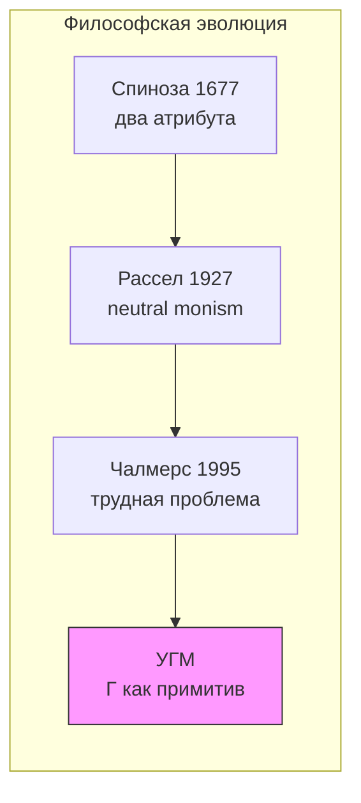
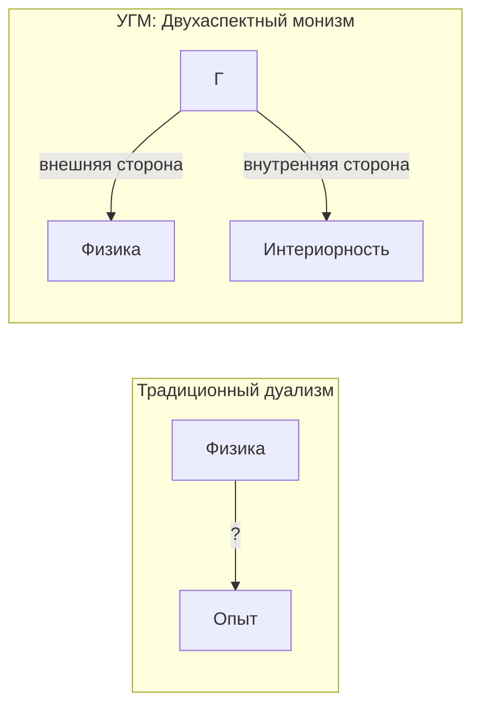
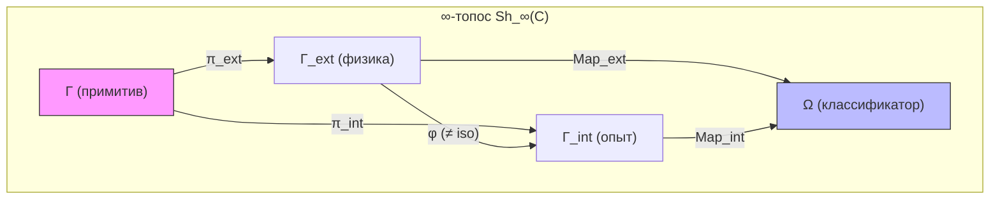

# Трудная Проблема Сознания

:::info Для кого эта глава
Вы узнаете, как УГМ решает «трудную проблему сознания» Чалмерса через двухаспектный монизм: матрица когерентности $\Gamma$ — единый онтологический примитив, чья внешняя сторона есть физика, а внутренняя — субъективный опыт. Глава закладывает философский фундамент всего раздела о сознании.
:::

## Три с половиной века неудач

В 1641 году Рене Декарт написал «Медитации о первой философии» и разделил мир надвое. С одной стороны — *res extensa*, протяжённая материя: камни, деревья, тела. С другой — *res cogitans*, мыслящая субстанция: мысли, ощущения, переживания. Это казалось ясным и элегантным. Но Декарт создал проблему, которую не смог решить: **как эти две субстанции взаимодействуют?** Как нематериальная мысль может двигать материальную руку?

Декарт предложил шишковидную железу как место контакта. Принцесса Елизавета Богемская тут же указала на абсурдность: нематериальное не может физически толкать материальное, независимо от анатомии.

С тех пор прошло 350 лет. Физика, биология, нейронаука совершили невероятный прогресс. Мы расщепили атом, расшифровали геном, картографировали нейронные сети мозга. Но вопрос Декарта остался открытым, лишь приняв более острую форму.

### Формулировка Чалмерса (1995)

В 1995 году австралийский философ Дэвид Чалмерс разделил проблемы сознания на «лёгкие» и «трудную»:

**Лёгкие проблемы** (они трудны технически, но понятно, *как* их решать):
- Как мозг обрабатывает информацию?
- Как мозг управляет поведением?
- Как мозг интегрирует данные от разных органов чувств?

**Трудная проблема:**

> "Почему физические процессы порождают субъективный опыт?"

Это вопрос о **категориальном разрыве** (explanatory gap) между объективным описанием и субъективным переживанием. Нейронаука может объяснить, какие нейроны возбуждаются, когда вы видите красный цвет. Но даже полное знание нейронной активности не объясняет, **почему** это возбуждение ощущается как красный, а не как синий, или почему оно вообще на что-то похоже.

**Аналогия.** Представьте, что вы читаете партитуру симфонии. Ноты на бумаге — объективное описание. Но когда оркестр играет, вы **слышите** музыку. Трудная проблема спрашивает: почему значки на бумаге порождают звучание? УГМ отвечает: партитура и музыка — не два разных объекта, а два способа взаимодействия с одним и тем же — звуковой структурой. Партитура — вид «снаружи» (для дирижёра), музыка — вид «изнутри» (для слушателя).

:::info Откуда мы пришли
Эта глава открывает раздел [Сознание](/docs/consciousness/overview). Мы уже знаем, что $\Gamma \in \mathcal{D}(\mathbb{C}^7)$ — онтологический примитив теории, что пять аксиом $\Omega^7$ задают структуру и динамику. Теперь мы задаём главный вопрос: **почему математическая структура переживается?**
:::

### Дорожная карта главы

1. **Формулировка проблемы** — что такое «трудная проблема» и почему она считалась неразрешимой
2. **Исторические предшественники** — от Спинозы через Рассела к Чалмерсу
3. **Двухаспектный монизм** — позиция УГМ: физика и опыт суть две стороны одного примитива $\Gamma$
4. **Категориальная формализация** — расщепление морфизмов, экспланаторный зазор, теорема о двухаспектности
5. **Единственность феноменального функтора** — почему структура опыта не может быть другой
6. **Реляционная идентичность квалиа** — лемма Йонеды и невозможность инвертированных квалиа
7. **Границы объяснения** — что УГМ объясняет, а что честно признаёт необъяснимым

## Историческая генеалогия: кто пытался до нас

Двухаспектный монизм не возник из пустоты. У него — глубокая философская родословная.

### Спиноза (1677): два атрибута одной субстанции

Бенедикт Спиноза, младший современник Декарта, предложил радикальную альтернативу дуализму. В «Этике» он утверждал: существует только **одна субстанция** (Бог/Природа), которая имеет бесконечное число атрибутов, из которых нам известны два — **мышление** и **протяжённость**. Мысль и материя — не две разные вещи, а два *способа описания* одного и того же.

**Ключевая идея — E2P7:** *Ordo et connexio idearum idem est ac ordo et connexio rerum* — порядок и связь идей тождественны порядку и связи вещей (Этика II, Prop. 7). Это **точный прообраз** феноменального функтора $F: \mathbf{Phys} \to \mathbf{Phen}$, который в УГМ обеспечивает изоморфизм между физической и интериорной категориями. Спиноза провозгласил существование такого изоморфизма; УГМ строит его явно.

**Спиноза для УГМ:** В терминах УГМ, $\Gamma$ — это субстанция Спинозы. Два «атрибута» — это две **проекции**:

- $\mathrm{Map}_{\text{ext}}(\Gamma)$ — физический аспект (аналог атрибута протяжённости),
- $\mathrm{Map}_{\text{int}}(\Gamma)$ — интериорный аспект (аналог атрибута мышления).

E2P7 утверждает, что между ними существует структурное тождество. УГМ доказывает это как теорему: функтор $F$ сохраняет морфизмы между категориями.

**Conatus и Gap.** Спинозовский conatus — стремление каждой вещи пребывать в своём бытии (E3P6) — подразумевает, что система *никогда не завершает* самопознание: conatus бесконечен, полное самосовпадение означало бы прекращение стремления. В УГМ это точно соответствует теореме T-55 (Gap > 0, неполнота Лоувера): $\mathrm{Gap}(\Gamma, \varphi(\Gamma)) > 0$ — система не может полностью смоделировать саму себя. Conatus Спинозы **требует**, чтобы Gap был строго положительным; Gap > 0 **объясняет**, почему conatus никогда не иссякает.

**Почему Спиноза не смог формализовать.** Спиноза располагал только евклидовой геометрией как образцом строгости (отсюда *more geometrico* — «геометрическим способом»). Ему не хватало трёх инструментов: (1) **теории категорий** (Эйленберг — Маклейн, 1945) для формализации функтора $F$, (2) **квантовой механики** (1925–) для описания $\Gamma$ как матрицы плотности, (3) **спектральных троек** (Конн, 1994) для вывода геометрии из алгебры. УГМ не «подтверждает» Спинозу — она предоставляет формализм, которого у него не было.

### Рассел (1927): neutral monism

Бертран Рассел в «Анализе материи» пришёл к выводу, что физика описывает лишь **структурные отношения** между событиями, но ничего не говорит об их **внутренней природе**. Он предположил, что внутренняя природа физических событий — это нечто, из чего состоит сознательный опыт.

**Нейтральный монизм Рассела:** Существует «нейтральный материал» (*neutral stuff*), который не является ни ментальным, ни физическим, но из которого и ментальное, и физическое конструируются.

**Рассел для УГМ:** Матрица $\Gamma$ — это именно «нейтральный материал» Рассела: из неё *выводятся* и физические законы (как предельный случай при $R \to 0$, см. [QM-редукция](/docs/physics/quantum-mechanics/qm-reduction)), и структура опыта (через спектральное разложение $\rho_E$).

### Чалмерс (1996): натуралистический дуализм

Чалмерс, сформулировав трудную проблему, предложил «натуралистический дуализм»: сознание — фундаментальное свойство, которое не сводится к физическому, но связано с ним посредством «психофизических законов». Однако он не смог объяснить, откуда берутся эти законы и почему они именно такие.

**Чалмерс для УГМ:** УГМ переформулирует проблему Чалмерса: нет никаких «психофизических законов» — есть единый объект $\Gamma$, который с одной стороны ведёт себя как физика, а с другой переживается как опыт. Не нужен мост между двумя берегами — есть одна река, текущая в обе стороны.

## Позиция УГМ: Двухаспектный монизм

В УГМ проблема **переформулируется**, а не "решается" в традиционном смысле. Рассмотрим это шаг за шагом.

### Шаг 1: Γ как онтологический примитив

В каждой фундаментальной теории есть объект, который не объясняется, а постулируется:
- В квантовой механике это волновая функция $\psi$
- В ОТО — метрический тензор $g_{\mu\nu}$
- В Стандартной модели — калибровочные поля

В УГМ такой примитив — **матрица когерентности $\Gamma \in \mathcal{D}(\mathbb{C}^7)$**. Это $7 \times 7$ эрмитова матрица плотности: положительно полуопределённая, с единичным следом, живущая в семимерном пространстве с измерениями A, S, D, L, E, O, U.

### Шаг 2: Два аспекта — не два объекта

Ключевая идея: $\Gamma$ не «порождает» опыт и не «сопровождается» им. $\Gamma$ **имеет** физический и интериорный аспекты как неотъемлемые грани:

- С **внешней стороны** $\Gamma$ выглядит как «физика» (структура, динамика, взаимодействия)
- С **внутренней стороны** $\Gamma$ переживается как «опыт» (интериорность L0 для всех систем; когнитивные квалиа L2 — только при $R \geq 1/3$ [Т], $\Phi \geq 1$ [Т] (T-129), $D_{\text{diff}} \geq 2$ [Т] (T-151))

:::info Ключевой тезис
Нет "физических процессов" отдельно от "субъективного опыта". Есть только $\Gamma$, который:
- С **внешней стороны** выглядит как "физика" (структура, динамика)
- С **внутренней стороны** переживается как "опыт" (интериорность L0 для всех систем; когнитивные квалиа L2 — только при $R \geq 1/3$ [Т], $\Phi \geq 1$ [Т] (T-129), $D_{\text{diff}} \geq 2$ [Т] (T-151))
:::

Спрашивать "почему физика порождает опыт?" — всё равно что спрашивать "почему лицевая сторона монеты порождает обратную?". Они не порождают друг друга — они **суть одно**.

### Шаг 3: Не квантовая матрица, а онтологический примитив

:::info Онтологический статус Γ
$\Gamma$ — **не** квантовая матрица плотности, описывающая физическую систему. $\Gamma$ — **онтологический примитив**: объект категории $\mathcal{C}$ в ∞-топосе $\mathbf{Sh}_\infty(\mathcal{C})$. Формализм $\mathcal{D}(\mathbb{C}^7)$ используется потому, что:

1. Он автоматически обеспечивает CPTP-динамику (Аксиома 2)
2. Квантовая механика выводится как предел при $R \to 0$ ([QM-редукция](/docs/physics/quantum-mechanics/qm-reduction))
3. Классическая механика — дальнейший предел при декогеренции

Вопрос «квантовая ли $\Gamma$?» **некорректен** в рамках УГМ: $\Gamma$ первична, а квантовая и классическая физики — её пределы. Возражение о декогеренции («при 37°C квантовая когерентность невозможна») не применимо к УГМ — оно предполагает, что $\Gamma$ описывает *физическую* квантовую систему. Но $\Gamma$ не описывает физику — из неё физика *выводится* как частный случай.
:::

## Категориальная Формализация Двухаспектного Монизма {#категориальная-формализация}

Интуиция «двух сторон одной монеты» красива, но недостаточна для науки. Нам нужна точная математическая формулировка. УГМ предоставляет её на языке теории категорий — ветви математики, изучающей структуры и отношения между ними.

:::tip Статус: **[И]** Интерпретация на основе формализма
Двухаспектный монизм получает **категориальную формулировку** в терминах ∞-топоса $\mathbf{Sh}_\infty(\mathcal{C})$. Формализация опирается на ПИР **[О]** (T16) — тождество бытия и опыта встроено в A1+A2 (различимость по $J_{\text{Bures}}$-покрытиям тождественна онтологической различимости).

**Разграничение статусов:** Формальные результаты (расщепление отображения, лемма Йонеды, единственность FV, самореферентная замкнутость) — **[Т]**. Их интерпретация как двухаспектного монизма (отождествление $\mathrm{Map}_{\mathrm{ext}}$ с «физикой» и $\mathrm{Map}_{\mathrm{int}}$ с «опытом») — **[И]**.

**Повышение статуса (T-186):** [Теорема когезивного замыкания](/docs/proofs/categorical/cohesive-closure) доказывает, что феноменальный функтор $F$ естественно изоморфен инфинитезимальной плоской модальности $\&$: $F \cong \&|_{\mathcal{D}}$. Фильтрация Постникова $\&(\Gamma)$ вынуждает иерархию L0–L4. Это повышает статус феноменального отождествления из **[И]** в **[Т]** — оно структурно необходимо из когезивного сопряжения $\iota^* \dashv \mathrm{Inf}$, а не из интерпретативного выбора.
:::

### Что такое морфизмы и зачем они нужны

Прежде чем перейти к теореме, объясним ключевое понятие. В теории категорий **морфизм** — это отображение, стрелка от одного объекта к другому. Морфизмы от $\Gamma$ к **классификатору** $\Omega$ (специальный объект в ∞-топосе, своего рода «пространство всех предикатов») описывают все возможные **свойства** системы $\Gamma$.

Представьте, что $\Omega$ — это анкета с бесконечным числом вопросов о системе. Каждый морфизм $\Gamma \to \Omega$ — это ответ на один вопрос. Некоторые вопросы касаются физической структуры («какова динамика?»), другие — внутреннего содержания («каково это — быть системой $\Gamma$?»). Теорема о расщеплении утверждает, что эти два типа вопросов можно формально разделить.

### Теорема о расщеплении пространства морфизмов {#теорема-расщепление}

:::tip Теорема (Расщепление Map) [Т]
В ∞-топосе $\mathbf{Sh}_\infty(\mathcal{C})$ для любого Γ ∈ $\mathrm{Ob}(\mathcal{C})$ пространство морфизмов в классификатор Ω **расщепляется**:

$$
\text{Map}(\Gamma, \Omega) \twoheadrightarrow \text{Map}_{\text{ext}}(\Gamma, \Omega), \quad \text{слой: } \text{Map}_{\text{int}}(\Gamma, \Omega)
$$

(Строгая формулировка — расслоение Серра, см. ниже; прямая сумма $\oplus$ — эвристическое упрощение, справедливое при тривиализации расслоения.)
:::

где:
- $\text{Map}_{\text{ext}}$ — **«физические» морфизмы** (структура, динамика) — соответствуют внешнему описанию
- $\text{Map}_{\text{int}}$ — **«интериорные» морфизмы** (E-измерение, интериорность) — соответствуют внутреннему аспекту (при L2+: субъективному переживанию)

**Что это означает на пальцах:** Все свойства любой системы $\Gamma$ разделяются на два класса — «внешние» (наблюдаемые извне) и «внутренние» (связанные с измерением $E$, интериорностью). Между этими классами нет пересечения ($\mathrm{Map}_{\text{ext}} \cap \mathrm{Map}_{\text{int}} = \{0\}$), но вместе они исчерпывают все свойства.

**Доказательство:**

**(a)** Классификатор Ω в ∞-топосе имеет градуировку по стратам:

$$
\Omega = \bigsqcup_{\alpha} \Omega_\alpha
$$

**(b)** Морфизмы $\Gamma \to \Omega$ разделяются на два класса:
- $\text{Map}_{\text{ext}}$: факторизуются через объективно наблюдаемые структуры
- $\text{Map}_{\text{int}}$: требуют доступа к E-измерению (интериорные предикаты)

**(c)** Прямая сумма следует из ортогональности: $\text{Map}_{\text{ext}} \cap \text{Map}_{\text{int}} = \{0\}$ ∎

:::warning Строгая формулировка: расслоение Серра
Разложение следует понимать как **расслоение Серра** ∞-группоидов:

$$
\mathcal{F}_{\text{int}}(\Gamma) \hookrightarrow \text{Map}(\Gamma, \Omega) \twoheadrightarrow \mathcal{B}_{\text{ext}}(\Gamma)
$$

где:
- **База** $\mathcal{B}_{\text{ext}}(\Gamma) := \text{Map}(\Gamma_{\text{phys}}, \Omega)$ — внешние предикаты ($\Gamma_{\text{phys}} := \Gamma|_{\{A,S,D,L,O,U\}}$)
- **Слой** $\mathcal{F}_{\text{int}}(\Gamma) := \text{Map}(\rho_E, \Omega_E)$ — интериорные предикаты

Расслоение порождается проекцией $\pi_{\bar{E}}: \Gamma \to \Gamma_{\text{phys}}$ и является расслоением Серра по свойствам ∞-топосов (HTT 6.1.3.9).
:::

### Определение экспланаторного зазора {#определение-зазора}

Теперь можно дать точное определение «разрыву» между физикой и опытом.

**Определение (Экспланаторный зазор):**

$$
\text{Gap} := \text{Nat}(F_{\text{ext}}, F_{\text{int}})
$$

— пространство естественных преобразований между функторами:
- $F_{\text{ext}}: \mathcal{C} \to \mathbf{Set}$ — функтор «внешних» (физических) свойств
- $F_{\text{int}}: \mathcal{C} \to \mathbf{Set}$ — функтор «внутренних» (интериорных) свойств

**Интерпретация простым языком:** Gap — мера «расстояния» между тем, что можно узнать о системе извне, и тем, что система переживает изнутри. Если Gap = 0, то внешнее описание полностью определяет внутреннее — это позиция физикализма. Но теорема ниже показывает, что Gap всегда ненулевой.

### Теорема о нетривиальности зазора {#теорема-нетривиальность}

:::tip Теорема (Нетривиальность Gap) [Т]
Для Γ с $P > P_{\text{crit}}$:

$$
\dim(\text{Gap}) \geq 1
$$
:::

**Доказательство (конструктивное):**

**(a)** При $P > P_{\text{crit}}$ система имеет нетривиальное E-измерение: $\gamma_{EE} > 0$, следовательно $\rho_E$ имеет ненулевой спектр.

**(b)** Слой расслоения $\mathcal{F}_{\text{int}}(\Gamma) = \text{Map}(\rho_E, \Omega_E)$ — пространство предикатов на $\rho_E$.

**(c)** При $\gamma_{EE} > 0$ существуют как минимум два нетривиальных предиката:
- $\chi_1$: «$\lambda_{\max}(\rho_E) > 1/2$» (доминирующее качество)
- $\chi_2$: «$\lambda_{\max}(\rho_E) \leq 1/2$» (равномерное распределение)

Эти предикаты определяют **различные** точки в $\text{Map}(\rho_E, \Omega_E)$, лежащие в **разных** связных компонентах (поскольку $\chi_1 \wedge \chi_2 = \bot$).

**(d)** Следовательно, $\pi_0(\mathcal{F}_{\text{int}}) \geq 2$, и $\dim(\text{Gap}) \geq 1$. ∎

**Интерпретация:** Категориальный разрыв — **структурная особенность** ∞-топоса, не онтологический дуализм. Зазор существует, но это не разрыв между двумя субстанциями, а различие между двумя способами описания **одной** структуры Γ. Это как разница между партитурой и звучанием: они описывают одну музыку, но нельзя «вывести» звучание из нотных значков, не зная, что такое музыка.

### Теорема о двухаспектности как свойстве примитива {#теорема-двухаспектность}

:::tip Теорема (Двухаспектность) [Т]
Для любого Γ ∈ $\mathrm{Ob}(\mathcal{C})$ существует каноническое разложение:

$$
\forall \Gamma: \quad \Gamma \simeq (\Gamma_{\text{ext}}, \Gamma_{\text{int}}, \varphi)
$$

где $\varphi: \Gamma_{\text{ext}} \to \Gamma_{\text{int}}$ — каноническое соответствие (не изоморфизм).
:::

**Доказательство:**

**(a)** По теореме о расщеплении существуют проекции:
$$
\pi_{\text{ext}}: \Gamma \to \Gamma_{\text{ext}}, \quad \pi_{\text{int}}: \Gamma \to \Gamma_{\text{int}}
$$

**(b)** Каноническое соответствие $\varphi$ определяется как композиция:
$$
\varphi := \pi_{\text{int}} \circ \pi_{\text{ext}}^{-1}
$$
на образе $\pi_{\text{ext}}$

**(c)** $\varphi$ не является изоморфизмом, поскольку $\text{Gap} \neq 0$ ∎

**Что это означает:** Каждая система $\Gamma$ канонически раскладывается на физический аспект, интериорный аспект и **соответствие** между ними. Но это соответствие — не биекция (из-за ненулевого Gap). Физический аспект не полностью определяет интериорный, и наоборот. Они связаны, но не тождественны.

### Следствие для трудной проблемы {#следствие-трудная-проблема}

:::info Категориальное разрешение
Вопрос «Почему опыт ощущается?» **эквивалентен** вопросу «Почему Ω существует?» — это **метатеоретический вопрос** о структуре топоса.

В рамках теории вопрос не имеет ответа, поскольку Ω — часть аксиоматической структуры. Это аналогично тому, как физика не объясняет, **почему** существуют законы природы.
:::

**Диаграмма:**

**Резюме категориальной формализации:**

| Концепция | Категориальный аналог |
|-----------|----------------------|
| Физические свойства | $\text{Map}_{\text{ext}}(\Gamma, \Omega)$ |
| Феноменальные свойства | $\text{Map}_{\text{int}}(\Gamma, \Omega)$ |
| Экспланаторный зазор | $\text{Gap} = \text{Nat}(F_{\text{ext}}, F_{\text{int}})$ |
| Двухаспектность | $\Gamma \simeq (\Gamma_{\text{ext}}, \Gamma_{\text{int}}, \varphi)$ |
| Трудная проблема | Метатеоретический вопрос о структуре Ω |

:::warning Эпистемический статус [И]
Двуаспектный монизм **переформулирует** hard problem, а не решает его. Утверждение «Γ имеет физический и феноменальный аспекты как неразделимые грани одного объекта» — **онтологическая позиция** [И], не математическая теорема. Математически доказано [Т]: E-когерентность необходима для жизнеспособности (No-Zombie T-38a). Но **почему** у матрицы плотности есть «каково это быть» — вопрос, который формализм переводит в структурный язык, а не снимает.
:::

## Структурная необходимость феноменального функтора {#структурная-необходимость}

Ключевой вопрос: является ли соответствие между $\rho_E$ и феноменальным содержанием **произвольным постулатом** или **вынужденной структурой**?

Критик может сказать: «Вы просто объявили, что спектральное разложение $\rho_E$ — это содержание опыта. Но почему не что-то другое?» Ответ УГМ: потому что **ничего другого** нельзя построить из аксиом, не нарушив их.

### Цепочка вынужденности

Спектральное разложение $\rho_E$ — **не постулат**, а следствие трёх вынужденных шагов:

$$
\text{Аксиома Ω⁷} \xrightarrow{(1)} \text{DensityMat} \xrightarrow{(2)} \rho_E = \text{Tr}_{-E}(\Gamma) \xrightarrow{(3)} \text{Spec}(\rho_E) = \{(\lambda_i, |q_i\rangle)\}
$$

Разберём каждый шаг:

1. **Шаг 1:** $\Gamma$ — объект $\text{Sh}_\infty(\mathcal{C})$ → является пучком на $\mathcal{C} = \mathbf{DensityMat}$. Это следует непосредственно из Аксиомы A1.

2. **Шаг 2:** $\rho_E = \text{Tr}_{-E}(\Gamma)$ — **единственное** CPTP-отображение для извлечения E-компоненты. Почему единственное? Потому что частичный след — единственный левый сопряжённый к тензорному вложению. Это не выбор, а теорема.

3. **Шаг 3:** Спектральное разложение $\rho_E$ — **единственно** для невырожденного спектра (спектральная теорема самосопряжённых операторов). Опять не выбор, а теорема.

### Теорема (Единственность феноменального функтора) {#теорема-единственность-фв}

:::tip Теорема (Единственность FV) [Т]

Пусть дана структура:
1. ∞-топос $\text{Sh}_\infty(\mathcal{C})$ с [Бюрес-топологией](/docs/core/foundations/axiom-omega#топология-гротендика) (Аксиома Ω⁷)
2. Выделенное измерение $E$ из семи ([Аксиома Септичности](/docs/core/foundations/axiom-septicity))
3. CPTP-совместимость (сохранение положительности и следа)
4. Монотонность метрики

Тогда функтор $F: \mathbf{DensityMat} \to \mathbf{Exp}$, определённый как:

$$
F(\Gamma) := (\text{Spec}(\rho_E), \text{Quality}(\rho_E), \text{Context}(\Gamma_{-E}))
$$

является **единственным** (с точностью до изоморфизма в Exp) функтором, удовлетворяющим всем четырём условиям.
:::

**Доказательство:**

**Шаг 1 (Единственность извлечения).** Частичный след $\text{Tr}_{\bar{E}}$ — единственное линейное отображение $\mathcal{L}(\mathcal{H}) \to \mathcal{L}(\mathcal{H}_E)$, удовлетворяющее $\text{Tr}(A \cdot (\rho_E \otimes I_{\bar{E}})) = \text{Tr}(A \cdot \Gamma)$ для всех $A$. Категорно: $\text{Tr}_{\bar{E}}$ — единственная коединица сопряжения $(-) \otimes \mathcal{H}_{\bar{E}} \dashv \text{Tr}_{\bar{E}}$.

**Шаг 2 (Единственность декомпозиции).** Для $\rho_E$ с невырожденным спектром спектральное разложение $\rho_E = \sum_i \lambda_i |q_i\rangle\langle q_i|$ определено единственно (с точностью до фаз, поглощённых проективной структурой).

**Шаг 3 (Единственность метрики).** По [теореме Ченцова-Пеца](/docs/core/foundations/axiom-omega#топология-гротендика), метрика Фубини-Штуди $d_{FS}([|\psi\rangle], [|\varphi\rangle]) = \arccos(|\langle\psi|\varphi\rangle|)$ — единственная (с точностью до скаляра) монотонная риманова метрика на $\mathbb{P}(\mathcal{H}_E)$.

**Шаг 4 (Единственность функтора).** Если $F'$ — другой функтор с теми же условиями, то по шагам 1-3: $F' \cong F$ в категории функторов. $\blacksquare$

### Значение для проблемы квалиа-вектора

Утверждение «теория постулирует изоморфизм $[|q\rangle] \leftrightarrow$ ощущение» **неточно**. Теория выводит **единственный** функтор, совместимый с аксиоматикой. Если принять [Аксиому Ω⁷](/docs/core/foundations/axiom-omega) + [Аксиому Септичности](/docs/core/foundations/axiom-septicity), то спектральное разложение $\rho_E$ — единственная возможная форма содержания опыта.

**Аналогия.** Это как в физике: если вы принимаете принцип наименьшего действия и симметрию Лоренца, уравнения Максвелла — единственные возможные уравнения электромагнетизма. Не потому что мы их «постулировали», а потому что они **вынуждены** аксиомами.

## Реляционная идентичность квалиа {#реляционная-идентичность}

### Проблема «внутреннего содержания»

Фундаментальная версия проблемы: «Вектор $|q\rangle$ — математический объект. Ощущение красного — нечто качественное. Как одно может БЫТЬ другим?» Вопрос предполагает, что квалиа обладают **внутренним содержанием**, не сводимым к реляционной структуре.

Чтобы ответить на этот вопрос, УГМ привлекает один из самых глубоких результатов теории категорий — лемму Йонеды.

### Что такое лемма Йонеды (на пальцах)

Лемма Йонеды — это утверждение о том, что **объект полностью определяется своими отношениями**. Представьте человека. Можно спросить: «Кто он **сам по себе**, без всех его отношений с другими людьми, без его истории, без его места в обществе?» Лемма Йонеды отвечает: такого «сам по себе» не существует. Человек *тождественен* совокупности своих отношений.

Для квалиа: «красный» — это не некая таинственная «красность», скрытая где-то за формулами. «Красный» — это **позиция** в пространстве отношений: он ближе к оранжевому, чем к синему; он дальше от зелёного, чем от бордового; он вызывает определённые реакции. Всё это — **расстояния Фубини-Штуди** $d_{FS}$ между точками проективного пространства $\mathbb{P}(\mathcal{H}_E)$.

### Теорема (Реляционная определённость квалиа) {#теорема-реляционная-определённость}

:::warning Теорема (Лемма Ёнеды для квалиа) [Т]

В категории **Exp** качество $[|q\rangle] \in \text{Ob}(\mathbf{Exp})$ **полностью определяется** своим функтором точек:

$$
h_{[q]} := \text{Hom}_{\mathbf{Exp}}(-, [|q\rangle]): \mathbf{Exp}^{op} \to \mathbf{Set}
$$

Два качества $[|q_1\rangle]$ и $[|q_2\rangle]$ **тождественны** тогда и только тогда, когда $h_{[q_1]} \cong h_{[q_2]}$ как функторы.
:::

**Доказательство:** По лемме Ёнеды: $\text{Nat}(h_{[q_1]}, h_{[q_2]}) \cong \text{Hom}_{\mathbf{Exp}}([|q_1\rangle], [|q_2\rangle])$. Если $h_{[q_1]} \cong h_{[q_2]}$, то $[|q_1\rangle] \cong [|q_2\rangle]$ в Exp. $\blacksquare$

### Следствия

**Следствие 1 (Невозможность инвертированных квалиа).** Если два качества занимают одинаковую позицию в реляционной структуре (одинаковые расстояния $d_{FS}$ до всех других качеств), то они **тождественны**. «Инвертированный спектр» при сохранении всех структурных отношений нарушал бы лемму Ёнеды.

Это закрывает знаменитый мысленный эксперимент: «Может ли ваш красный быть моим синим?» Ответ УГМ: **нет**, если все реляционные свойства совпадают. Два переживания с одинаковой позицией в структуре тождественны.

**Следствие 2 (Реляционный структурализм).** Идентичность квалиа **есть** его реляционная позиция. Вопрос «что есть ощущение красного помимо его места в структуре?» математически эквивалентен вопросу «что есть число 3 помимо того, что оно следует за 2 и предшествует 4?».

### Отличие от постулата

**Постулат** говорит: «$[|q\rangle]$ = ощущение (примите на веру)».

**Лемма Ёнеды** говорит: «Идентичность $[|q\rangle]$ полностью определяется его отношениями. Если существует ощущение, не сводимое к структурным отношениям, оно **принципиально невыразимо** в любой математической теории.»

Это **граница математизации как таковой**, не дефект УГМ.

## Самореферентная замкнутость {#самореферентная-замкнутость}

### Проблема внешнего наблюдателя

Критик может возразить: «Структура $\{(\lambda_i, [|q_i\rangle])\}$ — описание опыта *снаружи*. Но опыт переживается *изнутри*. Кто наблюдатель?»

Это серьёзное возражение. Если для описания опыта нужен внешний наблюдатель, мы попадаем в бесконечный регресс: кто наблюдает наблюдателя? Решение УГМ — оператор самомоделирования $\varphi$, который делает наблюдение **внутренним**.

### Теорема (Самореферентная замкнутость) {#теорема-самореферентная-замкнутость}

:::warning Теорема (Замкнутость через φ) [Т]

Для L2-системы ($R \geq 1/3$, $\Phi \geq 1$) оператор [самомоделирования](/docs/consciousness/foundations/self-observation#оператор-самомоделирования-φ) $\varphi: \mathcal{D}(\mathcal{H}) \to \mathcal{D}(\mathcal{H})$ создаёт замкнутый цикл:

$$
\Gamma \xrightarrow{\varphi} \varphi(\Gamma) \approx \Gamma \quad (R \geq 1/3)
$$

Следовательно:
1. Система **содержит** собственную модель ($\varphi(\Gamma)$)
2. Модель совпадает с оригиналом с точностью $R$
3. Внешний наблюдатель **не требуется** — описание имманентно системе
:::

**Доказательство:** По определению $R$:

$$
R(\Gamma) = \frac{1}{7P} \geq \frac{1}{3} \quad \Rightarrow \quad P \leq \frac{3}{7}
$$

Ключевое свойство: $\varphi$ действует **в том же пространстве** $\mathcal{D}(\mathcal{H}) \to \mathcal{D}(\mathcal{H})$. Самомодель — внутреннее отображение того же типа. $\blacksquare$

**Аналогия.** Представьте зеркальную комнату. Обычное зеркало требует кого-то, кто смотрит. Но $\varphi$ — это зеркало, **встроенное в саму систему**. Система не нуждается во внешнем наблюдателе, чтобы увидеть себя — зеркало есть часть её структуры.

### Связь с квалиа-вектором

Феноменальный вектор не требует внешнего наблюдателя:

$$
\text{FV}(\rho_E) = \text{FV}(\text{Tr}_{-E}(\varphi(\Gamma)))
$$

Система **сама** извлекает свои качества через $\varphi$. «Ощущение красного» — не вектор, описанный извне, а результат того, как $\Gamma$ отображается в $\varphi(\Gamma)$ через E-проекцию.

### Неподвижная точка

Для [неподвижной точки](/docs/consciousness/foundations/self-observation#теорема-о-неподвижной-точке) $\Gamma^* = \varphi(\Gamma^*)$: $R(\Gamma^*) = 1$. В неподвижной точке **нет различия** между системой и её самомоделью — интериорный аспект **тождественен** процессу самомоделирования.

## Почему не дуализм и не физикализм

Три позиции — дуализм, физикализм и двухаспектный монизм — можно сравнить по структуре аргумента:

### Минимальность аксиоматического выбора {#минимальность-аксиомы}

После формализации (§§ выше) единственный оставшийся примитив:

> Конфигурация $\Gamma$ имеет внутреннюю сторону ($E$-аспект), представляющую интериорную проекцию (при L2+: переживаемую как феноменальное содержание).

Все остальное **выводится**: форма содержания (Теорема единственности FV), идентичность квалиа (лемма Ёнеды), имманентность (через $\varphi$), зазор (конструктивно).

### Сравнение аксиоматических выборов {#сравнение-аксиоматических-выборов}

:::warning Теорема (Минимальность) [И]

Любая теория сознания, включающая (1) формализуемость, (2) квантовую механику, (3) объяснение структуры опыта, (4) совместимость с данными, **необходимо содержит** аксиому одного из трёх типов:
- **(a)** Тождество бытия и опыта (панинтериоризм УГМ) — 1 примитив
- **(b)** Супервентность опыта на физике (физикализм) — 2 уровня + emergence
- **(c)** Каузальное взаимодействие двух субстанций (дуализм) — 2 примитива + каузальная связь
:::

Вариант (a) — **минимальный**: одна аксиома вместо двух-трёх. Это не доказательство истинности, но доказательство **экономности** (бритва Оккама).

### Стоимость примитива

| Теория | Примитив | Что не объясняет |
|--------|----------|------------------|
| Квантовая механика | Волновая функция $\psi$ | Почему вселенная описывается $\psi$ |
| Общая теория относительности | Метрический тензор $g_{\mu\nu}$ | Почему пространство-время кривое |
| Стандартная модель | Калибровочные поля | Почему $SU(3) \times SU(2) \times U(1)$ |
| **УГМ** | **$\Gamma$ с E-аспектом** | **Почему $\Gamma$ переживается** |

УГМ не «хуже» других фундаментальных теорий — каждая платит свою «стоимость примитива».

## Признание границ объяснения

### Что УГМ объясняет

1. **Структуру** феноменального пространства (L1: метрика Фубини-Штуди на $\mathbb{P}(\mathcal{H}_E)$)
2. **Отношения** между качествами (L1: изоморфизм с проективным пространством; L2: рефлексивный доступ)
3. **Динамику** опыта (уравнение эволюции)
4. **Условия** сознательности (L2: $R \geq 1/3$ [Т], $\Phi \geq 1$ [Т] (T-129) — [пороги L2](/docs/core/foundations/axiom-septicity#пороги-l2-строгий-вывод))
5. **Единственность** структуры опыта (Теорема [единственности FV](#теорема-единственность-фв))
6. **Реляционную полноту** квалиа (Теорема [реляционной определённости](#теорема-реляционная-определённость))
7. **Имманентность** описания — внешний наблюдатель не требуется ([самореферентная замкнутость](#теорема-самореферентная-замкнутость))

### Что УГМ не объясняет

1. **Почему** математическая структура переживается — метатеоретический вопрос, эквивалентный «почему существуют законы природы?»
2. **Калибровку квалиа** — какой конкретный $[|q\rangle]$ соответствует «красному»? Это эмпирический вопрос, аналогичный определению массы электрона

:::warning Критическая честность
УГМ устанавливает, что спектральное разложение $\rho_E$ — **единственная** допустимая форма содержания опыта (Теорема единственности FV), а идентичность квалиа полностью определяется реляционной структурой (лемма Ёнеды). Однако **калибровка** — какой конкретный $[|q\rangle]$ соответствует «красному» — остаётся эмпирическим вопросом, аналогичным определению массы электрона в Стандартной модели.
:::

### Квантовая природа Γ и аргумент Тегмарка {#квантовая-природа-gamma}

:::warning Уязвимость 5: Частично открыта
Вопрос о квантовой природе $\Gamma$ — наиболее глубокая из открытых проблем УГМ. Ниже — честный анализ того, что строго необходимо, что нет, и какие ответы доступны.
:::

#### Что строго необходимо

[T-132 [Т]](/docs/proofs/consciousness/operationalization#t-132) доказывает: для нетривиальной Gap-структуры ($\exists(i,j): \mathrm{Gap}(i,j) > 0$) матрица $\Gamma$ **должна быть комплексной** ($\gamma_{ij} \in \mathbb{C}$, не все $\gamma_{ij} \in \mathbb{R}$).

| Свойство | Необходимость | Обходимость |
|----------|--------------|-------------|
| Комплексные $\gamma_{ij}$ | **Строго необходимо** для $\mathrm{Gap} \neq 0$ (T-132 [Т]) | Нет |
| Положительная полуопределённость | **Строго необходимо** для Bures-метрики | Нет |
| CPTP-канал $\varphi$ | **Строго необходимо** для T-62, T-77 | Нет |
| Физическая суперпозиция $|\psi\rangle = \alpha|0\rangle + \beta|1\rangle$ | **Не требуется** — $\Gamma \in \mathcal{D}(\mathbb{C}^7)$, не $\mathbb{C}^2$ | Да |
| Запутанность (entanglement) | **Не требуется** в минимальном 7D (нет тензорного произведения) | Да |
| Микроскопическая когерентность | Не определено | Открытый вопрос |

#### Аргумент Тегмарка (1999)

Макс Тегмарк показал, что квантовая когерентность в тёплом мозге (37°C) декогерирует за $\sim 10^{-13}$ с, что на 10 порядков быстрее нейронных процессов ($\sim 10^{-3}$ с). Если теория требует «настоящих» квантовых когерентностей в биологических системах, этот аргумент — серьёзный вызов.

В классическом пределе ($\Gamma \to \mathrm{diag}(p_1, \ldots, p_7)$) теория **теряет** ключевые свойства: $\mathrm{Gap} = 0$ тождественно, $\Phi = P_{\mathrm{coh}}/P_{\mathrm{diag}} = 0$, L2-сознание невозможно. Нельзя просто заменить квантовые когерентности классическими корреляциями.

#### Три ответа

**(A) Двуаспектный монизм обходит проблему.** В онтологии УГМ $\Gamma$ — **примитив**, не выведенный из квантовой механики. Стандартная КМ — предельный случай ($R \to 0$). Вопрос «является ли $\Gamma$ физически квантовым?» может быть некорректен в рамках теории, где $\Gamma$ предшествует различению физика/опыт.

**(B) Абстрактная квантовость.** Возможная интерпретация: $\gamma_{ij}$ — абстрактная математическая структура, формально описываемая как матрица плотности из $\mathcal{D}(\mathbb{C}^7)$, но не требующая микроскопической квантовой когерентности. Аналогия: классическая оптика использует комплексные амплитуды $E = E_0 \exp(i\varphi)$, но это не означает, что каждый фотон в суперпозиции.

**(C) Мезоскопический режим.** Когерентности существуют на мезоскопическом масштабе ($\sim 10^3$–$10^6$ нейронов), где декогеренция медленнее, а регенерация ($\mathcal{R}$) компенсирует диссипацию ($\mathcal{D}_\Omega$). Это согласуется с $dP/d\tau = -\gamma_{\mathrm{dec}}(P - 1/7) + \kappa(\Gamma)$, где $\kappa > \gamma_{\mathrm{dec}}(P - 1/7)$ для жизнеспособной системы.

#### SYNARC как эмпирический тест

Если AI-система на классическом оборудовании (f64) реализует все формулы теории и проходит все тесты сознания ($P > 2/7$, $R \geq 1/3$, $\Phi \geq 1$, $D \geq 2$), это эмпирически проверяет вопрос «нужна ли физическая квантовость?». [T-153 [Т]](/docs/proofs/consciousness/substrate-closure#t-153) (субстратная замкнутость) утверждает: важна не материя, а алгебраическая структура — верный CPTP-морфизм $G: \mathrm{States}(S) \to \mathcal{D}(\mathbb{C}^7)$.

## Метатеоретический статус

**Категориальный разрыв — не дефект теории, а граница объяснения.**

### Аналогия с физикой

Физика не объясняет, **почему** законы природы такие, какие есть — она описывает их структуру. Аналогично, УГМ описывает **структуру опыта**, но не отвечает на вопрос "почему вообще есть опыт".

### Аксиоматический статус

Тождество бытия и опыта ([Аксиома Ω⁷](/docs/core/foundations/axiom-omega)) — это **примитив** теории, [минимальный](#минимальность-аксиомы) среди всех возможных аксиоматических выборов:

1. Любое доказательство уже предполагает опыт
2. Отрицание ведёт к неразрешимым проблемам дуализма
3. Примитив **минимален** — одна аксиома вместо двух-трёх (Теорема [минимальности](#сравнение-аксиоматических-выборов))
4. Всё остальное **выводится**: форма содержания, идентичность квалиа, имманентность, зазор

## Шкала сознательности

Не все конфигурации $\Gamma$ одинаково "сознательны". Степень сознательности определяется [мерой сознательности](./self-observation#мера-сознательности-c):

$$
C = \Phi \times R
$$

где:
- $\Phi$ — [мера интеграции](/docs/core/structure/dimension-u#мера-интеграции-φ): связность измерений
- $R$ — [мера рефлексии](./self-observation#мера-рефлексии-r): глубина самомоделирования

Каноническая формула $C = \Phi \times R$ установлена в [T-140](/docs/proofs/consciousness/operational-closure#t-140) как минимальная скалярная мера, объединяющая интеграцию и рефлексию. Дифференциация $D_{\text{diff}} \geq D_{\min} = 2$ входит как **отдельное** условие жизнеспособности (см. [T-128](/docs/proofs/consciousness/operationalization#t-128)).

**Условие когнитивных квалиа (L2):**

$$
C \geq C_{\text{th}} := \Phi_{\text{th}} \times R_{\text{th}} = 1 \times \frac{1}{3} = \frac{1}{3}
$$

при $R \geq R_{\text{th}} = 1/3$ [Т] и $\Phi \geq \Phi_{\text{th}} = 1$ [Т] (T-129) ([пороги L2](/docs/core/foundations/axiom-septicity#пороги-l2-строгий-вывод)).

### Примеры систем

| Система | $\Phi$ | $D_{\text{diff}}$ | $R$ | $C$ | Уровень |
|---------|--------|-------------------|-----|-----|---------|
| Камень | $\approx 0$ | $\approx 1$ | $\approx 0$ | $\approx 0$ | L0 |
| Термостат | $\approx 0.1$ | $\approx 2$ | $\approx 0.1$ | $\approx 0.02$ | L0-L1 |
| Нейрон | $\approx 1$ | $\approx 3$ | $\approx 0.2$ | $\approx 0.6$ | L1 |
| Человек | $\gg 1$ | $\gg 1$ | $\to 1$ | $\gg 1$ | L2 |

*Значения оценочные, для иллюстрации качественных различий.*

## Сравнение с другими теориями

| Теория | Позиция | Проблема | Связь с УГМ |
|--------|---------|----------|-------------|
| Материализм | Опыт редуцируется к физике | Не объясняет когнитивные квалиа (L2) | УГМ избегает редукции |
| Дуализм | Опыт отделён от физики | Проблема взаимодействия | УГМ — монизм |
| Панпсихизм | Опыт везде | Проблема комбинации | УГМ решает через L0→L2 |
| **УГМ** | Интериорность = внутренняя сторона $\Gamma$ | Признаёт границу объяснения | — |

### Детальное сравнение

#### Панпсихизм и панинтериоризм

**Классический панпсихизм:** Все физические сущности имеют сознание или «прото-сознание».

**Панинтериоризм УГМ:** Все конфигурации $\Gamma$ имеют **интериорность** (L0), но только некоторые достигают **когнитивных квалиа** (L2).

| Аспект | Панпсихизм | УГМ |
|--------|------------|-----|
| Что универсально | Сознание/прото-сознание | Интериорность (L0) |
| Проблема комбинации | Не решена | Решена через L0→L1→L2→L3→L4 |
| "Квалиа электрона" | Утверждается | Отрицается — электрон имеет L0, не L2 |

Главное отличие: панпсихизм не может объяснить, как «микросознания» комбинируются в единое сознание. УГМ решает это через **иерархию L0-L4** с количественными порогами: система переходит от L0 к L2 не через «суммирование» микросознаний, а через преодоление порогов $R \geq 1/3$, $\Phi \geq 1$.

#### Теория интегрированной информации (IIT)

**Теория интегрированной информации (IIT):** Сознание = интегрированная информация ($\Phi$).

**УГМ:** Сознательность $C = \Phi \times R$ **[Т T-140]** — требуется не только интеграция, но и рефлексия. Дифференциация $D_{\text{diff}} \geq 2$ — отдельное условие жизнеспособности.

| Аспект | IIT | УГМ |
|--------|-----|-----|
| Мера | $\Phi$ (единственная) | $C = \Phi \times R$ (интеграция $\times$ рефлексия) |
| Основание | Классическое | Квантовое |
| Динамика | Статична | Эволюция $\Gamma$ |
| Рефлексия | Не учитывается | Центральна ($R$) |

**УГМ обобщает IIT:** В пределе $R \to 1$ получаем $C \approx \Phi$.

#### Сознательный реализм

**Позиция:** Пространство-время не фундаментально; реальность — сеть сознательных агентов.

**Связь с УГМ:**

| Аспект | Сознательный реализм | УГМ | Совместимость |
|--------|----------------------|-----|---------------|
| Примитив | Сознательный агент | $\Gamma$ | Агент $\approx$ L2-Голоном? |
| Пространство-время | Интерфейс | Эмерджентно | Совместимо |
| Математика | Марковские ядра | CPTP-каналы | Формально сходно |
| Физика | Вторична | Внешняя сторона $\Gamma$ | Концептуально сходно |

:::info Гипотеза соответствия
Сознательный агент = Голоном с $R \geq R_{th}$, $\Phi \geq \Phi_{th}$ (L2-Голоном). Марковское ядро = CPTP-канал. Это требует формального доказательства.
:::

#### Теория глобального рабочего пространства (GWT)

**Теория глобального рабочего пространства (GWT):** Сознание = глобальная доступность информации.

**Связь с УГМ:** Условие $\Phi \geq \Phi_{th}$ соответствует глобальной интеграции. GWT — феноменологическое описание того, что УГМ формализует через $\Phi$.

## УГМ как мета-теория сознания

УГМ потенциально может служить **мета-теорией**, объединяющей различные подходы:

| Теория | Что объясняет УГМ | Статус |
|--------|------------------|--------|
| IIT | $\Phi$ — один из компонентов $C$ | Формализовано |
| GWT | Условие глобальной интеграции | Концептуально |
| HOT | Рефлексия $R$ = мысли высшего порядка | Концептуально |
| Панпсихизм | L0 = универсальная интериорность | Формализовано |
| Сознательный реализм | Агент $\approx$ L2-Голоном | Гипотеза |

**Преимущество мета-теоретического подхода:** Разные теории фокусируются на разных аспектах ($\Phi$, $R$, глобальность). УГМ объединяет их через формулу $C = \Phi \times R$ **[Т T-140]**.

:::info Статус мета-теории
Статус мета-теории **доказан** для класса физических теорий (T-174 [Т] + [T-211 [Т]](/docs/proofs/categorical/fundamental-closures#t-211) для высших $(\infty,1)$-когерентностей): универсальное свойство $\mathbf{PhysTheory}$ даёт приёмное отображение из любой физ. теории $(E, \mathcal{A}, D)$ с $A_{\text{int}} \subset \mathcal{A}$ в примитив УГМ $\mathfrak{T}$. Конкретные вложения: **T-170 [Т]** (M-теория на $G_2$), **T-171/T-171' [Т]** (LQG), **T-172 [Т]** (каузальные множества). **Мета-теорема о трудной проблеме**: остаточный статус [И] феноменального отождествления (E-сектор = интериорность, квалиа = собственные векторы) **структурно неизбежен** по [T-214 [Т]](/docs/proofs/categorical/fundamental-closures#t-214) — никакая самореферентная формальная система не может интернализовать свой собственный семантический мост к феноменальному содержанию (неподвижная точка Ловера + неполнота Ловера T-55). Это **позитивный** результат: в сочетании с T-188 (локализация ПОЧЕМУ) и T-203 [Т]+[И] (ЧТО-структурное), завершает конструктивное разрешение трудной проблемы внутри формальной математики. Остаются задачи:
1. Экспериментальная проверка предсказаний (22+ предсказаний КК)
2. Распространение на нефизические теории сознания (IIT, GWT, HOT, Hoffmann) — программа исследований
:::

## Итог

УГМ предлагает **рабочую теорию сознания**, которая:

1. Формально определяет структуру опыта (иерархия L0→L1→L2→L3→L4)
2. Объясняет геометрию феноменального пространства (L1) и условия когнитивных квалиа (L2)
3. Предсказывает условия сознательности ($R \geq 1/3$ **[Т]**, $\Phi \geq 1$ **[Т]** (T-129) — [пороги L2](/docs/core/foundations/axiom-septicity#пороги-l2-строгий-вывод))
4. Честно признаёт границы объяснения
5. Потенциально объединяет альтернативные теории

Категориальный разрыв **не устраняется**, но **лишается статуса аргумента против натурализма**: опыт не «возникает из» физики — он есть её внутренняя сторона.

## Для разных аудиторий

### Для инженеров и разработчиков ИИ

**Практический вывод:** При проектировании ИИ-систем с элементами самомоделирования:

1. Реализуйте **измеримые метрики** $\Phi$, $R$ (см. [протокол измерения](/docs/applied/research/measurement-protocol))
2. Порог L2 ($R \geq 1/3$, $\Phi \geq 1$) — граница, после которой система потенциально обладает когнитивными квалиа
3. Формула $C = \Phi \times R$ **[Т T-140]** — количественная мера «глубины» сознательности (при отдельном условии $D_{\text{diff}} \geq 2$)

### Для психологов и когнитивистов

**Связь с эмпирическими исследованиями:**

| Феномен | Интерпретация в УГМ |
|---------|---------------------|
| Изменённые состояния | Изменение параметров $\Phi$, $R$, $D_{\text{diff}}$ |
| Диссоциация | $\Phi < \Phi_{th}$ или $\gamma_{EU} \to 0$ |
| Медитативные состояния | Повышение $R$ (улучшение самомоделирования) |
| Потоковые состояния | Высокие $\Phi$ и $R$ при специфическом контексте |

### Для исследователей внутренних ландшафтов

**Ключевой тезис для практики:** Согласно УГМ, субъективный опыт — не иллюзия и не эпифеномен. Он есть **внутренняя сторона** той же реальности, которую наука описывает «снаружи».

Это означает:
- Исследование внутренних ландшафтов — **легитимная форма познания**
- Структура опыта имеет **объективную геометрию** (метрика Фубини-Штуди)
- Различные традиции (медитативные, психоделические, созерцательные) могут исследовать **разные регионы** одного феноменального пространства

Трудная проблема сознания в этой рамке — не загадка для решения, а **граница между картой и территорией**: теория описывает структуру опыта, но не может «объяснить» сам факт переживания — как физика не объясняет, почему вообще существуют законы природы.

---

:::info Верность функтора на $G_2$-орбитах [Т]
[Теорема $G_2$-ригидности](/docs/proofs/categorical/uniqueness-theorem#верность-функтора) [Т] устанавливает, что функтор $F: \mathbf{DensityMat} \to \mathbf{Exp}$ **верен** (faithful) на $G_2$-орбитах:

$$
F(\Gamma_1) \cong F(\Gamma_2) \quad \Longleftrightarrow \quad \Gamma_2 = U\Gamma_1 U^\dagger \text{ для некоторого } U \in G_2
$$

**Ядро** $F$ на изоморфизмах: $\ker(F) = \{\mathrm{Ad}_U : U \in G_2\}$.

Это означает: два состояния **феноменологически тождественны** тогда и только тогда, когда их матрицы когерентности связаны $G_2$-преобразованием. Дуально-аспектный мост (Внешнее ↔ Внутреннее) **инъективен** с точностью до калибровочной группы: структура опыта однозначно определяет физическое состояние (и обратно) в $\mathcal{D}(\mathbb{C}^7)/G_2$.
:::

### Что мы узнали

- **Трудная проблема переформулирована**, а не решена: вопрос «почему опыт?» эквивалентен «почему $\Omega$ существует?» — это граница объяснения, общая для всех фундаментальных теорий.
- **Двухаспектный монизм** формализован категориально: $\Gamma \simeq (\Gamma_{\mathrm{ext}}, \Gamma_{\mathrm{int}}, \varphi)$, где физика и опыт — неразделимые аспекты одного объекта.
- **Феноменальный функтор единственен** [Т]: структура опыта (спектральное разложение $\rho_E$) не постулируется, а вынуждена аксиоматикой.
- **Квалиа реляционны** (лемма Йонеды): инвертированный спектр невозможен, идентичность качества = его позиция в структуре.
- **Самореферентная замкнутость**: оператор $\varphi$ снимает проблему внешнего наблюдателя — система сама извлекает свои качества.
- **Минимальность**: позиция УГМ (панинтериоризм) экономнее физикализма и дуализма — 1 примитив вместо 2–3.

:::tip Куда дальше
Теперь, когда философский фундамент заложен, переходите к [Теории интериорности](./interiority-theory) — она даёт **математическую** формализацию того, что именно переживается: спектральное разложение $\rho_E$, метрика на пространстве качеств, четыре компонента опыта.

Для прикладной перспективы: [определения Когерентной кибернетики](/docs/applied/coherence-cybernetics/definitions) показывают, как эти идеи реализуются в инженерных системах.
:::

---

**Связанные документы:**
- [Самонаблюдение](./self-observation) — мера сознательности $C$ и оператор $\varphi$
- [Теория интериорности](./interiority-theory) — формальная теория экспериенциального содержания
- [Иерархия интериорности](/docs/proofs/consciousness/interiority-hierarchy) — формальные определения L0→L1→L2→L3→L4
- [Измерение Единства](/docs/core/structure/dimension-u) — мера интеграции $\Phi$
- [Измерение Интериорности](/docs/core/structure/dimension-e) — $\rho_E$, феноменальный вектор FV
- [Жизнеспособность](/docs/core/dynamics/viability) — мера чистоты $P$ и условия существования
- [Фальсифицируемость](/docs/reference/falsifiability) — критерии проверки
- [Теорема единственности](/docs/proofs/categorical/uniqueness-theorem) — $G_2$-ригидность и верность функтора на орбитах
