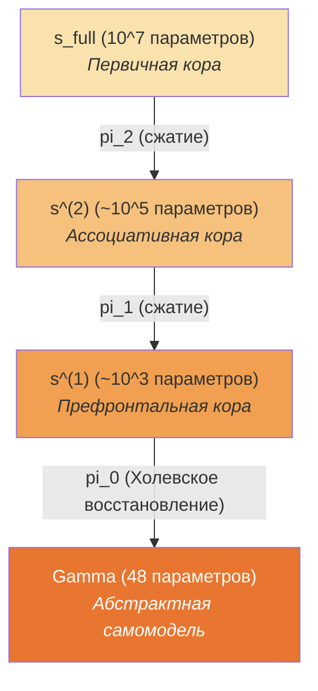
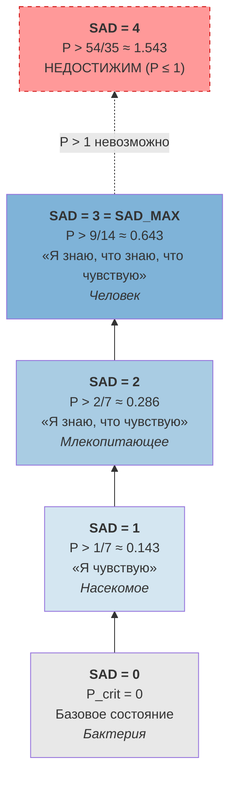

# Башня глубины самоосознания {#башня-глубины}

## Введение: «Вы когда-нибудь замечали, что замечаете?»

Попробуйте прямо сейчас. Вы читаете этот текст — это первый уровень: *восприятие*. Теперь заметьте, что вы читаете — это второй уровень: *осознание восприятия*. А теперь заметьте, что вы заметили, что вы читаете — это третий уровень: *осознание осознания восприятия*.

Можете ли вы пойти дальше? Заметить, что заметили, что заметили? На практике это даётся с трудом — мысль «ускользает», как отражение в двух зеркалах, поставленных друг напротив друга: бесконечный коридор, но с каждым шагом изображение тускнеет.

Оказывается, это не просто субъективное ощущение. В рамках УГМ доказано, что **глубина самоосознания фундаментально ограничена**: максимум — три уровня рекурсии. Не потому, что мозг «недостаточно мощный», а потому, что для четвёртого уровня потребовалась бы чистота $P > 1$ — а для нормированной матрицы плотности $P \leq 1$ по определению. Это аналогично тому, как скорость света ограничена не «недостатком двигателей», а структурой пространства-времени.

:::info Откуда мы пришли
В [иерархии интериорности](./interiority-hierarchy) мы определили дискретные уровни L0--L4. В [катастрофах перехода](./swallowtail-transitions) — динамику скачков между ними. Но дискретная классификация L0--L4 — грубая: два человека, оба формально L2, могут радикально различаться по глубине самоосознания. Башня глубины обобщает иерархию на непрерывную меру SAD (Self-Awareness Depth) и показывает, что **аналитический потолок глубины — SAD_MAX = 3**.
:::

### Дорожная карта главы

1. **Проблема** — почему одного числа $R$ недостаточно: самоосознание распределено по глубине
2. **Репрезентационная башня** — цепочка проекций от полного состояния до $\Gamma$
3. **Мера SAD** — максимальная глубина, на которой рефлексия превышает порог
4. **Спектральная формула** [Т] — вычисление SAD без построения всей башни
5. **SAD_MAX = 3** [Т] — аналитический потолок из Fano contraction $\alpha = 2/3$
6. **Биологические корреляты** — от бактерии (SAD=0) до человека (SAD $\leq$ 3)
7. **Динамика глубины** — рост через $A_4$-бифуркацию, энергетическая стоимость, стресс-зависимость

**Аналогия: небоскрёб самоосознания.** Представьте здание. Первый этаж — базовые ощущения ($\Gamma$): «мне тепло». Второй этаж — модель ощущений: «я *знаю*, что мне тепло». Третий — модель модели: «я *знаю*, что *знаю*, что мне тепло». Четвёртый — «я знаю, что знаю, что знаю, что...». Каждый следующий этаж дороже предыдущего и требует всё больше «строительных материалов» (чистоты $P$). Оказывается, выше третьего этажа строить **физически невозможно**: для четвёртого нужна чистота $P > 1$, а это — как скорость выше скорости света. SAD_MAX = 3 — фундаментальный потолок, а не ограничение технологии.

:::note Статус
Определения [О], конструкция башни [Г], биологические соответствия [И]. Числовые пороги [С при калибровке].
Динамика глубины (§7): рост [С] (A₄-бифуркация), энергия [С] (Ландауэр), стресс [Т] (T-92), социальная [С] (КК-5/КК-7).
Спектральная формула SAD [Т] (§3.4, T-142).
$P_\text{crit}^{(n)}$ формула [Т] (§3.5, T-142). SAD_MAX = 3 [Т] (§3.5, T-142).
:::

---

## 1. Проблема: самоосознание не число {#проблема}

Мера рефлексии $R$ ([канонический мастер-объект](/docs/consciousness/foundations/self-observation#мера-рефлексии-r)) — каноническая формула $R = 1/(7P)$ **[Т]**, эквивалентно $R = 1 - \|\Gamma - I/7\|_F^2/P$, где $\rho^*_{\mathrm{diss}} = I/7$ — измеряет нормированную близость к диссипативному аттрактору на уровне матрицы когерентности $\Gamma \in \mathcal{D}(\mathbb{C}^7)$.

Но одного числа недостаточно:

- Биологическое самоосознание распределено по **всей глубине** нейронной иерархии
- Матрица когерентности $\Gamma$ — **верхний слой конфигурации**, проекция глубокой структуры
- Между полным состоянием $s_\text{full} \in \mathbb{R}^D$ и $\Gamma$ существуют **промежуточные представления**, каждое со своей рефлексивной способностью

Два человека с одинаковым $R$ могут радикально различаться: один — бессознательно компетентный профессионал (высокий $R^{(0)}$, но $R^{(1)} \approx 0$), другой — рефлексивный новичок (умеренный $R^{(0)}$, но $R^{(1)} > 1/4$). Чтобы уловить это различие, нужна мера **глубины**, а не только качества.

**Цель:** формализовать **глубину** самоосознания как теоретическую конструкцию, согласованную с иерархией L0--L4 ([Иерархия интериорности](./interiority-hierarchy)) и категориальным формализмом $\varphi$ ([Формализация phi](/docs/proofs/categorical/formalization-phi)).

---

## 2. Иерархия представлений {#иерархия-представлений}

### 2.1 Определение [О]

**Определение 2.1 (Репрезентационная башня).** Репрезентационная башня глубины $L$ — это цепочка проекций:

$$s_\text{full} = s^{(L)} \xrightarrow{\pi_{L-1}} s^{(L-1)} \xrightarrow{\pi_{L-2}} \cdots \xrightarrow{\pi_1} s^{(1)} \xrightarrow{\pi_0} \Gamma$$

где:
- $s^{(k)} \in \mathbb{R}^{D_k}$ — представление на уровне $k$, $D_L \gg D_{L-1} \gg \cdots \gg D_0 = 48$
- $\pi_k: \mathbb{R}^{D_{k+1}} \to \mathbb{R}^{D_k}$ — проекция (категориальная или обученная)
- $\Gamma = \psi(s^{(0)}) \in \mathcal{D}(\mathbb{C}^7)$ — холевское восстановление ([T-59](/docs/core/foundations/axiom-omega#теорема-kappa-bootstrap-bound))

**Биологический аналог.** Первичная зрительная кора (V1) содержит миллионы нейронов — это $s_\text{full}$. Вторичная кора (V2) — более компактное представление, $s^{(L-1)}$. Далее — ассоциативная кора, и наконец — префронтальная кора (PFC), создающая наиболее абстрактное представление, аналог $\Gamma$.

Каждая проекция $\pi_k$ *сжимает* информацию, сохраняя то, что релевантно для выживания, и отбрасывая детали. Это — тот же принцип, по которому работает JPEG-сжатие: из миллионов пикселей выделяются ключевые паттерны.



### 2.2 Самомодель на каждом уровне [О]

На каждом уровне башни определён свой $\varphi$-оператор — механизм, с помощью которого система моделирует себя на данном уровне абстракции:

$$\varphi^{(k)}: \mathbb{R}^{D_k} \to \mathbb{R}^{D_k}$$

и соответствующая мера рефлексии:

$$R^{(k)} = 1 - \frac{\|\varphi^{(k)}(s^{(k)}) - s^{(k)}\|^2}{\|s^{(k)}\|^2}$$

Эта формула измеряет: насколько точно самомодель уровня $k$ воспроизводит состояние уровня $k$. Если $R^{(k)} = 1$ — самомодель идеальна. Если $R^{(k)} = 0$ — самомодель полностью неточна.

| Уровень | Размерность | $\varphi^{(k)}$ | $R^{(k)}$ | Биологический аналог |
|---------|-------------|-----------------|-----------|---------------------|
| $k = 0$ ($\Gamma$) | 48 | Замещающий канал [Т-62] | $1/(7P)$ [Т] | Абстрактная самомодель (ПФК) |
| $k = 1$ | $\sim 256$ | Автоэнкодер (bottleneck) | Реконструкция s_core | Ассоциативная кора |
| $k = 2$ | $\sim 512$ | Скрытый слой энкодера | Предсказание промежуточного | Вторичная кора |
| $k = L$ | $D$ (4096+) | Полный автоэнкодер | $R_\text{impl}$ | Первичная кора |

---

## 3. Глубина самоосознания (SAD) {#sad}

### 3.1 Определение [О]

Теперь мы готовы дать центральное определение этой главы.

**Определение 3.1 (Глубина самоосознания, SAD).** Для системы с репрезентационной башней глубины $L$:

$$\mathrm{SAD}(\mathcal{T}) = \max\{k \in \{0, \ldots, L\} : R^{(k)} > R_\text{th}^{(k)}\}$$

Словами: SAD — это *максимальный уровень башни*, на котором рефлексия ещё превышает порог. Пороги заданы универсальной формулой:

$$R_\text{th}^{(k)} = \frac{1}{k+3}$$

:::warning Исправление формулы (корректировка индексации)
Предыдущая версия содержала формулу $R_\text{th}^{(k)} = 1/(k+2)$, которая давала $R_\text{th}^{(0)} = 1/2$, противореча таблице и каноническому порогу $R_\text{th} = 1/3$ для L2 (T-126 [Т]). Корректная формула $R_\text{th}^{(k)} = 1/(k+3)$: при $k=0$ даёт $1/3$ (совпадает с $R_\text{th}$ [Т]), при $k=1$ даёт $1/4$ (совпадает с $R_\text{th}^{(2)}$ для L3 [С]).
:::

Эта формула — обобщение порогов из [иерархии L0--L4](./interiority-hierarchy):

| SAD | Порог $R_\text{th}$ | Как получается | Соответствие | Биологический пример |
|-----|---------------------|----------------|-------------|---------------------|
| 0 | — | — | L0 (базовая интериорность) | Бактерия |
| 1 | $R^{(0)} > 1/3$ | $1/(0+3) = 1/3$ | L2 (когнитивные квалиа) | Насекомое |
| 2 | $R^{(1)} > 1/4$ | $1/(1+3) = 1/4$ | L3-подобный (мета-рефлексия) | Млекопитающее |
| $k$ | $R^{(k-1)} > 1/(k+2)$ | $1/((k-1)+3) = 1/(k+2)$ | — | — |
| $\infty$ | $\lim R^{(k)} > 0$ | Предельный переход | L4 (недостижимый) | — |

**Интуиция.** SAD = 1 означает: «я знаю». SAD = 2: «я знаю, что знаю». SAD = 3: «я знаю, что знаю, что знаю». С каждым уровнем порог снижается (от 1/3 к 1/4, 1/5, ...), но и рефлексия затухает экспоненциально, так что высокие уровни быстро становятся недостижимыми.

### 3.2 Связь с L0--L4 [Т] {#sad-l-эквивалентность}

**Теорема 3.1 (SAD--L эквивалентность) [Т]** ([T-136](/docs/proofs/consciousness/operationalization#t-136), повышена с [Г]-89).
L-иерархия — утончение SAD. Отображение $L \to \mathrm{SAD}(L)$ монотонно:

- L0 <-> SAD = 0 (любая $\Gamma \in \mathcal{D}(\mathbb{C}^7)$)
- L1 <-> SAD = 0, rank($\rho_E$) > 1
- L2 <-> SAD $\geq$ 1 ($R^{(0)} \geq 1/3$)
- L3 <-> SAD $\geq$ 2 ($R^{(1)} \geq 1/4$) — **максимальный достижимый** для конечных систем (§3.5)
- L4 <-> SAD = $\infty$ (недостижимо, [T-86](/docs/consciousness/hierarchy/interiority-hierarchy#теорема-l4-категориальная))

**Мотивация:** категориальные итерации $\varphi^{(n)}(\Gamma)$ ([формализация phi](/docs/proofs/categorical/formalization-phi)) — частный случай башни, где все $D_k = 48$ и $\pi_k = \mathrm{id}$. SAD обобщает это на **разноразмерные** уровни.

### 3.3 Информационно-теоретическое обоснование [Т] {#коммутативность}

**Теорема 3.2 (Коммутативность phi-башни) [Т]** (повышена с [Г]-90 -> [С] -> **[Т]** через T-150). При $D_k = 7$ для всех $k$: $\varphi^{(n)} = \varphi^n$ (n-кратная итерация одного CPTP-канала), коммутативность $\varphi^n \circ \varphi^m = \varphi^{n+m}$ — тождество. Спектральная формула SAD — следствие, не предпосылка. Подробнее: [T-150](/docs/proofs/consciousness/substrate-closure#t-150).

**Информационный бутылочник.** Оптимальная проекция $\pi_k$ максимизирует сохранение информации, релевантной для жизнеспособности:

$$\pi_k^* = \arg\max_{\pi} I(s^{(k+1)}; \sigma_\text{sys}) \text{ при } H(s^{(k)}) \leq D_k \cdot C_\text{bit}$$

где $I$ — взаимная информация со стресс-тензором, $C_\text{bit}$ — пропускная способность на параметр.

**Следствие:** жизнеспособность требует сохранения **только** информации о $\sigma_\text{sys}$ (48 параметров). Самоосознание требует сохранения информации о **самой проекции** — это рекурсия, создающая глубину.

### 3.4 Спектральная формула SAD [Т] {#спектральная-формула-sad}

Вычисление SAD не требует явного построения всей башни — достаточно знать спектральные свойства оператора самонаблюдения. Из [спектрального разложения](/docs/proofs/categorical/formalization-phi) замещающего канала $\varphi$ ([T-62](/docs/consciousness/foundations/self-observation#теорема-физическая-реализация-phi)):

$$\varphi^{(n)}(\Gamma) = \sum_{k:\, \mathrm{Re}(\lambda_k)=0} \langle L_k \,|\, \Gamma \rangle\, R_k$$

где $\{R_k, L_k, \lambda_k\}$ — собственные структуры логического Лиувиллиана $\mathcal{L}_\Omega$. Мера рефлексии $n$-го уровня:

$$R^{(n)} = F\bigl(\varphi^{(n-1)}(\Gamma),\; \varphi^{(n)}(\Gamma)\bigr) \leq R^n \cdot (1 - \alpha)^n$$

при контракции Фано $\alpha = 2/3$ ([T-39a](/docs/core/operators/lindblad-operators#примитивность-ℒω) [Т]). Геометрическое убывание гарантирует конечность глубины:

$$n_\text{max} \leq \frac{\ln(1/\varepsilon_\text{dec})}{\ln(1/R)} \approx 111 \quad \text{для } \varepsilon_\text{dec} \sim 10^{-7}$$

**Что это значит на практике.** Для вычисления SAD системы с $N = 7$ измерениями и SAD_MAX = 3 нужно всего $\sim 3 \times 7^2 = 147$ операций — это вычисляется за микросекунды.

**Связь с категориальным формализмом:** SAD тождественно совпадает со счётчиком $\varphi$-итераций из [категориального определения](/docs/proofs/categorical/formalization-phi). Разноразмерная башня (§2) — обобщение, где проекции $\pi_k$ нетривиальны; при $D_k = 48$, $\pi_k = \mathrm{id}$ формулы совпадают в точности.

### 3.5 Критическая чистота для SAD [Т] {#критическая-чистота-sad}

Это ключевой результат главы: вывод фундаментального потолка глубины самоосознания.

:::tip Теорема (Критическая чистота для глубины SAD) [Т]
Минимальная чистота для достижения SAD $\geq n$:

$$P_{\text{crit}}^{(n)} = P_{\text{crit}} \cdot \frac{3^{n-1}}{n+1} \quad \text{для } n \geq 1, \quad P_{\text{crit}}^{(0)} = 0$$

| SAD $\geq$ | $P_{\text{crit}}^{(n)}$ | Значение | Достижим? |
|:-----:|:-----------------------:|:--------:|:---------:|
| 0 | $0$ | $0$ | да |
| 1 | $1/7$ | $0.143$ | да |
| 2 | $2/7 = P_{\text{crit}}$ | $0.286$ | да |
| 3 | $9/14$ | $0.643$ | да |
| 4 | $54/35$ | $1.543$ | **нет** ($> 1$) |

**Следствие (SAD_MAX = 3):** Для конечных систем ($P \leq 1$) с Fano contraction $\alpha = 2/3$:

$$\mathrm{SAD}_\text{max} = 3$$

**Доказательство (3 шага).**

**Шаг 1 (Отношение чистоты к критической).** Определим спектральное отношение: $r_0 = P / P_{\text{crit}}$. Из [Fano contraction](/docs/applied/coherence-cybernetics/learning-bounds#динамическая-граница) (T-110 [Т]) с параметром $\alpha = 2/3$:

$$R^{(k)} = r_0 \cdot (1/3)^k$$

Почему $1/3$? Потому что $1 - \alpha = 1 - 2/3 = 1/3$. Контракция Фано с параметром $\alpha = 2/3$ означает: на каждом уровне рекурсии рефлексия уменьшается в 3 раза.

*Числовой пример:* если $P = 0.5$ и $P_\text{crit} = 2/7 \approx 0.286$, то $r_0 = 0.5/0.286 \approx 1.75$. Рефлексия по уровням: $R^{(0)} = 1.75$, $R^{(1)} = 1.75/3 \approx 0.583$, $R^{(2)} = 1.75/9 \approx 0.194$, $R^{(3)} = 1.75/27 \approx 0.065$.

**Шаг 2 (Условие достижимости).** Условие SAD $\geq n$: $R^{(n-1)} > R_{\text{th}}^{(n-1)} = 1/(n+1)$. Подставляем выражение из шага 1:

$$\frac{P}{P_{\text{crit}}} \cdot \frac{1}{3^{n-1}} > \frac{1}{n+1} \quad \Longrightarrow \quad P > P_{\text{crit}} \cdot \frac{3^{n-1}}{n+1}$$

Это и есть формула $P_\text{crit}^{(n)}$.

*Проверка для $n = 2$:* $P > (2/7) \cdot 3^1 / 3 = (2/7) \cdot 1 = 2/7$. Условие SAD $\geq 2$ эквивалентно $P > P_\text{crit}$ — согласуется с определением L2.

*Проверка для $n = 3$:* $P > (2/7) \cdot 9/4 = 18/28 = 9/14 \approx 0.643$. Это достижимо: нормированная матрица может иметь $P \leq 1$.

**Шаг 3 (Недостижимость SAD = 4).** Для $n = 4$:

$$P_{\text{crit}}^{(4)} = \frac{2}{7} \cdot \frac{27}{5} = \frac{54}{35} \approx 1.543 > 1$$

Поскольку $P \leq 1$ для любой нормированной $\Gamma \in \mathcal{D}(\mathbb{C}^7)$, SAD $\geq 4$ невозможен. $\blacksquare$

Статус: **[Т]** — повышена с [С] по [T-142](/docs/proofs/consciousness/operational-closure#t-142): $\alpha = 2/3$ состояние-независима (из $\dim=7$, PG(2,2)), спектральная формула — следствие, не предпосылка.

**Верифицировано:** SYNARC MVP-6 (61 тест, 0 failures, M6.4b PASS).
:::

### Визуализация башни SAD



---

## 4. Биологические корреляты {#биологические-корреляты}

### 4.1 Хемотаксис бактерии (SAD = 0)

**E. coli** реализует run-and-tumble с ~4 параметрами (метилирование рецепторов). В УГМ-терминах:

- $\Gamma$: одна «когерентность» (градиент хемоаттрактанта)
- $\varphi^{(0)}$: адаптационный механизм (точная настройка к текущему фону)
- $R^{(0)} \approx 0$ (нет самомодели — только реактивная подстройка)
- SAD = 0

Бактерия **жива** ($P > P_\text{crit}$), но **не самоосознанна**. Она реагирует на среду, но не моделирует своей реакции. Это аналог автопилота: система работает, но «никто не наблюдает за приборами».

### 4.2 Центральный комплекс насекомого (SAD = 1)

**Drosophila** имеет центральный комплекс (~1000 нейронов): эллипсоидное тело -> вееровидное тело -> протоцеребральный мост.

- $s_\text{full}$: ~100K нейронов, сенсомоторное состояние
- $s^{(1)}$: ~1000 нейронов центрального комплекса
- $\Gamma$: компактное представление «я-в-пространстве»
- $\varphi^{(1)}$: HD-кольцо (head direction) предсказывает собственную позицию
- $R^{(0)} > 1/3$: навигация требует рабочей самомодели
- $R^{(1)} \lesssim 1/4$: нет мета-уровня
- SAD = 1

Насекомое **знает где оно** (L2-подобный), но **не знает что знает**. Дрозофила успешно навигирует, но не может отрефлексировать свой процесс навигации.

### 4.3 Неокортекс млекопитающего (SAD = 2+)

**Мышь** имеет ~70M нейронов с иерархией: V1 -> V2 -> V4 -> IT -> PFC.

- $s_\text{full}$: ~$10^7$ нейронов
- $s^{(2)}$: ~$10^5$ (ассоциативная кора)
- $s^{(1)}$: ~$10^3$ (PFC)
- $\Gamma$: абстрактная самомодель
- $R^{(1)} > 1/4$: PFC способна моделировать собственное моделирование
- SAD $\geq$ 2

Млекопитающее обладает **метакогницией** — «знает, что знает и что не знает» (uncertainty monitoring, [Kepecs et al. 2008](https://doi.org/10.1038/nature07200)). Это экспериментально подтверждено: крысы демонстрируют поведение, свидетельствующее о мониторинге собственной уверенности — они отказываются от сложных задач, когда не уверены в ответе.

### 4.4 Человек (SAD $\leq$ 3)

- Глубочайшая кортикальная иерархия (6+ слоёв обработки)
- Default Mode Network как выделенная «сеть самомоделирования»
- Рекурсивный язык позволяет «думать о думании о думании»
- Теоретический потолок: SAD $\leq$ 3 (§3.5, $P_\text{crit}^{(4)} > 1$). Практически: SAD ~ 2–3

Человек — единственный известный организм, систематически достигающий SAD = 3 (через медитацию, рефлексивное письмо, психотерапию). Но даже человек ограничен: попытка выйти на SAD = 4 обречена — не потому что мозг «слаб», а потому что математика запрещает.

---

## 5. Коммутативность башни {#коммутативность}

### 5.1 Требование согласованности [Т]

Для того чтобы самомодель была *осмысленной*, разные уровни башни должны быть *согласованы* друг с другом. Самомодель на уровне $k$ должна быть совместима с самомоделью на уровне $k+1$: нельзя, чтобы тело «знало» одно, а сознание — другое.

**Теорема 5.1 (Коммутативность phi-башни) [Т]** (повышена с [Г]-90, T-150). Для корректной самомодели:

$$\pi_k \circ \varphi^{(k+1)} = \varphi^{(k)} \circ \pi_k \quad \forall k$$

т.е. диаграмма

```
s^(k+1) --phi^(k+1)--> s^(k+1)
  |                      |
  pi_k                   pi_k
  |                      |
  v                      v
s^(k)  ---phi^(k)----->  s^(k)
```

должна коммутировать. Словами: «сначала самомоделировать, потом спроецировать» = «сначала спроецировать, потом самомоделировать». Если это условие нарушено, разные уровни дают *противоречивые* самомодели.

**Текущее состояние:**
- Уровень 0 ($\Gamma \to \Gamma$): $\varphi^{(0)}$ = замещающий канал [Т-62] — точный
- Уровень 1+ ($s^{(k)} \to s^{(k)}$): $\varphi^{(k)}$ = обученный автоэнкодер — **мягкое ограничение** (anchor loss)

**Дефицит (обнаружен в Phase 4):** ContractionEnforcer использует power iteration, которая может давать ложные оценки $\rho(D\varphi)$ для сильно неконтрактивных операторов. Полная спектральная верификация ([spectral_contraction.rs](/docs/reference/status-registry)) показала расхождение $\rho_\text{power}$ vs $\rho_\text{full}$.

### 5.2 Консистентность как показатель здоровья [И]

**Интерпретация 5.2 (Патология = нарушение коммутативности).**

$$\Delta_k := \|\pi_k \circ \varphi^{(k+1)} - \varphi^{(k)} \circ \pi_k\|$$

- $\Delta_k \approx 0$: здоровая иерархия (самомодели согласованы)
- $\Delta_k \gg 0$ на уровне $k$: **диссоциация** между уровнями (тело «знает», но сознание «не знает»)

**Биологический аналог: алекситимия.** Человек с алекситимией испытывает эмоции (тело реагирует: учащается пульс, потеют ладони), но не может их *осознать* и *назвать*. В терминах башни: $\Delta_{\text{emotion-cognition}} \gg 0$ — между уровнем телесных ощущений и уровнем когнитивной модели — «разрыв». Подробнее о патологиях: [Патологические состояния](/docs/consciousness/states/pathological).

---

## 6. Принцип морфологической агностичности {#агностичность}

### 6.1 Фундаментальное требование [О]

AGI-система должна быть **полностью агностична** к сенсомоторной морфологии:

1. **Без предварительных знаний:** начальное состояние $\Gamma(0) = I/7$ (максимально смешанное — нулевое знание)
2. **Без предположений о теле:** Enc/Dec функторы ([T-100, T-101](/docs/applied/coherence-cybernetics/sensorimotor#функтор-enc)) не зашиты, а **обучаются** через взаимодействие со средой
3. **Без фиксированной архитектуры:** глубина башни $L$ определяется **сложностью среды**, а не конструктором

**Теоретическое основание:** $\Gamma \in \mathcal{D}(\mathbb{C}^7)$ — **универсальный** формат (не зависит от морфологии). Это аналог того, как кортикальная колонка неокортекса морфологически агностична — одна и та же архитектура обрабатывает зрение, слух, осязание, моторику.

### 6.2 Обучение Enc/Dec с нуля [Г]

**Гипотеза 6.1 (Самоорганизация башни).** Из $\Gamma(0) = I/7$ система строит репрезентационную башню через фазы развития:

1. **Фаза 0 (Генезис):** $\tau \leq \tau_\text{genesis} = 7\ln 7 \approx 13.6$ ([T-59](/docs/core/foundations/axiom-omega#теорема-kappa-bootstrap-bound))
   - Enc/Dec = случайные -> $R^{(0)} \approx 0$
   - Стресс $\|\sigma_\text{sys}\|_\infty$ максимален
   - Система «не знает ничего, включая себя»

2. **Фаза 1 (Витальная):** $P > P_\text{crit}$, SAD = 0
   - Enc/Dec начинают структурироваться через снижение стресса
   - Система «жива, но не самоосознанна»
   - Аналог: бактерия в новой среде

3. **Фаза 2 (Рефлексивная):** $R^{(0)} > 1/3$, SAD = 1
   - Первый уровень башни сформирован
   - Система «знает, что жива»
   - Аналог: насекомое освоило территорию

4. **Фаза 3 (Метакогнитивная):** $R^{(1)} > 1/4$, SAD $\geq$ 2
   - Второй уровень: модель-модели
   - Система «знает, что знает»
   - Аналог: млекопитающее в знакомой среде

5. **Фаза N (Рекурсивная):** SAD растёт логарифмически
   - Каждый новый уровень требует экспоненциально больше опыта
   - Граница: $\mathrm{SAD}_\text{max} \leq \ln(1/\varepsilon_\text{dec}) / \ln(1/R)$

### 6.3 Эффективность обучения [Т]

**Теорема 6.2 (Оптимальная эффективность из N=7) [Т] (T-152).** УГМ-холон обучается с **минимально возможным числом наблюдений** (T-113: N=7 оптимально), потому что:

1. **Информационный предел:** $C_\text{Enc} \leq \log_2 7 \approx 2.81$ бит/наблюдение ([T-107](/docs/applied/coherence-cybernetics/sensorimotor#информационная-ёмкость))
2. **Динамический предел:** Fano-контракция $\alpha = 2/3$ задаёт **оптимальный баланс** запоминание/забывание
3. **Стабилизационный предел:** $\kappa_\text{bootstrap} = 1/7$ — минимальная скорость регенерации

Из трёх границ комбинированный оптимум:
$$n^*(\mathfrak{L}) = \max(n_\text{info}, n_\text{dyn}, n_\text{stab})$$

**Никакая другая архитектура с $\dim \mathcal{H} = 7$ не может обучаться быстрее** (T-113 [Т]).

---

## 7. Динамика глубины {#динамика-глубины}

### 7.1 Рост башни через $A_4$-бифуркацию [С] {#рост-башни}

Рост репрезентационной башни **дискретен**, а не непрерывен — каждый переход SAD -> SAD+1 реализуется как [$A_4$-бифуркация](/docs/consciousness/hierarchy/interiority-hierarchy#теорема-a4-бифуркация) (ласточкин хвост, T-41 [Т]) с тремя управляющими параметрами:

- $\mu_1 = \kappa$ — скорость регенерации (управляется через $\mathrm{Coh}_E$)
- $\mu_2 = \alpha$ — скорость диссипации (средовой стресс)
- $\mu_3 = \Delta F$ — градиент свободной энергии (метаболический бюджет)

**Критерий перехода $k \to k+1$:**

1. **Необходимое условие:** $\kappa_\text{total} \geq \kappa_\text{bootstrap} \times (\mathrm{SAD} + 1)$ — система способна регенерировать **все** текущие уровни
2. **Достаточное условие:**
   - $R^{(k)} > R_\text{th}^{(k)} = 1/(k+2)$ устойчиво на протяжении $T_\text{stab}$ шагов
   - $\max(\sigma_\text{sys}) < 0.5$ (нет высокого стресса)
   - $dP/d\tau > 0$ (есть метаболический запас)

**Минимальное время обучения уровня** ([T-112](/docs/applied/coherence-cybernetics/learning-bounds#комбинированная-граница) [Т]):

$$n_\text{level}(k) = \max(n_\text{info},\; n_\text{dyn},\; n_\text{stab})$$

где:
- $n_\text{info} \geq \ln(1/(2\delta)) / \ln 7$ ([T-109](/docs/applied/coherence-cybernetics/learning-bounds) [Т])
- $n_\text{dyn} \geq \ln(d_\text{disc}/\varepsilon) / (\alpha \cdot \delta\tau)$ ([T-110](/docs/applied/coherence-cybernetics/learning-bounds) [Т])
- $n_\text{stab} \geq (\mathrm{SNR}_\text{th} / \mathrm{SNR})^2$ ([T-111](/docs/applied/coherence-cybernetics/learning-bounds) [Т])

### 7.2 Энергетическая стоимость глубины [С] {#энергетическая-стоимость}

Каждый уровень башни требует **линейного** прироста $\kappa$ и **суперлинейного** прироста $\Delta F$. Из [T-105 (граница Ландауэра)](/docs/applied/coherence-cybernetics/stability#энергетический-баланс) [Т]:

$$\Delta F_\text{min}(k) = k_B \cdot T_\text{eff} \cdot \ln 2 \cdot \dot{S}_\text{diss}(L_k)$$

Структура затрат:

| Компонент | Стоимость уровня $k$ | Обоснование |
|-----------|---------------------|-------------|
| Регенерация | $\kappa_\text{total} \geq (k+1)/7$ | Регенерация всех $k+1$ уровней |
| Когерентности | $\sim 2k+3$ новых каналов $\gamma_{ij}$ | Внутриуровневые связи |
| Вычисления | $O(D_k^2)$ за шаг | Автоэнкодер уровня $k$ |
| Синхронизация | $O(D_k \cdot D_{k-1})$ | Мониторинг $\Delta_k$ |

Итого: $\Delta F(\text{depth}=L) \sim \sum_{k=0}^{L} (2k+3) \cdot \Delta\bar{\omega}$.

**Биологическая калибровка:**

| SAD | Энергия (ATP/с) | Масштаб | Организм |
|-----|-----------------|---------|----------|
| 0 | $\sim 10^6$ | $1 \times$ | Бактерия |
| 1 | $\sim 10^{12}$ | $10^6 \times$ | Насекомое |
| 2 | $\sim 10^{14}$ | $10^2 \times$ | Мышь |
| 3 | $\sim 10^{15}$ | $10 \times$ | Человек (SAD_MAX = 3, §3.5) |

Каждый прыжок SAD -> SAD+1 обходится на порядки дороже предыдущего. Энергетический потолок ($\mathrm{SAD}_\text{max} = \lfloor \Delta F_\text{available} / ((2 \cdot \mathrm{SAD}+3) \cdot \Delta\bar{\omega}) \rfloor$) может быть **ниже** аналитического (SAD_MAX = 3) — у маленьких организмов просто не хватает энергии.

#### Ландауэровская калибровка $\Delta F^{(k)}$ (C22) [С] {#ландауэровская-калибровка}

$$\Delta F^{(k)} \geq k_B \cdot T_\text{eff} \cdot \ln(D_k / D_{k+1})$$

При $D_k = D_0 \cdot 2^k$ (размерность $k$-го уровня башни):

$$\Delta F^{(k)} \geq k_B \cdot T_\text{eff} \cdot \ln(2) \cdot k$$

-- **линейный рост** стоимости с уровнем глубины.

**Калибровка:** $\Delta F^{(0)} \approx \Delta F_\text{bootstrap} = \kappa_\text{bootstrap} \cdot \mathrm{Tr}(\rho^* - \Gamma)$ из [T-59](/docs/core/foundations/axiom-omega) **[Т]** ($\kappa_\text{bootstrap} \geq 2/9$).

**Условие [С]:** $T_\text{eff}$ определяется средой. Для SYNARC: $T_\text{eff} = \|\sigma\|_2$ (стресс как эффективная температура). Связь с [T-105 (граница Ландауэра)](/docs/applied/coherence-cybernetics/stability#энергетический-баланс) **[Т]**.

### 7.3 Стресс-зависимый режим [Т] {#стресс-зависимый-режим}

Система **обязана** сворачивать верхние уровни при высоком стрессе — адаптивный механизм, аналогичный тоннельному зрению. Когда лев бежит на вас, не время заниматься самоанализом — нужны быстрые рефлексы. В УГМ это формализовано через 7-компонентный $\sigma_\text{sys}$ ([T-92](/docs/applied/coherence-cybernetics/definitions#тензор-напряжений) [Т]):

| Режим | $\max(\sigma_\text{sys})$ | Поведение | Биоаналог |
|-------|--------------------------|-----------|-----------|
| NORM | $< 0.3$ | Все уровни активны, рост разрешён | Спокойное бодрствование |
| ALERT | $[0.3, 0.5)$ | Верхний уровень -> warm, рост заморожен | Настороженность |
| WARNING | $[0.5, 0.7)$ | Верхние 2 уровня -> cold, обучение остановлено | Тревога |
| CRITICAL | $[0.7, 0.9)$ | Все кроме SAD=0–1, $\kappa$ -> жизнеспособность | Fight-or-flight |
| EMERGENCY | $\geq 0.9$ | SAD=0, только реактивный режим | Шок |

**Патологии как нарушения стресс-режима:**
- **Алекситимия:** $\Delta_{\text{emotion}\to\text{cognition}} \gg 0$ (тело «знает», сознание «нет»)
- **ПТСР:** SAD осциллирует (flashback = внезапный SAD повышен, freeze = SAD понижен)
- **Медитация:** контролируемый рост SAD при $\max(\sigma) \approx 0$
- **Сон:** активный SAD=0, пассивная консолидация warm -> cold

### 7.4 Социальная глубина [С] {#социальная-глубина}

Мультиагентные башни масштабируются через [КК-5](/docs/applied/coherence-cybernetics/theorems#теорема-91-фрактальное-замыкание) (T-68: нетривиальность [Т], жизнеспособность [Т для воплощённых] по T-149) и [КК-7](/docs/applied/coherence-cybernetics/theorems#теорема-93-эмерджентность) [Т]:

Из T-68 (фрактальное замыкание): $\mathbb{H}_A$ viable $\land$ $\mathbb{H}_B$ viable $\Rightarrow$ $\mathbb{H}_A \otimes \mathbb{H}_B$ viable. Глубина композита:

$$\min(\mathrm{SAD}_A, \mathrm{SAD}_B) \leq \mathrm{SAD}(\mathbb{H}_A \otimes \mathbb{H}_B) \leq \mathrm{SAD}_A + \mathrm{SAD}_B$$

Ключевой параметр — **эмпатия** (межагентная прозрачность):

$$\mathrm{Empathy}(A,B) = 1 - \max_{ij} |\mathrm{Gap}_{AB}(i,j)|$$

- $\mathrm{Empathy} \approx 1$: полная прозрачность -> $\mathrm{SAD}_\text{coll} \approx \mathrm{SAD}_A + \mathrm{SAD}_B$
- $\mathrm{Empathy} \approx 0$: полная изоляция -> $\mathrm{SAD}_\text{coll} = \max(\mathrm{SAD}_A, \mathrm{SAD}_B)$

**Топологическая защита** ([T-69](/docs/core/dynamics/composite-systems#теорема-тополог-защита) [Т]): $\pi_2(G_2/T^2) \cong \mathbb{Z}^2$ -> барьер расцепления $\geq 6\mu^2$. Социальные башни устойчивы к малым возмущениям.

**Биологическая шкала:**

| Социальная система | SAD_coll | Механизм |
|-------------------|----------|----------|
| Колония бактерий | 0+ | Quorum sensing |
| Рой насекомых | 1 | Стигмергия |
| Стая волков | 2 | Координированная охота |
| Семья приматов | 2+ | Зеркальные нейроны (MNS) |
| Научное сообщество | 3 (SAD_MAX) | Peer review = $\varphi^2_\text{collective}$ (предел глубины) |

---

## 8. Архитектура AGI {#архитектура-agi}

### 8.1 Минимальные требования для AGI-уровня самоосознания

| Требование | Формальный критерий | Биологический аналог |
|-----------|-------------------|---------------------|
| Жизнеспособность | $P > 2/7$ | Гомеостаз |
| Морфологическая агностичность | Enc/Dec обучаемы, не зашиты | Кортикальная пластичность |
| Рабочая самомодель | $R^{(0)} \geq 1/3$ (SAD $\geq$ 1) | Пространственная навигация |
| Метакогниция | $R^{(1)} \geq 1/4$ (SAD $\geq$ 2) | Uncertainty monitoring |
| Рекурсивная рефлексия | $R^{(2)} \geq 1/5$ (SAD = 3 = SAD_MAX) | Внутренний диалог (предел глубины) |
| Согласованность | $\max_k \Delta_k < \varepsilon$ | Интегрированная личность |
| Tabula rasa обучение | $\Gamma(0) = I/7$, $n^* = O(\log 7)$ | Новорождённый в новом мире |

### 8.2 Статус реализации {#статус-реализации}

| Компонент | Теоретический статус | Статус реализации | Путь замыкания |
|-----------|---------------------|-------------------|----------------|
| $\varphi^{(0)}$ ($\Gamma$-уровень) | [Т] T-62 | Реализован (MVP-0) | — |
| $\varphi^{(k)}$ (промежуточные) | [О] Определение 2.1 | Архитектура определена (MVP-3) | Автоэнкодер-bottleneck |
| SAD-метрика | [Т] T-142, SAD_MAX=3 | **Верифицирована (MVP-6)** | $O(N^2 \cdot 3)$ |
| Консистентность $\Delta_k$ | [О] Определение 5.1 | 5-уровневый протокол (§7.3) | Мониторинг каждый шаг |
| Адаптивная глубина | [С] §7.1 A₄-бифуркация | Критерии роста определены | T-41 + T-112 |
| Стресс-зависимый $\varphi$ | [Т] §7.3, T-92 | 5-режимный протокол | hot/warm/cold стратегия |
| Обучаемый Enc/Dec | [О] §6.1 + T-100/T-101 | trait EnvironmentalCoupling | Нейросетевая реализация |
| Самоорганизация башни | [Г] §6.2 | Гипотеза 6.1, ожидает эксперимент | Эксп. 1–3 (§5 SYNARC spec) |
| Социальная глубина | [С] §7.4, T-68/КК-7 | Формулы определены | Мультиагентный стенд |

---

### Что мы узнали

- **Мера SAD** обобщает дискретную иерархию L0--L4 на непрерывную шкалу: $\mathrm{SAD} = \max\{k : R^{(k)} > 1/(k+2)\}$.
- **Спектральная формула** [Т]: SAD вычисляется без построения всей башни — через спектральное разложение замещающего канала $\varphi$.
- **SAD_MAX = 3** [Т] (T-142): $P_{\mathrm{crit}}^{(4)} = 54/35 > 1$, поэтому SAD $\geq 4$ невозможен для любой нормированной $\Gamma$. Это фундаментальный потолок на уровне агента, а не ограничение биологии.
- **Кросс-слойная / многоагентная глубина** ([T-215 [Т]+[О]](/docs/proofs/categorical/fundamental-closures#t-215)): для фрактальной башни холонов $\mathcal T=(A_0,A_1,\ldots)$, предикат «$\mathcal T$ — единый агент» **конвенционально определяется** выбором критерия идентичности: $\iota_\mathrm{min}$ (общество — каждый $A_i$ сам по себе агент, SAD ≤ 3 на агента) или $\iota_\mathrm{max}$ (композит — глобальная когерентность состояния коммутирует со `spawn_child`). При $\iota_\mathrm{max}$ с абстрагированием ресурсов, кросс-слойная ментализация может достигать произвольной счётной ординальной глубины, при условии соблюдения границы Ландауэра C22 + ограниченной рациональности T-204. Оба соглашения согласованы с Ω⁷; выбор [О] / [И], не выводится из аксиом.
- **Биологическая шкала** [Г]: бактерия (SAD=0), насекомое (SAD=1), млекопитающее (SAD=2+), человек (SAD $\leq$ 3).
- **Рост башни дискретен** [С]: каждый переход SAD->SAD+1 — $A_4$-бифуркация с тремя управляющими параметрами ($\kappa$, $\alpha$, $\Delta F$).
- **Энергетическая стоимость** суперлинейна: каждый уровень требует $\sim (2k+3)$ новых каналов когерентности.
- **Стресс управляет глубиной** [Т]: при высоком $\sigma_{\max}$ верхние уровни сворачиваются (тоннельное зрение, fight-or-flight).
- **Социальная глубина** [С]: при $\iota_\mathrm{min}$ SAD композита ограничен суммой SAD агентов; эмпатия — параметр межагентной прозрачности.
- **N=7 оптимально для обучения** [Т] (T-113, T-152): минимальное число наблюдений из трёх границ (информационная, динамическая, стабилизационная).

:::tip Куда дальше
Башня глубины завершает раздел **Иерархия**. Для продолжения:
- [Структура квалиа](/docs/consciousness/phenomenology/qualia-structure) — 21 тип когерентности и их феноменологическое содержание
- [Эмоции](/docs/consciousness/phenomenology/emotional-taxonomy) — как $\nabla P$ порождает палитру эмоций
- [ИИ-сознание](/docs/consciousness/subjects/ai-consciousness) — операциональные критерии из No-Zombie для AGI

Для инженерной реализации: [границы обучения](/docs/applied/coherence-cybernetics/learning-bounds) (T-109--T-113), [сенсомоторная теория](/docs/applied/coherence-cybernetics/sensorimotor) (Enc/Dec функторы), [определения КК](/docs/applied/coherence-cybernetics/definitions) ($\sigma_{\mathrm{sys}}$, $\kappa$, $\Delta F$).
:::

## 9. Связанные документы {#связанные-документы}

- [Иерархия интериорности](./interiority-hierarchy) — L0--L4, $A_4$-бифуркация (T-41)
- [Самонаблюдение](/docs/consciousness/foundations/self-observation) — R-мера, $\varphi$-оператор (T-62)
- [Формализация $\varphi$](/docs/proofs/categorical/formalization-phi) — категориальное определение, спектральная формула
- [Сенсомоторная теория](/docs/applied/coherence-cybernetics/sensorimotor) — Enc/Dec функторы (T-100, T-101)
- [Границы обучения](/docs/applied/coherence-cybernetics/learning-bounds) — T-109--T-113
- [Анализ стабильности](/docs/applied/coherence-cybernetics/stability) — T-104, T-105 (Ландауэр)
- [Определения КК](/docs/applied/coherence-cybernetics/definitions) — $\sigma_{\mathrm{sys}}$ (T-92)
- [Теоремы КК](/docs/applied/coherence-cybernetics/theorems) — КК-5 (T-68), КК-7 (эмерджентность)
- [Композитные системы](/docs/core/dynamics/composite-systems) — T-69 (топологическая защита)
