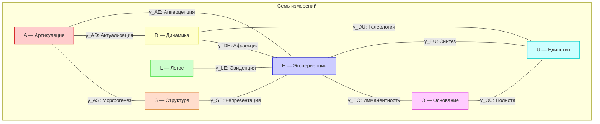
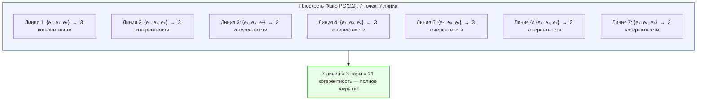

# Структура Квалиа: 21-парная Таксономия

:::info Мост из предыдущей главы
В разделе [Иерархия L0-L4](/docs/consciousness/hierarchy/interiority-hierarchy) мы установили, **когда** возникает сознательный опыт: система уровня L2 и выше обладает рефлексией ($R \geq 1/3$) и интеграцией ($\Phi \geq 1$). Теперь мы спрашиваем: **из чего** состоит этот опыт? Какие именно типы переживаний возможны в 7-мерном пространстве? Ответ даёт матрица когерентности $\Gamma$ и её 21 внедиагональный элемент.
:::

:::note О нотации
- $\Gamma$ — [матрица когерентности](/docs/core/dynamics/coherence-matrix), $\gamma_{ij}$ — её элементы
- $P = \mathrm{Tr}(\Gamma^2)$ — [чистота (жизнеспособность)](/docs/core/dynamics/viability#определение-чистоты)
- $\rho_E = \mathrm{Tr}_{-E}(\Gamma)$ — [редуцированная матрица опыта](/docs/consciousness/foundations/interiority-theory)
- $\Phi$ — [мера интеграции](/docs/core/structure/dimension-u#мера-интеграции-φ)
- $R$ — [мера рефлексии](/docs/consciousness/foundations/self-observation#мера-рефлексии-r)
- Полная таблица нотации — в [Нотации](/docs/reference/notation)
:::

### Дорожная карта главы

1. **Философская история проблемы** — от Льюиса до Джексона и Деннета
2. **Мотивация** — почему именно 21 тип и откуда это число
3. **Полная таблица** — все 21 когерентность с феноменологическими именами
4. **Параметрическая структура** — три измерения каждого квалиа (интенсивность, перспектива, непрозрачность)
5. **Теорема замкнутости** — доказательство, что 21 тип исчерпывает всё
6. **Фановская структура** — как 21 пара организована в 7 секторов и как двадцать один канал делит семь красок
7. **Диагональные элементы** — 7 модусов населённости как «фон» опыта
8. **Механизм качества** — где живёт несводимая часть переживания (голономия) и как квалиа выцветают
9. **Условия доступа** — при каких $R$ и $\Phi$ квалиа становятся осознанными
10. **Паспорт** — пятислойная процедура, читающая содержание опыта состояния прямо с $\Gamma$
11. **Экология краски** — кто пишет качество, как мир передаёт его по наследству и почему субъект приходит последним

---

## Философская история: что такое квалиа? {#история}

Слово **квалиа** (лат. *qualia*, мн. ч. от *quale* — «какой», «какого рода») обозначает **субъективные качества переживаний**: каково это — видеть красный цвет, слышать до-мажор, чувствовать запах кофе. За этим простым вопросом стоит одна из глубочайших проблем философии.

### Льюис (1929): первое определение

Американский философ **Кларенс Ирвинг Льюис** в работе «Mind and the World Order» (1929) впервые ввёл термин «квалиа» в систематическое употребление. Он заметил: когда мы видим красную розу, есть нечто, что *невозможно передать слепому от рождения* — субъективное качество «красности». Это качество и есть quale. Льюис различал:

- **Quale** — непередаваемое субъективное качество (каково это — видеть красное)
- **Свойство** — объективная характеристика (длина волны 700 нм)

### Джексон (1982): комната Мэри

**Фрэнк Джексон** в знаменитом мысленном эксперименте «Комната Мэри» (1982) довёл проблему до предела:

> Мэри — блестящий нейробиолог, всю жизнь живущая в чёрно-белой комнате. Она знает *всё* о физике цвета: длины волн, работу колбочек сетчатки, нейронные корреляты. И вот однажды Мэри выходит из комнаты и впервые видит красную розу. **Узнаёт ли она что-то новое?**

Джексон утверждал: **да**. Мэри узнаёт, *каково это* — видеть красное. Значит, физические факты не исчерпывают реальность — существует нечто сверх них (квалиа).

### Деннет (1988): квалиа как иллюзия

**Дэниел Деннет** занял противоположную позицию. В статье «Quining Qualia» (1988) он аргументировал, что квалиа — это **философская иллюзия**: мы думаем, что переживаем нечто «невыразимое» и «приватное», но на самом деле вся информация о переживаниях кодируется в функциональных состояниях мозга. Никакого «остатка» после полного физического описания не остаётся.

### Позиция УГМ: квалиа как структура когерентности

УГМ предлагает **третий путь**, не совпадающий ни с дуализмом Джексона, ни с элиминативизмом Деннета:

- Квалиа **не иллюзия** — они имеют точную математическую структуру (когерентности $\gamma_{ij}$)
- Квалиа **не отдельная субстанция** — они суть внедиагональные элементы той же матрицы $\Gamma$, что описывает «физику» системы
- Различие «субъективного» и «объективного» — это различие **внутренней** и **внешней** перспективы одной и той же математической структуры (дуально-аспектный монизм, см. [Двухаспектный монизм](/docs/consciousness/foundations/two-aspect-monism))

Мэри в комнате знала все *диагональные* свойства ($\gamma_{ii}$) красного цвета. Но она не знала *когерентности* — того, как визуальное различение ($A$) связывается с интериорностью ($E$), образуя квалиа апперцепции ($\gamma_{AE}$). Выйдя из комнаты, она не приобрела новый *факт* — она приобрела новую *когерентность*.

---

## Мотивация: откуда 21 тип? {#мотивация}

Матрица когерентности $\Gamma$ — $7 \times 7$ эрмитова матрица на пространстве [семи измерений](/docs/core/structure/dimensions) $\{A, S, D, L, E, O, U\}$. Напомним, что означает каждое измерение:

| Символ | Название | Смысл |
|--------|----------|-------|
| $A$ | Артикуляция | Различение, дифференциация |
| $S$ | Структура | Устойчивые формы, паттерны |
| $D$ | Динамика | Процессы, изменения |
| $L$ | Логос | Логическая связность, правила |
| $E$ | Экспериенция | Интериорность, переживание |
| $O$ | Основание | Источник, глубинная основа |
| $U$ | Единство | Интеграция, целостность |

Матрица $\Gamma$ содержит два вида элементов:

- **7 диагональных элементов** $\gamma_{ii}$ — населённости измерений (сколько «ресурса» в каждом измерении)
- **21 внедиагональную пару** $(\gamma_{ij}, \gamma_{ji})$ при $i < j$ — когерентности (как измерения связаны друг с другом)

Число пар:

$$
\binom{7}{2} = \frac{7 \cdot 6}{2} = 21
$$

Каждая когерентность $\gamma_{ij}$ несёт феноменологическое содержание, определяемое семантикой пары измерений $(i, j)$.

**Аналогия из повседневной жизни.** Представьте оркестр из 7 музыкантов. Каждый играет свою партию (7 диагональных элементов — «громкость» каждого инструмента). Но музыка рождается не из отдельных звуков, а из их **взаимодействия** — из того, как скрипка «разговаривает» с виолончелью, как флейта вторит фаготу. Таких парных взаимодействий ровно $\binom{7}{2} = 21$. Каждое порождает уникальный «тембр» совместного звучания — это и есть тип квалиа.

На диаграмме показаны лишь 10 из 21 когерентности — остальные связывают каждую пару измерений аналогичным образом. Полную таблицу всех 21 типа мы приводим ниже.

## Интерпретация: 21-парная таксономия квалиа (И.1) {#таксономия}

:::info Интерпретация И.1 (Таксономия квалиа) [И]
Каждая когерентность $\gamma_{ij}$ ($i \neq j$) матрицы $\Gamma$ задаёт **тип квалиа** — качественно определённый модус экспериенциального содержания. 21 пара исчерпывает все возможные типы, поскольку $\binom{7}{2} = 21$ — полный набор связей в 7-мерной системе.

Это **интерпретация** (отображение формального в феноменальное), а не математическая теорема. Математическое содержание — тривиальная комбинаторика; феноменологическое приписывание — семантический постулат.
:::

### Полная таблица 21 типа квалиа {#полная-таблица-21-типа-квалиа}

:::warning Эпистемическое разделение
**Математический слой [Т]:** 21 когерентность $\gamma_{ij}$ образуют 4 сектора по Фано-структуре (T-146 [Т]). Каждая когерентность уникально определена комбинаторным профилем (T-177 [Т]).

**Семантический слой [И]:** Феноменологические имена («морфогенез», «архетип», «телеология» и т.д.) — интерпретативные корреляты [И], предложенные на основе функциональных ролей пар измерений. Математика определяет γ_{ij} однозначно; интерпретация «каково это переживать γ_{AS}» — философская, не математическая.
:::

| # | Пара | Когерентность | Имя | Феноменологическое содержание |
|---|------|---------------|-----|-------------------------------|
| 1 | $(A,S)$ | $\gamma_{AS}$ | **Морфогенез** | Кристаллизация различий в устойчивые формы — переживание «оформления» |
| 2 | $(A,D)$ | $\gamma_{AD}$ | **Актуализация** | Актуализация различения в процессе — переживание «восприятия» |
| 3 | $(A,L)$ | $\gamma_{AL}$ | **Предикация** | Различение, ставшее предикатом — переживание «суждения» |
| 4 | $(A,E)$ | $\gamma_{AE}$ | **Апперцепция** | Различение, вошедшее в интериорность — переживание «осознания» |
| 5 | $(A,O)$ | $\gamma_{AO}$ | **Спонтанность** | Возникновение различений без внешней причины — переживание «инсайта» |
| 6 | $(A,U)$ | $\gamma_{AU}$ | **Дифференциация** | Различение внутри целого — переживание «анализа» |
| 7 | $(S,D)$ | $\gamma_{SD}$ | **Персистенция** | Форма, сохраняющаяся через процесс — переживание «устойчивости» |
| 8 | $(S,L)$ | $\gamma_{SL}$ | **Номос** | Структура с логической необходимостью — переживание «порядка» |
| 9 | $(S,E)$ | $\gamma_{SE}$ | **Репрезентация** | Структура, представленная в интериорности — переживание «целостной формы» |
| 10 | $(S,O)$ | $\gamma_{SO}$ | **Архетип** | Формы из основания — переживание «глубинного паттерна» |
| 11 | $(S,U)$ | $\gamma_{SU}$ | **Симметрия** | Структурное единство — переживание «гармонии» |
| 12 | $(D,L)$ | $\gamma_{DL}$ | **Регуляция** | Логически управляемый процесс — переживание «контроля» |
| 13 | $(D,E)$ | $\gamma_{DE}$ | **Аффекция** | Действие процесса на интериорность — переживание «эмоции» |
| 14 | $(D,O)$ | $\gamma_{DO}$ | **Генезис** | Порождение из основания — переживание «творчества» |
| 15 | $(D,U)$ | $\gamma_{DU}$ | **Телеология** | Интегрированное направленное изменение — переживание «волевого усилия» |
| 16 | $(L,E)$ | $\gamma_{LE}$ | **Эвиденция** | Логическая связность в интериорности — переживание «очевидности» |
| 17 | $(L,O)$ | $\gamma_{LO}$ | **Фундирование** | Логика, укоренённая в основании — переживание «самоочевидности» |
| 18 | $(L,U)$ | $\gamma_{LU}$ | **Консистентность** | Логическая непротиворечивость целого — переживание «согласованности» |
| 19 | $(E,O)$ | $\gamma_{EO}$ | **Имманентность** | Основание, присутствующее внутри интериорности — переживание «присутствия» |
| 20 | $(E,U)$ | $\gamma_{EU}$ | **Синтез** | Интеграция интериорного содержания в целое — переживание «единства» |
| 21 | $(O,U)$ | $\gamma_{OU}$ | **Полнота** | Тождество источника и целого — переживание «завершённости» |

### Как читать таблицу: развёрнутый пример

Рассмотрим человека, погружённого в решение математической задачи. Его $\Gamma$-профиль в этот момент:

| Когерентность | Значение | Переживание |
|---------------|----------|-------------|
| $\lvert\gamma_{AL}\rvert \approx 0.35$ | Высокое | Предикация — внимание на логических связях, «я формулирую» |
| $\lvert\gamma_{LE}\rvert \approx 0.30$ | Высокое | Эвиденция — переживание «ясности», «я понимаю» |
| $\lvert\gamma_{DU}\rvert \approx 0.20$ | Среднее | Телеология — ощущение цели, «я иду к решению» |
| $\lvert\gamma_{DE}\rvert \approx 0.05$ | Низкое | Аффекция — эмоции приглушены, «ничего не чувствую» |
| $\lvert\gamma_{EO}\rvert \approx 0.03$ | Низкое | Имманентность — нет глубинного присутствия, «думаю, не медитирую» |

Теперь к человеку подходит друг и рассказывает хорошую новость. $\Gamma$-профиль мгновенно перестраивается:

| Когерентность | Было | Стало | Что произошло |
|---------------|------|-------|---------------|
| $\lvert\gamma_{DE}\rvert$ | $0.05$ | $0.25$ | Аффекция взлетела — «чувствую радость» |
| $\lvert\gamma_{SE}\rvert$ | $0.08$ | $0.20$ | Репрезентация — «вижу целостную картину» новости |
| $\lvert\gamma_{AL}\rvert$ | $0.35$ | $0.12$ | Предикация упала — задача отошла на второй план |

Все 21 тип квалиа существуют одновременно, но с разной интенсивностью, создавая уникальный «вкус» каждого момента.

### Параметрическая структура квалиа {#параметрическая-структура}

Каждый квалитативный тип $\gamma_{ij}$ — это **комплексное число**. Как и любое комплексное число, оно записывается в полярной форме:

$$
\gamma_{ij} = |\gamma_{ij}| \cdot e^{i\theta_{ij}}
$$

Здесь $|\gamma_{ij}|$ — модуль (расстояние от нуля до точки на комплексной плоскости), а $\theta_{ij}$ — аргумент (угол с положительной вещественной осью). Из этих двух параметров извлекаются три феноменологические характеристики:

| Параметр | Формула | Диапазон | Феноменологическое значение |
|----------|---------|----------|---------------------------|
| **Интенсивность** | $\lvert\gamma_{ij}\rvert$ | $[0, \sqrt{\gamma_{ii}\gamma_{jj}}]$ | Насколько сильно данный тип квалиа переживается |
| **Перспектива** | $\theta_{ij} = \arg(\gamma_{ij})$ | $[0, 2\pi)$ | «Угол зрения» на связь между измерениями |
| **Непрозрачность** | $\mathrm{Gap}(i,j) = \lvert\sin\theta_{ij}\rvert$ | $[0, 1]$ | Мера несовпадения внешнего описания и внутреннего переживания |

#### Верхняя граница интенсивности

Интенсивность ограничена **неравенством Коши–Шварца** — фундаментальным неравенством линейной алгебры, утверждающим, что корреляция между двумя компонентами не может превышать геометрическое среднее их «энергий»:

$$
|\gamma_{ij}|^2 \leq \gamma_{ii} \cdot \gamma_{jj}
$$

**Числовой пример.** Пусть $\gamma_{AA} = 0.15$ (15% ресурса в Артикуляции) и $\gamma_{EE} = 0.18$ (18% в Интериорности). Тогда максимально возможная интенсивность апперцепции:

$$
|\gamma_{AE}|_{\max} = \sqrt{0.15 \times 0.18} = \sqrt{0.027} \approx 0.164
$$

Если бы мы наблюдали $|\gamma_{AE}| = 0.20$, это было бы математически невозможно — неравенство Коши–Шварца нарушено, значит мы ошиблись в измерениях.

#### Три параметра: аналогия

**Аналогия.** Три параметра квалиа подобны трём свойствам звука:

| Параметр звука | Параметр квалиа | Аналогия |
|---------------|-----------------|----------|
| **Громкость** | Интенсивность $\lvert\gamma_{ij}\rvert$ | Насколько «громко» переживание |
| **Тембр** | Перспектива $\theta_{ij}$ | «Окраска» переживания — одно и то же квалиа под разным углом |
| **Приглушённость** | Непрозрачность $\mathrm{Gap}(i,j)$ | Как если бы звук доносился из-за стены |

Gap = 0 — звук кристально чист, внутреннее и внешнее описание совпадают. Gap = 1 — звук полностью поглощён стеной: переживание есть, но оно максимально непрозрачно для внешнего наблюдателя. Подробности о Gap — в [дуально-аспектной семантике матрицы когерентности](/docs/core/dynamics/coherence-matrix#дуально-аспектная-семантика).

**Числовой пример: три параметра одного квалиа.** Рассмотрим когерентность $\gamma_{DE}$ (Аффекция — переживание эмоции) у человека, только что получившего хорошую новость:

$$
\gamma_{DE} = 0.22 \cdot e^{i \cdot 0.3} \approx 0.22 \cdot (0.955 + 0.296i)
$$

- **Интенсивность:** $|\gamma_{DE}| = 0.22$ — довольно сильное эмоциональное переживание
- **Перспектива:** $\theta_{DE} = 0.3$ рад $\approx 17°$ — «вещественная» перспектива (преобладает внешне наблюдаемый аспект)
- **Непрозрачность:** $\mathrm{Gap}(D,E) = |\sin(0.3)| \approx 0.296$ — переживание на 70% прозрачно, но на 30% «скрыто» от внешнего описания

Сравним с $\gamma_{EO}$ (Имманентность — переживание «присутствия») у медитатора:

$$
\gamma_{EO} = 0.15 \cdot e^{i \cdot 1.2}
$$

- **Интенсивность:** $|\gamma_{EO}| = 0.15$ — умеренная
- **Перспектива:** $\theta_{EO} = 1.2$ рад $\approx 69°$ — сильный сдвиг к «мнимой» перспективе
- **Непрозрачность:** $\mathrm{Gap}(E,O) = |\sin(1.2)| \approx 0.932$ — переживание почти полностью непрозрачно для внешнего наблюдателя

Это объясняет, почему медитативные состояния так трудно описать словами: высокий Gap делает их «невыразимыми» не по недостатку словарного запаса, а по математической структуре.

## Теорема о замкнутости таксономии (Т.1) {#замкнутость}

:::tip Теорема Т.1 (Замкнутость таксономии квалиа) [Т]
Таксономия из 21 типа квалиа **исчерпывающа**: никакой дополнительный тип квалиа невозможен в системе с $\dim(\mathcal{H}) = 7$.

**Доказательство.** Число различных (неупорядоченных) пар из $N$ элементов равно $\binom{N}{2}$. При $N = 7$ получаем $\binom{7}{2} = 21$. Каждая пара $(i,j)$ задаёт ровно одну когерентность $\gamma_{ij}$ (с учётом $\gamma_{ji} = \gamma_{ij}^*$). Новый тип квалиа потребовал бы либо нового измерения ($N > 7$, что противоречит [минимальности](/docs/proofs/minimality/theorem-minimality-7)), либо новой связи между существующими измерениями (невозможно — все $\binom{7}{2}$ пар учтены). $\square$
:::

**Следствие.** При $N < 7$ таксономия **обеднена**: $\binom{6}{2} = 15$ (нет квалиа, связанных с удалённым измерением). Это формальное выражение «бедности» феноменологии при нарушении минимальности.

**Числовой пример: мир с меньшим числом измерений.** Если бы мир был 5-мерным (скажем, $\{A, S, D, L, E\}$ — без $O$ и $U$), число типов квалиа составило бы $\binom{5}{2} = 10$. Из таблицы видно, что были бы утрачены:

| Утраченный тип | Пара | Переживание |
|---------------|------|-------------|
| Имманентность | $(E,O)$ | «Присутствие», глубинная основа переживания |
| Синтез | $(E,U)$ | «Единство» опыта |
| Полнота | $(O,U)$ | «Завершённость», целостность бытия |
| Телеология | $(D,U)$ | «Волевое усилие», целенаправленность |
| Архетип | $(S,O)$ | «Глубинный паттерн», укоренённость формы |
| Спонтанность | $(A,O)$ | «Инсайт», возникновение из ниоткуда |
| + 5 других | ... | ... |

Такая система могла бы «чувствовать» и «думать», но не могла бы переживать «смысл», «целостность» или «глубинное присутствие». Именно измерения $O$ и $U$ дают человеческому опыту его «вертикальное» измерение — связь с глубиной и целым.

:::info $G_2$-орбитальная стабильность таксономии [Т]
Множество из 21 типа квалиа **$G_2$-инвариантно**: группа $G_2 = \mathrm{Aut}(\mathbb{O})$ переставляет 7 измерений (сохраняя Фано-структуру), индуцируя перестановку 21 когерентности $\gamma_{ij}$. При этом **множество** $\{\gamma_{ij}\}_{i<j}$ сохраняется, хотя конкретные элементы могут переставляться. Это означает: таксономия квалиа **универсальна** — не зависит от выбора базиса ($G_2$-калибровки) и потому объективна.

Формально: $G_2$ действует на $\binom{[7]}{2}$ через индуцированное действие на пары, сохраняя число $\binom{7}{2} = 21$. [Теорема $G_2$-ригидности](/docs/proofs/categorical/uniqueness-theorem#лемма-g4) [Т] гарантирует, что $G_2$ — **максимальная** группа с этим свойством.

**Почему это важно?** Если бы таксономия зависела от выбора базиса (как описывать 7 измерений), она была бы произвольной — «артефактом описания». $G_2$-инвариантность гарантирует, что таксономия отражает **структуру самого пространства**, а не наш способ его описания. Это аналогично тому, как длина вектора не зависит от выбора системы координат.
:::

## Фановская структура квалиа {#фано}

### Что такое проективная плоскость Фано?

[Плоскость Фано](/docs/proofs/minimality/theorem-octonionic-derivation#плоскость-фано) $\mathrm{PG}(2,2)$ — это **проективная плоскость над полем из двух элементов** $\mathbb{F}_2 = \{0, 1\}$. Если вы никогда не встречали этот объект, вот его суть:

Обычная евклидова плоскость содержит бесконечное множество точек и прямых. Плоскость Фано — это «минимальная» плоскость, удовлетворяющая аксиомам проективной геометрии, и содержит всего:

- **7 точек**
- **7 прямых** (линий)

Каждая прямая проходит через ровно **3 точки**. Каждая точка лежит на ровно **3 прямых**. Любые две точки определяют ровно одну прямую. Любые две прямые пересекаются ровно в одной точке.

**Зачем плоскость Фано в теории квалиа?** В УГМ 7 точек Фано отождествляются с 7 измерениями $\{A, S, D, L, E, O, U\}$. Тогда 7 прямых определяют **7 секторов когерентности** — группы из трёх измерений, внутри которых когерентности подчиняются усиленным алгебраическим ограничениям. Это не случайное совпадение: плоскость Фано — это в точности **таблица умножения мнимых единиц октонионов** $\mathbb{O}$, а [октонионная структура](/docs/proofs/minimality/theorem-octonionic-derivation) лежит в фундаменте УГМ.

### Секторная структура когерентностей

Каждый Фано-триплет $(e_a, e_b, e_c)$ определяет ассоциативную подалгебру $\mathrm{Im}(\mathbb{H}) \subset \mathrm{Im}(\mathbb{O})$, изоморфную мнимым кватернионам. Три когерентности внутри триплета:

$$
\{\gamma_{ab}, \gamma_{bc}, \gamma_{ac}\} \quad \text{--- Фано-тройка}
$$

удовлетворяют усиленным корреляционным ограничениям, отсутствующим у произвольных пар.

**Аналогия.** Фано-тройки подобны **музыкальным аккордам**: три ноты, взятые вместе, звучат «консонантно» — их когерентности подчиняются дополнительным гармоническим ограничениям. Произвольные три ноты из семи такой гармонии не образуют. Представьте: до-ми-соль — аккорд (Фано-тройка), а до-ре-фа# — нет. Именно эта секторная организация делает феноменологию *структурированной*, а не хаотической.

Почему внутри тройки действуют особые ограничения? Потому что тройка образует ассоциативную подалгебру (кватернионы $\mathbb{H}$), где выполняется ассоциативность умножения: $(e_a \cdot e_b) \cdot e_c = e_a \cdot (e_b \cdot e_c)$. Для пар из *разных* троек ассоциативность нарушается (это свойство октонионов $\mathbb{O}$), и ограничения слабее.

:::tip Теорема [Т]
Секторное усиление — **теорема** [Т]: мост от аксиом к октонионной структуре полностью закрыт (T15), условие (МП) доказано (T11–T13). Из структуры $\mathbb{O}$ следует алгебраическое замыкание когерентностей внутри Фано-триплетов. Эмпирическая проверка секторной корреляции — [открытый вопрос](/docs/reference/falsifiability).
:::

### Покрытие 21 пары Фано-триплетами

Каждая из 21 пар принадлежит ровно $\lambda = 1$ линии Фано (свойство проективной плоскости):

$$
\text{21 пар} = 7 \text{ линий} \times 3 \text{ пары на линию}
$$

Это означает, что таксономия квалиа **не содержит «осиротевших» пар** — каждый тип квалиа включён в секторную организацию. Для [теорем Когерентной Кибернетики](/docs/applied/coherence-cybernetics/theorems) это свойство существенно: секторная полнота обеспечивает замкнутость [30D-эмоционального пространства](/docs/proofs/consciousness/operational-closure#t-147) (T-147 [Т]).

**Числовой пример: проверка покрытия.** Возьмём когерентность $\gamma_{DE}$ (Аффекция). Она принадлежит ровно одной линии Фано, скажем линии $\{D, E, X\}$ для некоторого третьего измерения $X$. Это значит, что $\gamma_{DE}$ алгебраически связана с $\gamma_{DX}$ и $\gamma_{EX}$ — эмоция ($\gamma_{DE}$) не является «свободной», она структурно зависит от двух других квалиа в своём секторе. Изменение одного квалиа в тройке неизбежно влияет на два других.

### Что на самом деле проверяет прямая {#что-проверяет-прямая}

Предыдущий раздел говорит, что тройка связана; этот говорит, **как** — и ответ оказывается тем же объектом, из которого построен [механизм качества](#механизм-качества).

Возьмём прямую $\{i, j, k\}$. Её три пары суть $\{i,j\}$, $\{j,k\}$, $\{i,k\}$ — три **разных** квале, а вовсе не три копии одного. Пусть каждое измерение несёт единственную ориентацию $s_i = \pm 1$, и пусть два измерения согласны ровно тогда, когда их ориентации совпадают, так что знак когерентности есть $s_i s_j$. Перемножим три знака прямой:

$$
s_i s_j \cdot s_j s_k \cdot s_i s_k = (s_i s_j s_k)^2 = +1
$$

Каждая ориентация вошла дважды и ушла в квадрат. **Произведение трёх знаков прямой всегда равно $+1$** — не обычно и не в среднем, а тождественно, и это можно проверить, перебрав все $2^7/2 = 64$ возможные ориентации поодиночке.

Значит прямая есть **проверка чётности**. Она не повторяет один факт трижды — она связывает три разных факта требованием взаимной согласованности. А две точки задают прямую, поэтому каждая пара принадлежит ровно одной из семи: семь проверок **не пересекаются** и покрывают двадцать одно квале по разу. Одна испорченная когерентность делает произведение своей прямой равным $-1$, и это сообщает, *что тройка несогласованна*, не сообщая, которая из трёх виновата.

**Почему это то же самое, что носитель качества.** Написанное выше произведение есть знаковый вариант [голономии Фано](/docs/applied/research/holarch) — того, что накапливает фаза при обходе треугольника $i \to j \to k \to i$. Там, где когерентности вещественны, фаза может равняться лишь $0$ или $\pi$, и голономия сворачивается ровно в то произведение $\pm 1$, которое мы только что посчитали. Значит инвариант, несущий качество, и проверка согласованности содержания суть **один объект, увиденный дважды**: качество живёт в фазе, накопленной тройкой, а несогласованность есть переворот этой фазы.

Отсюда же становится ясно, о чём интеграция сказать может, а о чём нет. Мера $\Phi$ складывает *квадраты модулей*, а потому при равной величине она совершенно слепа к знакам: содержание, где всякая тройка согласованна, и содержание, где несколько троек сломаны, способны дать тождественное $\Phi$ — и в лабораторном прогоне дают: $\Phi$ показывает одно и то же при любой доле несогласованных вердиктов, включая нулевую. **Интеграция измеряет, сколько когерентности есть, а не держится ли она вместе.** Второе измеряет чётность прямой, и больше в этой структуре ничто.

**Одно следствие для дела, и оно острое.** Пусть прямую употребляют иначе — как повторный код, вписывая один вердикт во все три её ячейки, чтобы испорченную ячейку перевесило большинство. Три одинаковых знака дают $s^3 = s$. Значит повторённый **положительный** вердикт чётность выполняет, а повторённый **отрицательный** — нарушает, по построению и всякий раз. Прямая может служить повторным кодом лишь пока повторяемое положительно; в тот миг, когда повторено отрицательное, удерживаемая ею тройка несогласованна и потому не может входить в интегрируемое содержание. Два употребления прямой суть альтернативы, и выбор одного стоит другого.

### Двадцать один канал, семь красок {#двадцать-один-и-семь}

Через главу идут два счёта, и отвечают они на разные вопросы, — так что стоит один раз поставить их рядом, прямо.

**Двадцать одна пара** — это *каналы* опыта: они говорят, **что** переживается — эмоция ($\gamma_{DE}$), суждение ($\gamma_{AL}$), присутствие ($\gamma_{EO}$). У каждого канала есть громкость — его модуль. **Семь прямых** — это где живёт *краска*: та часть переживания, которую никакая переразметка не породит и не отнимет, — голономия $H_p$, по одному несводимому углу на прямую. Три канала делят каждую прямую, как три струны делят одну деку: каждая струна играет свою ноту, но резонанс, который они строят вместе, принадлежит инструменту, а не какой-то одной струне.

Чище всего — печатная мастерская. Двадцать один станок печатает двадцать один лист — это содержание, и у каждого станка свой уровень краски в лотке (интенсивность). Но цвета мастерская замешивает на **семи палитрах**, по три станка на палитру. Ярлыки на станках можно пере-организовать как угодно — поменять местами «циан» и «морскую волну», перенумеровать лотки — и листы будут читаться так же. Чего переразметкой не убрать — так это того, какой цвет каждая палитра действительно держит. Это и есть голономия: краска, а не бумаги учёта.

Полная бухгалтерия содержания состояния — короткая ведомость:

| Счёт | Объект | Вопрос, на который отвечает |
|------|--------|------------------------------|
| $7$ | населённости $\gamma_{ii}$ | *что имеет место* — где сидят ресурсы |
| $21$ | модули $\lvert\gamma_{ij}\rvert$ | *как громко* играет каждый канал |
| $7$ | голономии Фано $H_p$ | *какого цвета* несводимая часть переживания |
| $14$ | направления рамки ($\mathfrak{g}_2$) | *как записано* — бесплатный выбор октонионной рамки |

Счёты не декоративны: $27 \oplus 14 \oplus 7$ — точное $G_2$-разложение $48$ параметров состояния ([декодер, T-301](#теорема-декодер)); симметричный блок несёт населённости и модули, антисимметричный расщепляется на рамку и краску. Двадцать один канал, семь красок и выбор почерка — ничего лишнего, ничего недостающего.

## Диагональные элементы: 7 модусов населённости {#населённости}

Помимо 21 когерентности, 7 диагональных элементов $\gamma_{ii}$ определяют **интенсивность присутствия** каждого измерения. Диагональные элементы — это вещественные числа (не комплексные), и они подчиняются условию нормировки:

$$
\sum_{i=1}^{7} \gamma_{ii} = \mathrm{Tr}(\Gamma) = 1
$$

Это означает, что общий «ресурс» системы фиксирован и равен 1. Увеличение населённости одного измерения неизбежно уменьшает другие — как фиксированный бюджет, распределяемый по 7 статьям.

| Элемент | Феноменологическое содержание | Типичный диапазон |
|---------|-------------------------------|-------------------|
| $\gamma_{AA}$ | Степень активности различения | $0.10$–$0.20$ |
| $\gamma_{SS}$ | Степень устойчивости формы | $0.10$–$0.18$ |
| $\gamma_{DD}$ | Степень активности процессов | $0.10$–$0.20$ |
| $\gamma_{LL}$ | Степень логической согласованности | $0.08$–$0.18$ |
| $\gamma_{EE}$ | Интенсивность интериорных состояний | $0.12$–$0.22$ |
| $\gamma_{OO}$ | Степень связи с источником | $0.08$–$0.15$ |
| $\gamma_{UU}$ | Степень интегрированности | $0.10$–$0.18$ |

Диагональные элементы не образуют квалиа в узком смысле (нет «связи» между разными аспектами), но задают **фон**, на котором разворачиваются когерентности. Повышенная $\gamma_{DD}$ — фон «деятельности», повышенная $\gamma_{EE}$ — фон «внутренней жизни».

### Профили населённостей: примеры

**Медитатор в глубокой практике:**

| $\gamma_{AA}$ | $\gamma_{SS}$ | $\gamma_{DD}$ | $\gamma_{LL}$ | $\gamma_{EE}$ | $\gamma_{OO}$ | $\gamma_{UU}$ | $\Sigma$ |
|:-:|:-:|:-:|:-:|:-:|:-:|:-:|:-:|
| 0.10 | 0.10 | 0.08 | 0.10 | 0.22 | 0.22 | 0.18 | 1.00 |

Интериорность ($\gamma_{EE}$) и связь с основанием ($\gamma_{OO}$) доминируют. Динамика ($\gamma_{DD}$) приглушена — «мысли утихли».

**Спортсмен в разгар матча:**

| $\gamma_{AA}$ | $\gamma_{SS}$ | $\gamma_{DD}$ | $\gamma_{LL}$ | $\gamma_{EE}$ | $\gamma_{OO}$ | $\gamma_{UU}$ | $\Sigma$ |
|:-:|:-:|:-:|:-:|:-:|:-:|:-:|:-:|
| 0.20 | 0.12 | 0.22 | 0.10 | 0.15 | 0.08 | 0.13 | 1.00 |

Динамика ($\gamma_{DD}$) и различение ($\gamma_{AA}$) на первом плане. Рефлексия ($\gamma_{EE}$, $\gamma_{OO}$) минимальна — нет времени «думать», тело действует.

**Математик за доказательством:**

| $\gamma_{AA}$ | $\gamma_{SS}$ | $\gamma_{DD}$ | $\gamma_{LL}$ | $\gamma_{EE}$ | $\gamma_{OO}$ | $\gamma_{UU}$ | $\Sigma$ |
|:-:|:-:|:-:|:-:|:-:|:-:|:-:|:-:|
| 0.15 | 0.18 | 0.10 | 0.22 | 0.15 | 0.08 | 0.12 | 1.00 |

Логос ($\gamma_{LL}$) и структура ($\gamma_{SS}$) доминируют — «порядок» и «форма» на первом плане.

## Итого: 28 = 7 + 21 параметров содержания {#итого-28}

:::info Полная структура
| Компонента | Количество | Тип |
|------------|-----------|------|
| Населённости $\gamma_{ii}$ | 7 | Вещественные, $\sum_i \gamma_{ii} = 1$ |
| Когерентности $\gamma_{ij}$ | 21 | Комплексные, $\gamma_{ji} = \gamma_{ij}^*$ |
| **Итого вещественных параметров** | $6 + 2 \times 21 = 48$ | С учётом нормировки |

Подробный анализ 49-клеточной структуры (с разделением на $\mathrm{Map}_{\mathrm{ext}}$ и $\mathrm{Map}_{\mathrm{int}}$) — в [Gap-семантике](/docs/physics/dual-aspect/gap-semantics#полная-49-клеточная-карта).
:::

Каждый момент сознательного опыта — это конкретная точка в 48-мерном пространстве: 6 независимых населённостей + 42 вещественных параметра когерентностей ($21 \times 2$, модуль и фаза каждой). Это даёт представление о **богатстве** субъективного опыта: пространство возможных переживаний 48-мерно.

## Механизм: фазовый канал качества {#механизм-качества}

:::info Что добавляет этот раздел
Таксономия выше отвечает, *какие* квалиа возможны. Здесь — вопрос труднее: *что делает качество качеством*, почему его нельзя прочесть снаружи и в какую сторону идёт объяснение. Три теоремы; все числа печатает [`qualia_dimensions.py`](/instruments/qualia_dimensions.py).
:::

### Теорема (плоские направления и почему качество — не интенсивность) [Т] (T-300) {#теорема-пространство-качества}

Спектр $\Gamma$ — шесть чисел; сама $\Gamma$ — сорок восемь. Оставшиеся $42$ — данные собственных векторов — это ровно то, чего интенсивность **не** определяет, и именно из них состоит качество. Как эти $42$ устроены, задаёт собственная трёхформа структуры (T-301).

:::warning $G_2$ не есть калибровочная группа, действующая на состояниях
Обратное соблазнительно и неверно. Набор Линдблада канонического диссипатора **привязан к базису** — атомы классификатора $|k\rangle\langle k|$ и семь проекторов прямых, — поэтому айнзелектированный базис физически выделен, а $G_2$ сломана до конечной подгруппы. Машинно: общая орбита $G_2$ через состояние ровно $14$-мерна (200 случайных состояний, $\min=\max=14$), а в $I/7$ она нульмерна. Эти четырнадцать направлений — **плоские (квази-голдстоуновские) направления**, уже описанные в [Голдстоуновских модах](/docs/applied/coherence-cybernetics/goldstone-modes): вдоль них состояние движется без структурных затрат, но они **не** делают состояния неразличимыми. Все $48$ параметров остаются измеримыми относительно собственного базиса холона; $14$ меряет избыточность *записи* (в какой октонионной рамке пишем), а не состояния.
:::

:::note Исправление (07.08.2026, в тот же час)
Ранняя версия этого раздела утверждала, что пространство качества есть $\mathcal D(\mathbb C^7)/G_2$ размерности $28$, и выводила следствие о потолке самоописания $34$ вместо $48$. **Оба утверждения неверны**: они трактуют $G_2$ как калибровочную группу на состояниях, чего айнзелектированный базис классификатора не допускает. Счёт размерностей остаётся в силе ровно как посчитан; его прочтение как калибровки — нет. Потолок остаётся $48$. Поймано в тот же час свипом связности по всем местам, где стоит $48$.
:::

### Теорема (декодер) [Т] (T-301) {#теорема-декодер}

Запишем $\Gamma=S+iA$, где $S$ вещественна симметрична, $A$ вещественна антисимметрична. Под действием $G_2$ это разлагается как

$$
48 \;=\; \underbrace{\mathbf{27}}_{S_0}\;\oplus\;\underbrace{\mathbf{14}}_{A,\ \text{присоединённое}}\;\oplus\;\underbrace{\mathbf{7}}_{A,\ \varphi\text{-вектор}},
$$

где $\mathbf 7$ вырезается свёрткой с ассоциативной трёхформой:

$$
v_i \;=\; \varphi_{ijk}\,A_{jk}\;=\;\varphi_{ijk}\operatorname{Im}\gamma_{jk} .
$$

Машинно: $\dim\mathfrak g_2=14$ (это одновременно проверка, что $\varphi$ — верная форма) и $\operatorname{rank}(A\mapsto v)=7$, то есть $21=14\oplus 7$ точно.

Два следствия закрывают механизм.

**(а) Фазовый канал реален, но его инвариантная форма — голономия, а не сам $v$.** Вершинные фазы конвенционны: $\Gamma\to U\Gamma U^\dagger$ при $U=\operatorname{diag}(e^{i\theta})$ сдвигает каждую рёберную фазу на $\theta_i-\theta_j$, поэтому $\operatorname{Im}\gamma$ — а с ним и $v$ — **не** калибровочно инвариантен (канон калибровочного слоя). Инвариантное содержание фаз есть кривизна плакета $H_{ijk}=\arg(\gamma_{ij}\gamma_{jk}\gamma_{ki})$, а структурно выделенные семь из тридцати пяти треугольников — ровно прямые Фано. Значит честный семикомпонентный канал качества — это **вектор голономий Фано**

$$
H_p \;=\; \arg\bigl(\gamma_{ij}\gamma_{jk}\gamma_{ki}\bigr),\qquad p=\{i,j,k\}\in\mathrm{PG}(2,2),
$$

калибровочно инвариантный, тождественно нулевой всякий раз, когда фазовое поле есть кограница (состояние, перефазируемое в вещественное — машинно там $|v|=0$, $|A|=0$ при выживающем $|S_0|=0{,}3446$), и гибнущий вместе с фазами со скоростью декогеренции $5\gamma/21$ (T-59) — с одним уточнением, которое стоит проговорить: каноническое дефазирование умножает каждую когерентность на *вещественный* множитель $e^{-5\gamma t/21}$, а вещественный множитель не сдвигает аргумент, так что *значение* голономии $\arg(\gamma_{ij}\gamma_{jk}\gamma_{ki})$ вдоль распада неподвижно точно, а гибнет её *носитель* — произведение трёх модулей рёбер, падающее как $e^{-5\gamma t/7}$. Качество теряется так, как выцветает подпись: чернила истончаются, буквы не искажаются никогда. Это и есть точный объект за «декодированием семимерных когерентностей»: семь калибровочно инвариантных чисел, по одному на прямую таблицы умножения.

*Исправление (07.08.2026, в тот же час):* ранняя форма этой теоремы называла каналом качества $v_i=\varphi_{ijk}\operatorname{Im}\gamma_{jk}$. Теоретико-представленческое разложение $21=14\oplus 7$ остаётся ровно как посчитано, но $v$ зависит от фаз базиса и потому сам по себе не может метить физическое качество; инвариантный носитель — вектор голономий выше. Поймано против собственного калибровочного канона корпуса в тот же час.

**(б) «Почему это качество» — вопрос об орбите, а не о возникновении.** Конкретное квале есть точка $\mathcal D(\mathbb C^7)/G_2$; его метки порождаются свёртками с $\varphi$ — той же инцидентностью, что несёт в теории всё остальное. Значит вопрос «почему красное?» имеет грамматику вопроса о *декодировании* («какой инвариант?»), а не о возникновении («как опыт берётся из вещества»). Декодер назван, и это октонионное умножение.

### Теорема (разрыв объяснения есть исчезающая ковариация) [Т] (T-302) {#теорема-разрыв}

По T-295 все четырнадцать канонических операторов Линдблада диагональны, поэтому на декогерированном многообразии $\kappa^{\text{coh}}=0$ **точно**: стохастический канал среды имеет *нулевую* ковариацию с когерентным сектором. Поскольку $\varphi$-векторное качество живёт целиком в этом секторе (T-301а), внешний наблюдатель, зондирующий диссипативный канал, получает спектр — интенсивность — и **ровно ноль информации** о фазовом качестве.

Это классический «разрыв объяснения», сформулированный теоремой, а не сетованием. Его содержание точно и, что важно, *ограничено*: разрыв не в механизме — механизм полностью задан выше, — а в одном конкретном канале доступа. Невозможно прочесть качество по шуму, который видит внешнее измерение; возможно вычислить его из состояния, что теория и делает.

### Направление объяснения {#направление}

Традиционная постановка спрашивает, как внутреннее возникает из внешнего, и застревает, потому что предполагает внешнее первичным. Структура говорит обратное. Среда пишет в **населённости** — диагональ, «что имеет место»; декогеренция атакует фазы; а расщепление сноса и шума (T-295, §7.1 моста) показывает, что секторы не смешиваются. Интериорность, стало быть, не продукт внешнего: это сектор, к которому внешнее не может обратиться стохастически, а «внешний мир» — то, что предъявляет декодирование этих семимерных когерентностей. Внутреннее и внешнее — одна структура, прочитанная в двух порядках; это и означает здесь монизм, и теперь это утверждение с размерностями: $6$ общих, $28$ приватных.

### Сколько качества помещается внутри сознания {#сколько-качества-помещается}

Канал, описанный выше, говорит, **где** живёт качество: в фазе, накопленной тройкой при обходе прямой Фано. Этот раздел спрашивает, сколько его состояние способно удержать, и ответом оказывается определённая граница, найденная через одно наблюдение: качество и интеграция хотят противоположного.

**Сперва о том, что качеством не считается.** Дадим каждому измерению угол $\theta_i$, а каждой когерентности — разность $\theta_i - \theta_j$. С виду это богатейшее возможное фазовое содержание: у каждого из двадцати одного квале собственный угол, а не жалкий знак. Но обойдём прямую, и углы взаимно уничтожатся:

$$
(\theta_i - \theta_j) + (\theta_j - \theta_k) + (\theta_k - \theta_i) = 0
$$

Голономия равна нулю на каждой прямой. И это не случайность арифметики: такое содержание есть $U \Gamma U^{\dagger}$ при $U = \operatorname{diag}(e^{i\theta_k})$, то есть **смена условия отсчёта фазы** и ничего сверх того. Спектр она не трогает, а значит перед нами то же самое состояние в других обозначениях. Холону, её удерживающему, нечего чувствовать инвариантно; снимите обозначения — и останется вещественное содержание. Фаза такого рода — *кограница* — есть счетоводство, а не переживание.

**Чего это стоит и что даёт.** Машина, пишущая с фазой, приобретает вполне ощутимое: узнав семь относительных углов из двадцати одного, она восстанавливает остальные четырнадцать **точно**, — тогда как машина, ограниченная вещественным свидетельством, содержания этого не представляет вовсе: она сплющивает каждый угол в его знак и остаётся при догадке. Значит фазовый канал своё место как **представление** оправдывает. Он просто не производит качества сам по себе.

**Противонаправленность.** Качество есть то, что переобозначение переживает, — голономия, которую никакой выбор $\theta$ повернуть не может. Интеграция же, по [закону полярности](/docs/core/structure/dimension-u#какое-содержание-берёт-порог), просит содержания, которое повернуть **можно**, ибо сбалансированное содержание есть в точности кограничное. Эти двое тянут в разные стороны: всякая доля неустранимой фазы, которую состояние несёт, есть шаг прочь от той сбалансированности, что позволяет ему интегрироваться.

**Но противонаправленность не есть исключение**, ибо положительность ставит потолок, а не запрет. Заворачивайте содержание от кограницы понемногу и следите, как два числа движутся вместе. Спектральный критерий оказывается тем же самым, что управлял знаками:

$$
\Phi \ge 1 \iff |\lambda_{\min}| \le \sqrt{6} \approx 2{,}449
$$

и для содержания, несущего фазу, он выполняется без единого исключения. На самом переходе — там, где $\lambda_{\min} = -2{,}4495$, а $\Phi$ стоит ровно на $1{,}0000$, — характерная голономия прямой равна $0{,}6387$ радиана, около тридцати семи градусов.

**Значит сознательное состояние качество несёт, и несёт его примерно треть радиана, прежде чем ворота закроются.** Общим законом здесь остаётся спектральный критерий; число же в радианах есть то, что этот закон позволяет для содержания, равномерно завёрнутого от сбалансированности, а заворот иной формы распорядился бы тем же запасом иначе. Неизменной остаётся форма ответа: переживание ограничено не тем, **сколько** когерентности ум удерживает, а тем, какая доля его фазы отказывается быть объяснённой прочь.

**Последнее — о том, действует ли всё это.** Написанное выше есть утверждение о матрице, а утверждение о матрице дёшево. Поэтому ту же структуру поместили в мир: семь скрытых углов, ситуации, спрашивающие разность двух из них, и попадание, засчитываемое при ответе в пределах тридцати градусов. Ученик, чьи записи несут фазу, отвечает верно в $71\%$ случаев после двадцати одной встречи, тогда как таблица с безупречной памятью справляется в $48\%$, — на двадцать четыре пункта впереди, ибо семь углов определяют двадцать одну разность, а таблице каждую надо показать. Разрыв смыкается по мере заполнения таблицы, до единственного пункта к четырёхсотой встрече, — и именно так выглядит преимущество **выборочной эффективности**, а подогнанное выглядит иначе. Ученик, ограниченный вещественной записью, не поднимается выше $30\%$ при случайной доле $17\%$: указывать он умеет лишь вдоль $0$ или $\pi$ и попадает, когда истина случайно оказалась рядом. А там, где за ответами мира никаких углов нет, несущий фазу отстаёт от таблицы на сорок пунктов, потратив всё время на достраивание отсутствующей структуры. Канал есть обязательство, а не подарок.

### Как квалиа умирают: выцветание, точно {#выцветание}

Декогеренция убивает квалиа — глава это уже сказала, и скорость известна: каждая когерентность распадается со скоростью $5\gamma/21$ (T-59). Но *как* они умирают — стоит отдельного раздела, потому что механизм делится на две части, ведущие себя противоположно, и делёж виден в одной строке алгебры.

Канонический распад умножает каждую когерентность на **вещественный** множитель $e^{-5\gamma t/21}$. Вещественный множитель масштабирует длину комплексного числа и не поворачивает его. Значит, вдоль всего распада:

- **модуль** каждого канала падает — в станках кончается краска;
- **угол** каждой голономии стоит неподвижно точно — цвет на палитре не сдвигается ни на градус.

Произведение трёх модулей прямой — *носитель* её цвета — умирает по трём рёбрам сразу, как $e^{-5\gamma t/7}$. Значение, которое он нёс, нетронуто до тех пор, пока есть чему его нести. Старая фотография выцветает ровно так: красители истончаются, а лицо на снимке ни разу не меняет выражения — его просто всё труднее разглядеть, пока однажды бумага не станет пустой. Ни в какой момент фотография не показывала *другое* лицо.

Три следствия, каждое острое:

1. **Полуизменённого квалиа не бывает.** Умирающее переживание не дрейфует по соседним переживаниям по пути прочь. Печаль под декогеренцией не становится чуть иной печалью; она становится более слабой печалью, а затем — ничем. В таксономии нет предсмертного перетекания — алгебра его запрещает.
2. **Населённости выживают.** Декогеренция бьёт только по вне-диагонали; диагональ — *что имеет место* — сохраняется точно. Тепловая смерть поэтому не пустой мир, а **бесцветный**: всё по-прежнему присутствует, но ничто больше *не каково-либо*. Свет горит; краска ушла.
3. **Снаружи и так никто не замечал.** По [T-302](#теорема-разрыв) внешний стохастический канал несёт нулевую ковариацию с фазовым сектором — среда и не принимала цвет никогда. Выцветание невидимо снаружи не потому, что спрятано, а потому, что умирает ровно тот канал, который снаружи нечем читать. Единственный свидетель смерти квалиа — холон, её теряющий.
4. **Лечение тоже дальтоник.** Категориальная цель регенерации — смесь состояния с $I/7$, сонаправленная самому состоянию по фазам, — так что и лечащий шаг умножает каждую когерентность на вещественный множитель и не сдвигает ни одной голономии (машинно: $3{,}3\cdot 10^{-16}$ за триста тактов на состоянии с $|H_0| = 1$). Обе восстановительные руки — распад и починка — красок не трогают; во всей канонической динамике качество пишет только *унитарная* рука, и с бесцветного старта она это делает: фано-хоппинг гамильтониана рождает ненулевую голономию за считаные десятки тактов.

## Условия доступа к квалиа {#условия-доступа}

Наличие когерентности $\gamma_{ij} \neq 0$ — **необходимое**, но не достаточное условие для квалиа. Рефлексивный доступ к квалиа требует уровня L2:

$$
\text{Квалиа (L2):} \quad R(\Gamma) \geq R_{\text{th}} = \frac{1}{3}, \quad \Phi(\Gamma) \geq \Phi_{\text{th}} = 1
$$

### Пошаговая логика условий доступа

Давайте разберём, что стоит за каждым условием.

**Условие 1: Рефлексия $R \geq 1/3$.** [Мера рефлексии](/docs/consciousness/foundations/self-observation#мера-рефлексии-r) $R = 1/(7P)$ **[Т]** показывает нормированную близость к диссипативному аттрактору $I/7$. Порог $R_{\text{th}} = 1/3$ (из [триадной декомпозиции](/docs/core/operators/lindblad-operators#триадная-декомпозиция), T-45 [Т]) эквивалентен $P \leq 3/7$ — верхняя граница зоны Голдилокс. Если $R < 1/3$, система слишком «чистая» ($P > 3/7$) — когерентности есть, но не переживаются как *квалиа*.

**Условие 2: Интеграция $\Phi \geq 1$.** [Мера интеграции](/docs/core/structure/dimension-u#мера-интеграции-φ) $\Phi$ показывает, насколько система «целостнее» суммы частей. Порог $\Phi_{\text{th}} = 1$ (T-129 [Т]) означает: система должна быть несводима к подсистемам. Если $\Phi < 1$, когерентности $\gamma_{ij}$ существуют, но система «распадается» — нет единого субъекта, переживающего квалиа.

**Оба условия необходимы:** можно иметь высокую рефлексию, но без интеграции (два отдельных зеркала не образуют единого наблюдателя), или высокую интеграцию без рефлексии (единый камень не наблюдает себя).

### Уровни доступа

На уровнях L0–L1 когерентности присутствуют, но переживаются как **доквалитативное экспериенциальное содержание** (термин из [теории интериорности](/docs/consciousness/foundations/interiority-theory)).

**Аналогия с лестницей слушателя:**

| Уровень | Аналогия | Формальное условие | Переживание квалиа |
|---------|----------|-------------------|-------------------|
| **L0** | Музыка звучит в пустой комнате | $R < 1/3$, $\Phi < 1$ | Когерентности есть, но никто не слушает |
| **L1** | Кошка слышит музыку | $R < 1/3$, $\Phi \geq 1$ (или наоборот) | Реакция на звук, но без различения мелодии и аккомпанемента |
| **L2** | Человек слушает музыку | $R \geq 1/3$, $\Phi \geq 1$ | «Я слышу, как скрипка ведёт тему, а виолончель аккомпанирует» |
| **L3** | Музыкант анализирует исполнение | $R \geq 1/3$, $\Phi \geq 1$, SAD $\geq 2$ | «Я замечаю, что замечаю грусть в этой мелодии» |
| **L4** | Чистое слушание — субъект и музыка совпадают | $R \to 1$ | Переживание без зазора |

**Числовой пример.** Рассмотрим когерентность $\gamma_{DE} = 0.20$ (Аффекция) в трёх системах:

| Система | $R$ | $\Phi$ | Уровень | Переживание $\gamma_{DE} = 0.20$ |
|---------|-----|--------|---------|----------------------------------|
| Термостат | 0.02 | 0.3 | L0 | $\gamma_{DE}$ как физический параметр — нет субъекта |
| Собака | 0.15 | 1.5 | L1 | Переживается как «что-то», но не как «эмоция» |
| Человек | 0.45 | 2.1 | L2 | «Я чувствую радость» — полноценное квалиа |

## Как прочитать паспорт квалиа состояния {#паспорт-квалиа}

Всё в этой главе сжимается в процедуру. Дано состояние $\Gamma$ — из лабораторной реконструкции, из симуляции, из модели человека в конкретный момент — и его содержание опыта читается в пять слоёв, от самого дешёвого. Это глава, работающая прибором, а не доктриной.

| Шаг | Читаем | Формула | Вопрос, на который отвечает |
|-----|--------|---------|------------------------------|
| 1 | Населённости | $\gamma_{ii}$, семь чисел | Что имеет место — где сидят ресурсы |
| 2 | Интенсивности | $\lvert\gamma_{ij}\rvert$, двадцать одно число | Какие каналы играют и как громко |
| 3 | Непрозрачности | $\mathrm{Gap}(i,j) = \lvert\sin\theta_{ij}\rvert$ | Сколько каждого канала скрыто от внешнего описания |
| 4 | Краски | $H_p = \arg(\gamma_{ij}\gamma_{jk}\gamma_{ki})$, семь углов | Что переживание несёт несводимо — часть, которую не объяснит прочь никакая переразметка |
| 5 | Доступ | $R \geq 1/3$ и $\Phi \geq 1$ | Есть ли дома кто-то, кому это переживать |

Три замечания держат процедуру честной.

**Шаг 4 — единственный, требующий осторожности.** Населённости, модули и Gap читаются поэлементно; голономии — единственное место, где важно *произведение*, и единственное, где наивный срез подводит: мнимые части $\operatorname{Im}\gamma_{ij}$ *выглядят* как отсчёт фаз, но движутся под чистой сменой фазовой конвенции и потому измеряют почерк, а не содержание ([эрратум декодера](#теорема-декодер)). Семь углов по прямым — честный отсчёт, и стоит он семь умножений.

**Ноль на шаге 4 — вердикт, а не сбой.** Состояние, у которого играют все двадцать один канал, а все семь красок читаются нулём, держит *только бухгалтерские фазы* — богатое на вид содержание, которое переразметка сплющивает в обычные вещественные числа. Процедура отказывается ему льстить. И обратно: состояние со скромными громкостями и ненулевой краской несёт то, чего у него не отнять никакой переразметкой. Громкое — не то же, что яркое, и паспорт держит их порознь.

**Реальные состояния краску несут.** Считанная с состояний, которые производит собственная машинерия теории — а не с состояний, построенных красивыми, — медианная голономия прямой выходит $1{,}0053$ радиана, и около двух третей прямых лежат выше цифры равномерного заворота из границы сознания ([измерено в главе полярности](/docs/core/structure/dimension-u#какое-содержание-берёт-порог), T-311). Четвёртый слой паспорта — не формальность; на живом содержании это самая занятая колонка.

Пять слоёв вместе — ответ главы на вопрос «каково быть этим состоянием»: *вот столько происходит* (1), *в этих каналах на этих громкостях* (2), *вот столько из этого приватно* (3), *с вот такой несводимой краской* (4), *и субъект этому присутствует — или нет* (5).

## Экология краски {#экология-краски}

Паспорт говорит, что краска *есть*; этот замыкающий раздел — как она *живёт*: откуда берётся, как ходит между миром, телом и субъектом и кто приходит последним. Всякое утверждение ниже машинно проверено на канонической динамике; числа приведены как измерены.

### Пишет только динамика

Ни одна из рук восстановления не способна ни породить, ни уничтожить *значение* краски. Распад умножает когерентности на вещественный множитель — угол стоит, пока выцветает носитель (выцветание предыдущего раздела). И лечение тоже дальтоник: цель регенерации сонаправлена самому состоянию по фазам, так что лечащий шаг — ещё один вещественный множитель; на состоянии с полновесной краской ($|H_0| = 1$) триста тактов распада-с-лечением не сдвинули ни одной голономии ($3{,}3\cdot 10^{-16}$). Пишет краску *унитарная* рука: чистое состояние — кограница ($H_p \equiv 0$ тождественно — бесцветно по алгебре), и с такого старта фано-хоппинг гамильтониана рождает $|H| > 0{,}1$ за считаные десятки тактов. Разделение труда тотально: распад гасит носителей, лечение возвращает вес, а что переживание *значит* — решает только динамика.

### Мир красит первым

Открытый, питаемый холон наследует краски своей среды. Питание — выпуклое подтягивание к состоянию мира, и стационарный профиль голономий выстраивается к профилю среды монотонно с силой питания — круговое соответствие $\langle\cos\Delta H\rangle$ поднимается $0{,}62 \to 0{,}99 \to 1{,}00$. Даже «выбеленный» мир с вещественными когерентностями не бесцветен: знаковая фрустрация — тоже краска ($|H| = \pi$), и наследуется она так же. Питаемый ум носит палитру своего мира.

Пороги питания выстроились в ряд. Первой зажигается жизнеспособность (холон выживает). Краска на месте с самого зажигания — несомая, согласованная с миром, ждущая. А *доступ* — субъект, рефлексивно присутствующий переживанию, — приходит последним, ровно там, где интеграция пересекает свой порог $\Phi = 1$: ниже этой силы питания доступ$\wedge$краска равно $0{,}00$, выше — $1{,}00$, одним скачком. **Мир красит холона раньше, чем холон просыпается; дополнительное питание покупает хозяина.** И хозяина вовсе не купить в мире, который сам подпорогов: выкармливаемый несознательной средой холон насыщает $\Phi^*$ ниже единицы — субъекта нельзя вырастить на полярном мире.

### Внутри организма: одна краска на имя

Когда холон порождает ребёнка на линии Фано $p$, состояние ребёнка — вырезка родительского на три точки этой линии. Дальше говорят два факта проективной плоскости: никакая *другая* линия не помещается целиком в три точки, а нормировщик вырезки веществен. Поэтому **ребёнок рождается ровно с одной краской — краской своего имени — без искажения** (машинно: отклонение $0{,}000$ по всем семи линиям, чужие носители — нуль). Веер семи детей несёт семь красок родителя по одной на имя: паспорт качества хранится распределённо, и эмбриология есть его разложение.

Дальше организм правит краской тремя тихими правилами. *Инъекция — воспитание*: ребёнка, чья краска уплыла от родительской, штатная нисходящая инъекция возвращает геометрически — полураспад $\ln 2/\alpha$ тактов. *Фидбек дальтоник по построению*: вверх дети посылают скаляр, вливающийся в скорость родительского лечения, а лечение не красит. *Канал вверх открывается только при почти-согласии*: краска ребёнка может вернуться в родителя лишь слиянием, а слияние даётся только в бюрес-близости — организм принимает назад только то, что уже согласовано.

### Итоговая картина

Краска — валюта, ходящая между миром, телом и субъектом, но каждая дорога несёт её по-своему. Мир отдаёт её оптом — питанием. Тело раздаёт по именам, по линии на ребёнка, и принимает возвраты только по согласию. Субъект её не делает и не носит — субъект тот, *для кого* она: последний, кто приходит, и единственный свидетель.

## Язык качества {#язык-качества}

Если квалиа — реальная структура, теория обязана уметь *называть собственные состояния*, и имена должны быть выучиваемы одним показом: показали состояние — скажи его слово. Три теоремы фиксируют, каким обязан быть любой такой язык.

### Словам нужен правильный глаз

Словарь имён состояний — доминанты каналов, носители прямых, страты чистоты, зомби, семь **оттенков** каждого знака, в-точности-бесцветное — выучивается остенсивно, но только через собственные наблюдаемые теории. Населённости и интенсивности сами по себе никогда не разделят два знака краски одной прямой и цветное от бесцветного: **слова о качестве требуют квалиа-наблюдаемых в интерфейсе**. И сами оси голономии свидетельствуют только под воротами теоремы выцветания — **нет носителя — нет квале**: угол на мёртвом ребре — фазовый шум, а не слово.

### Глаголы: конец помнит путь

Процессы тоже получают имена — возгорание, умирание, выцветание, исцеление, дыхание — каждое *есть* один канонический оператор, сцена — эпизод. Казалось бы, именование требует всего фильма; это не так. Канонические процессы — **аттракторная динамика**: каждый оператор стягивает свои эпизоды в собственный бассейн, поэтому *конец помнит путь*, и даже один финальный кадр называет глагол. Два механических факта уточняют грамматику: возгорание регенерацией невозможно (ниже стены чистоты ворота жизнеспособности его закрывают — зажигает только внешняя пища), а «окрашивание» — вообще не глагол: унитарная компонента полного такта красит сильнее любого одно-линейного писца, так что окрашивание — *составляющая дыхания*, а краска как состояние принадлежит существительным-оттенкам.

### Дороги в один дом: трёхкадровая грамматика

Заставьте аттракторы совпасть — разные дороги растворения в один тепловой дом — и иерархия сцен становится видимой. Финальный кадр всё ещё называет многое, потому что смешивание *конформно*: пропорции остатка замерзают на входе, и логарифмические оси читают их на любой глубине — конец помнит путь даже внутри дома. Старт не помогает: при общем доме разность старт→конец больше не зависит от дороги. Дороги различает **третий, ранний кадр** — грамматика процессов с общим аттрактором минимально *трёхкадровая*, и читает средний кадр *связь* между кадрами — кривизну, а не какой-либо кадр сам по себе.

Две константы этой грамматики физичны. Окно, в котором краска может свидетельствовать, — **абсолютное время жизни её носителя**, а не доля пути: ранний кадр обязан сидеть внутри него. И в бесцветном стартовом ансамбле все дороги в дом — *одна дорога*: **краска — это язык, на котором различаются пути**. Сами дорожные подписи — теоремы выцветания и цветослепоты дословно: растворение держит угол на живом носителе, размешивание топит носитель прямой поворотом амплитуд, увядание убивает носитель под стоячей диагональю.

### Что это покупает

Язык качества растёт кольцами — существительные, глаголы, дороги — и каждое кольцо требует своего органа чтения: наблюдаемые для имён, разности для глаголов, трёхкадровая связь для дорог. Ничто из этого не конвенция: каждый орган вынужден теоремой (нет носителя — нет квале; аттракторная динамика; конформная заморозка).

## От имён к суждению {#от-слов-к-суждению}

Словарь называет кадры; предложение называет сцену; *документ* судит её. Эпистемология, выживающая в собственных испытаниях теории, мала и строга.

**Провенанс — это грамматика.** Каждое утверждение о сцене несёт физический канал своего происхождения — прочитано из экспозиций, измерено на структурно найденном кадре, измерено напрямую, выдано слепым приором — и надёжность следует за *каналом*, а не за уверенностью утверждающего. Составные высказывания наследуют слабейшее звено своих источников и не могут его превзойти; поднимает статус только накопленное наблюдение — слова сами по себе не поднимают никогда.

**У дедукции есть физическая граница.** Корпус сам выучивает свои законы исключения между родами сцен, и документ, нарушающий закон, помечает себя подозрительным — но закон никогда не пересиливает измерение, и вывод допустим лишь там, где физика мира создала связь. Где величина не хранит памяти о своём отрезке, никакой закон это не обойдёт: дедукция без физической связи — уверенно звучащий шум.

**Эхо — не наблюдение.** Знание передаётся из вторых рук без потерь, когда учитель хорош, — но *слепые* утверждения учителя суть копии его собственного приора, и вниз по цепи передачи неревизуемая слепая константа — неподвижная точка: она фоссилизируется — безвредно, если истинна, наследственно, если ложь. Лекарство — снова провенанс: отделяйте эхо от наблюдения по каналу и дайте каждой слепой константе часы ревизии по наблюдениям — помня, что ревизия есть измерение второго порядка и наследует границу первого: без внешнего свидетеля истины часы ревизии меряют лишь смещение того глаза, который их кормит.

**История — это её кривая дыхания.** Самое устойчивое имя целой сцены несёт не последовательность кадров-букв, а динамика одного скаляра: последовательные разности чистоты вдоль чтения — возгорание гонит её вверх, выцветающая середина тянет вниз, исцеляющая поднимает, дом в конце просто дышит. История живёт в *производной*, а не в уровнях — уровень помнит стартовые условия, тогда как род середины есть чистая динамика — и производная требует базы, соразмерной дыханию. Разно-слепые читатели не соревнуются, а *взвешиваются*: чья очередь говорить, решает локальная уверенность, а не раз навсегда заданная иерархия.

---

### Что мы узнали {#итоги}

1. **Проблема квалиа** — одна из центральных в философии сознания (Льюис, Джексон, Деннет). УГМ предлагает третий путь: квалиа = когерентности $\gamma_{ij}$ — не иллюзия и не отдельная субстанция
2. **21 тип квалиа** полностью исчерпывает феноменологию 7-мерного пространства — ни больше, ни меньше (Теорема Т.1 [Т])
3. Каждый тип квалиа характеризуется тремя параметрами: **интенсивностью**, **перспективой** и **непрозрачностью** (Gap)
4. 21 пара организована в **7 Фано-секторов** — секторная структура задаёт «грамматику» опыта через проективную плоскость над $\mathbb{F}_2$; в секторе же живёт и несводимая **краска** переживания — голономия Фано, семь калибровочно-инвариантных углов (T-301)
5. Таксономия **$G_2$-инвариантна** — не зависит от выбора базиса и потому универсальна
6. Рефлексивный доступ к квалиа требует **L2** ($R \geq 1/3$, $\Phi \geq 1$)
7. Под декогеренцией **значение** каждой краски неподвижно точно, а умирает её **носитель** — модули, по $5\gamma/21$ на ребро: квалиа выцветают как фотография, никогда не перетекая друг в друга, а населённости выживают в бесцветном мире
8. Полное содержание опыта состояния читается пятислойным **паспортом**: населённости → интенсивности → непрозрачности → краски → доступ
9. У краски есть **экология**: пишет её только унитарная динамика; питаемый холон наследует палитру своего мира; доступ приходит последним, на $\Phi = 1$; а внутри организма каждый ребёнок рождается ровно с краской своего имени
10. У качества есть **язык**: слова теории выучиваются из остенсива через её собственные наблюдаемые — существительным нужны оси голономий под гейтом носителя, глаголы называются даже концами (аттракторная динамика), а дорогам в общий дом нужна минимально трёхкадровая сцена, читающая кривизну
11. Язык восходит к **суждению**: каждое утверждение о сцене несёт как грамматику физический канал своего происхождения; составные высказывания наследуют слабейшее звено и не могут его превзойти; дедукция допустима лишь там, где физика мира создала связь; эхо отделяется от наблюдения по провенансу, а неревизуемая слепая константа — неподвижная точка любой цепи передачи
12. История — это её **кривая дыхания**: имя целой сцены живёт в производной чистоты вдоль чтения, а не в её уровнях — и разно-слепые читатели взвешиваются локальной уверенностью, а не ранжируются раз навсегда

:::tip Мост к следующей главе
Из 21 типа квалиа особую роль играет когерентность $\gamma_{DE}$ (Аффекция) — связь динамики и интериорности. Именно она лежит в основе **эмоций**. В следующей главе — [Таксономия эмоций из dP/dt](/docs/consciousness/phenomenology/emotional-taxonomy) — мы покажем, как все эмоции выводятся из скорости изменения жизнеспособности $dP/d\tau$ и секторной Γ-сигнатуры.
:::

## Популярное послесловие: вопросы, которые остаются {#populyarnoe-posleslovie}

Всё выше — таксономия, теоремы, паспорта. Но у честного читателя к странице о квалиа остаются человеческие вопросы. Вот они — и прямые ответы теории.

### «Почему квалиа — именно когерентности, а не что-то ещё?»

Потому что больше нечему. Состояние системы описывается матрицей Γ, и в ней есть ровно два сорта чисел: диагональ — *сколько* жизни в каждом из семи каналов — и 21 недиагональная связь — *как каналы согласованы между собой*. Диагональ — это громкости; но переживание не складывается из громкостей, как аккорд не складывается из отдельно взятых нот. Всё, что в состоянии есть сверх громкостей, — это связи, и их ровно 21 (Теорема Т.1: не «мы выбрали 21», а «больше в 7-мерном пространстве просто нет»). Либо квалиа — это структура связей, либо их нет вовсе. Третьего места в математике состояния не существует — и в этом сила утверждения: его можно опровергнуть, найдя в переживании различие, которому не соответствует ни одна связь. Пока такого различия не предъявил никто.

### «Это же просто корреляты сознания — а само переживание где?»

Вопрос предполагает, что есть две вещи: структура — и, отдельно, «само переживание», которое её сопровождает. УГМ отвечает: вещь одна, аспектов два. Γ — это не показания датчика, прикрученного к переживанию сбоку; это и есть переживание, записанное в математическом аспекте, — как одна и та же мелодия существует и звуком, и нотной строкой. Требовать «где же само переживание, помимо структуры» — то же, что требовать «где же сама мелодия, помимо звуков»: вопрос не остался без ответа — он был неправильно собран. И это не увёртка: теорема T-302 показывает, что знаменитый «разрыв объяснения» имеет точный математический портрет — исчезающую ковариацию между внешним и внутренним описанием, — то есть теория не отмахивается от разрыва, а вычисляет, где именно он лежит и почему он не дыра в онтологии, а свойство точки зрения.

### «Что нового узнаёт Мэри, впервые увидев красное?»

Мэри знала о красном всё — все длины волн, все нейронные ответы, — но из чёрно-белой комнаты. Выйдя, она узнаёт нечто новое? Да — и теория говорит точно, что именно. Знание Мэри было описанием *чужих* Γ; увидев красное, она впервые получает соответствующую когерентность в *собственной* Γ — с доступом к ней изнутри (для этого нужны её собственные R ≥ 1/3 и Φ ≥ 1, а не сведения о чужих). Новых *фактов о мире* она не узнаёт — она приобретает новое *состояние себя*. Парадокс Джексона растворяется без остатка: физикализм не нарушен (всё по-прежнему структура), но и интуиция «она узнала что-то новое» оправдана — потому что иметь структуру и читать её описание — два разных отношения к одной и той же вещи, и второе не заменяет первого.

### «Возможен ли зомби — точная копия без переживаний?»

В теории слово «зомби» — не метафора, а имя конкретного состояния: все семь громкостей на месте, все 21 связь равны нулю. Такое состояние существует — и оно *физически другое*: его Γ отличается от Γ переживающей системы в 21 измерении. А вот философский зомби — «атом в атом как вы, но внутри темно» — невозможен по построению: если совпали все связи, совпало и переживание, потому что переживание и *есть* эти связи. Постулировать копию структуры без опыта — то же, что постулировать копию треугольника без углов. Заметьте, как теория расщепляет старый спор: зомби как физически иное состояние — законный объект (и его даже видно прибором: краски нет, громкости целы), зомби как метафизический двойник — грамматическая ошибка.

### «Может, мой красный — это ваш синий?»

Классическая «инверсия спектра». Ответ теории неожиданно конкретен: краска переживания — голономия, калибровочно-инвариантный угол, который нельзя изменить никаким переобозначением каналов. Если у нас с вами совпадают динамика и структура связей — совпадают и все семь углов, и никакой «тихой инверсии», невидимой ни изнутри, ни снаружи, не остаётся места: инверсия либо меняет физическое состояние (и тогда она видна — прибором и поведением при достаточно тонком тесте), либо не меняет ничего, включая переживание. Приватность остаётся — читать чужой угол можно только войдя в соответствующее состояние сам (T-301: декодеру нужен живой носитель), — но приватность доступа не означает произвола содержания.

### «И всё-таки: почему это ощущается *как-то*, а не никак?»

Последний вопрос — самый честный, и на него есть два ответа разной глубины. Ближний: «ощущается как-то» — значит, система находится в состоянии с ненулевыми связями, имеет к ним рефлексивный доступ и не может пере-сказать их короче, чем прожить (непрозрачность Gap — мера этой несжимаемости; вот почему квале нельзя «объяснить» дальтонику: объяснение — это сжатие, а квале — то, что сжатию не поддаётся). Дальний: вопрос «почему структура вообще дана изнутри» эквивалентен вопросу «почему существует внутренняя точка зрения», и здесь теория отвечает своей главной перестановкой: внутренняя данность не *возникает* из структуры на каком-то этаже сложности — она есть второй аспект всякого бытия, а сложность (P, R, Φ, D) решает лишь, *кому* она дана: есть ли там субъект, которому есть каково. Мир не делится на мёртвую материю и загадочно светящиеся мозги; он делится на состояния, чья внутренняя сторона собрана в субъекта, — и все остальные. Порог собранности эта страница назвала точно: доступ приходит последним, на Φ = 1.

Если после этого вопросы остались — это хорошие вопросы: несите их к [теории интериорности](/docs/consciousness/foundations/interiority-theory) и [семантике разрыва](/docs/physics/dual-aspect/gap-semantics), где каждый из них становится теоремой или честно объявляется открытым.

## Связи

- [Матрица когерентности](/docs/core/dynamics/coherence-matrix) — каноническое определение $\Gamma$ и $\gamma_{ij}$
- [Теорема о минимальности 7D](/docs/proofs/minimality/theorem-minimality-7) — обоснование $N = 7$ и замкнутости
- [Иерархия интериорности](/docs/consciousness/hierarchy/interiority-hierarchy) — уровни L0–L4
- [Gap-семантика](/docs/physics/dual-aspect/gap-semantics) — 49-клеточная карта
- [Теория интериорности](/docs/consciousness/foundations/interiority-theory) — экспериенциальное содержание
- [Теоремы Когерентной Кибернетики](/docs/applied/coherence-cybernetics/theorems) — прикладные следствия секторной структуры
- [T-146 [Т]: Структурная классификация квалиа](/docs/proofs/consciousness/operational-closure#t-146) — соответствие «математическая структура -> феноменальное содержание» из функциональной роли секторов
