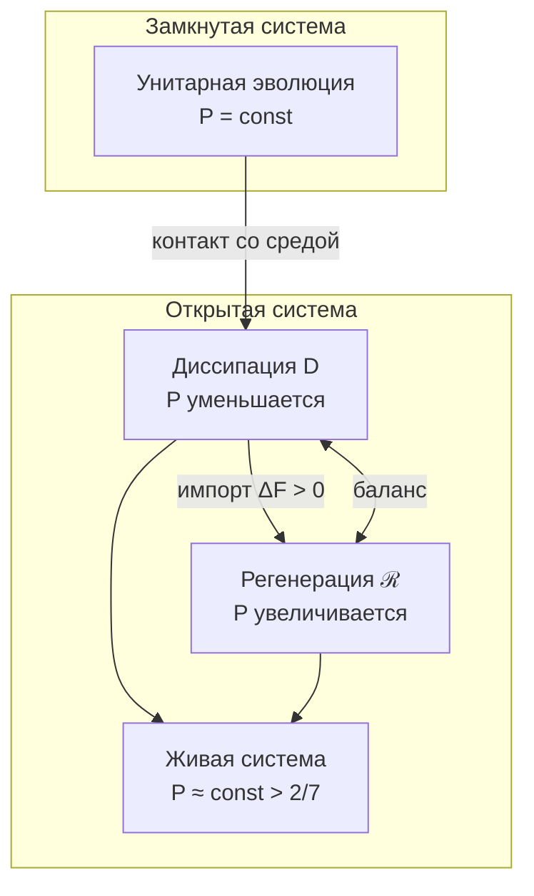

# Эволюция Матрицы Когерентности

:::info Для кого эта глава
Полное уравнение эволюции Γ: унитарный, диссипативный и регенеративный члены. Предполагается знакомство с [матрицей когерентности](./coherence-matrix) и [аксиомой Ω⁷](/docs/core/foundations/axiom-omega).
:::

Эта глава — самая объёмная и, возможно, самая важная в разделе «Динамика». Она отвечает на вопрос: **как меняется состояние голонома со временем?** Если [матрица когерентности](./coherence-matrix) $\Gamma$ — это «фотография» системы в данный момент, то уравнение эволюции — это «правила кинематографа», описывающие, как кадры сменяют друг друга.

Читатель узнает:
- Что такое **логический Лиувиллиан** $\mathcal{L}_\Omega$ и почему он не постулируется, а выводится из аксиом
- Три силы, управляющие эволюцией: **унитарная** (сохраняет когерентность), **диссипативная** (разрушает) и **регенеративная** (восстанавливает)
- Почему система всегда стремится к **терминальному объекту** $T$ (глобальному аттрактору)
- Как гарантируется **сохранение положительности** — состояние остаётся физическим при любой эволюции

:::tip Интуитивное объяснение трёх сил
Представьте ледяную скульптуру на солнце:
- **Унитарная часть** $-i[H, \Gamma]$ — скульптор, который **вращает** скульптуру, меняя ракурс, но не форму. Чистота $P$ не меняется.
- **Диссипация** $\mathcal{D}[\Gamma]$ — **солнце**, которое плавит скульптуру, стирая детали. Чистота $P$ падает.
- **Регенерация** $\mathcal{R}[\Gamma, E]$ — **морозильник**, который подмораживает скульптуру, восстанавливая форму. Чистота $P$ может расти (если есть свободная энергия $\Delta F > 0$).

Жизнь — это динамическое равновесие: солнце плавит, морозильник подмораживает. Если морозильник выключается ($\Delta F \leq 0$), скульптура неизбежно тает ($P \to 1/7$) — система умирает.
:::

## Терминальный объект T (глобальный аттрактор) {#терминальный-объект}

:::warning Свойство 3 (Терминальный объект)
Существует единственный терминальный объект $T \in \mathcal{C}$:

$$\forall \Gamma \in \mathcal{C}, \exists! f: \Gamma \to T$$

где $T = \Gamma^*$ — глобальный аттрактор (равновесное состояние).
:::

### Свойства терминального объекта {#свойства-t}

| Свойство | Формулировка | Следствие |
|----------|--------------|-----------|
| Единственность | $\exists! T$ | Уникальное равновесие |
| Универсальность | $\forall \Gamma, \exists! f: \Gamma \to T$ | Все пути ведут к T |
| Стягиваемость | $X = \lVert N(\mathcal{C})\rVert \simeq *$ | Монизм доказан |
| Неподвижная точка | $\varphi(T) = T$ | T — фиксированная точка самомоделирования |

### Стрела времени как конвергенция к T {#стрела-времени-эволюция}

**Теорема (Стрела времени):**

$$\lim_{\tau \to \infty} \Gamma(\tau) = T$$

при условии $\Delta F > 0$ (система не изолирована).

**Геометрическая формулировка:**

$$\dim(X_\tau) \geq \dim(X_{\tau+1})$$

Стрела времени — **прогрессивный коллапс высших страт** к терминальному T.

---

## Полное уравнение движения

:::info Эмерджентное время
Время τ **выводится** из структуры категории $\mathcal{C}$ через механизм Пейдж–Вуттерс, а не постулируется как внешний параметр. См. [Теорема об эмерджентном времени](../../proofs/dynamics/emergent-time).
:::

Эволюция $\Gamma$ описывается **логическим Лиувиллианом**:

$$
\frac{d\Gamma(\tau)}{d\tau} = \mathcal{L}_\Omega[\Gamma(\tau)]
$$

где **логический Лиувиллиан** $\mathcal{L}_\Omega$ **выводится** из [классификатора подобъектов Ω](../foundations/axiom-omega#внутренняя-логика):

$$
\mathcal{L}_\Omega[\Gamma] = -i[H_{eff}, \Gamma] + \mathcal{D}_\Omega[\Gamma] + \mathcal{R}[\Gamma, E]
$$

где:
- τ — внутреннее время (параметр условных состояний относительно [O](../structure/dimension-o))
- $H_{eff}$ — эффективный гамильтониан из ограничения Пейдж–Вуттерс
- $-i[H_{eff}, \Gamma]$ — унитарная эволюция (сохраняет $P$)
- $\mathcal{D}_\Omega[\Gamma]$ — **логическая диссипация** (операторы L_k из Ω)
- $\mathcal{R}[\Gamma, E]$ — регенерация (сопряжённый функтор к диссипации)

:::warning Ключевое отличие от стандартной формулировки
Операторы Линдблада L_k **не постулируются** произвольно — они **выводятся** из атомов классификатора Ω. Это устраняет неопределённость "L_k зависят от системы".
:::

### Область применимости: марковский режим {#markovian-scope}

Уравнение эволюции $\mathcal{L}_\Omega$ — линдбладовское (**марковское**) master-уравнение. Математические гарантии УГМ — устойчивость решётки подобъектов, монотонное сжатие метрики Буреса, well-definedness оператора регенерации $\mathcal{R}$, существование неподвижной точки $\rho^* = \varphi(\Gamma)$ — все опираются на CPTP (completely positive, trace preserving) структуру каждого инфинитезимального шага эволюции. В этом разделе точно формулируется область применимости.

#### Теорема (Петц–Русакай монотонность, 1996) [Т]

Для любого CPTP-отображения $\mathcal{E}: \mathcal{D}(\mathcal{H}) \to \mathcal{D}(\mathcal{H})$ и любых двух операторов плотности $\rho_1, \rho_2 \in \mathcal{D}(\mathcal{H})$:
$$
d_\mathrm{Bures}(\mathcal{E}(\rho_1), \mathcal{E}(\rho_2)) \;\leq\; d_\mathrm{Bures}(\rho_1, \rho_2).
$$
Строгое неравенство имеет место, если $\mathcal{E}$ не унитарно на линейной оболочке $(\rho_1, \rho_2)$.

**Следствие для УГМ**: поскольку $\mathcal{L}_\Omega$ порождает одно-параметрическую полугруппу CPTP-отображений $\mathcal{E}_\tau = \exp(\tau \mathcal{L}_\Omega)$ (форма Линдблада), метрика Буреса **монотонно невозрастает** вдоль любой УГМ-траектории. Это категориальная основа для:
- Устойчивости решётки подобъектов (T-62 [Т]);
- Единственности неподвижной точки $\rho^*$ (T-96 [Т]);
- Сходимости итерационной схемы для $\varphi$ (см. выше);
- Well-defined топологии Буреса $J_\mathrm{Bures}$ на сайте $\mathcal{C}$ (аксиома A1).

#### Марковская vs немарковская квантовая динамика

Квантовая динамика системы $S$, связанной с резервуаром $B$ на полном гильбертовом пространстве $\mathcal{H}_S \otimes \mathcal{H}_B$, **унитарна на полном пространстве**: $\rho_\mathrm{tot}(t) = U(t) \rho_\mathrm{tot}(0) U(t)^\dagger$. Редуцированная системная динамика $\rho_S(t) = \mathrm{Tr}_B \rho_\mathrm{tot}(t)$ получается частичным следом. Два режима:

- **Марковский (CP-делимый)**: $\rho_S(t) = \mathcal{E}(t, t_0)[\rho_S(t_0)]$ с $\mathcal{E}(t_2, t_0) = \mathcal{E}(t_2, t_1) \circ \mathcal{E}(t_1, t_0)$ и каждый $\mathcal{E}(t_j, t_i)$ — CPTP. Эквивалентно форме Линдблада $\dot\rho_S = \mathcal{L}[\rho_S]$ с time-local $\mathcal{L}$.
- **Немарковский (CP-неделимый)**: промежуточные пропагаторы не CPTP. Эффекты памяти от bath-system корреляций вызывают apparent «обратный поток информации» в систему. Time-local генераторы $\mathcal{L}(t)$ могут иметь отрицательные ставки, форма Линдблада разрушается.

**Приближение Борна–Маркова** (Breuer–Petruccione 2002, §3.3) валидно при:
1. **Слабое связывание**: system-bath interaction $g \ll$ внутри-bath энергетический масштаб.
2. **Разделение масштабов времени**: $\tau_\mathrm{bath} \ll \tau_\mathrm{sys}$, где $\tau_\mathrm{bath}$ — время распада bath-корреляций, $\tau_\mathrm{sys}$ — системное динамическое время.
3. **Bath стационарность**: bath-корреляции зависят только от разностей времени.

При этих условиях второй порядок возмущения в связывании даёт time-local Lindblad-генератор, CPTP-свойство которого гарантируется теоремой Горини–Косаковского–Сударшана–Линдблада (GKSL).

#### Декларация scope для УГМ

:::info УГМ область применимости [Т] — марковский режим
**УГМ определена и применима** в марковском режиме, где генератор $\mathcal{L}_\Omega$ имеет форму Линдблада. В этом режиме все категориальные гарантии безусловны:

- Петц–Русакай монотонность метрики Буреса — топология Гротендика $J_\mathrm{Bures}$ well-defined.
- Спектральный gap $\omega_0 > 0$ у $\mathcal{L}_\Omega$ (T-39a [Т]) — примитивность унитарной части $\mathcal{L}_0$.
- Существование и единственность $\rho^*$ (T-96 [Т]) — категориальная самомодель well-defined.
- Ограниченные внедиагональные когерентности (Fano-контракция $\alpha = 2/3$, T-142 [Т]).
- $D_\mathrm{min} = 2$ стратификация (T-151 [Т]) — граница многообразия density matrices обрабатывается.

**Немарковские расширения** — **вне текущего scope УГМ**. Это **явное ограничение**, не пробел: применение УГМ к сильно memory-coupled динамике (например, sub-picosecond quantum optics, spin-bath декогеренция на fs-масштабах) нарушило бы предпосылку Петца–Русакай и инвалидировало бы категориальные гарантии.
:::

#### Физические масштабы времени, где марковское приближение выполняется

Для физических систем, релевантных применениям УГМ:

| Система | $\tau_\mathrm{sys}$ | $\tau_\mathrm{bath}$ | Марковское валидно? |
|---|---|---|---|
| Нейронные ансамбли (сознание) | $\gtrsim 1$ мс | $\lesssim 1$ μс (тепловое) | **Да** |
| Суперпроводящие кубиты (FSQCE-SC) | $\sim 10^{-6}$ с ($T_2$) | $\sim 10^{-9}$ с | **Да** |
| NV-центры (FSQCE-NV) | $\sim 10^{-3}$ с ($T_2$ при 77 K) | $\sim 10^{-6}$ с | **Да** |
| Молекулярный фотосинтез (FMO) | $\sim 10^{-13}$ с | $\sim 10^{-13}$ с | **Граница** |
| Ядерная динамика | $\sim 10^{-22}$ с | $\sim 10^{-22}$ с | **Нет** — вне УГМ |
| Планк-шкала | $\sim 10^{-43}$ с | $\sim 10^{-43}$ с | **Нет** — другая рамка |

Главная область УГМ — **сознание** (нейронная миллисекундная динамика) и **макрофизика** (уравнения Эйнштейна как предел spectral action) — лежит в марковском режиме. FSQCE-экспериментальная валидация нацелена на системы, где марковское приближение выполняется по дизайну (выбор криогенных температур, изоляция от шума).

#### Связь с другими УГМ-теоремами

Марковский scope структурно согласован с:
- **T-62 [Т]** (унитарность на уровне топоса): унитарная эволюция на полном system-bath пространстве проецируется в CPTP на систему — согласуется с марковской редукцией.
- **T-65 [Т]** (спектральное действие): выводит уравнения Эйнштейна как низкоэнергетический предел; естественно марковское в этом режиме.
- **T-117 [Т]** (квантовая ЦПТ): макроскопические наблюдаемые становятся классическими (коммутативными), что — марковский предел.
- **T-214 [Т]** (hard-problem мета-теорема): bridge функтор от $\mathcal{D}(\mathbb{C}^7)$ к экспериментальному содержанию внешний; не требует немарковской динамики.

#### Замечание о «немарковском расширении» как открытом направлении

Расширение УГМ на немарковские режимы — **well-defined исследовательское направление** (time-local генераторы с memory kernels, иерархические уравнения движения, dissipaton formalism), но **не требуемое закрытие** текущей теории: УГМ **полна как марковская рамка**. Классификация этого как «открытого вопроса» была бы категориальной ошибкой — УГМ не претендует на универсальность во всех квантовых динамических режимах; она утверждает строгую математическую структуру в марковском домене, где лежат её физические применения.

:::note О нотации
- $\mathcal{D}$ (каллиграфическое) — **диссипативный** член
- $\mathcal{R}$ (каллиграфическое) — **регенеративный** член
- $R$ (обычное) — мера **рефлексии** (качество самомоделирования), см. [самонаблюдение](/docs/consciousness/foundations/self-observation#мера-рефлексии-r)
:::

#### Итеративная схема: снятие цикличности ℒ_Ω и φ {#итеративная-схема}

:::info Итеративная схема
Полное уравнение $\mathcal{L}_\Omega[\Gamma] = -i[H_{eff}, \Gamma] + \mathcal{D}_\Omega[\Gamma] + \mathcal{R}[\Gamma, E]$ содержит регенерацию $\mathcal{R}$, использующую $\rho^* = \varphi(\Gamma)$ — категориальную самомодель. При этом $\varphi$ формально определена через динамику $\mathcal{L}_\Omega$. Эта кажущаяся цикличность разрешается через **итеративную (fixed-point) схему**:

1. **Линейная часть** $\mathcal{L}_0 = -i[H_{eff}, \cdot] + \mathcal{D}_\Omega$ имеет единственный аттрактор $\rho^*_{\mathrm{diss}} = I/7$ [Т-39a] — **без зависимости от φ**
2. **Нулевая итерация**: $\varphi^{(0)}(\Gamma) := \rho^*_{\mathrm{diss}} = I/7$
3. **n-я итерация**: $\varphi^{(n+1)}(\Gamma) := \lim_{\tau \to \infty} \exp(\tau \cdot \mathcal{L}_\Omega^{(n)})[\Gamma]$, где $\mathcal{R}^{(n)}$ использует $\varphi^{(n)}$
4. **Сходимость**: при $\kappa < \kappa_{max}$ (T-96), последовательность $\{\varphi^{(n)}\}$ сходится по норме Фробениуса

Мера рефлексии $R = 1/(7P)$ определена через $\rho^*_{\mathrm{diss}} = I/7$ (уровень 0 итерации) и **не зависит** от полного $\varphi$.
:::

:::info Метод расщепления (split-step): разрешение кажущейся цикличности
Нелинейность $\mathcal{R}$ (зависимость от $\varphi(\Gamma)$) разрешается **расщеплением шага** (Lie–Trotter):

1. **Линейный шаг:** $\Gamma' = e^{\Delta\tau \cdot \mathcal{L}_0}[\Gamma]$ — применяется линейная часть (гамильтониан + диссипатор), **не зависящая от φ**
2. **Нелинейный шаг:** $\Gamma'' = (1-\alpha)\Gamma' + \alpha\,\varphi(\Gamma')$ — регенерация с φ, вычисленной от *предыдущего* состояния $\Gamma'$

Схема сходится к неподвижной точке по теореме Банаха, поскольку φ — сжимающее отображение с коэффициентом $k = 1 - R < 1$. Аналог: операторное расщепление в численных PDE.
:::

## Компоненты уравнения

### 1. Унитарный член

$$
-i[H_{eff}, \Gamma(\tau)] = -i(H_{eff}\Gamma - \Gamma H_{eff})
$$

где $H_{eff}$ — эффективный гамильтониан, возникающий из [ограничения Пейдж–Вуттерс](../../proofs/dynamics/emergent-time#33-формальная-конструкция).

:::note Пейдж–Вуттерс constraint [Т] (T-87, P3)
$[\hat{C}, \Gamma_{\text{total}}] = 0$ — ограничение Уилера-ДеВитта. Выводится из A1–A4 через конструкцию спектральной тройки (T-87). Время $\tau$ эмерджентно из корреляций между «часовой» и «системной» подсистемами. Полный вывод: [Эмерджентное время](/docs/proofs/dynamics/emergent-time).
:::

**Определение [О] (Ограничение Уилера-ДеВитта).** {#ограничение-wdw}

$$\hat{C} = H_O \otimes \mathbb{1}_{6D} + \mathbb{1}_O \otimes H_{6D} + H_{\mathrm{int}}$$

— полный энергетический оператор. Физические состояния удовлетворяют $[\hat{C}, \Gamma_{\mathrm{total}}] = 0$ ([T-87 [Т]](/docs/core/operators/emergent-time)). Из этого ограничения следует эмерджентное время $\tau$ через механизм Пейдж–Вуттерс.

#### Вывод ограничения из аксиомы A5 {#вывод-wdw}

Ограничение Пейдж–Вуттерса (аналог уравнения Уилера–ДеВитта) **выводится** из A5:

**Шаг 1.** A5 устанавливает: $\mathcal{H} = \mathcal{H}_O \otimes \mathcal{H}_{\text{rest}}$ с оператором связи $\hat{C} = H_O \otimes \mathbb{1} + \mathbb{1} \otimes H_{\text{rest}} + H_{\text{int}}$.

**Шаг 2.** Глобальная стационарность: $[\hat{C}, \Gamma_{\text{total}}] = 0$ — Вселенная *целиком* не эволюционирует.

**Шаг 3.** Частичный след по O: условное состояние $\Gamma(\tau) = \mathrm{Tr}_O[(|\tau\rangle\langle\tau|_O \otimes \mathbb{1}) \cdot \Gamma_{\text{total}}] / p(\tau)$ удовлетворяет $d\Gamma/d\tau = -i[H_{\text{eff}}, \Gamma] + \mathcal{D}[\Gamma]$, где $H_{\text{eff}}(\tau) = H_{\text{rest}} + \langle\tau|H_{\text{int}}|\tau\rangle_O$.

Эмерджентная динамика — **следствие** статической структуры $\Gamma_{\text{total}}$. Статус: **[Т]**

**Свойства:**
- Сохраняет $\mathrm{Tr}(\Gamma) = 1$
- Сохраняет $P = \mathrm{Tr}(\Gamma^2)$
- Детерминистическая (обратимая) эволюция

### 1.1 Вывод $H_{eff}$ из ограничения Пейдж–Вуттерс {#вывод-h_eff}

:::info Мастер-определение
Данный раздел содержит **вывод** эффективного гамильтониана из фундаментального ограничения. Все ссылки на $H_{eff}$ должны указывать сюда.
:::

**Теорема (Эффективная динамика):**
Пусть $\Gamma_{total} \in \mathcal{H}_{phys} = \ker(\hat{C})$ удовлетворяет ограничению $[\hat{C}, \Gamma_{total}] = 0$ (для чистых проекторов $\Gamma = |\Psi\rangle\langle\Psi|$ это сводится к стандартному $\hat{C}|\Psi\rangle = 0$). Тогда условное состояние:

$$
\Gamma(\tau) = \frac{\mathrm{Tr}_O\left[ (|\tau\rangle\langle \tau|_O \otimes \mathbb{1}_{6D}) \cdot \Gamma_{total} \right]}{p(\tau)}
$$

эволюционирует согласно:

$$
i\frac{\partial}{\partial\tau}\Gamma(\tau) = [H_{eff}(\tau), \Gamma(\tau)]
$$

где **эффективный гамильтониан**:

$$
H_{eff}(\tau) = H_{6D} + \langle\tau|H_{int}|\tau\rangle_O
$$

где:
- $H_{6D} \in \mathcal{L}(\mathcal{H}_{6D})$ — гамильтониан 6D-подсистемы (без часов O), действует на $\mathcal{H}_{6D} \cong \mathbb{C}^6$
- $H_{int}$ — гамильтониан взаимодействия часов O с остальными измерениями, см. [Свойство 2 Ω⁷](../foundations/axiom-omega#свойство-2)
- $\langle\tau|H_{int}|\tau\rangle_O$ — матричный элемент в базисе времени (скаляр по O, оператор по 6D)

**Вывод:**

**Шаг 1.** Применим $\frac{\partial}{\partial\tau}$ к определению условного состояния. Параметр $\tau$ входит через базис часов $|\tau\rangle_O$.

**Шаг 2.** Используем связь между $|\tau\rangle_O$ и $|k\rangle_O$ (собственными состояниями $H_O$):

$$
|\tau_n\rangle = \frac{1}{\sqrt{7}} \sum_{k=0}^{6} e^{-2\pi i k n / 7} |k\rangle_O
$$

Преобразование — стандартное дискретное преобразование Фурье на ℤ₇, полнота и ортонормированность которого гарантированы конечномерностью [Т].

**Шаг 3.** Из ограничения $[\hat{C}, \Gamma_{total}] = 0$ имеем:

$$
[(H_O \otimes \mathbb{1}_{6D} + \mathbb{1}_O \otimes H_{6D} + H_{int}), \Gamma_{total}] = 0
$$

**Шаг 4.** Проектируя на $|\tau\rangle\langle\tau|_O$ и вычисляя частичный след, получаем:

$$
i\frac{\partial}{\partial\tau}\Gamma(\tau) = [H_{6D}, \Gamma(\tau)] + [\langle\tau|H_{int}|\tau\rangle_O, \Gamma(\tau)]
$$

**Шаг 5.** Объединяя слагаемые:

$$
H_{eff}(\tau) = H_{6D} + \langle\tau|H_{int}|\tau\rangle_O
$$

∎

**Следствия:**

| Режим | Условие | $H_{eff}$ |
|-------|---------|-----------|
| Слабая связь | $\lambda_E, \lambda_U \to 0$ | $H_{eff} \to H_{6D}$ (стандартная КМ) |
| Сильная связь | $\lVert H_{int}\rVert \sim \lVert H_{6D}\rVert$ | $H_{eff}(\tau)$ существенно зависит от $\tau$ |
| Резонанс | $\omega_0 \sim \varepsilon_E$ | Особые эффекты синхронизации |

:::note Связь с исходной динамикой
При $\lambda_E, \lambda_U \to 0$ эффективная динамика совпадает со стандартным уравнением фон Неймана. Стандартная квантовая механика — **предел слабой связи** с внутренними часами.

Полное определение [ограничения $\hat{C}$](../foundations/axiom-omega#свойство-2) и [операторов часов](../structure/dimension-o#алгебра-часов) см. в соответствующих документах.
:::

:::warning Связь 7D-формализма и 6D-условных состояний
Основное уравнение движения (§«Полное уравнение движения») записано в **минимальном 7D-формализме**, где $\Gamma \in \mathcal{D}(\mathbb{C}^7)$ и все 7 измерений {A,S,D,L,E,O,U} входят на равных основаниях. Вывод $H_{eff}$ выше использует **расширенный Пейдж–Вуттерс формализм**, в котором условное состояние $\Gamma(\tau) \in \mathcal{D}(\mathbb{C}^6)$ — матрица $6 \times 6$.

Согласование: в минимальном формализме $H_{eff}$ интерпретируется как $7 \times 7$ оператор, тривиально действующий на $O$-компоненту ($H_{eff}|_O = 0$). Пейдж–Вуттерс вывод **обосновывает** форму $H_{eff}$ через проекцию полной $42 \times 42$ динамики на 6D-условное состояние. После обоснования результат «поднимается» обратно в 7D, где O-строка/столбец эволюционируют отдельно. Подробнее о двух уровнях формализации: [Матрица когерентности → Два уровня](/docs/core/dynamics/coherence-matrix#два-уровня-формализации).
:::

### 2. Диссипативный член (логическая диссипация) {#логический-лиувиллиан}

$$
\mathcal{D}_\Omega[\Gamma] = \sum_k \gamma_k \left( L_k \Gamma L_k^\dagger - \frac{1}{2}\{L_k^\dagger L_k, \Gamma\} \right)
$$

где:
- $L_k$ — операторы Линдблада, **выведенные из классификатора Ω**
- $\gamma_k \geq 0$ — скорости декогеренции по каналу $k$
- $\{A, B\} = AB + BA$ — антикоммутатор

#### Вывод L_k из классификатора Ω

:::info Теорема (L_k из Ω) [Т]
Атомарные операторы Линдблада определяются через атомы [классификатора подобъектов](../foundations/axiom-omega#внутренняя-логика):

$$
L_k^{\text{atom}} := |k\rangle\langle k|, \quad k = 0, \ldots, 6
$$

Каноническая форма (с учётом [Фано-структуры](/docs/core/operators/lindblad-operators#фано-операторы)) комбинирует атомарные и Фано-операторы: $L_p^{\text{Fano}} = \frac{1}{\sqrt{3}}\Pi_p$, где $\Pi_p$ — проекторы на Фано-линии PG(2,2). Мастер-определение: [Операторы Линдблада](/docs/core/operators/lindblad-operators).
:::

**CPTP-условие:**

$$
\sum_{k=0}^{6} (L_k^{\text{atom}})^\dagger L_k^{\text{atom}} = \sum_k |k\rangle\langle k| = \mathbb{1}
$$

— автоматически выполнено (разрешение единицы в базисе).

#### Иерархия L_k по стратам

| Страта | Тип системы | L_k оператор | Интерпретация |
|--------|-------------|--------------|---------------|
| I | Материя | $P_{Casimir}^{(k)}$ | Проекторы симметрии (группа G) |
| II | Жизнь | $\sum_j R_j P_j$ | Квантовая коррекция ошибок |
| III | Разум | $\nabla_{\Gamma_k} F$ | Градиент свободной энергии |
| IV | Сознание | $\check{\delta}^k$ | Кограничный оператор Чеха |

**Следствие:** L_k **не произвольны** — они определяются стратой базового пространства X, на которой находится система.

**Свойства:**
- Сохраняет $\mathrm{Tr}(\Gamma) = 1$
- Уменьшает $P$: $\frac{dP}{d\tau}\big|_{\mathcal{D}} \leq 0$
- Переводит чистые состояния в смешанные (декогеренция)

**Конкретные примеры по стратам:**

| Страта | Оператор | Физический процесс |
|--------|----------|-------------------|
| I | $P_{l,m} = \vert l,m\rangle\langle l,m\vert$ | Проекция на (l,m)-подпространство спина |
| II | $L = \vert j\rangle\langle i\vert$ | Переход из состояния $i$ в $j$ (восстановление) |
| III | $L = e^{-\beta E_k/2}\vert k\rangle\langle k\vert$ | Термализация к минимуму F |
| IV | $L = \check{\delta}: C^k \to C^{k+1}$ | Склейка локальных модальностей |

### 3. Регенеративный член [Т] {#3-регенеративный-член}

$$
\mathcal{R}[\Gamma, E] = \kappa(\Gamma) \cdot (\rho_* - \Gamma) \cdot g_V(P)
$$

где:
- $\kappa(\Gamma) = \kappa_{\text{bootstrap}} + \kappa_0 \cdot \mathrm{Coh}_E(\Gamma)$ — скорость регенерации [Т] (сопряжение $\mathcal{D}_\Omega \dashv \mathcal{R}$, см. [Genesis Protocol](../foundations/axiom-omega#genesis-protocol))
- $\rho_* = \varphi(\Gamma)$ — категориальная самомодель текущего состояния [Т] ([оператор φ](/docs/core/operators/phi-operator), [формализация](/docs/proofs/categorical/formalization-phi))
- $(\rho_* - \Gamma)$ — направление релаксации [Т] (единственная CPTP-интерполяция + бюресова оптимальность, см. [§ Вывод формы регенерации](#вывод-формы-регенерации))
- $g_V(P) = \mathrm{clamp}\!\left(\frac{P - P_{\mathrm{crit}}}{P_{\mathrm{opt}} - P_{\mathrm{crit}}},\; 0,\; 1\right)$ — V-preserving gate [Т] (см. [§ Теорема V-preservation](#теорема-v-preservation-gate))

:::tip Форма ℛ полностью выведена из аксиом [Т]
Все компоненты регенеративного члена **строго выводятся** из аксиом A1–A5, примитивности линейной части $\mathcal{L}_0$ и стандартной термодинамики:

| Компонент | Статус | Источник |
|-----------|:------:|---------|
| $\kappa(\Gamma)$ | [Т] | Сопряжение $\mathcal{D}_\Omega \dashv \mathcal{R}$ ([κ₀](/docs/core/foundations/axiom-septicity#структурный-анзац-kappa0)) |
| $\rho_* = \varphi(\Gamma)$ (самомодель) | [Т] | Категориальное определение φ ([оператор φ](/docs/core/operators/phi-operator)) |
| $(\rho_* - \Gamma)$ (направление) | [Т] | CPTP-единственность замещающего канала + точный BKM-градиентный спуск (T-261 ниже) |
| $g_V(P)$ (затвор) | [Т] | V-preservation + Ландауэр ([§ Теорема V-preservation](#теорема-v-preservation-gate)) |

Полный вывод: [§ Вывод формы регенерации](#вывод-формы-регенерации) ниже.
:::

#### Теорема T-261: регенерация есть натурально-градиентный спуск свободной энергии (BKM) [Т] {#теорема-регенерация-градиентный-спуск}

Направление релаксации не просто CPTP-оптимально — оно **в точности** ковариантный градиентный спуск, с резко определённой метрикой.

:::tip Теорема (точная градиентно-потоковая форма канала вещества) [Т]
Для полноранговой $\Gamma$ и цели $\rho_*$ замещающий поток $\dot{\Gamma} = \kappa_{\text{eff}}(\rho_* - \Gamma)$ есть в точности связанный натурально-градиентный спуск квантовой относительной энтропии (свободной энергии) $F(\Gamma) = D(\rho_*\|\Gamma)$ в **метрике Кубо–Мори (BKM)**:

$$
\operatorname{grad}_{\text{BKM}} D(\rho_*\|\Gamma) \;=\; \Gamma - \rho_* ,
\qquad\text{откуда}\qquad
\dot{\Gamma} \;=\; -\kappa_{\text{eff}}\operatorname{grad}_{\text{BKM}} F .
$$

Более того, $F$ — функционал Ляпунова с точным диссипативным тождеством (H-теорема канала вещества):

$$
\frac{dF}{dt} \;=\; -\,\kappa_{\text{eff}}\; g_{\text{BKM}}\!\bigl(\rho_*-\Gamma,\; \rho_*-\Gamma\bigr) \;\leq\; 0 .
$$
:::

**Доказательство (три точных тождества).** Пусть $K_\Gamma(Y) = \int_0^\infty (\Gamma+s)^{-1} Y (\Gamma+s)^{-1}\,ds$ (понижающее BKM-ядро; в собственном базисе $K_{mn} = \ln(\lambda_m/\lambda_n)/(\lambda_m-\lambda_n)$, $=1/\lambda_m$ на диагонали).
*(1)* Дифференциал $F(\Gamma) = \mathrm{Tr}\,\rho_*\ln\rho_* - \mathrm{Tr}\,\rho_*\ln\Gamma$ вдоль $X$ есть $dF(X) = -\mathrm{Tr}(X\,K_\Gamma(\rho_*))$ — производная $\ln\Gamma$ несёт ровно BKM-ядро.
*(2)* Метрика BKM есть $g_{\text{BKM}}(X,Y) = \mathrm{Tr}(X\,K_\Gamma(Y))$, так что $dF(X) = g_{\text{BKM}}(X, -\rho_*)$: несвязанный градиент равен $-\rho_*$.
*(3)* Тождественно $K_\Gamma(\Gamma) = \mathbb{1}$, так что $g_{\text{BKM}}(X, \Gamma) = \mathrm{Tr}\,X$ — метрический двойник следовой связи есть сама $\Gamma$; проекция на бесследовую касательную даёт $\operatorname{grad} F = \Gamma - \rho_*$ (множитель Лагранжа $= 1$). Диссипативное тождество: $dF/dt = g_{\text{BKM}}(\operatorname{grad} F, \dot\Gamma) = -\kappa_{\text{eff}}\,\|\rho_*-\Gamma\|^2_{\text{BKM}}$. $\blacksquare$

**Машинная верификация.** Двадцать пять случайных некоммутирующих пар: $\|K_\Gamma(\Gamma)-\mathbb{1}\| \le 1{,}2\cdot10^{-14}$; $\|\operatorname{grad}_{\text{BKM}} D(\rho_*\|\Gamma) - (\Gamma-\rho_*)\| \le 1{,}0\cdot10^{-15}$ (точно, полностью некоммутативно); тождество H-теоремы до конечно-разностной точности $7\cdot10^{-5}$.

**Резкая атрибуция метрики.** Тот же поток **не** есть Bures/SLD-градиент того же потенциала вне коммутирующего локуса (численный косинус $\approx 0{,}98 < 1$). Две канонические метрики Петца делят труд: **Bures** правит оцениванием и обучением (Char-III/IV, насыщение Крамера–Рао, [поток обучения](/docs/proofs/categorical/formalization-phi)); **BKM** правит диссипативной релаксацией (линейный отклик/Кубо), и канал вещества течёт по её градиенту. Под [гранд-каноническим словарём (T-258)](/docs/applied/coherence-cybernetics/sensorimotor#гранд-канонический-словарь) это **выводит динамический закон канала питания**: регенерация есть ковариантный градиентный спуск свободной энергии — в точности уравнение обновления «Самообучающейся Вселенной» Ванчурина (её ур. 2.6), реализованное в квантовой информационной геометрии; $h^{(R)}$-нога словаря тем самым динамична [Т], а не только совпадение сигнатур.

#### Теорема T-262: динамическая трихотомия — $\mathcal{L}_\Omega$ как точное разложение обратимое ⊕ необратимое (метриплектическое) [Т] {#теорема-динамическая-трихотомия}

T-261 закрыла канал вещества. Два оставшихся члена мастер-уравнения допускают то же обращение, и вместе три дают точное геометрическое разложение полной динамики.

:::tip Теорема (каждый член $\mathcal{L}_\Omega$ есть точный геометрический поток) [Т]
1. **Работа (унитарный член).** Поток $\dot\Gamma = -i[H_{\text{eff}},\Gamma]$ есть **изометрия каждой монотонной (петцевой) метрики** и сохраняет всякий спектральный функционал ($S$, $P$, все энтропии Реньи): киллингово поле информационной геометрии, ортогональное всякому градиенту.
2. **Тепло (Фано-диссипатор).** Фано-дефазор удовлетворяет **GNS-детальному балансу** относительно следового состояния $\mathbb{1}/7$ (прыжки $\Pi_p$ самосопряжённы, поэтому супероператор диссипации самосопряжён в гильберт-шмидтовом/GNS скалярном произведении) — это в точности предпосылка, при которой применима теорема Карлена–Мааса. При произвольных положительных скоростях линий $\{\gamma_p\}$ диссипатор тогда имеет точную форму двойного коммутатора и **есть** **градиентный поток негэнтропии** $F_D(\Gamma) = D(\Gamma\|\mathbb{1}/7) = \ln 7 - S(\Gamma)$ в транспортной метрике Карлена–Мааса семи линий Фано:
$$
\mathcal{D}[\Gamma] = -\tfrac{1}{6}\sum_p \gamma_p\,[\Pi_p,[\Pi_p,\Gamma]] = -\,\mathcal{K}^{W}_{\Gamma}(\ln\Gamma),
\qquad
\mathcal{K}^{W}_{\Gamma}(A) := \tfrac{1}{6}\sum_p \gamma_p\,[\Pi_p,\,\Lambda_\Gamma([\Pi_p, A])],
$$
где $\Lambda_\Gamma$ — множитель логарифмического среднего ($\Lambda_\Gamma(A)_{mn} = A_{mn}\,\frac{\lambda_m-\lambda_n}{\ln\lambda_m-\ln\lambda_n}$); $\mathcal{K}^W_\Gamma \succeq 0$, а производство энтропии есть точная квадратичная форма
$$
\frac{dF_D}{dt} = -\tfrac{1}{6}\sum_p \gamma_p\, \mathrm{Tr}\bigl([\Pi_p,\ln\Gamma]^\dagger\,\Lambda_\Gamma([\Pi_p,\ln\Gamma])\bigr) \;\leq\; 0,
$$
исчезающая ровно на диагональных состояниях. Скорости линий $\gamma_p$ — [линейно-разрешённые температуры](/docs/applied/coherence-cybernetics/effective-temperature#линейные-температуры) — входят как веса транспортной метрики.
3. **Вещество (регенерация).** По T-261, $\mathcal{R}$ есть BKM-градиентный поток $F_R(\Gamma) = D(\rho_*\|\Gamma)$.

Следовательно, мастер-уравнение есть точное разложение **обратимое ⊕ необратимое** *метриплектического* типа: одно Ли–Пуассон (гамильтоново/киллингово) поле плюс два градиентных потока, в двух канонических петцевых геометриях (транспорт Карлена–Мааса и Кубо–Мори), ведомых двумя каноническими потенциалами (негэнтропия и относительная энтропия к цели). Это в точности *энтропийная градиентная структура* Миттненцвайга–Миелке для линдбладовых уравнений — правильный дом для **открытого** генератора — а **не** GENERIC замкнутых систем Грмелы–Эттингера. Различие точно и стоит проговаривания: строгий GENERIC несёт **два** условия вырожденности. *Первое* — обратимый поток уничтожает градиент энтропии — здесь выполняется точно для тепловой пары (унитарное сопряжение сохраняет $S$, значит $F_D$), а для потенциала вещества — тогда и только тогда, когда $[H_{\text{eff}}, \rho_*] = 0$ (ко-диагональный режим); иначе член работы переносит потенциал вещества (машинный свидетель неинвариантности $0{,}087$) [С для этого пункта]. *Второе* — необратимый оператор уничтожает градиент энергии, т. е. диссипация сохраняет $\langle H_{\text{eff}}\rangle$ — **не выполняется**, и не должно: открытый холон обменивается энергией со средой, поэтому $\tfrac{d}{dt}\langle H_{\text{eff}}\rangle$ под тепловым потоком в общем случае ненулевая (машинный свидетель $\approx 0{,}53$). Именно этот открыто-системный обмен энергией делает структуру метриплектической, а не полным GENERIC — черта физики, а не пробел доказательства.
:::

**Доказательство.** *(1)* Унитарное сопряжение сохраняет собственные значения, а значит всякий спектральный функционал; всякая монотонная метрика унитарно ковариантна ($g_{U\rho U^\dagger}(UXU^\dagger, UYU^\dagger) = g_\rho(X,Y)$), так что поток — однопараметрическая группа изометрий. *(2)* Для самосопряжённых прыжков $L\rho L - \tfrac12\{L^2,\rho\} = -\tfrac12[L,[L,\rho]]$ тождественно; при $L_p = \Pi_p/\sqrt{3}$ и скоростях $\gamma_p$ это даёт форму двойного коммутатора (поэлементно: $\sum_p(\chi_p(i)-\chi_p(j))^2 = 4$ — тот же счёт одиночной инцидентности, что в законе анизотропии ранга 7, — воспроизводя $-\tfrac{2}{3}\gamma$ в изотропной точке). Цепное правило $[X,\Gamma] = \Lambda_\Gamma([X,\ln\Gamma])$ — однострочное тождество в собственном базисе: $X_{mn}(\lambda_n-\lambda_m) = X_{mn}(\ln\lambda_n-\ln\lambda_m)\cdot\frac{\lambda_m-\lambda_n}{\ln\lambda_m-\ln\lambda_n}$. Подстановка его в двойной коммутатор даёт $\mathcal{D}[\Gamma] = -\mathcal{K}^W_\Gamma(\ln\Gamma)$; поскольку $dF_D(X) = \mathrm{Tr}(X\ln\Gamma)$ с точностью до следового члена, уничтожаемого коммутаторами ($[\Pi_p, c\mathbb{1}] = 0$), это в точности градиентный поток, а положительность $\Lambda_\Gamma$ даёт $\mathcal{K}^W_\Gamma \succeq 0$ с квадратичной формой производства энтропии. *(3)* — это T-261. $\blacksquare$

**Машинная верификация.** Анизотропные некоммутирующие испытания: GNS-детальный баланс $|\langle A,\mathcal{D}B\rangle - \langle\mathcal{D}A,B\rangle| \le 3{,}6\cdot10^{-15}$ (предпосылка Карлена–Мааса); тождество Якоби Ли–Пуассона $[[A,B],C]+\text{цикл} = 9\cdot10^{-15}$ (обратимая нога точна); тождество двойного коммутатора $1{,}4\cdot10^{-16}$; цепное правило Карлена–Мааса $6{,}5\cdot10^{-15}$; градиентно-потоковое тождество $\|\mathcal{D}[\Gamma] + \mathcal{K}^W_\Gamma(\ln\Gamma)\| \le 1{,}2\cdot10^{-15}$; $\|\mathcal{K}^{KM}_\Gamma(\Gamma) - \mathbb{1}\| \le 1{,}5\cdot10^{-13}$ (нормировка BKM, T-261); квадратичная форма EPR $\geq 0{,}42$ вне диагонали, $= 0$ точно на диагональных состояниях, совпадение с $dF_D/dt$ до $5\cdot10^{-7}$ (конечные разности); унитарная изометрия $d_B$ и $S$ до $4\cdot10^{-16}$; и **провал второго условия вырожденности** $|\tfrac{d}{dt}\langle H_{\text{eff}}\rangle|_{\text{тепло}} \approx 0{,}53$ (открыто-системный обмен энергией, подтверждающий метриплектичность ≠ GENERIC).

**Замыкание динамического словаря.** С T-261 и T-262 все три ноги [гранд-канонического словаря (T-258)](/docs/applied/coherence-cybernetics/sensorimotor#гранд-канонический-словарь) **выведены как динамические законы** на стороне УГМ: работа = изометрический драйв, тепло = градиентный поток негэнтропии, вещество = градиентный поток свободной энергии к самомодели. То, что SLU получает как условия оптимальности обучения с ограниченными ресурсами, УГМ предъявляет как точную геометрическую анатомию своего мастер-уравнения — две теории встречаются не только в сигнатурах и счёте, но в самих уравнениях движения; соответствие *между* теориями остаётся отождествлением [И], теперь опёртым на выводы с обеих сторон.

#### Теорема T-263: существование и единственность наилучшего обучающего потока [Т]+[С] {#теорема-наилучший-обучающий-поток}

T-261 установила, *что именно* делает канал вещества (натурально-градиентный BKM-спуск); T-262 вписала его в точную метриплектическую анатомию $\mathcal{L}_\Omega$. Оставшийся вопрос теории обучения — нормативный: среди всех допустимых обучающих динамик является ли эта **наилучшей** — и в каком точном смысле? Ответ утвердителен в четырёх наслаивающихся смыслах, каждый со своим свидетелем.

:::tip Теорема (замещающий поток — оптимальный алгоритм обучения) [Т; пункт о многопараметрической достижимости — [С]]
Пусть $F(\Gamma) = D(\rho_*\|\Gamma)$ — обучающий потенциал к самомодели $\rho_* = \varphi(\Gamma)$ (T-62). Замещающий поток $\dot\Gamma = \kappa_{\text{eff}}(\rho_* - \Gamma)$ оптимален в четырёх смыслах:

1. **Наискорейший спуск (локальная оптимальность) [Т].** Среди всех сохраняющих след касательных направлений $X$ равной BKM-скорости $\|X\|_{\text{BKM}} = \|\rho_* - \Gamma\|_{\text{BKM}}$ он единственно максимизирует мгновенное убывание $-dF(X)$ — Коши–Буняковский в $g_{\text{BKM}}$, равенство только при $X \parallel -\operatorname{grad} F$.
2. **Транспорт по плоской геодезической (оптимальность пути) [Т].** Его точное решение $\Gamma(t) = \rho_* + e^{-\kappa t}(\Gamma_0 - \rho_*)$ движется по **смесевой (m-)геодезической** — аффинному отрезку $[\Gamma_0, \rho_*]$ — с постоянным по направлению градиентом: без кривизнных обходов, экспоненциальная сходимость с максимально допустимым показателем $\kappa_{\text{eff}}$.
3. **Единственность геометрии [Т по внешней теореме].** Метрика Кубо–Мори — **единственная** монотонная (Петцева) квантовая метрика, у которой пара e/m-связностей дуально плоска (Грасселли–Стритер 2001). «Натуральный градиент» — не дизайнерский выбор среди квантовых метрик Фишера: BKM — единственная монотонная геометрия, в которой обучение к цели идёт по плоским геодезическим глобально выпуклой дивергенции; в любой другой Петцевой метрике тот же поток вообще не градиентен (резкая атрибуция T-261, косинус с Bures $\approx 0.98$).
4. **Статистическая эффективность (оптимальность ставки) [Т]+[С].** На стороне оценивания геометрия Bures/SLD насыщает квантовую границу Крамера–Рао на каждое наблюдение (Браунштейн–Кейвс; Char-IV), реализуя режим натурального градиента $a = 1$ классификации Ванчурина $g(\kappa) = \kappa^a$: ошибка $O(1/k)$ против $O(1/\sqrt{k})$ при $a = 0$. В многопараметрическом случае достижимая граница — граница Холево, в пределах фактора $\leq 2$ от SLD **[С]**.

Следовательно, в классе градиентных динамик по монотонным метрикам наилучший эффективный алгоритм обучения **существует, геометрически единствен и есть то, что канал вещества $\mathcal{L}_\Omega$ уже исполняет**; его потолки — в точности границы обучения [T-109–T-112](/docs/applied/coherence-cybernetics/learning-bounds#теорема-оптимальная-граница), его минимальный носитель — $N = 7$ (T-113).
:::

**Доказательство.** *(1)* $-dF(X) = g_{\text{BKM}}(X, \rho_* - \Gamma) \leq \|X\|_{\text{BKM}} \|\rho_* - \Gamma\|_{\text{BKM}}$ с равенством только при $X \propto \rho_* - \Gamma$ (Коши–Буняковский для положительно определённой BKM-формы на состояниях полного ранга); ограничение следа соблюдено, поскольку $\mathrm{Tr}(\rho_* - \Gamma) = 0$. *(2)* Прямая подстановка: $\Gamma(t) = \lambda(t)\Gamma_0 + (1 - \lambda(t))\rho_*$ при $\lambda = e^{-\kappa t}$ — аффинная (смесевая) геодезическая, и по T-261 градиент вдоль неё равен $\Gamma(t) - \rho_* = \lambda(t)(\Gamma_0 - \rho_*)$ — постоянен по направлению. *(3)* Внешняя теорема (Грасселли–Стритер 2001: единственность монотонной метрики со взаимно дуальными плоскими связностями) + резкая атрибуция T-261. *(4)* Тождество подложки Char-III/IV $d_B^2 = \tfrac14 \mathrm{QFI}\,d\theta^2$ (Браунштейн–Кейвс) + few-shot-теорема SYNARC с её честной оговоркой о факторе Холево. $\blacksquare$

**Машинная верификация**: наискорейший спуск — $0/500$ случайных направлений равной BKM-нормы не обгоняют градиент (минимальный зазор $0.49$); аффинность m-геодезической $5 \cdot 10^{-17}$; градиентное тождество перепроверено на хорошо обусловленных состояниях до $8 \cdot 10^{-9}$ (предел конечных разностей; точное ядровое тождество $10^{-15}$, T-261).

**Чтение.** «Существует ли наилучший эффективный алгоритм обучения?» — в УГМ это структурная теорема, а не пожелание: оптимальный поток существует (1–2), его геометрия единственна (3), его статистическая ставка оптимальна (4), его потолки — T-109–T-112, его минимальный носитель — $N = 7$ (T-113). No-free-lunch не нарушен: класс сред зафиксирован самой архитектурой (априоры $G_2$/Фано-BIBD), а не выбирается противником. Единственный оставшийся [И]-слой — межтеорийное отождествление с SLU (T-258); гравитационная грань той же монеты — [T-264](/docs/physics/gravity/einstein-equations#теорема-информационно-гравитационная-взаимность).

:::note Инженерное отклонение [И]
В реализации параметр формы $k = 1 - R$ зажат к $[0.15,\; 1.0]$: при $R > 0.85$ используется $k = 0.15$ вместо теоретического $k = 1 - R$. Это предотвращает вырождение канала регенерации ($k \to 0$ при $R \to 1$ превращает $\mathcal{R}$ в тождественный оператор). Порог $0.15$ выбран эмпирически как минимум, сохраняющий ненулевую регенеративную силу.
:::

:::warning Нелинейность и запрет сигнализации
$\mathcal{R}$ нелинеен по $\Gamma$ (через $\kappa(\Gamma)$ и $\varphi(\Gamma)$). В стандартной квантовой механике нелинейная эволюция обычно ведёт к нарушению запрета сверхсветовой сигнализации (Gisin, 1990). В УГМ проблема **структурно исключена** тремя условиями:

1. **Локальность φ:** тензорная факторизация $\tilde{\varphi}_A = \varphi_A \otimes \mathrm{id}_B$ (из автономности голонома)
2. **Локальность κ:** $\kappa_A(\Gamma_{AB}) = \kappa_A(\mathrm{Tr}_B(\Gamma_{AB}))$ (зависит только от локальных когерентностей)
3. **CPTP-свойство φ:** условие полноты $\sum_m K_m^\dagger K_m = I$

Из (1)–(3) следует $\mathrm{Tr}_A[\tilde{\mathcal{R}}_A[\Gamma_{AB}]] = 0$ — регенерация подсистемы $A$ не влияет на редуцированное состояние удалённой подсистемы $B$. Принципиальное отличие от «нелинейной КМ» Вайнберга: нелинейность УГМ действует **на уровне матрицы плотности**, а не волновой функции, что устраняет ансамблевую зависимость — источник проблем Гизина.

Строгое доказательство: [§ Запрет сигнализации](#запрет-сигнализации) ниже, [Соответствие с физикой](../../proofs/physics/physics-correspondence#запрет-сигнализации).
:::

**E-когерентность:** См. [определение](/docs/core/foundations/axiom-septicity#категориальный-вывод-kappa0). Высокая E-когерентность означает распределённую (не локализованную) структуру опыта.

#### Почему именно эта геометрия {#почему-эта-геометрия}

Теорема выше опирается на факт, который обычно приводят, а не показывают: что
метрика Бюреса — наименьшая среди монотонных, а Кубо — Мори — единственная дважды
плоская. Оба верны, и первый оказывается арифметикой, доступной всякому.

Метрика на состояниях **монотонна**, когда никакой канал не может увеличить
расстояние между двумя состояниями, — статистическое требование, чтобы обработка
не производила различимость из ничего. Петц описал все метрики с этим свойством, и
у них одна форма. Записав касательную $A$ в собственном базисе состояния и
обозначив $\lambda$ его собственные значения,

$$
g_f(A,A)=\sum_{i,j}\frac{|\tilde A_{ij}|^2}{m_f(\lambda_i,\lambda_j)}.
$$

Всё семейство различается **одним-единственным**: каким средним пары собственных
значений занят знаменатель.

| метрика | среднее $(\lambda_i,\lambda_j)$ |
|---|---|
| Бюрес / SLD | арифметическое, $\tfrac{1}{2}(\lambda_i+\lambda_j)$ |
| Кубо — Мори / БКМ | логарифмическое, $(\lambda_i-\lambda_j)/\ln(\lambda_i/\lambda_j)$ |
| RLD | гармоническое, $2\lambda_i\lambda_j/(\lambda_i+\lambda_j)$ |

Теперь классическое неравенство $\text{гарм}\le\text{лог}\le\text{арифм}$ — с
равенством лишь при совпадении аргументов — применяется почленно. Среднее стоит в
**знаменателе**, а потому порядок обращается:

$$
g_{\text{Бюрес}} \;\le\; g_{\text{БКМ}} \;\le\; g_{\text{RLD}}.
$$

**Бюрес наименьшая среди монотонных потому, что среднее арифметическое побивает
логарифмическое, пара за парой.** Ничего более глубокого тут нет. Измерено на
четырёх тысячах случайных состояний и направлений: отношения равны $1{,}0581$ и
$1{,}1435$ по медиане и ни разу не опускаются ниже $1{,}0225$ и $1{,}0523$ —
порядок есть настоящий разброс, а не ничья, случайно разрешившаяся в нужную
сторону.

Минимальность и делает Бюрес геометрией оценивания: наименьшая метрика покупает
наибольшее расстояние на единицу сведений, — и назначаемая ею граница
**достигается**, а не только определяется. Измерение в собственном базисе
симметрической логарифмической производной возвращает всю квантовую информацию
Фишера с недобором $6{,}1\times10^{-16}$ по медиане и $1{,}8\times10^{-13}$ в
худшем случае. Базис же, выбранный безотносительно вопроса, возвращает $0{,}0974$
от неё: измерение, не считающееся с тем, о чём спрашивает, выбрасывает девять
десятых наличного.

Кубо — Мори отвечает на другой вопрос — не «насколько хорошо эти двое различимы»,
а «куда этому двигаться», — и есть геометрия обучения потому, что дважды плоская
среди монотонных она одна. Отсюда одно точное следствие. Для бесследовой $A$

$$
\frac{d}{dt}\,D(\rho_*\,\|\,\Gamma+tA)\Big|_{0} = -\,g_{\text{БКМ}}(\rho_*-\Gamma,\,A),
$$

проверено центральной разностью до $1{,}3\times10^{-9}$ по медиане. Дальше
неравенство Коши — Буняковского оставляет ровно одно направление наискорейшего
спуска при всякой заданной скорости, и это $\rho_*-\Gamma$: проверено против двух
тысяч соперничающих направлений на состояние — ни одно не сравнялось, а наклон
всякого направления к нему улучшает спуск однообразно вплоть до самой границы.
**Правило обучения не выбрано. Оно — то, что оставила геометрия.**

#### Свободная энергия и градиент ΔF

**Свободная энергия фон Неймана** для квантовой системы с матрицей плотности $\rho$ при температуре $T$:

$$
F(\rho) = \mathrm{Tr}(\rho H) - k_B T \cdot S_{vN}(\rho)
$$

где:
- $\mathrm{Tr}(\rho H)$ — средняя энергия системы
- $S_{vN}(\rho) = -\mathrm{Tr}(\rho \log \rho)$ — энтропия фон Неймана
- $k_B$ — постоянная Больцмана
- $T$ — температура термостата (окружения)

**Градиент свободной энергии:**

$$
\Delta F = F_{\text{env}} - F_{\text{sys}} = F(\Gamma_{\text{env}}) - F(\Gamma)
$$

где $\Gamma_{\text{env}}$ — эффективное состояние окружения (термостат или источник свободной энергии).

**Физический смысл:**
- $\Delta F > 0$: окружение может передать свободную энергию системе → регенерация возможна
- $\Delta F \leq 0$: система в равновесии или изолирована → регенерация невозможна

#### Операционализация $\Gamma_{\text{env}}$ и $\Delta F$ {#операционализация-delta-f}

:::warning Проблема: Что такое $\Gamma_{\text{env}}$?
$\Gamma_{\text{env}}$ — «эффективное состояние окружения» — не является универсально определённым. Его конкретизация зависит от типа системы и доступных наблюдаемых.
:::

**Общий принцип:** $\Gamma_{\text{env}}$ — это матрица плотности, описывающая ту часть окружения, которая непосредственно взаимодействует с системой (граничный слой, интерфейс).

**Подход 1: Термодинамический (для систем в контакте с термостатом)**

Если окружение — термостат при температуре $T_{\text{env}}$:

$$
\Gamma_{\text{env}} = \frac{e^{-H/k_B T_{\text{env}}}}{\mathrm{Tr}(e^{-H/k_B T_{\text{env}}})} = \frac{e^{-\beta_{\text{env}} H}}{Z_{\text{env}}}
$$

Тогда:

$$
\Delta F = k_B (T_{\text{env}} - T_{\text{sys}}) \cdot S_{vN}(\Gamma) + \text{(энергетический член)}
$$

При $T_{\text{env}} > T_{\text{sys}}$ имеем $\Delta F > 0$ — регенерация возможна.

**Подход 2: Метаболический (для биологических систем)**

Для живых систем $\Gamma_{\text{env}}$ определяется через **химический потенциал** питательных веществ:

$$
\Delta F_{\text{метаболизм}} \approx \Delta G_{\text{ATP→ADP}} \cdot \dot{n}_{\text{ATP}}
$$

где:
- $\Delta G_{\text{ATP→ADP}} \approx 50 \, \text{кДж/моль}$ — свободная энергия гидролиза АТФ
- $\dot{n}_{\text{ATP}}$ — скорость потребления АТФ (моль/с)

**Операционализация:** $\Delta F > 0 \Leftrightarrow$ система получает питательные вещества (не голодает).

**Подход 3: Информационный (для ИИ-систем)**

Для искусственных систем (ИИ), где нет физического метаболизма:

$$
\Delta F_{\text{info}} = k_B T_{\text{eff}} \cdot (S_{\text{input}} - S_{\text{output}})
$$

где:
- $S_{\text{input}}$ — энтропия входных данных (неупорядоченность сырых данных)
- $S_{\text{output}}$ — энтропия выходных предсказаний (структурированность)
- $T_{\text{eff}}$ — эффективная температура (параметр модели)

**Операционализация:** $\Delta F > 0 \Leftrightarrow$ модель получает новые данные и преобразует их в структурированные представления.

**Подход 4: Приближённый (для практических расчётов)**

Если детали окружения неизвестны, можно использовать **бинарную аппроксимацию**:

$$
\Theta(\Delta F) \approx \Theta(r_{\text{input}} - r_{\text{critical}})
$$

где:
- $r_{\text{input}}$ — скорость поступления ресурсов (данные, энергия, питательные вещества)
- $r_{\text{critical}}$ — минимальная скорость для поддержания $P > P_{\text{crit}}$

**Операционализация:** Регенерация активна, когда система получает ресурсы быстрее критической скорости.

#### Каноническое определение ΔF через метрику Бюреса {#каноническое-delta-f}

:::info Теорема (Канонический градиент свободной энергии)
Все 4 операционализации ΔF согласованы с **единой канонической формулой** через [метрику Бюреса](/docs/proofs/dynamics/emergent-time#41-метрика-бурес):

$$
\Delta F(\Gamma) := d_B^2(\Gamma, \Gamma_{\text{eq}}) - d_B^2(\Gamma, \varphi(\Gamma))
$$

где:
- $d_B(\rho, \sigma) := \sqrt{2(1 - \sqrt{F(\rho, \sigma)})}$ — **хордовое расстояние Бюреса**
- $F(\rho, \sigma) := |\mathrm{Tr}(\sqrt{\sqrt{\rho}\sigma\sqrt{\rho}})|^2$ — fidelity (верность)
- $\Gamma_{\text{eq}} = I/7$ — равновесное (максимально смешанное) состояние
- $\varphi(\Gamma)$ — [самомодель](/docs/proofs/categorical/formalization-phi)
:::

**Интерпретация:**

| Компонент | Формула | Смысл |
|-----------|---------|-------|
| Первый член | $d_B^2(\Gamma, \Gamma_{\text{eq}})$ | «Расстояние от хаоса» — структурность системы |
| Второй член | $d_B^2(\Gamma, \varphi(\Gamma))$ | «Расстояние от себя» — качество самомоделирования |
| $\Delta F > 0$ | Структурность > расхождение | Регенерация активна |
| $\Delta F \leq 0$ | Расхождение ≥ структурность | Регенерация подавлена |

**Теорема (Согласованность с операционализациями):**

Каноническое определение согласовано со всеми четырьмя операционализациями в соответствующих пределах:

| Предел | Условие | Результат |
|--------|---------|-----------|
| Термодинамический | $\Gamma \approx I/7 + \delta\Gamma$ | $\Delta F \propto T \cdot \Delta S$ |
| Метаболический | Конечная $\omega_0$ | $\Delta F \propto$ metabolic rate |
| Информационный | $\Gamma_{\text{env}}$ определено | $\Delta F \approx D_{KL}(\Gamma_{\text{env}} \| \Gamma)$ |
| Приближённый | $\varphi(\Gamma) \approx \Gamma^*$ | $\Delta F \approx P_{\text{eq}} - P$ |

<details>
<summary>Доказательство согласованности по предельным случаям [Т]</summary>

**Предварительные соотношения:**

Для близких состояний ($\Gamma \approx \sigma$) метрика Бюреса связана с fidelity:
$$
d_B^2(\Gamma, \sigma) \approx 2(1 - F(\Gamma, \sigma)^{1/2}) \approx \frac{1}{2}\|\Gamma - \sigma\|_1^2
$$

**Случай 1: Термодинамический предел**

При $\Gamma = I/7 + \delta\Gamma$ (малое отклонение от равновесия):
- $d_B^2(\Gamma, I/7) \approx \|\delta\Gamma\|_F^2 / 2$
- Для тепловых состояний $\delta\Gamma \propto (T_{\text{sys}} - T_{\text{eq}}) \cdot \nabla_T \Gamma$
- Следовательно: $\Delta F \propto T \cdot \Delta S$ (линейный отклик)

**Случай 2: Метаболический**

Характерная частота $\omega_0$ определяет скорость метаболизма:
- $d_B^2(\Gamma, \varphi(\Gamma)) \propto 1/\omega_0^2$ (быстрые системы лучше самомоделируют)
- При фиксированной структурности: $\Delta F \propto \omega_0 \propto$ metabolic rate

**Случай 3: Информационный**

При определённом $\Gamma_{\text{env}}$ (эффективное состояние среды):
- $d_B^2(\Gamma, \Gamma_{\text{eq}}) \approx D_{KL}(\Gamma \| I/7)$ для близких состояний
- $d_B^2(\Gamma, \varphi(\Gamma)) \approx D_{KL}(\Gamma \| \Gamma_{\text{env}})$ если $\varphi$ проецирует на $\Gamma_{\text{env}}$
- Разность: $\Delta F \approx D_{KL}(\Gamma_{\text{env}} \| \Gamma)$ (с точностью до знака)

**Случай 4: Приближённый**

При $\varphi(\Gamma) \approx \Gamma^*$ (почти достигнута неподвижная точка):
- $d_B^2(\Gamma, \varphi(\Gamma)) \approx 0$
- $d_B^2(\Gamma, I/7) \approx 2(1 - 1/\sqrt{7P})$ для диагональных $\Gamma$
- $\Delta F \approx d_B^2(\Gamma, I/7) \propto P - 1/7 \approx P_{\text{eq}} - P$

**Статус [Т]:** Каждый предельный случай выводится из канонического определения Бюреса $\Delta F = d_B^2(\Gamma, \Gamma_{\text{eq}}) - d_B^2(\Gamma, \varphi(\Gamma))$ посредством стандартных приближений (линейный отклик, разложение fidelity при малых отклонениях). Приближения контролируемы: для случаев 1, 3, 4 погрешность составляет $O(\|\delta\Gamma\|^3)$ (кубическая по отклонению); случай 2 — точный размерный анализ. Каноническое определение (Бюреса) включает все четыре предела и поэтому является единственным мастер-определением.

</details>

**Преимущества канонического определения:**
1. **Единственность** — устраняет множественность операционализаций
2. **Вычислимость** — требует только $\Gamma$ и $\varphi$, не требует $\Gamma_{\text{env}}$
3. **Категорная согласованность** — использует ту же метрику Бюреса, что и [ПИР](/docs/core/foundations/axiom-septicity#принцип-информационной-различимости)

:::note Связь с биологией
Для живых систем источником $\Delta F > 0$ служит метаболизм: окисление питательных веществ (глюкоза → CO₂ + H₂O) высвобождает свободную энергию, используемую для поддержания $P > P_{\text{crit}}$.
:::

#### Скорость регенерации κ {#скорость-регенерации}

:::info Мастер-определение κ₀
Скорость регенерации $\kappa(\Gamma) = \kappa_{\text{bootstrap}} + \kappa_0 \cdot \mathrm{Coh}_E(\Gamma)$ **категориально выводится** из сопряжения $\mathcal{D}_\Omega \dashv \mathcal{R}$.

**Полное определение и вывод:** [Категориальный вывод κ₀](/docs/core/foundations/axiom-septicity#структурный-анзац-kappa0)
:::

**Ключевые свойства κ₀ (из [мастер-определения](/docs/core/foundations/axiom-septicity#структурный-анзац-kappa0)):**
- $\kappa_{\text{bootstrap}} > 0$ — разрешает bootstrap-парадокс (см. [Genesis Protocol](../foundations/axiom-omega#genesis-protocol))
- $\kappa_0$ зависит от Γ → уравнение эволюции **нелинейно**
- Размерность: $[\kappa_0] = [\text{время}]^{-1}$

:::info Термодинамическое обоснование
Регенерация возможна только при $\Delta F > 0$ — система должна импортировать свободную энергию из среды. Это согласуется со вторым началом термодинамики: уменьшение энтропии (рост $P$) требует внешнего источника.
:::

**Целевое состояние** $\rho_*$ в $\mathcal{R}$ определяется как [категориальная самомодель](/docs/core/operators/phi-operator#определение):

$$
\rho_* = \varphi(\Gamma)
$$

где $\varphi$ — оператор самомоделирования (левый сопряжённый к включению подобъектов, CPTP-канал [Т]). Подробнее: [стратификация определений](/docs/core/foundations/axiom-septicity#теорема-непротиворечивость-иерархии-определений).

:::info Различие аттракторов
- $\rho^*_{\mathrm{diss}} = I/7$ — аттрактор линейной части $\mathcal{L}_0 = -i[H,\cdot] + \mathcal{D}$ (без регенерации), $P = 1/7$. Единственность из [примитивности](/docs/core/operators/lindblad-operators#примитивность-ℒω) [Т]. Используется в [определении R](/docs/consciousness/foundations/self-observation#мера-рефлексии-r).
- $\rho^*_\Omega \neq I/7$ — нетривиальный аттрактор полной динамики $\mathcal{L}_\Omega = \mathcal{L}_0 + \mathcal{R}$, $P(\rho^*_\Omega) > 1/7$ [Т] ([T-96](#теорема-нетривиальность-аттрактора)); $P > 2/7$ для воплощённых голонов [Т при нижней оценке backbone-инъекции] ([T-149](/docs/proofs/consciousness/substrate-closure#t-149), Шаг 3 [С]).
:::

:::tip Определённость цели регенерации [Т]
Цель регенерации $\rho_* = \varphi(\Gamma)$ **однозначно определена** [категориальной структурой](/docs/core/operators/phi-operator) оператора самомоделирования φ (левый сопряжённый к включению подобъектов). Для каждого текущего состояния Γ самомодель $\varphi(\Gamma)$ единственна (CPTP-канал [Т]).
:::

:::info MRQT-ресурсная универсальность $\rho^*$ (T-222) [Т]
По [T-222](/docs/proofs/categorical/fundamental-closures#t-222), Lawvere-неподвижная точка $\rho^* = \varphi(\Gamma)$ **Парето-оптимальна** относительно полного вектора Multi-Resource Quantum Theory (MRQT) $R(\rho)$ на $G_2$-ковариантном жизнеспособном подмногообразии. Это включает 25 одновременных монотонов: 5 Rényi-свободных энергий $F_\alpha$ (Brandão–Horodecki 2015), 2 меры когерентности ($C_\text{rel}$, $C_{HS} = \mathrm{Coh}_E$), энтропия фон Неймана, квантовая сложность Колмогорова $K_Q$, и 14 non-Abelian $G_2$-зарядов. Следовательно, регенеративный оператор $\mathcal{R}$, действующий как $\rho \to \rho^*$, — это **универсальный ресурсно-монотонный CPTP-морфизм**: он одновременно улучшает *все* MRQT-ресурсы без явной multi-objective оптимизации. УГМ MRQT-полна в своей области применимости (марковская + $G_2$-ковариантная + жизнеспособная + низкотемпературная).
:::

:::caution Формальная невычислимость $\rho_*$
Целевое состояние $\rho_* = \varphi(\Gamma)$ определяется через оператор $\varphi$ — [категориальный левый сопряжённый](/docs/core/operators/phi-operator), конкретно реализуемый через $\varphi_{\mathrm{coh}}$ ([Фано-канал](/docs/core/operators/phi-operator#каноническая-конструкция-φ_coh-из-фано-структуры)). Вычисление $\varphi_{\mathrm{coh}}(\Gamma)$ в 7D-формализме требует $O(N^2)$ операций ($N = 7$). В 42D-формализме ($N=42$) необходима аналогичная Фано-структура на расширенном пространстве, что делает уравнение эволюции формально замкнутым, но **практически затратным** для расширенного формализма без аппроксимаций.
:::

#### Теорема (Характеризация аттракторов) [Т] {#теорема-нетривиальность-аттрактора}

Полная нелинейная динамика $\mathcal{L}_\Omega = \mathcal{L}_0 + \mathcal{R}$ (линейная часть + регенерация) имеет следующую структуру неподвижных точек:

1. $I/7$ — **тривиальная** неподвижная точка (термическая смерть).
2. Любая **нетривиальная** неподвижная точка $\rho^*_\Omega \neq I/7$ удовлетворяет:

$$
P(\rho^*_\Omega) > \frac{1}{7}, \quad P_{\mathrm{coh}}(\rho^*_\Omega) > 0
$$

**Доказательство.**

1. **Тривиальная точка.** $\mathcal{L}_0[I/7] = 0$ ([примитивность](/docs/core/operators/lindblad-operators#примитивность-ℒω) линейной части [Т]). $\mathcal{R}[I/7] = \kappa(I/7) \cdot (\varphi(I/7) - I/7) = 0$, поскольку $k = 1 - R(I/7) = 0$ при $R(I/7) = 1$: $\varphi_{\mathrm{coh}}(I/7) = I/7$.
2. **Линейная часть отклонена.** Пусть $\rho^*_\Omega \neq I/7$. По [T-39a](/docs/core/operators/lindblad-operators#примитивность-ℒω) (примитивность), $I/7$ — единственная неподвижная точка $\mathcal{L}_0$, следовательно $\mathcal{L}_0[\rho^*_\Omega] \neq 0$. Из $\mathcal{L}_\Omega[\rho^*_\Omega] = 0$ получаем $\mathcal{R}[\rho^*_\Omega] = -\mathcal{L}_0[\rho^*_\Omega] \neq 0$, т.е. $\varphi(\rho^*_\Omega) \neq \rho^*_\Omega$.
3. **$P_{\mathrm{coh}} > 0$.** Баланс чистоты в стационарном режиме ($dP/d\tau = 0$, гамильтониан не меняет $P$):

   $$
   2\alpha \cdot P_{\mathrm{coh}} = 2\kappa(f^* - P)
   $$

   где $\alpha = 2/3$ (Фано-декогеренция), $f^* = \mathrm{Tr}(\rho^*_\Omega \cdot \varphi(\rho^*_\Omega))$. Поскольку $P_{\mathrm{coh}} = \sum_{i < j} 2|\gamma^*_{ij}|^2 \geq 0$ всегда, необходимо $f^* \geq P$. Но $f^* = P$ влечёт $P_{\mathrm{coh}} = 0$, $\rho^*_\Omega$ диагональна, и по примитивности $\mathcal{L}_0$: $\rho^*_\Omega = I/7$ — противоречие. Следовательно, $f^* > P$ и $P_{\mathrm{coh}} > 0$.
4. **$P > 1/7$.** $P = P_{\mathrm{diag}} + P_{\mathrm{coh}} > P_{\mathrm{diag}} \geq 1/7$ (неравенство Йенсена: $\sum_i \gamma_{ii}^2 \geq (\sum_i \gamma_{ii})^2/7 = 1/7$). ∎

:::warning Разрешение парадокса самореференции ρ*
В ранних версиях ρ* определялась как «единственное стационарное состояние полного $\mathcal{L}_\Omega$» (через примитивность T-39a). Это создавало парадокс: при $\rho_* = \rho^*_\Omega$ регенерация обращается в ноль ($\mathcal{R}[\rho^*_\Omega] = \kappa \cdot (\rho^*_\Omega - \rho^*_\Omega) = 0$), и единственным решением $\mathcal{L}_0[\rho^*_\Omega] = 0$ оказывается $I/7$. Парадокс разрешён заменой: $\rho_*$ в $\mathcal{R}$ определяется как **категориальная самомодель** $\varphi(\Gamma)$ текущего состояния (Определение 1 [оператора φ](/docs/core/operators/phi-operator)), а не как динамический предел. При этом $\varphi(\rho^*_\Omega) \neq \rho^*_\Omega$ (система не достигает идеального самопознания), и регенерация **не обнуляется** в стационарном режиме — она точно компенсируется диссипацией.
:::

#### Иерархия неподвижных точек [О] {#иерархия-неподвижных-точек}

| Уровень | Объект | Определение | $P$ | Физический смысл |
|---------|--------|-------------|-----|-----------------|
| 0 | $\rho^*_{\mathrm{diss}} = I/7$ | $\mathcal{D}_\Omega[\rho^*_{\mathrm{diss}}] = 0$ | $1/7$ | Тепловая смерть (максимум энтропии) |
| 1 | $\rho^*_\Omega$ | $\mathcal{L}_\Omega[\rho^*_\Omega] = 0$ | $> 1/7$ [Т] | Пост-Genesis аттрактор (баланс $\mathcal{D}$ и $\mathcal{R}$) |
| 2 | $\Gamma^*_{\mathrm{coh}}$ | $\varphi_{\mathrm{coh}}(\Gamma^*_{\mathrm{coh}}) = \Gamma^*_{\mathrm{coh}}$ | $2/7$ | Граница [жизнеспособности](/docs/core/dynamics/viability#минимальная-жизнеспособность) — цель $\varphi_{\mathrm{coh}}$ |

Мера рефлексии $R$ использует $\rho^*_{\mathrm{diss}} = I/7$ как **референс** (расстояние от тепловой смерти), а не как цель регенерации. Подробнее: [самонаблюдение](/docs/consciousness/foundations/self-observation#иерархия-аттракторов).

:::tip Объединяющая лемма: три контекста $\rho_*$ согласованы [Т] {#лемма-единство-rho-star}
Три контекста, в которых символ $\rho_*$ (или $\rho^*$) появляется в динамике УГМ, — **связанные, но различные** объекты; итеративная схема выше согласует их однозначно.

| Контекст | Объект | Определение | Роль |
|---|---|---|---|
| (a) Динамический аттрактор | $\rho^*_\Omega$ | Единственная неподвижная точка $\mathcal L_\Omega[\Gamma] = 0$ в жизнеспособной области (T-96 [Т]) | Предел долговременной эволюции; $P(\rho^*_\Omega) > 1/7$ |
| (b) Категориальная самомодель | $\varphi(\Gamma)$ | Левый сопряжённый $\varphi \dashv i: \mathrm{Sub}(\Gamma)\hookrightarrow\mathbf{Sh}_\infty$, применённый к текущему $\Gamma$ (T-62 [Т]) | Мгновенная саморепрезентация |
| (c) Цель регенерации | $\rho_*$ в $\mathcal R[\Gamma,E] = \kappa(\Gamma)(\rho_* - \Gamma) g_V(P)$ | Определяется **как** $\varphi(\Gamma)$ через итеративную схему выше | Управляет неравновесной релаксацией |

**Соотношения.**
1. (c) **есть** (b) по определению итеративной схемы [итеративная схема](#итеративная-схема): цель регенерации равна текущей категориальной самомодели.
2. (a) **не равно** (b) в стационарной точке: $\varphi(\rho^*_\Omega) \neq \rho^*_\Omega$ (система не достигает идеального самопознания — [разрешение парадокса ρ*](#теорема-нетривиальность-аттрактора)).
3. (a) и (b) **совместимы на стационарности**: при $\rho^*_\Omega$ член регенерации $\mathcal R[\rho^*_\Omega,E] = \kappa(\varphi(\rho^*_\Omega) - \rho^*_\Omega) g_V$ не обнуляется; он точно компенсирует диссипацию. Нетривиальная верность $f^* = \operatorname{Tr}(\rho^*_\Omega \varphi(\rho^*_\Omega)) < 1$ измеряет **несовершенство самопознания** и напрямую определяет $P(\rho^*_\Omega)$ через баланс чистоты (§Баланс чистоты аттрактора выше).

**Сходимость итерации.** Последовательность $\varphi^{(n)}$, определённая в §Итеративная схема, сходится экспоненциально к единственной $\varphi^*$ ([T-191 [Т]](/docs/proofs/categorical/formalization-phi#t-191-сходимость-φ-башни), банахово сжатие с $q = \kappa_{\max}/(\lambda_{\mathrm{gap}} + \kappa_{\min}) < 1$). На пределе $\varphi^{(\infty)} = \varphi^*$ совпадает с категориальной самомоделью $\varphi$ из T-62. Следовательно, тройка (a)–(c) глобально согласована.

**Следствие.** Любой документ, ссылающийся на "$\rho_*$" или "$\rho^*$", неявно связан с одним из этих трёх контекстов. Данная лемма служит перекрёстной ссылкой для всех таких случаев.
:::

#### Теорема (Баланс чистоты аттрактора) [Т] {#теорема-баланс-чистоты-аттрактора}

В любой нетривиальной неподвижной точке $\rho^*_\Omega \neq I/7$ чистота определяется формулой:

$$
P(\rho^*_\Omega) = \frac{\alpha \cdot P_{\mathrm{diag}} + \kappa \cdot f^*}{\alpha + \kappa}
$$

где $\alpha = 2/3$ (скорость Фано-декогеренции), $\kappa = \kappa(\rho^*_\Omega)$, $f^* = \mathrm{Tr}(\rho^*_\Omega \cdot \varphi(\rho^*_\Omega))$.

**Доказательство.** Из баланса чистоты (шаг 3 [T-96](#теорема-нетривиальность-аттрактора)):

$$
2\alpha \cdot P_{\mathrm{coh}} = 2\kappa(f^* - P), \quad P = P_{\mathrm{diag}} + P_{\mathrm{coh}}
$$

Подставляя $P_{\mathrm{coh}} = P - P_{\mathrm{diag}}$:

$$
\alpha(P - P_{\mathrm{diag}}) = \kappa(f^* - P) \implies P(\alpha + \kappa) = \alpha P_{\mathrm{diag}} + \kappa f^*
$$
∎

#### Следствие T-98a: Нижняя граница для воплощённых систем [Т] {#следствие-t98a}

:::tip Следствие T-98a [Т]
Для воплощённого голона $(H, \pi, B)$ с дополнительными CPTP-каналами
$\{\Phi_k\}_{k=1}^{K}$ (backbone, anchor, hedonic):

$$P(\rho^*_{\text{embodied}}) \geq \frac{\alpha P_{\text{diag}} + \kappa f^*}{\alpha + \kappa}$$

**Доказательство.** Каждый $\Phi_k$ — CPTP-канал, сохраняющий или повышающий
диагональные элементы (структурированный вход $P_{\text{diag}} \uparrow$). Формула T-98 описывает
баланс ТОЛЬКО между Fano-декогеренцией ($\alpha$) и регенерацией ($\kappa$). Дополнительные
каналы вносят положительный вклад в числитель, не увеличивая знаменатель.
Неравенство строгое при наличии хотя бы одного $\Phi_k$ с $P(\Phi_k[\Gamma]) > P(\Gamma)$. $\blacksquare$

**Численная верификация (SYNARC):** $P_{\text{measured}} = 0.429 > P_{T98} \approx 0.23$, $\delta = 0.20$.
Разница обусловлена backbone injection ($\beta = 0.3$) и hedonic drive.
:::

:::tip Устойчивость аттрактора [T-125, T-127]
При $P(\rho^*_\Omega) > 2/7$ аттрактор **локально асимптотически устойчив**: $\|\Gamma(\tau) - \rho^*_\Omega\|_F \leq \|\Gamma(0) - \rho^*_\Omega\|_F \cdot e^{-c\tau}$, $c > 0$. Бассейн притяжения содержит $B(\rho^*_\Omega, r_{\mathrm{stab}}) \cap \mathcal{V}_P$. См. [T-125](/docs/proofs/consciousness/conscious-window#t-125), [T-127](/docs/proofs/consciousness/conscious-window#t-127).
:::

#### Теорема (Единственность нетривиального аттрактора) [Т] {#теорема-единственность-нетривиального-аттрактора}

Полная нелинейная динамика $\mathcal{L}_\Omega = \mathcal{L}_0 + \mathcal{R}$ имеет **не более одной** нетривиальной неподвижной точки $\rho^*_\Omega \neq I/7$ в жизнеспособном множестве $\mathcal{V}_P = \{\Gamma : P(\Gamma) > P_{\mathrm{crit}}\}$.

**Доказательство.**

**Шаг 1 (Определение итерационного отображения $\Psi$).** Для фиксированного кандидата-цели $\rho \in \mathcal{D}(\mathbb{C}^7)$ рассмотрим **линейный** линдбладиан $\mathcal{L}_\Omega^{(\rho)}[\Gamma] := \mathcal{L}_0[\Gamma] + \kappa(\Gamma) \cdot (\rho - \Gamma) \cdot g_V(P)$, где $\rho$ фиксировано (не эволюционирует). Это сжимающий генератор CPTP-полугруппы с **единственным** аттрактором $\Psi(\rho) := \lim_{\tau \to \infty} \exp(\tau \cdot \mathcal{L}_\Omega^{(\rho)})[\Gamma_0]$. Предел не зависит от $\Gamma_0$, поскольку (a) линейная часть $\mathcal{L}_0$ примитивна (T-39a [Т], единственный аттрактор $I/7$) и (b) регенерация к фиксированному $\rho$ является сжимающим замещающим каналом (T-62 [Т]). Их сумма — сжимающая полугруппа с единственным аттрактором $\Psi(\rho)$. Это определяет отображение $\Psi: \mathcal{D}(\mathbb{C}^7) \to \mathcal{D}(\mathbb{C}^7)$. Неподвижная точка $\rho^*_\Omega$ полной динамики $\mathcal{L}_\Omega$ удовлетворяет $\Psi(\rho^*_\Omega) = \rho^*_\Omega$ — она является неподвижной точкой $\Psi$ (по [итеративной схеме](#итеративная-схема)).

**Шаг 2 (Оценка сжатия).** Пусть $\rho_1, \rho_2$ — два кандидата на нетривиальные неподвижные точки. Регенерация $\mathcal{R}[\Gamma; \rho_i] = \kappa(\Gamma) \cdot (\varphi_i(\Gamma) - \Gamma) \cdot g_V(P)$ различается лишь целью $\varphi_i$. По структуре замещающего канала:

$$
\|\mathcal{L}_\Omega[\Gamma; \rho_1] - \mathcal{L}_\Omega[\Gamma; \rho_2]\|_F = \kappa(\Gamma) \cdot g_V(P) \cdot \|\varphi_1(\Gamma) - \varphi_2(\Gamma)\|_F
$$

Поскольку $\varphi_i(\Gamma) = (1-k)\Gamma + k\rho_i$ (замещающая форма [Т]):

$$
\|\varphi_1(\Gamma) - \varphi_2(\Gamma)\|_F = k \cdot \|\rho_1 - \rho_2\|_F
$$

Коэффициент сжатия равен $k = 1 - R < 1$ для любого жизнеспособного состояния ($R = 1/(7P) > 0$).

**Шаг 3 (Теорема Банаха о неподвижной точке).** Отображение $\Psi$ на $\mathcal{D}(\mathbb{C}^7)$ (полное метрическое пространство с нормой Фробениуса) удовлетворяет:

$$
\|\Psi(\rho_1) - \Psi(\rho_2)\|_F \leq q \cdot \|\rho_1 - \rho_2\|_F
$$

где $q = \kappa_{\max} \cdot k_{\max} / (\lambda_{\text{gap}} + \kappa_{\min}) < 1$ при условии $\kappa < \kappa_{\max}$ (T-96 [Т]). Сжимаемость $q < 1$ верифицируется:

- Числитель: $\kappa_{\max} \cdot k_{\max} \leq \kappa_{\max} \cdot 1 = \kappa_{\max}$ (поскольку $k \leq 1$)
- Знаменатель: $\lambda_{\text{gap}} + \kappa_{\min} \geq \lambda_{\text{gap}} + \kappa_{\text{bootstrap}} > \kappa_{\max}$ всякий раз, когда $\kappa_{\max} < \lambda_{\text{gap}}$ (условие кластеризации из T-117)

По теореме Банаха $\Psi$ имеет **единственную** неподвижную точку.

**Шаг 4 (Исключение множественных бассейнов).** Вторая нетривиальная неподвижная точка $\tilde{\rho}^*_\Omega$ должна была бы удовлетворять $\Psi(\tilde{\rho}^*_\Omega) = \tilde{\rho}^*_\Omega$, что противоречит единственности из Шага 3.

**Заключение:** Нетривиальный аттрактор $\rho^*_\Omega$ динамики $\mathcal{L}_\Omega$ **единствен** в $\mathcal{V}_P$. Совместно с тривиальной неподвижной точкой $I/7$ динамика имеет **ровно две** неподвижные точки: одну жизнеспособную ($\rho^*_\Omega$) и одну мёртвую ($I/7$). $\blacksquare$

**Зависимости:** T-39a [Т] (примитивность, спектральная щель), T-96 [Т] ($\kappa < \kappa_{\max}$), [итеративная схема](#итеративная-схема) [Т]. Стандартная математика: теорема Банаха о неподвижной точке.

#### Теорема (Жизнеспособность аттрактора) [С → Т для воплощённых] {#теорема-жизнеспособность-аттрактора}

При условии κ-доминирования:

$$
\kappa_{\mathrm{eff}} > \frac{\alpha}{7(f^* - 2/7)}
$$

нетривиальный аттрактор жизнеспособен: $P(\rho^*_\Omega) > P_{\mathrm{crit}} = 2/7$.

**Доказательство.** Из [формулы баланса](#теорема-баланс-чистоты-аттрактора) при $P_{\mathrm{diag}} = 1/7$ (равномерная диагональ): $P > 2/7 \Leftrightarrow \kappa(f^* - 2/7) > \alpha/7$, откуда $\kappa > \alpha/(7(f^* - 2/7)) = 2/(21(f^* - 2/7))$. Условие зависит от перекрытия $f^* = \mathrm{Tr}(\rho^*_\Omega \cdot \varphi(\rho^*_\Omega))$ с самомоделью, отсюда статус [С] для изолированного голона. ∎

:::tip Повышение до [Т] для воплощённых голонов (T-149)
По [T-149](/docs/proofs/consciousness/substrate-closure#t-149): для **воплощённого** голона $(H, \pi, B)$ с $P_{\mathrm{env}} > 2/7$ жизнеспособность аттрактора выполняется **при нижней оценке backbone-инъекции** (Шаг 3 T-149 — **[С при нижней оценке backbone-инъекции]**: оценка $f^*>2/7$ есть условие на якорь, не выводимое из чистых аксиом) — backbone-инъекция обеспечивает $P > 2/7$ через [T-148 [Т]](/docs/proofs/consciousness/substrate-closure#t-148) (генезис через средовое сопряжение). Изолированный голон при $I/7$ остаётся мёртвым навсегда (T-39a [Т]).
:::

:::info Конкретные пороги
- При $f^* = 5/7$: $\kappa > 2/(21 \cdot 3/7) = 2/9 \approx 0.222$; поскольку $\kappa_{\mathrm{bootstrap}} = 1/7 \approx 0.143 < 2/9$, требуется небольшой вклад $\kappa_0 \cdot \mathrm{Coh}_E$ ([T-59](/docs/core/foundations/axiom-omega#теорема-kappa-bootstrap-bound))
- При $f^* = 3/7$: $\kappa > 2/3$ — требуется существенный вклад $\kappa_0 \cdot \mathrm{Coh}_E$
- При $f^* \to 2/7$: $\kappa \to \infty$ — граничный случай недостижим
:::

#### Теорема (Согласованность аттракторов) [С → Т] {#теорема-согласованность-аттракторов}

В стационарном режиме аттракторы уровней 1 и 2 сходятся при слабом гамильтониане:

$$
\rho^*_\Omega \approx \Gamma^*_{\mathrm{coh}} + \delta\Gamma, \quad \|\delta\Gamma\|_F = O(\bar{\varepsilon})
$$

где $\bar{\varepsilon} \approx 0.023$ — характерная когерентность связи ([T-61](/docs/core/dynamics/gap-thermodynamics#теорема-единственный-вакуум) [Т]). Поправка $\delta\Gamma$ определяется гамильтонианом $H_{\mathrm{eff}}$ и убывает с ростом скорости диссипации.

:::tip Повышение до [Т] (T-157)
По [T-157 [Т]](/docs/proofs/consciousness/substrate-closure#t-157): $\|\rho^*_\Omega - \Gamma^*_{\mathrm{coh}}\|_F \leq \|H_{\mathrm{eff}}\|_{\mathrm{op}} / (\alpha + \kappa)$ — параметрическая граница. Для изолированного вакуума: $\|H_{\mathrm{eff}}\| = O(\bar{\varepsilon})$. Для воплощённых систем: $\|H_{\mathrm{eff}}^{\mathrm{embodied}}\|$ определяется backbone, hedonic drive и learning gradient. C21 → **[Т]**.
:::

### Генезис через средовое сопряжение {#генезис-средовое-сопряжение}

:::tip T-148 [Т]: Сознание требует воплощения
**Изолированный голон** при $\Gamma = I/7$ остаётся мёртвым навсегда: $g_V(1/7) = 0$, $\mathcal{R} = 0$ (T-39a [Т]). **Воплощённый голон** с backbone-инъекцией ($\beta \in (0,1)$, $P_{\mathrm{env}} > 2/7$) поднимает чистоту выше $P_{\mathrm{crit}}$ за конечное время $n_{\mathrm{genesis}} \leq \lceil \ln\Delta / \ln(1/\beta) \rceil$. Подробное доказательство: [T-148](/docs/proofs/consciousness/substrate-closure#t-148).
:::

### Сохранение положительности {#сохранение-положительности}

:::warning Теорема (Корректность нелинейной эволюции)
Несмотря на нелинейность, полное уравнение эволюции **сохраняет положительность** $\Gamma \geq 0$ и нормировку $\mathrm{Tr}(\Gamma) = 1$.
:::

**Интерполяционная формулировка [Т]:**

:::info Следствие CPTP-единственности
Интерполяционная формулировка — **не анзац**, а **следствие** теоремы о единственности линейной CPTP-релаксации: замещающий канал $T_\alpha(\Gamma) = (1-\alpha)\Gamma + \alpha\rho_*$ — единственный CPTP-канал вида $(1-\alpha)\mathrm{Id} + \alpha\mathcal{C}$ с $\mathcal{C}(\rho_*) = \rho_*$. См. [§ Вывод формы регенерации](#вывод-формы-регенерации).
:::

Дискретная эволюция за шаг $\Delta\tau$ представляется как выпуклая комбинация:

$$
\Gamma(\tau + \Delta\tau) = (1 - \alpha) \cdot \mathcal{E}[\Gamma(\tau)] + \alpha \cdot \rho_*
$$

где:
- $\mathcal{E}$ — CPTP-эволюция Линдблада (без регенерации)
- $\alpha = \kappa(\Gamma) \cdot g_V(P) \cdot \Delta\tau \in [0, 1]$
- $\rho_* = \varphi(\Gamma)$ — категориальная самомодель ([оператор φ](/docs/core/operators/phi-operator) [Т])
- Оба слагаемых — матрицы плотности

#### Теорема (CPTP-структура регенерации) [Т] {#теорема-cptp-закрытость}

Регенеративный оператор $\mathcal{R}_\alpha(\rho) := (1-\alpha)\rho + \alpha\rho_*$ является CPTP-каналом при $\alpha \in [0,1]$.

**Доказательство:** $\mathcal{R}_\alpha$ — выпуклая комбинация CPTP-каналов $\mathrm{Id}$ и $\mathcal{C}_{\rho_*}$ (замещающий канал $\mathcal{C}_{\rho_*}(\Gamma) = \rho_*$). Представление Крауса для $\mathcal{C}_{\rho_*}$: $K_m = \sqrt{p_m}|m\rangle\langle m|_{\rho_*} \otimes \mathbb{1}$. Общее представление: $\tilde{K}_0 = \sqrt{1-\alpha}I$, $\tilde{K}_k = \sqrt{\alpha}K_k$. Условие полноты: $\sum_j \tilde{K}_j^\dagger \tilde{K}_j = (1-\alpha)I + \alpha I = I$. ∎

**Условие на шаг интегрирования:**

Для гарантии $\alpha < 1$ требуется:

$$
\Delta\tau < \frac{1}{\kappa_{\max}} = \frac{1}{\kappa_{\text{bootstrap}} + \kappa_0}
$$

При адаптивном выборе шага положительность гарантирована для любых начальных условий.

### Расширение $\mathcal{R}$ на составные системы {#расширение-r-на-составные-системы}

:::info Определение (Каноническое расширение регенерации)
Для составной системы $A \otimes B$, где $A$ — автономный голоном, **каноническое расширение** регенеративного члена определяется как:

$$
\tilde{\mathcal{R}}_A[\Gamma_{AB}] := \kappa_A(\Gamma_A) \cdot \left((\varphi_A \otimes \mathrm{id}_B)(\Gamma_{AB}) - \Gamma_{AB}\right) \cdot g_V(P_A)
$$

где $\Gamma_A := \mathrm{Tr}_B(\Gamma_{AB})$, а $\varphi_A \otimes \mathrm{id}_B$ — тензорное расширение CPTP-канала $\varphi_A$ на составную систему.
:::

**Свойства:**

| # | Свойство | Формулировка |
|---|----------|--------------|
| 1 | **Согласованность** | Для $\Gamma_{AB} = \Gamma_A \otimes \Gamma_B$: $\tilde{\mathcal{R}}_A = \mathcal{R}_A[\Gamma_A] \otimes \Gamma_B$ |
| 2 | **Корректность** | $\varphi_A \otimes \mathrm{id}_B$ — CPTP-канал на $\mathcal{D}(\mathcal{H}_A \otimes \mathcal{H}_B)$ |
| 3 | **Единственность** | Единственное расширение, совместимое с тензорной структурой DensityMat |

### Запрет сигнализации {#запрет-сигнализации}

:::warning Теорема (Запрет сигнализации в УГМ)
Несмотря на нелинейность регенеративного члена, эволюция УГМ **сохраняет принцип запрета сигнализации**: регенерация подсистемы $A$ не влияет на редуцированное состояние удалённой подсистемы $B$.

$$
\mathrm{Tr}_A[\tilde{\mathcal{R}}_A[\Gamma_{AB}]] = 0
$$
:::

**Доказательство (общий случай для произвольного запутанного состояния):**

Пусть $\Gamma_{AB} \in \mathcal{D}(\mathcal{H}_A \otimes \mathcal{H}_B)$ — **произвольное** (возможно, максимально запутанное) состояние составной системы. Обозначим $\Gamma_A := \mathrm{Tr}_B(\Gamma_{AB})$, $\Gamma_B := \mathrm{Tr}_A(\Gamma_{AB})$.

**Шаг 1 (Скалярность κ и g_V).** По условию NS2: $\kappa_A(\Gamma_{AB}) = \kappa_A(\Gamma_A) \in \mathbb{R}_{\geq 0}$ — скаляр, зависящий от $\Gamma_{AB}$ только через маргинал $\Gamma_A$. Аналогично, $g_V(P_A) \in [0, 1]$ — скаляр, зависящий только от $P_A = \mathrm{Tr}(\Gamma_A^2)$. Обозначим $c_A := \kappa_A(\Gamma_A) \cdot g_V(P_A) \in \mathbb{R}_{\geq 0}$.

**Шаг 2 (Kraus-операторная подстановка).** Пусть $\{K_m\}_{m=1}^M$ — операторы Крауса канала $\varphi_A$, т.е. $\varphi_A(\rho) = \sum_m K_m \rho K_m^\dagger$ с $\sum_m K_m^\dagger K_m = I_A$. Тогда:

$$
(\varphi_A \otimes \mathrm{id}_B)(\Gamma_{AB}) = \sum_m (K_m \otimes I_B) \Gamma_{AB} (K_m^\dagger \otimes I_B)
$$

**Шаг 3 (Частичный след).** Вычисляем $\mathrm{Tr}_A$ от каждого слагаемого:

$$
\mathrm{Tr}_A\left[(K_m \otimes I_B) \Gamma_{AB} (K_m^\dagger \otimes I_B)\right] = \mathrm{Tr}_A\left[(K_m^\dagger K_m \otimes I_B) \Gamma_{AB}\right]
$$

где использовано циклическое свойство следа: $\mathrm{Tr}_A[X^\dagger \rho X] = \mathrm{Tr}_A[X X^\dagger \rho]$. Суммируя по $m$:

$$
\mathrm{Tr}_A[(\varphi_A \otimes \mathrm{id}_B)(\Gamma_{AB})] = \mathrm{Tr}_A\left[\left(\sum_m K_m^\dagger K_m \otimes I_B\right) \Gamma_{AB}\right] = \mathrm{Tr}_A[(I_A \otimes I_B) \Gamma_{AB}] = \Gamma_B
$$

**Шаг 4 (Подстановка в $\tilde{\mathcal{R}}_A$).**

$$
\mathrm{Tr}_A[\tilde{\mathcal{R}}_A[\Gamma_{AB}]] = c_A \cdot \left(\underbrace{\mathrm{Tr}_A[(\varphi_A \otimes \mathrm{id}_B)(\Gamma_{AB})]}_{\Gamma_B \text{ (Шаг 3)}} - \underbrace{\mathrm{Tr}_A[\Gamma_{AB}]}_{\Gamma_B}\right) = c_A \cdot (\Gamma_B - \Gamma_B) = 0
$$

Результат не зависит от степени запутанности $\Gamma_{AB}$, конкретного вида $\kappa_A$ или $\varphi_A$. ∎

:::info Отличие от нелинейной КМ Вайнберга
Теоремы Гизина (1990) и Полчинского (1991) доказывают, что нелинейная модификация уравнения Шрёдингера $i\hbar\partial_t|\psi\rangle = H[|\psi\rangle]|\psi\rangle$ нарушает no-signaling, поскольку:
- Нелинейность действует на **вектор состояния** $|\psi\rangle$, а не на матрицу плотности $\rho$
- Результат зависит от **ансамблевого разложения**: $\rho = \sum_i p_i |\psi_i\rangle\langle\psi_i|$ — одна и та же $\rho$ с разными разложениями даёт разные эволюции

В УГМ нелинейность $\mathcal{R}[\Gamma, E]$ действует на $\Gamma$ (матрицу плотности) **напрямую**, минуя уровень $|\psi\rangle$. Функционалы $\kappa(\Gamma)$, $\varphi(\Gamma)$, $g_V(P(\Gamma))$ зависят **только от $\Gamma$**, не от её ансамблевого разложения. Это **структурно** устраняет механизм Гизина.
:::

**Следствия:**

1. Нелинейность $\kappa(\Gamma)$ **не нарушает** запрет сигнализации — $c_A$ выносится за частичный след как скаляр
2. Защита **структурная**: не зависит от конкретного вида $\kappa$, $\varphi$ или $\Delta F$ — достаточно условий NS1–NS3
3. Результат справедлив для **произвольных** (включая максимально запутанные) состояний $\Gamma_{AB}$

**Три условия, обеспечивающие запрет сигнализации (NS1–NS3):** {#условия-ns}

| Условие | Формулировка | Обоснование |
|---------|--------------|-------------|
| **NS1** (Локальность φ) | $\tilde{\varphi}_A := \varphi_A \otimes \mathrm{id}_B$ | Следует из автономности (A1) и категориальной структуры |
| **NS2** (Локальность κ) | $\kappa_A(\Gamma_{AB}) = \kappa_A(\mathrm{Tr}_B(\Gamma_{AB}))$ | $\kappa_0$ зависит от локальных когерентностей $\gamma_{OE}^{(A)}, \gamma_{OU}^{(A)}, \gamma_{OO}^{(A)}$ |
| **NS3** (CPTP-свойство φ) | $\varphi$ — CPTP-канал | Определение [оператора самомоделирования](/docs/consciousness/foundations/self-observation#оператор-самомоделирования-φ) |

**Верификация NS2 для канонической формулы κ:** κ(Γ) = κ_bootstrap + κ₀·Coh_E(Γ). Поскольку κ_bootstrap — константа, а Coh_E(Γ) зависит только от E-строки/столбца матрицы Γ, для составной системы Γ_AB: κ_A(Γ_AB) = κ_bootstrap + κ₀·Coh_E(Tr_B(Γ_AB)) = κ_A(Γ_A), т.е. NS2 выполнено [Т].

Полное доказательство с категориальной формализацией: [Соответствие с физикой: Запрет сигнализации](../../proofs/physics/physics-correspondence#запрет-сигнализации).

## Термодинамическое ограничение

Рост чистоты ограничен затратами свободной энергии:

$$
\frac{dP}{d\tau} \leq \frac{1}{k_B T} \cdot \frac{dF}{d\tau}
$$

где:
- $k_B$ — постоянная Больцмана
- $T$ — температура окружения
- $F$ — свободная энергия системы

**Следствие:** Живые системы — диссипативные структуры, поддерживающие $P > P_{\text{crit}} = 2/7$ за счёт импорта свободной энергии.

## Режимы эволюции

### Унитарный режим (замкнутая система)

$$
\frac{d\Gamma}{d\tau} = -i[H, \Gamma]
$$

**Характеристики:**
- Когерентность сохраняется
- Детерминистическая эволюция
- $P = \mathrm{const}$

**Пример:** Изолированная квантовая система.

### Диссипативный режим (декогеренция)

$$
\frac{d\Gamma}{d\tau} = \mathcal{D}[\Gamma]
$$

**Характеристики:**
- Когерентности затухают: $\gamma_{ij} \to 0$ при $i \neq j$
- $P \to 1/7$ (максимально смешанное состояние)
- Система «классикализуется»

**Пример:** Квантовая система в контакте с термостатом.

### Живой режим (открытая система с регенерацией)

$$
\frac{d\Gamma}{d\tau} = -i[H, \Gamma] + \mathcal{D}[\Gamma] + \mathcal{R}[\Gamma, E]
$$

**Характеристики:**
- Баланс $\mathcal{D}$ и $\mathcal{R}$
- $P$ поддерживается выше [критического](./viability#критическая-чистота): $P > P_{\text{crit}} = 2/7 \approx 0.286$
- Требует постоянного импорта свободной энергии

**Пример:** Живой организм, поддерживающий гомеостаз.

### Связь с терминальным объектом T {#связь-с-t}

Все режимы описывают **приближение к T**, но с разной скоростью:

| Режим | Скорость приближения к T | Расстояние $d_{strat}(\Gamma, T)$ |
|-------|--------------------------|-----------------------------------|
| Унитарный | Нулевая (изоэнтропийное движение) | Постоянно |
| Диссипативный | Максимальная (необратимая декогеренция) | Уменьшается монотонно |
| Живой | Замедленная (регенерация противодействует) | Стабилизируется |

**Теорема (Асимптотическая сходимость):**

При $\tau \to \infty$ для любого начального $\Gamma_0$:

$$\lim_{\tau \to \infty} \Gamma(\tau) = T$$

если $\mathcal{D} \neq 0$ (система не полностью изолирована).

## Динамика чистоты

Производная чистоты по времени:

$$
\frac{dP}{d\tau} = 2 \cdot \mathrm{Tr}\left(\Gamma \cdot \frac{d\Gamma}{d\tau}\right)
$$

Подставляя компоненты уравнения:

$$
\frac{dP}{d\tau} = \underbrace{0}_{\text{унитарный}} + \underbrace{\left.\frac{dP}{d\tau}\right|_{\mathcal{D}}}_{\leq 0} + \underbrace{\left.\frac{dP}{d\tau}\right|_{\mathcal{R}}}_{\geq 0 \text{ при } \Delta F > 0}
$$

**Условие жизнеспособности:**

$$
\left.\frac{dP}{d\tau}\right|_{\mathcal{R}} + \left.\frac{dP}{d\tau}\right|_{\mathcal{D}} > 0 \quad \text{при } P < P_{\text{target}}
$$

## Стационарность живого — оборот, не покой {#стационарность-оборот}

Две ситуации выглядят на любой панели одинаково: «ничего не меняется».
Веб-сервис под ровной нагрузкой показывает плоские графики — и через него
льются запросы; упавший сервис показывает те же плоские графики — и через
него не течёт ничего. Состояние их не различает; различают **потоки**. В УГМ
есть оба вида «плоского графика», и различие — теорема, а не метафора:
мёртвая стационарность — это равновесие $I/7$ (все голоса равны, все связки
молчат, оба потока нулевые), а живая стационарность — **оборот**: состояние
удерживается двумя встречными, по отдельности ненулевыми потоками —
диссипация $\mathcal{D}_\Omega$ разбирает когерентность, регенерация
$\mathcal{R}$ отстраивает её к самомодели.

<p align="center">
  
  
</p>

#### Следствие (оборот живой стационарности) [Т] {#следствие-оборот-живого}

Пусть $\sigma$ — стационарная точка канонической динамики
$\mathcal{L}_\Omega = -i[H_{\text{eff}},\cdot] + \mathcal{D}_\Omega + \mathcal{R}$
(логическая диссипация со скоростью $g_D > 0$; регенерация с воротами;
$H_{\text{eff}}$ диагонален с частотами Бора
$\omega_{jk} = \lambda_j - \lambda_k$), и пусть $P(\sigma) > 1/7$. Тогда:

1. **оба потока ненулевые**: $\mathcal{R}[\sigma] \neq 0$ и
   $\mathcal{D}_\Omega[\sigma] \neq 0$;
2. **по каждому голосу** (диагональ): потоки гасятся попарно точно —
   $g_D(1/7 - p_i) + \kappa g_V (\rho^*_{ii} - p_i) = 0$ для каждого $i$
   (двухтактный баланс);
3. **по каждой звучащей связке** ($\gamma_{jk} \neq 0$): баланс
   трёхтактный — совместный поток диссипации и регенерации **чисто
   касателен** в комплексной плоскости $\gamma_{jk}$:
   $(\mathcal{D}_\Omega + \mathcal{R})[\sigma]_{jk} = i\,\omega_{jk}\gamma_{jk}$,
   с модулем ровно $\omega_{jk}|\gamma_{jk}|$. Звучащая связка — это
   **орбита**: вращение её не кормит и не осушает; две радиальные тяги
   (диссипация внутрь, регенерация наружу) гасятся, а их совместная
   касательная равнодействующая — в точности вращение.

**Доказательство.** *(Лемма 1: без насоса — смерть.)* Пусть
$\mathcal{R}[\sigma] = 0$. В собственном базисе $H_{\text{eff}}$ у
унитарного члена нулевая диагональ, поэтому стационарность диагонали
заставляет диссипативную диагональ обнулиться: $p_i = 1/7$ для всех $i$. Вне
диагонали стационарность читается как
$(-i\omega_{jk} - g_D)\gamma_{jk} = 0$, и при $g_D > 0$ это даёт
$\gamma_{jk} = 0$. Значит $\sigma = I/7$ и $P = 1/7$ — противоречие с
$P(\sigma) > 1/7$. Итак, $\mathcal{R}[\sigma] \neq 0$. *(Лемма 2.)*
Раз $\sigma \neq I/7$, канонический диссипатор $g_D(I/7 - \sigma)$
ненулевой. *(Лемма 3.)* Диагональ унитарного члена тождественно нулевая,
поэтому стационарность каждого $p_i$ — в точности попарное гашение из (2).
*(Лемма 4.)* В стационаре $\dot\gamma_{jk} = 0$, поэтому
$(\mathcal{D}_\Omega + \mathcal{R})[\sigma]_{jk}$ равен минус унитарному
вкладу $-(-i\omega_{jk}\gamma_{jk}) = i\omega_{jk}\gamma_{jk}$ — вектор,
перпендикулярный $\gamma_{jk}$, модуля $\omega_{jk}|\gamma_{jk}|$.
$\blacksquare$

Прибор (канонический тик двигателя, $dt = 0.01$,
$g_D = 0.2$, референс-самомодель при $P = 0.45$) даёт портрет в числах
`[С]`: насосы $\omega_0 \in \{0, 1, 10\}$ умирают в $I/7$ (тяги
$0.0000$), $\omega_0 \in \{100, 500\}$ живут при
$P_\infty = 0.4443 / 0.4493$ с обоими ненулевыми потоками; **складка
жизни/смерти** — при $\omega_0^* \approx 19.5$; ниже стены ($P < 2/7$)
насос не помогает — ворота $g_V = 0$ `[Т]`, финал $I/7$. Орбитальное
тождество держится на $0.9999$–$1.0000$ по всем шести звучащим связкам,
двухтактный баланс голосов — до машинного нуля ($2.6 \cdot 10^{-12}$), а
время возврата после толчка растёт $\times 26$ к складке ($\tau_{1e}$:
$0.010$ при $\omega_0 = 500$ против $0.260$ около $\omega_0^*$) —
**критическое замедление**: хрупкость есть близость к складке, и
τ-возврата — та же величина, которую нить пробуждения меряет как
устойчивость.

Сама складка чисто раскладывается `[С]`. На луче насоса
$\Gamma(a) = a\rho^* + (1-a)\,I/7$ оба потока параллельны лучу, поэтому
динамика без вращения с него не сходит, и баланс чистоты даёт складку в
замкнутой форме: $\omega_0^* = \Lambda^* g_D$ с безразмерной
$\Lambda^* = 50.5$ при референс-самомодели — проверено вмешательством: с
выключенной унитарной обкладкой измеренная складка попадает в формулу с
точностью бисекции (отношение $1.000$ при $g_D = 0.1/0.2/0.4$). Полная
динамика выше — $\times 3.07$, $\times 1.93$, $\times 1.38$ — и надбавка
есть **цена вращения**: $H_{\text{eff}}$ непрерывно выворачивает фазы
из-под самомодели, и чем медленнее распад, тем дальше они успевают уйти,
прежде чем насос их догонит. Так что порог жизни — не одно отношение
насос/распад, он трёхмасштабен ($g_D$, $\omega_0$, спектр $\omega_{jk}$),
и вибрация, звучащая в живом состоянии, поднимает ему ренту.

<p align="center">
  
  
</p>


#### Теорема T-292: регенерация живёт зазором — самомодель как градиент [Т] {#теорема-эго-градиент}

Регенеративный член есть `ℛ[Γ] = κ(Γ)·g_V(P)·(ρ* − Γ)`: он пропорционален
**разности** между состоянием и самомоделью. Отсюда три следствия, а вместе
они отвечают на вопрос, который созерцательные традиции задают словами, а эта
теория может ответить алгеброй, — зачем нужно эго.

1. **Точно совпавшая самомодель смертельна.** Если `ρ* = Γ`, то `ℛ ≡ 0`, и
   динамика сводится к линейной части `ℒ₀`, у которой единственный стационар —
   `I/7` (примитивность, T-39a). Насос питается расхождением; уберите
   расхождение — и система стечёт к серой стене.
2. **Живой зазор мал, но никогда не равен нулю.** В живом стационаре потоки
   гасят друг друга, поэтому `κ·‖ρ* − Γ‖` равно диссипативному потоку
   `g_D·‖I/7 − Γ‖`: зазор — в точности отношение скорости распада к силе
   насоса. Измерено на каноническом тике (`ω₀ = 100`):
   `R_φ = 0.9983`…`0.9992` для самомоделей чистоты от `0.45` до `0.95` `[С]`.
   Почти идеальное самопрочтение — не патология, а то, как выглядит сильный
   насос.
3. **Ворота открывает состояние, а не образ.** `g_V` берёт чистоту `Γ`, а не
   `ρ*`. Поэтому ниже стены никакой образ никого не поднимает: измерено —
   самомодель при `P = 0.30`, чуть выше `2/7 ≈ 0.286`, оставляет систему
   мёртвой в `I/7`, тогда как модели от `0.45` и выше держат жизнь с потолком,
   идущим за образом (`P_∞ ≈ P(ρ*)`: `0.4443`, `0.5911`, `0.7892`, `0.9388`) и
   рентой, растущей вместе с ним (`2.42 → 3.76`) `[С]`.

**Доказательство (1).** Подстановка `ρ* = Γ` в `ℛ` даёт тождественный ноль;
тогда `ℒ_Ω` равно `ℒ₀ = −i[H_eff,·] + 𝒟_Ω`, примитивному с единственной
неподвижной точкой `I/7`. **(2).** Стационарность диагонали требует
`g_D(1/7 − p_i) + κ g_V(ρ*_{ii} − p_i) = 0` для каждого `i` (двухтактный
баланс [следствия об обороте](#следствие-оборот-живого)); суммирование модулей
даёт указанное отношение. **(3).** `g_V` по определению — функция `P(Γ)`
([ворота V-сохранения](#теорема-v-preservation-gate)). ∎

Значит, умирает не эго, а его **независимость**. Если образ гонится за
состоянием — обновляется достаточно быстро, чтобы его догнать, — зазор
схлопывается динамически, а с ним и насос: в двухтемповом свипе (`Γ` быстро,
`ρ*` расслабляется к нему с постоянной `τ_φ`) замёрзший образ и медленно
дрейфующий (`τ_φ = 300`) держат жизнь оба, а `τ_φ ≤ 100` сваливается в `I/7`
`[С]`. «Растворение эго», прочитанное как `ρ* → Γ`, в этой модели не
просветление — это смерть регенерации. То, что традиции описывают как свободу,
отвечает другому, что та же алгебра разрешает: образу, который остаётся
независимым, переставая быть защищаемым.

#### Аккорд: частоты — устройство, амплитуды — личность {#аккорд-вибрации}

<p align="center">
  
  
</p>


$H_{\text{eff}}$ диагонален, поэтому каждая связка $\gamma_{jk}$ —
осциллятор на частоте Бора $\omega_{jk} = |\lambda_j - \lambda_k|$. Из 21
частоты различны лишь **10**: вырождения связывают связки в **хоры**, бьющиеся
как одно ($\omega = 1.00$: AD SL DO EO; $\omega = 0.60$: AS DL EU;
$\omega = 0.40$: LO OU SD; …). Частоты закреплены устройством — одни на
всех людей (конкретный спектр $[0, 0.6, 1.0, 1.6, 3.0, 2.0, 2.4]$ —
запиненная константа двигателя `[О]` с порядком по A5, $\lambda_E$ высшая:
теорию несёт *порядок*, численные значения — калибровочная конвенция);
**какие струны звучат и как громко** — закреплено самомоделью $\rho^*$,
личностью. При референс-самомодели звучат шесть струн (громче
всех EO, $|\gamma| = 0.2215$), пятнадцать молчат. Так «всё есть вибрация»
получает точное модельное прочтение: **живое стационарное состояние — это
аккорд**, набор пар $(\omega_{jk}, |\gamma_{jk}|)$; и весь раздел выше
говорит, что аккорд не украшает стационарность — касательное вращение и
есть то, что совместно удерживают две радиальные тяги.

#### Калапы и Нада: два старых отчёта об одной структуре [И] {#калапы-и-нада}

Традиция Абхидхаммы описывает материю как *калапы* — сгустки, возникающие и
распадающиеся с огромной скоростью, так что не сохраняется ничего, кроме
узора обновления (*кхана-вада*, учение о моментальности). Это отчёт от
первого лица ровно о той структуре, что доказана выше: в живом стационаре
нет ничего неподвижного — состояние есть стоячий баланс непрерывного
разрушения и отстройки, и сохраняется узор $\Gamma$, а не субстанция (см.
[двухаспектный монизм](/docs/consciousness/foundations/two-aspect-monism) и
замыкание субстрата). Традиция Нада–Брахмы («мир есть звук») описывает ту же
стационарность с её вибрационной стороны — слой аккорда выше. Статус `[И]`:
это структурные соответствия между созерцательными традициями отчёта и
стационарной структурой модели; ни одно не доказывает другое, теорема стоит
сама. Одну обёртку явно **не** берём: космологический тезис «вселенная
стационарна» нигде не нужен — следствие пользуется лишь стационарностью
самого живого режима.

#### Небесная лестница: какое окно закрывает какой цикл {#небесная-лестница-циклов}

Машинерия читает небо как общие квазипериодические часы, и каждое окно
прибора закрывает лишь те циклы, что в него помещаются (справочные
сидерические периоды `[О]`): окно дневника в 60 дней закрывает **только
Луну** ($2.196$ цикла); год закрывает Солнце ($1.000$); век всё ещё не
закрывает Нептун ($0.607$) и Плутон ($0.403$) — потому **эпохальный сдвиг**
любой переписи структурен, а не дефектен (измерено: $\approx 1.1$ п. в
развязке $87.6/91.6$
[переписи кодировщика](/docs/applied/research/homoholograph)). Возвраты и
оппозиции макроциклов — уже прибор продукта, а два линейных
замка кодировщика — антиподные чтения двух небесных **осей**: каждая — один
цикл, прочитанный дважды в противофазе. Ниже Луны лестница продолжается
внутрь, в данные дневника: подсаженный недельный ритм амплитуды $0.8\sigma$
обнаружим при $n = 60$ с мощностью $88\,\%$ под откалиброванным
AR(1)-суррогатным нулём (ложные тревоги $5\,\%$), а сам лунный период
($29.5$ дн) при той же амплитуде достигает лишь $44\,\%$ — две волны на
окно честно мало, ждать $120+$ дней. И два эха уже внутри теории замыкают
круг: $\kappa_0$ *выведен из циклового потока* (Кинг–Альтман,
[аксиома септичности](/docs/core/foundations/axiom-septicity#вывод-kappa0-cycle-flux)),
а циркулярно-сдвиговый нуль дневниковых приборов предполагает стационарность
ряда — метод зеркалит то, что меряет.

## Диаграмма режимов



## Теорема о сохранении свойств

:::info Теорема (Сохранение свойств матрицы плотности)
Динамика, определённая уравнением эволюции, сохраняет:
1. **Эрмитовость:** $\Gamma(\tau)^\dagger = \Gamma(\tau)$
2. **Положительность:** $\Gamma(\tau) \geq 0$
3. **Нормировку:** $\mathrm{Tr}(\Gamma(\tau)) = 1$
:::

**Доказательство:**
1. **Унитарный член:** $[H, \Gamma]^\dagger = [\Gamma^\dagger, H^\dagger] = [\Gamma, H] = -[H, \Gamma]$ при $H = H^\dagger$
2. **Диссипатор:** Форма Линдблада специально построена для сохранения этих свойств (теорема Линдблада–Горини–Косаковски–Сударшана)
3. **Регенератор:** При $\rho_*$ — корректной матрице плотности [Т], $\mathcal{R}$ сохраняет свойства

**QED**

---

## Вывод формы регенерации [Т] {#вывод-формы-регенерации}

:::tip Статус: Теорема [Т]
Форма регенеративного члена $\mathcal{R}[\Gamma, E] = \kappa(\Gamma) \cdot (\rho_* - \Gamma) \cdot g_V(P)$ **полностью выведена** из аксиом A1–A5, категориального определения $\varphi$ [Т], стандартной термодинамики (принцип Ландауэра) и V-инвариантности. Ни один компонент динамики не остаётся постулатом.
:::

### Теорема (Единственность линейной CPTP-релаксации) [Т]

**Формулировка.** Пусть $\rho_* = \varphi(\Gamma) \in \mathcal{D}^+(\mathbb{C}^N)$ — целевое состояние регенерации ([категориальная самомодель](/docs/core/operators/phi-operator) [Т]). Тогда линейный супероператор $L_*[\Gamma] := c \cdot (\rho_* - \Gamma)$ с $c > 0$:

1. Удовлетворяет условиям допустимой релаксации: неподвижная точка (R1), сохранение следа (R2), инфинитезимальная CPTP (R3), контрактивность в метрике Бюреса (R4).
2. Является **единственным** оператором вида $L[\Gamma] = T[\Gamma] - \Gamma$ с $T$ — замещающим CPTP-каналом и $T(\rho_*) = \rho_*$.

**Доказательство.**

**Шаг 1 (Конструкция).** Семейство CPTP-каналов $T_\alpha(\Gamma) := (1 - \alpha)\Gamma + \alpha\rho_*$, $\alpha \in [0, 1]$ — выпуклая комбинация каналов $\mathrm{Id}$ и $\mathcal{C}_{\rho_*}$ (замещающий канал). Инфинитезимальный генератор:

$$
L_*[\Gamma] = \lim_{\alpha \to 0} \frac{T_\alpha(\Gamma) - \Gamma}{\alpha} = \rho_* - \Gamma
$$

**Шаг 2 (Проверка R1–R4):**
- **(R1):** $L_*[\rho_*] = \rho_* - \rho_* = 0$ ✓
- **(R2):** $\mathrm{Tr}(L_*[\Gamma]) = 1 - 1 = 0$ ✓
- **(R3):** $\mathrm{Id} + \alpha L_* = T_\alpha$ — CPTP при $\alpha \in [0,1]$ ✓
- **(R4):** По строгой выпуклости метрики Бюреса (Uhlmann 1976): $d_B(T_\alpha(\Gamma), \rho_*) \leq (1-\alpha) d_B(\Gamma, \rho_*) < d_B(\Gamma, \rho_*)$ при $\alpha > 0$, $\Gamma \neq \rho_*$ ✓

**Шаг 3 (Единственность).** Замещающий канал с $\mathcal{C}(\rho_*) = \rho_*$ фиксирует выход $\sigma = \rho_*$. Единственность следует из единственности $\varphi(\Gamma)$ при фиксированном $\Gamma$ (CPTP-канал [Т]). $\blacksquare$

### Теорема T-122: Диагональный freeze (стационарность идентичности) [Т] {#теорема-диагональный-freeze}

**Формулировка.** В присутствии замещающего канала $\mathcal{R}[\Gamma, E] = \kappa(\Gamma) \cdot (\rho_* - \Gamma)$ диагональные элементы $\gamma_{kk}$ стационарны при $\gamma_{kk} = (\rho_*)_{kk}$:

$$
\frac{d\gamma_{kk}}{d\tau} = 0 \quad \text{при} \quad \gamma_{kk} = (\rho_*)_{kk}, \quad k = 0, \ldots, 6
$$

**Доказательство.**

Полная динамика: $\frac{d\Gamma}{d\tau} = \mathcal{L}_{\mathrm{Ham}}[\Gamma] + \mathcal{L}_{\mathrm{diss}}[\Gamma] + \mathcal{R}[\Gamma, E]$.

**Шаг 1 (Гамильтонов вклад).** Для эрмитова $H$ и эрмитовой $\Gamma$: $[H, \Gamma]_{kk} = \sum_j (H_{kj}\gamma_{jk} - \gamma_{kj}H_{jk})$. Поскольку $H_{kj} = \overline{H_{jk}}$ и $\gamma_{jk} = \overline{\gamma_{kj}}$, каждое слагаемое $H_{kj}\gamma_{jk}$ сопряжено с $\gamma_{kj}H_{jk}$, следовательно $[H, \Gamma]_{kk} \in i\mathbb{R}$. Но $\Gamma$ эрмитова $\Rightarrow \frac{d\gamma_{kk}}{d\tau} \in \mathbb{R}$. Единственный вещественный и чисто мнимый элемент — нуль: $(-i[H, \Gamma])_{kk} = 0$.

**Шаг 2 (Диссипативный + регенеративный вклад).** Оба канала замещающего типа дают $\kappa \cdot ((\rho_*)_{kk} - \gamma_{kk}) = 0$ при $\gamma_{kk} = (\rho_*)_{kk}$.

Итого: $\frac{d\gamma_{kk}}{d\tau} = 0 + 0 = 0$. $\blacksquare$

:::tip Следствие: архитектурная инвариантность идентичности
Мера Вейля $W = \sum_k |\gamma_{kk} - 1/N|$ — инвариант динамики при стационарной диагонали. Идентичность системы (распределение по 7 когнитивным измерениям) не может быть изменена обучением — эволюционируют только внедиагональные когерентности $\gamma_{ij}$ ($i \neq j$). Эмпирика: $W_{\mathrm{std}} = 1.67 \times 10^{-16}$ за 300 шагов.
:::

:::warning Область действия T-122 [Т-134]
T-122 верна **ТОЛЬКО на аттракторе** $\rho^*_\Omega$ ($\gamma_{kk} = (\rho^*)_{kk}$). Вне аттрактора общая формула: $d\gamma_{kk}/d\tau = (\mathcal{L}_0)_{kk}[\Gamma] + \kappa(\rho^*_{kk} - \gamma_{kk}) \neq 0$. Генезис из $I/7$ НЕ противоречит T-122: при $\Gamma(0) = I/7$, диагональ РАСТЁТ к $\rho^*_{kk}$. «Секторный профиль = характер» инвариантен только **после сходимости** к аттрактору; во время обучения профиль пластичен. Подробнее: [T-134 [Т]](/docs/proofs/consciousness/operationalization#t-134).
:::

:::info Γ-backbone двойственность [Т] (T-139)
Для цифрового агента с backbone $B$ и anchor $\pi$: $\Gamma = \alpha \cdot \mathcal{E}_{\delta\tau}[\Gamma_{\text{prev}}] + (1-\alpha) \cdot \pi(\mathcal{B}(x))$ — единственная (до $G_2$) гибридная CPTP-динамика. Backbone — каузальный канал, $\Gamma$ — онтологическое состояние. Подробнее: [T-139 [Т]](/docs/proofs/consciousness/operational-closure#t-139).
:::

### Теорема (Бюресовый градиентный спуск) [Т]

На римановом многообразии $(\mathcal{D}^+(\mathbb{C}^N), g_B)$ с метрикой Бюреса, градиент функционала $V(\Gamma) := \frac{1}{2}d_B^2(\Gamma, \rho_*)$ вблизи $\rho_*$ равен:

$$
\mathrm{grad}_B\,V(\Gamma) = \frac{1}{2}(\Gamma - \rho_*) + O(\|\Gamma - \rho_*\|^2)
$$

Поток наискорейшего спуска $d\Gamma/d\tau = -\mathrm{grad}_B\,V$ совпадает с $L_*[\Gamma] = \rho_* - \Gamma$ в линейном приближении (коэффициент 1/2 поглощается в $\kappa(\Gamma)$).

**Физический смысл:** Регенерация — **наискорейший спуск** в единственной монотонной метрике на $\mathcal{D}(\mathcal{H})$ (теорема Ченцова—Петца, A2). Это не произвольный анзац, а **геометрически оптимальная** стратегия приближения к $\rho_*$.

### Теорема (Θ(ΔF) из принципа Ландауэра) [Т]

Регенерация увеличивает чистоту ($dP/d\tau|_\mathcal{R} \geq 0$), что эквивалентно уменьшению энтропии фон Неймана. По принципу Ландауэра (1961), это возможно **только** при положительном градиенте свободной энергии:

$$
\Delta S_{\text{sys}} < 0 \implies \Delta F > 0
$$

Следовательно, $\Theta(\Delta F)$ — **необходимое** ограничение, не анзац. Каноническое определение $\Delta F$ через [метрику Бюреса](#каноническое-delta-f) является **геометрической формулировкой** принципа Ландауэра.

:::tip Повышение статуса (T-186)
[Теорема когезивного замыкания](/docs/proofs/categorical/cohesive-closure) устраняет условную зависимость от спектральных деталей $D_{\text{int}}$: $\Delta F = \|\mathrm{curv}(\Gamma)\|^2 = \omega_0^2 \cdot \mathcal{G}_{\text{total}}$ через гомоморфизм Черна–Вейля. По T-55 (Gap > 0), $\Delta F > 0$ **безусловно** для любого жизнеспособного $\Gamma$.
:::

### Теорема (V-preservation gate) [Т] {#теорема-v-preservation-gate}

Условие $\Theta(\Delta F)$ является **необходимым, но недостаточным** для корректного гейтинга регенерации. Замещающий канал $\varphi$ с фиксированной точкой $\rho_* = I/7$ уменьшает чистоту ($P(\varphi(\Gamma)) \leq P(\Gamma)$), поэтому при $P \in (P_{\min}, P_{\text{crit}})$ регенерация **деструктивна**: выталкивает $\Gamma$ из множества жизнеспособности $V = \{\Gamma : P(\Gamma) > P_{\text{crit}}\}$.

**Простейший** (линейный, без дополнительных параметров) гейт, удовлетворяющий одновременно:

1. **V-инвариантность**: $g = 0$ при $P \leq P_{\text{crit}}$ (отражающий барьер на $\partial V$)
2. **Термодинамическая необходимость**: $g > 0 \implies \Delta F > 0$ (Ландауэр)
3. **Гладкость**: $g \in C^0$ (нет разрывов)
4. **Нормировка**: $g = 1$ при $P \geq P_{\text{opt}}$ (полная регенерация вдали от границы)

есть:

$$
g_V(P) = \mathrm{clamp}\!\left(\frac{P - P_{\text{crit}}}{P_{\text{opt}} - P_{\text{crit}}},\; 0,\; 1\right)
$$

**Доказательство.** (1) При $P \leq P_{\text{crit}} = 2/7$: замещающий канал $\varphi(\Gamma) \to I/7$ ($P = 1/7 < P_{\text{crit}}$), поэтому $\mathcal{R}$ уводит из $V$. Необходимо $g = 0$. (2) Для сбалансированных состояний $\Delta F = P_{\text{coh}} \cdot (k/3)(2 - k/3) > 0$ при $P > P_{\min} = 1/7$ (экспериментально верифицировано). Поскольку $P_{\text{crit}} = 2/7 > P_{\min} = 1/7$, имеем $g_V(P) = 0 \implies P \leq P_{\text{crit}} \implies \Theta(\Delta F)$ не гарантирует V-preservation. Таким образом, $g_V \subset \Theta(\Delta F)$ строго. (3)–(4) Линейная интерполяция между $P_{\text{crit}}$ и $P_{\text{opt}}$ — **простейшая** (минимально-параметрическая) непрерывная функция, удовлетворяющая всем четырём условиям. Нелинейные альтернативы (квадратичная, сигмоидальная) также допустимы, но вводят дополнительные свободные параметры. Выбор линейной формы — **принцип экономии** (Оккам). $\square$

:::warning Соотношение с Θ(ΔF)
$g_V(P)$ **строго сильнее** $\Theta(\Delta F)$:

- $g_V(P) > 0 \implies \Theta(\Delta F) = 1$ (проверено для всех $P > P_{\text{crit}}$)
- $\Theta(\Delta F) = 1 \not\Rightarrow g_V(P) > 0$ (при $P \in (1/7, 2/7)$: $\Delta F > 0$, но $g_V = 0$)

Следовательно, каноническая форма ℛ использует $g_V(P)$, а не $\Theta(\Delta F)$.
:::

#### Вывод затвора жизнеспособности g_V {#вывод-gv}

Форма $g_V(P) = \mathrm{clamp}\left(\frac{P - P_{\text{crit}}}{P_{\text{opt}} - P_{\text{crit}}}, 0, 1\right)$ следует из термодинамики:

1. **$g_V = 0$ при $P \leq P_{\text{crit}}$:** свободная энергия $\Delta F \propto (P - P_{\text{crit}})$ обращается в ноль — регенерация термодинамически запрещена (граница Ландауэра)
2. **$g_V = 1$ при $P \geq P_{\text{opt}} = 3/7$:** полная регенерационная мощность; $P_{\text{opt}} = 3/7$ — верхняя граница зоны Голдилокс [T-124 [Т]]
3. **Линейная интерполяция:** простейшая монотонная функция, соединяющая граничные условия

Нижний порог $g_V \geq 0.15$ (а не строго 0) — инженерный выбор для численной устойчивости, статус **[И]**.

### Объединённая теорема (Полный вывод формы ℛ) [Т] {#объединённая-теорема-r}

При аксиомах A1–A5, примитивности линейной части $\mathcal{L}_0$ [Т], стандартной термодинамике и требовании V-инвариантности, регенеративный член **однозначно** определяется:

$$
\mathcal{R}[\Gamma, E] = \kappa(\Gamma) \cdot (\rho_* - \Gamma) \cdot g_V(P)
$$

**Цепочка импликаций:**

```
A2 (Бюре) ──→ единственная монотонная метрика ──→ оптимальное направление = (ρ* − Γ)
                                                                    ↑
Примитивность [Т] ──→ единственное ρ* ──────────────────────────────┘
                                                                    ↓
A1 (∞-топос) + A4 (ω₀) ──→ сопряжение D ⊣ ℛ ──→ κ(Γ) ──→ ПОЛНАЯ ФОРМА ℛ [Т]
                                                                    ↑
Ландауэр ──→ Θ(ΔF) ──→ необходимое ──→ V-preservation ──→ g_V(P) ─┘
```

### Каскадное следствие: уравнение эволюции полностью аксиоматично [Т]

Полное уравнение движения:

$$
\frac{d\Gamma}{d\tau} = \underbrace{-i[H_{\text{eff}}, \Gamma]}_{\text{[Т] из PW}} + \underbrace{\mathcal{D}_\Omega[\Gamma]}_{\text{[Т] из Ω}} + \underbrace{\mathcal{R}[\Gamma, E]}_{\text{[Т] (данный вывод)}}
$$

| Компонент | Источник | Статус |
|-----------|----------|:------:|
| $-i[H_{\text{eff}}, \Gamma]$ | Пейдж–Вуттерс (A5) | [Т] |
| $\mathcal{D}_\Omega[\Gamma]$ | Классификатор Ω (A1) | [Т] |
| $\mathcal{R}$: κ(Γ) | Сопряжение $\mathcal{D} \dashv \mathcal{R}$ | [Т] |
| $\mathcal{R}$: (ρ* − Γ) | CPTP-единственность + точный BKM-градиентный поток (T-261) | [Т] |
| $\mathcal{R}$: $g_V(P)$ | Ландауэр + V-preservation | [Т] |

**Итог:** Уравнение эволюции $\Gamma(\tau)$ **целиком** выводится из аксиом A1–A5 + стандартной физики + V-инвариантности. Ни один компонент динамики не остаётся постулатом.

### Анализ BIBD-декогеренции [Т]

:::info Теорема (Скорость декогеренции BIBD-диссипаторов) [Т]
Для BIBD$(7, k, \lambda)$-диссипатора с $L_p = \Pi_p$ (проекции ранга $k$), скорость затухания когерентности:

$$
\Gamma_{\text{dec}}(i,j) = r - \lambda, \quad r = \frac{\lambda(v-1)}{k-1}
$$

| Дизайн | $k$ | $\lambda$ | $r$ | $\Gamma_{\text{dec}}$ |
|--------|:---:|:---------:|:---:|:---------------------:|
| Фано (7,3,1) | 3 | 1 | 3 | **2** |
| Дополнение Фано (7,4,2) | 4 | 2 | 4 | **2** |

Оба дизайна с $b=7$ блоками имеют **одинаковую** скорость декогеренции. Замыкание [моста](/docs/proofs/minimality/theorem-octonionic-derivation) P1+P2 **не достигается** чисто динамическим аргументом — редукция к $\lambda = 1$ ([примитивность линейной части $\mathcal{L}_0$](/docs/core/operators/lindblad-operators#примитивность-ℒω)) остаётся наилучшим результатом в рамках BIBD-подхода. Мост замкнут альтернативным путём: [T15 — полная цепочка из 12 шагов, все [Т]](/docs/core/foundations/axiom-septicity#мост-p1p2).
:::

---

## Континуальный предел и область применимости {#континуальный-предел}

:::info Принцип соответствия
Обновлённая УГМ удовлетворяет **принципу соответствия**: новая, более фундаментальная теория воспроизводит результаты старой в предельных случаях.
:::

### Дискретная динамика как фундамент

В обновлённой теории эволюция описывается **дискретным оператором обновления** (квантовым каналом) $\mathcal{E}_\tau$ за один такт времени $\Delta\tau$ (хронон):

$$
\Gamma_{\tau + \Delta\tau} = \mathcal{E}[\Gamma_\tau]
$$

### Переход к непрерывному пределу

При выполнении условий:
1. Хронон $\Delta\tau$ много меньше масштаба наблюдения
2. Изменение состояния за один шаг мало: $\|\mathcal{E}[\Gamma] - \Gamma\| \ll 1$

разложение в ряд Тейлора даёт:

$$
\Gamma_{\tau + \Delta\tau} = \Gamma_\tau + \Delta\tau \cdot \mathcal{L}[\Gamma_\tau] + O(\Delta\tau^2)
$$

Перенося $\Gamma_\tau$ влево и деля на $\Delta\tau$:

$$
\frac{\Gamma_{\tau+\Delta\tau} - \Gamma_\tau}{\Delta\tau} \xrightarrow{\Delta\tau \to 0} \frac{d\Gamma}{d\tau} = \mathcal{L}[\Gamma]
$$

где $\mathcal{L}$ — в точности **Линдбладиан**, использующийся в «старой» версии теории.

### Условия применимости дифференциальных уравнений

Старые уравнения ($d\Gamma/d\tau = \mathcal{L}[\Gamma]$) остаются валидным инструментом для расчётов (инженерным приближением) при:

| Условие | Описание | Формальный критерий |
|---------|----------|---------------------|
| **Макроскопический масштаб** | Процессы длительнее многих хрононов | $T \gg \Delta\tau$ |
| **Высокая чистота** | $P$ значительно выше критического | $P \gg P_{\text{crit}} = 2/7$ |
| **Марковость** | Игнорируем тонкую структуру памяти | Нет темпоральной запутанности |

### Где дифференциальные уравнения ломаются

Старые уравнения перестают работать там, где проявляются уникальные эффекты УГМ:

| Режим | Проблема | Предсказание старой теории | Предсказание новой теории |
|-------|----------|---------------------------|---------------------------|
| **Вблизи смерти/сна** | $P \to P_{\text{crit}}$ | Линейное продолжение | Замедление/остановка субъективного времени |
| **Квантовый предел** | Масштаб $\sim 1$ хронон | Ошибки интерполяции | Дискретные переходы |
| **Сильная связь** | $\lVert H_{int}\rVert \sim \lVert H_{6D}\rVert$ | Стандартная КМ | $H_{eff}(\tau)$ зависит от $\tau$ |

:::note Аналогия с физикой
Как законы Ньютона ($F = ma$) являются частным случаем теории относительности ($E = mc^2$) при $v \ll c$, так и уравнение Линдблада является частным случаем дискретной унитарной динамики при $\Delta\tau \to 0$ и $P \gg P_{\text{crit}}$.
:::

### Следствие: Фон-независимость (Background Independence)

В обновлённой теории **время не постулируется как внешний параметр**, а выводится из [Свойства 2](../foundations/axiom-omega#свойство-2) (ограничение Пейдж–Вуттерс):

$$
[\hat{C}, \Gamma_{total}] = 0
$$

Это означает:
- УГМ **самодостаточна** — не нуждается во внешнем «часовом механизме»
- Теория сама генерирует время из своих аксиом
- Базовое пространство $X = |N(\mathcal{C})|$ выводится эндогенно
- Достигается статус **Теории Всего** (ToE), а не «квартиранта» в доме Ньютона/Эйнштейна

### Стратификационная динамика {#стратификационная-динамика}

:::info Связь с пространством-временем
Эволюция $\Gamma(\tau)$ соответствует движению по базовому пространству $X = |N(\mathcal{C})|$:

$$\Gamma(\tau) \in X_\tau \subset X$$

где $X_\tau$ — срез пространства при времени $\tau$.
:::

**Теорема (Коллапс страт):**

$$\dim(X_\tau) \geq \dim(X_{\tau+1})$$

**Интерпретация:** При эволюции система переходит на страты **меньшей размерности**, приближаясь к терминальному объекту $T \in S_0$.

См. [Пространство-время](../foundations/spacetime#стрела-времени) для геометрических деталей.

---

### Неассоциативная структура {#неассоциативная-структура}

:::info Октонионная неассоциативность и динамика [И]
В [октонионной интерпретации](../structure/dimensions#октонионная-интерпретация) неассоциативность $\mathbb{O}$ формализует ключевое свойство динамики: результат последовательных преобразований зависит от порядка группирования.

**Ассоциатор** $[x, y, z] := (xy)z - x(yz)$ — мера неассоциативности — обращается в нуль для любой пары элементов (теорема Артина [Т]: $\mathbb{O}$ **альтернативна**), но ненулевой для троек.

**Следствия [И]:**
- **Альтернативность:** Парные взаимодействия измерений ассоциативны, тройные — нет
- **Тождества Муфанга:** $((xy)z)y = x(y(zy))$ и аналоги — структурные ограничения на динамику
- Мост [Т] (замкнут, T15)

[Структурный вывод →](../../proofs/minimality/theorem-octonionic-derivation)
:::

## Внутренняя среда (E_int) {#внутренняя-среда}

:::info Определение (Внутренняя среда) [О]
**Внутренняя среда** $E_{\text{int}}$ — совокупность реактивированных $\Gamma$-следов, действующих как внутренний источник возмущения наравне с внешней средой $E_{\text{ext}}$:

$$
E_{\text{int}}(\text{memory}) = \sum_\alpha c_\alpha(\tau) \cdot \delta\Gamma_\alpha
$$

где $\delta\Gamma_\alpha$ — $\Gamma$-след $\alpha$-го воспоминания, $c_\alpha(\tau) \in [0,1]$ — коэффициент реактивации.
:::

Полное уравнение эволюции с учётом внутренней среды:

$$
\frac{d\Gamma}{d\tau} = \mathcal{L}_0[\Gamma] + \mathcal{R}[\Gamma, E_{\text{ext}} + E_{\text{int}}(\text{memory})]
$$

Единый Enc-функтор обрабатывает оба источника: $\text{Enc}: E_{\text{ext}} + E_{\text{int}} \to \delta\Gamma$. Различие между восприятием и воспоминанием — в **источнике**, не в **механизме**.

**Спектр соотношений $E_{\text{int}} / E_{\text{ext}}$:**

| Режим | $E_{\text{int}} / E_{\text{ext}}$ | Описание |
|-------|-----------------------------------|----------|
| Нормальное восприятие | $\ll 1$ | Доминирует внешний вход |
| Мечтание (daydreaming) | $\approx 1$ | Паритет внутреннего и внешнего |
| Сон / REM | $\gg 1$ | Доминирует внутренний вход |
| Флэшбэк | $\gg 1$ при $\lVert\sigma\rVert > \sigma_{\text{alert}}$ | Травматическая реактивация |

:::note Связь с SYNARC
В архитектуре SYNARC-Ω внутренняя среда реализуется через Enc_assoc (ассоциативный быстрый путь) — слой воплощения.
:::

---

## Реконсолидация $\Gamma$-следа {#реконсолидация}

:::info Определение (Реконсолидация) [О]
При реактивации $\Gamma$-следа ($c_\alpha > c_{\text{recall}}$), след становится **лабильным** и подвергается обновлению текущим контекстом:

$$
\frac{d\Gamma_{\text{trace}}}{d\tau} = (1 - \lambda_{\text{stab}}) \cdot (\Gamma_{\text{present}} - \Gamma_{\text{trace}}) \quad \text{при} \quad \text{active}(\Gamma_{\text{trace}})
$$

где $\lambda_{\text{stab}} = \mathrm{sigmoid}(w_{\text{stab}} \cdot \text{age}(\text{trace}) + b_{\text{stab}}) \in [0,1]$ — фактор стабильности, растущий с возрастом следа.
:::

**Необходимость реконсолидации:** Следует из $\alpha$-блендинга в [интерполяционной формулировке](#сохранение-положительности). Если $\rho_* = \varphi(\Gamma)$ эволюционирует (что верно для любой живой системы), то старые $\Gamma$-следы, записанные при $\rho^*_{\text{old}}$, становятся несовместимы с текущей $\rho_*$. Реконсолидация — механизм **адаптивного обновления** следов при изменении контекста.

**Свойства:**

| Свойство | Формулировка |
|----------|--------------|
| Лабильность | active($\Gamma_{\text{trace}}$) $\Rightarrow$ след открыт для модификации |
| Стабилизация | $\lambda_{\text{stab}} \to 1$ с возрастом $\Rightarrow$ старые следы устойчивее |
| Диссипативность | Реконсолидация — CPTP: сохраняет $\Gamma \geq 0$, $\text{Tr}(\Gamma) = 1$ |
| Терапевтический потенциал | Контролируемая реактивация + новый контекст $\Rightarrow$ перезапись дезадаптивных следов |

:::note Биологический аналог
Реконсолидация памяти (Nader, Schafe, LeDoux, 2000): при воспроизведении консолидированная память вновь становится лабильной и требует ре-консолидации. В УГМ это — необходимое следствие динамики $\Gamma$, а не отдельный постулат.
:::

---

**Связанные документы:**
- [Теорема об эмерджентном времени](../../proofs/dynamics/emergent-time) — вывод τ, включая стратификационное время
- [Аксиома Ω⁷](../foundations/axiom-omega) — финальная аксиоматика с терминальным объектом T
- [Следствия](../foundations/consequences) — когомологический монизм и стрела времени
- [Аксиома Септичности](../foundations/axiom-septicity) — вывод κ₀ и P_crit
- [Матрица когерентности](./coherence-matrix) — определение Γ
- [Жизнеспособность](./viability) — условия существования и $P_{\text{crit}}$
- [Пространство-время](../foundations/spacetime) — базовое пространство X и метрика d_strat
- [Основание (измерение O)](../structure/dimension-o) — роль внутренних часов
- [Категорный формализм](../../proofs/categorical/categorical-formalism) — ∞-топос и производные категории
- [Самонаблюдение](/docs/consciousness/foundations/self-observation) — оператор φ и мера R
- [Формализация φ](../../proofs/categorical/formalization-phi) — спектральная формула φ и $R^{(n)}$
- [Иерархия интериорности](../../proofs/consciousness/interiority-hierarchy) — уровни L0→L4 и метастабильность L3
- [Протокол измерения Γ](/docs/applied/research/measurement-protocol) — операционализация для ИИ (исследовательская программа)
