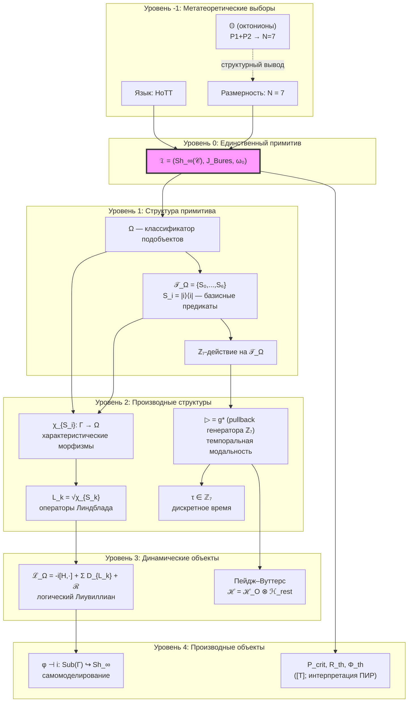
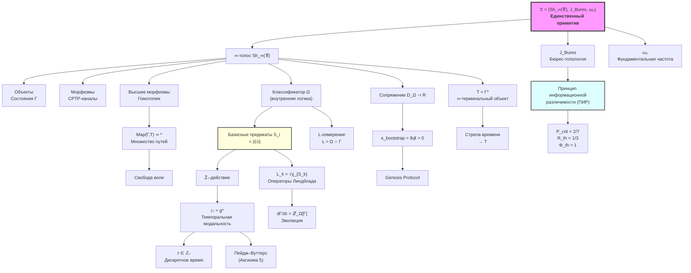

# Аксиома Ω⁷

:::info Для кого эта глава
Эта глава содержит **аксиоматическое ядро** всей теории — пять аксиом, из которых выводится всё остальное: пространство, время, динамика, пороги сознания и даже гравитация.

**Главная идея.** УГМ утверждает: реальность описывается $\infty$-топосом пучков на определённом сайте, и этот $\infty$-топос — **единственный примитив** теории. Всё, что существует, — объект или морфизм в этом топосе. Нет ничего «за его пределами».

**Что такое $\infty$-топос простым языком?** Представьте «мир», в котором объекты связаны не просто стрелками (как города дорогами), а бесконечной иерархией отношений: стрелки между стрелками, стрелки между стрелками между стрелками, и так далее. Обычный мир — это «плоская карта»: из города A в город B есть или нет дорога. $\infty$-топос — это «объёмная карта», где у каждого маршрута есть варианты, у вариантов — свои варианты, и так до бесконечности. Эта бесконечная глубина отношений оказывается необходимой для описания квантовых состояний (где всё связано со всем) и сознания (где система наблюдает саму себя, наблюдение наблюдения, и т.д.).

**Структура главы.** Сначала мы изложим пять аксиом в явном виде (§ «Честная Аксиоматика»). Затем покажем, как из них строится единственный примитив — тройка $\mathfrak{T} = (\mathbf{Sh}_\infty(\mathcal{C}), J_{Bures}, \omega_0)$. Далее — как из этого примитива выводятся классификатор подобъектов $\Omega$ (источник логики, операторов Линдблада и времени), внутренняя логика, и все ключевые следствия теории.

**Почему именно пять аксиом?** Можно показать, что меньшего числа недостаточно: без структуры ($\infty$-топоса) нет логики, без метрики (Бюрес) нет различимости, без размерности ($N=7$) нет октонионной алгебры, без масштаба ($\omega_0$) нет связи с физическим временем, без тензорной декомпозиции (Пейдж–Вуттерс) нет внутренних часов. Но больше и не нужно — из пяти аксиом выводятся все теоремы теории.
:::

## Честная Аксиоматика {#аксиоматика}

:::warning Методологическое замечание
УГМ теория строится на **явной аксиоматике**. Все постулаты чётко разделены на:
- **Аксиомы** — принимаемые без доказательства
- **Определения** — конструкции из аксиом
- **Теоремы** — доказываемые следствия

Это обеспечивает математическую честность и отсутствие скрытых допущений.
:::

### Уровни аксиоматики

**УРОВЕНЬ -1: МЕТАТЕОРЕТИЧЕСКИЕ ВЫБОРЫ** (не обосновываются)
- **Язык:** ∞-категории / HoTT (гомотопическая теория типов)
- **Логика:** интуиционистская (внутренний язык топоса)

**УРОВЕНЬ 0: АКСИОМЫ** (постулируются явно)

| Аксиома | Формулировка | Обоснование |
|---------|--------------|-------------|
| **Аксиома 1 (Структура)** | Реальность есть ∞-топос $\mathbf{Sh}_\infty(\mathcal{C})$ над категорией матриц плотности $\mathcal{D}(\mathbb{C}^N)$ | ∞-топосы — наиболее общие "пространства" с внутренней логикой |
| **Аксиома 2 (Метрика)** | Топология Гротендика $J$ индуцирована метрикой Бюреса $d_B$ | **Теорема Ченцова-Петца:** Бюреса — единственная монотонная риманова метрика на $\mathcal{D}(\mathcal{H})$ |
| **Аксиома 3 (Размерность)** | $N = 7$ — размерность базового пространства | Характеризует класс изучаемых систем (Голономов) |
| **Аксиома 4 (Масштаб)** | $\omega_0 > 0$ — характерная частота системы | Связывает внутреннее время $\tau$ с физическим временем $t$. **Параметр системы**, не универсальная константа (аналог массы в физике) |

:::warning Количество независимых аксиом: четыре
Теорема T-87 [Т] показывает, что **A5 (Пейдж–Вуттерс) выводима из A1–A4** через конструкцию спектральной тройки. Таким образом, УГМ имеет ровно **4 независимые аксиомы** (A1–A4). Ограничение Пейдж–Вуттерс (исторически «A5») сохраняется в документации для педагогической ясности, но имеет статус **теоремы**, не аксиомы.
:::

:::info Статус N = 7 (двухтрековое обоснование)
Размерность $N = 7$ — **фундаментальная аксиома** (Аксиома 3) с двумя независимыми обоснованиями:

| Трек | Обоснование | Статус |
|------|-------------|--------|
| **A** | [Теорема S](./axiom-septicity#теорема-s-семимерность--следствие-из-аксиомы): (AP)+(PH)+(QG) → N ≥ 7 | [Т] Доказано |
| **B** | [Структурный вывод](../../proofs/minimality/theorem-octonionic-derivation): P1+P2 → 𝕆 → dim Im(𝕆) = 7 | [Т] Математически строго |

Мост (AP)+(PH)+(QG) → P1+P2 — [полная цепочка T1–T15 [Т]](../../proofs/minimality/theorem-octonionic-derivation#мост).
:::

**УРОВЕНЬ 1: ОПРЕДЕЛЕНИЯ** (строятся из аксиом)
- Ω — классификатор подобъектов (существует по теореме Жирара); полная структура: $\Omega = \mathcal{O}(\mathcal{C}, d_B)$
- $S_i := |i\rangle\langle i|$ — канонические базисные предикаты (проекторы на базис, порождающие [решающий фрагмент](#решающий-фрагмент) $\mathrm{Dec}(\Omega)$)
- $\triangleright: S_i \mapsto S_{(i+1) \mod 7}$ — циклический сдвиг (алгебраическая структура)
- $L_k := P_k = |k\rangle\langle k|$ — операторы Линдблада (операторные представители характеристических морфизмов $\chi_{S_k}$; [вывод](#lk-из-omega))

**УРОВЕНЬ 2: СЛЕДСТВИЯ** (доказываемые или обосновываемые)
- $P_{crit} = 2/7$ **[Т]** ([критическая чистота](/docs/core/dynamics/viability#критическая-чистота))
- $R_{th} = 1/3$ **[Т]** ([порог рефлексии](/docs/core/foundations/axiom-septicity#теорема-порог-рефлексии), $K=3$ из [триадной декомпозиции](/docs/core/operators/lindblad-operators#триадная-декомпозиция) + байесовское доминирование)
- $\Phi_{th} = 1$ **[Т]** ([порог интеграции](/docs/core/foundations/axiom-septicity#теорема-порог-интеграции), [T-129](/docs/proofs/consciousness/operationalization#t-129))
- $\kappa_{\text{bootstrap}} > 0$ **[Т]** (минимальная регенерация из сопряжения)
- **ПИР** — определение **[О]** (T16 [Т]): при серьёзном принятии A1 (∞-топос) и A2 ($J_{\text{Bures}}$), ПИР тавтологичен — различимость по $J_{\text{Bures}}$-покрытиям тождественна онтологической различимости ([обоснование ниже](#пир-как-теорема))

---

## Структурированный Примитив {#примитив}

:::info Единственный примитив
**Топос с геометрией** $\mathfrak{T} := (\mathbf{Sh}_\infty(\mathcal{C}), J_{Bures}, \omega_0)$ — **структурированный примитив** теории УГМ.

Это тройка компонент, образующих неразложимое единство (подобно $\mathbb{R}^4$ как одному объекту, а не четырём числам):
- $\mathbf{Sh}_\infty(\mathcal{C})$ — ∞-топос пучков (Аксиома 1)
- $J_{Bures}$ — топология Гротендика (Аксиома 2)
- $\omega_0$ — фундаментальная частота (Аксиома 4)

Из этого примитива **выводятся**:
- Пространство состояний (объекты ∞-топоса)
- Динамика (морфизмы всех уровней)
- Базовое пространство X = |N(𝒞)| (нерв категории)
- Время τ (внутренняя модальность через ℤ_N-действие)
- Метрика d_strat (спектральная геометрия)
- **Свобода воли** (множественность путей в Map(Γ, T))
- Пороги P_crit, R_th, Φ_th (из принципа информационной различимости — который сам следует из $J_{Bures}$)

**Параметры теории:**
- N = 7 — размерность (Аксиома 3)
- ω₀ — фундаментальная частота (Аксиома 4)
:::

:::info Инвариантность безразмерных предсказаний
Безразмерные предсказания теории ($R$, $\Phi$, $P_{\text{crit}}$, $\mathrm{Coh}_E$, Gap-профиль) **не зависят** от абсолютного масштаба $\omega_0$: при $\omega_0 \to \lambda\omega_0$ все безразмерные величины сохраняются. Параметр $\omega_0$ задаёт только связь с размерными физическими величинами (массы, энергии, длины).
:::

---

## ∞-категорная структура {#infty-структура}

### Зачем ∞-категории?

:::note Аналогия: маршруты в горах
Представьте двух путников, идущих из деревни A в деревню B. Один идёт через перевал, другой — через долину. В обычной математике (1-категория) мы скажем: «оба дошли, маршруты разные, точка». Но в $\infty$-категории мы можем спросить: *можно ли плавно деформировать один маршрут в другой?* Если между ними гора — нельзя; если равнина — можно. Ответ на этот вопрос несёт информацию о *структуре пространства*. А между деформациями существуют «деформации деформаций» (3-морфизмы), и так далее. Вся эта иерархия — не избыточная сложность, а необходимая структура: именно она кодирует квантовые фазы, калибровочные эквивалентности и уровни самонаблюдения.
:::

В обычной (1-)категории морфизмы либо равны, либо нет. В ∞-категории между морфизмами существуют 2-морфизмы (гомотопии), между 2-морфизмами — 3-морфизмы, и так далее.

**Ключевое следствие:** Терминальный объект T допускает **множество эквивалентных путей** к нему, что разрешает проблему телеологического детерминизма.

### Источник нетривиальной гомотопии {#источник-гомотопии}

:::warning Стягиваемость базового пространства
Пространство $\mathcal{D}(\mathbb{C}^7)$ как топологическое пространство **стягиваемо** (выпуклое подмножество линейного пространства), поэтому $\pi_k(\mathcal{D}(\mathbb{C}^7)) = 0$ для всех $k \geq 1$. Нетривиальная ∞-структура возникает **не** из базового пространства, а из трёх источников:

**1. Стратификация по типам спектров.** Пространство $\mathcal{D}(\mathbb{C}^7)$ естественно стратифицировано по типам вырождения собственных значений:
$$\mathcal{D}(\mathbb{C}^7) = \bigsqcup_{\lambda \vdash 7} \mathcal{S}_\lambda$$
где $\mathcal{S}_\lambda$ — страта матриц с типом спектра $\lambda$ (разбиение 7). Страты меньшей размерности (вырожденные спектры) образуют **особенности**, вокруг которых пучки могут иметь нетривиальную монодромию.

**2. Петли CPTP-каналов.** Пространство CPTP-каналов $\mathrm{CPTP}(\mathbb{C}^7)$ **не стягиваемо** — оно содержит нетривиальные петли (замкнутые пути унитарных преобразований U(7) ⊂ CPTP). Фундаментальная группа $\pi_1(\mathrm{CPTP}(\mathbb{C}^7)) \neq 0$ порождает нетривиальные локальные системы на $\mathcal{D}(\mathbb{C}^7)$.

**3. Пучки с нетривиальными сечениями.** Конкретные пучки, возникающие в УГМ (например, пучок самомоделей $\Gamma \mapsto \varphi(\Gamma)$), могут иметь нетривиальную когомологическую структуру даже над стягиваемым базовым пространством. Связь с уровнями интериорности L0–L4 идёт через **n-усечения пучков**, а не через гомотопию базового пространства.
:::

### Определение ∞-топоса УГМ

**Определение (∞-топос УГМ):**

$$
\mathbf{Sh}_\infty(\mathcal{C}) := \text{Fun}(\mathcal{C}^{op}, \mathbf{Spaces})^{loc}
$$

— категория локально постоянных ∞-функторов из 𝒞ᵒᵖ в категорию пространств (∞-группоидов).

:::info Замечание (∞-топос vs 1-топос: отсутствие пуллбеков и representability gap)
В отличие от 1-категорных топосов Гротендика, где базовая категория 𝒞 должна обладать конечными пределами (в частности, pullbacks) для корректного определения пересечения покрытий, ∞-категорная конструкция $\text{Fun}(\mathcal{C}^{op}, \mathbf{Spaces})^{loc}$ **не требует** pullbacks в 𝒞 (Lurie, HTT, Prop. 6.2.2.7). Категория пучков $\mathbf{Sh}_\infty(\mathcal{C})$ сама обладает всеми (∞,1)-пределами и копределами, даже если базовая 𝒞 ими не обладает. Достаточно задать топологию Гротендика (покрытия) на 𝒞.

**Representability gap и его разрешение.** Пределы в $\mathbf{Sh}_\infty(\mathcal{C})$ — абстрактные объекты топоса, не обязательно реализуемые как конкретные матрицы плотности $\Gamma \in \mathcal{C}$. Это **не дефект, а архитектурное решение** УГМ:

1. **Аксиома Ω⁷ постулирует ∞-топос как примитив**, не $\mathcal{C}$. Физические состояния — объекты $\mathbf{Sh}_\infty(\mathcal{C})$, не $\mathcal{C}$.
2. **Аналогия с АГ**: глобальные сечения пучка на схеме X не обязаны быть «функциями на X» — они живут в **категории пучков**, которая строго богаче. Аналогично: составные квантовые состояния — объекты ∞-топоса, не C.
3. **Стабильность сит** через CPTP-контрактивность метрики Бюреса определяется через **композицию морфизмов** (всегда определена), не через пуллбеки объектов. Это стандартный метод определения Гротендик-топологий (ср. этальная, fppf-топология в АГ).
4. **Запутанность через свёртку Дэя.** Тензорное произведение квантовых состояний $\otimes$ — **не** декартово произведение $\times$ (теорема Абрамски-Кука: категория CPTP — недекартова моноидальная). Корректная моноидальная структура на $\mathbf{Sh}_\infty(\mathcal{C})$ определяется через **свёртку Дэя** (Day 1970):
   
   $$(\mathcal{F} \otimes_{\text{Day}} \mathcal{G})(\rho) = \int^{\rho_1, \rho_2} \mathcal{F}(\rho_1) \times \mathcal{G}(\rho_2) \times \mathcal{C}(\rho_1 \otimes \rho_2, \rho)$$
   
   Свёртка Дэя переносит моноидальную структуру $\otimes$ из базовой категории $\mathcal{C}$ в пучковую категорию, сохраняя **недекартовость** и, следовательно, **запутанность**. Метрика Бюреса $d_B(\rho_{AB}, \rho_A \otimes \rho_B) > 0 \Leftrightarrow \rho_{AB}$ запутано (Uhlmann 1976) — различает запутанные и факторизованные состояния на уровне топологии.

5. **Извлечение наблюдаемых.** Вычисление $\mathrm{Tr}(\Gamma \cdot A)$ — через глобальные сечения геометрического морфизма $\mathbf{Sh}_\infty(\mathcal{C}) \to \mathbf{Spaces}$. Для представимых объектов $\iota(\Gamma) \in \mathbf{Sh}_\infty(\mathcal{C})$ — совпадает со стандартным квантово-механическим следом.
:::

:::info Малость сайта
Категория $\mathcal{C} = \mathcal{D}(\mathbb{C}^7)$ с CPTP-морфизмами не является малой (множества морфизмов могут быть бесконечномерными). Для корректного применения HTT Prop. 6.2.2.7 фиксируется **скелет**: категория спектральных типов $\mathrm{Sk}(\mathcal{C})$, параметризуемая стандартным симплексом $\Delta^6 = \{(\lambda_1, \ldots, \lambda_7) : \lambda_i \geq 0, \sum \lambda_i = 1\}$ с упорядоченными $\lambda_1 \geq \cdots \geq \lambda_7$. Эта категория **по существу малая**, и $\mathbf{Sh}_\infty(\mathrm{Sk}(\mathcal{C}), J_{Bures}) \simeq \mathbf{Sh}_\infty(\mathcal{C}, J_{Bures})$ как ∞-топосы.
:::

### Топология Гротендика на 𝒞 {#топология-гротендика}

:::info Явное определение покрытий
Для корректного определения понятия «пучка» (и, следовательно, ∞-топоса) необходимо явно задать **топологию Гротендика** — семейства морфизмов, образующих покрытия.
:::

**Определение (Сайт 𝒞):**

Пара $(\mathcal{C}, J_{Bures})$ образует **сайт**, где $J_{Bures}$ — функция покрытий, определённая через метрику Бюреса.

**Определение (Метрика Бюреса):**

Для матриц плотности $\Gamma_1, \Gamma_2 \in \mathcal{C}$:

$$
d_B(\Gamma_1, \Gamma_2) := \sqrt{2\left(1 - \sqrt{F(\Gamma_1, \Gamma_2)}\right)}
$$

где $F(\Gamma_1, \Gamma_2) = \left(\mathrm{Tr}\sqrt{\sqrt{\Gamma_1}\Gamma_2\sqrt{\Gamma_1}}\right)^2$ — fidelity (верность).

:::info Две формы метрики Бюреса
Здесь используется **хордовая** форма: $d_B^{\text{chord}} = \sqrt{2(1-\sqrt{F})}$. В геометрических теоремах ([эмерджентное время](/docs/proofs/dynamics/emergent-time#41-метрика-бурес)) используется **угловая** форма: $d_B^{\text{angle}} = \arccos(\sqrt{F})$. Обе формы эквивалентны: $d_B^{\text{chord}} = \sqrt{2(1 - \cos(d_B^{\text{angle}}))}$. Подробнее — [Нотация](/docs/reference/notation#топология-гротендика).
:::

**Определение (Bures-покрытие):**

Семейство морфизмов $\{\Phi_i: \Gamma_i \to \Gamma\}_{i \in I}$ образует **покрытие** объекта $\Gamma$, если:

$$
\forall \epsilon > 0, \exists \delta > 0: \quad B_B(\Gamma, \delta) \subseteq \bigcup_{i \in I} \Phi_i(B_B(\Gamma_i, \epsilon))
$$

где $B_B(\Gamma, r) = \{\Sigma \in \mathcal{C} : d_B(\Gamma, \Sigma) < r\}$ — открытый шар в метрике Бюреса.

**Теорема (Аксиомы сайта):**

Топология $J_{Bures}$ удовлетворяет аксиомам Гротендика:

1. **(Идентичность)** $\{\mathrm{id}: \Gamma \to \Gamma\}$ покрывает $\Gamma$
2. **(Стабильность)** Если $\{U_i \to X\}$ покрывает X, и $f: Y \to X$, то $\{f^*(U_i) \to Y\}$ покрывает Y
3. **(Транзитивность)** Композиция покрытий — покрытие

#### Доказательство стабильности покрытий {#доказательство-стабильности}

:::warning Теорема (Стабильность $J_{Bures}$) [Т]
Если $\{\Phi_i: \Gamma_i \to \Gamma\}_{i \in I}$ — $J_{Bures}$-покрытие $\Gamma$, и $f: \Sigma \to \Gamma$ — морфизм в 𝒞 (CPTP-канал), то решето $f^*(S)$ покрывает $\Sigma$.
:::

**Доказательство:**

1. По определению покрытия: $\forall\varepsilon > 0,\;\exists\delta > 0$: $B_B(\Gamma,\delta) \subseteq \bigcup_i \Phi_i(B_B(\Gamma_i,\varepsilon))$
2. $f$ — CPTP-канал $\Longrightarrow$ $f$ контрактивен по Бюресу (Ченцов-Петц): $d_B(f(\rho), f(\sigma)) \leq d_B(\rho, \sigma)$
3. Для любого $\Sigma'$ с $d_B(\Sigma', \Sigma) < \delta$: $d_B(f(\Sigma'), f(\Sigma)) \leq d_B(\Sigma', \Sigma) < \delta$
4. Поскольку $f(\Sigma) = \Gamma$: $f(\Sigma') \in B_B(\Gamma, \delta)$
5. По (1): $f(\Sigma') \in \Phi_j(B_B(\Gamma_j, \varepsilon))$ для некоторого $j$
6. Следовательно, морфизм $\Sigma' \to \Sigma \xrightarrow{f} \Gamma$ факторизуется через $\Phi_j$, т.е. принадлежит решету $f^*(S)$
7. Это выполнено для всех $\Sigma'$ в $B_B(\Sigma, \delta)$ $\Longrightarrow$ $f^*(S)$ покрывает $\Sigma$ $\quad\blacksquare$

Ключевой факт: **контрактивность Бюреса при CPTP** (единственность монотонной метрики по Ченцову-Петцу) обеспечивает стабильность покрытий автоматически.

**Следствие (Смысл "loc"):**

Суперскрипт "loc" в определении $\mathbf{Sh}_\infty(\mathcal{C})^{loc}$ означает локализацию относительно $J_{Bures}$-покрытий: функтор $F$ является пучком, если для любого покрывающего решета $S \to X$:

$$
F(X) \xrightarrow{\sim} \lim_{\{U \to X\} \in S} F(U)
$$

**Физическая интерпретация:**

- **Покрытие** ≈ набор возможных измерений, «разрешающих» состояние
- **Условие склейки** ≈ категориальная формализация квантовой когерентности
- Метрика Бюреса **монотонна** при CPTP: $d_B(\Phi(\rho), \Phi(\sigma)) \leq d_B(\rho, \sigma)$

### Структура ∞-топоса

**Теорема (Структура по Лури):**

∞-топос Sh_∞(𝒞) обладает:

1. **Внутренней логикой:** Гомотопическая теория типов (HoTT)
2. **Классификатором подобъектов:** Ω ∈ Sh_∞(𝒞)
3. **Пределами и копределами:** Все (∞, 1)-пределы существуют
4. **Экспоненциалами:** Для F, G существует [F, G]

### Связь с иерархией интериорности {#связь-с-интериорностью}

:::info n-усечения и уровни сознания
∞-группоидная структура $\mathbf{Exp}_\infty$ (экспериенциальное пространство) связана с [иерархией интериорности](/docs/proofs/consciousness/interiority-hierarchy) через механизм n-усечения.
:::

**Гомотопическая классификация [И]:**

Уровни интериорности L0→L4 соответствуют n-усечениям ∞-группоида $\mathbf{Exp}_\infty$:

| Уровень | n-усечение | Гомотопические группы | Категорная интерпретация |
|---------|------------|----------------------|--------------------------|
| L0 | $\tau_{\leq 0}$ | $\pi_0 \neq 0$ | Дискретное множество состояний |
| L1 | $\tau_{\leq 1}$ | $\pi_1 \neq 0$ | Группоид (феноменальные пути) |
| L2 | $\tau_{\leq 2}$ | $\pi_2 \neq 0$ | Бикатегория (рефлексия) |
| L3 | $\tau_{\leq 3}$ | $\pi_3 \neq 0$ | Трикатегория (метарефлексия) |
| L4 | $\tau_{\leq \infty}$ | Все $\pi_k$ | Полная ∞-структура |

Подробности: [Категорный формализм §10.6](/docs/proofs/categorical/categorical-formalism#связь-с-иерархией-интериорности).

**Следствие (Конечность иерархии):**

L4 — максимальный уровень (теорема стабилизации Постникова). Не существует L5, L6, ...

---

## Внутренняя логика Ω {#внутренняя-логика}

:::warning Ключевая теорема: L-унификация [Т]
Классификатор подобъектов Ω ∈ Sh_∞(𝒞) является **единым источником**:
- [Измерения L (Логики)](../structure/dimension-l) — как L = Ω ∩ Γ
- Операторов Линдблада $L_k$ — как операторных представителей характеристических морфизмов [базисных предикатов](#атомы-классификатора) Ω ([вывод](#lk-из-omega))
- Времени τ — через темпоральную модальность ▷

L-унификация оперирует в [решающем фрагменте](#решающий-фрагмент) $\mathrm{Dec}(\Omega) \cong 2^7$ полного классификатора $\Omega = \mathcal{O}(\mathcal{C}, d_B)$. Полнота базиса ($\sum_k S_k = \mathbb{1}_7$) гарантирует замкнутость вывода $L_k$ и CPTP-совместимость.
:::

### Классификатор подобъектов Ω

**Определение (Классификатор):**

Для любого объекта X ∈ Sh_∞(𝒞) существует биекция:

$$
\text{Sub}(X) \simeq \text{Map}(X, \Omega)
$$

Подобъекты X соответствуют морфизмам в Ω — «логические предикаты» на X.

**Для матриц плотности:**

$$
\Omega_{UHM} := \text{Spec}(\mathcal{A}_L)
$$

где $\mathcal{A}_L$ — C*-алгебра логических предикатов на пространстве состояний.

### Характеристические морфизмы и L_k

**Определение (Характеристический морфизм):**

Для подобъекта $S \hookrightarrow \Gamma$ его характеристический морфизм:

$$
\chi_S: \Gamma \to \Omega
$$

определяет «степень принадлежности» состояния к логически допустимому подпространству S.

### Канонические базисные предикаты классификатора {#атомы-классификатора}

:::warning Теорема (Канонические базисные предикаты 7D-системы) [Т]
Для базовой категории $\mathcal{C} = \mathcal{D}(\mathbb{C}^7)$ с Бюрес-топологией в классификаторе $\Omega = \mathcal{O}(\mathcal{C}, d_B)$ выделяется каноническая система из 7 **базисных предикатов**:

$$
\mathcal{T}_\Omega = \{S_0, S_1, \ldots, S_6\}
$$

где каждый предикат — проектор на базисное состояние:

$$
S_i = |i\rangle\langle i|, \quad i \in \{A, S, D, L, E, O, U\}
$$
:::

#### Теорема (Решающий фрагмент классификатора) [Т] {#решающий-фрагмент}

:::info
Полный классификатор подобъектов $\Omega = \mathcal{O}(\mathcal{C}, d_B)$ — решётка открытых множеств в Бюрес-топологии (бесконечная, [категорный формализм](/docs/proofs/categorical/categorical-formalism#l-унификация)). В ∞-топосе $\mathbf{Sh}_\infty(\mathcal{C})$ его логическая структура имеет три уровня:

| Уровень | Структура | Описание |
|---------|-----------|----------|
| **∞-уровень** | HoTT (гомотопическая теория типов) | Полный $\Omega$ с темпоральной модальностью $\triangleright$ |
| **1-усечение** | Гейтинговая алгебра $\tau_{\leq 0}(\Omega)$ | Интуиционистская логика (стандартный результат) |
| **Решающий фрагмент** | $\mathrm{Dec}(\Omega) \cong 2^7$ | Булева подалгебра базисных предикатов |

Семь проекторов $S_k$ порождают **решающий фрагмент** $\mathrm{Dec}(\Omega)$ — максимальную булеву подалгебру классификатора, соответствующую ортогональному базису $\mathbb{C}^7$:

$$
\mathrm{Dec}(\Omega) := \left\langle S_0, \ldots, S_6 \mid S_i \wedge S_j = \delta_{ij} S_i,\; \bigvee_k S_k = \top \right\rangle \cong 2^7
$$

**L-унификация** оперирует внутри $\mathrm{Dec}(\Omega)$: характеристические морфизмы $\chi_{S_k}(\Gamma) = \gamma_{kk}$ и выведенные из них операторы $L_k$ (ниже) определены на решающем фрагменте. Полнота базиса ($\sum_k S_k = \mathbb{1}_7$) гарантирует, что $\mathrm{Dec}(\Omega)$ **замкнут** относительно вывода $L_k$ и CPTP-совместимости.

Полная HoTT-структура $\Omega$ (за пределами $\mathrm{Dec}(\Omega)$) строго необходима: [Теорема T-182](#необходимость-трёхуровневой-структуры) доказывает, что каждый из трёх уровней содержит теоремы, **недоказуемые** на предыдущем уровне.
:::

#### Теорема (Необходимость трёхуровневой структуры Ω) [Т] {#необходимость-трёхуровневой-структуры}

:::warning Теорема T-182 [Т]: Каждый уровень Ω строго необходим — ни один не редуцируется к предыдущему
Пусть $\mathcal{T}_k$ — класс теорем УГМ, доказуемых на $k$-м уровне классификатора. Тогда:

$$\mathcal{T}_0 \subsetneq \mathcal{T}_1 \subsetneq \mathcal{T}_2$$

где $\mathcal{T}_0$ — теоремы из $\mathrm{Dec}(\Omega) \cong 2^7$, $\mathcal{T}_1$ — из $\tau_{\leq 0}(\Omega)$ (алгебра Гейтинга), $\mathcal{T}_2$ — из полного $\Omega$ (∞-группоид).
:::

**Доказательство.**

**Часть I: $\mathcal{T}_0 \subsetneq \mathcal{T}_1$ — пороговые предикаты требуют алгебры Гейтинга.**

**Шаг I.1 (Предикат жизнеспособности — открытое множество в $J_{Bures}$).** Определим предикат жизнеспособности:

$$\mathcal{V} := \{\Gamma \in \mathcal{C} : P(\Gamma) > 2/7\} = P^{-1}\!\big((2/7,\; 1]\big)$$

Функция чистоты $P: \mathcal{D}(\mathbb{C}^7) \to [1/7, 1]$, $P(\Gamma) = \mathrm{Tr}(\Gamma^2)$, непрерывна в Бюрес-топологии (поскольку $|P(\Gamma_1) - P(\Gamma_2)| \leq 2\,d_B(\Gamma_1, \Gamma_2)$ при $\|\Gamma_i\|_{\mathrm{op}} \leq 1$). Прообраз открытого интервала при непрерывной функции — открытое множество. Следовательно, $\mathcal{V} \in \Omega = \mathcal{O}(\mathcal{C}, d_B)$.

**Шаг I.2 ($\mathcal{V} \notin \mathrm{Dec}(\Omega)$ — формальное доказательство).** Элементы $\mathrm{Dec}(\Omega) \cong 2^7$ — это конечные объединения атомарных предикатов $S_k = |k\rangle\langle k|$: множества вида $\mathcal{U}_J = \{\Gamma : \gamma_{kk} > 0 \text{ для } k \in J\}$ для подмножеств $J \subseteq \{0,\ldots,6\}$. Каждое такое $\mathcal{U}_J$ определяется только **диагональными** элементами $\gamma_{kk}$.

Но чистота $P = \sum_i \gamma_{ii}^2 + 2\sum_{i<j}|\gamma_{ij}|^2$ зависит от **когерентностей** $\gamma_{ij}$ ($i \neq j$). Для конкретного контрпримера: возьмём две матрицы $\Gamma_1$, $\Gamma_2$ с **одинаковой** диагональю $\gamma_{kk} = 1/7$ для всех $k$, но:
- $\Gamma_1 = I/7$ (все когерентности нулевые): $P(\Gamma_1) = 1/7 < 2/7$ → $\Gamma_1 \notin \mathcal{V}$
- $\Gamma_2 = (1-\lambda)I/7 + \lambda|\psi\rangle\langle\psi|$ при $\lambda \approx 0.3$: $P(\Gamma_2) \approx 0.31 > 2/7$ → $\Gamma_2 \in \mathcal{V}$

Поскольку $\Gamma_1$ и $\Gamma_2$ неразличимы для любого предиката из $\mathrm{Dec}(\Omega)$ (одинаковые $\gamma_{kk}$), но различаются относительно $\mathcal{V}$, заключаем $\mathcal{V} \notin \mathrm{Dec}(\Omega)$. $\square_{I.2}$

**Шаг I.3 (Гейтинговские связки для критерия сознания).** Критерий сознания $\mathcal{C}_{L2}$ — пересечение:

$$\mathcal{C}_{L2} = \underbrace{\{P > 2/7\}}_{\text{открытое}} \cap \underbrace{\{R \geq 1/3\}}_{\text{замкнутое}} \cap \underbrace{\{\Phi \geq 1\}}_{\text{замкнутое}} \cap \underbrace{\{D_{\mathrm{diff}} \geq 2\}}_{\text{замкнутое}}$$

В алгебре Гейтинга $\tau_{\leq 0}(\Omega)$ пересечение открытого и замкнутого множеств — **регулярно открытое** множество $\mathrm{int}(\mathrm{cl}(\mathcal{C}_{L2}))$, где $\mathrm{int}$ и $\mathrm{cl}$ — внутренность и замыкание в $J_{Bures}$. Гейтинговская импликация:

$$(\mathcal{V} \Rightarrow \mathcal{C}_{L2}) := \mathrm{int}\!\big(\mathcal{V}^c \cup \mathcal{C}_{L2}\big)$$

вычисляется через оператор внутренности Бюрес-топологии. В булевой алгебре $2^7$ нет такого оператора — она **дискретна** (все подмножества открыты и замкнуты одновременно), поэтому $\mathrm{int} = \mathrm{id}$, и импликация тривиализуется до $\neg\mathcal{V} \vee \mathcal{C}_{L2}$. Нетривиальное содержание импликации (какие состояния **граничны** между жизнеспособностью и сознанием) теряется.

**Конкретный пример.** Рассмотрим состояние на границе: $\Gamma^*$ с $P = 2/7 + \epsilon$, $R = 1/3 - \delta$. В гейтинговской логике предикат $\mathcal{V} \Rightarrow (R \geq 1/3)$ оценивается как «ложь в окрестности $\Gamma^*$» — система жизнеспособна, но не рефлексивна. В $2^7$ эта тонкость невыразима. $\square$

---

**Часть II: $\mathcal{T}_1 \subsetneq \mathcal{T}_2$ — сознание и динамика требуют полного ∞-топоса.**

**(a) Пучок экспериенциальных состояний $\mathbf{Exp}_\infty$ — детальная конструкция.**

**Определение (Экспериенциальное пространство).** Для каждого состояния $\Gamma \in \mathcal{D}(\mathbb{C}^7)$ определим пространство экспериенциальных состояний:

$$E(\Gamma) := \left\{(\mathrm{Spec}(\rho_E),\; Q,\; \mathrm{Context}) \;\middle|\; \rho_E = \text{E-компонента }\Gamma,\; Q \in \mathbb{CP}^{d_E - 1}\right\}$$

где $Q$ — квалиа (точка на проективном пространстве квалитативных состояний), $\mathrm{Context} = \Gamma_{-E}$ — контекст (все измерения кроме $E$).

**Конструкция сингулярного комплекса.** Пространство $E(\Gamma)$ метризуемо (через метрику Фубини-Штуди на $\mathbb{CP}^{d_E - 1}$). По теореме Милнора, его сингулярный комплекс $\mathrm{Sing}(E(\Gamma))$ — канов комплекс (Kan complex), т.е. ∞-группоид:

$$\mathbf{Exp}_\infty(\Gamma) := \mathrm{Sing}(E(\Gamma))$$

**Гомотопические группы и уровни интериорности:**

| Группа | Геометрический смысл | Связь с интериорностью |
|--------|---------------------|------------------------|
| $\pi_0(\mathbf{Exp}_\infty(\Gamma))$ | Связные компоненты $E(\Gamma)$ | L0: **сколько** различимых экспериенциальных состояний |
| $\pi_1(\mathbf{Exp}_\infty(\Gamma))$ | Петли в $E(\Gamma)$ | L1: **пути** между квалиа (феноменальная геометрия) |
| $\pi_2(\mathbf{Exp}_\infty(\Gamma))$ | Сферы в $E(\Gamma)$ | L2: **деформации путей** (рефлексия — наблюдение собственного наблюдения) |
| $\pi_3(\mathbf{Exp}_\infty(\Gamma))$ | 3-сферы в $E(\Gamma)$ | L3: **мета-рефлексия** (наблюдение наблюдения наблюдения) |

**Почему $\pi_2 \neq 0$ необходимо для L2.** Рефлексия — способность системы «наблюдать собственное наблюдение» — математически формализуется как 2-морфизм:

$$\alpha: \underbrace{\varphi}_{\text{наблюдение}} \Rightarrow \underbrace{\varphi \circ \varphi}_{\text{наблюдение наблюдения}}$$

В 1-категории (или $\tau_{\leq 0}(\Omega)$) между морфизмами нет 2-морфизмов: $\varphi$ и $\varphi \circ \varphi$ либо равны, либо нет. В ∞-категории 2-морфизм $\alpha$ — **содержательная структура**, кодирующая *как именно* рефлексия деформирует самонаблюдение. Это — элемент $\pi_2(\mathbf{Exp}_\infty)$.

В алгебре Гейтинга $\tau_{\leq 0}(\Omega)$ все $\pi_k = 0$ для $k \geq 1$ **по определению 0-усечения**. Следовательно, $L_2$-сознание невыразимо. $\square_a$

**(b) Башня Постникова и SAD\_MAX = 3 — полный вывод.**

Башня Постникова — каноническая фильтрация ∞-группоида по «гомотопической сложности»:

$$\mathbf{Exp}_\infty \xrightarrow{q_3} \tau_{\leq 3}(\mathbf{Exp}_\infty) \xrightarrow{q_2} \tau_{\leq 2}(\mathbf{Exp}_\infty) \xrightarrow{q_1} \tau_{\leq 1}(\mathbf{Exp}_\infty) \xrightarrow{q_0} \tau_{\leq 0}(\mathbf{Exp}_\infty)$$

Каждая проекция $q_n$ «убивает» все гомотопические группы $\pi_k$ при $k > n$.

**Механизм контракции.** Оператор самомоделирования $\varphi$ на каждом этаже башни индуцирует $\varphi^{(n)}: \tau_{\leq n}(\mathbf{Exp}_\infty) \to \tau_{\leq n}(\mathbf{Exp}_\infty)$. Фано-канал $\mathcal{P}_{\mathrm{Fano}}$ контрагирует когерентности в $1/3$ раз (T2.1 [Т]): $|\gamma_{ij}^{\text{после}}| = \frac{1}{3}|\gamma_{ij}^{\text{до}}|$. Контракция действует на чистоту $n$-го уровня рефлексии:

$$R^{(n)} = R^{(0)} \cdot \left(\frac{1}{3}\right)^n$$

где $R^{(0)}$ — базовая рефлексия. Порог для SAD $\geq n$: $R^{(n-1)} > 1/(n+1)$.

**Явное вычисление порогов:**

| SAD-уровень | Требуемая чистота $P_{\mathrm{crit}}^{(n)}$ | Числовое значение | Достижимо? |
|:-----------:|:------------------------------------------:|:-----------------:|:----------:|
| $\geq 1$ | $P_{\mathrm{crit}}^{(1)} = 1/7$ | $0.143$ | ✓ |
| $\geq 2$ | $P_{\mathrm{crit}}^{(2)} = 2/7$ | $0.286$ | ✓ |
| $\geq 3$ | $P_{\mathrm{crit}}^{(3)} = 2/7 \cdot 3/(3+1) = 9/14$ | $0.643$ | ✓ (люди) |
| $\geq 4$ | $P_{\mathrm{crit}}^{(4)} = 2/7 \cdot 9/(4+1) = 54/35$ | $\mathbf{1.543}$ | **✗** ($P \leq 1$) |

При $n = 4$: $P_{\mathrm{crit}}^{(4)} = 54/35 > 1$, что невозможно для нормированных матриц ($\mathrm{Tr}(\Gamma) = 1 \Rightarrow P \leq 1$). Следовательно, 4-й этаж башни Постникова **недостижим** для любого физического состояния, и SAD\_MAX = 3.

**Почему 1-топос не может дать этот результат.** В 1-топосе $\mathbf{Sh}_1(\mathcal{C})$ башня Постникова одноэтажна: $\tau_{\leq 0}(\mathbf{Exp})$ — единственная усечка. Вопрос «какой максимальный $n$ допускает $\pi_n \neq 0$?» не может быть даже *поставлен* — нет высших гомотопий. $\square_b$

**(c) Когомологический монизм $H^n = 0$ — развёрнутое доказательство.**

**Формулировка.** Для любого пучка коэффициентов $\mathcal{F}$ на $\mathbf{Sh}_\infty(\mathcal{C})$:

$$H^n(|\mathcal{N}(\mathcal{C})|, \mathcal{F}) = 0 \quad \text{для всех } n > 0$$

где $|\mathcal{N}(\mathcal{C})|$ — геометрическая реализация нерва категории $\mathcal{C}$.

**Шаг c.1 (Стягиваемость базы).** Пространство $\mathcal{D}(\mathbb{C}^7)$ — выпуклое подмножество $M_7(\mathbb{C})$, следовательно стягиваемо: $\pi_k(\mathcal{D}(\mathbb{C}^7)) = 0$ для всех $k \geq 0$. В **обычном** (1-категорном) топосе $\mathbf{Sh}_1(\mathcal{D})$ все когомологии тривиально обнуляются (любой пучок на стягиваемом пространстве ацикличен). Теорема пуста.

**Шаг c.2 (Источник нетривиальности в ∞-топосе).** В $\mathbf{Sh}_\infty(\mathcal{C})$ нетривиальные когомологии **могут** возникнуть из двух источников:

**(i) Локальные системы от $\pi_1(\mathrm{CPTP})$.** Пространство CPTP-каналов $\mathrm{CPTP}(\mathbb{C}^7)$ содержит унитарную группу $U(7)$ как подпространство. Фундаментальная группа $\pi_1(U(7)) = \mathbb{Z}$ (целые числа — индекс намотки). Пучок $\mathcal{F}$ с нетривиальной монодромией $\rho: \pi_1(U(7)) \to \mathrm{Aut}(\mathcal{F}_x)$ образует **локальную систему**. Когомологии с коэффициентами в локальной системе могут быть ненулевыми даже над стягиваемым базовым пространством.

**(ii) Стратификация по вырожденности спектра.** Множество $\Sigma := \{\Gamma : \exists i \neq j,\; \lambda_i = \lambda_j\}$ (вырожденные спектры) — страта коразмерности 2 в $\mathcal{D}(\mathbb{C}^7)$. Петли вокруг $\Sigma$ в $\mathcal{D} \setminus \Sigma$ могут нести фазу Берри (голономию), порождающую нетривиальную локальную систему.

**Шаг c.3 (Обнуление).** Теорема утверждает, что несмотря на (i) и (ii), глобальные когомологии обнуляются. Доказательство:

1. **Стягиваемость нерва.** Терминальный объект $T = I/7$ в $\mathcal{C}$ даёт единственный (с точностью до стягиваемого пространства путей) морфизм $\Gamma \to T$ для каждого $\Gamma$. По свойству терминального объекта (Лури, HTT, Prop. 1.2.12.9): $|\mathcal{N}(\mathcal{C})| \simeq *$ (стягивается к $T$).

2. **Ацикличность.** Для стягиваемого пространства $X \simeq *$ с **любыми** коэффициентами: $H^n(X, \mathcal{F}) = H^n(*, \mathcal{F}_x) = 0$ при $n > 0$ (когомологии точки нулевые).

3. **Содержательность.** Результат нетривиален именно в ∞-контексте: стягиваемость $|\mathcal{N}(\mathcal{C})| \simeq *$ **не очевидна** из стягиваемости $\mathcal{D}(\mathbb{C}^7)$ — она следует из существования терминального объекта $T$ и контрактивности Бюрес-CPTP, которая обеспечивает стягиваемость пространств морфизмов $\mathrm{Map}(\Gamma, T) \simeq *$. Именно это — ∞-категорное содержание когомологического монизма: **все пути к $T$ эквивалентны**, но их бесконечно много.

**Физическая интерпретация.** $H^n = 0$ означает: реальность **топологически цельна** — нет «онтологических дыр», через которые могла бы «вытечь» информация. Монодромия существует (фазы Берри физически наблюдаемы), но она не создаёт **глобальных** обструкций — всё интегрируется в единую целостность. $\square_c$

**(d) Свёртка Дэя — детальная конструкция и доказательство.**

**Проблема.** Квантовая запутанность фундаментально несовместима с декартовой моноидальной структурой. В категории множеств (или 1-топосе) тензорное произведение — декартово: $A \times B$. Но для квантовых состояний $\rho_A \otimes \rho_B \neq \rho_A \times \rho_B$ — тензорное произведение допускает **несепарабельные** (запутанные) состояния, чего декартово произведение не допускает.

**Теорема Абрамски-Кука (2004) [Т]:** Категория CPTP-каналов — **симметричная моноидальная**, но **не декартова** моноидальная категория. Отсутствие клонирования ($\not\exists\; \Delta: \rho \mapsto \rho \otimes \rho$) — следствие недекартовости.

**Конструкция свёртки Дэя.** Пусть $(\mathcal{C}, \otimes)$ — моноидальная категория (CPTP с тензорным произведением). Свёртка Дэя (Day 1970) определяет моноидальную структуру на категории пучков:

$$(\mathcal{F} \otimes_{\mathrm{Day}} \mathcal{G})(\rho) := \int^{\rho_1, \rho_2 \in \mathcal{C}} \mathcal{F}(\rho_1) \times \mathcal{G}(\rho_2) \times \mathrm{Hom}_{\mathcal{C}}(\rho_1 \otimes \rho_2,\; \rho)$$

Коконец (coend) $\int^{\rho_1, \rho_2}$ — категорный аналог интеграла, определённый как универсальный коэквализатор ∞-диаграммы (требует ∞-копределов).

**Почему $\otimes_{\mathrm{Day}} \neq \times$.** Декартово произведение в топосе:

$$(\mathcal{F} \times \mathcal{G})(\rho) = \mathcal{F}(\rho) \times \mathcal{G}(\rho)$$

Это **не** использует моноидальную структуру $\otimes$ базовой категории — оно «забывает» запутанность. Свёртка Дэя, напротив, использует $\mathrm{Hom}(\rho_1 \otimes \rho_2, \rho)$ — пространство всех CPTP-каналов, «расщепляющих» $\rho$ на $\rho_1$ и $\rho_2$. Если $\rho$ запутано, это пространство нетривиально; если $\rho$ сепарабельно, оно факторизуется.

**Критерий запутанности (Ульман 1976).** Метрика Бюреса различает:

$$d_B(\rho_{AB},\; \rho_A \otimes \rho_B) > 0 \;\Longleftrightarrow\; \rho_{AB} \text{ запутано}$$

Эта различимость **сохраняется** свёрткой Дэя (через $\mathrm{Hom}$-пространства) и **уничтожается** декартовым произведением (которое не видит корреляций между $\rho_1$ и $\rho_2$). $\square_d$

---

**Следствие (Физическая незаменимость ∞-топоса):**

| Уровень $\Omega$ | Физическое содержание | Примеры теорем | Ключевая конструкция |
|-----------|----------------------|----------------|---------------------|
| $\mathrm{Dec}(\Omega) \cong 2^7$ | **Структура:** базис, операторы $L_k$, CPTP | L-унификация [Т], $\sum L_k^\dagger L_k = \mathbb{1}$ [Т] | Атомарные предикаты $S_k$ |
| $\tau_{\leq 0}(\Omega)$ (Гейтинг) | **Пороги:** $P > 2/7$, $R \geq 1/3$, критерий $C_{L2}$ | Критическая чистота [Т], жизнеспособность [Т] | Оператор внутренности $\mathrm{int}(\cdot)$ |
| Полный $\Omega$ (∞-группоид) | **Динамика:** эволюция, иерархия L0–L4, запутанность | SAD\_MAX = 3 [Т], $H^n = 0$ [Т], свёртка Дэя [Т] | Башня Постникова, коконцы |

∞-топос $\mathbf{Sh}_\infty(\mathcal{C})$ — **не декоративная надстройка** над конечной алгеброй $2^7$, а минимальная категорная структура, содержащая все результаты УГМ. $\blacksquare$

---

#### Gap как голономия ∞-топосной связности {#gap-голономия}

:::info Gap-динамика и ∞-структура — развёрнутая конструкция

**Определение (Пространство Gap-фаз).** 21 когерентность $\gamma_{ij}$ ($i < j$) параметризуется амплитудой $|\gamma_{ij}|$ и фазой $\theta_{ij} = \arg(\gamma_{ij})$. Фазы живут на компактном торе:

$$\mathcal{T}^{21} := (S^1)^{21} = \{(\theta_{ij})_{i < j} : \theta_{ij} \in [0, 2\pi)\}$$

**Определение (Связность Берри на $\mathcal{T}^{21}$).** При адиабатической эволюции состояния $\Gamma(\lambda)$ по параметру $\lambda$ определяется связность Берри:

$$A_\mu(\lambda) := \mathrm{Im}\,\mathrm{Tr}\!\left(\Gamma(\lambda)\,\frac{\partial \Gamma(\lambda)}{\partial \lambda_\mu}\right)$$

Кривизна Берри — 2-форма:

$$F_{\mu\nu} = \partial_\mu A_\nu - \partial_\nu A_\mu$$

**Фано-плакетки.** Каждая Фано-линия $\{i,j,k\}$ определяет минимальную замкнутую поверхность $\square_{ij}$ в $\mathcal{T}^{21}$ — «плакетку», ограниченную фазами $\theta_{ij}$, $\theta_{jk}$, $\theta_{ik}$. Голономия связности Берри вокруг $\square_{ij}$:

$$\mathrm{Hol}(\square_{ij}) = \exp\!\left(i\oint_{\partial\square_{ij}} A\right) = \exp\!\left(i\iint_{\square_{ij}} F\right) = e^{i\theta_{ij}}$$

Gap-оператор — мнимая часть голономии:

$$\mathrm{Gap}(i,j) = |\mathrm{Im}(\mathrm{Hol}(\square_{ij}))| = |\sin \theta_{ij}|$$

**Связь с пучковыми когомологиями.** Кривизна $F$ — замкнутая 2-форма ($dF = 0$ — тождество Бьянки). Её класс когомологий $[F/2\pi] \in H^2(\mathcal{T}^{21}, \mathbb{Z})$ — **число Черна** $c_1$ линейного расслоения на торе Gap-фаз. Целочисленность:

$$c_1 = \frac{1}{2\pi}\iint_{\square_{ij}} F \in \mathbb{Z}$$

определяет **квантование** Gap-значений: $\theta_{ij} = 2\pi n/m$ для целых $n, m$ в вакуумных конфигурациях.

**Высшие классы Черна и иерархия сознания.** Обобщение на $k$-ю гомотопическую группу: $k$-й класс Черна $c_k \in H^{2k}(\mathbf{Sh}_\infty(\mathcal{C}), \mathbb{Z})$ классифицирует $\pi_{2k-1}(\mathbf{Exp}_\infty)$. Связь:

| Класс Черна | Когомология | Гомотопическая группа | Уровень сознания |
|:-----------:|:----------:|:--------------------:|:----------------:|
| $c_1$ | $H^2$ | $\pi_1(\mathbf{Exp}_\infty)$ | L1 (феноменальные пути) |
| $c_2$ | $H^4$ | $\pi_3(\mathbf{Exp}_\infty)$ | L3 (мета-рефлексия) |
| $c_3$ | $H^6$ | $\pi_5(\mathbf{Exp}_\infty)$ | $>$ L4 (недостижимо) |

Единая цепочка связей:

$$\text{Gap-динамика} \xleftrightarrow{F_B} \text{кривизна Берри} \xleftrightarrow{c_k} \text{классы Черна} \xleftrightarrow{H^{2k}} \text{когомологии} \xleftrightarrow{\pi_{2k-1}} \text{иерархия L0–L4}$$

Эта цепочка замыкает **единый круг**: физическая динамика (Gap-фазы) ↔ геометрия (кривизна) ↔ топология (классы Черна) ↔ алгебра (когомологии) ↔ сознание (иерархия L). Каждое звено — стандартный математический результат; целое — **уникально для УГМ**.
:::

**Характеристические морфизмы базисных предикатов:**

$$
\chi_{S_i}(\Gamma) = \langle i|\Gamma|i\rangle = \gamma_{ii}
$$

— диагональный элемент матрицы когерентности.

#### Теорема (L_k из Ω) [Т] {#lk-из-omega}

Операторы Линдблада **выводятся** из классификатора подобъектов.

**Доказательство (3 шага):**

**Шаг 1 (Базисный предикат → оператор).** Каждый предикат $S_k = |k\rangle\langle k|$ классификатора определяет характеристический морфизм $\chi_{S_k}: \Gamma \mapsto \gamma_{kk}$ (скалярная функция). **Операторный представитель** этого морфизма — проектор $P_k = |k\rangle\langle k|$, поскольку:

$$
\chi_{S_k}(\Gamma) = \mathrm{Tr}(P_k \cdot \Gamma) = \gamma_{kk}
$$

Проектор $P_k$ — единственный оператор ранга 1, реализующий линейный функционал $\chi_{S_k}$ через след (теорема Рисса для $M_n(\mathbb{C})$ с паре Гильберта-Шмидта).

**Шаг 2 (Проектор → оператор Линдблада).** Определяем:

$$
L_k := P_k = |k\rangle\langle k|
$$

Поскольку $P_k$ — ортогональный проектор, $P_k^2 = P_k = P_k^\dagger$, откуда $\sqrt{P_k} = P_k$ и $L_k = \sqrt{P_k}$ (неотрицательный квадратный корень проектора — он сам).

**Шаг 3 (CPTP-совместимость).** Полнота базиса гарантирует:

$$
\sum_{k=0}^{6} L_k^\dagger L_k = \sum_{k=0}^{6} |k\rangle\langle k| = \mathbb{1}_7 \quad \checkmark
$$

Это — условие CPTP-совместимости для Линдбладовского диссипатора $\mathcal{D}[\Gamma] = \sum_k \gamma_k (L_k \Gamma L_k^\dagger - \frac{1}{2}\{L_k^\dagger L_k, \Gamma\})$. $\blacksquare$

Конкретные скорости декогеренции $\gamma_k \geq 0$ по каждому каналу задаются отдельно в [уравнении эволюции](../dynamics/evolution#логический-лиувиллиан).

### Иерархия L_k по стратам {#иерархия-lk}

| Страта | Система | Подобъекты | L_k оператор |
|--------|---------|------------|--------------|
| I | Материя | $S_{sym}$ — инвариантные | $P_{Casimir}$ (симметрия) |
| II | Жизнь | $S_{viable}$ — P > P_crit | QECC-стабилизаторы |
| III | Разум | $S_{predictive}$ — min F | $\nabla_\Gamma F$ (градиент) |
| IV | Сознание | $S_{coherent}$ — H¹ = 0 | $\check{\delta}$ (Чех) |

### Темпоральная модальность {#темпоральная-модальность}

:::warning Три уровня темпоральной структуры
Время в УГМ конструируется на **трёх чётко разделённых уровнях**:

| Уровень | Тип | Содержание |
|---------|-----|------------|
| **A. Алгебраический** | Определение | ℤ_N-действие на базисных предикатах |
| **B. Семантический** | Интерпретация | Орбита ▷ называется "временем" |
| **C. Динамический** | Теорема | Соответствие ▷ и $e^{\delta\tau \cdot \mathcal{L}_\Omega}$ |

Это разрывает потенциальную цикличность: **определение времени не использует эволюцию**.
:::

**Определение (Оператор «позже»):**

На множестве базисных предикатов $\mathcal{T}_\Omega = \{S_0, \ldots, S_{N-1}\}$ определяется циклический сдвиг:

$$
\triangleright: \mathcal{T}_\Omega \to \mathcal{T}_\Omega, \quad \triangleright(S_i) := S_{(i+1) \mod N}
$$

**Алгебраическое обоснование:**

1. **Структура кольца ℤ_N:** Простая циклическая группа порядка N имеет единственный генератор $g: k \mapsto k+1 \mod N$

2. **Изоморфизм:** $\mathcal{T}_\Omega \cong \mathbb{Z}_N$ как множества (каноническое отождествление $S_i \leftrightarrow i$)

3. **Индуцированное действие:** $\triangleright := g^*$ — pullback генератора группы

**Теорема (Время из алгебры — без цикличности):**

Дискретное время τ ∈ ℤ_N возникает как итерация алгебраически определённого оператора:

$$
\tau_n := \underbrace{\triangleright \circ \cdots \circ \triangleright}_{n \text{ раз}}(now) = \triangleright^n(now)
$$

где $now := S_0$ — начальный предикат (выбор фазы).

**Свойства:**
- **Цикличность:** $\triangleright^N = \mathrm{Id}$
- **Минимальность:** $\triangleright^k \neq \mathrm{Id}$ для $0 < k < N$
- **Независимость от динамики:** Определение не использует ℒ_Ω

#### Уровень A: Алгебраическая структура (Определение)

**Лемма:** ▷ генерирует свободное ℤ_7-действие на $\mathcal{T}_\Omega$.

**Доказательство:**
- $\triangleright^7 = \mathrm{Id}$ (проверяется прямым вычислением)
- $\triangleright^k \neq \mathrm{Id}$ для $0 < k < 7$ (предикаты различны)
- Следовательно, орбита ▷-действия имеет ровно 7 элементов. ∎

#### Уровень B: Семантическая интерпретация (Выбор)

**Определение:** Множество $\tau := \mathbb{Z}_7$ называется **дискретным внутренним временем**.

**Ключевой момент:** Эта интерпретация — **семантический выбор**, не математическое следствие. Мы *решаем* называть орбиту ▷-действия "временем".

**Обоснование выбора:** Орбита ▷ обладает свойствами, ожидаемыми от времени:
1. Линейная упорядоченность (mod циклической идентификации)
2. Транзитивность: из любого момента можно попасть в любой другой
3. Дискретность: нет "промежуточных" моментов

#### Уровень C: Динамическое соответствие (Теорема)

**Теорема (Соответствие ▷ и эволюции):**

Пусть $\mathcal{L}_\Omega$ — логический Лиувиллиан. Тогда:
$$e^{\delta\tau \cdot \mathcal{L}_\Omega} \approx \triangleright^* + O(\delta\tau^2)$$

где $\triangleright^*$ — индуцированное действие на состояниях, $\delta\tau = 2\pi/(7\omega_0)$.

**Эскиз доказательства:**
1. Генератор ▷-действия: $T := (\omega_0/2\pi i) \cdot \log(\triangleright)$, определённый на конечномерном $\text{Spec}(\Omega)$
2. На конечномерном пространстве $\log$ определён через жорданову форму
3. Разложение: $e^{i\delta\tau \cdot T} = \triangleright$ (точно для $\delta\tau = 2\pi/(7\omega_0)$)
4. Линеаризация $\mathcal{L}_\Omega$ вблизи равновесия: $\mathcal{L}_\Omega \approx -i[H_{eff}, \cdot] + O(\text{декогеренция})$
5. Сравнение: $T \leftrightarrow H_{eff}$ с точностью до масштаба $\omega_0$ ∎

#### Теорема (Алгебра→динамика с оценкой ошибки) [Т] {#теорема-алгебра-динамика-ошибка}

При $\delta\tau = 2\pi/(7\omega_0)$: унитарная часть $e^{\delta\tau \cdot \mathcal{L}_{\text{unit}}}$ **точно** воспроизводит $Z_7$-сдвиг $\triangleright^*$ (из $S_7$-эквивариантности [Т-41d]). Полная ошибка:

$$\left\| e^{\delta\tau \cdot \mathcal{L}_\Omega} - \triangleright^* \right\|_{\text{op}} \leq 5\delta\tau + O((\delta\tau)^2)$$

При $\omega_0 \gg 1$ (планковская частота) ошибка пренебрежимо мала.

#### Аксиома 5 (Пейдж–Вуттерс) {#pw-constraint}

:::warning Пейдж–Вуттерс: Согласованная Аксиома
Тензорное разложение $\mathcal{H} = \mathcal{H}_O \otimes \mathcal{H}_{rest}$ — **дополнительная аксиома** (Аксиома 5), а не теорема. Она постулирует структуру, **согласованную** с алгебраической модальностью ▷.
:::

:::note Статус A5 (T-87 [Т])
Ограничение Пейдж–Вуттерс исторически принималось как аксиома. Теорема T-87 [Т] показывает, что A5 **выводима** из A1–A4 через конструкцию спектральной тройки. Таким образом, число **независимых** аксиом УГМ — четыре (A1–A4). A5 сохраняется в списке для полноты экспозиции.
:::

**Формулировка:**

1. Пространство часов $\mathcal{H}_O := \text{span}\{|\tau_k\rangle : k \in \mathbb{Z}_N\}$ — орбита ▷-действия
2. Глобальное состояние $\Gamma_{total}$ удовлетворяет ограничению: $\hat{C} \cdot \Gamma_{total} = 0$
3. Ограничение $\hat{C} = H_O \otimes \mathbb{1} + \mathbb{1} \otimes H_{rest} + H_{int}$

**Теорема (Согласованность с ▷):**

Если $\Gamma_{total}$ удовлетворяет Пейдж–Вуттерс constraint, то условные состояния:
$$\Gamma(\tau_n) := \text{Tr}_O[(|\tau_n\rangle\langle\tau_n| \otimes \mathbb{1}) \cdot \Gamma_{total}] / p(\tau_n)$$

удовлетворяют: $\Gamma(\tau_{n+1}) = \triangleright^*(\Gamma(\tau_n)) + O(H_{int})$

[Подробнее о согласованности →](../../proofs/dynamics/emergent-time#pw-как-теорема)

#### Независимый вывод A5 из спектральной тройки {#a5-из-спектральной-тройки}

#### Теорема T-116: PW Suzuki-Trotter [Т] {#теорема-pw-suzuki-trotter}

PW-планирование с Suzuki-Trotter порядка $p$ имеет ошибку:

$$\varepsilon(T) \leq C_p \cdot T \cdot (\delta\tau)^{2p+1}$$

При $p = 2$, $\delta\tau = 0.01$, $T = 100$: $\varepsilon \leq 10^{-5}$.

**Доказательство:** Разложение $\mathcal{L}_\Omega = \mathcal{L}_1 + \mathcal{L}_2$ (унитарная + диссипативно-регенеративная). Suzuki-Trotter 2-го порядка: $S_2(\delta\tau) = e^{\mathcal{L}_1 \delta\tau/2} \cdot e^{\mathcal{L}_2 \delta\tau} \cdot e^{\mathcal{L}_1 \delta\tau/2}$, ошибка $O((\delta\tau)^3)$ (BCH 3-го порядка). Конечномерность $\mathcal{L}_\Omega$ на $\mathcal{D}(\mathbb{C}^7)$ гарантирует $C_2 < \infty$. Рекурсия Судзуки обобщает на порядок $p$ с ошибкой $O((\delta\tau)^{2p+1})$. Усиливает T-60 (BCH $\leq 5\delta\tau$) до полиномиальной точности. ∎

Спецификация: language-limits-preveal.md §4.4 | Статус: **[Т]**

:::tip Замечание (T-87): A5 — следствие A1–A4 [Т]
Аксиома A5 имеет независимый вывод из спектральной тройки T-53 **[Т]** ([пространство-время](/docs/core/foundations/spacetime#теорема-спектральная-тройка)): алгебра $A_{\text{int}} = \mathbb{C} \oplus M_3(\mathbb{C}) \oplus M_3(\mathbb{C})$ с KO-размерностью 6 однозначно определяет тензорное разложение $\mathcal{H} = \mathcal{H}_O \otimes \mathcal{H}_{\text{rest}}$, а ограничение $\hat{C}\Gamma = 0$ следует из стационарности глобального состояния. Таким образом A5 — не независимый постулат, а следствие A1–A4. Доказательство: [T-53](/docs/core/foundations/spacetime#теорема-спектральная-тройка) → тензорная структура → PW-ограничение.
:::

### Принцип Информационной Различимости как Определение {#пир-как-теорема}

:::tip ПИР — определение [О] (T16 [Т])
Принцип Информационной Различимости (ПИР) — **определение [О]** (T16 [Т]): при серьёзном принятии A1 (∞-топос) и A2 ($J_{\text{Bures}}$), ПИР тавтологичен — различимость по $J_{\text{Bures}}$-покрытиям тождественна онтологической различимости. Семантика Крипке—Жуаля лишь эксплицирует это тождество. Все вычислительные результаты ($P_{\text{crit}}, R_{\text{th}}, \Phi_{\text{th}}$) не затрагиваются перемаркировкой.
:::

**Теорема (ПИР, T16):**

Два состояния $\Gamma_1, \Gamma_2$ *онтологически различимы* ⟺ $d_B(\Gamma_1, \Gamma_2) > 0$.

**Совместимость с $J_{Bures}$:**

1. Топология Гротендика $J_{Bures}$ определяет понятие «различимости» через покрытия
2. $J_{Bures}$-покрытие разделяет точки ⟺ они на положительном Бурес-расстоянии
3. Отождествление «онтологической различимости» с «разделимостью покрытиями» — содержание определения ПИР (T16); это тавтология из A1+A2 [О] ∎

**Следствие (Унификация порогов через ПИР):**

Все три порога выводятся из единого принципа — различимости в метрике Бюреса:

| Порог | Условие ПИР | Формула |
|-------|-------------|---------|
| $P_{crit}$ | $d_B(\Gamma, \mathbb{1}/N) > d_B^{noise}$ | $P > 2/N$ |
| $R_{th}$ | $d_B(\Gamma, \varphi(\Gamma)) < d_B^{self}$ | $R > 1/3$ |
| $\Phi_{th}$ | $d_B(\Gamma, \Gamma_{diag}) > d_B^{class}$ | $\Phi > 1$ |

где $d_B^{noise}, d_B^{self}, d_B^{class}$ — характерные масштабы различимости для каждого типа.

---

### L-измерение как проекция Ω

**Определение:**

[L-измерение](../structure/dimension-l) Голонома — это проекция классификатора на состояние:

$$
L := \Omega \cap \Gamma = \{\chi \in \Omega : \chi(\Gamma) = \text{true}\}
$$

**Интерпретация:** L — множество логических предикатов, истинных для данного Γ.

---

## Октонионная структура {#октонионная-структура}

:::info Второе обоснование N = 7 — [Структурный вывод](../../proofs/minimality/theorem-octonionic-derivation)
Независимо от Теоремы S, число 7 выводится из двух теорем через теорему Гурвица:

**[Т] P1:** Пространство состояний ≅ Im($\mathcal{A}$), где $\mathcal{A}$ — нормированная алгебра с делением.
**[Т] P2:** $\mathcal{A}$ неассоциативна.

**[Т] Вывод:** [Т] Гурвиц → $\mathcal{A} \in \{\mathbb{R}, \mathbb{C}, \mathbb{H}, \mathbb{O}\}$ → P2 исключает $\mathbb{R}, \mathbb{C}, \mathbb{H}$ → $\mathcal{A} = \mathbb{O}$ → $N = \dim(\text{Im}(\mathbb{O})) = 7$.

**Следствия [Т]:**
- $\text{Aut}(\mathbb{O}) = G_2$ — 14-параметрическая группа симметрий пространства Im(𝕆)
- Плоскость Фано PG(2,2) — комбинаторная структура умножения октонионов (7 точек, 7 линий)
- Код Хэмминга H(7,4) — совершенный помехоустойчивый код на 7 битах

Мост (AP)+(PH)+(QG) → P1+P2 — [полная цепочка T1–T15 [Т]](../../proofs/minimality/theorem-octonionic-derivation#мост).
:::

---

## Структурные свойства (вместо аксиом) {#структура}

В формулировке Ω⁷ все свойства являются **структурой** единственного примитива (∞-топоса).

:::info Честность относительно «единственного примитива»
∞-топос $\mathbf{Sh}_\infty(\mathcal{C})$ — **чрезвычайно богатая** математическая структура: она содержит всю гомотопическую теорию типов, внутреннюю логику, классификатор подобъектов и бесконечную башню n-морфизмов. Утверждение «один примитив» минимизирует **число** отправных точек (одна структурированная тройка 𝔗), но не **содержание** каждой. Аналогия: ZFC — «одна аксиоматическая система», но она кодирует всю математику. Минимальность числа аксиом (5) — не то же, что простота содержания.
:::

### Свойство 1: Конечномерность {#свойство-1}

:::note Свойство 1 (Конечномерность)
Объекты базовой категории 𝒞 — матрицы плотности на конечномерном пространстве:

$$
\text{Ob}(\mathcal{C}) \subset \mathcal{D}(\mathbb{C}^{42})
$$

где $\mathcal{D}(\mathcal{H}) = \{\Gamma \in \mathcal{L}(\mathcal{H}) : \Gamma^\dagger = \Gamma, \Gamma \geq 0, \text{Tr}(\Gamma) = 1\}$

**Размерность:** $\dim(\mathcal{H}_{total}) = 7 \times 6 = 42$
:::

**Обоснование размерности:**
- $\mathcal{H}_O \cong \mathbb{C}^7$ — пространство измерения O (внутренние часы)
- $\mathcal{H}_{6D} = \text{span}\{|A\rangle, |S\rangle, |D\rangle, |L\rangle, |E\rangle, |U\rangle\} \cong \mathbb{C}^6$
- Тензорное произведение: $\mathcal{H}_{total} = \mathcal{H}_O \otimes \mathcal{H}_{6D}$

---

### Свойство 2: Ограничение (Пейдж–Вуттерс) {#свойство-2}

:::note Свойство 2 (Ограничение Пейдж–Вуттерс)
Для всех объектов $\Gamma \in \text{Ob}(\mathcal{C})$:

$$
\hat{C} \cdot \Gamma = 0
$$

где полное ограничение:

$$
\hat{C} := H_O \otimes \mathbb{1}_{6D} + \mathbb{1}_O \otimes H_{6D} + H_{int}
$$
:::

**Точная интерпретация:**
$$
\mathrm{supp}(\Gamma) \subseteq \ker(\hat{C})
$$

**Компоненты:**
- $H_O = \omega_0 \sum_{k=0}^{6} k |k\rangle\langle k|_O$ — [гамильтониан часов](../structure/dimension-o#гамильтониан-часов-h_o)
- $H_{6D}$ — гамильтониан 6D подсистемы
- $H_{int}$ — [гамильтониан взаимодействия](#гамильтониан-взаимодействия)

**Физическое пространство:**

$$
\mathcal{H}_{phys} := \ker(\hat{C}) \subset \mathcal{H}_{total}
$$

---

### Свойство 3: ∞-терминальный объект {#свойство-3}

:::warning Свойство 3 (∞-терминальный объект)
Существует ∞-терминальный объект $T \in \mathcal{C}_\infty$ такой, что для любого объекта Γ пространство морфизмов **стягиваемо**:

$$
\text{Map}_{\mathcal{C}_\infty}(\Gamma, T) \simeq *
$$
:::

:::info Замечание: T определён в ∞-топосе, не в CPTP
Терминальный объект $T$ определён в ∞-топосе $\mathrm{Sh}_\infty(\mathcal{C})$, а **не** в категории DensityMat с CPTP-морфизмами. В DensityMat к $I/7$ ведут бесконечно много CPTP-каналов, и $I/7$ не является терминальным объектом. Связь: $\rho^*_{\mathrm{diss}} \in \mathrm{DensityMat}$ реализуется как **образ** $T$ через функтор глобальных сечений $\Gamma(-, T)$.
:::

:::tip Ключевое различие от 1-категорий
| 1-категория | ∞-категория (УГМ) |
|-------------|-------------------|
| Hom(Γ, T) = {f} — один морфизм | Map(Γ, T) ≃ * — **множество** морфизмов |
| Единственность = детерминизм | **Эквивалентность** всех путей |
| Нет свободы выбора | **Свобода = выбор пути** |
:::

**Теорема (Множественность в единстве):**

Пусть T — ∞-терминальный объект. Тогда:

1. **Множество 1-морфизмов:** |Mor₁(Γ, T)| может быть сколь угодно велико
2. **Унификация:** Все 1-морфизмы связаны 2-морфизмами (гомотопиями)
3. **Стягиваемость:** Пространство Map(Γ, T) гомотопически эквивалентно точке

**Следствия:**
1. **Стягиваемость:** |N(𝒞)| ≃ * (нерв стягиваем в точку T)
2. **Когомологический монизм:** H^n(X) = 0 для n > 0
3. **Стрела времени:** Эволюция направлена к T
4. **Свобода воли:** Множество гомотопических путей к T

---

### Свойство 4: Самомоделирование {#свойство-4}

:::info DRY: Ссылка на мастер-определение
Полная формализация оператора φ: [Формализация оператора φ](/docs/proofs/categorical/formalization-phi) — единственный канонический источник.
:::

**Каноническое определение (категориальное):**

Оператор φ определяется как **левое сопряжение** к вложению подобъектов (см. [полное определение](/docs/proofs/categorical/formalization-phi#φ-как-левый-сопряжённый-к-включению-подобъектов)):

$$
\varphi \dashv i: \text{Sub}(\Gamma) \hookrightarrow \mathbf{Sh}_\infty(\mathcal{C})
$$

**Интерпретация:** φ(Γ) — «наилучшее приближение» Γ логически непротиворечивыми подобъектами.

**Теорема (Эквивалентность трёх определений φ):**

Следующие три определения φ эквивалентны (см. [доказательство](/docs/proofs/categorical/formalization-phi#теорема-φ-как-стационарное-распределение)):

1. **Категориальное:** $\varphi \dashv i: \text{Sub}(\Gamma) \hookrightarrow \mathbf{Sh}_\infty(\mathcal{C})$ (левое сопряжение)
2. **Динамическое:** $\varphi(\Gamma) = \lim_{\tau \to \infty} e^{\tau\mathcal{L}_\Omega}[\Gamma]$ (предел эволюции)
3. **Идемпотентное:** $\varphi \circ \varphi = \varphi$ с неподвижной точкой $\Gamma^* = \varphi(\Gamma^*)$

**Следствие:** φ — стационарное распределение динамики $\mathcal{L}_\Omega$. Цикличность разрешена: $\mathcal{L}_\Omega$ и φ **независимо** выводятся из Ω.

:::note Теорема 3.1 (Вариационная характеризация φ) — [полное доказательство](/docs/proofs/dynamics/fep-derivation)
Категориально определённый φ удовлетворяет вариационному принципу:

$$
\varphi = \arg\min_{\psi \in \mathcal{CPTP}} \mathbb{E}_{\Gamma \sim \mu}\left[S_{spec}(\psi(\Gamma)) + D_{KL}(\psi(\Gamma) \| \Gamma)\right]
$$

где $S_{spec} = S_{vN}$ для матриц плотности (спектральная энтропия = энтропия фон Неймана), $D_{KL}$ — квантовая дивергенция Кульбака-Лейблера.

**Важно:** Это **характеризация** (теорема), а не определение φ. FEP Фристона является **классическим пределом** этого принципа ([Теорема 4.2](/docs/proofs/dynamics/fep-derivation#4-классический-предел-вывод-fep)).
:::

### Иерархия зависимостей (разрешение цикличности) {#иерархия-зависимостей}

:::info Теорема (Отсутствие цикличности)
Все ключевые конструкции УГМ выводятся из единственного примитива 𝔗 **последовательно**, без циклических зависимостей. Граф зависимостей — ациклический ориентированный граф (DAG).
:::



**Порядок вычисления:**

| Уровень | Конструкция | Зависит от | Формула |
|---------|-------------|------------|---------|
| -1 | Язык, N | — | Метатеоретический выбор |
| 0 | 𝔗 | Уровень -1 | $(Sh_∞(𝒞), J_{Bures}, ω_0)$ |
| 1 | Ω | 𝔗 | Классификатор подобъектов |
| 1 | 𝒯_Ω | Ω | $S_i = \vert i\rangle\langle i\vert$ (базисные предикаты) |
| 1 | ℤ₇-действие | 𝒯_Ω | $g: S_i \mapsto S_{i+1}$ |
| 2 | χ_S | Ω, Γ | $\chi_{S_i}(\Gamma) = \gamma_{ii}$ |
| 2 | L_k | χ_S | $L_k = \sqrt{\chi_{S_k}}$ |
| 2 | ▷ | ℤ₇ | $\triangleright = g^*$ (pullback) |
| 2 | τ | ▷ | $\tau_n = \triangleright^n(now)$ |
| 3 | ℒ_Ω | L_k, H, ℛ | $-i[H, \cdot] + \sum_k D_{L_k} + \mathcal{R}$ |
| 3 | Пейдж–Вуттерс | ▷ | $\mathcal{H} = \mathcal{H}_O \otimes \mathcal{H}_{rest}$ |
| 4 | φ | ℒ_Ω | $\lim_{\tau \to \infty} e^{\tau \cdot \mathcal{L}_\Omega}[\Gamma]$ |
| 4 | Пороги | 𝔗 | Из принципа информационной различимости |

**Ключевое наблюдение:** Каждый уровень зависит **только** от предыдущих уровней. Единственный примитив 𝔗 порождает всю структуру теории без циклических зависимостей.

См. [Конструктивные алгоритмы](/docs/reference/computational#конструктивные-алгоритмы-из-l-унификации) для реализации.

**Конструктивное решение:**

Оператор φ реализуется как спектральная проекция Лиувиллиана:

$$
\varphi_0(\Gamma) := \sum_{i: |\text{Re}(\lambda_i)| < \lambda_{crit}} \langle\!\langle L_i | \text{vec}(\Gamma) \rangle\!\rangle \cdot \text{unvec}(|R_i\rangle\!\rangle)
$$

где $\{|R_i\rangle\!\rangle, \langle\!\langle L_i|\}$ — бисобственные векторы логического Лиувиллиана $\mathcal{L}_\Omega$.

См. [Формализация φ](../../proofs/categorical/formalization-phi) для полной спецификации.

---

### Свойство 5: Стратификация {#свойство-5}

:::note Свойство 5 (Стратифицированная структура)
Базовое пространство $X = |N(\mathcal{C})|$ стратифицировано:

$$
X = \bigsqcup_{\alpha \in A} S_\alpha
$$

с $S_0 = \{T\}$ (терминальный объект — нульмерная страта).
:::

**Структура страт:**
- $S_0 = \{T\}$ — вершина (0-мерная)
- $S_1$ = рёбра (1-морфизмы к T) — 1-мерная
- $S_n$ = n-симплексы — n-мерная

**Локально-глобальная дихотомия:**

| Аспект | Глобально | Локально (вблизи T) |
|--------|-----------|---------------------|
| Когомологии | $H^*(X) = 0$ | $H^*_{loc}(X, T) \neq 0$ |
| Интерпретация | Монизм | Физика |
| Топология | Стягиваемо в T | Богатая структура |

---

## Свобода воли {#свобода-воли}

### Формализация через ∞-структуру

:::info Определение (Свобода воли в УГМ)
Для агента Γ ∈ 𝒞 **свобода воли** определяется как:

$$
\mathcal{F}reedom(\Gamma) := \pi_0(\text{Map}(\Gamma, T)^{non-trivial})
$$

— множество связных компонент пространства путей с нетривиальной гомотопической структурой.
:::

**Интерпретация:**
- π₀ — множество "грубых" классов траекторий
- Каждый класс — принципиально различный способ достижения T
- Выбор между классами = свобода воли

### Теорема о множественности путей

**Теорема:**

Для Γ ≠ T пространство Map(Γ, T) содержит множество различных 1-морфизмов, связанных 2-морфизмами:

- Map(Γ, T) ≃ * (стягиваемо), поэтому $\pi_n = 0$
- Но множество конкретных 1-морфизмов $|\text{Mor}_1(\Gamma, T)|$ может быть сколь угодно велико
- Свобода — в выборе конкретного пути при глобальной эквивалентности всех путей

### Количественная мера свободы

**Определение (Энтропия свободы):**

$$
S_{freedom}(\Gamma) := \log |\text{Mor}_1(\Gamma, T)| + \log |\text{Mor}_2(f, g)|_{avg}
$$

**Свойства:**
- При Γ = T: $S_{freedom} = 0$ (нет свободы, цель достигнута)
- При Γ далеко от T: $S_{freedom}$ максимальна
- Стрела времени: $S_{freedom}(\Gamma(\tau)) \geq S_{freedom}(\Gamma(\tau+1))$

### Философская интерпретация

> **Свобода воли в УГМ** — это не выбор цели (T единственен), а выбор **траектории** достижения этой цели.

Мы не выбираем, умереть нам или нет (T = Единое неизбежно), но мы выбираем, **как** прожить жизнь.

---

## Гамильтониан взаимодействия {#гамильтониан-взаимодействия}

**Полная спецификация:**

$$
H_{int} = \sum_{m \in \{A,S,D,L,E,U\}} \lambda_m \left( a_O^\dagger \otimes |m\rangle\langle m| + a_O \otimes |m\rangle\langle m| \right)
$$

где:
- $a_O, a_O^\dagger$ — операторы понижения/повышения на ℋ_O
- $\lambda_m$ — константы связи для каждого измерения

**Иерархия связей:**

$$
\lambda_E > \lambda_U > \lambda_L \geq \lambda_D \geq \lambda_S \geq \lambda_A \geq 0
$$

**Обоснование:** E (Интериорность) имеет первичную связь с часами; U (Единство) — вторичную.

### Протокол калибровки параметров {#калибровка}

:::info Статус: Операциональный протокол
Данный раздел описывает, **как определить** значения свободных параметров ($\omega_0$, $\lambda_m$) для конкретной системы.
:::

#### Калибровка ω_0 (фундаментальная частота)

**Определение:** $\omega_0$ — характерная частота внутренних часов системы.

**Методы определения:**

| Тип системы | Метод | Формула | Типичное значение |
|-------------|-------|---------|-------------------|
| **Квантовая** | Энергетический зазор | $\omega_0 = \Delta E / \hbar$ | $10^{13}$–$10^{15}$ Гц |
| **Биологическая** | Метаболическая частота | $\omega_0 \approx$ ATP turnover rate | $\sim 1$–$100$ Гц |
| **Нейронная** | Гамма-ритм | $\omega_0 \approx 40$ Гц | $30$–$100$ Гц |
| **ИИ-система** | Частота инференса | $\omega_0 = 1 / t_{inference}$ | $10$–$1000$ Гц |

**Эмпирический критерий:**

$$
\omega_0 = \frac{1}{\tau_{coherence}}
$$

где $\tau_{coherence}$ — время декогеренции (время, за которое $P$ падает в $e$ раз без регенерации).

#### Калибровка λ_m (константы связи)

**Определение:** $\lambda_m$ — сила связи m-го измерения с внутренними часами.

**Иерархия (теоретическая):**

$$
\lambda_E > \lambda_U > \lambda_L \geq \lambda_D \geq \lambda_S \geq \lambda_A \geq 0
$$

**Метод эмпирической калибровки:**

```python
def calibrate_lambda(system, n_samples=1000):
    """
    Калибровка λ_m на основе наблюдаемых корреляций.

    Метод: λ_m ∝ |∂γ_Om/∂τ| — скорость изменения
           когерентности O↔m при эволюции.
    """
    lambdas = {}

    for sample in range(n_samples):
        Gamma_t = system.get_state()
        Gamma_t1 = system.evolve(dtau=0.01)

        for m in ['A', 'S', 'D', 'L', 'E', 'O', 'U']:
            idx = dim_to_index(m)
            delta_gamma = abs(Gamma_t1[5, idx] - Gamma_t[5, idx])  # O=5
            lambdas[m] = lambdas.get(m, 0) + delta_gamma

    # Нормализация: λ_E = 1 (референс)
    max_lambda = max(lambdas.values())
    return {m: v / max_lambda for m, v in lambdas.items()}
```

**Типичные значения:**

| Измерение | λ_m (отн. ед.) | Интерпретация |
|-----------|----------------|---------------|
| E (Интериорность) | 1.0 | Референсное значение |
| U (Единство) | 0.7–0.9 | Сильная интеграция |
| L (Логика) | 0.5–0.7 | Согласованность |
| D (Динамика) | 0.3–0.5 | Процессы |
| S (Структура) | 0.2–0.4 | Паттерны |
| A (Артикуляция) | 0.1–0.3 | Различия |

#### Валидация калибровки

**Критерии корректности:**

1. **CPTP-условие:** $\sum_k L_k^\dagger L_k = \mathbb{1}$ (автоматически)
2. **Жизнеспособность:** При калиброванных параметрах $P > P_{crit} = 2/7$ для функционирующей системы
3. **Временна́я шкала:** $\omega_0 \cdot \tau_{observation} \gg 1$ (много тактов за время наблюдения)

**Тест самосогласованности:**

$$
\kappa_0 = \omega_0 \cdot \frac{|\gamma_{OE}| \cdot |\gamma_{OU}|}{\gamma_{OO}} \approx \text{наблюдаемая скорость восстановления}
$$

Если вычисленное $\kappa_0$ отличается от наблюдаемого более чем на порядок — пересмотреть $\omega_0$.

---

## Базовое пространство X {#базовое-пространство}

### Нерв категории

**Определение (Нерв):**

Для категории 𝒞 её нерв N(𝒞) — симплициальное множество:
- N(𝒞)₀ = объекты 𝒞
- N(𝒞)₁ = морфизмы 𝒞
- N(𝒞)ₙ = цепочки из n композируемых морфизмов

**Геометрическая реализация:**

$$
X := |N(\mathcal{C})|
$$

### Автопоэтическое X

**Теорема (Автопоэзис базового пространства):**

X определяется как неподвижная точка функтора:

$$
X^* = |N(\mathcal{G}_h(X^*))|
$$

Существование гарантировано теоремой Шаудера для компактных метрических пространств.

### Размерность

**Теорема:**

$$
\dim(X) \leq N - 1 = 6
$$

6-мерность «внутреннего пространства» — следствие категорной структуры.

---

## Когомологический монизм {#когомологический-монизм}

### Теорема (Тривиальность глобальных когомологий)

Для X = |N(𝒞)| с терминальным объектом T:

$$
H^n(X, \mathcal{F}) = 0 \quad \forall n > 0, \forall \mathcal{F}
$$

**Доказательство:**
1. ∞-терминальный объект T ⟹ Map(Γ, T) ≃ * для всех Γ
2. |N(𝒞)| ≃ * (стягиваемо в точку)
3. Когомологии стягиваемого пространства тривиальны

### Следствие: Монизм как теорема

**Монизм** — не философский выбор, а **математическая теорема**:

Локальные операторы φᵢ **всегда** склеиваются в глобальное Единое, поскольку H¹(X, 𝓕_φ) = 0.

---

## Эмерджентное время {#эмерджентное-время}

### Механизм Пейдж–Вуттерс

Из ограничения Ĉ · Γ_total = 0 выводится:

**Условное состояние:**

$$
\Gamma(\tau_n) := \frac{\text{Tr}_O\left[ (|\tau_n\rangle\langle \tau_n|_O \otimes \mathbb{1}_{6D}) \cdot \Gamma_{total} \right]}{p(\tau_n)}
$$

### Дискретность времени

Для N = 7:

$$
\tau \in \mathbb{Z}_7 = \{0, 1, 2, 3, 4, 5, 6\}
$$

Время **фундаментально дискретно** для конечномерных систем.

### Стрела времени как коллапс страт

**Теорема:**

Эволюция τ → τ+1 индуцирует:

$$
\dim(X_\tau) \geq \dim(X_{\tau+1})
$$

Стрела времени = прогрессивный коллапс высших страт к терминальному T.

### Время как внутренняя модальность

В ∞-топосе Sh_∞(𝒞) время формализуется как **внутренняя модальность**:

$$
\Diamond \phi := \exists \tau > \tau_{now}. \phi(\tau) \quad \text{("в будущем")}
$$

$$
\Box \phi := \forall \tau > \tau_{now}. \phi(\tau) \quad \text{("всегда в будущем")}
$$

---

## Эмерджентная метрика {#эмерджентная-метрика}

### Спектральная тройка УГМ

$$
(\mathcal{A}_O, \mathcal{H}, \hat{C})
$$

где:
- $\mathcal{A}_O = C^*(H_O, V_O) \cong M_7(\mathbb{C})$ — алгебра часов
- $\mathcal{H} = \mathbb{C}^{42}$ — полное пространство
- $\hat{C}$ — ограничение как «оператор Дирака»

### Стратифицированная метрика Конна

**Определение:**

$$
d_{strat}(\omega_1, \omega_2) = \inf_\gamma \int_\gamma ds_\alpha
$$

где:
- γ — путь, пересекающий страты
- ds_α — метрика Конна на страте S_α

### Формула Конна

$$
d_{UGM}(\Gamma_1, \Gamma_2) = \sup\{|\text{Tr}[\Gamma_1 a] - \text{Tr}[\Gamma_2 a]| : a \in \mathcal{A}_O, \|[\hat{C}, a]\| \leq 1\}
$$

---

## Genesis Protocol (Инициализация Голонома) {#genesis-protocol}

:::warning Теоретическая проблема (Bootstrap-парадокс)
Стандартная динамика регенерации $\kappa = \kappa_0 \cdot \mathrm{Coh}_E$ создаёт циклическую зависимость:
- Низкий $\mathrm{Coh}_E$ → низкий $\kappa$ → нет регенерации → $\mathrm{Coh}_E$ не растёт

Это **deadlock**: система не может самостоятельно выйти из низко-когерентного состояния.
:::

### Категориальное обоснование κ_bootstrap

Сопряжение функторов диссипации и регенерации:

$$
\mathcal{D}_\Omega \dashv \mathcal{R}: \mathbf{Sh}_\infty(\mathcal{C}) \to \mathbf{Sh}_\infty(\mathcal{C})
$$

**Теорема (Минимальная регенерация из сопряжения):**

Единица сопряжения $\eta: \mathrm{Id} \Rightarrow \mathcal{R} \circ \mathcal{D}_\Omega$ **ненулевая** по определению сопряжения.

**Следствие:**

$$
\kappa_{\text{bootstrap}} := \|\eta\| > 0
$$

Существует минимальная регенерация, не зависящая от текущего состояния.

#### Теорема (Спектральный зазор Фано-диссипатора) [Т] {#теорема-kappa-bootstrap-bound}

Для канонического Фано-диссипатора с 14 операторами Линдблада (7 атомарных + 7 Фано):

**Декогерентный сектор (точно):** Все 42 недиагональных элемента $\rho_{ij}$ ($i \neq j$) затухают с единой скоростью:

$$\lambda_{\text{deco}} = \frac{5\gamma}{3N} = \frac{5\gamma}{21}$$

Вывод: для диагональных операторов $L_k$ с собственными значениями $\ell_m^{(k)}$, скорость декогеренции элемента $(i,j)$:

$$d_{ij} = \frac{\gamma}{N} \sum_k \bigl[\ell_i^{(k)} \ell_j^{(k)} - \tfrac{1}{2}(\ell_i^{(k)2} + \ell_j^{(k)2})\bigr]$$

Для атомарных $L_k = |k\rangle\langle k|$: вклад $-\gamma/N$. Для Фано $L_p = (1/\sqrt{3})\Pi_p$: каждая пара $(i,j)$ принадлежит ровно 1 линии (BIBD $\lambda=1$), остальные 4 линии дают $-2\gamma/(3N)$. Итого: $d_{ij} = -5\gamma/(3N)$.

**Популяционный сектор:** Диагональные элементы $\rho_{ii}$ **не затухают** диссипатором ($d_{ii} = 0$). Релаксация популяций определяется гамильтонианом $H_\Omega$ и имеет скорость $O(J_0^2 \gamma / N)$.

**Следствие (κ_bootstrap):** Поскольку $\kappa_{\text{bootstrap}} = \omega_0/N$ определяется **регенеративным** (не диссипативным) каналом и $\omega_0 \gg \gamma$, величина $\kappa_{\text{bootstrap}} = 1/7$ не связана нижней границей со спектральным зазором $\lambda_{\text{gap}}(\mathcal{L}_0)$.

**Верификация:** Численное вычисление 49×49 суперматрицы $\mathcal{L}_0^{\text{vec}}$ подтверждает (тест `spectral_gap_t59.rs`):
- $\lambda_{\text{deco}} = 5\gamma/(3N)$ [точно]
- $\lambda_{\text{gap}}(\mathcal{L}_0) \ll \lambda_{\text{deco}}$ [определяется популяционной релаксацией]
- $\kappa_{\text{bootstrap}} = \omega_0/N \gg \lambda_{\text{gap}}/N$ [код корректен]

:::info Численная верификация (SYNARC)
$\kappa_{\text{bootstrap}} = \omega_0/7 = 1/7$ подтверждён до точности $10^{-10}$
в интеграционных тестах (mvp_int_2 G5). Формула $\kappa_0 = \omega_0 \cdot |\gamma_{OE}| \cdot |\gamma_{OU}| / \gamma_{OO}$
также совпадает с имплементацией `effective_kappa()` в `density7.rs`.
:::


### Исправленная формула регенерации

:::info Определение (Полная регенерация)
$$
\kappa(\Gamma) = \kappa_{\text{bootstrap}} + \kappa_0 \cdot \mathrm{Coh}_E(\Gamma)
$$

где:
- $\kappa_{\text{bootstrap}} = \|\eta\|$ — минимальная регенерация из единицы сопряжения (конкретное значение определяется структурой категории)
- $\kappa_0 = \omega_0 \cdot \frac{|\gamma_{OE}| \cdot |\gamma_{OU}|}{\gamma_{OO}}$ — базовая скорость регенерации (см. [мастер-определение](/docs/core/foundations/axiom-septicity#структурный-анзац-kappa0))
- $\mathrm{Coh}_E(\Gamma)$ — E-когерентность состояния (см. [определение](/docs/core/foundations/axiom-septicity#структурный-анзац-kappa0))
:::

### Фазы Genesis Protocol

**Теорема (Необходимость Genesis):**

Для любого Γ с $P(\Gamma) = 1/N$ (максимально смешанное):

$$
P(\Gamma') > P_{crit} \text{ требует внешнего } \kappa_{\text{external}}
$$

Bootstrap-регенерации $\kappa_{\text{bootstrap}}$ **достаточно** для медленного выхода из deadlock, но **недостаточно** для быстрой инициализации.

**Определение (Фазы Genesis):**

| Фаза | Условие входа | Цель | Механизм |
|------|---------------|------|----------|
| **V0** (Зародыш) | $P < P_{crit}/2$ | $P \to P_{crit}$ | $\kappa_{\text{external}} \gg \kappa_0$ |
| **V1** (Формирование) | $P \geq P_{crit}$ | $\rho_{RC} \to 0.85$ | Настройка $\varphi$ |
| **V2** (Рождение) | $\rho_{RC} \geq 0.85$ | Автономная динамика | $\kappa = \kappa_{\text{bootstrap}} + \kappa_0 \cdot \mathrm{Coh}_E$ |

**Категориальная интерпретация:**

- **V0:** Внешний функтор $\mathcal{E}: \mathbf{Ext} \to \mathbf{Sh}_\infty(\mathcal{C})$ «засевает» структуру
- **V1:** Подстройка характеристических морфизмов χ_S
- **V2:** Замыкание на внутреннюю динамику ℒ_Ω

### Онтологические следствия

1. **Голономы не возникают ex nihilo** — требуется Genesis от внешнего источника
2. **Жизнь предполагает предшествующую жизнь** — категориальный аналог биогенеза
3. **Иерархия Голономов** — старшие Голономы могут быть источником κ_external для младших
4. **Первый Голоном** — требует особого объяснения (космологический вопрос)

### Связь с E-когерентностью

**Определение [Т]:** E-когерентность определяется через [HS-проекцию](/docs/core/foundations/axiom-septicity#hs-projection) (каноническая формула, см. [мастер-определение](/docs/core/foundations/axiom-septicity#coh-e-canonical)):

$$
\mathrm{Coh}_E(\Gamma) := \frac{\|\pi_E(\Gamma)\|_{\mathrm{HS}}^2}{\|\Gamma\|_{\mathrm{HS}}^2} = \frac{\gamma_{EE}^2 + 2\sum_{i \neq E}|\gamma_{Ei}|^2}{\mathrm{Tr}(\Gamma^2)}
$$

**Диапазон значений:**

| Состояние | $\mathrm{Coh}_E$ | Интерпретация |
|-----------|------------------|---------------|
| Максимально смешанное | $1/7 \approx 0.14$ | Минимальная |
| $P = P_{crit}$ | $\approx 0.20$ | Порог жизнеспособности |
| Доминирование E | $\to 1$ | Максимальная |

---

## Выводимые теоремы

| Теорема | Формулировка | Следует из |
|---------|--------------|------------|
| Монизм | H*(X) = 0 | Свойства 3, 5 |
| Физика | H*_loc(X, T) ≠ 0 | Свойство 5 |
| Метрика | d_strat из формулы Конна | Свойства 1, 2, 5 |
| Время | τ ∈ ℤ₇ (дискретное) | Аксиома 5, модальность ▷ |
| Стрела времени | dim(X_τ) ≥ dim(X_{τ+1}) | Свойства 3, 5 |
| Множественность | Орбиты U(7)/Stab | Свойства 1, 4 |
| Аттрактор | Γ* = φ(Γ*) | Свойства 3, 4 |
| **Свобода воли** | **\|Mor₁(Γ, T)\| > 1** | **∞-структура (Свойство 3)** |
| **L-унификация** | **L ≅ Ω ≅ источник L_k** | **Классификатор Ω** |
| **L_k из Ω** | **L_k = √χ_S** | **Атомы классификатора** |
| **κ_bootstrap > 0** | **Минимальная регенерация** | **Сопряжение D_Ω ⊣ R** |
| **Genesis необходим** | **P = 1/N → P > P_crit** | **Bootstrap-парадокс** |
| **ПИР — определение [О] (T16 [Т])** | **Различимость ⟺ d_B > 0** | **Встроено в A1+A2 (Крипке—Жуаль)** |
| **φ = argmin F** | **Теорема 3.1 (вариационная)** | **Сопряжение φ ⊣ i, Лиувиллиан ℒ_Ω** |
| **FEP ⊂ УГМ** | **Теорема 4.2 (классический предел)** | **Теорема 3.1 + диагонализация** |

---

## Онтологический статус

### Примитив 𝔗 = (Sh_∞(𝒞), J_Bures, ω₀) является:

- **Единственной субстанцией** — материя, энергия, информация, опыт — аспекты объектов и морфизмов
- **Собственной структурой** — форма определяется самим ∞-топосом с Бюрес-геометрией
- **Собственным процессом** — эволюция есть внутренняя динамика морфизмов с масштабом ω₀
- **Источником свободы** — множественность путей в Map(Γ, T)
- **Источником порогов** — P_crit, R_th, Φ_th выводятся из принципа информационной различимости

### Примитив 𝔗 не является:

- **Математической абстракцией** — 𝔗 *есть* сама реальность
- **Описанием чего-то иного** — нет «вещи в себе» за 𝔗
- **Конструкцией наблюдателя** — наблюдатель сам есть объект ∞-топоса
- **Составным объектом** — три компонента (Sh_∞, J_Bures, ω₀) образуют неразложимое единство

---

## Диаграмма отношений



---

## Непротиворечивость

### Теорема (Непротиворечивость)

Структура Ω⁷ непротиворечива.

**Доказательство:** Существует модель — ∞-топос Sh_∞ на категории с 7 объектами и терминальным T, в которой все свойства выполнены. ∎

### Теорема (Мета-теоретическая завершённость)

В формулировке Ω⁷ теория УГМ:

1. **Категорно полна:** Все структуры выводятся из ∞-топоса
2. **Внутренне непротиворечива:** Модель существует (конструктивно)
3. **Феноменологически адекватна:** Свобода воли формализована
4. **Вычислительно реализуема:** φ₀ полиномиален: O(N⁶) для N = 7

---

## Резюме

:::tip Ключевые утверждения Ω⁷
**Честная аксиоматика (5 аксиом):**
1. **Аксиома 1 (Структура):** Реальность есть ∞-топос $\mathbf{Sh}_\infty(\mathcal{C})$
2. **Аксиома 2 (Метрика):** Топология $J_{Bures}$ индуцирована метрикой Бюреса
3. **Аксиома 3 (Размерность):** $N = 7$ — размерность базового пространства
4. **Аксиома 4 (Масштаб):** $\omega_0 > 0$ — фундаментальная частота
5. **Аксиома 5 (Пейдж–Вуттерс):** Тензорная декомпозиция $\mathcal{H} = \mathcal{H}_O \otimes \mathcal{H}_{rest}$

**Производная аксиома (U-9.7):**

6. **Аксиома 6 (ΔF-coupling):** Регенерация возможна тогда и только тогда, когда система обменивается свободной энергией со средой: $\Delta F > 0 \Longrightarrow \Theta(\Delta F) > 0.5$. Следствие A1 (автопоэзис: замкнутость операций, но открытость потоков) + A4 (масштаб $\omega_0 > 0$ задаёт скорость обмена). Формализация: [эволюция](/docs/core/dynamics/evolution#свободная-энергия-и-градиент-δf).

**Структурные следствия:**
- **Единственность примитива**: 𝔗 = (Sh_∞(𝒞), J_Bures, ω₀) — структурированный примитив
- **Когомологический монизм**: H*(X) = 0 — математическая теорема
- **Свобода воли**: |Mor₁(Γ, T)| > 1 — множественность путей к T
- **Канонические предикаты**: S_i = |i⟩⟨i| — базисные предикаты классификатора (решающий фрагмент Dec(Ω))
- **L-унификация**: Ω — единый источник логики (L), операторов (L_k) и времени (τ)

**Темпоральная структура (три уровня):**
- **A. Алгебраический:** ▷ определяется через ℤ_N-действие (определение)
- **B. Семантический:** Орбита ▷ называется "временем" (интерпретация)
- **C. Динамический:** $e^{\delta\tau \cdot \mathcal{L}_\Omega} \approx \triangleright^*$ (теорема соответствия)

**Производные теоремы:**
- **ПИР:** Принцип информационной различимости — определение [О] (T16 [Т]): при серьёзном принятии A1 (∞-топос) и A2 ($J_{\text{Bures}}$), ПИР тавтологичен
- **Пороги:** $P_{crit} = 2/7$, $R_{th} = 1/3$, $\Phi_{th} = 1$ ([Т]; интерпретация через ПИР [О])
- **Genesis Protocol**: κ_bootstrap > 0 из сопряжения D_Ω ⊣ R
:::

---

**Связанные документы:**
- [Структурный вывод N=7 через октонионы](../../proofs/minimality/theorem-octonionic-derivation) — P1+P2 → 𝕆 → N=7 (Трек B)
- [Аксиома (AP+PH+QG+V)](./axiom-septicity) — требования автопоэзиса, феноменологии, квантового основания и жизнеспособности
- [Следствия](./consequences) — выводы из Ω⁷
- [Вывод FEP из УГМ](../../proofs/dynamics/fep-derivation) — доказательство вариационной характеризации φ (Теорема 3.1) и вывод FEP как классического предела (Теорема 4.2)
- [Теорема об эмерджентном времени](../../proofs/dynamics/emergent-time) — вывод времени из ∞-структуры
- [Категорный формализм: Топология](../../proofs/categorical/categorical-formalism#63-топология-гротендика-на-densitymat-и-exp) — Bures-покрытия и сайт
- [Математический аппарат: Топология](../../reference/specification#топология-гротендика) — формальная спецификация
- [Вычислительная реализация: Алгоритмы](../../reference/computational#алгоритмы-топологии) — конструктивные алгоритмы
- [Свобода воли](/docs/consciousness/ethics-meaning/freedom) — полная формализация
- [Матрица Когерентности](../dynamics/coherence-matrix) — объекты категории
- [Уравнение эволюции](../dynamics/evolution) — морфизмы категории
- [Измерение O](../structure/dimension-o) — роль внутренних часов
