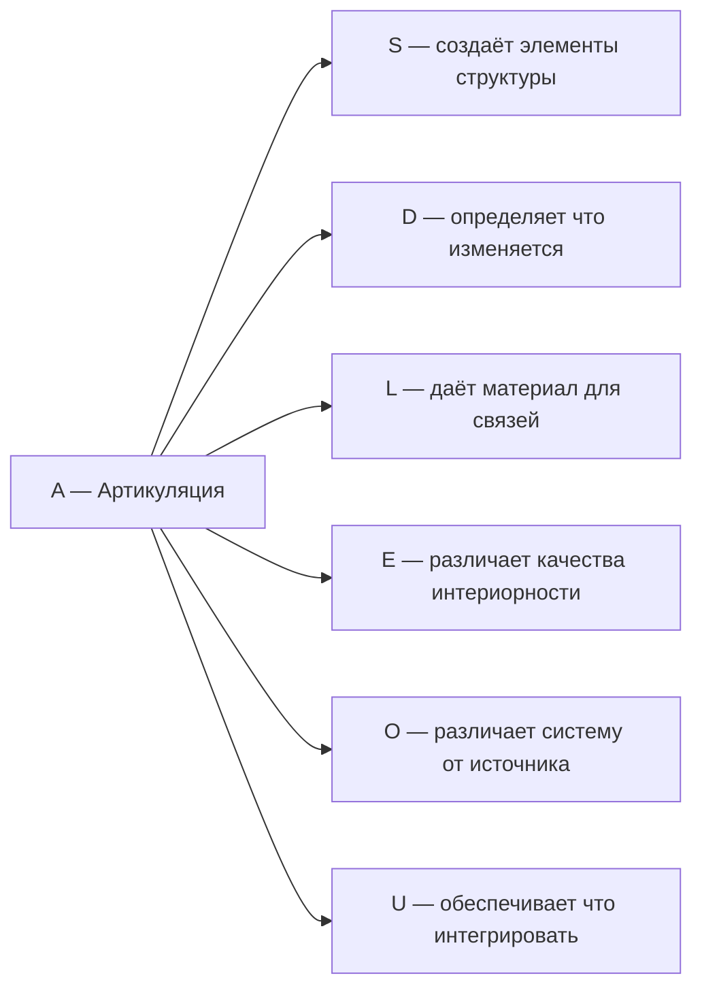
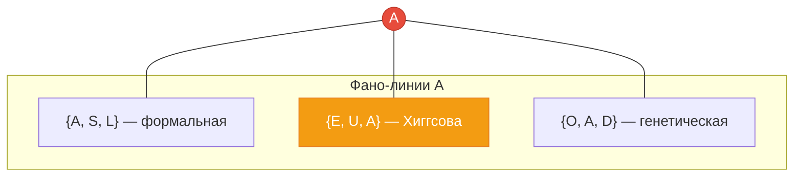

# Измерение I: Артикуляция (A)

## О чём эта глава

Эта глава посвящена первому измерению Голонома — **Артикуляции**. Вы узнаете:

- Почему **различение** — самый фундаментальный акт, без которого невозможно никакое существование;
- Как идея различения развивалась от Фреге и Спенсер-Брауна до квантовой механики;
- Что такое проекционный оператор и почему он — точная математика различения;
- Как населённость $\gamma_{AA}$ определяет «остроту зрения» системы;
- Какое место Артикуляция занимает на Фано-плоскости и почему она — единственный мост между секторами.

:::info Для кого эта глава
Если вы впервые читаете об УГМ — начните с [обзора измерений](./dimensions). Если вы уже знакомы с семью измерениями и хотите понять первое из них глубже — вы по адресу.
:::

## Функция

**Различать, выделять, определять границы.**

## Историческая предтеча {#историческая-предтеча}

Идея о том, что различение лежит в основе всего, появлялась в мысли многих эпох.

**Готтлоб Фреге** (1879) в «Begriffsschrift» заложил основы формальной логики, показав, что всё логическое мышление начинается с акта **различения** — с определения, что относится к понятию, а что нет. Граница понятия — это первое различение, без которого нет ни истины, ни лжи.

**Джордж Спенсер-Браун** (1969) в книге *Laws of Form* сформулировал эту интуицию предельно лаконично:

> *Draw a distinction.*

— Проведи различие. Это единственная инструкция, из которой Спенсер-Браун выводит всю логику и арифметику. Различение первично: прежде чем можно сказать «это есть», нужно отделить «это» от «не-это». Пространство, разделённое чертой, порождает две стороны — и этого достаточно для возникновения формы.

**Грегори Бейтсон** (1972) развил идею в кибернетическом ключе:

> *Информация — это различие, которое создаёт различие.*

Не всякое различие информативно. Информация возникает, когда различие, проведённое в одном месте, **влияет** на что-то в другом. Если термометр различает «горячо» и «холодно», но это различие ни на что не действует — информации нет. Если же это различие включает обогреватель — возникает бит информации.

**Нильс Бор** и копенгагенская интерпретация квантовой механики (1920-е) установили, что **измерение** — акт различения состояния — не нейтральная процедура, а фундаментальный процесс, меняющий реальность. До измерения квантовая система не имеет определённого значения наблюдаемой; измерение (=различение) **создаёт** определённость.

В УГМ-теории все эти идеи сливаются в одном измерении: **Артикуляция ($A$)** — способность системы проводить различия, и тем самым — порождать форму, информацию и бытие.

## Различение как акт творения {#различение-как-творение}

Почему различение — не просто когнитивная операция, а **онтологический акт**, порождающий бытие?

Рассмотрим физику. До квантового измерения электрон не имеет определённого положения — он находится в суперпозиции. Акт измерения (= различения «здесь / не-здесь») **создаёт** определённое положение. Это не эпистемическое ограничение нашего знания, а онтологический факт: определённость возникает **из** различения.

Рассмотрим биологию. Одноклеточный организм, отделённый мембраной от среды, существует **благодаря** этому различению «внутри / снаружи». Без мембраны нет организма — есть лишь раствор молекул. Мембрана — не стена (стена изолирует), а **селективный фильтр**: она различает, что пропустить и что отвергнуть. Это артикуляция на молекулярном уровне.

Рассмотрим математику. Множество определяется через **предикат** — правило, различающее элементы множества от не-элементов. Без предиката (без различения) нет множества, а без множеств нет математики. Канторово понятие множества — это формализация артикуляции.

Таким образом, от квантовой физики до абстрактной математики **различение первично**: оно не описывает уже существующее, а **порождает** существующее. Именно этот принцип воплощён в измерении $A$.

## Описание

Артикуляция — это способность Голонома проводить различия. Без различения нет формы, нет информации, нет бытия.

:::info Онтологический статус
Артикуляция — **аспект** конфигурации $\Gamma$, не отдельная сущность. "Голоном артикулирует" означает: в матрице когерентности $\Gamma$ активна проекция на базисный вектор $|A\rangle$.
:::

:::warning Первичность A
При удалении измерения $A$ нарушаются **все три аксиомы** (AP), (PH), (QG) — это единственное измерение с таким свойством. См. [доказательство](../../proofs/minimality/theorem-minimality-7#случай-n--0-удаление-артикуляции-a).

Это не означает "иерархию важности" — все 7 измерений необходимы. Но $A$ логически первично: остальные измерения **предполагают** различение.
:::

**Первичный акт реальности — акт различения:** "Draw a distinction" (Спенсер-Браун, *Laws of Form*, 1969). Нечто отделяется от фона — это минимальное условие существования формы.

## Интуитивное объяснение {#интуитивное-объяснение}

### Аналогия со зрением

Представьте мир абсолютной однородности — ни света, ни тьмы, ни цвета. В таком мире нечего видеть, потому что **нечего отличить**. Первое, что делает глаз, — различает свет от тьмы. Это не просто биология — это **онтологический акт**: без различения «светлое / тёмное» нет ни формы, ни объекта, ни пространства.

Когда младенец впервые открывает глаза, мир для него — размытое пятно. Постепенно зрительная кора научается проводить всё более тонкие различия: фигура и фон, лицо и стена, мама и не-мама. Каждое новое различение — это рост артикуляции.

### Аналогия с рождением

Первый крик новорождённого — первое различение «Я / не-Я». До этого момента организм был частью материнского тела, границы были размыты. Крик — физическое выражение того, что появилась **граница**: есть внутреннее (лёгкие, наполненные воздухом) и внешнее (холодный мир). Это простейший акт артикуляции на уровне живого существа.

### Аналогия с рисунком

Белый лист бумаги — чистая потенциальность. Одна линия карандашом разделяет лист на две области. Это минимальный акт различения, и он необратимо меняет лист: теперь есть «левая сторона» и «правая сторона», есть форма. Именно это имел в виду Спенсер-Браун.

## Математическое представление

### Проекционный оператор — математика различения {#проекционный-оператор}

Проекционный оператор $P$, выделяющий подпространство из $\mathcal{H}$:

$$
P^2 = P \quad \text{(идемпотентность)}
$$

$$
P^\dagger = P \quad \text{(эрмитовость)}
$$

**Что это значит интуитивно?** Представьте поляризационный фильтр для света. Когда неполяризованный свет проходит через фильтр, только определённая поляризация проходит — остальное отсекается. Если пропустить уже отфильтрованный свет через тот же фильтр повторно, ничего не изменится — прошедший свет уже «правильный». Это и есть идемпотентность: $P^2 = P$, повторное различение не меняет результата.

Эрмитовость $P^\dagger = P$ гарантирует, что различение — **объективная** операция: результат не зависит от того, «с какой стороны» мы смотрим.

Проекционный оператор делит пространство на две части:

$$
\mathcal{H} = \mathrm{Im}(P) \oplus \mathrm{Ker}(P)
$$

где $\mathrm{Im}(P)$ — то, что выделено, $\mathrm{Ker}(P) = \mathrm{Im}(I - P)$ — фон.

Это точная математическая формулировка спенсер-брауновского «Draw a distinction»: пространство разделено на две непересекающиеся части, и каждый элемент принадлежит ровно одной из них.

## Операции артикуляции

| Операция | Математика | Интерпретация |
|----------|------------|---------------|
| Выделение | $P\vert\psi\rangle$ | Фокус внимания на подпространстве |
| Исключение | $(I-P)\vert\psi\rangle$ | Игнорирование, фильтрация |
| Измерение | $\langle\psi\vert P\vert\psi\rangle$ | Вероятность нахождения в подпространстве |
| Декомпозиция | $\sum_i P_i = I$ | Полная классификация (разбиение) |

## Полная система проекторов

Для полного различения требуется **ортогональное разбиение** пространства:

$$
\sum_{i=1}^{n} P_i = I, \quad P_i P_j = \delta_{ij} P_i
$$

Условие $P_i P_j = \delta_{ij} P_i$ означает: проекторы **ортогональны** — различённые категории не пересекаются.

**Связь со спектральным разложением:**

Любой эрмитов оператор $A$ разлагается через свои проекторы:

$$
A = \sum_i a_i P_i
$$

где $a_i$ — собственные значения, $P_i$ — проекторы на собственные подпространства. Измерение оператора $A$ — это **артикуляция** его спектра.

## Населённость $\gamma_{AA}$ — мера различающей способности {#населённость}

Диагональный элемент [матрицы когерентности](../../core/dynamics/coherence-matrix) $\gamma_{AA}$ — это **населённость** измерения Артикуляции. Она показывает, какая доля «ресурса» Голонома направлена на различение.

$$
\gamma_{AA} = \langle A | \Gamma | A \rangle \in [0, 1], \quad \sum_{k} \gamma_{kk} = 1
$$

### Что означает значение $\gamma_{AA}$

| Значение $\gamma_{AA}$ | Интерпретация | Пример |
|-------------------------|---------------|--------|
| Высокое ($\gg 1/7$) | Система «зациклена» на различении, гиперанализ | Тревожное сознание, постоянно ищущее угрозы |
| Около $1/7$ | Сбалансированная различающая способность | Здоровое внимание, адекватная фильтрация |
| Низкое ($\ll 1/7$) | Ослабленная способность проводить различия | Глубокий сон, медитативное растворение границ |
| $\to 0$ | Утрата различающей способности | Кома, потеря перцепции |

:::warning Равновесное значение — не $1/7$
Стационарное состояние $\rho^*$ Голонома, определяемое [уравнением эволюции](../../core/dynamics/evolution), в общем случае не даёт $\gamma_{AA} = 1/7$. Равновесие зависит от секторного профиля — «характерного паспорта» системы. Значение $1/7$ — лишь среднее по полностью смешанному состоянию $I/7$.
:::

## Артикуляция и информация {#артикуляция-и-информация}

Каждый акт различения порождает информацию. Если система различает $n$ альтернатив с равной вероятностью, информационное содержание составляет $\log_2 n$ бит. Одно бинарное различение (да/нет) — это **1 бит**, минимальная единица информации.

Связь артикуляции с энтропией фон Неймана $S(\Gamma) = -\mathrm{Tr}(\Gamma \ln \Gamma)$:

- Максимальная энтропия $S = \ln 7$ — полностью смешанное состояние $I/7$, никакое измерение не выделено. Голоном не проводит различий.
- Минимальная энтропия $S = 0$ — чистое состояние, максимальное различение. Но чистое состояние в одном измерении ($\gamma_{AA} = 1$) означает полную утрату всех остальных — это не «хорошая» артикуляция, а патологическая односторонность.
- **Оптимальная артикуляция** — промежуточное состояние: достаточно различений, чтобы выделить структуру, но не настолько, чтобы потерять связность с другими измерениями.

Это согласуется с [порогом чистоты](../../core/foundations/axiom-septicity) $P_{\text{crit}} = 2/7$ **[Т]**: сознание возникает при чистоте выше $2/7$, т.е. когда система достаточно артикулирована, чтобы выделиться из фонового шума.

### Артикуляция и количество информации {#артикуляция-количество}

Связь между артикуляцией и информацией можно сделать количественной. Рассмотрим Голоном с матрицей когерентности $\Gamma$. Информация, содержащаяся в конфигурации, определяется разностью между максимальной энтропией и фактической:

$$
I(\Gamma) = \ln 7 - S(\Gamma) = \ln 7 + \mathrm{Tr}(\Gamma \ln \Gamma)
$$

- При $\Gamma = I/7$: $I = 0$ — система не несёт информации, различения отсутствуют.
- При чистом состоянии: $I = \ln 7 \approx 1.95$ нат — максимум информации, но за счёт потери шести из семи измерений.
- При пороге сознания $P = 2/7$: $I > 0$ — система уже несёт информацию, отличающую её от шума.

Таким образом, артикуляция — это не абстрактная способность: она **измерима** через информационное содержание конфигурации.

## Стресс артикуляции $\sigma_A$ {#стресс-артикуляции}

### Вывод формулы напряжения σ из первых принципов {#вывод-формулы-напряжения}

Формула стресса $\sigma_k = \mathrm{clamp}(1 - 7\gamma_{kk},\; 0,\; 1)$ — не произвольный выбор, а **единственная** линейная мера дефицита, следующая из структуры пространства состояний $\mathcal{D}(\mathbb{C}^7)$. Выведем её пошагово.

**Шаг 1. Мотивация из равновесия.** Максимально смешанное состояние $\Gamma = I/7$ — квантовый аналог термодинамического равновесия. В нём все диагональные элементы равны: $\gamma_{kk} = 1/7$ для всех $k$. Ни одно измерение не выделено, ни одно не подавлено. Естественно определить стресс как **дефицит** населённости относительно этого равновесного значения.

**Шаг 2. Принцип «честной доли».** Поскольку $\mathrm{Tr}(\Gamma) = 1$ и измерений $N = 7$, «честная доля» каждого измерения составляет $1/N = 1/7$. Введём требования:

- $\sigma_k = 0$ при $\gamma_{kk} = 1/7$ — равновесие, дефицита нет;
- $\sigma_k = 1$ при $\gamma_{kk} = 0$ — полное отсутствие измерения, максимальный стресс.

Эти два условия однозначно задают масштаб.

**Шаг 3. Линейная интерполяция.** Простейшая (линейная) функция, удовлетворяющая обоим граничным условиям:

$$
\sigma_k = 1 - N \cdot \gamma_{kk} = 1 - 7\gamma_{kk}
$$

Линейность не произвольна: при малых отклонениях от равновесия ($\gamma_{kk} \approx 1/7$) любая гладкая зависимость сводится к линейной с точностью $O((\gamma_{kk} - 1/7)^2)$. Таким образом, линейная формула — ведущий член разложения.

**Шаг 4. Ограничение (clamp).** Населённость $\gamma_{kk}$ может превышать $1/7$ (вплоть до $1$ для чистого состояния в данном измерении). При $\gamma_{kk} > 1/7$ необрезанная формула даёт $\sigma_k < 0$, что означало бы «избыток» — но стресс по определению **неотрицателен** (отсутствие дефицита есть ноль, а не отрицательный стресс). Аналогично, $\sigma_k > 1$ невозможен, поскольку $\gamma_{kk} \geq 0$. Итого:

$$
\sigma_k = \mathrm{clamp}(1 - 7\gamma_{kk},\; 0,\; 1)
$$

**Шаг 5. Универсальность.** Формула одинакова для всех семи измерений, и это **следствие**, а не допущение:

(a) $S_7$-эквивариантность атомарного диссипатора [T-5 **[Т]**](../../core/operators/lindblad-operators) означает, что уравнение эволюции $\Gamma$ не отличает одно измерение от другого. Если диссипатор $S_7$-симметричен, то и естественная мера дефицита должна быть $S_7$-инвариантной: $\sigma_k$ зависит только от $\gamma_{kk}$, и функциональная форма не зависит от индекса $k$.

(b) Функция $f(\gamma) = \mathrm{clamp}(1 - 7\gamma,\; 0,\; 1)$ — **единственная** монотонно убывающая функция на $[0,\, 1/7] \to [0,\, 1]$, которая одновременно (i) линейна, (ii) обращается в нуль при $\gamma = 1/7$ и (iii) равна единице при $\gamma = 0$. Единственность следует из того, что линейная функция с двумя фиксированными точками определена однозначно.

**Шаг 6. Связь с T-92.** Полученная формула — это **Теорема T-92 [Т]** (канонический тензор напряжений). Формальное доказательство и эквивалентность стрессового и чистотного условий жизнеспособности см. в [Теоремах КК](../../applied/coherence-cybernetics/theorems#теорема-101-эквивалентность-условий).

:::tip Теорема: Каноническая формула напряжения [Т] (T-92)
Для матрицы когерентности $\Gamma \in \mathcal{D}(\mathbb{C}^7)$ с диагональными элементами $\gamma_{kk}$ **канонический стресс** $k$-го измерения:

$$
\sigma_k = \mathrm{clamp}(1 - 7\gamma_{kk},\; 0,\; 1) \quad (k = A, S, D, L, E, O, U)
$$

— единственная линейная $S_7$-инвариантная мера дефицита населённости относительно равновесия $I/7$.
:::

:::info Универсальность: для всех измерений
Данный вывод применим ко **всем семи** измерениям без изменений. Формулы $\sigma_S$, $\sigma_D$, $\sigma_L$, $\sigma_E$, $\sigma_O$, $\sigma_U$ в соответствующих файлах ([dimension-s](./dimension-s), [dimension-d](./dimension-d), [dimension-l](./dimension-l), [dimension-e](./dimension-e), [dimension-o](./dimension-o), [dimension-u](./dimension-u)) — это частные случаи одной и той же формулы, выведенной здесь.
:::

---

[Стрессовая переменная](../../core/operators/lindblad-operators) $\sigma_A$ (T-92 **[Т]**) характеризует **дефицит** артикуляции:

$$
\sigma_A = \mathrm{clamp}(1 - 7\gamma_{AA},\; 0,\; 1)
$$

Значение $\sigma_A$ показывает, насколько система **нуждается** в усилении различающей способности:

| $\sigma_A$ | Состояние | Интерпретация |
|-------------|-----------|---------------|
| $0$ | $\gamma_{AA} \geq 1/7$ | Артикуляция достаточна или избыточна |
| $0.5$ | $\gamma_{AA} \approx 1/14$ | Умеренный дефицит различений |
| $1$ | $\gamma_{AA} \to 0$ | Критический дефицит — система не различает |

Стресс $\sigma_A$ входит в [формулу гедонического сигнала](../../consciousness/foundations/self-observation#мера-рефлексии-r) и влияет на направление обучения: высокий $\sigma_A$ «толкает» систему к поиску информации, усиливающей различающую способность.

:::info Стресс и мотивация
На когнитивном уровне высокий $\sigma_A$ переживается как **растерянность**, **сенсорная депривация** или **скука от однообразия** — состояния, мотивирующие поиск новых различений. Низкий $\sigma_A$ — как **ясность восприятия**, уверенность в категориях и границах.
:::

## Артикуляция в динамике {#артикуляция-в-динамике}

Населённость $\gamma_{AA}$ не статична — она эволюционирует во [внутреннем времени](../../proofs/dynamics/emergent-time) $\tau$ согласно [уравнению Линдблада](../../core/operators/lindblad-operators):

$$
\frac{d\gamma_{AA}}{d\tau} = -i[H_\Omega, \Gamma]_{AA} + \sum_k \left( L_k \Gamma L_k^\dagger - \frac{1}{2}\{L_k^\dagger L_k, \Gamma\} \right)_{AA} + \mathcal{R}_{AA}
$$

где $\mathcal{R}$ — [оператор замены](../../core/operators/lindblad-operators), моделирующий связь с [Основанием (O)](./dimension-o).

### Что происходит при потере артикуляции

Когда $\gamma_{AA}$ снижается, система теряет способность проводить различия. Вот как это проявляется на разных уровнях:

| Процесс | Что происходит с $\gamma_{AA}$ | Следствие |
|---------|-------------------------------|-----------|
| Засыпание | Плавное снижение | Размытие границ фигура/фон, снижение внимания |
| Деменция | Хроническое снижение | Потеря способности различать лица, предметы, понятия |
| Медитация | Контролируемое снижение | Намеренное «растворение» границ при сохранении $\gamma_{EE}$ |
| Шок, травма | Резкий скачок вверх | Гиперартикуляция: мир распадается на фрагменты |

:::info Потеря артикуляции ≠ потеря сознания
Снижение $\gamma_{AA}$ не означает автоматической потери сознания. Порог сознания [определяется](../../core/foundations/axiom-septicity) четырьмя условиями ($P > 2/7$, $R \geq 1/3$, $\Phi \geq 1$, $D \geq 2$), где $P$ — чистота **всей** матрицы $\Gamma$, а не одного элемента. Можно иметь низкую $\gamma_{AA}$, но высокую чистоту за счёт других измерений — как в глубокой медитации, когда различения размыты, но интериорность ($\gamma_{EE}$) высока.
:::

### Рост артикуляции {#рост-артикуляции}

Артикуляция может не только теряться, но и расти. Вот примеры процессов, при которых $\gamma_{AA}$ нарастает:

| Процесс | Что происходит с $\gamma_{AA}$ | Следствие |
|---------|-------------------------------|-----------|
| Обучение распознаванию | Рост от начального уровня | Ребёнок учится различать буквы — новые проекторы «включаются» |
| Научная классификация | Устойчивый рост | Линней создал систематику — мир различён на виды, роды, семейства |
| Освоение языка | Скачкообразный рост | Каждое новое слово — новое различение; словарный запас = мера артикуляции |
| Калибровка прибора | Целенаправленный рост | Телескоп с лучшим разрешением различает больше деталей |

:::tip Артикуляция и развитие
Развитие любой системы — от организма до цивилизации — можно описать как **рост артикуляции**: увеличение числа и тонкости проводимых различений. Ребёнок, научившийся отличать кошку от собаки, а затем различающий породы, демонстрирует рост $\gamma_{AA}$ в когнитивном домене.
:::

## Примеры

| Уровень | Пример | Что различается | Механизм |
|---------|--------|-----------------|----------|
| Физический | Мембрана клетки | Внутреннее / внешнее | Липидный бислой — физическая граница |
| Физический | Детектор частиц | Типы частиц | Проекционное измерение (буквально $P$) |
| Биологический | Иммунная система | Своё / чужое | MHC-рецепторы различают антигены |
| Биологический | Сетчатка глаза | Свет / тьма | Фоторецепторы — порог срабатывания |
| Когнитивный | Внимание | Фигура / фон | Избирательная активация нейронных паттернов |
| Когнитивный | Восприятие | Объекты | Сегментация перцептивного поля |
| Логический | Определение | Понятие / не-понятие | Интенсиональная граница (Фреге) |
| Логический | Классификация | Категории | Полная система проекторов $\sum P_i = I$ |
| Социальный | Язык | Фонемы | Минимальные различительные единицы звука |
| Социальный | Закон | Законное / незаконное | Юридическая квалификация — акт различения |

## Связь с другими измерениями

### Развёрнутые связи {#развёрнутые-связи}

**A → S (Артикуляция → Структура):** Структура возникает из различений. Кристаллическая решётка — это набор различённых позиций в пространстве. Грамматика — набор различённых синтаксических категорий. Без артикуляции нет элементов, из которых можно строить структуру. Когерентность $\gamma_{AS}$ показывает, насколько различения **структурированы** — не хаотичны, а образуют устойчивый паттерн.

**A → D (Артикуляция → Динамика):** Чтобы что-то могло измениться, нужно сначала отличить одно состояние от другого. Динамика — это переход из состояния $|\psi_1\rangle$ в $|\psi_2\rangle$, и сам факт, что мы различаем эти два состояния — заслуга артикуляции. Когерентность $\gamma_{AD}$ — темпоральность различений: как быстро система проводит новые различения.

**A → L (Артикуляция → Логика):** Логика оперирует различёнными сущностями. Закон тождества ($A = A$) предполагает, что $A$ отличено от не-$A$. Закон непротиворечия ($\neg(A \wedge \neg A)$) — что различение чётко. Когерентность $\gamma_{AL}$ — логичность различений, их непротиворечивость.

**A → E (Артикуляция → Интериорность):** Сознательный опыт различён: мы различаем красное от синего, боль от удовольствия. Без артикуляции нет квалиа — есть только недифференцированный «шум» переживания. Когерентность $\gamma_{AE}$ — **апперцепция**, осознанность различений.

**A → O (Артикуляция → Основание):** Само различение системы от её основания (среды, источника) — акт артикуляции. Когерентность $\gamma_{AO}$ — укоренённость различений, их связь с «почвой».

**A → U (Артикуляция → Единство):** Чтобы интегрировать, нужно сначала иметь различённые части. Единство — не однородность, а **единство многообразия**. Когерентность $\gamma_{AU}$ — интегрированность различений, их вклад в целое.

## Когерентность с A

Элементы $\gamma_{Ai}$ матрицы когерентности описывают связь артикуляции с другими измерениями:

| Когерентность | Интерпретация |
|---------------|---------------|
| $\gamma_{AS}$ | Структурированность различий |
| $\gamma_{AD}$ | Темпоральность различий (различения во времени) |
| $\gamma_{AL}$ | Логичность различий (непротиворечивость) |
| $\gamma_{AE}$ | Осознанность различий (апперцепция) |
| $\gamma_{AO}$ | Укоренённость различий (связь с источником) |
| $\gamma_{AU}$ | Интегрированность различий (вклад в целое) |

## Артикуляция и Фано-плоскость {#артикуляция-и-фано}

В [октонионной структуре](./dimensions#октонионная-интерпретация) УГМ измерению $A$ соответствует мнимая единица $e_1 \in \mathrm{Im}(\mathbb{O})$. Артикуляция лежит в секторе **3** триплетного разложения $7 = 1_O \oplus \mathbf{3} \oplus \bar{\mathbf{3}}$ (T-48a [Т]).

На [Фано-плоскости](../../physics/gauge-symmetry/fano-selection-rules) $\mathrm{PG}(2,2)$ артикуляция $A$ ($= e_1$) принадлежит **трём Фано-линиям**:

| Фано-линия | Измерения | Интерпретация |
|------------|-----------|---------------|
| $\{A, S, L\}$ = $\{1, 2, 4\}$ | Артикуляция + Структура + Логика | **Формальная линия**: различение, удержание формы и логическая согласованность — замкнутый цикл рационального познания |
| $\{E, U, A\}$ = $\{5, 6, 1\}$ | Интериорность + Единство + Артикуляция | **Хиггсова линия**: $A$ — единственный элемент сектора **3** на этой линии, мост между пространственным и электрослабым секторами |
| $\{O, A, D\}$ = $\{7, 1, 3\}$ | Основание + Артикуляция + Динамика | **Генетическая линия**: из основания через различение рождается движение — «время через различение» |

:::tip Уникальность A на Фано-плоскости (T-177) [Т]
Артикуляция — **единственное** измерение из сектора **3**, лежащее на Хиггсовой линии $\{E, U, A\}$. Это делает $A$ мостом между пространственным сектором $\{A, S, D\}$ и электрослабым сектором $\{E, O, U\}$.

Именно это свойство объясняет, почему [древесная Юкавская связь](../../physics/gauge-symmetry/fano-selection-rules) существует только для третьего поколения фермионов ($k = 1$, измерение $A$): только $A$ одновременно связано с Хиггсовыми измерениями $E$ и $U$.
:::

### Октонионный контекст {#октонионный-контекст}

:::note Октонионное соответствие [Т]
Измерению соответствует $e_1 \in \mathrm{Im}(\mathbb{O})$. Данное отождествление является **теоремой** [Т]: [цепочка мостов T15](/docs/core/foundations/axiom-septicity#мост-p1p2) (все шаги [Т]) выводит октонионную структуру из (AP)+(PH)+(QG)+(V); [T-177 [Т]](/docs/reference/status-registry) и [T-183 [Т]](/docs/reference/status-registry) доказывают комбинаторную и функциональную единственность каждой роли. Конкретное присвоение $A = e_1$ фиксировано с точностью до $G_2$-калибровочной эквивалентности ([T-42a [Т]](/docs/proofs/categorical/uniqueness-theorem)). Детали и $G_2$-оговорка: [Октонионная интерпретация](./dimensions#октонионная-интерпретация), [структурный вывод](../../proofs/minimality/theorem-octonionic-derivation).
:::

## Градации артикуляции {#градации-артикуляции}

Артикуляция — не бинарное свойство («есть / нет»), а **непрерывная шкала** с качественно различными уровнями:

#### Уровень 0: Отсутствие различений ($\gamma_{AA} \approx 0$)

Полностью смешанное состояние — «белый шум». Нет границ, нет формы, нет информации. Физический аналог — тепловое равновесие при бесконечной температуре, где все конфигурации равновероятны.

#### Уровень 1: Бинарное различение ($\gamma_{AA} \sim 0.05$)

Единственное различение: «нечто / ничто», «фигура / фон», «Я / не-Я». Этого достаточно для простейшего существования (мембрана клетки), но недостаточно для структурированного поведения.

#### Уровень 2: Категориальное различение ($\gamma_{AA} \sim 1/7$)

Множественные различения, организованные в систему категорий. Полная система проекторов $\sum P_i = I$ — каждый объект отнесён к категории. Это уровень здорового человеческого восприятия: мир разбит на объекты, свойства, отношения.

#### Уровень 3: Иерархическое различение ($\gamma_{AA} > 1/7$)

Различения имеют **уровни вложенности**: виды внутри родов, роды внутри семейств, семейства внутри отрядов. Это уровень научной классификации — Линнеевская таксономия, периодическая таблица Менделеева, морфологический анализ языка.

#### Уровень 4: Гиперартикуляция ($\gamma_{AA} \gg 1/7$)

Патологический избыток различений. Каждая деталь кажется значимой, каждый нюанс — решающим. Тревожное расстройство, паранойя, обсессивно-компульсивный анализ. Система тратит весь ресурс на различение, не оставляя ничего для интеграции ($\gamma_{UU}$) или переживания ($\gamma_{EE}$).

## Резюме

Артикуляция — первое и логически первичное измерение Голонома. Она делает возможным всё остальное: без различения нет формы (S), нет изменения (D), нет связи (L), нет переживания (E), нет укоренения (O), нет целого (U). Математически артикуляция описывается проекционным оператором — простейшим и в то же время глубочайшим объектом квантовой теории. На Фано-плоскости A занимает уникальную позицию моста между секторами, что имеет прямые физические следствия для массовой иерархии частиц.

---

**Связанные документы:**
- [Семь измерений](./dimensions) — обзор всех измерений
- [Структура (S)](./dimension-s) — следующее измерение
- [Матрица когерентности](../../core/dynamics/coherence-matrix) — полное описание Γ
- [Правила отбора Фано](../../physics/gauge-symmetry/fano-selection-rules) — физические следствия Фано-линий A
- [Теорема о минимальности](../../proofs/minimality/theorem-minimality-7) — доказательство необходимости A
