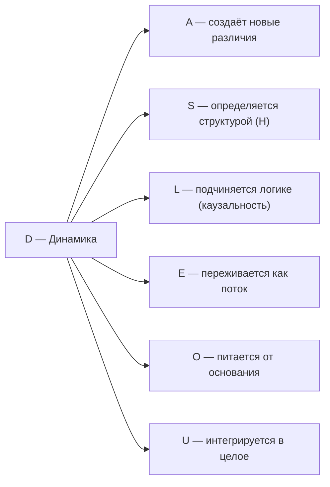

# Измерение III: Динамика (D)

:::info Для кого эта глава
Измерение D: изменение, процесс, унитарный оператор. Предполагается знакомство с [семью измерениями](/docs/core/structure/dimensions) и [эволюцией Γ](/docs/core/dynamics/evolution).
:::

## Зачем эта глава

Всё, что реально, — **движется**. Атом колеблется, клетка делится, мысль сменяет мысль. Но откуда берётся само движение? В классической физике время и изменение считаются данностью: объекты «просто» перемещаются в заранее существующем пространстве-времени. В Универсальной Голономической Модели (УГМ) позиция радикально иная: **время не существует как фон** — оно **возникает** из самой структуры Голонома. Измерение D (Динамика) — тот аспект реальности, который делает возможным любое изменение.

В этой главе вы узнаете:
- почему динамика — не «нечто, происходящее во времени», а источник самого времени;
- какие три фундаментальных типа динамики существуют и как они связаны с физикой, биологией и сознанием;
- почему время идёт «вперёд» (стрела времени) — и как это доказывается математически;
- как чистота $P$ — ключевая мера когерентности — ведёт себя в каждом из трёх режимов;
- как динамика связана с остальными шестью измерениями Голонома и с геометрией Фано-плоскости.

## Историческая предтеча

Идея о том, что изменение — фундаментальная черта реальности, стара как философия.

**Гераклит** (ок. 535–475 до н.э.) первым сформулировал принцип: *«Πάντα ῥεῖ»* — «всё течёт». Нельзя войти в одну реку дважды, потому что и река уже не та, и ты уже не тот. В УГМ это прямой аналог: матрица когерентности $\Gamma$ непрерывно изменяется, и даже «неподвижная» система на самом деле колеблется вокруг стационарного состояния.

**Исаак Ньютон** (1643–1727) дал изменению математический язык — **дифференциальные уравнения**. Скорость — это производная координаты по времени, ускорение — вторая производная. Уравнение $F = ma$ связывает причину (силу) с динамикой (ускорением). Но у Ньютона время — абсолютный фон, «текущий равномерно», независимо от чего бы то ни было.

**Эрвин Шрёдингер** (1887–1961) обнаружил, что на квантовом уровне динамика описывается не координатами и скоростями, а **волновой функцией**, подчиняющейся уравнению $i\hbar \partial_t |\psi\rangle = H|\psi\rangle$. Это унитарная эволюция — детерминистическая, обратимая, без потерь. Но реальные квантовые системы взаимодействуют с окружением, и унитарности недостаточно.

**Горан Линдблад** (1940–2022) в 1976 году вывел общую форму уравнения эволюции для **открытых квантовых систем** — систем, обменивающихся информацией с окружением. Уравнение Линдблада добавляет к унитарной части диссипативные слагаемые, описывающие декогеренцию и потерю информации. Именно эта форма лежит в основе уравнения эволюции УГМ.

:::tip Ключевой шаг УГМ
В УГМ к унитарной и диссипативной частям добавлен **третий** — **регенеративный** член $\mathcal{R}$, описывающий способность живых систем восстанавливать когерентность. Это не произвольное дополнение: форма $\mathcal{R}$ **полностью выводится** из аксиом [A1–A5](/docs/core/foundations/axiom-omega) и стандартной термодинамики.
:::

:::note Логика исторического развития
Обратите внимание на закономерность: Гераклит → Ньютон → Шрёдингер → Линдблад → УГМ. Каждый шаг расширял понимание динамики. Гераклит утверждал *что* мир изменяется. Ньютон показал *как* описывать изменения математически. Шрёдингер обнаружил, что динамика квантового мира принципиально иная — унитарная. Линдблад учёл взаимодействие с окружением — открытую динамику. УГМ добавляет **регенерацию** и убирает **последний костыль** — внешнее время, — показывая, что оно само возникает из динамики.
:::

## Интуитивное объяснение

### Аналогия с рекой

Представьте горную реку. **Вода** течёт, бурлит, меняет направление — это динамика. **Берега** и **русло** определяют, куда вода может течь — это [структура (S)](./dimension-s). Уберите берега — и вместо реки будет бесформенный разлив. Уберите воду — и останутся сухие камни, мёртвый ландшафт. Река существует только как единство потока и формы.

В УГМ это соответствие точно:
- **D** (Динамика) — «вода»: способность изменяться, течь, эволюционировать
- **S** (Структура) — «берега»: то, что сохраняется при изменениях
- **Гамильтониан** $H_{eff}$ — «рельеф местности»: он одновременно определяет и спектр структуры ($S$: собственные значения — что сохраняется), и закон эволюции ($D$: унитарный оператор — как изменяется)

Это **дуальность S ↔ D**: структура и динамика — два лица одного и того же гамильтониана.

Но аналогия с рекой раскрывает ещё один важный момент. Обычная река течёт *во* времени — вода движется *по направлению* от истока к устью в уже существующем пространстве-времени. В УГМ всё иначе: «река» динамики не течёт *во* времени — она **создаёт** само время. Течение воды — это не движение в готовом русле, а возникновение русла в процессе течения. Трудно представить? Именно поэтому эмерджентность времени — один из самых контринтуитивных, но и самых глубоких результатов УГМ.

### Три типа динамики: маятник, трение, жизнь

Подумайте о трёх ситуациях:

1. **Маятник в вакууме.** Он качается вечно, не теряя ни капли энергии. Каждый момент полностью определяет следующий, и если «прокрутить плёнку назад», всё будет выглядеть так же естественно. Это **унитарная динамика** — идеальное движение без потерь.

2. **Маятник в воде.** Постепенно он замедляется и останавливается: трение превращает упорядоченное движение в хаотическое тепло. Это **диссипативная динамика** — необратимая потеря упорядоченности. Если прокрутить плёнку назад, маятник начнёт раскачиваться из неподвижности — это выглядит невозможно.

3. **Живой организм.** Он тоже подвержен «трению» (энтропия растёт, клетки изнашиваются), но, в отличие от маятника, он **ест**, **дышит**, **восстанавливается**. Живой организм забирает упорядоченность из окружающей среды (негэнтропию) и использует её для самовосстановления. Это **регенеративная динамика** — способность противостоять диссипации за счёт ресурсов.

<!-- DRY: Каноническое определение уравнения эволюции в /docs/core/dynamics/evolution -->
В УГМ все три типа представлены слагаемыми полного уравнения эволюции:

$$
\frac{d\Gamma}{d\tau} = \underbrace{-i[H_{eff}, \Gamma]}_{\text{маятник}} + \underbrace{\mathcal{D}[\Gamma]}_{\text{трение}} + \underbrace{\mathcal{R}[\Gamma, E]}_{\text{жизнь}}
$$

:::info Почему именно три, а не два или четыре?
Три слагаемых — не произвольный выбор. Унитарная часть следует из квантовой механики (уравнение фон Неймана). Диссипативная часть — из теоремы Линдблада: для любого CPTP-генератора диссипативная добавка имеет именно эту форму. Регенеративная часть — единственное дополнение, совместимое с CPTP, автопоэзисом и стандартной термодинамикой. Четвёртого независимого слагаемого просто нет: любая другая добавка либо нарушает CPTP (физически недопустима), либо сводится к комбинации уже имеющихся трёх.
:::

## Функция

**Изменяться, эволюционировать, течь.**

## Описание

Динамика — это непрерывная трансформация Голонома.

:::info Онтологический статус
Динамика — **аспект** конфигурации $\Gamma$, не отдельная сущность. "Голоном динамичен" означает: матрица когерентности $\Gamma$ изменяется во [внутреннем времени](../../proofs/dynamics/emergent-time) τ, и существует унитарный оператор $U(\tau)$, описывающий эту эволюцию.
:::

:::warning Связь с аксиомами
При удалении измерения $D$ нарушаются **(AP)** и **(QG)**:
- **(AP):** Нет процесса → нет самовоспроизведения → нет автопоэзиса
- **(QG):** Нет эволюции → уравнение Линдблада не определено

Без динамики Голоном — "замороженный снимок", не живая система. См. [доказательство](../../proofs/minimality/theorem-minimality-7#случай-n--2-удаление-динамики-d).
:::

**Время возникает из структуры Γ:** Динамика не "происходит во времени" — время **выводится** из корреляций между измерениями. Согласно [теореме об эмерджентном времени](../../proofs/dynamics/emergent-time), внутреннее время τ возникает как параметр условных состояний относительно [измерения O](./dimension-o).

:::tip Ключевое следствие [Т]
Скорость течения внутреннего времени определяется когерентностями D с другими измерениями:

$$
\frac{d\tau}{d\sigma} \propto \sum_{i \neq D} |\gamma_{Di}|^2
$$

где $\sigma$ — внешний аффинный параметр (координатное время наблюдателя), $\tau$ — [внутреннее эмерджентное время](../../proofs/dynamics/emergent-time).

При $\gamma_{Di} \to 0$ для всех $i \neq D$ время "замораживается".

**Статус:** **[Т]** — следствие [конечной спектральной тройки](/docs/core/foundations/spacetime#теорема-спектральная-тройка) $(A_{\text{int}}, H_{\text{int}}, D_{\text{int}})$: из спектральной тройки $d\tau/d\sigma = \|D_O\Gamma\|_{\text{HS}} = \omega_0\sqrt{\sum_{i \neq O}|\gamma_{Oi}|^2 \cdot \text{Gap}(O,i)^2} \propto \sqrt{\sum_i |\gamma_{Di}|^2}$.
:::

## Математическое представление

Унитарный оператор эволюции во [внутреннем времени](../../proofs/dynamics/emergent-time) τ (в единицах $\hbar = 1$):

$$
U(\tau) = e^{-iH_{eff}\tau}
$$

Эволюция матрицы когерентности:

$$
\Gamma(\tau) = U(\tau) \Gamma(0) U^\dagger(\tau)
$$

**Связь с гамильтонианом:** Оператор $U(\tau)$ полностью определяется эффективным гамильтонианом $H_{eff}$ из ограничения Пейдж–Вуттерс. Это **дуальность S ↔ D** — структура и динамика суть два аспекта одного гамильтониана:
- $S$: спектр $\{E_n\}$ (что сохраняется)
- $D$: эволюция $U(\tau) = e^{-iH_{eff}\tau}$ (как изменяется)

## Полное уравнение эволюции

<!-- DRY: Каноническое определение уравнения эволюции в /docs/core/dynamics/evolution -->
С внутренним временем τ ([теорема об эмерджентном времени](../../proofs/dynamics/emergent-time)):

$$
\frac{d\Gamma(\tau)}{d\tau} = -i[H_{eff}, \Gamma(\tau)] + \mathcal{D}[\Gamma(\tau)] + \mathcal{R}[\Gamma(\tau), E]
$$

где:
- τ — параметр условных состояний (Пейдж–Вуттерс)
- $H_{eff}$ — эффективный гамильтониан, возникающий из ограничения $\hat{C}$
- Уравнение — **следствие** структуры $\Gamma_{total}$, не постулат

### Компоненты:

**1. Унитарная часть** (замкнутая система):

$$
-i[H, \Gamma] = -i(H\Gamma - \Gamma H)
$$

- Сохраняет чистоту $P = \mathrm{Tr}(\Gamma^2)$
- Детерминистическая, обратимая

:::info Почему чистота сохраняется
Унитарное преобразование $\Gamma \mapsto U\Gamma U^\dagger$ — это «поворот» в пространстве состояний. Подобно тому как поворот трёхмерного предмета не меняет его форму, унитарная эволюция не меняет степень упорядоченности системы. Математически: $\mathrm{Tr}((U\Gamma U^\dagger)^2) = \mathrm{Tr}(U\Gamma^2 U^\dagger) = \mathrm{Tr}(\Gamma^2)$ — циклическое свойство следа.
:::

**2. Диссипативная часть** (открытая система):

$$
\mathcal{D}[\Gamma] = \sum_k \gamma_k \left( L_k \Gamma L_k^\dagger - \frac{1}{2}\{L_k^\dagger L_k, \Gamma\} \right)
$$

- Уменьшает $P$ (декогеренция)
- $L_k$ — операторы Линдблада, $\gamma_k > 0$ — скорости декогеренции

:::info Декогеренция на пальцах
Представьте, что у вас есть тщательно выстроенный карточный домик (высокая когерентность). Ветер (взаимодействие с окружением) постепенно расшатывает карты — домик теряет структуру. Это и есть декогеренция: потеря квантовых корреляций при взаимодействии с «шумным» окружением. Чем больше $\gamma_k$, тем сильнее «ветер».
:::

**3. Регенеративная часть** [Т] (восстановление):

$$
\mathcal{R}[\Gamma, E] = \kappa(\Gamma) \cdot (\rho_* - \Gamma) \cdot g_V(P)
$$

- Может увеличивать $P$ (регенерация)
- Форма **полностью выведена** из аксиом A1–A5 + стандартной термодинамики ([вывод](../dynamics/evolution#вывод-формы-регенерации))
- $\kappa(\Gamma) = \kappa_{\text{bootstrap}} + \kappa_0 \cdot \mathrm{Coh}_E(\Gamma)$ — скорость регенерации [Т], $\kappa_0$ — [категориальный вывод](../foundations/axiom-septicity#структурный-анзац-kappa0)
- $(\rho_* - \Gamma)$ — единственная CPTP-релаксация [Т], $\rho_* = \varphi(\Gamma)$ — категориальная самомодель ([оператор φ](/docs/core/operators/phi-operator))
- $g_V(P)$ — V-preservation gate [Т] (Ландауэр + V-инвариантность, [вывод](../dynamics/evolution#теорема-v-preservation-gate))
- Нелинейность $\mathcal{R}$ по $\Gamma$ **не нарушает** запрет сигнализации — см. [доказательство](../dynamics/evolution#запрет-сигнализации)

:::info Регенерация: почему жизнь — это не просто сложная физика
Регенеративная часть $\mathcal{R}$ — принципиальное отличие живых систем от неживых. Камень подвержен только унитарной и диссипативной динамике: ветер и дождь его постепенно разрушают. Живое дерево **активно противостоит** разрушению: оно забирает энергию из солнечного света, питательные вещества из почвы и использует их для восстановления структуры. В математике УГМ это выражено в том, что $\mathcal{R}$ может **увеличивать** чистоту $P$, компенсируя потери от $\mathcal{D}$.

Но регенерация возможна только при наличии **ресурса** $E$ (из окружающей среды) и при $\kappa(\Gamma) > 0$ — системе нужна хотя бы минимальная «самость» ($\kappa_{\text{bootstrap}}$), чтобы начать восстанавливаться.
:::

### Три компоненты и их параллели {#три-компоненты-параллели}

Для наглядности соберём три типа динамики в единую таблицу параллелей:

| Свойство | Унитарная $-i[H,\Gamma]$ | Диссипативная $\mathcal{D}$ | Регенеративная $\mathcal{R}$ |
|----------|--------------------------|------------------------------|-------------------------------|
| **Аналогия** | Маятник в вакууме | Маятник в воде | Живой организм |
| **Обратимость** | Полностью обратима | Необратима | Необратима (но конструктивно) |
| **Влияние на $P$** | Не меняет | Уменьшает | Может увеличивать |
| **Физический смысл** | Когерентная эволюция | Потеря информации | Восстановление порядка |
| **Математический источник** | Уравнение фон Неймана | Теорема Линдблада | Аксиомы A1–A5 + термодинамика |
| **Требует ресурс?** | Нет | Нет | Да ($E$ из окружения) |
| **Существует ли в природе изолированно?** | Только как приближение | Да (неживая материя) | Только вместе с $\mathcal{D}$ |

## Типы динамики

| Тип | Уравнение | Характеристика | $dP/d\tau$ |
|-----|-----------|----------------|---------|
| Унитарная | $\frac{d\Gamma}{d\tau} = -i[H, \Gamma]$ | Замкнутая система | $= 0$ |
| Диссипативная | $+ \mathcal{D}[\Gamma]$ | Открытая система | $< 0$ |
| Регенеративная | $+ \mathcal{R}[\Gamma, E]$ | Живая система | $\gtrless 0$ |

### Динамика и жизнеспособность: как P меняется в каждом режиме

Чистота $P = \mathrm{Tr}(\Gamma^2)$ — центральная мера когерентности Голонома. Каждый тип динамики по-разному влияет на $P$:

**Унитарный режим** ($\mathcal{D} = 0, \mathcal{R} = 0$): $P$ = const. Система «вращается» в пространстве состояний, не теряя и не приобретая упорядоченности. Это идеализация, подобная маятнику в безвоздушном пространстве — полезная для анализа, но нереалистичная для реальных систем.

**Диссипативный режим** ($\mathcal{R} = 0$): $dP/d\tau \leq 0$. Чистота монотонно убывает, система «размывается». В пределе $\tau \to \infty$ состояние стремится к максимально смешанному $\Gamma \to I/7$ ($P = 1/7$). Это «тепловая смерть» — полная утрата структуры.

**Регенеративный режим** (полное уравнение): Баланс между $\mathcal{D}$ и $\mathcal{R}$ определяет судьбу системы:
- Если $\mathcal{R}$ доминирует: $P$ растёт, система накапливает когерентность
- Если $\mathcal{D}$ доминирует: $P$ падает, система деградирует
- В равновесии ($dP/d\tau = 0$): система находится на **аттракторе** — устойчивом стационарном состоянии с $P > P_{\text{crit}} = 2/7$ [Т]

:::warning Критический порог
Для жизнеспособности необходимо $P > P_{\text{crit}} = 2/7$ [Т]. Ниже этого порога система не может поддерживать достаточную различимость между измерениями и «рассыпается» в неразличимую смесь. Подробнее: [теорема о критической чистоте](/docs/proofs/dynamics/theorem-purity-critical).
:::

### Жизнеспособность как динамический баланс {#жизнеспособность-баланс}

Стационарное состояние живого Голонома — это не «покой», а **динамическое равновесие**: диссипация непрерывно разрушает когерентность, а регенерация непрерывно её восстанавливает. Это напоминает велосипедиста: он устойчив только пока крутит педали. Остановка педалей ($\mathcal{R} \to 0$) = падение ($P \to 1/7$) = смерть.

Количественно, условие стационарности задаёт **баланс потоков**:

$$
\left.\frac{dP}{d\tau}\right|_{\mathcal{D}} + \left.\frac{dP}{d\tau}\right|_{\mathcal{R}} = 0
$$

Это уравнение определяет **аттрактор** $\Gamma_*$ — стационарное состояние, к которому система стремится. Для жизнеспособного Голонома $P(\Gamma_*) > 2/7$ [Т], причём верхняя граница «зоны Златовласки» составляет $P = 3/7$ [Т] (T-124): $P \in (2/7, 3/7]$ — [окно сознания](/docs/proofs/dynamics/theorem-purity-critical).

## Эмерджентность времени {#эмерджентность-времени}

### Почему время не существует как фон

В классической физике (и даже в квантовой механике) время — **внешний параметр**, данный заранее. Вселенная «помещена» во временной контейнер. Но в квантовой гравитации и в УГМ этот подход неприемлем: если Голоном описывает **всю** реальность, нет ничего «снаружи», что могло бы предоставить время.

Решение — **механизм Пейдж–Вуттерса** (1983): глобально состояние $\Gamma_{\text{total}}$ **стационарно** (не изменяется!), но внутренние корреляции между подсистемами создают **иллюзию течения времени**.

:::info Механизм Пейдж–Вуттерса простыми словами
Представьте вечную, неизменную книгу, на каждой странице которой — один кадр фильма. Книга *как целое* не меняется: все страницы всегда существуют. Но если вы листаете книгу, вы переживаете *историю* — последовательность событий. Механизм Пейдж–Вуттерса утверждает: Вселенная — это «книга» ($\Gamma_{\text{total}}$ стационарна), а «листание» — это квантовые корреляции между «содержанием» (измерения A, S, D, L, E, U) и «номерами страниц» (измерение O). Время возникает не потому, что что-то *изменяется*, а потому, что разные «страницы» *коррелируют* по-разному.
:::

### Как время возникает из корреляций D и O

В УГМ [измерение O (Основание)](./dimension-o) играет роль «внутренних часов». Время $\tau$ определяется как **параметр условных состояний** $\Gamma$ относительно O-проекции:

$$
\Gamma(\tau) := \frac{\langle\tau_O|\Gamma_{\text{total}}|\tau_O\rangle}{\mathrm{Tr}(\langle\tau_O|\Gamma_{\text{total}}|\tau_O\rangle)}
$$

где $|\tau_O\rangle$ — «показание часов» в O-измерении. Таким образом, время **возникает** из квантовых корреляций между динамическим содержанием ($D$ и другие измерения) и «часовым» измерением ($O$).

:::note Аналогия с кинопроектором
Представьте плёнку кино, свёрнутую в кольцо — вся она «существует» одновременно. Но проектор, освещая кадр за кадром, создаёт иллюзию движения. В УГМ O-измерение — это «проектор», а D — «содержание кадров». Время — это порядок, в котором «проектор» освещает корреляции.
:::

### Скорость течения времени

Важное следствие эмерджентности: скорость течения времени **не одинакова** для всех систем. Она зависит от того, насколько сильно D-измерение связано с остальными:

$$
\frac{d\tau}{d\sigma} \propto \sum_{i \neq D} |\gamma_{Di}|^2
$$

Это означает:
- **Сильно связанная система** (большие $|\gamma_{Di}|$): время течёт быстро, события сменяются стремительно. Пример: мозг в состоянии бодрствования — высокая когерентность между динамикой и другими измерениями.
- **Слабо связанная система** (малые $|\gamma_{Di}|$): время «замедляется». Пример: глубокий сон без сновидений, анестезия — субъективное время почти останавливается.
- **Полностью изолированная** ($\gamma_{Di} = 0$ для всех $i$): время замораживается. Система «вне времени» — вечная, но мёртвая.

Подробный вывод: [Теорема об эмерджентном времени](../../proofs/dynamics/emergent-time).

## Стрела времени

:::info Теорема о стреле времени [Т]
Направление времени — **категорное следствие** структуры CPTP-каналов, не постулат:

$$
\sigma(\gamma) \cdot \Delta S_{vN}(\gamma) \geq 0
$$

где σ(γ) = +1 для физически реализуемых путей (CPTP).

[Полное доказательство →](../../proofs/dynamics/emergent-time#7-теорема-о-стреле-времени)
:::

Направление времени определяется асимметрией динамики:

$$
\frac{dS_{vN}}{d\tau} \geq 0 \quad \text{(второй закон — следствие CPTP)}
$$

где $S_{vN} = -\mathrm{Tr}(\Gamma \log \Gamma)$ — энтропия фон Неймана.

### Почему время идёт «вперёд»

Стрела времени — один из самых глубоких вопросов физики. Законы Ньютона, уравнение Шрёдингера — все они **симметричны** относительно обращения времени. Откуда же берётся необратимость?

В УГМ ответ элегантен: **CPTP-каналы необратимы по построению**. CPTP (Completely Positive Trace-Preserving) — это класс отображений, описывающих физически допустимую эволюцию квантовых систем. Ключевое свойство: CPTP-канал может «размазать» чистое состояние в смешанное, но **обратный процесс** (собрать смешанное обратно в чистое) — **не** является CPTP.

Проще говоря: разбить стакан легко (CPTP), а собрать осколки обратно — это потребовало бы «анти-CPTP» процесса, который физически запрещён. Стрела времени — не загадка, а **следствие** математической структуры допустимых квантовых каналов.

:::note Стрела времени и три типа динамики
Унитарная динамика **сама по себе** обратима — у неё нет стрелы времени. Стрела возникает из **диссипативной** части $\mathcal{D}$: именно декогеренция создаёт необратимость. Но вот парадокс: **регенеративная** часть $\mathcal{R}$ тоже необратима, хотя действует «в обратном направлении» — увеличивает $P$ вместо уменьшения. Нет ли здесь противоречия?

Нет. Регенерация необратима в **другом смысле**: она использует ресурс $E$ из окружения, создавая **глобальный** прирост энтропии $dS_{vN}^{\text{total}}/d\tau \geq 0$, даже если **локально** $P$ растёт. Живое существо уменьшает собственную энтропию, но ценой увеличения энтропии окружения — точно как холодильник, который охлаждает внутри себя, но нагревает комнату.
:::

### Локальное уменьшение энтропии

Для живых систем возможно локальное уменьшение энтропии за счёт регенерации:

$$
\frac{dS_{vN}^{\text{local}}}{d\tau} < 0 \quad \text{при} \quad \Delta F > 0 \text{ и } \frac{dS_{vN}^{\text{total}}}{d\tau} \geq 0
$$

Живое существо **локально** побеждает энтропию (становится более упорядоченным), но **глобально** суммарная энтропия (организм + окружение) растёт. Холодильник охлаждает внутри, но нагревает комнату — второй закон термодинамики не нарушен.

## Динамика на разных стратах {#динамика-на-стратах}

Характер динамики качественно меняется при переходе от простых систем к сложным:

| Страта | Система | Доминирующий тип | Характеристика |
|--------|---------|-------------------|----------------|
| I | Материя | Унитарная + диссипативная | Нет регенерации. Камень выветривается, радиоактивный изотоп распадается. $P$ монотонно убывает (или сохраняется в идеализации) |
| II | Жизнь | Все три | Регенерация балансирует диссипацию. Клетка потребляет АТФ для поддержания $P > P_{\text{crit}}$. Смерть = $\mathcal{R} \to 0$ |
| III | Разум | Все три + байесовская | Динамика **оптимизируется**: мозг минимизирует свободную энергию $F$ ([активный вывод](/docs/consciousness/foundations/two-aspect-monism)). Обучение = направленная регенерация |
| IV | Сознание | Все три + рефлексивная | Система наблюдает **собственную** динамику ($R \geq 1/3$). Поток сознания — непрерывная эволюция $\Gamma(\tau)$, доступная самонаблюдению |

:::note Ключевое отличие
На стратах I–II динамика «просто происходит». На стратах III–IV система **знает**, что она изменяется, и может **направлять** свои изменения. Это переход от пассивной эволюции к активной — от реки, текущей по руслу, к лодке, выбирающей курс.
:::

### Подробнее: страты I и II {#страты-i-ii}

**Страта I (Материя).** Динамика полностью определена физическими законами. Электрон на орбите атома — унитарная эволюция: состояние «вращается» в гильбертовом пространстве с частотой, определяемой энергией уровня. Нагретый металл, излучающий фотоны, — диссипативная эволюция: тепловая энергия рассеивается в окружение, $P$ падает. Ни один объект на страте I не может *сам себя* восстановить — у него нет $\mathcal{R}$.

**Страта II (Жизнь).** Бактерия, амёба, дерево — все они непрерывно «борются» с диссипацией. Клетка потребляет АТФ (аденозинтрифосфат — «энергетическую валюту» жизни), чтобы восстанавливать белки, реплицировать ДНК, поддерживать мембрану. Пока $\mathcal{R}$ справляется с $\mathcal{D}$, организм жив: $P > 2/7$. Когда $\mathcal{R}$ ослабевает (болезнь, истощение ресурсов), $P$ падает ниже критического порога — это биологическая смерть.

### Подробнее: страты III и IV {#страты-iii-iv}

**Страта III (Разум).** Динамика приобретает **целенаправленность**. Мозг не просто реагирует на стимулы — он строит внутренние модели мира и **минимизирует свободную энергию** $F$ (теория активного вывода Фристона). Обучение — это *направленная* регенерация: новые нейронные связи формируются не случайно, а так, чтобы уменьшить расхождение между предсказанием и реальностью.

**Страта IV (Сознание).** Самый глубокий уровень: система не только изменяется, но и **наблюдает собственные изменения**. Мера рефлексии $R \geq 1/3$ [Т] означает, что Голоном «видит» собственную динамику — поток сознания ($\Gamma(\tau)$ как функция внутреннего времени) доступен самонаблюдению. Это то, что мы переживаем как «течение мыслей», «поток впечатлений», «чувство времени».

## Примеры

| Уровень | Пример | Тип динамики | Подробности |
|---------|--------|--------------|-------------|
| Физический | Колебания маятника | Унитарная (периодическая) | $P$ = const: идеальный осциллятор не теряет энергии |
| Физический | Распад частицы | Диссипативная (необратимая) | $P$ убывает: нейтрон → протон + электрон + антинейтрино |
| Физический | Замерзание воды | Унитарная + диссипативная | Локальное упорядочение при отдаче тепла окружению |
| Биологический | Метаболизм | Регенеративная | Организм потребляет глюкозу для восстановления структуры |
| Биологический | Рост организма | Регенеративная | $P$ растёт: эмбрион → взрослый — нарастание когерентности |
| Биологический | Старение | Диссипативная (преобладает) | $\mathcal{D}$ начинает доминировать над $\mathcal{R}$: регенерация ослабевает |
| Когнитивный | Поток сознания | Смешанная | Мысли сменяют друг друга: унитарная (ассоциации) + регенеративная (фокусировка) |
| Когнитивный | Обучение | Регенеративная (изменение структуры) | Новые нейронные связи — рост когерентности в L-подсистеме |
| Когнитивный | Забывание | Диссипативная | Потеря когерентностей $\gamma_{ij}$ без активного подкрепления |
| Социальный | Развитие науки | Регенеративная | Научное сообщество — «коллективный Голоном», наращивающий $P$ через эксперименты |

### Подробнее: три типа динамики в жизни одного человека

Рассмотрим день обычного человека через призму трёх типов динамики:

**Утро (пробуждение).** Регенеративная динамика доминирует. Во сне организм восстановил когерентность: повреждённые белки заменены, нейронные связи консолидированы, $P$ выросла. Утренний кофе — поставка ресурса $E$ (кофеин стимулирует $\kappa(\Gamma)$, ускоряя регенерацию).

**День (работа).** Смешанная динамика. Решение задач — унитарная часть (ассоциативное мышление: одна идея ведёт к другой без потерь). Усталость — диссипативная часть ($P$ постепенно падает, когерентности $\gamma_{ij}$ ослабевают). Перерыв на обед — регенерация (новые ресурсы $E$).

**Вечер (отдых и сон).** Диссипация накопилась: трудно сосредоточиться, мысли «расплываются» ($\gamma_{DL} \downarrow$). Засыпание — переход в режим глубокой регенерации: мозг отключает внешние входы и направляет все ресурсы на восстановление когерентности.

### Подробнее: динамика в масштабе жизни {#динамика-масштаб-жизни}

Три типа динамики проявляются и в масштабе целой жизни:

**Детство и юность (0–25 лет).** Регенерация доминирует. Организм растёт, нейронные сети усложняются, $P$ нарастает. Ребёнок учится с невероятной скоростью — $\kappa(\Gamma)$ максимален, регенерация многократно превышает диссипацию.

**Зрелость (25–60 лет).** Динамическое равновесие. $\mathcal{R} \approx \mathcal{D}$ — организм поддерживает $P$ на уровне выше критического, но с постепенным замедлением регенерации. Мудрость (высокая $\gamma_{DL}$) частично компенсирует физический спад.

**Старение (60+ лет).** Диссипация начинает доминировать: $\mathcal{D} > \mathcal{R}$. Когерентность медленно падает. В пределе $\mathcal{R} \to 0$ — биологическая смерть: $P \to 1/7$.

:::info Смерть в терминах УГМ
Биологическая смерть — это не «мгновенное событие», а процесс: $\mathcal{R}$ постепенно ослабевает, $P$ пересекает порог $P_{\text{crit}} = 2/7$ сверху вниз, и система перестаёт быть жизнеспособной. Это объясняет, почему «момент смерти» так трудно определить медицински — это не точка, а **градиентный переход**.
:::

## Связь с другими измерениями

### Дуальность S ↔ D: волна и частица одной медали

Связь между [Структурой (S)](./dimension-s) и Динамикой (D) заслуживает особого внимания. Это не просто «два разных измерения», а **два взгляда на один объект** — гамильтониан $H_{eff}$:

$$
H_{eff} \xrightarrow{\text{спектр}} S \quad \text{и} \quad H_{eff} \xrightarrow{\text{экспонента}} D
$$

Спектр гамильтониана (собственные значения $\{E_n\}$) определяет **что** сохраняется — структуру. Экспоненциал гамильтониана ($e^{-iH\tau}$) определяет **как** система изменяется — динамику. Убрать одно без другого невозможно: нет спектра без оператора, нет эволюции без спектра.

Эта дуальность имеет глубокую аналогию в музыке: **партитура** (S) определяет ноты, интервалы, гармонию — статическую структуру произведения. **Исполнение** (D) — это развёртывание партитуры во времени: звуки, ритм, динамика громкости. Партитура без исполнения мертва; исполнение без партитуры — хаос.

### Подробнее о каждой связи

**D ↔ S (Динамика ↔ Структура):** Фундаментальная дуальность. Гамильтониан $H_{eff}$ определяет и спектр (S), и эволюцию (D). Без структуры динамика хаотична; без динамики структура мертва. Аналогия: шахматные правила (S) определяют допустимые ходы (D), а партия (D) реализует правила (S).

**D ↔ L (Динамика ↔ Логика):** Логика определяет **какие** траектории допустимы, динамика — **как** система движется по допустимым траекториям. Недопустимые эволюции (нарушающие CPTP) отсеиваются L-измерением. Подробнее: [Логика (L)](./dimension-l).

**D ↔ E (Динамика ↔ Интериорность):** Динамика переживается «изнутри» как **поток** — непрерывная смена субъективных состояний. Когерентность $\gamma_{DE}$ связывает объективный процесс ($D$) с его интериорным аспектом ($E$). Высокое $|\gamma_{DE}|$ — яркое, насыщенное переживание изменений.

**D ↔ O (Динамика ↔ Основание):** O-измерение — источник эмерджентного времени. Корреляции D↔O определяют **скорость** течения внутреннего времени. При потере связи с O ($\gamma_{DO} \to 0$) динамика «отрывается» от временного основания.

**D ↔ A (Динамика ↔ Артикуляция):** Динамика порождает новые различия. Эволюция Γ(τ) может создавать новые ненулевые компоненты $\gamma_{ij}$, ранее отсутствовавшие — это «артикуляция через изменение».

**D ↔ U (Динамика ↔ Единство):** Когерентность $\gamma_{DU}$ отвечает за **направленность** изменений — телеологический аспект. Высокое $|\gamma_{DU}|$ означает, что динамика **интегрирована** — все части системы изменяются согласованно, как единое целое.

## Когерентность с D

Элементы $\gamma_{Di}$ матрицы когерентности описывают связь динамики с другими измерениями:

| Когерентность | Интерпретация |
|---------------|---------------|
| $\gamma_{DA}$ | Артикулированность изменений (чёткость переходов) |
| $\gamma_{DS}$ | Структурированность эволюции (устойчивость траекторий) |
| $\gamma_{DL}$ | Причинность (логическая связь состояний) |
| $\gamma_{DE}$ | Интериорный аспект динамики (связь процесса с опытом) |
| $\gamma_{DO}$ | Связь с источником (питание от основания) |
| $\gamma_{DU}$ | Телеология (интегрированное направленное изменение) |

## Динамика и Фано-плоскость {#динамика-и-фано}

Измерение D ($e_3$ в октонионном соответствии) принадлежит трём [Фано-линиям](/docs/core/structure/dimensions#октонионная-интерпретация):

| Фано-линия | Секторный тип | Физический смысл |
|------------|---------------|------------------|
| $\{S, D, E\}$ | **3**–**3**–$\bar{\mathbf{3}}$ | Структурная динамика, связанная с интериорностью |
| $\{D, L, U\}$ | **3**–$\bar{\mathbf{3}}$–$\bar{\mathbf{3}}$ | Динамическая логика единства: каузальная интеграция |
| $\{O, A, D\}$ | $1_O$–**3**–**3** | Наблюдаемая артикулированная динамика: прямая O-связь |

:::info Комбинаторный профиль D
Из семи измерений D — единственный элемент **3**-сектора, связанный с O через другой элемент **3** ($A$) по линии $\{O, A, D\}$. Это определяет уникальную роль D: динамика **непосредственно видна** через основание, через «призму» артикуляции. По [теореме T-177](/docs/core/structure/dimensions#комбинаторная-единственность) семантическая роль D комбинаторно единственна.
:::

### Что говорят Фано-линии о динамике {#фано-линии-динамика}

Каждая из трёх Фано-линий, содержащих D, раскрывает отдельный аспект динамики:

**Линия $\{S, D, E\}$ — «тело динамики».** Структура ($S$) задаёт форму, динамика ($D$) создаёт движение, интериорность ($E$) «переживает» это движение изнутри. Эта линия связывает три измерения, которые вместе описывают *воплощённую* динамику — не абстрактное изменение, а конкретное, структурированное, переживаемое. Пример: сердцебиение. Структура сердца ($S$) определяет ритм, динамика ($D$) — само сокращение мышцы, а интериорность ($E$) — ощущение «биения» при интроспекции.

**Линия $\{D, L, U\}$ — «разум динамики».** Динамика ($D$), логическая допустимость ($L$) и интеграция ($U$) составляют **неразрывную триаду**. Изменение возможно ($D$) только если оно логически допустимо ($L$) и интегрировано в целое ($U$). Эта линия — основа каузальности: из одного согласованного состояния в другое, при сохранении единства. Пример: логическое рассуждение. Каждый шаг вывода ($D$) должен быть корректным ($L$) и встраиваться в целостную картину ($U$).

**Линия $\{O, A, D\}$ — «глаз динамики».** Основание ($O$) наблюдает динамику ($D$) через призму артикуляции ($A$). Именно эта линия делает динамику *видимой*: без O-связи изменения происходили бы «в темноте» — не порождая эмерджентного времени. Именно поэтому $\tau$ возникает из корреляций D↔O: эти два измерения соединены на уровне Фано-геометрии.

Каждая Фано-линия $\ell = \{i,j,k\}$ определяет [оператор Линдблада](/docs/core/operators/lindblad-operators) $L_\ell^{\text{Fano}} = \frac{1}{\sqrt{3}}\Pi_\ell$, который описывает декогеренцию в соответствующей ассоциативной подалгебре. Три линии, содержащие D, определяют три канала диссипации, непосредственно влияющих на динамическое измерение.

### Октонионный контекст {#октонионный-контекст}

:::note Октонионное соответствие [Т]
Измерению соответствует $e_3 \in \mathrm{Im}(\mathbb{O})$. Данное отождествление является **теоремой** [Т]: [цепочка мостов T15](/docs/core/foundations/axiom-septicity#мост-p1p2) (все шаги [Т]) выводит октонионную структуру из (AP)+(PH)+(QG)+(V); [T-177 [Т]](/docs/reference/status-registry) и [T-183 [Т]](/docs/reference/status-registry) доказывают комбинаторную и функциональную единственность каждой роли. Конкретное присвоение $D = e_3$ фиксировано с точностью до $G_2$-калибровочной эквивалентности ([T-42a [Т]](/docs/proofs/categorical/uniqueness-theorem)). Детали и $G_2$-оговорка: [Октонионная интерпретация](./dimensions#октонионная-интерпретация), [структурный вывод](../../proofs/minimality/theorem-octonionic-derivation).
:::

## Ключевые выводы главы {#ключевые-выводы}

1. **Динамика — не движение во времени, а источник времени.** Время $\tau$ возникает из корреляций D↔O через механизм Пейдж–Вуттерса.
2. **Три типа динамики исчерпывают все возможности.** Унитарная (обратимая), диссипативная (необратимая, разрушающая) и регенеративная (необратимая, созидающая) — других нет.
3. **Стрела времени — следствие, не постулат.** CPTP-каналы необратимы по построению; энтропия растёт автоматически.
4. **Жизнь — динамический баланс.** Живые системы поддерживают $P > 2/7$ за счёт равновесия между $\mathcal{D}$ и $\mathcal{R}$.
5. **D комбинаторно единственна.** На Фано-плоскости D — единственное **3**-измерение с прямой O-связью, что объясняет её роль как источника эмерджентного времени.

---

**Связанные документы:**
- [Структура (S)](./dimension-s) — предыдущее измерение, дуальность S ↔ D
- [Логика (L)](./dimension-l) — следующее измерение
- [Теорема об эмерджентном времени](../../proofs/dynamics/emergent-time) — вывод времени из структуры Γ
- [Основание (O)](./dimension-o) — роль внутренних часов
- [Эволюция](../dynamics/evolution) — детальное описание динамики
- [Пространство-время](../foundations/spacetime) — эмерджентная геометрия
- [Теорема о минимальности](../../proofs/minimality/theorem-minimality-7) — доказательство необходимости D
- [Операторы Линдблада](../operators/lindblad-operators) — формализм диссипации
- [Измерения Голонома](./dimensions) — обзор всех 7 измерений
