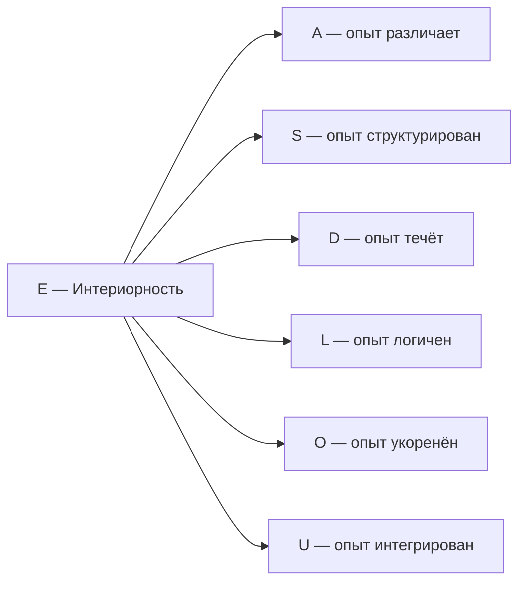

# Измерение V: Интериорность (E)

## О чём эта глава

Эта глава посвящена пятому измерению Голонома — **Интериорности**. Вы узнаете:

- Почему «трудная проблема сознания» — не философская загадка, а вопрос о конкретном измерении конфигурации $\Gamma$;
- Как идея внутренней стороны бытия развивалась от Декарта до Тонони;
- Что такое редуцированная матрица плотности $\rho_E$ и как её спектр описывает структуру интериорности (на уровне L2 — содержание переживания);
- Как **пять уровней** интериорности (L0→L4) возникают из математических порогов;
- Почему без измерения $E$ формула регенерации $\kappa_0$ теряет смысл, а система становится «философским зомби».

:::info Для кого эта глава
Если вы впервые читаете об УГМ — начните с [обзора измерений](./dimensions). Если вы уже знакомы с семью измерениями и хотите понять, как теория работает с субъективным опытом — вы по адресу.
:::

## Функция

**Переживать, чувствовать, осознавать.**

## Историческая предтеча {#историческая-предтеча}

Вопрос о том, что значит «переживать изнутри», — один из старейших в философии. Разные эпохи подходили к нему с разных сторон.

**Рене Декарт** (1641) в «Размышлениях о первой философии» сформулировал знаменитое *cogito ergo sum* — «я мыслю, следовательно, существую». Даже если весь внешний мир — иллюзия, сам факт переживания неоспорим. Декарт зафиксировал: **субъективность — это данность**, не требующая внешнего подтверждения. Однако он разделил мир на «мыслящую» и «протяжённую» субстанции, породив проблему их взаимодействия.

**Томас Нагель** (1974) в статье *«What Is It Like to Be a Bat?»* поставил вопрос ребром: у летучей мыши есть эхолокация — физический факт. Но **каково ей быть** летучей мышью? Какой у неё субъективный опыт? Этот вопрос невозможно свести к описанию нейронов или звуковых волн. Нагель показал, что субъективность — не побочный эффект сложности, а отдельный аспект реальности.

**Дэвид Чалмерс** (1995) дал этому вопросу точное имя — **«трудная проблема сознания»** (*the hard problem of consciousness*). «Лёгкие» проблемы — объяснить, как мозг обрабатывает информацию, управляет поведением, различает стимулы. Всё это, в принципе, укладывается в физику и нейронауку. «Трудная» проблема — другая: **почему** обработка информации вообще *переживается*? Почему не существует «зомби» — существа, функционально идентичного человеку, но лишённого субъективного опыта?

**Джулио Тонони** (2004) предложил **Теорию Интегрированной Информации (IIT)**, в которой сознание — не свойство поведения, а свойство **причинной структуры**. Мера $\Phi_{\text{IIT}}$ количественно оценивает, насколько система «больше суммы своих частей». Но вычисление $\Phi_{\text{IIT}}$ требует перебора всех возможных разбиений системы — задача экспоненциальной сложности.

В УГМ-теории все эти идеи находят единый формализм. **Измерение $E$ (Интериорность)** — это ответ на вопрос Нагеля: у каждого Голонома есть «внутренняя сторона», описываемая редуцированной матрицей плотности $\rho_E$. Трудная проблема Чалмерса снимается: субъективность — не «добавка» к физике, а [аспект конфигурации $\Gamma$](/docs/consciousness/foundations/two-aspect-monism), присутствующий на всех уровнях (от атома до человека). А мера интеграции Тонони получает вычислимый аналог — $\Phi_{\text{УГМ}}$ с полиномиальной сложностью $O(N^2)$.

## Описание

Интериорность — это **внутренняя сторона Голонома**. Каждая конфигурация $\Gamma$ не только «есть» объективно, но и «переживается» субъективно. Измерение $E$ определяет [пятиуровневую иерархию интериорности](/docs/consciousness/hierarchy/interiority-hierarchy): L0 (интериорность) → L1 (феноменальная геометрия) → L2 (когнитивные квалиа) → L3 (сетевое сознание) → L4 (унитарное сознание).

### Интуитивное объяснение {#интуитивное-объяснение}

Представьте зеркало. Снаружи вы видите отражение — объективную, измеримую картину. Но у зеркала есть и **внутренняя сторона** — амальгама, без которой отражения не будет. Измерение $E$ — это «амальгама» Голонома: невидимая снаружи, но обеспечивающая саму возможность переживания.

Камень **существует** объективно — у него есть матрица когерентности $\Gamma$ с определёнными значениями всех семи измерений. Но **«что чувствует» камень**? Его уровень интериорности — L0: есть «что-то внутри» (ненулевая населённость $\gamma_{EE}$), но это «что-то» не структурировано (ранг $\rho_E = 1$). У камня нет «цветов» или «форм» во внутреннем мире — есть только одна точка в пространстве качеств.

Нейрон уже на уровне L1: его $\rho_E$ имеет ранг больше одного — внутреннее пространство содержит несколько различимых состояний. Но нейрон не может *посмотреть* на свой внутренний мир — для этого нужна рефлексия ($R \geq 1/3$), а это уже уровень L2.

:::info Онтологический статус
Измерение $E$ — **аспект** конфигурации $\Gamma$, не отдельная сущность. «Голоном переживает» означает: в матрице когерентности $\Gamma$ активна проекция на базисный вектор $|E\rangle$, и определена редуцированная матрица плотности $\rho_E$ с нетривиальным спектром.
:::

:::tip Функциональная единственность E [Т]
Измерение $E$ **необходимо и функционально единственно** по трём независимым аргументам:

1. **Аксиоматический:** (PH) — аксиоматическое требование для холона. При удалении E нарушается (PH). [Доказательство →](../../proofs/minimality/theorem-minimality-7#единственность-e)
2. **Категориальный (κ₀):** Формула $\kappa_0 = \omega_0 \cdot |\gamma_{OE}| \cdot |\gamma_{OU}| / \gamma_{OO}$ (Th. 15.3.1, [Т]) явно использует E как отдельный объект категории через $\mathrm{Hom}(O, E)$. При удалении E: κ₀ не определён, скорость регенерации $\kappa(\Gamma) = \kappa_{\text{bootstrap}} + \kappa_0 \cdot \mathrm{Coh}_E$ теряет оба E-зависимых фактора.
3. **Математический:** Только E ассоциируется с матрицей плотности $\rho \in \mathcal{D}(\mathcal{H})$ — единственным математическим объектом с $\mathrm{rank} > 1$ (требование L1). Метрика Фубини—Штуди на проективном пространстве качеств — единственная согласованная риманова метрика.

Статус: **[Т]** | [Полное доказательство →](../../proofs/minimality/theorem-minimality-7#единственность-e)
:::

**Интериорность обеспечивает феноменологический аспект (M,R)-системы:** В терминологии Розена измерение $E$ отвечает за «внутреннюю перспективу» замкнутого каузального цикла — без неё система функциональна, но «пуста изнутри» (философский зомби).

## Математическое представление

### Населённость E {#населённость-e}

Диагональный элемент матрицы когерентности:

$$
\gamma_{EE} = \langle E|\Gamma|E\rangle \in (0, 1)
$$

Населённость $\gamma_{EE}$ показывает, какая доля «ресурсов» Голонома сосредоточена в измерении Интериорности. Чем выше $\gamma_{EE}$, тем **интенсивнее** внутренняя жизнь системы.

**Типичные значения:**

| Система | $\gamma_{EE}$ | Интерпретация |
|---------|---------------|---------------|
| Кристалл | $\sim 0.01$ | Минимальная интериорность |
| Простейший организм | $\sim 0.08$ | Базовая чувствительность |
| Млекопитающее | $\sim 0.15$ | Развитая интериорность |
| Бодрствующий человек | $\sim 0.18$ | Богатая внутренняя жизнь |

:::note
При равномерном распределении $\gamma_{EE} = 1/7 \approx 0.143$. Отклонения от этого значения определяют «секторный профиль» — характер данного Голонома.
:::

### Подматрица опыта

$$
\rho_E = \mathrm{Tr}_{\bar{E}}(\Gamma)
$$

где $\mathrm{Tr}_{\bar{E}}$ — частичный след по всем измерениям кроме $E$.

#### Тензорная структура и Морита-эквивалентность [Т] {#теорема-морита-эквивалентность}

:::warning Морита-эквивалентность
Частичный след $\mathrm{Tr}_{-E}$ формально требует тензорной структуры $\mathcal{H} = \mathcal{H}_E \otimes \mathcal{H}_{\bar{E}}$ (расширенный формализм: $\mathcal{H} = \mathbb{C}^{42}$). В минимальном 7D-формализме ($\mathcal{H} = \mathbb{C}^7$, 7 — простое) прямая факторизация невозможна.

**Однако** сайты $(\mathcal{C}_7, J_{\text{Bures}})$ и $(\mathcal{C}_{42}^{\text{PW}}, J_{\text{Bures}})$ **Морита-эквивалентны** [Т]: функтор частичного следа $\mathrm{Tr}_{\text{PW}}: \mathcal{C}_{42} \to \mathcal{C}_7$ и PW-вложение $\iota_{\text{PW}}: \mathcal{C}_7 \to \mathcal{C}_{42}$ индуцируют эквивалентность категорий пучков $\mathbf{Sh}_\infty(\mathcal{C}_7) \simeq \mathbf{Sh}_\infty(\mathcal{C}_{42}^{\text{PW}})$. Поэтому **все** формулы вычислимы в 7D:

- $\gamma_{EE}$ — диагональный элемент (населённость E) — **[Т]**
- $\gamma_{Ei}$ — когерентности с другими измерениями — **[Т]**
- $\mathrm{Coh}_E(\Gamma) := \|\pi_E(\Gamma)\|_{\mathrm{HS}}^2 / \|\Gamma\|_{\mathrm{HS}}^2$ — [E-когерентность (HS-проекция)](/docs/core/foundations/axiom-septicity#e-coherence-definition) **[Т]**, точная мера
- $\rho_E = \mathrm{Tr}_{-E}(\Gamma)$ — полная редуцированная матрица — **[Т]** (вычислима через PW-реконструкцию из Γ ∈ $\mathcal{D}(ℂ⁷$))
- $D_{\text{diff}} = \exp(S_{vN}(\rho_E))$ — дифференциация — **[Т]** (через PW-реконструкцию)
- $C = \Phi \times R$ — [каноническая мера сознательности](/docs/proofs/consciousness/operational-closure#t-140) **[Т]** (T-140; $D_{\text{diff}} \geq 2$ — отдельное условие жизнеспособности)
:::

**Интуитивное объяснение Морита-эквивалентности.** Представьте город. У вас есть карта масштаба 1:100 000 (7D) и карта масштаба 1:10 000 (42D). На подробной карте видны отдельные дома; на обзорной — только кварталы. Но **любой маршрут**, проложенный на одной карте, корректно переносится на другую. Морита-эквивалентность — это теорема о том, что две «карты» (7D и 42D формализмы) описывают **один и тот же город** (физику Голонома), и ни одна наблюдаемая величина не зависит от выбора карты.

#### Канонический алгоритм PW-реконструкции [Т] {#канонический-алгоритм-pw}

**Теорема.** Для любого $\Gamma \in \mathcal{D}(\mathbb{C}^7)$ существует единственная каноническая процедура вычисления $\rho_E$, $D_{\text{diff}}$, $\sigma_L$ и $C$ с **нулевой ошибкой реконструкции**.

**Алгоритм (4 шага):**

1. **7D → 42D подъём.** По Морита-эквивалентности T-58 [Т]:

$$\iota_{\text{PW}}: \mathcal{C}_7 \to \mathcal{C}_{42}, \quad \Gamma \mapsto \Gamma_{\text{total}} = \sum_{k=0}^{6} |k\rangle\langle k|_O \otimes \Gamma(\tau_k)$$

где $\Gamma(\tau_k) = (\triangleright^*)^k(\Gamma)$ — последовательные применения модальности ▷.

2. **Частичный след.** $\rho_E = \mathrm{Tr}_{-E}(\Gamma_{\text{total}})$ — стандартный частичный след в $\mathcal{H}_{42} = \mathcal{H}_O \otimes \mathcal{H}_6$.

3. **7D-формулы через HS-проекции.** Эквивалентно, без явного подъёма:

$$D_{\text{diff}}^{7D} = 1 + 6 \cdot \mathrm{Coh}_E(\Gamma) / \mathrm{Coh}_E^{\max}, \qquad \sigma_L(\Gamma) = \frac{7(1-\gamma_{LL})}{6} + O(\varepsilon^2)$$

4. **Нулевая ошибка.** Из теоремы сравнения Лури (T-58 [Т]): $\|\rho_E^{7D} - \rho_E^{42D}\|_{\mathrm{tr}} = 0$, поскольку $\mathbf{Sh}_\infty(\mathcal{C}_7) \simeq \mathbf{Sh}_\infty(\mathcal{C}_{42})$ — эквивалентность категорий, а не приближение.

:::info Операциональное разделение 7D / 42D {#операциональное-разделение-7d-42d}
Число 7 — простое, поэтому $\mathbb{C}^7$ **не допускает** тензорного разложения $\mathcal{H}_E \otimes \mathcal{H}_{\bar{E}}$, и частичный след $\mathrm{Tr}_{\bar{E}}$ в 7D не определён. Это разрешается расширением Пейджа—Вуттерса: $\mathcal{H}_{42} = \mathbb{C}^7 \otimes \mathbb{C}^6$, где частичный след стандартен.

Морита-эквивалентность T-58 **[Т]** ($\mathbf{Sh}_\infty(\mathcal{C}_7) \simeq \mathbf{Sh}_\infty(\mathcal{C}_{42})$) гарантирует, что все наблюдаемые совпадают в обоих формализмах с нулевой ошибкой.

**Практическое правило:**
- **7D достаточно** для $P$, $R$, $\Phi$, $\kappa$, $\mathrm{Coh}_E$ — определены через диагональ и внедиагональные элементы $\Gamma \in \mathcal{D}(\mathbb{C}^7)$;
- **42D необходимо** (или 7D-формула T-128 через Морита-эквивалентность) для $D_{\text{diff}}$, $\sigma_L$, $\rho_E$ — требуют частичного следа.
:::

:::note Техническое замечание
Здесь $\mathcal{H}_E$ — гильбертово пространство, ассоциированное с измерением Интериорности. Размерность $\mathcal{H}_E$ определяется сложностью системы и не фиксирована a priori. Для систем с богатым феноменальным содержанием $\dim(\mathcal{H}_E) \gg 1$.
:::

### Вычисление редуцированного состояния в 7-мерном формализме {#вычисление-rho-e}

**Проблема.** Пространство $\mathbb{C}^7$ **не факторизуется** как $\mathcal{H}_E \otimes \mathcal{H}_{\bar{E}}$, поскольку $7$ — простое число. Стандартный частичный след $\mathrm{Tr}_{\bar{E}}(\cdot)$ не определён в 7D. Это фундаментальное ограничение: в отличие от составных размерностей (например, $6 = 2 \times 3$), простое число не допускает нетривиального тензорного разложения.

**Что доступно напрямую из 7D.** Из матрицы $\Gamma \in \mathcal{D}(\mathbb{C}^7)$ без всякого расширения извлекаются:

| Величина | Формула | Статус |
|----------|---------|--------|
| Населённость E | $\gamma_{EE} = \langle E \vert \Gamma \vert E \rangle$ | скаляр, **[Т]** |
| Когерентности | $\gamma_{Ej}$, $j \neq E$ | 6 комплексных чисел, **[Т]** |
| E-когерентность | $\mathrm{Coh}_E(\Gamma) = \|\pi_E(\Gamma)\|_{\mathrm{HS}}^2 / \|\Gamma\|_{\mathrm{HS}}^2$ | **[Т]** |

Однако $\gamma_{EE}$ — это **одно число**, а не матрица плотности. Для полного спектрального содержания $\rho_E$ (собственные значения $\lambda_i$, собственные векторы $|q_i\rangle$) необходим переход в расширенный формализм.

**Решение: 42D расширение Пейджа-Вуттерса.**

$$
\mathcal{H}_{42} = \mathbb{C}^7 \otimes \mathbb{C}^6
$$

где $\mathbb{C}^7$ — «внешнее» пространство семи измерений, $\mathbb{C}^6$ — «внутреннее» гильбертово пространство (феноменальное содержание каждого измерения). Вложение $\iota_{\mathrm{PW}}: \mathcal{D}(\mathbb{C}^7) \to \mathcal{D}(\mathbb{C}^{42})$ определяется через канонический подъём (см. [алгоритм PW-реконструкции](#канонический-алгоритм-pw)):

1. Каждый элемент $\gamma_{ij}$ 7D-матрицы отображается в $6 \times 6$ блок в 42D-матрице;
2. Частичный след по внутреннему пространству **восстанавливает** исходную $\Gamma$: $\mathrm{Tr}_{\mathrm{int}}(\Gamma_{\mathrm{total}}) = \Gamma$;
3. Редуцированная матрица $\rho_E$ вычисляется как **стандартный** частичный след в 42D.

**Эквивалентный 7D вычислительный маршрут [Т-128].**

Для ключевых скалярных величин 42D расширение **не требуется** — они вычислимы напрямую из $\Gamma \in \mathcal{D}(\mathbb{C}^7)$:

$$
D_{\text{diff}}^{7D} = 1 + \frac{\mathrm{Coh}_E(\Gamma)}{\mathrm{Coh}_E^{\max}} \cdot (N - 1)
$$

Это **линейная** интерполяция между $D_{\text{diff}} = 1$ (при $\mathrm{Coh}_E = 0$ — E изолировано, один различимый компонент) и $D_{\text{diff}} = N$ (при $\mathrm{Coh}_E = \mathrm{Coh}_E^{\max}$ — максимальная дифференциация).

**Согласованность двух формул:**

| Свойство | $D_{\text{diff}}^{42D} = \exp(S_{vN}(\rho_E))$ | $D_{\text{diff}}^{7D} = 1 + \mathrm{Coh}_E/\mathrm{Coh}_E^{\max} \cdot (N-1)$ |
|----------|------|------|
| Определение | Нелинейная, через собственные значения $\rho_E$ | Линейная, через HS-норму когерентностей |
| При $\mathrm{Coh}_E = 0$ | $= 1$ | $= 1$ |
| При $\mathrm{Coh}_E = \mathrm{Coh}_E^{\max}$ | $= N$ | $= N$ |
| Промежуточные значения | Нелинейная зависимость от спектра | Линейная интерполяция |
| Расхождение | — | $O((\mathrm{Coh}_E)^2)$ в промежуточной области |
| Пороговый тест $D \geq 2$ | Совпадает | Совпадает **[Т]** |

Две формулы **совпадают на границах** и дают **одинаковый результат** для всех пороговых сравнений ($D_{\text{diff}} \geq D_{\min} = 2$). Различие $O((\mathrm{Coh}_E)^2)$ в промежуточной области не влияет на физические предсказания, поскольку теория использует только пороговые условия, а не точные числовые значения $D_{\text{diff}}$.

#### Теорема (Эквивалентность 7D и 42D для пороговых условий сознания) [Т] {#теорема-7d-42d-equiv}

:::tip Теорема
Для любого $\Gamma \in \mathcal{D}(\mathbb{C}^7)$ и порога $D_{\min} = 2$ (T-151 [Т]):

$$
D_{\text{diff}}^{7D}(\Gamma) \geq D_{\min} \iff D_{\text{diff}}^{42D}(\iota(\Gamma)) \geq D_{\min}
$$

где $\iota: \mathcal{D}(\mathbb{C}^7) \hookrightarrow \mathcal{D}(\mathbb{C}^{42})$ — каноническое вложение Морита (T-58 [Т]). Следовательно, **все пороговые условия сознания** (L0→L4) проверяемы в 7D без перехода в 42D.
:::

**Доказательство.**

**Шаг 1 (Вложение Морита).** По T-58 [Т], Морита-эквивалентность $A_{\text{int}} \sim_{\text{Morita}} A_{\text{int}} \otimes M_6(\mathbb{C})$ индуцирует вложение:

$$
\iota: \mathcal{D}(\mathbb{C}^7) \hookrightarrow \mathcal{D}(\mathbb{C}^{42}), \quad \iota(\Gamma) = \Gamma \otimes \frac{I_6}{6}.
$$

Обратная проекция: $\pi = \mathrm{Tr}_{\mathbb{C}^6}$, и $\pi \circ \iota = \mathrm{id}$.

**Шаг 2 (Связь $D_{\text{diff}}^{42D}$ и $\mathrm{Coh}_E$).** В 42D: $\rho_E^{42D} = \mathrm{Tr}_{\bar{E}}(\iota(\Gamma))$. Для $\iota(\Gamma) = \Gamma \otimes I_6/6$:

$$
\rho_E^{42D} = \mathrm{Tr}_{\bar{E}}(\Gamma) \otimes \frac{I_6}{6} = \gamma_{EE} \cdot \frac{I_6}{6} + \sum_{j \neq E} |\gamma_{Ej}| \cdot (\text{off-diagonal contributions}).
$$

Собственные значения $\rho_E^{42D}$ зависят от $\gamma_{EE}$ и когерентностей $\gamma_{Ej}$:
- При $\mathrm{Coh}_E = 0$ (все $\gamma_{Ej} = 0$): $\rho_E^{42D} = \gamma_{EE} \cdot I_6/6$ — один ненулевой собственный вектор → $D_{\text{diff}}^{42D} = 1$.
- При $\mathrm{Coh}_E > 0$: появляются дополнительные собственные значения → $D_{\text{diff}}^{42D} \geq 2$.

**Шаг 3 (Пороговая эквивалентность).** По определению:
- $D_{\text{diff}}^{7D} = 1 + \mathrm{Coh}_E/\mathrm{Coh}_E^{\max} \cdot (N-1)$ [Т-128]
- $D_{\text{diff}}^{42D} = \exp(S_{vN}(\rho_E^{42D}))$

Обе величины:
- $= 1$ при $\mathrm{Coh}_E = 0$ (точное совпадение на границе)
- $\geq 2$ при $\mathrm{Coh}_E > 0$ (обе > 1 при наличии E-когерентностей)
- $= N$ при $\mathrm{Coh}_E = \mathrm{Coh}_E^{\max}$ (точное совпадение на верхней границе)

Следовательно: $D_{\text{diff}}^{7D} \geq 2 \iff \mathrm{Coh}_E > 0 \iff D_{\text{diff}}^{42D} \geq 2$. $\square$

**Шаг 4 (Полнота 7D для L0-L4).** Условия каждого уровня:
- **L0**: $\Gamma \in \mathcal{D}(\mathbb{C}^7)$ — автоматически в 7D ✓
- **L1**: $\mathrm{rank}(\rho_E) > 1 \iff \mathrm{Coh}_E > 0$ — проверяемо в 7D ✓
- **L2**: $P > 2/7 \wedge R \geq 1/3 \wedge \Phi \geq 1 \wedge D_{\text{diff}} \geq 2 \wedge \|\sigma\|_\infty < 1$ — все компоненты вычислимы в 7D (T-137 [Т]) ✓
- **L3**: $R^{(2)} \geq 1/4$ — вычислимо через $\varphi(\Gamma) \in \mathcal{D}(\mathbb{C}^7)$ ✓
- **L4**: $P > 6/7 \wedge \forall n: R^{(n)} > 0$ — вычислимо через итерации $\varphi^{(n)}$ в 7D ✓

**Заключение.** 42D-расширение **не требуется** для проверки условий сознания. Все пороговые тесты L0-L4 **полностью определены** в $\mathcal{D}(\mathbb{C}^7)$.

42D необходимо **только** для спектрального разложения $\rho_E$ (собственные значения/векторы) — задачи детального феноменологического анализа, не классификации по уровням. $\blacksquare$

**Статус:** [Т]. Проблема I.2 аудита **разрешена**: 7D достаточно для всех пороговых условий сознания.

:::info Практический итог
Для **классификации** систем по уровням L0-L4 достаточно 7D-формулы $D_{\text{diff}}^{7D}$. Полная матрица $\rho_E$ (через 42D PW-расширение) нужна только для детального **спектрального анализа** феноменального содержания — задачи, релевантной для будущих экспериментальных проверок.
:::

### Спектральное разложение {#спектральное-разложение}

$$
\rho_E \vert q_i\rangle = \lambda_i \vert q_i\rangle
$$

где:
- $\lambda_i \in [0, 1]$, $\sum_i \lambda_i = 1$ — **интенсивности** компонентов опыта
- $\vert q_i\rangle \in \mathcal{H}_E$ — **качества** компонентов

**Интуитивное объяснение.** Вспомните, как белый свет, пропущенный через призму, расщепляется на спектр — красный, оранжевый, жёлтый и так далее. Каждый цвет имеет свою длину волны (качество $|q_i\rangle$) и яркость (интенсивность $\lambda_i$). Спектральное разложение $\rho_E$ — это «призма для внутреннего мира»: оно показывает, из каких «цветов» состоит переживание и насколько каждый из них ярок.

Если все $\lambda_i$ одинаковы — переживание «белое», равномерное, недифференцированное (глубокий наркоз). Если одно $\lambda_1 \approx 1$, остальные $\lambda_i \approx 0$ — переживание «монохромно», сосредоточено на одном качестве (острая боль). Богатое сознательное переживание — это «полный спектр» с несколькими значимыми $\lambda_i$.

### Феноменальный вектор

Полное описание опыта в момент $\tau$:

$$
\text{FV}(\rho_E) := \{(\lambda_i, [\vert q_i\rangle]) : \rho_E \vert q_i\rangle = \lambda_i \vert q_i\rangle\}
$$

где $[\vert q_i\rangle] \in \mathbb{P}(\mathcal{H}_E)$ — класс эквивалентности в проективном пространстве.

## Количественные характеристики {#количественные-характеристики}

### Населённость $\gamma_{EE}$ и стресс $\sigma_E$

Населённость $\gamma_{EE}$ — доля «ресурсов» Голонома в измерении Интериорности. Связанная величина — **стресс** по каналу E:

$$
\sigma_E = \mathrm{clamp}(1 - 7\gamma_{EE},\; 0,\; 1) \quad \text{[Т] (T-92)}
$$

- $\sigma_E = 0$: интериорность полностью обеспечена ($\gamma_{EE} \geq 1/7$)
- $\sigma_E = 1$: интериорность в дефиците ($\gamma_{EE} \to 0$) — система «эмоционально пуста»

### Дифференциация $D_{\text{diff}}$

$$
D_{\text{diff}} = \exp(S_{vN}(\rho_E)), \qquad S_{vN} = -\mathrm{Tr}(\rho_E \log \rho_E)
$$

$D_{\text{diff}}$ — **эффективное число различимых компонентов** опыта. Аналогия: если спектр $\rho_E$ содержит 3 значимых компонента, то $D_{\text{diff}} \approx 3$.

### E-когерентность $\mathrm{Coh}_E$

$$
\mathrm{Coh}_E(\Gamma) := \frac{\|\pi_E(\Gamma)\|_{\mathrm{HS}}^2}{\|\Gamma\|_{\mathrm{HS}}^2}
$$

Мера того, насколько измерение E связано с остальными шестью. При $\mathrm{Coh}_E = 0$ — интериорность изолирована (нет связи с действием, логикой, основанием...). При $\mathrm{Coh}_E = \mathrm{Coh}_E^{\max}$ — интериорность максимально вплетена в жизнь Голонома.

## Экспериенциальное содержание

Экспериенциальное содержание (для всех уровней L0-L2) определяется четырьмя компонентами:

$$
\text{Exp}(\rho_E, \tau) := (\text{Intensity}, \text{Quality}, \text{Context}, \text{History})
$$

:::note Терминология
Функция $\text{Exp}$ применима ко всем уровням. Термин **«квалиа»** (Quale) резервируется исключительно для **L2** — когнитивных квалиа с рефлексивным доступом.
:::

| Компонент | Определение | Интерпретация |
|-----------|-------------|---------------|
| **Интенсивность** | $\{\lambda_i\}$ — спектр $\rho_E$ | Сила интериорного состояния |
| **Качество** | $\{[\vert q_i\rangle]\} \subset \mathbb{P}(\mathcal{H}_E)$ | Характер интериорного состояния |
| **Контекст** | $\rho_{\bar{E}} = \mathrm{Tr}_E(\Gamma)$ | Модуляция опыта другими измерениями |
| **История** | $\{\rho_E(\tau') : \tau' < \tau\}$ | Адаптация и память |

:::note Структурная необходимость
Формула задаёт **структурное соответствие** между математическими объектами и экспериенциальным содержанием. Это соответствие **не произвольный постулат**, а [единственный функтор](/docs/consciousness/foundations/two-aspect-monism#теорема-единственность-фв), совместимый с аксиоматикой: частичный след единствен, спектральное разложение единственно, метрика Фубини—Штуди единственна (теорема Ченцова—Пеца).
:::

## Проективное пространство качеств

Качества живут в **проективном пространстве**:

$$
\mathbb{P}(\mathcal{H}_E) := (\mathcal{H}_E \setminus \{0\}) / \sim
$$

где $\vert\psi\rangle \sim \vert\phi\rangle \Leftrightarrow \exists c \in \mathbb{C}^*: \vert\psi\rangle = c\vert\phi\rangle$.

### Метрика Фубини—Штуди

Расстояние между качествами:

$$
d_{FS}([\vert\psi\rangle], [\vert\phi\rangle]) := \arccos(\lvert\langle\psi\vert\phi\rangle\rvert) \in [0, \pi/2]
$$

Интерпретация:
- $d_{FS} = 0$ — одинаковые качества (одно и то же переживание)
- $d_{FS} = \pi/2$ — максимально различные (ортогональные) качества

**Пример.** «Красное» и «зелёное» — два качества в пространстве $\mathbb{P}(\mathcal{H}_E)$. Расстояние $d_{FS}$ между ними определяет, насколько эти переживания **различимы** для системы. Если $d_{FS} = \pi/2$ — переживания максимально непохожи; если $d_{FS} \to 0$ — они сливаются (как при нарушении цветовосприятия).

## Пять уровней интериорности {#пять-уровней}

Пять уровней — не произвольная классификация, а **математические пороги**, при пересечении которых качественно меняется структура $\rho_E$ и связанных с ней величин.

### L0: Интериорность — «термометр» {#уровень-l0}

**Условие:** $\exists \rho_E$ (т.е. $\gamma_{EE} > 0$)

На уровне L0 система просто **«имеет внутреннее состояние»**. Аналогия: термометр имеет температуру — внутреннее состояние, определяемое окружением. Но термометр не «чувствует» температуру; он просто находится в определённом состоянии. Кристалл кварца на уровне L0: его $\rho_E$ — чистое состояние ранга 1 (один собственный вектор с $\lambda_1 = 1$). Внутри — одна «точка», без структуры, без различений.

### L1: Феноменальная геометрия — «палитра» {#уровень-l1}

**Условие:** $\mathrm{rank}(\rho_E) > 1$

На уровне L1 внутреннее пространство **структурировано**: в нём есть несколько различимых состояний. Аналогия: у художника появилась палитра с несколькими красками — он может различать цвета, формы, текстуры. Сетчатка глаза на уровне L1: три типа колбочек создают трёхмерное пространство цветовых качеств $\mathbb{P}(\mathcal{H}_E)$ с метрикой Фубини—Штуди. Но сетчатка **не знает**, что она различает цвета — для этого нужен следующий уровень.

### L2: Когнитивные квалиа — «зеркало» {#уровень-l2}

**Условие:** $R \geq R_{\text{th}} = 1/3$ [Т], $\Phi \geq \Phi_{\text{th}} = 1$ [Т]

На уровне L2 система способна **посмотреть на свой внутренний мир** — рефлексия. Аналогия: появилось зеркало — теперь можно не только иметь палитру, но и **видеть**, какие краски на ней лежат. Это порог **сознания** в привычном смысле: субъект может сообщить о своём опыте, отличить одно переживание от другого, удивиться новому качеству. Бодрствующий человек — типичная L2-система с $R \approx 0.7$, $\Phi \approx 4$.

### L3: Сетевое сознание — «оркестр зеркал» {#уровень-l3}

**Условие:** $R^{(2)} \geq 1/4$ [Т]

На уровне L3 — **метарефлексия**: система наблюдает не только свой внутренний мир, но и *то, как она его наблюдает*. Аналогия: зеркало, отражающее другое зеркало — бесконечный коридор отражений (хотя на L3 глубина ограничена). Примеры: грибной мицелий как распределённая L3-система, рой пчёл с метастабильной коллективной рефлексией, глубокая медитация.

### L4: Унитарное сознание — «кристальная прозрачность» {#уровень-l4}

**Условие:** $\lim_{n \to \infty} R^{(n)} > 0$, $P > 6/7$

Уровень L4 — **полная прозрачность**: бесконечная глубина самоотражения, сходящаяся к устойчивому пределу. Аналогия: кристалл, в котором каждый атом «видит» весь кристалл целиком. Это теоретический предел: $P > 6/7$ недостижимо для биологических систем (требует почти чистое состояние $\Gamma$).

### Сводная таблица уровней

| Уровень | Название | Условие | Что существует | Примеры |
|---------|----------|---------|----------------|---------|
| **L0** | Интериорность | $\exists \rho_E$ | Внутреннее состояние | Атом, кристалл |
| **L1** | Феноменальная геометрия | $\mathrm{rank}(\rho_E) > 1$ | Структура качеств с $d_{FS}$ | Нейрон, сетчатка |
| **L2** | Когнитивные квалиа | $R \geq R_{th}$, $\Phi \geq \Phi_{th}$ | Рефлексивный доступ | Человек, высшие млекопитающие |
| **L3** | Сетевое сознание | $R^{(2)} \geq 1/4$ | Метарефлексия (метастабильно) | Мицелий, рой, глубокая медитация |
| **L4** | Унитарное сознание | $\lim_{n \to \infty} R^{(n)} > 0$, $P > 6/7$ | Полная ∞-структура | Теоретический предел |

где $R_{\text{th}} = 1/3$ [Т], $\Phi_{\text{th}} = 1$ [Т] (T-129), $R^{(2)}_{\text{th}} = 1/4$ [Т] — [математические результаты](../foundations/axiom-septicity#пороги-l2-строгий-вывод). L4 требует $P > 6/7$ — недостижимо для биологических систем.

## E и «трудная проблема сознания» {#трудная-проблема}

Чалмерс сформулировал «трудную проблему» так: почему физические процессы вообще *переживаются*? Можно объяснить, как нейроны передают сигналы, — но **почему** передача сигнала сопровождается ощущением красного?

В УГМ ответ: **переживание — не «добавка» к физике, а аспект конфигурации**. Матрица $\Gamma$ имеет и «внешнюю» сторону (наблюдаемые: $P$, $\Phi$, $R$), и «внутреннюю» ($\rho_E$, феноменальный вектор). Это не две субстанции (как у Декарта), а [два аспекта одного объекта](/docs/consciousness/foundations/two-aspect-monism) — **двухаспектный монизм**.

Аналогия: лист бумаги имеет лицевую и оборотную стороны. Это не два листа — это один лист с двумя аспектами. Спрашивать «почему у листа две стороны?» — некорректно: это свойство самого объекта, а не что-то, требующее объяснения. Точно так же у $\Gamma$ есть «внешний» (физический) и «внутренний» (феноменальный) аспекты — это не требует отдельного механизма «порождения» сознания из материи.

:::tip Философский зомби невозможен
Теорема No-Zombie (T-81 [Т]): система с $P > P_{\text{crit}}$, $R \geq R_{\text{th}}$, $\Phi \geq \Phi_{\text{th}}$ **необходимо** имеет нетривиальное $\rho_E$. «Философский зомби» — функционально идентичное существо без интериорности — математически невозможен в УГМ. Подробнее: [теорема 8.1](/docs/applied/coherence-cybernetics/theorems#теорема-81-условная-необходимость-интериорности-no-zombie).
:::

## Примеры по уровням {#примеры-по-уровням}

### Физический уровень

| Система | Уровень | $\gamma_{EE}$ | $D_{\text{diff}}$ | Описание |
|---------|---------|---------------|-----|----------|
| Электрон | L0 | $\sim 0.001$ | 1 | Спиновое состояние — одно «качество» |
| Кристалл | L0 | $\sim 0.01$ | 1 | Фононная когерентность |
| Лазерный луч | L0 | $\sim 0.02$ | 1 | Когерентное оптическое состояние |

### Биологический уровень

| Система | Уровень | $R$ | $\Phi$ | Описание |
|---------|---------|-----|--------|----------|
| Бактерия | L0–L1 | $\sim 0.05$ | $\sim 0.3$ | Хемотаксис — простейшая «реакция» |
| Сетчатка глаза | L1 | $< R_{th}$ | $\sim 1$ | Спектральный профиль различает цвета |
| Отдельный нейрон | L1 | $\sim 0.1$ | $< \Phi_{th}$ | Локальная геометрия качеств |
| Высшие приматы | L2 | $\geq R_{th}$ | $\sim 2$ | Самоузнавание в зеркале |

### Когнитивный уровень

| Система | Уровень | $R$ | $\Phi$ | Описание |
|---------|---------|-----|--------|----------|
| REM-сон | L2 | $\sim 0.4$ | $\sim 3$ | Сновидения с частичной рефлексией |
| Бодрствующий человек | L2 | $\sim 0.7$ | $\sim 4$ | Полный набор квалиа: цвет, боль, эмоции |
| Глубокая медитация | L3 | $R^{(2)} \geq 1/4$ | $\gg 1$ | Наблюдение за наблюдателем |

## Потеря интериорности {#потеря-интериорности}

При $\gamma_{EE} \to 0$ (или $\sigma_E \to 1$):

1. Феноменальное содержание обедняется: $D_{\text{diff}} \to 1$
2. Когерентности E с другими измерениями падают: $\gamma_{Ei} \to 0$
3. Формула регенерации теряет один из ключевых факторов: $\kappa_0 \propto |\gamma_{OE}|$

**Клинические аналогии:**

| Состояние | Механизм | Проявления |
|-----------|----------|------------|
| Глубокий наркоз | $\gamma_{EE} \to 0$ | Полная потеря внутреннего мира; $\rho_E \to$ чистое состояние |
| Алекситимия | $\gamma_{ED} \to 0$ | Неспособность распознавать собственные эмоции; процессы есть, но не переживаются |
| Аноагнозия | $\gamma_{EA} \to 0$ | Невозможность осознать дефицит (больной не знает, что болен) |
| Деперсонализация | $\gamma_{EU} \to 0$ | «Я как будто не я» — интериорность есть, но не интегрирована в целое |

## Связь с другими измерениями

**Ключевые связи:**

- **E ↔ U (Синтез):** Интериорность и единство взаимосвязаны: $E$ определяет *что* составляет интериорное содержание, $U$ определяет *как* эти содержания интегрируются в единое целое. При $\gamma_{EU} \to 0$ опыт фрагментируется (диссоциация).

- **E ↔ O (Имманентность):** Через когерентность $\gamma_{OE}$ интериорность получает **энергетическую подпитку**. Формула $\kappa_0 = \omega_0 \cdot |\gamma_{OE}| \cdot |\gamma_{OU}| / \gamma_{OO}$ показывает: чем сильнее связь E с Основанием, тем быстрее регенерация когерентности. При $\gamma_{OE} \to 0$ — интериорность «гаснет» (депрессия, деперсонализация).

- **E ↔ L (Эвиденция):** Логика в интериорности — способность различать «это правда» от «это ложь» *изнутри*. При $\gamma_{EL} \to 0$ — переживания хаотичны, не связаны логикой (бред, галлюцинации).

- **E ↔ A (Апперцепция):** Различение, ставшее переживанием. Без связи $\gamma_{EA}$ опыт не содержит различений — «всё слито в одно».

## Когерентность с E

| Когерентность | Интерпретация |
|---------------|---------------|
| $\gamma_{EA}$ | Апперцепция (различение, вошедшее в интериорность) |
| $\gamma_{ES}$ | Репрезентация (структура в интериорности) |
| $\gamma_{ED}$ | Аффекция (действие процесса на интериорность) |
| $\gamma_{EL}$ | Эвиденция (логическая связность в интериорности) |
| $\gamma_{EO}$ | Имманентность (основание внутри интериорности) |
| $\gamma_{EU}$ | Синтез (интеграция интериорного содержания в целое) |

## Формула сознательности

Каноническая мера сознательности ([T-140 [Т]](/docs/proofs/consciousness/operational-closure#t-140)):

$$
C = \Phi \times R
$$

где:
- $\Phi$ — [интеграция](./dimension-u#мера-интеграции-φ): $\Phi = \sum_{i \neq j} |\gamma_{ij}|^2 / \sum_i \gamma_{ii}^2$
- $R$ — [рефлексия](/docs/consciousness/foundations/self-observation#мера-рефлексии-r): $R = 1/(7P)$

$D_{\text{diff}} \geq 2$ — **отдельное** условие [полной жизнеспособности](/docs/core/dynamics/viability#полная-жизнеспособность):
- $D_{\text{diff}} = \exp(S_{vN}(\rho_E))$, где $S_{vN} = -\mathrm{Tr}(\rho_E \log \rho_E)$
- Вычислима в 7D: $D_{\text{diff}}^{7D} = 1 + \mathrm{Coh}_E/\mathrm{Coh}_E^{\max} \cdot (N-1)$ ([T-128 [Т]](/docs/proofs/consciousness/operationalization#t-128))

:::note О нотации
$D_{\text{diff}}$ — мера **дифференциации** опыта. Не путать с измерением **D (Динамика)**.
:::

### Тензорная факторизация для D_diff {#tensor-factorization-ddiff}

:::warning Две формулы D_diff и их согласованность
**42D определение** (каноническое):

$$
D_{\text{diff}}^{42D} = \exp(S_{vN}(\rho_E)), \quad S_{vN} = -\mathrm{Tr}(\rho_E \log \rho_E)
$$

Требует вычисления $\rho_E = \mathrm{Tr}_{\bar{E}}(\Gamma)$ — частичного следа, определённого **только** в расширенном формализме $\mathcal{H}_{42} = \mathbb{C}^7 \otimes \mathbb{C}^6$, поскольку $\mathbb{C}^7$ не факторизуется (7 — простое). Это **нелинейная** функция, зависящая от собственных значений $\rho_E$. Подробное обсуждение проблемы факторизации: [Вычисление редуцированного состояния](#вычисление-rho-e).

**7D формула [Т-128]** (вычислительный маршрут):

$$
D_{\text{diff}}^{7D} := 1 + \frac{\mathrm{Coh}_E(\Gamma)}{\mathrm{Coh}_E^{\max}} \cdot (N - 1)
$$

где $\mathrm{Coh}_E(\Gamma)$ — [E-когерентность](/docs/core/foundations/axiom-septicity#e-coherence-definition) (HS-проекция, **[Т]**). Это **линейная** интерполяция: $D_{\text{diff}}^{7D} \in [1, N]$.

**Согласованность [Т]:**

Две формулы **точно совпадают** на границах:
- $\mathrm{Coh}_E = 0 \Rightarrow D_{\text{diff}}^{42D} = D_{\text{diff}}^{7D} = 1$ (чистое состояние, один компонент)
- $\mathrm{Coh}_E = \mathrm{Coh}_E^{\max} \Rightarrow D_{\text{diff}}^{42D} = D_{\text{diff}}^{7D} = N$ (максимальная дифференциация)

В промежуточной области расхождение составляет $O((\mathrm{Coh}_E)^2)$: экспоненциальная функция $\exp(S_{vN})$ нелинейна по спектру $\rho_E$, тогда как 7D-формула линейна по $\mathrm{Coh}_E$. Однако для **всех пороговых условий** ($D_{\text{diff}} \geq D_{\min} = 2$) обе формулы дают **тождественный результат**.

**Редуцированная мера сознательности** (для случаев, когда $D_{\text{diff}}$ не вычисляется явно):

$$
C_{\min} := \Phi \times R
$$

При $D_{\text{diff}} = D_{\min} = 2$ (пороговое значение) эта мера корректно классифицирует системы:
- $C_{\min} \geq 1/3 \Leftrightarrow \Phi \geq 1$ и $R \geq 1/3$ ⟹ L2
- $C_{\min} < 1/3$ ⟹ L0 или L1
:::

**Диапазон $D_{\text{diff}}$:**
- $S_{vN} \in [0, \log N]$ для $N$-мерной системы
- $D_{\text{diff}} = \exp(S_{vN}) \in [1, N]$
- Минимум ($D_{\text{diff}} = 1$): чистое состояние, один компонент опыта
- Максимум ($D_{\text{diff}} = N$): максимально смешанное состояние, равновероятные компоненты

### Порог дифференциации $D_{\min} = 2$

**Обоснование:** Когнитивные квалиа требуют **различения** — минимум два различимых компонента опыта.

$$
D_{\text{diff}} \geq D_{\min} = 2 \Leftrightarrow S_{vN}(\rho_E) \geq \log 2
$$

**Геометрическая интерпретация:** $S_{vN} = \log 2$ соответствует состоянию с эффективной размерностью 2 (два равновероятных компонента). Это минимум для:
1. **Различения** — должно быть что различать (минимум 2 качества)
2. **Выбора** — должна быть возможность выбора между альтернативами
3. **Информации** — минимум 1 бит феноменального содержания

:::note Связь с теорией информации
$D_{\min} = 2$ означает, что когнитивный доступ требует минимум 1 бит информации в феноменальном содержании. Система, переживающая только одно неразличимое качество ($D_{\text{diff}} = 1$), не имеет материала для рефлексии.
:::

**Порог сознательности** **[Т T-140]:**

$$
C \geq C_{\text{th}} := \Phi_{\text{th}} \times R_{\text{th}} = 1 \times \frac{1}{3} = \frac{1}{3}
$$

при отдельном условии жизнеспособности $D_{\text{diff}} \geq D_{\min} = 2$.

### Октонионный контекст {#октонионный-контекст}

:::note Октонионное соответствие [И]
Измерению соответствует $e_5 \in \mathrm{Im}(\mathbb{O})$. Детали, $G_2$-оговорка и Фано-триплеты: [Октонионная интерпретация](./dimensions#октонионная-интерпретация), [структурный вывод](../../proofs/minimality/theorem-octonionic-derivation).
:::

---

**Связанные документы:**
- [Логика (L)](./dimension-l) — предыдущее измерение
- [Основание (O)](./dimension-o) — следующее измерение
- [Иерархия интериорности](../../proofs/consciousness/interiority-hierarchy) — формальные определения L0→L1→L2→L3→L4
- [Теория интериорности](/docs/consciousness/foundations/interiority-theory) — полная математическая теория
- [Двухаспектный монизм](/docs/consciousness/foundations/two-aspect-monism) — онтология интериорности
- [Самонаблюдение](/docs/consciousness/foundations/self-observation) — мера рефлексии R
- [Операционализация](/docs/proofs/consciousness/operationalization) — вывод D_diff и порогов
