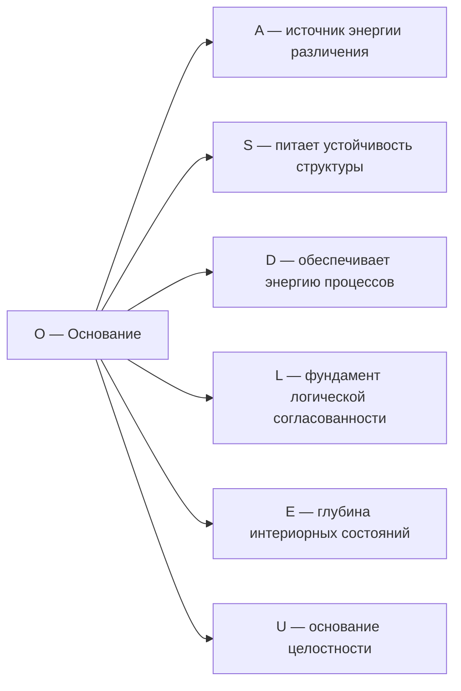

# Измерение VI: Основание (O)

## О чём эта глава

Эта глава посвящена шестому измерению Голонома — **Основанию**. Вы узнаете:

- Почему у каждой системы должен быть **источник энергии**, и как философы от Аристотеля до Хайдеггера искали «основу всего»;
- Как одно и то же измерение выполняет **две функции** одновременно — питает систему и задаёт ей внутренние часы;
- Что такое механизм **Пейдж–Вуттерс** и почему время — не фон, а свойство самого Голонома;
- Как формула регенерации $\kappa_0 = \omega_0 \cdot |\gamma_{OE}| \cdot |\gamma_{OU}| / \gamma_{OO}$ связывает три измерения в один узел;
- Что происходит при **потере связи** с Основанием — от физического истощения до экзистенциального кризиса.

:::info Для кого эта глава
Если вы впервые читаете об УГМ — начните с [обзора измерений](./dimensions). Если вы уже знакомы с семью измерениями и хотите понять, откуда Голоном берёт энергию и время — вы по адресу.
:::

## Функция

**Поддерживать существование, питать, связывать с Источником, параметризовать внутреннее время.**

## Историческая предтеча {#историческая-предтеча}

Вопрос «на чём всё держится?» возникал во всех культурах и эпохах.

**Аристотель** (IV в. до н.э.) в «Метафизике» ввёл понятие **первопричины** (causa prima) — того, что существует «само по себе» и даёт существование всему остальному. Без первопричины цепочка причин уходит в бесконечность, и ничто не имеет основания. Аристотель настаивал: должно быть нечто, что **движет**, не будучи движимым, — «неподвижный двигатель». В УГМ эта роль отводится измерению $O$: оно обеспечивает свободную энергию ($\Delta F > 0$), не «расходуя» себя полностью.

**Мартин Хайдеггер** (1927) в «Бытии и времени» различил **сущее** (то, что есть) и **бытие** (то, *благодаря чему* сущее есть). Бытие — не ещё одна вещь среди вещей, а **основание** всех вещей. Хайдеггер также показал, что бытие и время неразрывно связаны: быть — значит быть *во* времени, и понимание бытия всегда временно`. В УГМ эта связь реализуется буквально: измерение $O$ одновременно является источником энергии *и* внутренними часами.

**Дон Пейдж и Уильям Вуттерс** (1983) предложили радикальное решение «проблемы времени» в квантовой гравитации. Вселенная в целом описывается стационарным состоянием ($H|\Psi\rangle = 0$) — в ней **нет** внешнего времени. Но если выделить одну подсистему в качестве «часов» и посмотреть на остальное *условно* (через частичный след) — возникает динамика, неотличимая от обычного квантовомеханического движения. Время — **не фон**, а параметр корреляций между часами и наблюдателем. В УГМ роль часов играет именно измерение $O$.

**Людвиг Больцман** (XIX в.) показал, что все процессы в природе приводятся в движение **градиентом свободной энергии** $\Delta F$. Без свободной энергии нет работы, нет упорядоченности, нет жизни. Второй закон термодинамики — стрела времени — направлен от порядка к хаосу. Живые системы временно **обращают** эту стрелу, импортируя свободную энергию извне. В УГМ это формализуется через регенеративный член $\mathcal{R}$, питаемый измерением $O$.

В УГМ-теории все эти идеи объединяются в одном измерении: **Основание ($O$)** — первопричина Аристотеля, бытие-основание Хайдеггера, часы Пейджа–Вуттерса и источник свободной энергии Больцмана.

## Описание

Основание — это измерение **бытийной глубины**. Оно связывает каждый Голоном с полнотой $\Gamma$, обеспечивает источник свободной энергии для регенерации когерентности и выполняет роль **внутренних часов**.

### Интуитивное объяснение {#интуитивное-объяснение}

Представьте дерево. Его крона — видимая часть: листья (различения, $A$), ветви (структура, $S$), рост (динамика, $D$). Но всё это питается через **корни** — невидимую подземную часть, которая черпает воду и минералы из почвы. Измерение $O$ — это корни Голонома.

Но корни делают ещё кое-что: они задают **ритм роста**. Весной корни начинают активно поглощать воду — и дерево «просыпается». Осенью корневая активность снижается — и дерево «засыпает». Корни — это и источник питания, и внутренние часы. Точно так же измерение $O$ одновременно обеспечивает энергию ($\Delta F > 0$) и параметризует внутреннее время ($\tau$).

:::warning Двойная роль измерения O
Согласно [теореме об эмерджентном времени](../../proofs/dynamics/emergent-time), измерение O выполняет две фундаментальные функции:
1. **Источник энергии:** Обеспечивает $\Delta F > 0$ для регенерации
2. **Внутренние часы:** Параметризует внутреннее время τ через механизм Пейдж–Вуттерс
:::

### Почему одно измерение — две функции? {#двойная-роль}

Это не совпадение, а математическая необходимость. Рассмотрим формулу регенерации:

$$
\kappa_0 = \omega_0 \cdot \frac{|\gamma_{OE}| \cdot |\gamma_{OU}|}{\gamma_{OO}}
$$

В этой формуле $\omega_0$ — фундаментальная частота часов, а $\gamma_{OO}$ — населённость Основания. Числитель содержит когерентности $O$ с Интериорностью ($E$) и Единством ($U$): регенерация требует, чтобы Основание было **связано** с внутренним миром и с целостностью системы. Если выделить функцию «часов» в отдельное измерение, оно не будет связано с $E$ и $U$ нужным образом — формула $\kappa_0$ потеряет структуру. Если выделить функцию «источника энергии» — пропадёт $\omega_0$.

**Двойная роль O — следствие формулы $\kappa_0$:** единственный способ обеспечить и частоту ($\omega_0$), и энергетические связи ($|\gamma_{OE}|$, $|\gamma_{OU}|$) — это одно и то же измерение.

:::info Онтологический статус
Основание — **аспект** конфигурации $\Gamma$, не отдельная сущность. «Голоном укоренён» означает: в матрице когерентности $\Gamma$ активна проекция на базисный вектор $|O\rangle$, и ненулевая вакуумная энергия $\langle 0|H|0\rangle \neq 0$.
:::

:::tip Функциональная единственность O [Т]
Измерение $O$ **необходимо и функционально единственно** по четырём независимым аргументам:

1. **Из формы ℛ [Т]:** $\mathcal{R} = \kappa \cdot (\rho_* - \Gamma) \cdot g_V(P)$ требует источника с $\Delta F > 0$ для $g_V > 0$. [Доказательство →](../../proofs/minimality/theorem-minimality-7#единственность-o)
2. **Категориальный (κ₀):** Формула $\kappa_0 = \omega_0 \cdot |\gamma_{OE}| \cdot |\gamma_{OU}| / \gamma_{OO}$ (Th. 15.3.1, [Т]) требует $\mathrm{End}(O)$, $\mathrm{Hom}(O, E)$, $\mathrm{Hom}(O, U)$. При удалении O: κ₀ не определён, сопряжение $\mathcal{D}_\Omega \dashv \mathcal{R}$ теряет структуру.
3. **Из Page—Wootters (A5):** O — выделенное измерение для тензорной факторизации $\mathcal{H} = \mathcal{H}_O \otimes \mathcal{H}_{\text{rest}}$. Без O: внутреннее время τ не определено.
4. **Функциональная независимость [Т]:** Ни один другой математический объект (проектор, наблюдаемая, унитарный оператор, коммутатор, матрица плотности, след) не может выполнять функцию O (источника/часов).

Статус: **[Т]** | [Полное доказательство →](../../proofs/minimality/theorem-minimality-7#единственность-o)
:::

## Математическое представление

### Населённость O {#населённость-o}

Диагональный элемент матрицы когерентности:

$$
\gamma_{OO} = \langle O|\Gamma|O\rangle > 0
$$

Условие $\gamma_{OO} > 0$ означает, что измерение Основания активно в конфигурации $\Gamma$. Населённость $\gamma_{OO}$ — «запас корней»: чем больше ресурсов вложено в Основание, тем устойчивее система.

**Типичные значения:**

| Система | $\gamma_{OO}$ | Интерпретация |
|---------|---------------|---------------|
| Вакуумные флуктуации | $\sim 1/7$ | Равномерное распределение |
| Здоровый организм | $\sim 0.12$ | Стабильный энергетический запас |
| Истощённая система | $\sim 0.05$ | Дефицит основания |
| Медитативное состояние | $\sim 0.20$ | Усиленная связь с основанием |

### Стресс по каналу O

$$
\sigma_O = \mathrm{clamp}(1 - 7\gamma_{OO},\; 0,\; 1) \quad \text{[Т] (T-92)}
$$

- $\sigma_O = 0$: основание обеспечено ($\gamma_{OO} \geq 1/7$)
- $\sigma_O = 1$: критический дефицит основания ($\gamma_{OO} \to 0$) — система теряет источник энергии

### Связь с вакуумным состоянием

$$
\langle 0|H|0\rangle \neq 0
$$

где $H$ — [Гамильтониан системы](../../reference/specification#гамильтониан), $|0\rangle$ — вакуумное состояние.

**Интерпретация:** Ненулевая вакуумная энергия означает, что система имеет связь с квантовым вакуумом — источником флуктуаций и свободной энергии. Даже «пустое» пространство содержит энергию (это подтверждено экспериментально через эффект Казимира). Измерение $O$ формализует эту связь.

## Роль в регенерации {#роль-в-регенерации}

Основание обеспечивает источник свободной энергии для **регенеративного члена** [Т] [уравнения эволюции](/docs/core/dynamics/evolution#3-регенеративный-член):

$$
\mathcal{R}[\Gamma, E] = \kappa(\Gamma) \cdot (\rho_* - \Gamma) \cdot g_V(P)
$$

где:
- $\kappa(\Gamma) > 0$ — скорость регенерации [Т] ([категориальный вывод](/docs/core/foundations/axiom-septicity#структурный-анзац-kappa0))
- $\rho_* = \varphi(\Gamma)$ — категориальная самомодель текущего состояния [Т] ([оператор φ](/docs/core/operators/phi-operator))
- $g_V(P) = \mathrm{clamp}\!\bigl(\frac{P - P_{\mathrm{crit}}}{P_{\mathrm{opt}} - P_{\mathrm{crit}}}\bigr)$ — V-preservation gate [Т] ([вывод](/docs/core/dynamics/evolution#теорема-v-preservation-gate))
- $\Delta F = F_{\text{env}} - F_{\text{sys}}$ — градиент свободной энергии (необходимое условие: $g_V > 0 \Rightarrow \Delta F > 0$)

Полная форма $\mathcal{R}$ [выведена из аксиом](/docs/core/dynamics/evolution#вывод-формы-регенерации) — ни один компонент не постулируется.

**Интуитивное объяснение.** Представьте костёр. Он горит (система живёт), пока в него подбрасывают дрова ($\Delta F > 0$). Скорость горения ($\kappa$) зависит не только от количества дров, но и от **связи** огня с воздухом (когерентность $\gamma_{OE}$) и целостности конструкции костра (когерентность $\gamma_{OU}$). Если дрова есть, но нет тяги (воздух отрезан) — костёр гаснет. Формула $\kappa_0$ формализует именно это.

:::note О нотации
$\mathcal{R}$ (каллиграфическое) — регенеративный член. Не путать с $R$ — мерой рефлексии. См. [нотацию](../../reference/specification#уравнение-эволюции).
:::

**Условие регенерации:** $\mathcal{R}[\Gamma, E] \neq 0$ только при $\Delta F > 0$ (система импортирует свободную энергию из среды).

:::note Сохранение положительности
Несмотря на нелинейную зависимость $\kappa(\Gamma)$, регенеративный член сохраняет положительность $\Gamma \geq 0$ благодаря [интерполяционной формулировке](../dynamics/evolution#сохранение-положительности) как CPTP-канала.
:::

## Термодинамика основания

Регенерация когерентности подчиняется термодинамическим ограничениям:

$$
\frac{dP}{d\tau} \leq \frac{1}{k_B T} \cdot \frac{dF}{d\tau}
$$

где:
- $P = \mathrm{Tr}(\Gamma^2)$ — [чистота](../dynamics/viability#определение-чистоты)
- $k_B$ — постоянная Больцмана
- $T$ — температура
- $F$ — свободная энергия

**Живые системы** — открытые системы, которые:
1. Импортируют свободную энергию ($dF_{\text{in}} > 0$)
2. Экспортируют энтропию ($dS_{\text{out}} > 0$)
3. Поддерживают $P > P_{\text{crit}}$, где $P_{\text{crit}} = 2/7 \approx 0.286$ — [критическая чистота](../dynamics/viability#критическая-чистота)

**Пример.** Человек потребляет пищу (импорт свободной энергии), выделяет тепло и отходы (экспорт энтропии) и поддерживает упорядоченность организма ($P > 2/7$). Если прекратить есть — $\Delta F \to 0$, регенерация останавливается, $P$ падает ниже $P_{\text{crit}}$ — необратимый распад.

## Роль внутренних часов (Пейдж–Вуттерс) {#роль-часов}

:::info Теорема (O как внутренние часы)
Измерение O выполняет роль **внутренних часов** в механизме Пейдж–Вуттерс. Время возникает как параметр условных состояний:

$$
\Gamma(\tau) := \frac{\text{Tr}_O\left[ (|\tau\rangle\langle \tau|_O \otimes \mathbb{1}_{6D}) \cdot \Gamma_{total} \right]}{p(\tau)}
$$

где $|\tau\rangle_O$ — базис собственных состояний часов.

[Полное доказательство →](../../proofs/dynamics/emergent-time#3-механизм-page-wootters-для-угм)
:::

### Интуитивное объяснение механизма часов {#интуиция-часов}

Представьте, что вы заперты в комнате **без окон и часов**. У вас нет внешнего времени. Но если в комнате есть маятник — вы можете **определить время через маятник**: «прошло 5 качаний». Время для вас — не нечто внешнее, а параметр корреляции между маятником и вашим состоянием.

Механизм Пейдж–Вуттерса работает точно так же. Вселенная в целом — «комната без часов» (глобальный Гамильтониан $H|\Psi\rangle = 0$, нет внешнего времени). Но внутри есть подсистема-часы (измерение $O$), и остальная система ($\bar{O}$). Время $\tau$ — параметр корреляций между $O$ и $\bar{O}$. Когда мы говорим «Голоном в момент $\tau$», мы имеем в виду: «состояние Голонома при условии, что часы показывают $\tau$».

### Почему O — естественные часы?

| Свойство O | Роль в механизме часов |
|------------|----------------------|
| Связь с вакуумом | Стабильный источник флуктуаций — «маятник не останавливается» |
| Участие в регенерации | «Расходование» O → стрела времени (необратимость) |
| Квантовая природа | Дискретный спектр → квантование времени |
| Связь со всеми измерениями | Часы «видят» всю систему через $\gamma_{Oi}$ |

### Базис часов для 7D

Для $\dim(\mathcal{H}_O) = 7$ базис собственных состояний часов:

$$
|\tau_n\rangle = \frac{1}{\sqrt{7}} \sum_{k=0}^6 e^{-2\pi i k n / 7} |E_k\rangle, \quad n = 0, 1, \ldots, 6
$$

Это дискретное преобразование Фурье: состояния $|E_k\rangle$ — «тики» часов с определённой энергией, а $|\tau_n\rangle$ — состояния с определённым «временем». Энергия и время — дуальные величины (как в обычной квантовой механике), и их невозможно знать одновременно с произвольной точностью.

### Связь регенерации и времени

Регенерация «потребляет» когерентность O. Скорость регенерации определяется [категориальным выводом κ₀](../foundations/axiom-septicity#структурный-анзац-kappa0):

$$
\kappa_0 = \|\mathrm{Nat}(\mathcal{D}_\Omega, \mathcal{R})\|
$$

где $\mathcal{D}_\Omega \dashv \mathcal{R}$ — сопряжение диссипации-регенерации.

:::note Категориальное происхождение κ₀
Параметр $\kappa_0$ **выводится** категориально из сопряжения диссипативного и регенеративного функторов. Точная формула **[Т]** (T-88): $\kappa_0 = \omega_0 \cdot |\gamma_{OE}| \cdot |\gamma_{OU}| / \gamma_{OO}$ — единственная через теорему Ченцова–Петца. Полное обоснование см. в [Аксиоме Септичности → Категориальный вывод κ₀](../foundations/axiom-septicity#структурный-анзац-kappa0).
:::

:::note DRY: Единое определение
Мастер-определение κ₀ с категориальным выводом и вычислительным приближением находится в [Аксиома Септичности → Категориальный вывод κ₀](../foundations/axiom-septicity#структурный-анзац-kappa0).
:::

**Следствие:** Направление времени = направление «расходования» O. При $\gamma_{Oi} \to 0$ время «останавливается» для данного Голонома. Это не метафора: если все когерентности $O$ с другими измерениями обнуляются, условные состояния $\Gamma(\tau)$ перестают зависеть от $\tau$ — динамика замирает.

## Алгебра часов (Clock Algebra) {#алгебра-часов}

:::info Статус: Формализовано
Данный раздел содержит **мастер-определения** операторов часовой алгебры для механизма Пейдж–Вуттерс. Все остальные документы должны ссылаться на эти определения.
:::

### Гамильтониан часов $H_O$ {#гамильтониан-часов-h_o}

**Определение (Гамильтониан часов):**

$$
H_O := \omega_0 \sum_{k=0}^{N-1} k |k\rangle\langle k|_O
$$

где:
- $N = 7$ — размерность пространства $\mathcal{H}_O$
- $\omega_0 > 0$ — фундаментальная (базовая) частота часов
- $|k\rangle_O$ — вычислительный базис измерения O

**Интуитивное объяснение.** $H_O$ — это «метроном» Голонома. Он задаёт 7 «позиций» метронома ($|0\rangle, |1\rangle, \ldots, |6\rangle$), каждая с энергией $E_k = k\omega_0$. Как метроном отсчитывает такты в музыке, $H_O$ отсчитывает «тики» внутреннего времени. Частота $\omega_0$ — «темп» метронома.

**Свойства:**
- Спектр эквидистантен: $E_k = k \omega_0$, $k = 0, 1, \ldots, 6$
- Собственные состояния $|k\rangle_O$ — «тики» часов
- $\mathrm{Tr}(H_O) = \omega_0 \cdot \sum_{k=0}^{6} k = 21\omega_0$

### Оператор сдвига времени $V_O$ {#оператор-сдвига-v_o}

**Определение (Оператор сдвига):**

$$
V_O := \sum_{k=0}^{N-2} |k+1\rangle\langle k|_O + |0\rangle\langle N-1|_O
$$

Для $N = 7$:

$$
V_O = |1\rangle\langle 0| + |2\rangle\langle 1| + |3\rangle\langle 2| + |4\rangle\langle 3| + |5\rangle\langle 4| + |6\rangle\langle 5| + |0\rangle\langle 6|
$$

**Интуитивное объяснение.** $V_O$ — это «тик-так»: он переводит часы из одного состояния в следующее. После $|0\rangle$ идёт $|1\rangle$, после $|1\rangle$ — $|2\rangle$, и так далее. А после $|6\rangle$ — снова $|0\rangle$ (цикл замыкается). Это как стрелка часов, которая, дойдя до 12, возвращается к 1. Каждое применение $V_O$ — один «тик» времени.

**Свойства:**

| Свойство | Формула | Интерпретация |
|----------|---------|---------------|
| Периодичность | $V_O^N = \mathbb{1}$ | Цикличность времени с периодом N |
| Унитарность | $V_O^\dagger V_O = V_O V_O^\dagger = \mathbb{1}$ | Сохраняет норму |
| Каноническое соотношение | $V_O H_O V_O^\dagger = H_O + \omega_0 \mathbb{1}$ (mod $N\omega_0$) | Сдвиг энергии на квант |

**Собственные состояния $V_O$:** Базис часов (собственные состояния оператора сдвига):

$$
|\tau_n\rangle = \frac{1}{\sqrt{N}} \sum_{k=0}^{N-1} e^{-2\pi i k n / N} |k\rangle_O, \quad n = 0, 1, \ldots, N-1
$$

Собственные значения: $V_O |\tau_n\rangle = e^{2\pi i n/N} |\tau_n\rangle$

### C*-алгебра часов $\mathcal{A}_O$ {#c-алгебра-часов-a_o}

**Определение (C*-алгебра часов):**

$$
\mathcal{A}_O := C^*(H_O, V_O) \cong M_N(\mathbb{C})
$$

где $C^*(H_O, V_O)$ — C*-алгебра, порождённая операторами $H_O$ и $V_O$.

**Теорема (Изоморфизм):** $\mathcal{A}_O \cong M_7(\mathbb{C})$ — полная матричная алгебра $7 \times 7$ комплексных матриц.

**Интуитивное объяснение.** Из метронома ($H_O$) и тик-така ($V_O$) можно «собрать» любой оператор на пространстве часов. Это как конструктор Лего: двух базовых деталей достаточно, чтобы построить всё. Математически: $H_O$ и $V_O$ порождают **все** $7 \times 7$ матрицы, поэтому алгебра часов — максимально богатая.

**Доказательство:** Операторы $H_O$ и $V_O$ вместе порождают все матричные единицы $|i\rangle\langle j|$ через:
- $|k\rangle\langle k| = \frac{1}{N}\sum_{n=0}^{N-1} e^{2\pi i kn/N} V_O^n$ (проекторы из сдвигов)
- Все матричные единицы получаются комбинациями проекторов и сдвигов

∎

### Дискретность времени {#дискретность-времени-часы}

Для конечномерной системы ($N = 7$) время **фундаментально дискретно**:

$$
\tau \in \mathbb{Z}_7 = \{0, 1, 2, 3, 4, 5, 6\}
$$

| Свойство | Дискретное ($N = 7$) | Непрерывное ($N \to \infty$) |
|----------|---------------------|------------------------------|
| Пространство времени | $\mathbb{Z}_7$ (циклическое) | $\mathbb{R}$ или $S^1$ |
| Базис часов | 7 состояний $\lvert\tau_n\rangle$ | Континуум |
| Хронон | $\delta\tau_{min} = 2\pi/(7\omega_0)$ | $\to 0$ |

**Следствие:** Непрерывное время — **приближение**, справедливое только в пределе $N \to \infty$. Для 7D системы УГМ время квантовано с 7 различимыми «моментами». Это как кадры в кинофильме: при достаточном количестве кадров в секунду движение кажется непрерывным, но в реальности оно дискретно.

:::note Связь с Пейдж–Вуттерс
Полная конструкция ограничения $\hat{C}$ и вывод эффективной динамики см. в [Свойство 2 Ω⁷](../foundations/axiom-omega#свойство-2) и [Эволюция](../dynamics/evolution#вывод-h_eff).
:::

## Формула κ₀: три измерения в одном узле {#формула-kappa0}

Формула регенерации — одна из центральных в УГМ:

$$
\kappa_0 = \omega_0 \cdot \frac{|\gamma_{OE}| \cdot |\gamma_{OU}|}{\gamma_{OO}}
$$

Разберём каждый компонент:

| Компонент | Значение | Интуиция |
|-----------|----------|----------|
| $\omega_0$ | Базовая частота часов | «Темп метронома» — как часто система «тикает» |
| $|\gamma_{OE}|$ | Когерентность O с Интериорностью | «Насколько корни связаны с листьями» — питание внутреннего мира |
| $|\gamma_{OU}|$ | Когерентность O с Единством | «Насколько корни связаны со стволом» — питание целостности |
| $\gamma_{OO}$ | Населённость Основания | «Размер корневой системы» — собственные ресурсы O |

**Почему именно эти три когерентности?** Регенерация — это восстановление когерентности Голонома. Для этого нужны:
1. **Энергия** ($\omega_0$, $\gamma_{OO}$) — без энергии нечем восстанавливать;
2. **Связь с внутренним миром** ($\gamma_{OE}$) — нужно «знать», что восстанавливать;
3. **Связь с целостностью** ($\gamma_{OU}$) — нужен «план» восстановления (к чему стремиться).

Формула **не постулируется**, а выводится из теоремы Ченцова–Петца как единственная метрика, совместимая с квантовой статистикой. Подробнее: [категориальный вывод κ₀](../foundations/axiom-septicity#структурный-анзац-kappa0).

## Связь с Источником

Измерение $O$ связывает каждый Голоном с изначальным состоянием реальности — [Источником (☉)](/docs/physics/cosmology-phys/origin#источник):

$$
\Gamma_{\odot} = |\psi_{\odot}\rangle\langle\psi_{\odot}|, \quad |\psi_{\odot}\rangle = \frac{1}{\sqrt{7}} \sum_{i \in \{A,S,D,L,E,O,U\}} |i\rangle
$$

Через измерение $O$ Голоном сохраняет связь с этим недифференцированным Источником. Это похоже на пуповину: даже после «рождения» (дифференциации из Источника) связь сохраняется через $\gamma_{OO} > 0$.

## Стрела времени и необратимость {#стрела-времени}

Почему время идёт «вперёд», а не «назад»? В обычной физике ответ — второй закон термодинамики (энтропия растёт). В УГМ стрела времени имеет **более глубокое** объяснение через измерение $O$.

Регенерация «потребляет» когерентность $O$: при каждом «тике» часов часть ресурсов $O$ расходуется на поддержание когерентности остальных измерений. Это создаёт **асимметрию**: состояние «до тика» ($\gamma_{OO}$ выше) отличается от состояния «после тика» ($\gamma_{OO}$ ниже, если $\Delta F$ не компенсирует расход). Асимметрия — это и есть стрела времени.

**Если** система импортирует достаточно свободной энергии ($\Delta F > 0$), расход компенсируется — и система может существовать неопределённо долго (как живой организм). **Если** $\Delta F = 0$ — ресурсы $O$ истощаются, когерентности падают, и Голоном «умирает». Смерть — это остановка внутренних часов.

:::note Связь с космологией
В масштабах Вселенной стрела времени связана с расширением из начального состояния Источника $\Gamma_\odot$ (максимальная когерентность) к равновесию (максимальная энтропия). Подробнее: [Происхождение](/docs/physics/cosmology-phys/origin).
:::

## Примеры {#примеры}

### Физический уровень

| Система | $\gamma_{OO}$ | Описание |
|---------|---------------|----------|
| Вакуумные флуктуации | $\sim 1/7$ | Квантовая энергия пустого пространства — нулевые колебания |
| Квантовый осциллятор | — | Минимальная энергия: $E_0 = \frac{1}{2}\hbar\omega$ |
| Эффект Казимира | — | Проявление вакуумной энергии: две пластины притягиваются |

### Биологический уровень

| Система | Проявление O | Описание |
|---------|-------------|----------|
| Метаболизм | $\Delta F > 0$ | Импорт свободной энергии из пищи |
| Гомеостаз | $\kappa > 0$ | Поддержание внутренней среды против энтропии |
| Регенерация тканей | $\mathcal{R} > 0$ | Восстановление структуры за счёт энергии |
| Циркадные ритмы | $\omega_0$ | Внутренние часы с периодом ~24 часа |

### Когнитивный уровень

| Система | Проявление O | Описание |
|---------|-------------|----------|
| Воля к жизни | $\gamma_{OO} \gg 0$ | Фундаментальный импульс к существованию |
| Базовое доверие | $\gamma_{OE} > 0$ | Ощущение укоренённости в бытии |
| Витальность | $\kappa(\Gamma) > 0$ | Переживание жизненной силы |
| Ощущение времени | $H_O$ | Субъективное переживание длительности |

## Связь с другими измерениями

**Ключевые связи:**

- **O ↔ E (Имманентность):** Через $\gamma_{OE}$ Основание питает Интериорность. Без этой связи — интериорность «гаснет» (экзистенциальный вакуум). $\gamma_{OE}$ входит в числитель $\kappa_0$.

- **O ↔ U (Связь с целостностью):** Через $\gamma_{OU}$ Основание поддерживает Единство. Без этой связи — система теряет целостность (фрагментация). $\gamma_{OU}$ также входит в числитель $\kappa_0$.

- **O ↔ D (Динамическая энергия):** Через $\gamma_{OD}$ Основание обеспечивает энергию процессов. При $\gamma_{OD} \to 0$ — процессы замедляются (истощение, burnout).

## Когерентность с O

| Когерентность | Интерпретация |
|---------------|---------------|
| $\gamma_{OA}$ | Энергетическая поддержка различений |
| $\gamma_{OS}$ | Энергетическая устойчивость структуры |
| $\gamma_{OD}$ | Источник динамической энергии |
| $\gamma_{OL}$ | Энергия поддержания согласованности |
| $\gamma_{OE}$ | Имманентность (основание внутри интериорности) |
| $\gamma_{OU}$ | Связь целостности с источником |

## Потеря связи с O {#потеря-связи}

При $\gamma_{Oi} \to 0$ для всех $i$:

1. Система теряет источник регенерации: $\mathcal{R}[\Gamma, E] \to 0$
2. Диссипация превышает восстановление: $\mathcal{D}[\Gamma] > \mathcal{R}[\Gamma, E]$
3. Чистота падает: $P \to P_{\text{crit}}$
4. При $P < P_{\text{crit}}$ — необратимый распад (смерть Голонома)

**Интуитивное объяснение.** Потеря связи с Основанием — как дерево с подрубленными корнями. Крона ещё зелёная (система ещё функционирует), но питание прекращено. Через некоторое время листья начинают желтеть ($P$ снижается), ветви сохнут (когерентности падают), и дерево гибнет ($P < P_{\text{crit}}$). Скорость гибели зависит от накопленных резервов ($\gamma_{OO}$ в момент разрыва) и интенсивности диссипации ($\mathcal{D}$).

### Клинические аналогии (развёрнутые)

| Состояние | Снижается | Механизм | Проявления |
|-----------|-----------|----------|------------|
| **Физическое истощение (burnout)** | $\gamma_{OD}$ | Энергия процессов иссякает | Хроническая усталость, невозможность действовать; как мотор без топлива |
| **Тяжёлый ожог** | $\gamma_{OO}$ глобально | Массивная потеря ресурсов | Организм не справляется с регенерацией тканей; $\mathcal{R} < \mathcal{D}$ |
| **Клиническая депрессия** | $\gamma_{OE}$ | Основание теряет связь с интериорностью | «Всё серое», потеря интереса; внутренний мир не подпитывается |
| **Экзистенциальный вакуум** | $\gamma_{OE}$, $\gamma_{OU}$ | Потеря и имманентности, и целостности | «Зачем всё это?»; по Франклу — потеря смысла |
| **Потеря смысла** | $\gamma_{OU}$ | Целостность теряет основание | Фрагментация жизненного проекта; «я не вижу картину целиком» |

### Октонионный контекст {#октонионный-контекст}

:::note Октонионное соответствие [Т]
Измерению соответствует $e_7 \in \mathrm{Im}(\mathbb{O})$. Данное отождествление является **теоремой** [Т]: [цепочка мостов T15](/docs/core/foundations/axiom-septicity#мост-p1p2) (все шаги [Т]) выводит октонионную структуру из (AP)+(PH)+(QG)+(V); [T-177 [Т]](/docs/reference/status-registry) и [T-183 [Т]](/docs/reference/status-registry) доказывают комбинаторную и функциональную единственность каждой роли. Конкретное присвоение $O = e_7$ фиксировано с точностью до $G_2$-калибровочной эквивалентности ([T-42a [Т]](/docs/proofs/categorical/uniqueness-theorem)). Детали и $G_2$-оговорка: [Октонионная интерпретация](./dimensions#октонионная-интерпретация), [структурный вывод](../../proofs/minimality/theorem-octonionic-derivation).
:::

---

**Связанные документы:**
- [Интериорность (E)](./dimension-e) — предыдущее измерение
- [Единство (U)](./dimension-u) — следующее измерение
- [Теорема об эмерджентном времени](../../proofs/dynamics/emergent-time) — O как внутренние часы
- [Аксиома Ω⁷](../foundations/axiom-omega) — пять аксиом с Пейдж–Вуттерс
- [Происхождение](/docs/physics/cosmology-phys/origin) — Источник и космогенез
- [Жизнеспособность](../dynamics/viability) — условия существования
- [Пространство-время](../foundations/spacetime) — эмерджентная геометрия
- [Математический аппарат](../../reference/specification) — формальные определения
- [Категориальный вывод κ₀](../foundations/axiom-septicity#структурный-анзац-kappa0) — формула регенерации
