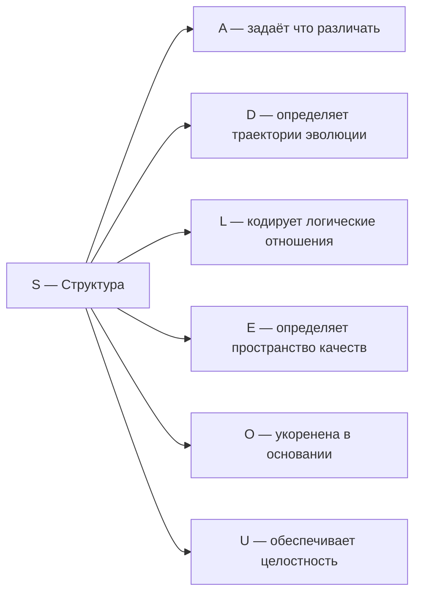
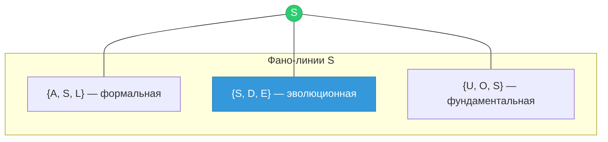

# Измерение II: Структура (S)

## О чём эта глава

Эта глава посвящена второму измерению Голонома — **Структуре**. Вы узнаете:

- Почему **сохранение формы** — необходимое условие существования чего-либо во времени;
- Как идея инвариантов развивалась от Галуа через Нётер к современной физике;
- Что такое гамильтониан и почему его спектр — это «отпечаток пальцев» системы;
- Как населённость $\gamma_{SS}$ определяет ригидность конфигурации;
- Почему Структура и Динамика — два лица одной медали;
- Какое место S занимает на Фано-плоскости.

:::info Для кого эта глава
Если вы впервые читаете об УГМ — начните с [обзора измерений](./dimensions). Если вы хотите понять, откуда берётся устойчивость формы, — вы по адресу. Предполагается знакомство с [Артикуляцией (A)](./dimension-a).
:::

## Функция

**Удерживать форму, сохранять конфигурацию.**

## Историческая предтеча {#историческая-предтеча}

Идея о том, что за изменчивостью мира стоят неизменные структуры, — одна из древнейших в мысли.

**Платон** (IV в. до н.э.) учил, что за изменчивыми вещами стоят неизменные **эйдосы** — формы. Стул сломается, но «идея стула» вечна. Хотя платоновский идеализм давно не принимают буквально, интуиция верна: за текучестью мира стоят инварианты.

**Эварист Галуа** (1832) — юный гений, погибший на дуэли в 20 лет, — совершил одно из величайших открытий в математике. Изучая, какие уравнения можно решить в радикалах, он обнаружил, что ответ зависит не от конкретных коэффициентов, а от **структуры симметрий** корней уравнения. Так родилась **теория групп** — математика инвариантов. Главный урок Галуа: важно не содержание (конкретные числа), а **структура** (как элементы связаны между собой).

**Клод Леви-Стросс** (1958) в «Структурной антропологии» показал, что за разнообразием мифов, ритуалов и систем родства скрываются **инвариантные структуры**. Миф о потопе выглядит по-разному в Месопотамии и у индейцев навахо, но **структура** мифа (угроза → испытание → возрождение) одна и та же. Структурализм — это поиск того, что остаётся неизменным при вариациях.

**Эмми Нётер** (1918) доказала одну из самых красивых теорем физики: **каждой непрерывной симметрии** физической системы соответствует **сохраняющаяся величина**. Вращательная симметрия → сохранение углового момента. Трансляционная симметрия → сохранение импульса. Временная симметрия → сохранение энергии. Теорема Нётер формализовала связь между структурой (симметрией) и инвариантами (законами сохранения).

В УГМ-теории все эти идеи сходятся в измерении **Структура ($S$)** — аспекте конфигурации $\Gamma$, ответственном за сохранение формы, удержание инвариантов и обеспечение идентичности во времени.

## Почему форма вообще сохраняется? {#почему-форма-сохраняется}

Вопрос кажется наивным, но он глубок. Почему вообще что-то остаётся неизменным? Почему электрон через миллиард лет — тот же электрон? Почему ДНК копируется с точностью до одной ошибки на миллиард пар оснований?

Ответ физики: потому что существуют **симметрии**. Если закон природы не меняется при некотором преобразовании (повороте, сдвиге, отражении), то существует величина, которая **не может** измениться. Это не постулат — это математическая теорема (Нётер). Сохранение — не свойство вещей, а **следствие симметрий** законов, которым вещи подчиняются.

В УГМ-теории этот принцип углублён: симметрии не «заданы извне», а **возникают** из структуры самой конфигурации $\Gamma$. Гамильтониан $H_\Omega$ определяется аксиомами [A1–A5](../../core/foundations/axiom-omega), и его симметрии — математическое следствие этих аксиом. Таким образом, устойчивость формы — не загадочное свойство реальности, а **выводимое** следствие фундаментальной структуры.

## Описание

Структура — это то, что остаётся неизменным при изменениях. Это инварианты, законы сохранения, топологические свойства.

:::info Онтологический статус
Структура — **аспект** конфигурации $\Gamma$, не отдельная сущность. "Голоном имеет структуру" означает: в матрице когерентности $\Gamma$ активна проекция на базисный вектор $|S\rangle$, и существует гамильтониан $H$ с нетривиальным спектром.
:::

:::warning Связь с автопоэзисом
При удалении измерения $S$ нарушается **(AP)** — нет идентичности, нет самотождественности. Без структуры нельзя определить, что такое "та же самая система". См. [доказательство](../../proofs/minimality/theorem-minimality-7#случай-n--1-удаление-структуры-s).
:::

**Структура обеспечивает идентичность Голонома во времени:** пока динамика ($D$) изменяет состояние, структура ($S$) определяет, *что именно* остаётся инвариантным — и тем самым позволяет говорить о "том же" Голономе в разные моменты времени.

## Интуитивное объяснение {#интуитивное-объяснение}

### Аналогия с каркасом здания

Представьте здание. Стены можно перекрасить, окна заменить, мебель переставить — и всё равно это «то же здание». Что делает его тем же? **Каркас** — несущая конструкция, которая сохраняется при всех косметических изменениях. Если убрать каркас — здание рухнет, и никакие стены не помогут.

Структура Голонома — это его «каркас»: то, что сохраняется при эволюции. Диагональные элементы $\gamma_{kk}$ могут флуктуировать, когерентности $\gamma_{ij}$ — осциллировать, но определённые комбинации остаются инвариантными. Именно эти инварианты задают **идентичность** системы.

### Аналогия с ДНК

При делении клетки всё её содержимое перестраивается: мембрана разрывается, белки распределяются, цитоплазма делится. Но **ДНК копируется точно** — это структура, которая сохраняется через поколения клеток. ДНК — инвариант клеточной динамики, «каркас» биологической идентичности.

Более того, ДНК — пример **информационной** структуры: важна не физическая молекула (атомы заменяются), а **последовательность** нуклеотидов. Аналогично, структура Голонома — не конкретные значения $\gamma_{ij}$, а **паттерн** их отношений.

### Аналогия со спектром звёзд

Астрономы определяют химический состав звезды, находящейся в миллионах световых лет, по её **спектру** — набору частот излучаемого света. Каждый химический элемент оставляет уникальный «спектральный отпечаток» — набор линий поглощения и излучения.

Точно так же гамильтониан $H$ Голонома имеет **спектр** — набор собственных значений $\{E_n\}$, однозначно характеризующий структуру системы. По спектру можно определить, какие симметрии есть у системы, какие переходы возможны, какова «архитектура» конфигурации — даже не зная деталей состояния.

## Математическое представление

### Гамильтониан — оператор структуры

Гамильтониан $H$ — эрмитов оператор, определяющий структуру системы:

$$
H^\dagger = H
$$

Собственные векторы гамильтониана — **стационарные состояния**:

$$
H|\psi_n\rangle = E_n|\psi_n\rangle
$$

Структура определяется:
- **Спектром** $\{E_n\}$ — набор собственных значений (энергий)
- **Собственными векторами** $\{|\psi_n\rangle\}$ — стационарные конфигурации

**Почему именно $H$?** Гамильтониан — единственный оператор, который одновременно определяет:
1. **Что сохраняется** — через коммутирующие наблюдаемые ($[A, H] = 0$ ⟹ $A$ сохраняется)
2. **Как система эволюционирует** — через $U(\tau) = e^{-iH_{eff}\tau}$

Это двойная роль делает $H$ идеальным математическим представлением структуры.

## Гамильтониан в базисе измерений

В базисе $\{|A\rangle, |S\rangle, |D\rangle, |L\rangle, |E\rangle, |O\rangle, |U\rangle\}$:

$$
H = \sum_{i} \omega_i |i\rangle\langle i| + \sum_{i \neq j} J_{ij} |i\rangle\langle j|
$$

где:
- $\omega_i$ — собственные частоты базисных состояний (диагональные элементы)
- $J_{ij}$ — коэффициенты связи между измерениями (недиагональные элементы)

Диагональные элементы $\omega_i$ задают «энергетический ландшафт» — какие состояния предпочтительнее. Недиагональные элементы $J_{ij}$ задают **связность** — насколько легко система переходит между измерениями.

## Населённость $\gamma_{SS}$ — мера ригидности {#населённость}

Диагональный элемент [матрицы когерентности](../../core/dynamics/coherence-matrix) $\gamma_{SS}$ — это **населённость** измерения Структуры. Она показывает, какая доля «ресурса» Голонома направлена на удержание формы.

$$
\gamma_{SS} = \langle S | \Gamma | S \rangle \in [0, 1], \quad \sum_{k} \gamma_{kk} = 1
$$

### Что означает значение $\gamma_{SS}$

| Значение $\gamma_{SS}$ | Интерпретация | Пример |
|-------------------------|---------------|--------|
| Высокое ($\gg 1/7$) | Ригидная система, сопротивляется изменениям | Кристалл, догма, навязчивость |
| Около $1/7$ | Сбалансированная устойчивость | Здоровая адаптивность: форма сохраняется, но допускает пластичность |
| Низкое ($\ll 1/7$) | Слабая структурированность, аморфность | Газ, поток сознания без фокуса, дезорганизация |
| $\to 0$ | Утрата всякой структуры | Тепловая смерть, полная деструктурация |

:::warning Структура ≠ ригидность
Высокая $\gamma_{SS}$ — не всегда хорошо. Чрезмерная структурированность (ригидность) препятствует адаптации. Живые системы поддерживают $\gamma_{SS}$ в диапазоне, позволяющем сочетать устойчивость с пластичностью. Это согласуется с [зоной Голдилокс](../../core/foundations/axiom-septicity) $P \in (2/7, 3/7]$ **[Т]** — сознание требует баланса между порядком и хаосом.
:::

## Стресс структуры $\sigma_S$ {#стресс-структуры}

[Стрессовая переменная](../../core/operators/lindblad-operators) $\sigma_S$ (T-92 **[Т]**) характеризует **дефицит** структурной устойчивости:

$$
\sigma_S = \mathrm{clamp}(1 - 7\gamma_{SS},\; 0,\; 1)
$$

| $\sigma_S$ | Состояние | Интерпретация |
|-------------|-----------|---------------|
| $0$ | $\gamma_{SS} \geq 1/7$ | Структура достаточна или избыточна |
| $0.5$ | $\gamma_{SS} \approx 1/14$ | Умеренный дефицит — система «расшатана» |
| $1$ | $\gamma_{SS} \to 0$ | Критический дефицит — форма утрачена |

:::info Стресс и переживание
На когнитивном уровне высокий $\sigma_S$ переживается как **дезориентация**, **потеря опоры**, **ощущение хаоса** — мир перестал быть предсказуемым, привычные структуры рухнули. Низкий $\sigma_S$ — как **уверенность**, **надёжность**, **понимание правил игры**. Стресс $\sigma_S$ влияет на [гедонический сигнал](../../consciousness/foundations/self-observation#мера-рефлексии-r) и мотивирует систему к поиску устойчивых паттернов.
:::

## Структура в динамике {#структура-в-динамике}

Населённость $\gamma_{SS}$ эволюционирует во [внутреннем времени](../../proofs/dynamics/emergent-time) $\tau$ согласно полному уравнению:

$$
\frac{d\gamma_{SS}}{d\tau} = -i[H_\Omega, \Gamma]_{SS} + \mathcal{D}_{SS}[\Gamma] + \mathcal{R}_{SS}
$$

где $\mathcal{D}$ — диссипативная часть ([операторы Линдблада](../../core/operators/lindblad-operators)), $\mathcal{R}$ — [оператор замены](../../core/operators/lindblad-operators).

### Процессы, изменяющие структуру

| Процесс | Что происходит с $\gamma_{SS}$ | Следствие |
|---------|-------------------------------|-----------|
| Кристаллизация | Резкий рост | Жидкость обретает дальний порядок — фазовый переход |
| Обучение навыку | Плавный рост | Повторение закрепляет нейронные паттерны (миелинизация) |
| Травма, шок | Резкое падение | Привычные структуры разрушены, мир стал непредсказуемым |
| Старение | Хроническое снижение | Клеточные механизмы репарации ослабевают |
| Революция | Падение + последующий рост | Старые институты разрушены, новые ещё не сформированы |

:::tip Структурная пластичность
Здоровая система не просто удерживает структуру — она способна **реструктурироваться**. Это означает: $\gamma_{SS}$ временно снижается (старая форма разрушается), а затем возрастает в новой конфигурации ($\gamma_{Sk}$ перераспределяются). Такая динамика — основа адаптации. Система, неспособная временно «отпустить» структуру, не может научиться ничему новому.
:::

## Инварианты и законы сохранения

Структура выражается через **сохраняющиеся величины**:

$$
\frac{d\langle A \rangle}{d\tau} = 0 \quad \Leftrightarrow \quad [A, H] = 0
$$

Оператор $A$ сохраняется тогда и только тогда, когда он коммутирует с гамильтонианом. Это **теорема Нётер** в квантовой форме.

### Теорема Нётер подробнее {#теорема-нётер}

Классическая теорема Нётер утверждает: если уравнения движения инвариантны относительно непрерывного преобразования, то существует сохраняющаяся величина. В квантовой механике это принимает элегантную форму:

| Симметрия | Преобразование | Сохраняющаяся величина |
|-----------|---------------|------------------------|
| Трансляция в пространстве | $x \to x + a$ | Импульс $p$ |
| Трансляция во времени | $t \to t + \Delta t$ | Энергия $E$ |
| Вращение | $\theta \to \theta + \alpha$ | Угловой момент $L$ |
| Фазовое преобразование | $\psi \to e^{i\alpha}\psi$ | Заряд $Q$ |

В контексте Голонома: симметрии гамильтониана $H_\Omega$ определяют, какие комбинации населённостей и когерентностей сохраняются при эволюции. Полный набор таких инвариантов — это и есть **структура** системы.

:::info Генератор симметрии = сохраняющаяся величина
В квантовой механике генератор симметрии (оператор, порождающий преобразование) и сохраняющаяся величина — это **один и тот же оператор**. Импульс $\hat{p}$ одновременно порождает трансляции и сохраняется при трансляционной симметрии. Это глубокое единство — «две стороны одной медали» — отражается в дуальности S ↔ D.
:::

## Структура и память {#структура-и-память}

Структура обеспечивает **память** системы — способность сохранять информацию. Без инвариантов всякая информация была бы мгновенно потеряна в потоке динамики.

| Тип памяти | Структурный инвариант | Время жизни |
|------------|----------------------|-------------|
| ДНК | Последовательность нуклеотидов | $\sim 10^9$ лет (вид) |
| Кристаллическая структура | Параметры решётки | $\sim 10^{10}$ лет |
| Долговременная память | Синаптические веса | $\sim 10^1$ лет |
| Кратковременная память | Паттерны активности | $\sim 10^1$ секунд |
| Квантовая когерентность | Фаза $\gamma_{ij}$ | $\sim 10^{-12}$ секунд (при $T$ комнатной) |

Чем выше $\gamma_{SS}$ относительно $\gamma_{DD}$, тем дольше живёт «память» системы. При $\gamma_{SS} \to 0$ система теряет способность хранить информацию и становится «беспамятной» — каждый момент начинает с чистого листа.

## Типы структур

| Тип | Математический инвариант | Пример |
|-----|--------------------------|--------|
| Топологическая | Гомотопические классы | Число дырок в торе |
| Алгебраическая | Группы симметрии | Кристаллографические группы |
| Метрическая | Расстояния, углы | Геометрия риманова многообразия |
| Информационная | Паттерны, корреляции | ДНК-последовательность |

## Дуальность S ↔ D {#дуальность-sd}

Структура и [Динамика](./dimension-d) — два аспекта одного объекта: **гамильтониана $H$**.

**Один оператор — два лица:**

| Аспект | Что описывает $H$ | Математическая операция |
|--------|-------------------|------------------------|
| **Структура (S)** | Спектр $\{E_n\}$ — стационарные состояния | Собственные значения: $H\|\psi_n\rangle = E_n\|\psi_n\rangle$ |
| **Динамика (D)** | Эволюция $U(\tau) = e^{-iH_{eff}\tau}$ | Экспоненциальное отображение |

Это не метафора — это точное математическое утверждение. Зная спектр $H$ (структуру), вы полностью определяете эволюцию (динамику), и наоборот: зная все возможные эволюции, можно восстановить спектр.

**Аналогия с музыкой:** Партитура (структура) и исполнение (динамика) — два аспекта одного произведения. Партитура — набор нот (спектр), исполнение — звучание во времени (эволюция). Одна партитура определяет все возможные исполнения; одно полное исполнение позволяет восстановить партитуру.

:::tip Следствие дуальности
Когерентность $\gamma_{SD}$ — **устойчивость при эволюции**. Высокая $\gamma_{SD}$ означает, что структура и динамика «согласованы»: система эволюционирует, не разрушая собственную форму. Низкая $\gamma_{SD}$ — признак нестабильности: динамика разрушает структуру (хаотический распад) или структура подавляет динамику (замороженность).
:::

## Примеры

| Уровень | Пример | Структурный инвариант |
|---------|--------|----------------------|
| Физический | Кристаллическая решётка | Трансляционная симметрия |
| Физический | Атомные орбитали | Квантовые числа $(n, l, m)$ |
| Биологический | ДНК | Последовательность нуклеотидов |
| Биологический | Белок | Третичная структура укладки |
| Когнитивный | Грамматика | Синтаксические правила |
| Когнитивный | Долговременная память | Устойчивые нейронные паттерны |
| Социальный | Конституция | Основные правовые нормы |
| Социальный | Язык | Фонологическая система |
| Математический | Группа симметрий | Таблица умножения группы |
| Математический | Топологическое пространство | Гомеоморфный тип |

## Структура на разных уровнях организации {#уровни-организации}

Структура проявляется на каждом уровне сложности, но форма инвариантов различна:

### Физический уровень
На уровне элементарных частиц структура — это **квантовые числа** (спин, заряд, цвет), которые сохраняются при взаимодействиях. Кристалл — пример макроскопической структуры: трансляционная симметрия решётки определяет электронные зоны и все физические свойства материала.

### Биологический уровень
Генетический код — информационная структура, сохраняющаяся через миллиарды лет эволюции. Триплетный код (3 нуклеотида → 1 аминокислота) — инвариант, общий для всех живых организмов на Земле. Морфогенез — процесс, в котором структура (план тела) реализуется через динамику (деление и дифференциация клеток).

### Когнитивный уровень
Грамматика — структура языка. Конкретные слова (динамика речи) меняются, но грамматические правила (структура) сохраняются на протяжении поколений. Ребёнок усваивает грамматику, не заучивая правила — он восстанавливает **структуру** из потока речи, что демонстрирует фундаментальность $S$.

### Социальный уровень
Институты — социальные структуры, сохраняющиеся при смене поколений. Конституция — структурный инвариант государства: правительства меняются, но основные правила остаются. Когда структура разрушается (революция, хаос), социальная система теряет идентичность — точно как Голоном при $\gamma_{SS} \to 0$.

## Связь с другими измерениями

### Развёрнутые связи {#развёрнутые-связи}

**S ↔ A (Структура ↔ Артикуляция):** Структура и различение взаимно необходимы. [Артикуляция](./dimension-a) создаёт элементы, из которых строится структура, а структура определяет, **какие** различения устойчивы. Грамматика языка (структура) определяет, какие фонемные различения (артикуляции) значимы: в русском «р» и «л» — разные фонемы, в японском — нет. Когерентность $\gamma_{SA}$ — **артикулированность структуры**: насколько чётко выражены границы формы.

**S ↔ D (Структура ↔ Динамика):** Центральная дуальность теории (подробнее [выше](#дуальность-sd)). $H$ одновременно определяет спектр (структуру) и эволюцию (динамику). Когерентность $\gamma_{SD}$ — **устойчивость при эволюции**: высокая означает, что система эволюционирует, не разрушая собственную форму. Аналогия: река течёт (D), но русло (S) сохраняется — это высокая $\gamma_{SD}$.

**S → L (Структура → Логика):** Структура задаёт **отношения** между элементами, а [Логика](./dimension-l) — **правила** этих отношений. Кристаллическая решётка (структура) определяет, какие химические связи (логические отношения) возможны. Когерентность $\gamma_{SL}$ — **логическая согласованность** формы: непротиворечивость структуры.

**S → E (Структура → Интериорность):** Структура определяет **пространство возможных переживаний**. Архитектура зрительной коры (структура) определяет, какие цвета, формы и движения могут быть восприняты (интериорность). Когерентность $\gamma_{SE}$ — **осознанность структуры**: переживает ли система свою собственную форму.

**S → O (Структура → Основание):** Структура укоренена в [Основании](./dimension-o) — источнике, из которого она черпает ресурсы для самоподдержания. Когерентность $\gamma_{SO}$ — **фундаментальность**: насколько структура связана с глубинным источником, а не является поверхностной надстройкой.

**S → U (Структура → Единство):** Структура — не хаотичный набор инвариантов, а **организованное целое**. Когерентность $\gamma_{SU}$ — **интегрированность структуры**: вклад формы в единство Голонома. На Фано-плоскости эта связь выражена линией $\{U, O, S\}$: структура возникает из основания через интеграцию.

## Когерентность с S

Элементы $\gamma_{Si}$ матрицы когерентности описывают связь структуры с другими измерениями:

| Когерентность | Интерпретация |
|---------------|---------------|
| $\gamma_{SA}$ | Артикулированность структуры (чёткость границ) |
| $\gamma_{SD}$ | Устойчивость при эволюции (стабильность) |
| $\gamma_{SL}$ | Логическая согласованность (непротиворечивость) |
| $\gamma_{SE}$ | Осознанность структуры (восприятие формы) |
| $\gamma_{SO}$ | Укоренённость в основании (фундаментальность) |
| $\gamma_{SU}$ | Интегрированность структуры (вклад в целое) |

## Структура и Фано-плоскость {#структура-и-фано}

В [октонионной структуре](./dimensions#октонионная-интерпретация) УГМ измерению $S$ соответствует мнимая единица $e_2 \in \mathrm{Im}(\mathbb{O})$. Структура лежит в секторе **3** триплетного разложения $7 = 1_O \oplus \mathbf{3} \oplus \bar{\mathbf{3}}$ (T-48a [Т]).

На [Фано-плоскости](../../physics/gauge-symmetry/fano-selection-rules) $\mathrm{PG}(2,2)$ структура $S$ ($= e_2$) принадлежит **трём Фано-линиям**:

| Фано-линия | Измерения | Интерпретация |
|------------|-----------|---------------|
| $\{A, S, L\}$ = $\{1, 2, 4\}$ | Артикуляция + Структура + Логика | **Формальная линия**: различение + форма + логика — триада рационального познания |
| $\{S, D, E\}$ = $\{2, 3, 5\}$ | Структура + Динамика + Интериорность | **Эволюционная линия**: форма + изменение + переживание — триада живого опыта |
| $\{U, O, S\}$ = $\{6, 7, 2\}$ | Единство + Основание + Структура | **Фундаментальная линия**: $S$ связана с $O$ через элемент $\bar{\mathbf{3}}$ ($U$) — форма через интеграцию |

:::tip Уникальность S на Фано-плоскости (T-177) [Т]
Структура — единственный элемент сектора **3**, связанный с Основанием ($O$) через элемент $\bar{\mathbf{3}}$ (Единство, $U$) на линии $\{U, O, S\}$. Для сравнения: $A$ связана с $O$ напрямую (линия $\{O, A, D\}$), а $D$ — через элемент **3** ($A$).

Это означает, что путь от Основания к Структуре проходит через **интеграцию** ($U$) — форма возникает не напрямую из источника, а через объединение.
:::

### Октонионный контекст {#октонионный-контекст}

:::note Октонионное соответствие [Т]
Измерению соответствует $e_2 \in \mathrm{Im}(\mathbb{O})$. Данное отождествление является **теоремой** [Т]: [цепочка мостов T15](/docs/core/foundations/axiom-septicity#мост-p1p2) (все шаги [Т]) выводит октонионную структуру из (AP)+(PH)+(QG)+(V); [T-177 [Т]](/docs/reference/status-registry) и [T-183 [Т]](/docs/reference/status-registry) доказывают комбинаторную и функциональную единственность каждой роли. Конкретное присвоение $S = e_2$ фиксировано с точностью до $G_2$-калибровочной эквивалентности ([T-42a [Т]](/docs/proofs/categorical/uniqueness-theorem)). Детали и $G_2$-оговорка: [Октонионная интерпретация](./dimensions#октонионная-интерпретация), [структурный вывод](../../proofs/minimality/theorem-octonionic-derivation).
:::

## Градации структуры {#градации-структуры}

Как и [Артикуляция](./dimension-a#градации-артикуляции), Структура — не бинарное свойство, а **непрерывная шкала**:

#### Уровень 0: Аморфность ($\gamma_{SS} \approx 0$)

Никакие инварианты не выделены — полный хаос. Физический аналог — идеальный газ при бесконечной температуре: каждый момент не связан с предыдущим, «памяти» нет. На когнитивном уровне — делирий, где ни одна мысль не удерживается дольше мгновения.

#### Уровень 1: Локальный порядок ($\gamma_{SS} \sim 0.05$)

Есть ближний порядок, но нет дальнего. Жидкость: соседние молекулы ещё скоррелированы, но на расстоянии нескольких молекулярных радиусов корреляции исчезают. Когнитивный аналог — дремота, где мысли связаны локально, но общая структура рассуждения отсутствует.

#### Уровень 2: Устойчивая форма ($\gamma_{SS} \sim 1/7$)

Сбалансированная структура: инварианты достаточно сильны, чтобы обеспечить идентичность, но достаточно гибки, чтобы допускать адаптацию. Это уровень здорового организма, функционирующего общества, работающей теории.

#### Уровень 3: Кристаллический порядок ($\gamma_{SS} > 1/7$)

Высокий дальний порядок. Кристалл, бюрократия, ригидный характер. Устойчивость гарантирована, но ценой гибкости. Новая информация с трудом интегрируется — структура «отвергает» то, что не вписывается в существующие рамки.

#### Уровень 4: Окаменение ($\gamma_{SS} \gg 1/7$)

Патологическая ригидность. Система не способна к адаптации: любое отклонение от формы подавляется. Фанатизм, окостенение институтов, «мёртвая буква закона». Структура из средства выживания превращается в его препятствие.

## Резюме

Структура — второе измерение Голонома, обеспечивающее его идентичность во времени. Без структуры нет инвариантов, нет памяти, нет самотождественности. Математически структура описывается гамильтонианом — оператором, чей спектр определяет «архитектуру» системы, а экспонента — её эволюцию. Дуальность S ↔ D (спектр ↔ эволюция) — одно из центральных соотношений теории. На Фано-плоскости S занимает уникальную позицию: связана с Основанием через Единство, что отражает путь «от источника через интеграцию к форме».

---

**Связанные документы:**
- [Артикуляция (A)](./dimension-a) — предыдущее измерение
- [Динамика (D)](./dimension-d) — следующее измерение
- [Матрица когерентности](../../core/dynamics/coherence-matrix) — полное описание Γ
- [Теорема о минимальности](../../proofs/minimality/theorem-minimality-7) — доказательство необходимости S
- [Эмерджентное время](../../proofs/dynamics/emergent-time) — τ из структуры Γ
