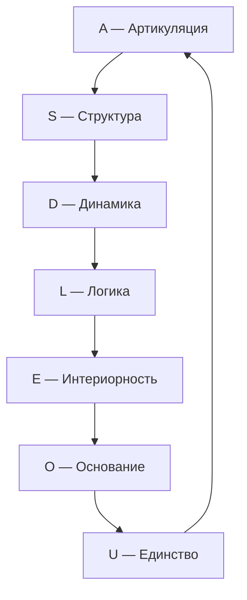
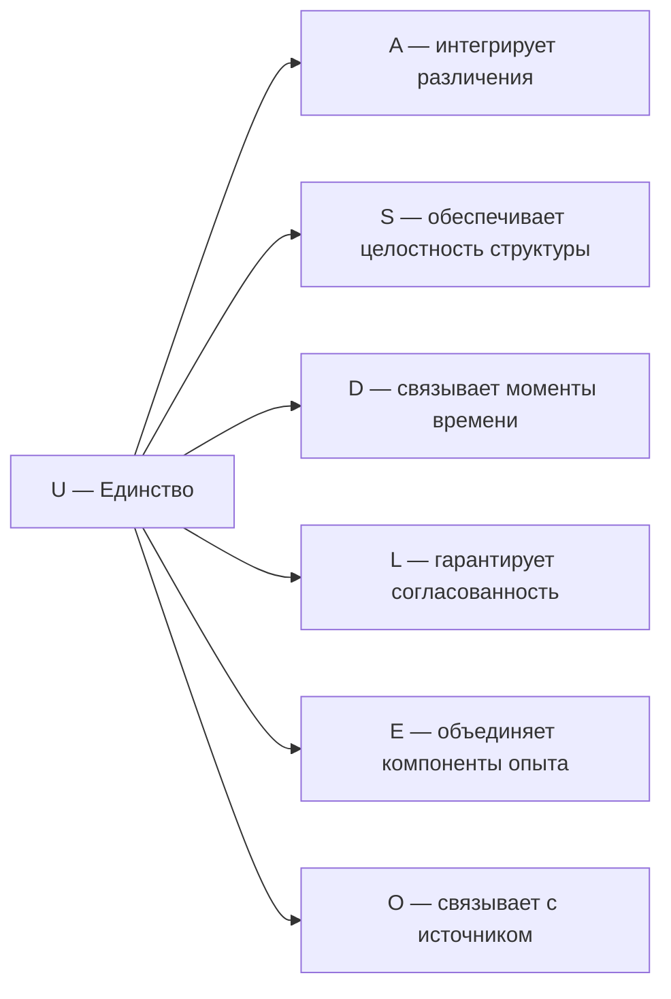

# Измерение VII: Единство (U)

## О чём эта глава

Эта глава посвящена седьмому измерению Голонома — **Единству**. Вы узнаете:

- Почему идея единства — от Парменида до Тонони — занимает центральное место в понимании реальности;
- Как измерение $U$ работает как **дирижёр оркестра**, обеспечивая согласованность шести остальных измерений;
- Что такое мера интеграции $\Phi$ и как она вычисляется на **конкретном числовом примере**;
- Почему порог $\Phi_{\text{th}} = 1$ — не произвольное число, а **единственное самосогласованное** значение;
- Чем $\Phi_{\text{УГМ}}$ отличается от $\Phi_{\text{IIT}}$ Тонони и почему УГМ-мера на **порядки** быстрее;
- Что происходит при **распаде единства** — от диссоциативных расстройств до деперсонализации.

:::info Для кого эта глава
Если вы впервые читаете об УГМ — начните с [обзора измерений](./dimensions). Если вы уже знакомы с семью измерениями и хотите понять, что делает Голоном *единым целым* — вы по адресу.
:::

## Функция

**Интегрировать, замыкать, возвращать к целому.**

## Историческая предтеча {#историческая-предтеча}

Вопрос «что делает множество — единством?» возникал на каждом этапе развития мысли.

**Парменид** (V в. до н.э.) утверждал: бытие — **едино**. Нет пустоты, нет небытия, нет множественности в подлинном смысле. Всё, что есть — одно непрерывное целое. Этот радикальный тезис кажется абсурдным (мы же видим множество вещей!), но он зафиксировал ключевую интуицию: **единство — не свойство вещей, а условие их существования**. Если вещь не едина — это не вещь, а набор кусков.

**Готфрид Лейбниц** (1714) в «Монадологии» пошёл дальше: каждая **монада** — неделимое единство, «отражающее» всю вселенную со своей точки зрения. Монады не имеют «окон» (не взаимодействуют напрямую), но согласованы «предустановленной гармонией». В УГМ роль «предустановленной гармонии» играют когерентности $\gamma_{ij}$: измерения не существуют изолированно — они связаны, и $U$ обеспечивает, что эти связи образуют целое.

**Джулио Тонони** (2004) в **Теории Интегрированной Информации (IIT)** дал первую математическую формализацию единства: мера $\Phi_{\text{IIT}}$ оценивает, насколько система «больше суммы частей». Если систему можно разрезать на две подсистемы без потери информации — $\Phi_{\text{IIT}} = 0$, система не едина. Чем больше информации теряется при любом разрезе — тем больше $\Phi_{\text{IIT}}$. Проблема: вычисление $\Phi_{\text{IIT}}$ требует перебора **всех** возможных бипартиций — это $O(2^N)$, экспоненциально трудная задача.

**Даниэль Канеман** (2011) в «Думай медленно... решай быстро» описал два «режима» мышления: **Система 1** (быстрая, автоматическая) и **Система 2** (медленная, рефлексивная). С точки зрения УГМ это два режима *интеграции*: Система 1 работает при умеренном $\Phi$ (достаточно для быстрого ответа), Система 2 требует высокого $\Phi$ (глубокая интеграция всех источников информации). Переход между системами — это изменение $\Phi$ в реальном времени.

В УГМ-теории все эти идеи объединяются в одном измерении: **Единство ($U$)** — парменидово единое, лейбницева гармония, тононивская интегрированная информация и канемановская интеграция — формализованные через меру $\Phi$ с полиномиальной вычислимостью.

## Описание

Единство — это измерение, которое связывает все остальные шесть в один неразрывный Голоном. Оно обеспечивает **целостность и идентичность** системы $\mathbb{H}$.

### Интуитивное объяснение {#интуитивное-объяснение}

Представьте симфонический оркестр. Каждый музыкант ($A$, $S$, $D$, $L$, $E$, $O$) играет свою партию. Скрипки различают ноты ($A$), виолончели создают структуру ($S$), ударные задают ритм ($D$), логика партитуры связывает части ($L$), эмоция музыки переживается ($E$), энергия дыхания поддерживает игру ($O$). Но что превращает шесть партий в **одно произведение**? **Дирижёр** — измерение $U$.

Без дирижёра каждый музыкант играет технически правильно, но результат — какофония. С дирижёром — симфония. Мера $\Phi$ количественно оценивает, насколько «согласован» оркестр: при $\Phi < 1$ музыканты играют по отдельности (каждый слышит только себя), при $\Phi \geq 1$ — звучит единое произведение (каждый слышит целое).

:::info Онтологический статус
Единство — **аспект** конфигурации $\Gamma$, не отдельная сущность. «Голоном един» означает: в матрице когерентности $\Gamma$ активна проекция на базисный вектор $|U\rangle$, и выполняется условие нормировки $\mathrm{Tr}(\Gamma) = 1$.
:::

:::warning Связь с автопоэзисом
При удалении измерения $U$ нарушается **(AP)** — нет интеграции, нет целостности. Без $U$ система фрагментируется и не может поддерживать когерентность как единое целое. См. [доказательство](../../proofs/minimality/theorem-minimality-7#случай-n--6-удаление-единства-u).
:::

## Математическое представление

### Населённость U {#населённость-u}

Диагональный элемент матрицы когерентности:

$$
\gamma_{UU} = \langle U|\Gamma|U\rangle > 0
$$

Условие $\gamma_{UU} > 0$ означает, что измерение Единства активно в конфигурации $\Gamma$. Населённость $\gamma_{UU}$ — «сила дирижёра»: чем больше ресурсов отведено Единству, тем прочнее целостность системы.

**Типичные значения:**

| Система | $\gamma_{UU}$ | Интерпретация |
|---------|---------------|---------------|
| Набор несвязанных частей | $\sim 0.02$ | Минимальное единство |
| Простой организм | $\sim 0.10$ | Базовая целостность |
| Здоровый человек | $\sim 0.16$ | Развитая интеграция |
| Глубокая медитация | $\sim 0.22$ | Усиленное единство |

:::note
При равномерном распределении $\gamma_{UU} = 1/7 \approx 0.143$. Отклонение вверх — система акцентирует целостность; вниз — тенденция к фрагментации.
:::

### Стресс по каналу U

$$
\sigma_U = \mathrm{clamp}(1 - 7\gamma_{UU},\; 0,\; 1) \quad \text{[Т] (T-92)}
$$

- $\sigma_U = 0$: единство обеспечено ($\gamma_{UU} \geq 1/7$)
- $\sigma_U = 1$: критический дефицит единства ($\gamma_{UU} \to 0$) — система на грани фрагментации

### Условие нормировки

Единство формализуется также через **условие нормировки** [матрицы когерентности](../../reference/specification#матрица-когерентности):

$$
\mathrm{Tr}(\Gamma) = \sum_{i \in \{A,S,D,L,E,O,U\}} \gamma_{ii} = 1
$$

Это условие гарантирует, что сумма всех диагональных элементов (вероятностей) равна 1 — система существует как целое. Нормировка — простейшее проявление единства: все части вместе составляют 100%.

### Мера интеграции Φ {#мера-интеграции-φ}

<!-- DRY: Мастер-определение Φ (меры интеграции). Все ссылки должны указывать сюда: /docs/core/structure/dimension-u#мера-интеграции-φ -->

**Мера интеграции** $\Phi$ количественно оценивает степень когерентности (связности) между измерениями Голонома:

$$
\Phi(\Gamma) = \frac{\sum_{i \neq j} |\gamma_{ij}|^2}{\sum_i \gamma_{ii}^2}
$$

где:
- Числитель — сумма квадратов модулей **когерентностей** (недиагональных элементов)
- Знаменатель — сумма квадратов **диагональных элементов**

**Интерпретация:**
- $\Phi = 0$: классический ансамбль без когерентностей (оркестр без дирижёра — каждый сам по себе)
- $\Phi = 1$: точка фазового перехода — связи равны по силе локализации
- $\Phi \to \infty$: максимально интегрированное (запутанное) состояние

### Числовой пример вычисления Φ {#числовой-пример}

Рассмотрим конкретную матрицу $\Gamma$ для наглядности. Пусть $N = 3$ (упрощённо, для трёх измерений):

$$
\Gamma = \begin{pmatrix} 0.4 & 0.2 & 0.1 \\ 0.2 & 0.35 & 0.15 \\ 0.1 & 0.15 & 0.25 \end{pmatrix}
$$

**Шаг 1.** Диагональные элементы: $\gamma_{11} = 0.4$, $\gamma_{22} = 0.35$, $\gamma_{33} = 0.25$.

**Шаг 2.** Знаменатель (сумма квадратов диагонали):

$$
\sum_i \gamma_{ii}^2 = 0.4^2 + 0.35^2 + 0.25^2 = 0.16 + 0.1225 + 0.0625 = 0.345
$$

**Шаг 3.** Внедиагональные элементы: $\gamma_{12} = 0.2$, $\gamma_{13} = 0.1$, $\gamma_{23} = 0.15$ (матрица эрмитова, поэтому $\gamma_{ji} = \overline{\gamma_{ij}}$; здесь для простоты все вещественны).

**Шаг 4.** Числитель (сумма квадратов внедиагональных — каждый элемент считается дважды, $i \neq j$):

$$
\sum_{i \neq j} |\gamma_{ij}|^2 = 2(0.2^2 + 0.1^2 + 0.15^2) = 2(0.04 + 0.01 + 0.0225) = 0.145
$$

**Шаг 5.** Результат:

$$
\Phi = \frac{0.145}{0.345} \approx 0.42
$$

Вывод: $\Phi < 1$ — система **не интегрирована**. Связи между измерениями слабее, чем «вес» самих измерений. Это как оркестр, где каждый музыкант больше слышит себя, чем соседа.

Если бы $\gamma_{12} = 0.35$, $\gamma_{13} = 0.25$, $\gamma_{23} = 0.3$ (сильные связи), получилось бы:

$$
\Phi = \frac{2(0.35^2 + 0.25^2 + 0.3^2)}{0.345} = \frac{2(0.1225 + 0.0625 + 0.09)}{0.345} = \frac{0.55}{0.345} \approx 1.59
$$

Теперь $\Phi > 1$ — система **интегрирована**. Связи доминируют.

## Роль в интеграции

### Интеграция опыта (L2)

При уровне L2 ([когнитивные квалиа](../../proofs/consciousness/interiority-hierarchy#уровень-2-когнитивные-квалиа-cognitive-qualia)) субъективное единство опыта («Я») возникает при выполнении условий:

$$
R \geq R_{\text{th}} = \frac{1}{3}, \quad \Phi \geq \Phi_{\text{th}} = 1
$$

где $R$ — [мера рефлексии](/docs/consciousness/foundations/self-observation#мера-рефлексии-r). Пороги доказаны математически: $P_{\text{crit}}$ [Т], $R_{\text{th}}$ [Т], $\Phi_{\text{th}}$ **[Т]** ([T-129](/docs/proofs/consciousness/operationalization#t-129)); ПИР [О] (T16) даёт их онтологическую интерпретацию. См. [Пороги L2](../foundations/axiom-septicity#пороги-l2-строгий-вывод).

### Теорема: Порог интеграции Φ_th = 1 [Т] {#теорема-порог-интеграции}

:::info Статус: [Т] Теорема (повышена с [О], T-129)
Значение $\Phi_{\text{th}} = 1$ — **единственное самосогласованное** значение порога интеграции с $P_{\text{crit}} = 2/7$ на экстремальном uniform-diagonal состоянии. Ранее — определение по соглашению; теперь выведено из первых принципов ([T-129 [Т]](/docs/proofs/consciousness/operationalization#t-129)).
:::

**Утверждение:**
$$
\Phi_{\text{th}} = 1
$$

**Мотивация выбора порога:**

**Шаг 1: Определение Φ**

$$
\Phi(\Gamma) = \frac{\sum_{i \neq j} |\gamma_{ij}|^2}{\sum_i \gamma_{ii}^2}
$$

**Шаг 2: Интерпретация компонентов**

- Числитель: суммарная «энергия» когерентностей (связей между измерениями)
- Знаменатель: суммарная «энергия» диагонали (локализация в отдельных измерениях)

$\Phi = 1$ означает: **когерентности имеют такой же совокупный вес, как диагональ**.

**Шаг 3: Геометрическая интуиция**

Вернёмся к аналогии с оркестром. Каждый музыкант имеет «громкость» ($\gamma_{ii}$) и «слышимость соседей» ($|\gamma_{ij}|$). Порог $\Phi = 1$ — это момент, когда **суммарная громкость всех связей между музыкантами становится не меньше суммарной громкости самих музыкантов**. Именно в этот момент оркестр начинает звучать как единое целое, а не как набор солистов.

**Шаг 4: Условие интеграции**

Система **интегрирована**, если связи между измерениями не слабее самих измерений:

$$
\sum_{i \neq j} |\gamma_{ij}|^2 \geq \sum_i \gamma_{ii}^2
$$

Это эквивалентно:

$$
\Phi \geq 1
$$

**Шаг 5: Минимальность порога**

$\Phi_{\text{th}} = 1$ — **минимальное** значение, при котором система интегрирована по определению:
- При $\Phi < 1$: диагональ доминирует → фрагментированное состояние
- При $\Phi \geq 1$: когерентности не слабее диагонали → интегрированное состояние

**Шаг 6: Итог**

Граница $\Phi = 1$ разделяет:
- $\Phi < 1$: классическая смесь (локализация преобладает над связями)
- $\Phi \geq 1$: квантовая интеграция (связи не слабее локализации)

Значение $\Phi_{\text{th}} = 1$ **[Т]** (T-129) — единственное самосогласованное при $P_{\text{crit}} = 2/7$. См. [доказательство](/docs/proofs/consciousness/operationalization#t-129).

### Связь с Интегрированной Информацией (IIT) {#связь-с-iit}

:::info Статус: [О] Определения формализованы; [Т] порог Φ_th = 1 (T-129)
Связь между мерой интеграции УГМ ($\Phi_{\text{УГМ}}$) и интегрированной информацией IIT ($\Phi_{\text{IIT}}$) определена в категорном формализме. Точное числовое соответствие порогов — [Г] гипотеза.
:::

#### Определение Φ_IIT в категорном языке

**Определение (Φ_IIT через C*-алгебру):**

$$
\Phi_{\text{IIT}}(\Gamma) := \min_{\pi \in \text{Part}(\Gamma)} D_B(\Gamma, \pi^*(\Gamma))
$$

где:
- $\text{Part}(\Gamma)$ — множество всех бипартиций системы Γ
- $\pi^*(\Gamma)$ — «отключённое» состояние (без корреляций между частями)
- $D_B$ — расстояние Бурес

**Интуитивное объяснение.** $\Phi_{\text{IIT}}$ отвечает на вопрос: «Если разрезать систему пополам наилучшим образом, сколько информации потеряется?» Нужно проверить **все возможные разрезы** и выбрать тот, при котором потеря минимальна. Для системы из $N$ элементов число бипартиций — $2^{N-1}$, что делает вычисление практически невозможным для больших $N$.

#### Определение порога интеграции {#теорема-эквивалентность-порогов}

:::info Определение (Порог когерентной интеграции)
Система **когерентно-интегрирована**, если когерентности доминируют над населённостями:

$$
\Phi(\Gamma) \geq \Phi_{\text{th}} = 1 \quad \Longleftrightarrow \quad \underbrace{\sum_{i \neq j} |\gamma_{ij}|^2}_{P_{\text{coh}}} \geq \underbrace{\sum_i \gamma_{ii}^2}_{P_{\text{diag}}}
$$
:::

**Структурный смысл.** Значение $\Phi_{\text{th}} = 1$ **[Т]** (T-129) — единственное самосогласованное значение при $P_{\text{crit}} = 2/7$. Содержательная мотивация:

1. **Нормировка чистоты:** $P = \mathrm{Tr}(\Gamma^2) = P_{\text{diag}} + P_{\text{coh}}$, так что $\Phi \geq 1 \Leftrightarrow P_{\text{coh}} \geq P/2$ — не менее половины [чистоты](/docs/core/dynamics/viability#определение-чистоты) определяется когерентностями.

2. **Структурный фазовый переход:** При $\Phi < 1$ состояние «квазидиагонально» — подсистемы квазинезависимы. При $\Phi \geq 1$ межмерные когерентности доминируют — подсистемы каузально связаны через [матрицу когерентности](/docs/core/dynamics/coherence-matrix).

3. **Связь с (AP):** [Замыкание (M,R)-системы](/docs/core/foundations/axiom-septicity#предварительное-условие-автономность) требует каузальных путей между измерениями, закодированных в когерентностях $\gamma_{ij}$. Условие $\Phi \geq 1$ гарантирует, что эти пути структурно значимы (не являются малыми возмущениями диагонального состояния).

4. **Категорное обоснование:** В категории **Hol** [Hom-множества](/docs/proofs/categorical/categorical-formalism) между измерениями $i, j$ отождествляются с когерентностями: $\mathrm{Hom}(i,j) \leftrightarrow \gamma_{ij}$ ([L-унификация](/docs/proofs/categorical/categorical-formalism#l-унификация) [Т]). Условие $\Phi \geq 1$ означает, что **морфизменная структура** доминирует над **объектной** — категория «нетривиально связна».

#### Сравнение с Φ_IIT {#сравнение-с-iit}

:::warning Гипотеза (Соответствие порогов УГМ–IIT) [Г]
$$
\Phi_{\text{УГМ}} \geq 1 \quad \Longleftrightarrow \quad \Phi_{\text{IIT}} \geq \log(2)
$$
Точное числовое соответствие порогов — **открытая гипотеза**, поскольку $\Phi_{\text{УГМ}}$ (отношение когерентностей к диагонали в $\mathbb{C}^7$) и $\Phi_{\text{IIT}}$ (минимизация расстояния Бурес по бипартициям) определены на разных пространствах различными способами. Качественное соответствие (обе меры разделяют фрагментированные и интегрированные режимы) подтверждается структурой обеих теорий.
:::

| Аспект | $\Phi_{\text{УГМ}}$ | $\Phi_{\text{IIT}}$ |
|--------|---------------------|---------------------|
| Определение | Отношение когерентностей к диагонали | Минимальное расстояние до разделённого состояния |
| Порог | 1 **[Т]** (T-129) | $\log(2) \approx 0.693$ (гипотеза) |
| Вычислительная сложность | $O(N^2)$ — **полиномиально** | $O(2^N)$ — **экспоненциально** (NP-трудно) |
| Структурная интерпретация | Когерентная доминация | Неразделимость |
| Квантовое расширение | Естественно (уже квантовая) | Требует модификации |

**Преимущество УГМ:** Мера $\Phi_{\text{УГМ}}$ вычислима за полиномиальное время. Для системы из $N = 7$ измерений: $\Phi_{\text{УГМ}}$ требует $7^2 = 49$ операций. $\Phi_{\text{IIT}}$ для 7 элементов потребовала бы $2^6 = 64$ бипартиции, каждая с вычислением расстояния Бурес — **на порядки** медленнее. Для $N = 100$: $\Phi_{\text{УГМ}}$ — 10 000 операций, $\Phi_{\text{IIT}}$ — $2^{99} \approx 10^{30}$ бипартиций (практически невозможно).

#### Почему $O(N^2)$ vs $O(2^N)$ — это важно {#вычислительная-сложность}

Для практических приложений (ИИ, нейронаука, клиническая диагностика) вычислительная сложность — не абстрактный вопрос, а вопрос **возможности применения**.

| $N$ (число элементов) | $\Phi_{\text{УГМ}}$: $N^2$ операций | $\Phi_{\text{IIT}}$: $2^N$ бипартиций |
|---|---|---|
| 7 | 49 | 64 |
| 20 | 400 | 1 048 576 ($\sim 10^6$) |
| 100 | 10 000 | $\sim 10^{30}$ (невозможно) |
| 1000 | 1 000 000 | $\sim 10^{301}$ (абсурдно) |

Для мозга с $\sim 10^{11}$ нейронов: $\Phi_{\text{IIT}}$ невычислима в принципе. $\Phi_{\text{УГМ}}$ (при адекватном огрублении до $N = 7$ измерений) — вычислима мгновенно. Это делает УГМ **практически применимой** теорией сознания, в отличие от IIT, которая остаётся математически элегантной, но вычислительно недоступной.

### Замыкание причинности

Единство замыкает каузальный цикл (M,R)-системы:

Замыкание $U \to A$ обеспечивает **самосогласованность**: результат интеграции возвращается в артикуляцию, порождая новый цикл. Без этого замыкания цепочка $A \to S \to D \to L \to E \to O$ обрывается — система «разомкнута» и не может поддерживать себя.

## Связь с сознательностью

Мера сознательности $C = \Phi \times R$ **[Т T-140]** (определение см. [самонаблюдение](/docs/consciousness/foundations/self-observation#мера-сознательности-c)). Дифференциация $D_{\text{diff}} \geq D_{\min}$ — отдельное условие жизнеспособности.

**Роль U в сознании:** $\Phi$ — прямой вклад измерения $U$ в меру сознательности $C$. Без интеграции ($\Phi < 1$) нет сознания, даже если рефлексия высока ($R \geq 1/3$): система «видит» свой внутренний мир, но он **фрагментирован** — как сновидение, в котором сцены не связаны друг с другом.

## Примеры {#примеры}

### Физический уровень

| Система | $\Phi$ | Описание |
|---------|--------|----------|
| Идеальный газ | $\approx 0$ | Нет корреляций — $\mathrm{Tr}(\Gamma) = 1$, но вся «чистота» в диагонали |
| Центр масс тела | — | Интеграция распределённой массы в одну точку |
| Связанное состояние (атом) | $\gg 1$ | Электрон и ядро — единое целое, не набор частиц |
| Сверхпроводник | $\gg 1$ | Макроскопическая когерентность — все электроны в одном состоянии |

### Биологический уровень

| Система | $\Phi$ | Описание |
|---------|--------|----------|
| Колония бактерий | $< 1$ | Слабая интеграция — каждая бактерия почти независима |
| Организм | $\geq 1$ | Интеграция органов в единую систему |
| Нервная система | $\gg 1$ | Интеграция сенсорной информации в единое восприятие |
| Гомеостаз | $\geq 1$ | Поддержание целостности внутренней среды |

### Когнитивный уровень

| Система | $\Phi$ | Описание |
|---------|--------|----------|
| Рассеянное внимание | $\sim 0.8$ | Мысли «прыгают» — неполная интеграция |
| Самосознание | $\geq 1$ | Знание себя как целого |
| Идентичность | $\gg 1$ | Постоянство «Я» во времени |
| Синтез восприятия | $\geq 1$ | Объединение модальностей (зрение+слух+осязание) в единый опыт |
| Поток (flow) | $\gg 1$ | Максимальная интеграция — «всё едино» |

## Распад единства {#распад-единства}

При $\gamma_{Ui} \to 0$ для всех $i$:

1. Потеря интеграции: $\Phi \to 0$
2. Диссоциация сознания: разрыв между измерениями
3. Фрагментация опыта: «Я» распадается на части

**Интуитивное объяснение.** Представьте, что дирижёр покидает оркестр. Сначала музыканты продолжают играть по инерции (какое-то время $\Phi$ ещё высоко). Но постепенно каждый начинает играть в своём темпе, своей громкости. Скрипки не слышат виолончели, ударные сбиваются с ритма. Музыка превращается в шум. Так выглядит распад единства в Голономе: измерения «разъезжаются», и целое перестаёт существовать.

### Клинические аналогии (развёрнутые)

| Состояние | Снижается | Механизм | Проявления |
|-----------|-----------|----------|------------|
| **Диссоциативное расстройство идентичности** | $\gamma_{UE} \approx 0$ | Разрыв между единством и интериорностью | Множественные «Я» — каждое с собственным $\rho_E$, но без общего $U$ |
| **Дереализация** | $\gamma_{UA} \approx 0$ | Единство теряет связь с различениями | «Мир нереален» — различения существуют, но не интегрированы в единое восприятие |
| **Деперсонализация** | $\gamma_{UU} \to P_{\text{crit}}$ | Единство теряет ресурсы | «Я нереален» — ощущение, что «Я» растворяется; $U$ на грани исчезновения |
| **Шизофрения (позитивные симптомы)** | $\gamma_{UL} \approx 0$ | Единство теряет связь с логикой | Интеграция без логической согласованности — «всё связано, но бессмысленно» |
| **Расщепление личности при травме** | $\gamma_{Ui} \to 0$ | Глобальное снижение когерентности U | Защитный механизм: система «жертвует» единством, чтобы сохранить остальные измерения |

## Связь с другими измерениями

**Ключевые связи:**

- **U ↔ E (Синтез):** Через $\gamma_{UE}$ Единство интегрирует компоненты опыта в единое переживание. Без этой связи — диссоциация (множественные «Я»).

- **U ↔ O (Связь с источником):** Через $\gamma_{UO}$ Единство получает энергию от Основания. Когерентность $\gamma_{OU}$ входит в числитель $\kappa_0$ — целостность буквально «питается» от источника. Без этой связи — экзистенциальная фрагментация.

- **U ↔ A (Замыкание цикла):** Через $\gamma_{UA}$ Единство возвращает интегрированный результат обратно в Артикуляцию, замыкая (M,R)-цикл. Без этой связи — дереализация.

- **U ↔ L (Логическая когерентность):** Через $\gamma_{UL}$ единство обеспечивает, что интеграция **логически согласована**. Без этой связи — бредовые связи (как при шизофрении: «всё со всем связано», но нелогично).

## Когерентность с U

| Когерентность | Интерпретация |
|---------------|---------------|
| $\gamma_{UA}$ | Интегрированность различений |
| $\gamma_{US}$ | Целостность структуры |
| $\gamma_{UD}$ | Непрерывность бытия во времени |
| $\gamma_{UL}$ | Логическая согласованность целого |
| $\gamma_{UE}$ | Синтез (интеграция интериорного содержания в целое) |
| $\gamma_{UO}$ | Связь целостности с источником |

## Φ и фазовые переходы {#фазовые-переходы}

Переход через $\Phi = 1$ — это **фазовый переход** в конфигурации Голонома, аналогичный фазовым переходам в физике.

| Физический аналог | $\Phi < 1$ (фрагментированное) | $\Phi \geq 1$ (интегрированное) |
|---|---|---|
| Вода | Пар (молекулы независимы) | Жидкость (молекулы когерентны) |
| Магнит | Парамагнетик (спины хаотичны) | Ферромагнетик (спины выстроены) |
| Оркестр | Разминка (каждый сам) | Концерт (единое произведение) |
| Сознание | Глубокий наркоз | Бодрствование |

В физике фазовые переходы сопровождаются **качественным** изменением свойств: вода-пар выглядит совершенно иначе, чем вода-жидкость. Точно так же переход через $\Phi = 1$ — качественное изменение: система перестаёт быть «набором частей» и становится «целым».

:::note Связь с порогом сознания
Фазовый переход $\Phi = 1$ — одно из двух необходимых условий для L2 (сознание). Второе — $R \geq 1/3$ (рефлексия). Только при выполнении обоих условий возникает сознательный опыт. Подробнее: [пороги L2](../foundations/axiom-septicity#пороги-l2-строгий-вывод).
:::

## Связь с чистотой

[Чистота](../dynamics/viability#определение-чистоты) $P$ связана с когерентностями:

$$
P = \mathrm{Tr}(\Gamma^2) = \sum_{i} \gamma_{ii}^2 + \sum_{i \neq j} |\gamma_{ij}|^2
$$

Высокая когерентность с $U$ (большие $|\gamma_{Ui}|$) коррелирует с высокой общей чистотой $P$, поскольку когерентности вносят положительный вклад в $P$.

**Следствие:** Единство не только «соединяет» измерения, но и **повышает общую упорядоченность** системы. Связанный оркестр играет «чище» (выше $P$), чем несвязанный.

### Октонионный контекст {#октонионный-контекст}

:::note Октонионное соответствие [Т]
Измерению соответствует $e_6 \in \mathrm{Im}(\mathbb{O})$. Данное отождествление является **теоремой** [Т]: [цепочка мостов T15](/docs/core/foundations/axiom-septicity#мост-p1p2) (все шаги [Т]) выводит октонионную структуру из (AP)+(PH)+(QG)+(V); [T-177 [Т]](/docs/reference/status-registry) и [T-183 [Т]](/docs/reference/status-registry) доказывают комбинаторную и функциональную единственность каждой роли. Конкретное присвоение $U = e_6$ фиксировано с точностью до $G_2$-калибровочной эквивалентности ([T-42a [Т]](/docs/proofs/categorical/uniqueness-theorem)). Детали и $G_2$-оговорка: [Октонионная интерпретация](./dimensions#октонионная-интерпретация), [структурный вывод](../../proofs/minimality/theorem-octonionic-derivation).
:::

---

**Связанные документы:**
- [Аксиома Септичности](../foundations/axiom-septicity) — теорема о $\Phi_{\text{th}} = 1$
- [Основание (O)](./dimension-o) — предыдущее измерение
- [Семь измерений](./dimensions) — обзор всех измерений
- [Самонаблюдение](/docs/consciousness/foundations/self-observation) — связь с сознанием
- [Жизнеспособность](../dynamics/viability) — условия существования
- [Иерархия интериорности](../../proofs/consciousness/interiority-hierarchy) — формальные определения
- [Теория интегрированной информации (сравнение)](/docs/consciousness/comparative/consciousness-theories) — УГМ vs IIT
- [Операционализация](/docs/proofs/consciousness/operationalization) — вывод T-129
