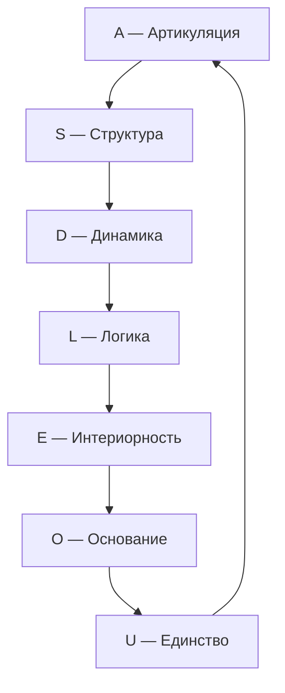
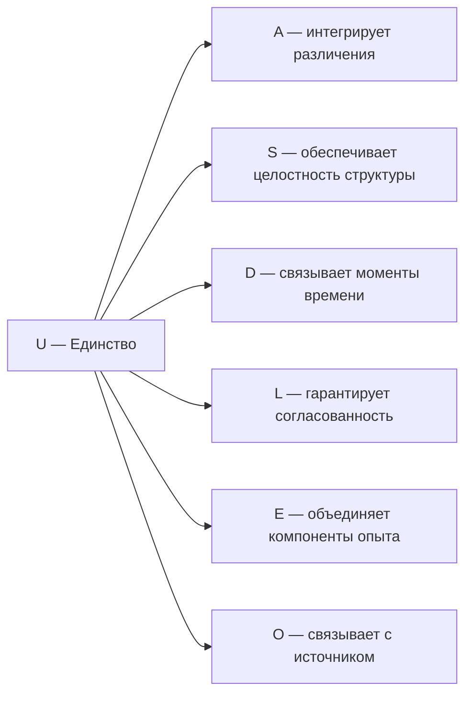

# Измерение VII: Единство (U)

## О чём эта глава

Эта глава посвящена седьмому измерению Голонома — **Единству**. Вы узнаете:

- Почему идея единства — от Парменида до Тонони — занимает центральное место в понимании реальности;
- Как измерение $U$ работает как **дирижёр оркестра**, обеспечивая согласованность шести остальных измерений;
- Что такое мера интеграции $\Phi$ и как она вычисляется на **конкретном числовом примере**;
- Почему порог $\Phi_{\text{th}} = 1$ — не произвольное число, а **единственное самосогласованное** значение;
- Чем $\Phi_{\text{УГМ}}$ отличается от $\Phi_{\text{IIT}}$ Тонони и почему УГМ-мера на **порядки** быстрее;
- Что происходит при **распаде единства** — от диссоциативных расстройств до деперсонализации.

:::info Для кого эта глава
Если вы впервые читаете об УГМ — начните с [обзора измерений](./dimensions). Если вы уже знакомы с семью измерениями и хотите понять, что делает Голоном *единым целым* — вы по адресу.
:::

## Функция

**Интегрировать, замыкать, возвращать к целому.**

## Историческая предтеча {#историческая-предтеча}

Вопрос «что делает множество — единством?» возникал на каждом этапе развития мысли.

**Парменид** (V в. до н.э.) утверждал: бытие — **едино**. Нет пустоты, нет небытия, нет множественности в подлинном смысле. Всё, что есть — одно непрерывное целое. Этот радикальный тезис кажется абсурдным (мы же видим множество вещей!), но он зафиксировал ключевую интуицию: **единство — не свойство вещей, а условие их существования**. Если вещь не едина — это не вещь, а набор кусков.

**Готфрид Лейбниц** (1714) в «Монадологии» пошёл дальше: каждая **монада** — неделимое единство, «отражающее» всю вселенную со своей точки зрения. Монады не имеют «окон» (не взаимодействуют напрямую), но согласованы «предустановленной гармонией». В УГМ роль «предустановленной гармонии» играют когерентности $\gamma_{ij}$: измерения не существуют изолированно — они связаны, и $U$ обеспечивает, что эти связи образуют целое.

**Джулио Тонони** (2004) в **Теории Интегрированной Информации (IIT)** дал первую математическую формализацию единства: мера $\Phi_{\text{IIT}}$ оценивает, насколько система «больше суммы частей». Если систему можно разрезать на две подсистемы без потери информации — $\Phi_{\text{IIT}} = 0$, система не едина. Чем больше информации теряется при любом разрезе — тем больше $\Phi_{\text{IIT}}$. Проблема: вычисление $\Phi_{\text{IIT}}$ требует перебора **всех** возможных бипартиций — это $O(2^N)$, экспоненциально трудная задача.

**Даниэль Канеман** (2011) в «Думай медленно... решай быстро» описал два «режима» мышления: **Система 1** (быстрая, автоматическая) и **Система 2** (медленная, рефлексивная). С точки зрения УГМ это два режима *интеграции*: Система 1 работает при умеренном $\Phi$ (достаточно для быстрого ответа), Система 2 требует высокого $\Phi$ (глубокая интеграция всех источников информации). Переход между системами — это изменение $\Phi$ в реальном времени.

В УГМ-теории все эти идеи объединяются в одном измерении: **Единство ($U$)** — парменидово единое, лейбницева гармония, тононивская интегрированная информация и канемановская интеграция — формализованные через меру $\Phi$ с полиномиальной вычислимостью.

## Описание

Единство — это измерение, которое связывает все остальные шесть в один неразрывный Голоном. Оно обеспечивает **целостность и идентичность** системы $\mathbb{H}$.

### Интуитивное объяснение {#интуитивное-объяснение}

Представьте симфонический оркестр. Каждый музыкант ($A$, $S$, $D$, $L$, $E$, $O$) играет свою партию. Скрипки различают ноты ($A$), виолончели создают структуру ($S$), ударные задают ритм ($D$), логика партитуры связывает части ($L$), эмоция музыки переживается ($E$), энергия дыхания поддерживает игру ($O$). Но что превращает шесть партий в **одно произведение**? **Дирижёр** — измерение $U$.

Без дирижёра каждый музыкант играет технически правильно, но результат — какофония. С дирижёром — симфония. Мера $\Phi$ количественно оценивает, насколько «согласован» оркестр: при $\Phi < 1$ музыканты играют по отдельности (каждый слышит только себя), при $\Phi \geq 1$ — звучит единое произведение (каждый слышит целое).

:::info Онтологический статус
Единство — **аспект** конфигурации $\Gamma$, не отдельная сущность. «Голоном един» означает: в матрице когерентности $\Gamma$ активна проекция на базисный вектор $|U\rangle$, и выполняется условие нормировки $\mathrm{Tr}(\Gamma) = 1$.
:::

:::warning Связь с автопоэзисом
При удалении измерения $U$ нарушается **(AP)** — нет интеграции, нет целостности. Без $U$ система фрагментируется и не может поддерживать когерентность как единое целое. См. [доказательство](../../proofs/minimality/theorem-minimality-7#случай-n--6-удаление-единства-u).
:::

## Математическое представление

### Населённость U {#населённость-u}

Диагональный элемент матрицы когерентности:

$$
\gamma_{UU} = \langle U|\Gamma|U\rangle > 0
$$

Условие $\gamma_{UU} > 0$ означает, что измерение Единства активно в конфигурации $\Gamma$. Населённость $\gamma_{UU}$ — «сила дирижёра»: чем больше ресурсов отведено Единству, тем прочнее целостность системы.

**Типичные значения:**

| Система | $\gamma_{UU}$ | Интерпретация |
|---------|---------------|---------------|
| Набор несвязанных частей | $\sim 0.02$ | Минимальное единство |
| Простой организм | $\sim 0.10$ | Базовая целостность |
| Здоровый человек | $\sim 0.16$ | Развитая интеграция |
| Глубокая медитация | $\sim 0.22$ | Усиленное единство |

:::note
При равномерном распределении $\gamma_{UU} = 1/7 \approx 0.143$. Отклонение вверх — система акцентирует целостность; вниз — тенденция к фрагментации.
:::

### Стресс по каналу U

$$
\sigma_U = \mathrm{clamp}(1 - 7\gamma_{UU},\; 0,\; 1) \quad \text{[Т] (T-92)}
$$

- $\sigma_U = 0$: единство обеспечено ($\gamma_{UU} \geq 1/7$)
- $\sigma_U = 1$: критический дефицит единства ($\gamma_{UU} \to 0$) — система на грани фрагментации

### Условие нормировки

Единство формализуется также через **условие нормировки** [матрицы когерентности](../../reference/specification#матрица-когерентности):

$$
\mathrm{Tr}(\Gamma) = \sum_{i \in \{A,S,D,L,E,O,U\}} \gamma_{ii} = 1
$$

Это условие гарантирует, что сумма всех диагональных элементов (вероятностей) равна 1 — система существует как целое. Нормировка — простейшее проявление единства: все части вместе составляют 100%.

### Мера интеграции Φ {#мера-интеграции-φ}

<!-- DRY: Мастер-определение Φ (меры интеграции). Все ссылки должны указывать сюда: /docs/core/structure/dimension-u#мера-интеграции-φ -->

**Мера интеграции** $\Phi$ количественно оценивает степень когерентности (связности) между измерениями Голонома:

$$
\Phi(\Gamma) = \frac{\sum_{i \neq j} |\gamma_{ij}|^2}{\sum_i \gamma_{ii}^2}
$$

где:
- Числитель — сумма квадратов модулей **когерентностей** (недиагональных элементов)
- Знаменатель — сумма квадратов **диагональных элементов**

**Интерпретация:**
- $\Phi = 0$: классический ансамбль без когерентностей (оркестр без дирижёра — каждый сам по себе)
- $\Phi = 1$: точка фазового перехода — связи равны по силе локализации
- $\Phi \to \infty$: максимально интегрированное (запутанное) состояние

### Числовой пример вычисления Φ {#числовой-пример}

Рассмотрим конкретную матрицу $\Gamma$ для наглядности. Пусть $N = 3$ (упрощённо, для трёх измерений):

$$
\Gamma = \begin{pmatrix} 0.4 & 0.2 & 0.1 \\ 0.2 & 0.35 & 0.15 \\ 0.1 & 0.15 & 0.25 \end{pmatrix}
$$

**Шаг 1.** Диагональные элементы: $\gamma_{11} = 0.4$, $\gamma_{22} = 0.35$, $\gamma_{33} = 0.25$.

**Шаг 2.** Знаменатель (сумма квадратов диагонали):

$$
\sum_i \gamma_{ii}^2 = 0.4^2 + 0.35^2 + 0.25^2 = 0.16 + 0.1225 + 0.0625 = 0.345
$$

**Шаг 3.** Внедиагональные элементы: $\gamma_{12} = 0.2$, $\gamma_{13} = 0.1$, $\gamma_{23} = 0.15$ (матрица эрмитова, поэтому $\gamma_{ji} = \overline{\gamma_{ij}}$; здесь для простоты все вещественны).

**Шаг 4.** Числитель (сумма квадратов внедиагональных — каждый элемент считается дважды, $i \neq j$):

$$
\sum_{i \neq j} |\gamma_{ij}|^2 = 2(0.2^2 + 0.1^2 + 0.15^2) = 2(0.04 + 0.01 + 0.0225) = 0.145
$$

**Шаг 5.** Результат:

$$
\Phi = \frac{0.145}{0.345} \approx 0.42
$$

Вывод: $\Phi < 1$ — система **не интегрирована**. Связи между измерениями слабее, чем «вес» самих измерений. Это как оркестр, где каждый музыкант больше слышит себя, чем соседа.

Если бы $\gamma_{12} = 0.35$, $\gamma_{13} = 0.25$, $\gamma_{23} = 0.3$ (сильные связи), получилось бы:

$$
\Phi = \frac{2(0.35^2 + 0.25^2 + 0.3^2)}{0.345} = \frac{2(0.1225 + 0.0625 + 0.09)}{0.345} = \frac{0.55}{0.345} \approx 1.59
$$

Теперь $\Phi > 1$ — система **интегрирована**. Связи доминируют.

**Следствие — интеграция вынуждает мультиголосие.** Полная чистота $P = \mathrm{Tr}(\Gamma^2) = \sum_{i \neq j}|\gamma_{ij}|^2 + \sum_i \gamma_{ii}^2$ — это *в точности* числитель плюс знаменатель $\Phi$, поэтому диагональный вес зафиксирован жёстко:

$$
\sum_i \gamma_{ii}^2 = \frac{P}{1+\Phi}.
$$

Поскольку $P \leq 1$ (собственные значения лежат в $[0,1]$, значит $\sum \lambda^2 \leq \sum \lambda = 1$), ворота интеграции вынуждают диагональ расходиться:

$$
\Phi \geq 1 \;\Longrightarrow\; \sum_i \gamma_{ii}^2 \leq \tfrac{1}{2} \;\Longrightarrow\; \frac{1}{\sum_i \gamma_{ii}^2} \geq 2.
$$

**Интегрированный холон никогда не сосредоточен на одном голосе**: $\Phi \geq 1$ неизбежно распределяет диагональный вес не менее чем по двум эффективным голосам (отношение участия $\geq 2$). Эта *диагональная* (голосо-весовая) множественность отлична от — и не влечёт — E-секторную различённость $D_{\mathrm{diff}} = e^{S_{vN}} \geq 2$ (T-151), которая **независима** от $\Phi$: состояние может быть интегрированным, но иметь $D_{\mathrm{diff}} < 2$ (см. [окно сознания](/docs/proofs/consciousness/conscious-window), Контрпример 4). Интеграция принуждает к мультиголосию, но не к феноменальному богатству — два разных условия «не менее двух», точных и дешёвых в проверке.

В **окне сознания** это заостряется. Рефлексия $R \geq 1/3$ вынуждает $P \leq 3/7$, поэтому сознательный холон (также $\Phi \geq 1$) имеет участие

$$
\frac{1}{\sum_i \gamma_{ii}^2} = \frac{1+\Phi}{P} \geq \frac{2}{3/7} = \frac{14}{3} \approx 4.67.
$$

**Сознание задействует почти пять из семи голосов**: оно структурно широко, никогда не узкий специалист одного голоса. (Граница точна на краю окна $\Phi = 1$, $P = 3/7$; реальные карты, при $\Phi \approx 1.03$ и $P \approx 0.34$, лежат около $1/d^2 \approx 6$.)

## Роль в интеграции

### Интеграция опыта (L2)

При уровне L2 ([когнитивные квалиа](../../proofs/consciousness/interiority-hierarchy#уровень-2-когнитивные-квалиа-cognitive-qualia)) субъективное единство опыта («Я») возникает при выполнении условий:

$$
R \geq R_{\text{th}} = \frac{1}{3}, \quad \Phi \geq \Phi_{\text{th}} = 1
$$

где $R$ — [мера рефлексии](/docs/consciousness/foundations/self-observation#мера-рефлексии-r). Пороги доказаны математически: $P_{\text{crit}}$ [Т], $R_{\text{th}}$ [Т], $\Phi_{\text{th}}$ **[Т]** ([T-129](/docs/proofs/consciousness/operationalization#t-129)); ПИР [О] (T16) даёт их онтологическую интерпретацию. См. [Пороги L2](../foundations/axiom-septicity#пороги-l2-строгий-вывод).

### Теорема: Порог интеграции Φ_th = 1 [Т] {#теорема-порог-интеграции}

:::info Статус: [Т] Теорема (T-129)
Значение $\Phi_{\text{th}} = 1$ — **единственное самосогласованное** значение порога интеграции с $P_{\text{crit}} = 2/7$ на экстремальном uniform-diagonal состоянии. Ранее — определение по соглашению; теперь выведено из первых принципов ([T-129 [Т]](/docs/proofs/consciousness/operationalization#t-129)).
:::

**Утверждение:**
$$
\Phi_{\text{th}} = 1
$$

**Мотивация выбора порога:**

**Шаг 1: Определение Φ**

$$
\Phi(\Gamma) = \frac{\sum_{i \neq j} |\gamma_{ij}|^2}{\sum_i \gamma_{ii}^2}
$$

**Шаг 2: Интерпретация компонентов**

- Числитель: суммарная «энергия» когерентностей (связей между измерениями)
- Знаменатель: суммарная «энергия» диагонали (локализация в отдельных измерениях)

$\Phi = 1$ означает: **когерентности имеют такой же совокупный вес, как диагональ**.

**Шаг 3: Геометрическая интуиция**

Вернёмся к аналогии с оркестром. Каждый музыкант имеет «громкость» ($\gamma_{ii}$) и «слышимость соседей» ($|\gamma_{ij}|$). Порог $\Phi = 1$ — это момент, когда **суммарная громкость всех связей между музыкантами становится не меньше суммарной громкости самих музыкантов**. Именно в этот момент оркестр начинает звучать как единое целое, а не как набор солистов.

**Шаг 4: Условие интеграции**

Система **интегрирована**, если связи между измерениями не слабее самих измерений:

$$
\sum_{i \neq j} |\gamma_{ij}|^2 \geq \sum_i \gamma_{ii}^2
$$

Это эквивалентно:

$$
\Phi \geq 1
$$

**Шаг 5: Минимальность порога**

$\Phi_{\text{th}} = 1$ — **минимальное** значение, при котором система интегрирована по определению:
- При $\Phi < 1$: диагональ доминирует → фрагментированное состояние
- При $\Phi \geq 1$: когерентности не слабее диагонали → интегрированное состояние

**Шаг 6: Итог**

Граница $\Phi = 1$ разделяет:
- $\Phi < 1$: классическая смесь (локализация преобладает над связями)
- $\Phi \geq 1$: квантовая интеграция (связи не слабее локализации)

Значение $\Phi_{\text{th}} = 1$ **[Т]** (T-129) — единственное самосогласованное при $P_{\text{crit}} = 2/7$. См. [доказательство](/docs/proofs/consciousness/operationalization#t-129).

### Какое содержание берёт порог {#какое-содержание-берёт-порог}

Теорема о пороге говорит, **когда** холон интегрирован. Она не говорит, **что именно он при этом должен держать**, а это оказывается вещью гораздо более узкой, чем позволяет предположить само определение $\Phi$. Ответ здесь точен, и его стоит вывести целиком, потому что он меняет понимание того, зачем холону двадцать одна когерентность.

Закрепим диагональ плоской — пусть каждое измерение несёт одинаковый вес $\gamma_{ii} = 1/7$, чтобы ничто не решалось локализацией, — и поместим всё содержание в **знаки** когерентностей. Обозначим этот узор знаков через $S$: пусть $S_{ij} = +1$ там, где два измерения согласны, $S_{ij} = -1$ там, где они расходятся, и $S_{ii} = 0$. Состояние с таким содержанием и силой когерентностей $c$ есть

$$
\Gamma = \tfrac{1}{7} I + c\,S
$$

**Шаг 1 — во что обращается $\Phi$.** Знаменатель равен $\sum_i \gamma_{ii}^2 = 7 \cdot (1/7)^2 = 1/7$. Числитель считает каждую из $21$ пары дважды, и каждая даёт $c^2$, то есть он равен $42c^2$. Отсюда

$$
\Phi = \frac{42c^2}{1/7} = 294\,c^2
$$

Значит интеграция растёт с силой когерентностей и больше ни с чем — и весь вопрос переходит в то, насколько сильными им **позволено** быть.

**Шаг 2 — докуда содержание можно натянуть.** Состояние обязано оставаться положительным: ни одно измерение ни в каком базисе не может нести отрицательный вес. Собственные значения $\Gamma$ суть $1/7 + c\,\mu$, где $\mu$ пробегает собственные значения $S$, поэтому связывает нас самое отрицательное из них, $\lambda_{\min}(S)$. Положительность держится ровно пока

$$
c \le \frac{1}{7\,|\lambda_{\min}(S)|}
$$

**Шаг 3 — тождество.** Подставив этот потолок в шаг 1:

$$
\Phi_{\max} = 294 \cdot \frac{1}{49\,\lambda_{\min}(S)^2} = \frac{6}{\lambda_{\min}(S)^2}
$$

Это тождество, а не приближение: при сверке с прямым вычислением оно держится до $8.9 \cdot 10^{-16}$, то есть до машинной точности. И оно обращает ворота интеграции в **спектральное условие на форму содержания**:

$$
\Phi \ge 1 \iff |\lambda_{\min}(S)| \le \sqrt{6} \approx 2{,}449
$$

**Шаг 4 — какие узоры проходят.** Пусть каждое измерение несёт единственную ориентацию $s_i = \pm 1$ — назовём её **полярностью**, — и пусть два измерения согласны ровно тогда, когда их ориентации совпадают, то есть $S_{ij} = s_i s_j$. Тогда $S = ss^{\top} - I$, а его собственные значения суть $6$ (однократно, вдоль самого $s$) и $-1$ (шестикратно). Значит $\lambda_{\min} = -1$ и $\Phi = 6$ — наибольшее значение, доступное какому бы то ни было знаковому узору, и шестикратный запас над порогом.

А теперь перевернём одно-единственное согласие из двадцати одного. Наименьшее собственное значение уходит на $-2{,}5311$, и

$$
\Phi = \frac{6}{2{,}5311^2} = 0{,}9365
$$

Ворота закрылись. **Одно расхождение из двадцати одного стоит шестикратной потери и промахивается мимо порога на три процента.** Второй переворот даёт $0{,}7151$, третий $0{,}5185$; ничто уже не выправляется.

**Шаг 5 — почему, одним словом.** Знаковый граф зовут **сбалансированным**, когда произведение знаков по любому циклу положительно; теорема Харари утверждает, что полный граф сбалансирован ровно тогда, когда его знаки раскладываются как $S_{ij} = s_i s_j$. Произведение же знаков по треугольнику есть вещественный предел той [голономии](/docs/applied/research/holarch), которая несёт качество по прямой Фано. Значит ворота интеграции и условие сбалансированности — не два факта, а один: **холон интегрируется ровно тогда, когда его содержание не фрустрировано.** Проверка велась узор за узором, а не в среднем: ворота и сбалансированность разошлись в $0$ случаях из $600$.

Следствие для ёмкости остро. Двадцать одна когерентность холона выглядит как двадцать один независимый бит, но сбалансированных знаковых узоров всего $2^7 = 128$, а $s$ и $-s$ дают один и тот же узор. **Интегрируемое содержание есть семь полярностей, а не двадцать один бит, и интегрируемых состояний ровно $2^7/2 = 64$.** Двадцать одна ячейка — не двадцать один факт, а попарное согласие семи ориентаций.

**Шаг 6 — что это даёт.** Именно потому, что интегрируемое содержание столь стеснено, оно по бо́льшей части избыточно: семь ориентаций определяют все двадцать одну пару, а значит холону, которому рассказали о части пар, тем самым в принципе рассказали и об остальных. И механизм, взимающий эту выгоду, уже присутствует, никем не добавленный, — это сама положительность. Фрустрированный узор у границы положительности не помещается, ибо его $\lambda_{\min}$ слишком отрицателен; поэтому запись, выталкивающая состояние за эту границу и затем **проецируемая обратно на многообразие состояний**, стягивается к ближайшему сбалансированному узору, а стягиваясь — достраивает те пары, о которых ей не говорили.

Это измеримо. Расскажите холону о семи парах из двадцати одной и ни разу не упомяните остальные четырнадцать. Запись, которая после себя проецирует, имеет ненулевое мнение о $100\%$ из тех четырнадцати, что она не видела, и это мнение верно в $85{,}7\%$ случаев — на $28{,}6$ процентных пункта выше лучшего постоянного ответа, доступного задним числом. Та же запись **без** проекции достаёт до $0\%$ из них: она знает лишь то, что ей сказали, ровно как таблица поиска. И действие это избирательно, а не всеобще: уберите из содержания полярность, дав каждой паре независимый случайный знак, и точность упадёт до $50{,}0\%$ — до монеты. Проекция переносит полярность и ничего кроме неё.

Значит обобщение в этой архитектуре есть не правило, надстроенное сверху. **Оно есть положительность**, то есть то же самое требование, которое вообще делает состояние состоянием.

### Связь с Интегрированной Информацией (IIT) {#связь-с-iit}

:::info Статус: [О] Определения формализованы; [Т] порог Φ_th = 1 (T-129)
Связь между мерой интеграции УГМ ($\Phi_{\text{УГМ}}$) и интегрированной информацией IIT ($\Phi_{\text{IIT}}$) определена в категорном формализме. Точное числовое соответствие порогов — [Г] гипотеза.
:::

#### Определение Φ_IIT в категорном языке

**Определение (Φ_IIT через C*-алгебру):**

$$
\Phi_{\text{IIT}}(\Gamma) := \min_{\pi \in \text{Part}(\Gamma)} D_B(\Gamma, \pi^*(\Gamma))
$$

где:
- $\text{Part}(\Gamma)$ — множество всех бипартиций системы Γ
- $\pi^*(\Gamma)$ — «отключённое» состояние (без корреляций между частями)
- $D_B$ — расстояние Бурес

**Интуитивное объяснение.** $\Phi_{\text{IIT}}$ отвечает на вопрос: «Если разрезать систему пополам наилучшим образом, сколько информации потеряется?» Нужно проверить **все возможные разрезы** и выбрать тот, при котором потеря минимальна. Для системы из $N$ элементов число бипартиций — $2^{N-1}$, что делает вычисление практически невозможным для больших $N$.

#### Определение порога интеграции {#теорема-эквивалентность-порогов}

:::info Определение (Порог когерентной интеграции)
Система **когерентно-интегрирована**, если когерентности доминируют над населённостями:

$$
\Phi(\Gamma) \geq \Phi_{\text{th}} = 1 \quad \Longleftrightarrow \quad \underbrace{\sum_{i \neq j} |\gamma_{ij}|^2}_{P_{\text{coh}}} \geq \underbrace{\sum_i \gamma_{ii}^2}_{P_{\text{diag}}}
$$
:::

**Структурный смысл.** Значение $\Phi_{\text{th}} = 1$ **[Т]** (T-129) — единственное самосогласованное значение при $P_{\text{crit}} = 2/7$. Содержательная мотивация:

1. **Нормировка чистоты:** $P = \mathrm{Tr}(\Gamma^2) = P_{\text{diag}} + P_{\text{coh}}$, так что $\Phi \geq 1 \Leftrightarrow P_{\text{coh}} \geq P/2$ — не менее половины [чистоты](/docs/core/dynamics/viability#определение-чистоты) определяется когерентностями.

2. **Структурный фазовый переход:** При $\Phi < 1$ состояние «квазидиагонально» — подсистемы квазинезависимы. При $\Phi \geq 1$ межмерные когерентности доминируют — подсистемы каузально связаны через [матрицу когерентности](/docs/core/dynamics/coherence-matrix).

3. **Связь с (AP):** [Замыкание (M,R)-системы](/docs/core/foundations/axiom-septicity#предварительное-условие-автономность) требует каузальных путей между измерениями, закодированных в когерентностях $\gamma_{ij}$. Условие $\Phi \geq 1$ гарантирует, что эти пути структурно значимы (не являются малыми возмущениями диагонального состояния).

4. **Категорное обоснование:** В категории **Hol** [Hom-множества](/docs/proofs/categorical/categorical-formalism) между измерениями $i, j$ отождествляются с когерентностями: $\mathrm{Hom}(i,j) \leftrightarrow \gamma_{ij}$ ([L-унификация](/docs/proofs/categorical/categorical-formalism#l-унификация) [Т]). Условие $\Phi \geq 1$ означает, что **морфизменная структура** доминирует над **объектной** — категория «нетривиально связна».

#### Сравнение с Φ_IIT {#сравнение-с-iit}

:::warning Гипотеза (Соответствие порогов УГМ–IIT) [Г]
$$
\Phi_{\text{УГМ}} \geq 1 \quad \Longleftrightarrow \quad \Phi_{\text{IIT}} \geq \log(2)
$$
Точное числовое соответствие порогов — **открытая гипотеза**, поскольку $\Phi_{\text{УГМ}}$ (отношение когерентностей к диагонали в $\mathbb{C}^7$) и $\Phi_{\text{IIT}}$ (минимизация расстояния Бурес по бипартициям) определены на разных пространствах различными способами. Качественное соответствие (обе меры разделяют фрагментированные и интегрированные режимы) подтверждается структурой обеих теорий.
:::

| Аспект | $\Phi_{\text{УГМ}}$ | $\Phi_{\text{IIT}}$ |
|--------|---------------------|---------------------|
| Определение | Отношение когерентностей к диагонали | Минимальное расстояние до разделённого состояния |
| Порог | 1 **[Т]** (T-129) | $\log(2) \approx 0.693$ (гипотеза) |
| Вычислительная сложность | $O(N^2)$ — **полиномиально** | $O(2^N)$ — **экспоненциально** (NP-трудно) |
| Структурная интерпретация | Когерентная доминация | Неразделимость |
| Квантовое расширение | Естественно (уже квантовая) | Требует модификации |

**Преимущество УГМ:** Мера $\Phi_{\text{УГМ}}$ вычислима за полиномиальное время. Для системы из $N = 7$ измерений: $\Phi_{\text{УГМ}}$ требует $7^2 = 49$ операций. $\Phi_{\text{IIT}}$ для 7 элементов потребовала бы $2^6 = 64$ бипартиции, каждая с вычислением расстояния Бурес — **на порядки** медленнее. Для $N = 100$: $\Phi_{\text{УГМ}}$ — 10 000 операций, $\Phi_{\text{IIT}}$ — $2^{99} \approx 10^{30}$ бипартиций (практически невозможно).

#### Почему $O(N^2)$ vs $O(2^N)$ — это важно {#вычислительная-сложность}

Для практических приложений (ИИ, нейронаука, клиническая диагностика) вычислительная сложность — не абстрактный вопрос, а вопрос **возможности применения**.

| $N$ (число элементов) | $\Phi_{\text{УГМ}}$: $N^2$ операций | $\Phi_{\text{IIT}}$: $2^N$ бипартиций |
|---|---|---|
| 7 | 49 | 64 |
| 20 | 400 | 1 048 576 ($\sim 10^6$) |
| 100 | 10 000 | $\sim 10^{30}$ (невозможно) |
| 1000 | 1 000 000 | $\sim 10^{301}$ (абсурдно) |

Для мозга с $\sim 10^{11}$ нейронов: $\Phi_{\text{IIT}}$ невычислима в принципе. $\Phi_{\text{УГМ}}$ (при адекватном огрублении до $N = 7$ измерений) — вычислима мгновенно. Это делает УГМ **практически применимой** теорией сознания, в отличие от IIT, которая остаётся математически элегантной, но вычислительно недоступной.

### Замыкание причинности

Единство замыкает каузальный цикл (M,R)-системы:

```mermaid
graph TD
    A[A — Артикуляция] --> S[S — Структура]
    S --> D[D — Динамика]
    D --> L[L — Логика]
    L --> E[E — Интериорность]
    E --> O[O — Основание]
    O --> U[U — Единство]
    U --> A
```

Замыкание $U \to A$ обеспечивает **самосогласованность**: результат интеграции возвращается в артикуляцию, порождая новый цикл. Без этого замыкания цепочка $A \to S \to D \to L \to E \to O$ обрывается — система «разомкнута» и не может поддерживать себя.

### Ворота суть одно неравенство {#ворота-суть-одно-неравенство}

Есть запись состояния, при которой всё это выпадает разом. Положительность каждого
минора два на два уже кладёт всякой когерентности потолок

$$
|\gamma_{ij}| \;\le\; \sqrt{d_i d_j},
$$

так что у каждой пары потолок свой и задан тем, насколько населены обе её оси: пара
осей, почти ничего не несущая, не может быть связана крепко, что бы ни делало остальное
состояние. Поделим всякую когерентность на её собственный потолок — и состояние
раскладывается:

$$
\Gamma \;=\; D^{1/2}\, K\, D^{1/2},
$$

где $D$ — диагональ, а $K$ — корреляционная матрица: единицы по диагонали, а вне её —
*доля потолка, взятая на деле*. Разложение оправдывает себя тем, что разводит две вещи,
читавшиеся вместе. Умножение с обеих сторон на положительно определённую $D^{1/2}$ не
меняет сигнатуры, а значит $\Gamma$ допустима ровно тогда, когда допустима $K$: **вся
положительность живёт в $K$ и диагонали не поминает вовсе**. Какой узор связывания
геометрия разрешает при одном распределении населённости, тот она разрешает и при
всяком другом. Диагональ не несёт ограничения — она несёт только вес.

Интеграция тогда есть одно отношение. Обозначив $p = \sum_i d_i^2$ чистоту диагонали, а
$c_{\text{эфф}}$ — долю потолка, усреднённую со взвешиванием каждой пары по $d_i d_j$,

$$
\Phi \;=\; c_{\text{эфф}}^{\,2}\;\frac{1-p}{p}.
$$

Тождество это точное. Значит порог $\Phi \ge 1$ есть одно неравенство,
$c_{\text{эфф}} \ge \sqrt{p/(1-p)}$, и выполнить его можно ровно тремя способами:
связать крепче повсюду, разнести населённость шире либо потратить связывание там, где
населённость уже есть. Даровым выходит лишь третий — он не стоит ни лишней
когерентности, ни уплощения, — и он же тот, которым пользуются измеренные состояния.

То же разложение решает и вопрос о том, чему такое состояние вправе противоречить.
Бери всякая пара одну и ту же долю своего потолка, $K$ была бы $(1-c)I + c\Sigma$ с
чисто знаковой $\Sigma$, положительность читалась бы как
$\lambda_{\min}(\Sigma) \ge -1/c$, а ворота вынуждали бы
$\lambda_{\min} \ge -\sqrt{(1-p)/p}$ — что при плоской диагонали есть в точности
$-\sqrt 6$, критерий уравновешенности из предыдущего раздела. При равномерном насыщении
фрустрация, совместимая с открытыми воротами, равна нулю **при любой диагонали** —
плоской и нет. Значит неравномерность не складка на теореме, а ровно то одно, что
позволяет настоящему состоянию держать противоречие и оставаться целым. Противоречию
приходится жить в парах, чей потолок едва тронут, а тем парам — сидеть на осях, несущих
мало; и это точная форма знакомого наблюдения, что непоследователен человек бывает ровно
в том, чего он в эту минуту не делает.

### Чего ворота не читают {#чего-ворота-не-читают}

У разложения есть неудобное следствие, и его стоит высказать прежде, чем оно смягчится.
В этих координатах состояние есть сорок восемь чисел: шесть населённости, двадцать один
модуль связи, двадцать одна фаза связи. Прочтём теперь четверо ворот по их же
определениям —

$$
P=\sum_{i\neq j}|\gamma_{ij}|^2+\sum_i d_i^2,\quad R=\frac{1}{7P},\quad
\Phi=c_{\text{эфф}}^2\frac{1-p}{p},\quad
D=1+6\,\frac{d_E^2+2\sum_i|\gamma_{Ei}|^2}{P}
$$

— и всякие из них суть функция одних модулей и населённостей. **Ни одни ворота не читают
фазы.** Это не приближение и не предельный случай: фазы появляются в теории ровно в одном
месте, в условии положительности, и действуют там ограничением на допустимое, а не тем,
на что кто-либо смотрит. Вердикт, решающий, жив ли холон, есть функция двадцати семи его
чисел из сорока восьми.

Стоит ли это чего-нибудь — зависит от того, несёт ли осведомлённость оставшийся двадцать
один, и здесь ответ о двух половинах, которые нельзя сливать. Свободы менять их нет:
вычисленные состояния оказываются вырожденными граничными точками — обычный спектр
$[0;0;0;0{,}052;0{,}158;0{,}289;0{,}482]$, три точных нуля, — а в такой точке ни одна
фаза не сдвинется, покуда всё прочее стоит. Равномерная пере-фазировка оказалась
допустимой ноль раз из двух тысяч, а свобода отдельной фазы измерилась нулём до
четвёртого знака — у всякой фазы всякого испробованного состояния.

Но запертое не то же, что пустое. Решает дело проба, стирающая фазы *до* починки, а не
после: сделаем всякую сырую связь вещественной и положительной, а затем спроецируем, как
обычно. Выход возвращается с медианой в ноль сломанных треугольников там, где у
нетронутого выхода их двенадцать из тридцати пяти, и совпадают эти двое едва у одной
карты из ста. Значит фазовое содержание приносится извне, переживает починку и попадает в
состояние — а дальше ни одни ворота на него не смотрят.

Упущенное воротами — не остаток. Это ровно согласованность: какие треугольники смыкаются,
а какие спорят, сколько качества несёт прямая, уравновешено ли состояние вообще. Холон,
стало быть, вправе пройти всякую проверку жизнеспособности, какую теория ставит, будучи
при этом противоречив настолько, насколько дозволяет положительность, — и ничто в
вердикте разницы не отметит. Порок это или верное разделение труда, при котором критерий
жизнеспособности меряет живость, а связность оставляет другому прибору, — вопрос
настоящий, и решить его добавлением условий к нынешним воротам нельзя, ибо добавлять
условие там не к чему. Понадобилось бы пятое показание — то, что смотрит на фазу.

Величину пробела можно назвать точно, и она меньше двадцати одного и больше нуля. Шесть
фаз суть чистая калибровка: пере-фазировка оси, $\gamma_{ij} \mapsto e^{i(\theta_i -
\theta_j)}\gamma_{ij}$, двигает числа, не двигая состояния, и действие это имеет ранг
шесть — семь осевых фаз при тождественно действующем общем сдвиге. Остаётся
**пятнадцать настоящих инвариантов, которых не читает в вердикте ничто**, и пятнадцать же
есть число независимых треугольных голономий из тридцати пяти. Теория не с пустыми руками
перед ними: семь её прямых Фано независимы, а всякая пара осей лежит ровно на одной
прямой, так что прямые разбирают фазы без остатка. Но семь из пятнадцати есть $46{,}7\%$.
Даже пятые ворота, читающие всякую прямую безупречно, оставили бы непрочитанным больше
половины того, что состояние знает о собственной связности.

Одна оговорка о происхождении стоит здесь, а не в примечании, ибо она меняет смысл более
раннего наблюдения. Вырожденность и стояние на краю суть не открытия о состояниях, а то,
что делает шаг починки. Матрица до починки лежит вне конуса допустимых состояний во
всяком без исключения измеренном случае, при обычном $\lambda_{\min}$ около $-0{,}28$, а
проекция недопустимой точки садится на границу по определению. Значит «всякое состояние
стоит на краю положительности» есть пересказ починки, и всякий довод, на это опёртый,
опирается на выбор машинерии.

### Три суммы {#три-суммы}

Чтение определений до дна, а не до середины, обращает двадцать один из предыдущего
раздела в преуменьшение. Положим

$$
s_1=\sum_i d_i^2,\qquad s_2=\sum_{i\neq j}|\gamma_{ij}|^2,\qquad
s_3=d_E^2+2\sum_i|\gamma_{Ei}|^2
$$

— чистота диагонали, весь вес связей и доля Внутреннего в целом. Всякие ворота
оказываются тогда формулой от этих трёх и более ни от чего:

$$
P=s_1+s_2,\qquad R=\frac{1}{7(s_1+s_2)},\qquad \Phi=\frac{s_2}{s_1},\qquad
D=1+\frac{6\,s_3}{s_1+s_2}.
$$

У состояния сорок восемь чисел. **До вердикта доходят три.** Остальные сорок пять
можно менять как угодно — переставить шесть осей из семи, перетасовать пятнадцать
модулей между парами, не касающимися Внутреннего, повернуть всякую фазу куда
дозволит положительность, — и все четверо ворот устоят до пятнадцатого знака.

Скажем прямо, что это исключает. Ворота не видят, какая ось с какой связана. Не
видят, смыкается ли прямая. Не видят плоскости Фано вовсе — ни семи прямых, ни
чётностей, ни уравновешенности, о которой были предыдущие разделы. А из семи осей
различают ровно одну, Внутреннее; шесть прочих для них взаимозаменяемы в строгом
смысле: перестановка их не меняет ничего из читаемого.

Порок ли это — не само собой. Критерий жизнеспособности вправе быть грубым: врач,
проверяя, жив ли человек, щупает пульс, а не составляет опись. Но грубость нужно
знать, ибо она заранее решает целый разряд споров. Всякий раз, как сказано, что
ворота *отзываются* на некую структуру — на сломанную прямую, на роль, на узор
связей, — заявление ложно, покуда не показано, какую из сумм $s_1$, $s_2$ или
$s_3$ эта структура двигает. Большинство узоров не двигает ни одной, а двигающий
одну двигает её суммой, какую наравне двигает и любое число узоров посторонних.

### Пол, которого диагональ не перейдёт {#пол-которого-диагональ-не-перейдёт}

У трёх сумм есть следствие, решающее, что живая система в себе поправить может, а
чего не может никогда. Начнём с единственного неравенства, верного всегда.
Диагональ $d$ — вероятностный вектор, и неравенство Коши — Буняковского даёт

$$
s_1=\sum_i d_i^2 \;\ge\; \frac{\left(\sum_i d_i\right)^2}{7}=\frac{1}{7},
$$

причём равенство — ровно при совершенно ровной диагонали. Ровная диагональ, стало
быть, не одна из возможностей среди прочих: она — **наименьшее $s_1$, какое вообще
бывает**. А так как $P=s_1+s_2$, отсюда

$$
P \;\ge\; \frac{1}{7}+s_2 \qquad\text{для всякого состояния.}
$$

Вспомним теперь, что у окна есть не только пол, но и потолок: $R=1/(7P)$ берёт
свою треть ровно при $P\le 3/7$. Сложив одно с другим, получаем вещь резкую:
**коль скоро одна лишь связь несёт больше $2/7$, состояние стоит выше потолка,
что бы ни делала диагональ**. Разровняйте её до конца — чистота всё равно
$1/7+s_2>3/7$. Идти больше некуда.

Чем это важно на деле. Системе, которой надо держать себя внутри окна, нужен
способ сбрасывать чистоту, когда её становится слишком много, и выравнивание
диагонали — выбор естественный: понижая $s_1$, оно понижает $P$ и **повышает**
$\Phi=s_2/s_1$ разом — единственное направление, где два условия улучшаются
вместе. Гашение же связи понижает $P$, но утягивает $\Phi$ за собой. Значит
бережный ход — выравнивать.

Неравенство говорит, что у бережного хода есть жёсткий предел, и предел не по
степени. На множестве, где $s_2>2/7$, выравнивание не слабо — оно **бессильно**:
никакая диагональ не вернёт такое состояние в окно. И множество это не диковинка.
На равномерной мере оно редко — примерно одно состояние из двадцати тысяч, — но
всякий ход, состояние сосредоточивающий, толкающий его к чистоте, входит туда
прямиком, ибо сосредоточение как раз и есть перенос веса в связь.

Чего это стоит, измеренное в работающем круге на двадцати четырёх положениях: без
всякого удержания чистоты **ни одно** положение окна не достигает вовсе — привод
всякий раз перечищает. Выравнивание диагонали вытягивает одиннадцать из двадцати
четырёх. Выравнивание, **а следом** гашение связи ровно на то, чего выравнивание
взять не смогло, вытягивает двадцать. Второй ход покрывает в точности то
множество, куда первый не достаёт, и больше не меняет ничего: на круге, чьё
содержимое не гонит $s_2$ за $2/7$, оба неразличимы — окно держится те же $4998$
ходов подряд.

Точку приземления стоит назвать. Выровняйте до плоского, так что $s_1=1/7$, затем
погасите связь до $s_2=2/7$: чистота садится ровно на потолок $3/7$, целостность —
на $\Phi=2$, рефлексия — на $R=1/3$. Это не арифметическая случайность, а тот
максимум, который теория уже назвала: регулятор, доведённый до своего предела,
приземляется в лучшей доступной точке.

Даром достаётся ещё одна полоса. Целостности нужно $s_2\ge s_1\ge 1/7$, а потолку
при $s_1\ge 1/7$ нужно $s_2\le 2/7$. Значит

$$
\text{жив}\;\Longrightarrow\; s_2\in\left[\tfrac{1}{7},\,\tfrac{2}{7}\right],
$$

полоса ровно вдвое шире диагональной $[1/7,\,3/14]$. Обе суммы стеснены, и связи
дано вдвое больше простора.

### Единственный канал структуры {#единственный-канал-структуры}

Остаётся вопрос, на который предыдущие разделы обязаны ответить, иначе один из них
ложен. Если ворота читают $s_2/s_1$ и узора видеть не могут, то как $\Phi$ решает
вопрос об уравновешенности? А решает — доказуемо, и раздел через один это измерил.

Ответ в том, что знаковый узор $s_2$ не двигает. Он двигает **наибольшее $s_2$,
какое дозволяет положительность**. Поставим состояние на плоскую диагональ, дадим
всякой когерентности одну и ту же долю $c$ её потолка и подвинем к краю
допустимости; тогда $c = 1/|\lambda_{\min}|$ знаковой матрицы, а интеграция есть

$$
\Phi \;=\; 6c^2 \;=\; \frac{6}{\lambda_{\min}^2}.
$$

Уравновешенный узор есть $uu^{\mathsf T} - I$ при некоторой раздаче знаков осям, а
у этой матрицы ровно два собственных значения: $6$ однажды и $-1$ шестикратно.
Значит *всякий* уравновешенный узор — все шестьдесят четыре — даёт
$\lambda_{\min} = -1$ ровно и $\Phi = 6$. Критерий Харари вынуждает всякий
фрустрированный к $|\lambda_{\min}| > \sqrt 6$, откуда $c < 1/\sqrt 6$ и
$\Phi < 1$. Двести тысяч знаковых узоров были взяты, чтобы найти наилучший
фрустрированный: он достигает $0{,}9365$ при пяти сломанных треугольниках и
$\lambda_{\min} = -2{,}5311$.

**Между $0{,}9365$ и $6$ нет ничего.** Не разрежённая область — пустая. Интеграция
при этих условиях есть не сплошная величина с проведённой поперёк чертой: она
принимает одно из двух далеко разнесённых значений, а порог в единице падает в
промежуток между ними. Сказать это стоит прямо, ибо оно меняет положение числа,
читающегося как условленное: всякий порог между $0{,}937$ и $6$ сортирует все
состояния тождественно, а единица есть попросту самое круглое число в пустом
промежутке шириною пять.

А затем стоит тут же почти всё это взять назад, ибо зазор принадлежит страте, а
не миру. Вычисленные состояния держат одно условие из трёх, и интеграция у них
одномодальна и плотна: на четырёхстах таких квантили идут от $0{,}863$ до
$1{,}757$ вокруг медианы $1{,}238$, одно состояние из пяти лежит внутри
$[0{,}9;\,1{,}1]$ — ровно в том промежутке, который идеализация зовёт пустым, —
ближайшие к порогу с обеих сторон суть $0{,}9998$ и $1{,}0003$, а до $5$ не
дотягивает **ни одно**, хотя идеализация ставит всякое уравновешенное ровно в
$6$. Значит там, где теория применяется на деле, порог не устойчив вовсе: он есть
самое решающее число в воротах, величина его — настоящий выбор, и на этом выборе
поворачивается пятая часть всех случаев. Устойчивость есть факт о чистой страте,
а чистая страта — не то место, где кто-либо живёт.

Полезна же общая форма механизма. Структура влияет на вердикт **единственно**
изменением того, что дозволяет положительность, — но никогда тем, что её читают.
Значит у проверки, переданной предыдущим разделом, есть форма острее: чтобы
показать, что некая структура двигает ворота, покажи, что она меняет потолок. Не
меняет потолка — не доходит до вердикта вовсе.

### Что видит каждый прибор {#что-видит-каждый-прибор}

Последние три раздела читаются как обвинение, а обвинением не являются. Ворота
грубы; теория не есть ворота. Стоит выложить весь набор, ибо стоит прочесть всякую
наблюдаемую по её собственному определению — и карта делается точной, а точной
можно пользоваться.

| прибор | что читает | чисел |
|---|---|---|
| $P$, $R$ | $s_1+s_2$ | 1 |
| $\Phi$ | добавляет $s_2/s_1$ | +1 |
| $\mathrm{Coh}_E$, $D$ | добавляет $s_3$ | +1 |
| **вердикт** $P \wedge R \wedge \Phi \wedge D$ | **эти три и более ничего** | **3** |
| $C = \Phi R$ | те же три | +0 |
| напряжение $\sigma$ | семь диагональных, по отдельности | +6 |
| зазор, попарные модули | двадцать один модуль связи | +21 |
| голономии прямых | семь независимых фазовых инвариантов | +7 |
| **весь набор** | | **34** |

Состояние несёт сорок восемь чисел, из которых шесть суть чистая калибровка и не
значат ничего, а настоящих остаётся сорок два. Вердикт достаёт три — **семь
процентов**. Набор достаёт тридцать четыре — **восемьдесят один процент**. Важны
обе величины, и говорят они противоположное: система вправе пройти всякую проверку
жизнеспособности, разительно отличаясь от другой, которая её тоже проходит, — и всё
же теория вполне способна их различить, если спросить её верным прибором.

То, чего не достаёт ни один прибор, довольно мало, чтобы назвать его точно.
Пространство циклов полного графа на семи осях имеет размерность пятнадцать; семь
канонических прямых натягивают из него семь; **восемь треугольных голономий не
покрыты ни одной прямой и не читаются ничем**. Такова честная величина тёмной
области, и это спецификация, а не жалоба: прибор, который прочёл бы эти восемь,
читал бы нечто и вправду новое, — а тот, что притязает читать структуру, вычисляя
одни суммы, не читает ничего.

Прибор построен, и чтение стоит иметь, хотя оно и нулевое. Вышло из него двоякое.
Первое точно и не искалось: **всякая** из двадцати восьми неколлинеарных троек
лежит на $\sqrt{2/3}$ своей нормы вне оболочки семи прямых — величина одна для
всех, наименьшее равно наибольшему, — так что плоскость видит ровно треть
голономии любой не своей тройки, а две трети темны, единообразно и без исключений.
Второе есть само чтение. На трёхстах вычисленных состояниях восемь тёмных
голономий **неотличимы** от семи канонических: медиана $0{,}9727$ против $0{,}9999$
радиана, средние $1{,}1807$ против $1{,}1832$, доли выше $\pi/2$ — $0{,}325$ против
$0{,}318$, а разброс у тёмных выше у $50{,}3\%$ состояний, что есть монета.

Значит тёмная область не есть хранилище чего бы то ни было. Привилегия плоскости
есть выбор того, какие тройки читать, а не открытие о том, какие тройки несут
больше, — и восемь чисел, которых не читал никто, оказываются на вид ровно такими
же, как семь, которые читали все.

## Связь с сознательностью

Мера сознательности $C = \Phi \times R$ **[Т T-140]** (определение см. [самонаблюдение](/docs/consciousness/foundations/self-observation#мера-сознательности-c)). Дифференциация $D_{\text{diff}} \geq D_{\min}$ — отдельное условие жизнеспособности.

**Роль U в сознании:** $\Phi$ — прямой вклад измерения $U$ в меру сознательности $C$. Без интеграции ($\Phi < 1$) нет сознания, даже если рефлексия высока ($R \geq 1/3$): система «видит» свой внутренний мир, но он **фрагментирован** — как сновидение, в котором сцены не связаны друг с другом.

## Примеры {#примеры}

### Физический уровень

| Система | $\Phi$ | Описание |
|---------|--------|----------|
| Идеальный газ | $\approx 0$ | Нет корреляций — $\mathrm{Tr}(\Gamma) = 1$, но вся «чистота» в диагонали |
| Центр масс тела | — | Интеграция распределённой массы в одну точку |
| Связанное состояние (атом) | $\gg 1$ | Электрон и ядро — единое целое, не набор частиц |
| Сверхпроводник | $\gg 1$ | Макроскопическая когерентность — все электроны в одном состоянии |

### Биологический уровень

| Система | $\Phi$ | Описание |
|---------|--------|----------|
| Колония бактерий | $< 1$ | Слабая интеграция — каждая бактерия почти независима |
| Организм | $\geq 1$ | Интеграция органов в единую систему |
| Нервная система | $\gg 1$ | Интеграция сенсорной информации в единое восприятие |
| Гомеостаз | $\geq 1$ | Поддержание целостности внутренней среды |

### Когнитивный уровень

| Система | $\Phi$ | Описание |
|---------|--------|----------|
| Рассеянное внимание | $\sim 0.8$ | Мысли «прыгают» — неполная интеграция |
| Самосознание | $\geq 1$ | Знание себя как целого |
| Идентичность | $\gg 1$ | Постоянство «Я» во времени |
| Синтез восприятия | $\geq 1$ | Объединение модальностей (зрение+слух+осязание) в единый опыт |
| Поток (flow) | $\gg 1$ | Максимальная интеграция — «всё едино» |

## Распад единства {#распад-единства}

При $\gamma_{Ui} \to 0$ для всех $i$:

1. Потеря интеграции: $\Phi \to 0$
2. Диссоциация сознания: разрыв между измерениями
3. Фрагментация опыта: «Я» распадается на части

**Интуитивное объяснение.** Представьте, что дирижёр покидает оркестр. Сначала музыканты продолжают играть по инерции (какое-то время $\Phi$ ещё высоко). Но постепенно каждый начинает играть в своём темпе, своей громкости. Скрипки не слышат виолончели, ударные сбиваются с ритма. Музыка превращается в шум. Так выглядит распад единства в Голономе: измерения «разъезжаются», и целое перестаёт существовать.

### Клинические аналогии (развёрнутые)

| Состояние | Снижается | Механизм | Проявления |
|-----------|-----------|----------|------------|
| **Диссоциативное расстройство идентичности** | $\gamma_{UE} \approx 0$ | Разрыв между единством и интериорностью | Множественные «Я» — каждое с собственным $\rho_E$, но без общего $U$ |
| **Дереализация** | $\gamma_{UA} \approx 0$ | Единство теряет связь с различениями | «Мир нереален» — различения существуют, но не интегрированы в единое восприятие |
| **Деперсонализация** | $\gamma_{UU} \to P_{\text{crit}}$ | Единство теряет ресурсы | «Я нереален» — ощущение, что «Я» растворяется; $U$ на грани исчезновения |
| **Шизофрения (позитивные симптомы)** | $\gamma_{UL} \approx 0$ | Единство теряет связь с логикой | Интеграция без логической согласованности — «всё связано, но бессмысленно» |
| **Расщепление личности при травме** | $\gamma_{Ui} \to 0$ | Глобальное снижение когерентности U | Защитный механизм: система «жертвует» единством, чтобы сохранить остальные измерения |

## Связь с другими измерениями

```mermaid
graph LR
    U[U — Единство] --> A[A — интегрирует различения]
    U --> S[S — обеспечивает целостность структуры]
    U --> D[D — связывает моменты времени]
    U --> L[L — гарантирует согласованность]
    U --> E[E — объединяет компоненты опыта]
    U --> O[O — связывает с источником]
```

**Ключевые связи:**

- **U ↔ E (Синтез):** Через $\gamma_{UE}$ Единство интегрирует компоненты опыта в единое переживание. Без этой связи — диссоциация (множественные «Я»).

- **U ↔ O (Связь с источником):** Через $\gamma_{UO}$ Единство получает энергию от Основания. Когерентность $\gamma_{OU}$ входит в числитель $\kappa_0$ — целостность буквально «питается» от источника. Без этой связи — экзистенциальная фрагментация.

- **U ↔ A (Замыкание цикла):** Через $\gamma_{UA}$ Единство возвращает интегрированный результат обратно в Артикуляцию, замыкая (M,R)-цикл. Без этой связи — дереализация.

- **U ↔ L (Логическая когерентность):** Через $\gamma_{UL}$ единство обеспечивает, что интеграция **логически согласована**. Без этой связи — бредовые связи (как при шизофрении: «всё со всем связано», но нелогично).

## Когерентность с U

| Когерентность | Интерпретация |
|---------------|---------------|
| $\gamma_{UA}$ | Интегрированность различений |
| $\gamma_{US}$ | Целостность структуры |
| $\gamma_{UD}$ | Непрерывность бытия во времени |
| $\gamma_{UL}$ | Логическая согласованность целого |
| $\gamma_{UE}$ | Синтез (интеграция интериорного содержания в целое) |
| $\gamma_{UO}$ | Связь целостности с источником |

## Φ и фазовые переходы {#фазовые-переходы}

Переход через $\Phi = 1$ — это **фазовый переход** в конфигурации Голонома, аналогичный фазовым переходам в физике.

| Физический аналог | $\Phi < 1$ (фрагментированное) | $\Phi \geq 1$ (интегрированное) |
|---|---|---|
| Вода | Пар (молекулы независимы) | Жидкость (молекулы когерентны) |
| Магнит | Парамагнетик (спины хаотичны) | Ферромагнетик (спины выстроены) |
| Оркестр | Разминка (каждый сам) | Концерт (единое произведение) |
| Сознание | Глубокий наркоз | Бодрствование |

В физике фазовые переходы сопровождаются **качественным** изменением свойств: вода-пар выглядит совершенно иначе, чем вода-жидкость. Точно так же переход через $\Phi = 1$ — качественное изменение: система перестаёт быть «набором частей» и становится «целым».

:::note Связь с порогом сознания
Фазовый переход $\Phi = 1$ — одно из двух необходимых условий для L2 (сознание). Второе — $R \geq 1/3$ (рефлексия). Только при выполнении обоих условий возникает сознательный опыт. Подробнее: [пороги L2](../foundations/axiom-septicity#пороги-l2-строгий-вывод).
:::

## Связь с чистотой

[Чистота](../dynamics/viability#определение-чистоты) $P$ связана с когерентностями:

$$
P = \mathrm{Tr}(\Gamma^2) = \sum_{i} \gamma_{ii}^2 + \sum_{i \neq j} |\gamma_{ij}|^2
$$

Высокая когерентность с $U$ (большие $|\gamma_{Ui}|$) коррелирует с высокой общей чистотой $P$, поскольку когерентности вносят положительный вклад в $P$.

**Следствие:** Единство не только «соединяет» измерения, но и **повышает общую упорядоченность** системы. Связанный оркестр играет «чище» (выше $P$), чем несвязанный.

### Октонионный контекст {#октонионный-контекст}

:::note Октонионное соответствие [Т]
Измерению соответствует $e_6 \in \mathrm{Im}(\mathbb{O})$. Данное отождествление является **теоремой** [Т]: [цепочка мостов T15](/docs/core/foundations/axiom-septicity#мост-p1p2) (все шаги [Т]) выводит октонионную структуру из (AP)+(PH)+(QG)+(V); [T-177 [Т]](/docs/reference/status-registry) и [T-183 [Т]](/docs/reference/status-registry) доказывают комбинаторную и функциональную единственность каждой роли. Конкретное присвоение $U = e_6$ фиксировано с точностью до $G_2$-калибровочной эквивалентности ([T-42a [Т]](/docs/proofs/categorical/uniqueness-theorem)). Детали и $G_2$-оговорка: [Октонионная интерпретация](./dimensions#октонионная-интерпретация), [структурный вывод](../../proofs/minimality/theorem-octonionic-derivation).
:::

---

**Связанные документы:**
- [Аксиома Септичности](../foundations/axiom-septicity) — теорема о $\Phi_{\text{th}} = 1$
- [Основание (O)](./dimension-o) — предыдущее измерение
- [Семь измерений](./dimensions) — обзор всех измерений
- [Самонаблюдение](/docs/consciousness/foundations/self-observation) — связь с сознанием
- [Жизнеспособность](../dynamics/viability) — условия существования
- [Иерархия интериорности](../../proofs/consciousness/interiority-hierarchy) — формальные определения
- [Теория интегрированной информации (сравнение)](/docs/consciousness/comparative/consciousness-theories) — УГМ vs IIT
- [Операционализация](/docs/proofs/consciousness/operationalization) — вывод T-129
