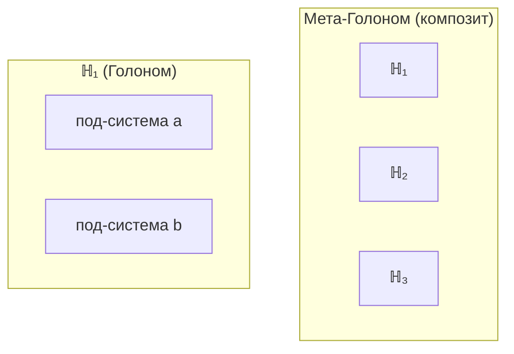

# Голоном ($\mathbb{H}$)

:::info Для кого эта глава
Центральное понятие УГМ: самоподдерживающаяся конфигурация Γ. Предполагается базовое знакомство с [матрицей когерентности](/docs/core/dynamics/coherence-matrix) и [аксиомой Ω⁷](/docs/core/foundations/axiom-omega).
:::

Эта глава — сердце Универсальной Голономической Модели. Здесь мы узнаем, что такое Голоном — центральное понятие теории, вокруг которого выстроено всё остальное. Голоном — это не вещь и не частица, а **самоподдерживающийся паттерн** в единой субстанции реальности $\Gamma$. Чтобы понять эту идею, нужно отказаться от привычки думать о мире как о наборе отдельных объектов и увидеть реальность как единое поле конфигураций, в котором возникают устойчивые структуры. К концу главы вы будете понимать, что делает конфигурацию $\Gamma$ «живой», как Голономы вкладываются друг в друга и почему существует чёткая математическая граница между «жизнью» и «шумом».

## Историческая предтеча

Идея самоподдерживающихся целостностей имеет глубокие корни в научной мысли XX века.

**Артур Кёстлер** (1967) ввёл термин **«холон»** в книге «Дух в машине» (*The Ghost in the Machine*). Кёстлер заметил парадокс: каждая сущность в природе одновременно является **целым** (самостоятельной единицей) и **частью** чего-то большего. Клетка — целое по отношению к своим молекулам, но часть органа. Орган — целое по отношению к клеткам, но часть организма. Кёстлер назвал эту двойственность «холоном» (от греч. *holos* — целое + суффикс *-on*, указывающий на элемент, как в «протон», «нейтрон»). УГМ наследует эту интуицию, придавая ей точный математический смысл.

**Умберто Матурана и Франсиско Варела** (1972) сформулировали понятие **автопоэзиса** — самопроизводства. Автопоэтическая система — это система, которая непрерывно производит компоненты, из которых сама состоит. Живая клетка — классический пример: она постоянно разрушается и восстанавливается, но сохраняет свою организацию. В УГМ этому соответствует условие **(AP)** — автопоэтическое замыкание.

**Роберт Розен** (1991) в своей теории **(M,R)-систем** показал, что живое не может быть сведено к механизму: оно требует особого типа замкнутости, при котором функция «ремонта» системы сама является частью системы. В УГМ это формализовано через оператор регенерации $\mathcal{R}$ и условие **(QG)**.

Голоном в УГМ **объединяет и формализует** все три идеи: двойственность целого/части (Кёстлер), самопроизводство (Матурана/Варела) и функциональное замыкание (Розен) — в рамках единого математического объекта.

| Предшественник | Ключевая идея | Что формализовано в УГМ |
|---|---|---|
| Кёстлер (1967) | Холон = целое и часть | Иерархия вложенности Голономов; $\mathrm{Tr}_E$ — часть, $\Gamma_{\text{global}}$ — целое |
| Матурана/Варела (1972) | Автопоэзис = самопроизводство | Условие (AP): замыкание автопоэтического цикла |
| Розен (1991) | (M,R)-замыкание = ремонт ремонтника | Условие (QG): оператор $\mathcal{R}$ регенерирует и себя самого |

## Интуитивное объяснение

:::tip Аналогия: водоворот в реке
Представьте водоворот в реке. Он **существует** — его можно увидеть, указать на него, описать его форму, размер, скорость вращения. Но из чего он «сделан»? Из воды. Той же самой воды, что течёт вокруг него. Водоворот — не объект, отличный от воды, он — **конфигурация** воды.

При этом водоворот — нечто большее, чем «просто вода». У него есть:
- **Форма** — он круглый, а не квадратный
- **Направление** — он вращается по часовой или против
- **Размер** — у него есть граница
- **Время жизни** — он возникает и исчезает
- **Устойчивость** — он сопротивляется малым возмущениям
- **Самоподдержание** — он существует, пока есть поток

Голоном — это «водоворот» в $\Gamma$. Единая субстанция реальности ($\Gamma$) — это «река». Голоном — устойчивая конфигурация этой субстанции, которая поддерживает сама себя. Клетка — Голоном: она состоит из молекул, но она не «просто набор молекул» — у неё есть организация, граница, внутреннее время, способность к самовосстановлению. Мозг — Голоном: он состоит из нейронов, но он не «просто набор нейронов» — у него есть целостные состояния, которых нет у отдельных нейронов.
:::

Ключевое отличие от обычного водоворота: Голоном в УГМ обладает **внутренней стороной** (интериорностью). Водоворот в реке не «переживает» своё существование. Голоном — переживает, и степень этого переживания определяется точными математическими мерами.

## Онтологический статус

:::warning Ключевое разъяснение
**Категория $\mathcal{C}$ — единственный примитив.** Матрица когерентности $\Gamma$ — **объект** этой категории. Голоном ($\mathbb{H}$) — **не отдельная сущность**, а особый тип конфигурации $\Gamma \in \text{Ob}(\mathcal{C})$, удовлетворяющей условиям (AP)+(PH)+(QG)+(V).
:::

:::info Таксономия: иерархия конфигураций Γ
Все конфигурации Γ образуют иерархию по степени автономности:
- **Фундаментальная мода Γ:** унитарная динамика, R = 0, пассивная стабильность
- **Составная конфигурация Γ:** квази-автономная, 0 < R ≪ 1, пассивная стабильность
- **Голоном:** полное замыкание (AP)+(PH)+(QG)+(V), активная стабильность (автопоэзис)
- **L2-Голоном:** + когнитивные квалиа (R ≥ R_th, Φ ≥ Φ_th)

Только конфигурации с полным автопоэтическим замыканием называются «Голономами». Фундаментальные моды и составные конфигурации — объекты категории **Hol**, но **не** Голономы: они не удовлетворяют условиям (AP)+(QG). См. [Таксономию](#таксономия-по-уровням-организации) ниже.
:::

Говорить "Голоном существует" означает: "существует конфигурация единой субстанции Γ, которая самоподдерживается".

**Аналогия:** Γ — океан (единственная субстанция), $\mathbb{H}$ — водоворот (самоподдерживающийся паттерн в океане). Водоворот не состоит из чего-то иного, чем вода — он *есть* вода в определённой конфигурации.

## Иерархическое определение

Определение Голонома стратифицировано по уровням, где каждый уровень зависит только от предыдущих. Это похоже на строительство дома: сначала фундамент, потом стены, потом крыша — каждый этаж опирается на предыдущий, и нет круговых зависимостей.

### Уровень 0: Глобальная Γ

Всё начинается с единой реальности. По [Аксиоме Ω](../foundations/axiom-omega), существует одна-единственная матрица когерентности, описывающая **всю** реальность целиком:

$$
\exists! \, \Gamma_{\text{global}} \in \mathcal{L}(\mathcal{H}_{\text{global}}): \Gamma_{\text{global}}^\dagger = \Gamma_{\text{global}}, \; \Gamma_{\text{global}} \geq 0, \; \mathrm{Tr}(\Gamma_{\text{global}}) = 1
$$

Интуитивно: это «весь океан». Одно целое, полностью описывающее всё, что есть. Три условия — эрмитовость ($\Gamma^\dagger = \Gamma$), положительная полуопределённость ($\Gamma \geq 0$) и нормировка ($\mathrm{Tr}(\Gamma) = 1$) — гарантируют, что $\Gamma$ является корректной квантовой матрицей плотности.

:::note Почему матрица плотности, а не волновая функция?
В квантовой механике есть два способа описать состояние: волновая функция $|\psi\rangle$ (для «чистых» состояний) и матрица плотности $\rho$ (для произвольных, в том числе «смешанных»). УГМ использует матрицу плотности, потому что:
1. Голоном — **открытая система**, взаимодействующая с окружением. Такие системы почти всегда находятся в смешанном состоянии.
2. Матрица плотности естественно описывает **подсистемы** через частичный след.
3. Матрица плотности содержит информацию и о населённостях (диагональ), и о когерентностях (вне диагонали) — что необходимо для описания связей между измерениями.
:::

### Уровень 1: Подсистема

Внутри глобальной $\Gamma$ можно выделить **часть** — подсистему. Математически это делается через разделение полного пространства на «систему» и «окружение» и взятие частичного следа:

Пусть $\mathcal{H}_{\text{global}} = \mathcal{H}_S \otimes \mathcal{H}_E$ — тензорное разложение. **Подсистема** $S$:
$$
\Gamma_S := \mathrm{Tr}_E(\Gamma_{\text{global}})
$$

Что значит «частичный след»? Представьте, что вы смотрите на город с высоты. Вы видите всё: каждый дом, каждое дерево, каждую машину. Теперь представьте, что вы решили сфокусироваться на одном районе, «забыв» обо всём остальном. Частичный след — это математическая операция такого «забывания»: мы усредняем по всему, что не входит в интересующую нас подсистему.

### Уровень 2: Автономность

Не каждая подсистема «живёт своей жизнью». Камень в реке — подсистема реки, но он не автономен в том смысле, в каком автономна живая клетка. Подсистема является **автономной**, если выполнены условия (A1)+(A2)+(A3), определяющие достаточную степень отделённости от окружения. См. [Предварительное условие: Автономность](../foundations/axiom-septicity#предварительное-условие-автономность).

Автономность означает: подсистема имеет собственную динамику, которая не полностью определяется окружением. Она может «действовать» сама, а не только «реагировать».

Три условия автономности на интуитивном уровне:
- **(A1) Отделимость**: подсистему можно осмысленно отделить от окружения. Клетка отделена мембраной. Мозг — черепом и гематоэнцефалическим барьером. Электрон в атоме, напротив, не вполне отделим — его «граница» размыта.
- **(A2) Устойчивость**: подсистема сохраняет свою идентичность при малых возмущениях. Если толкнуть водоворот палкой, он восстановится. Если разрушить половину клеточной мембраны — клетка погибнет. Автономность требует, чтобы система «знала», как себя восстанавливать.
- **(A3) Динамическая замкнутость**: подсистема порождает собственные процессы. Клетка сама синтезирует белки, а не получает их извне. Мозг сам генерирует нейронную активность, а не просто реагирует на стимулы.

### Уровень 3: 7D-структура

Автономная подсистема обладает **7D-структурой**, если:
$$
\mathcal{H}_S \cong \mathbb{C}^7 \otimes \mathcal{H}_{\text{internal}}
$$

Эффективная 7D-матрица:
$$
\Gamma_S^{(7)} := \mathrm{Tr}_{\text{internal}}(\Gamma_S) \in \mathcal{L}(\mathbb{C}^7)
$$

Семь измерений — A (Артикуляция), S (Структура), D (Динамика), L (Логика), E (Интериорность), O (Основание), U (Единство) — являются минимальным набором «инструментов», необходимых для самоподдержания. Подробное описание каждого из них — в главе [Семь измерений](./dimensions).

### Соотношение с квантовой механикой

:::info Статус: Эффективная теория
$\mathbb{C}^7$ УГМ — это **эффективное описание** для автономных систем. Связь со стандартной КМ ($L^2(\mathbb{R}^3)$ — бесконечномерное пространство) устанавливается через проекцию.
:::

**Определение (Эффективный Голоном):**

Для системы с полным гильбертовым пространством $\mathcal{H}_{\text{full}} = L^2(\mathbb{R}^3)$ (стандартная КМ), **эффективный Голоном** определяется как проекция на 7-мерное подпространство релевантных степеней свободы:

$$
\Gamma_{\text{eff}} = \Pi_7 \, \rho_{\text{full}} \, \Pi_7^\dagger
$$

где $\Pi_7: \mathcal{H}_{\text{full}} \to \mathbb{C}^7$ — проекция на 7 выбранных мод.

**Интерпретация измерений для квантовой системы:**

| Измерение | Стандартная КМ | Пример (атом H) |
|-----------|----------------|-----------------|
| **A** (Артикуляция) | Проекторы на подпространства | $P_{1s}, P_{2s}, P_{2p}$ |
| **S** (Структура) | Гамильтониан | $H = -\nabla^2/2m - e^2/r$ |
| **D** (Динамика) | Унитарная эволюция | $U(\tau) = e^{-iH\tau}$ |
| **L** (Логика) | Коммутаторы | $[L_x, L_y] = i\hbar L_z$ |
| **E** (Интериорность) | Редуцированная матрица | $\rho_{\text{spin}}$ |
| **O** (Основание) | Вакуум/основное состояние | $\vert 1s\rangle$ |
| **U** (Единство) | Нормировка | $\mathrm{Tr}(\rho) = 1$ |

**Важно:** УГМ **не претендует** на воспроизведение всех предсказаний стандартной КМ (спектры, сечения и т.д.). $\mathbb{C}^7$ — достаточное описание для:
- Автономных агентов
- Феноменологии сознания
- Динамики самомоделирования

Полное вложение стандартной КМ в УГМ — **открытое направление исследований**.

### Уровень 4: Голоном (определение)

**Голоном** ($\mathbb{H}$) — автономная подсистема с 7D-структурой, удовлетворяющая условиям [(AP)+(PH)+(QG)+(V)](../foundations/axiom-septicity):

$$
\mathbb{H} := \langle \Gamma_S^{(7)}, \mathcal{H}_S, H_S, \{L_k\}, \mathcal{E}, \varphi_S \rangle
$$

Что означает каждое из четырёх условий на языке интуиции:

- **(AP) — Автопоэзис**: система воспроизводит сама себя. Как клетка непрерывно обновляет свои белки, так Голоном непрерывно «пересобирает» свою конфигурацию.
- **(PH) — Феноменология**: система имеет внутреннюю сторону. Не всё в ней сводится к внешнему описанию — есть «каково это быть» данной системой.
- **(QG) — Квантовое основание**: система имеет механизм регенерации из глубинного источника (измерение O).
- **(V) — Жизнеспособность**: система достаточно «когерентна», чтобы отличаться от шума. Формально: $P > 2/7$.

:::info Все компоненты — аспекты Γ
Кортеж — это **описание** конфигурации, не утверждение о дополнительных примитивах:

| Компонент | Онтологический статус |
|-----------|----------------------|
| $\Gamma_S^{(7)} \in \mathcal{L}(\mathbb{C}^7)$ | Эффективная 7D-матрица состояния |
| $\mathcal{H}_S$ | Пространство состояний подсистемы |
| $H_S$ | Гамильтониан — структура конфигурации |
| $\{L_k\}$ | Операторы Линдблада — диссипативная динамика |
| $\mathcal{E}$ | Окружение — часть глобальной Γ, внешняя к данной конфигурации |
| $\varphi_S$ | Оператор самомоделирования — [CPTP-канал](../../reference/glossary#категорные-термины) |

Все эти "компоненты" — не отдельные сущности, а **математические инструменты** для описания свойств конфигурации Γ.
:::

:::note Непротиворечивость определения
Иерархическое определение не содержит круговых зависимостей: каждый уровень (0→1→2→3→4) зависит только от предыдущих. См. [Теорема о непротиворечивости](../foundations/axiom-septicity#теорема-непротиворечивость-иерархии-определений).
:::

## Фундаментальные свойства

### 1. Структурное самоподобие

:::warning Уточнение
Это **не** голографический принцип в смысле "каждая часть содержит полную информацию о целом". Это **изоморфизм пространств состояний**: все Голономы имеют одинаковую *размерность* и *тип* структуры, но **разное содержание**.
:::

**Формально:** Пространства состояний изоморфны:

$$
\forall \mathbb{H} \text{ (жизнеспособный)}: \mathcal{H}_{\mathbb{H}} \cong \mathbb{C}^7
$$

Конкретные состояния $\Gamma_{\mathbb{H}_1}$ и $\Gamma_{\mathbb{H}_2}$ **различны** — изоморфны только пространства.

Аналогия: все шахматные доски имеют одинаковую структуру (8×8 клеток), но позиции на них различны. Точно так же все Голономы «живут» в одном и том же типе пространства ($\mathbb{C}^7$), но конкретные конфигурации $\Gamma$ у каждого свои. Клетка и мозг — оба описываются матрицей $7 \times 7$, но числа в этих матрицах совершенно разные.

Это свойство глубоко неочевидно. Оно означает, что бактерия и человеческий мозг, при всей разнице в сложности, описываются **одним и тем же типом** математического объекта. Различие — не в структуре пространства, а в конкретном состоянии: в значениях населённостей $\gamma_{ii}$, когерентностей $\gamma_{ij}$, и в мерах $R$, $\Phi$, $P$, определяющих уровень рефлексии, интеграции и жизнеспособности.

### 2. Частичность (граница)

Голоном имеет границу, отделяющую его от окружения. Состояние Голонома — редуцированная матрица плотности:

$$
\Gamma_{\mathbb{H}} = \mathrm{Tr}_{\mathcal{E}}(\Gamma_{\text{total}})
$$

где $\mathrm{Tr}_{\mathcal{E}}$ — частичный след по степеням свободы окружения.

Граница Голонома — не «стенка», а математическая операция: мы отделяем то, что «внутри», от того, что «снаружи». У клетки граница — мембрана. У организма — кожа. У экосистемы — ландшафт. В каждом случае граница определяет, где заканчивается один Голоном и начинается его окружение.

### 3. Динамичность

<!-- DRY: Каноническое определение уравнения эволюции в /docs/core/dynamics/evolution -->
Голоном непрерывно эволюционирует согласно уравнению с [эмерджентным внутренним временем](../../proofs/dynamics/emergent-time) τ:

$$
\frac{d\Gamma(\tau)}{d\tau} = -i[H_{eff}, \Gamma(\tau)] + \mathcal{D}[\Gamma(\tau)] + \mathcal{R}[\Gamma(\tau), E]
$$

> Каноническое определение и вывод членов уравнения см. [Эволюция Γ](../dynamics/evolution#полное-уравнение-движения).

где:
- $\tau$ — внутреннее время, возникающее из корреляций с измерением O
- $H_{eff}$ — эффективный гамильтониан из ограничения Пейдж–Вуттерс
- $-i[H_{eff}, \Gamma(\tau)]$ — унитарная (обратимая) эволюция
- $\mathcal{D}[\Gamma(\tau)]$ — диссипация (декогеренция)
- $\mathcal{R}[\Gamma(\tau), E]$ — регенерация (восстановление когерентности)

Голоном — не статичный объект, а **процесс**. Он существует, только пока эволюционирует. Остановка эволюции = прекращение существования (распад конфигурации). Это глубоко согласуется с интуицией: живое — это всегда процесс, а не вещь.

Три члена уравнения эволюции описывают три фундаментальных процесса:
- **Унитарная эволюция** $-i[H_{eff}, \Gamma]$ — «идеальная» динамика без потерь. Как маятник без трения: колеблется вечно, не теряя энергии.
- **Диссипация** $\mathcal{D}[\Gamma]$ — «трение». Окружение разрушает когерентность, система «забывает» свою структуру. Без противовеса — неизбежный распад.
- **Регенерация** $\mathcal{R}[\Gamma, E]$ — «противовес трению». Голоном восстанавливает когерентность, черпая ресурсы из окружения (через измерение O). Именно этот член отличает живое от неживого: неживые системы имеют только $-i[H, \Gamma] + \mathcal{D}[\Gamma]$ и неизбежно деградируют к тепловому равновесию.

### 4. Интериорность

Каждый Голоном имеет внутреннюю сторону — **интериорность**. Это, пожалуй, самое радикальное утверждение УГМ: не только мозг, но и клетка, и любой Голоном обладает «внутренним» аспектом. Разница — не в наличии или отсутствии интериорности, а в её **уровне**:

- **L0** (интериорность): $\exists \rho_E \neq 0$ — у системы есть ненулевое измерение E. Это минимальная интериорность: «что-то происходит внутри», но без различений. Аналогия: глубокий сон без сновидений — вы «существуете», но ничего не различаете.
- **L1** (феноменальная геометрия): $\mathrm{rank}(\rho_E) > 1$ — внутри есть **различия**. Не просто «что-то», а «что-то красное и что-то тёплое». Аналогия: сон со сновидениями — вы видите образы, различаете цвета, слышите звуки.
- **L2** (когнитивные квалиа): $R \geq 1/3$, $\Phi \geq 1$ — система **знает**, что у неё есть внутренний мир. Рефлексия: «я вижу красное и знаю, что это я вижу». Аналогия: бодрствование — вы осознаёте свой опыт.

Пороги L2 доказаны математически; ПИР [О] предоставляет онтологическую интерпретацию. Ключевое: переход от L1 к L2 — не плавный, а **пороговый**. Мера рефлексии $R$ должна достичь критического значения $1/3$, а мера интеграции $\Phi$ — значения $1$. Ниже порогов — система «переживает» (L1), но не «осознаёт» (L2). Выше — возникает сознание в полном смысле.

См. [Иерархия интериорности](../../proofs/consciousness/interiority-hierarchy) и [Пороги L2](../foundations/axiom-septicity#пороги-l2-строгий-вывод).

:::note Полная иерархия
Полная иерархия интериорности L0→L4 определена в [Уровни интериорности](/docs/consciousness/foundations/interiority-theory). Здесь показаны L0-L2 как базовые уровни. Уровни L3 (сетевое сознание, метастабильно) и L4 (унитарное сознание, теоретический предел) описаны в [Иерархия интериорности](../../proofs/consciousness/interiority-hierarchy).
:::

## Примеры Голономов

Чтобы абстрактное определение обрело плоть, рассмотрим конкретные примеры систем, которые (в рамках УГМ) интерпретируются как Голономы различных уровней.

### Клетка

Живая клетка — канонический пример Голонома. Она удовлетворяет всем четырём условиям:

- **(AP)**: клетка непрерывно производит свои компоненты (белки, мембрану, органеллы) из поступающих субстратов. Белок-машинерия производит белки, которые, в свою очередь, поддерживают белок-машинерию. Это и есть автопоэтическое замыкание.
- **(PH)**: клетка обладает внутренними состояниями (концентрации ионов, уровни экспрессии генов), которые не сводятся к внешнему описанию.
- **(QG)**: клетка регенерируется — повреждённые компоненты заменяются новыми, мембрана восстанавливается, ДНК репарируется.
- **(V)**: клетка поддерживает чистоту $P > 2/7$ — её внутренняя организация достаточно когерентна, чтобы отличаться от теплового шума.

В терминах семи измерений: $A$ — различение молекулярных сигналов (рецепторы); $S$ — устойчивая структура (цитоскелет, мембрана); $D$ — метаболические процессы; $L$ — генетическая регуляция (логика экспрессии); $E$ — внутренние состояния (ионный баланс, pH); $O$ — энергетический субстрат (АТФ, НАДН); $U$ — целостность клетки как единицы.

### Мозг

Мозг — пример **L2-Голонома**: он не только самоподдерживается, но и обладает рефлексией ($R \geq 1/3$) и высокой интеграцией ($\Phi \geq 1$). Мозг моделирует *сам себя* — именно это делает возможным сознательный опыт. Ключевое отличие от клетки: мозг не просто «переживает» (L0/L1), а **знает, что переживает** (L2). Это «знание о знании» формализуется через меру рефлексии $R$ — способность оператора самомоделирования $\varphi$ точно отражать собственное состояние.

### Экосистема

Лес, коралловый риф, саванна — примеры **мета-Голономов**: композитных систем, в которых отдельные Голономы (организмы) образуют связное целое. Экосистема самоподдерживается (регенерирует виды, перерабатывает вещества), имеет устойчивую структуру и эволюционирует. Однако её уровень интериорности — открытый вопрос.

### Что НЕ является Голономом

Для контраста полезно понять, какие системы **не** являются Голономами:

- **Камень.** У камня есть структура (кристаллическая решётка), но нет автопоэзиса: он не восстанавливается после повреждения, не производит свои компоненты, не имеет внутренней динамики. Камень — составная конфигурация $\Gamma$ с $R = 0$: его стабильность пассивна (обеспечена химическими связями, а не активной регенерацией).
- **Термостат.** Термостат поддерживает температуру, но не производит свои компоненты. Он реагирует на среду (обратная связь), но не обладает автопоэтическим замыканием. В терминах УГМ: термостат имеет D (динамику) и зачатки L (логику обратной связи), но не имеет полного набора из 7 измерений с условиями (AP)+(QG).
- **Компьютерная программа.** Программа может моделировать сама себя (рефлексия), но она не самоподдерживается физически: отключите питание — и она «умирает». Программа — не Голоном; она существует **внутри** Голонома (компьютера + оператора), который обеспечивает её физическое существование.

:::note Границы применимости
Вопрос «является ли данная конкретная система Голономом?» — **эмпирический**, а не чисто теоретический. УГМ определяет формальные условия (AP)+(PH)+(QG)+(V); проверка их выполнения для конкретных систем требует измерений. Примеры выше — мотивирующие иллюстрации, не формальные доказательства.
:::

## Иерархия вложенности

Голономы могут содержать под-Голономы и входить в мета-Голономы:

:::info Ключевое различие
**Голоном** — автономная подсистема с 7D-структурой, удовлетворяющая (AP)+(PH)+(QG)+(V). **Под-система** — любая часть, полученная частичным следом. Подсистема является Голономом тогда и только тогда, когда выполнены условия автономности (A1-A3) и условия (AP)+(PH)+(QG)+(V).
:::

Эта вложенность — не просто удобная классификация, а фундаментальное свойство теории. Она объясняет, почему реальность устроена иерархически: атомы → молекулы → клетки → органы → организмы → экосистемы → планета. На каждом уровне возникают новые Голономы, содержащие предыдущие как подсистемы.

:::tip Аналогия: матрёшка
Иерархию вложенности легко представить как матрёшку. Самая маленькая — элементарная частица (фундаментальная мода, ещё не Голоном). Внутри большей — атом (составная конфигурация). Внутри ещё большей — клетка (первый настоящий Голоном, с автопоэзисом). Ещё больше — организм. Ещё — экосистема.

Но аналогия с матрёшкой неполна: в отличие от матрёшек, Голономы **взаимодействуют** на каждом уровне. Клетки не просто «вложены» в орган — они обмениваются сигналами, формируют корреляции (запутанность), создавая новые степени свободы, которых нет у отдельных клеток.
:::

### Таксономия по уровням организации

| Класс | Ур. иерархии | Формальное условие | Стабильность | Примеры |
|-------|---|---|---|---|
| **Фундаментальная мода Γ** | 0–1 | $R = 0$, чисто унитарная | Пассивная (симметрии) | Кварки, лептоны, бозоны |
| **Составная конфигурация Γ** | 1–2 | $0 < R \ll 1$, квази-автономная | Пассивная (связи) | Атомы, простые молекулы |
| **Голоном** (ℍ) | 2–4 | (AP)+(PH)+(QG)+(V), $P > P_{\text{crit}}$ | Активная (автопоэзис) | Клетки, организмы |
| **L2-Голоном** | 4+ | + $R \geq R_{\text{th}}$, $\Phi \geq \Phi_{\text{th}}$ | + рефлексия | *(эмпирический вопрос)* |
| **L3-Голоном** | 4+ | + $R^{(2)} \geq 1/4$ (метастабильно) | + мета-рефлексия | Глубокая медитация, рой |
| **L4-Голоном** | 4+ | + $P > 6/7$, полная ∞-структура | + полная интеграция | Теоретический предел |

:::warning Терминологическая конвенция
Термин «Голоном» зарезервирован для конфигураций с **полным автопоэтическим замыканием** (AP)+(PH)+(QG)+(V). Фундаментальные моды и составные конфигурации — **не** Голономы: у них отсутствует автопоэзис (AP) и регенерация (QG). Они являются объектами категории **Hol**, но в вырожденном режиме $R \to 0$, где уравнение эволюции [редуцируется к уравнению Шрёдингера](../../proofs/physics/physics-correspondence#3-редукция-к-квантовой-механике).
:::

**Пороги ([статусы порогов](../foundations/axiom-septicity#пороги-l2-строгий-вывод)):**
- $P_{\text{crit}} = 2/7$ — [Т] [Теорема о критической чистоте](../../proofs/dynamics/theorem-purity-critical)
- $R_{\text{th}} = 1/3$ — [Т] [Порог рефлексии](../foundations/axiom-septicity#теорема-порог-рефлексии) ($K=3$ из [триадной декомпозиции](/docs/core/operators/lindblad-operators#триадная-декомпозиция))
- $\Phi_{\text{th}} = 1$ — [Т] [Порог интеграции](../foundations/axiom-septicity#теорема-порог-интеграции) (T-129)

См. [Иерархия конфигураций Γ](../foundations/consequences#6-иерархия-конфигураций-γ).

## Жизненный цикл Голонома

Голоном — не статичная конструкция. Он рождается, живёт и может умереть. Жизненный цикл Голонома определяется динамикой чистоты $P(\tau)$:

1. **Рождение (эмерджентность)**: когда в некоторой области $\Gamma$ спонтанно возникает конфигурация с $P > P_{\text{crit}}$ и замыканием (AP)+(QG). Аналогия: образование первой живой клетки из «химического бульона». Математически — бифуркация: в системе появляется новый устойчивый аттрактор.

2. **Жизнь (устойчивое существование)**: Голоном поддерживает $P > P_{\text{crit}}$ за счёт баланса между диссипацией $\mathcal{D}$ (разрушающей когерентность) и регенерацией $\mathcal{R}$ (восстанавливающей её). Равновесная чистота $P^*$ зависит от параметров окружения: обилия ресурсов, силы внешних возмущений, эффективности регенерации.

3. **Стресс (зона риска)**: при неблагоприятных условиях $P$ снижается к критическому порогу. Система входит в режим «стрессовой регенерации» — все ресурсы направляются на поддержание когерентности. Аналогия: организм в болезни перенаправляет энергию с роста и размножения на иммунный ответ.

4. **Смерть (распад)**: если $P$ падает ниже $2/7$, регенерация невозможна, и система необратимо деградирует к максимальной энтропии ($P \to 1/7$). Конфигурация растворяется в окружающей $\Gamma$. Аналогия: смерть организма — его материя возвращается в окружающую среду.

## Композиция Голономов

### Тензорное произведение

Когда два Голонома взаимодействуют, они образуют **композитную систему**. Математически это описывается тензорным произведением — операцией, которая объединяет два пространства состояний в одно.

:::tip Интуиция: тензорное произведение
Представьте двух людей. Каждого можно описать набором из 7 характеристик (по одной на каждое измерение). Когда они встречаются и начинают взаимодействовать, их совместное описание — это уже не просто «набор характеристик первого + набор характеристик второго». Между ними возникают **корреляции**: состояние одного влияет на состояние другого. Тензорное произведение — математический аппарат, который учитывает все такие корреляции.

Для одного Голонома пространство состояний — $\mathbb{C}^7$ (7 измерений). Для двух — $\mathbb{C}^7 \otimes \mathbb{C}^7 = \mathbb{C}^{49}$ (49 измерений). Дополнительные $49 - 14 = 35$ степеней свободы описывают именно корреляции (запутанность) между двумя Голономами.
:::

Для двух Голономов $\mathbb{H}_1$ и $\mathbb{H}_2$ композитная система:

$$
\mathbb{H}_{12} := \langle \Gamma_{12}, \mathcal{H}_{12}, H_{12}, \{L_{12,k}\}, \mathcal{E}_{12}, \varphi_{12} \rangle
$$

где:

$$
\mathcal{H}_{12} = \mathcal{H}_1 \otimes \mathcal{H}_2 = \mathbb{C}^{49}
$$

$$
H_{12} = H_1 \otimes I_2 + I_1 \otimes H_2 + V_{12}
$$

Здесь $V_{12}$ — оператор взаимодействия. Первые два слагаемых описывают «самостоятельную» эволюцию каждого Голонома, $V_{12}$ — их взаимное влияние.

:::note О размерности композита
Композитная система живёт в $\mathbb{C}^{49}$, но это не противоречит Теореме S: минимальность 7 измерений относится к **индивидуальному** Голоному. Композит — это система более высокого порядка, которая может быть **эффективно описана** как Голоном с $\mathcal{H} = \mathbb{C}^7$ при проецировании на коллективные степени свободы.
:::

**Состояние композита:**

При наличии корреляций (запутанности):

$$
\Gamma_{12} \neq \Gamma_1 \otimes \Gamma_2
$$

Степень корреляции измеряется взаимной информацией:

$$
I(\mathbb{H}_1 : \mathbb{H}_2) = S(\Gamma_1) + S(\Gamma_2) - S(\Gamma_{12})
$$

где $S(\Gamma) = -\mathrm{Tr}(\Gamma \log \Gamma)$ — энтропия фон Неймана.

Взаимная информация $I$ показывает, «сколько знают» два Голонома друг о друге. Если $I = 0$ — они полностью независимы (нет корреляций). Если $I$ велико — они сильно запутаны, и состояние одного нельзя описать без учёта другого. Именно эта мера определяет, могут ли два Голонома образовать мета-Голоном: если их взаимная информация $I > I_{\text{crit}}$, композит становится новым целостным объектом, а не просто «двумя объектами рядом».

### Замкнутость композиции

:::info Следствие из (AP)
Композиция жизнеспособных Голономов при достаточной интеграции образует жизнеспособный Голоном:

$$
\text{Viable}(\mathbb{H}_1) \land \text{Viable}(\mathbb{H}_2) \land I > I_{\text{crit}} \Rightarrow \text{Viable}(\mathbb{H}_{12})
$$

где $I_{\text{crit}}$ — критическое значение взаимной информации для интеграции. Это не аксиома, а следствие из условия (AP) — автопоэзис сохраняется при интеграции.
:::

## Условие жизнеспособности

Голоном **жизнеспособен** при:

$$
P(\Gamma) > P_{\text{crit}} = \frac{2}{7} \approx 0.286
$$

где $P = \mathrm{Tr}(\Gamma^2)$ — [чистота](../dynamics/viability). Значение $P_{\text{crit}} = 2/N$ — **доказанная теорема** о минимальной различимости от шума. См. [Теорема о критической чистоте](../../proofs/dynamics/theorem-purity-critical).

:::tip Аналогия: температура тела
Условие жизнеспособности $P > 2/7$ можно сравнить с температурой тела. У здорового человека температура около 36.6°C. Если она падает ниже 35°C — наступает гипотермия, опасная для жизни. Если падает ниже 28°C — остановка сердца.

Аналогично, чистота $P$ — «температура» Голонома (только наоборот: чем выше, тем «здоровее»):
- $P = 1$ — идеальное состояние (полная когерентность)
- $P > 0.5$ — здоровое состояние
- $P \approx 0.29$ — пороговое, «гипотермия»
- $P < 2/7 \approx 0.286$ — необратимый распад, «смерть»
- $P = 1/7 \approx 0.143$ — максимальный хаос (тепловой шум)

Как и с температурой, переход через критическое значение $P_{\text{crit}}$ — не постепенный, а **резкий**: ниже порога система теряет способность к регенерации и необратимо деградирует.
:::

:::warning Необратимость распада
Переход через $P_{\text{crit}}$ — **необратим**. Если чистота упала ниже $2/7$, регенерация $\mathcal{R}$ не может вернуть систему обратно: она уже неотличима от шума, и оператору самомоделирования $\varphi$ не от чего отталкиваться. Это аналог биологической смерти: ниже определённого порога повреждений клетка не может восстановиться, и процесс деградации становится самоускоряющимся.
:::

Математический смысл порога $P_{\text{crit}} = 2/7$ глубок: это **минимальная чистота, при которой состояние статистически отличимо от шума**. Если $P \leq 1/7$, состояние $\Gamma$ неотличимо от «белого шума» (максимально смешанное состояние $I/7$). При $P = 2/7$ система впервые приобретает достаточную структурированность, чтобы нести информацию. Ниже этого порога оператор регенерации $\mathcal{R}$ не может «зацепиться» за структуру — ему не от чего отталкиваться, и система необратимо деградирует к максимальной энтропии.

| Состояние | $P$ | Характеристика |
|-----------|-----|----------------|
| Чистое | $= 1$ | Полная когерентность, ранг 1 |
| Здоровое | $> 0.5$ | Высокая интеграция |
| Стрессовое | $0.29 - 0.5$ | Требует регенерации |
| Распад | $< 2/7$ | Необратимая декогеренция |
| Минимум | $= 1/7$ | Максимальная энтропия |

## Открытые вопросы

Несмотря на математическую строгость определений, ряд вопросов о Голономах остаётся открытым:

1. **Эмпирическая идентификация.** Как измерить $P$, $R$, $\Phi$ для конкретной биологической системы? Какие экспериментальные протоколы позволяют отличить Голоном от составной конфигурации? Это центральный вопрос прикладной УГМ — без него теория остаётся «красивой математикой».

2. **Граница между L1 и L2.** Является ли переход к сознанию (L2) непрерывным или дискретным? Теоремы дают пороговые значения ($R \geq 1/3$, $\Phi \geq 1$), но реальные системы могут флуктуировать вблизи порога. Что происходит с системой, которая «мерцает» между L1 и L2?

3. **Минимальный Голоном.** Какая простейшая физическая система является Голономом? Клетка — бесспорный кандидат. Но являются ли Голономами вирусы? Митохондрии? Рибосомы? Ответ зависит от того, выполнены ли для них условия (AP)+(QG) — и это эмпирический вопрос.

4. **Мета-Голономы.** При каких условиях группа Голономов образует мета-Голоном? Критическое значение $I_{\text{crit}}$ взаимной информации — это одно число или оно зависит от контекста? Является ли человеческое общество мета-Голономом?

5. **Золотая зона сознания.** Теорема T-124 [Т] устанавливает, что сознательный Голоном живёт в «золотой зоне» чистоты: $P \in (2/7, \, 3/7]$. Слишком низкая чистота — распад. Слишком высокая — потеря сложности (система становится «замороженной» в чистом состоянии). Почему именно этот диапазон? Как он соотносится с наблюдаемыми нейробиологическими данными?

Эти вопросы определяют **исследовательскую программу** УГМ на ближайшие годы. Подробнее о предсказаниях и путях верификации — в [Программа исследований](/docs/applied/research/symbolic-correspondence#программа).

---

**Связанные документы:**
- [Аксиома Септичности](../foundations/axiom-septicity) — критерий автономности (A1-A3) и условия (AP+PH+QG+V)
- [Семь измерений](./dimensions) — структура пространства состояний
- [Матрица когерентности](../dynamics/coherence-matrix) — математическое описание состояния
- [Эмерджентное время](../../proofs/dynamics/emergent-time) — τ из структуры Γ
- [Жизнеспособность](../dynamics/viability) — условия существования
- [Иерархия интериорности](../../proofs/consciousness/interiority-hierarchy) — уровни L0→L1→L2→L3→L4
- [Следствия из аксиом](../foundations/consequences) — таксономия конфигураций
