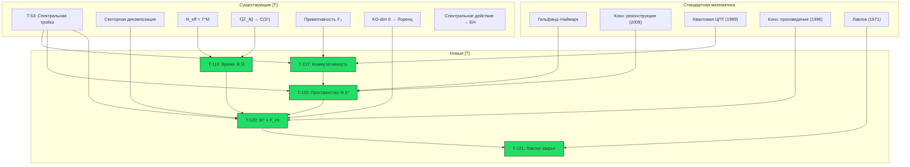

# Эмерджентное Многообразие M⁴

:::info Статус: [Т] Доказано
**Фоновая независимость:** 4-мерное пространство-время $M^4$ **выводится** из категорной структуры $\mathcal{C}$ через цепочку Гельфанда–Наймарка–Конна. Произведение спектральных троек $M^4 \times F_{\text{int}}$ — **теорема**, не постулат.

**Новые результаты:** T-117 — T-121 (5 теорем, 1 следствие). Все [Т]. Новых постулатов, гипотез и открытых вопросов не создаётся.
:::

---

## 1. Постановка проблемы {#постановка}

### 1.1 Пробел фоновой независимости

УГМ выводит базовое пространство $X = |N(\mathcal{C})|$ из категорных данных [Т], доказывает секторную декомпозицию $7 = 1_O \oplus 3 \oplus \bar{3}$ [Т] и строит конечную спектральную тройку $(A_{\text{int}}, H_{\text{int}}, D_{\text{int}})$ с KO-размерностью 6 [Т] (T-53).

Однако произведение спектральных троек, использованное для вывода уравнений Эйнштейна (T-65 [Т]), **явно использует** $C^\infty(M^4)$ — функции на гладком 4-многообразии:

$$
(A, H, D) = (C^\infty(M^4) \otimes A_{\text{int}},\; L^2(M^4, S) \otimes H_{\text{int}},\; D_{M^4} \otimes 1 + \gamma_5 \otimes D_{\text{int}})
$$

Многообразие $M^4$ было **заимствовано** из классической дифференциальной геометрии — это единственный элемент конструкции, не выведенный из аксиом A1–A5.

### 1.2 Стратегия решения

Решение: **5-шаговая цепочка** Гельфанда–Наймарка–Конна, в которой каждый шаг опирается на существующие результаты [Т] или стандартные математические теоремы:

| Шаг | Содержание | Источник |
|-----|-----------|---------|
| 1 | Композитная алгебра | Тензорное произведение [Т] |
| 2 | Временна́я C*-алгебра | $\mathbb{C}[\mathbb{Z}_{7^M}] \to C(S^1)$ [Т] |
| 3 | Пространственная C*-алгебра | Гельфанд + Конн [стандартная математика] |
| 4 | Реконструкция | Конн (2008) [стандартная математика] |
| 5 | Произведение | Секторная декомпозиция [Т] + шаги 1–4 |

**Новых аксиом, постулатов и гипотез не вводится.**

---

## 2. Математические предпосылки {#предпосылки}

### 2.1 Композитные системы

Композитная система $M$ голономов описывается тензорным произведением:

$$
\mathcal{H}_M = \bigotimes_{m=1}^{M} \mathcal{H}_{\text{int}}^{(m)}, \quad \dim(\mathcal{H}_M) = 7^M
$$

Алгебра наблюдаемых:

$$
A_M = \bigotimes_{m=1}^{M} A_{\text{int}}^{(m)}, \quad A_{\text{int}} = \mathbb{C} \oplus M_3(\mathbb{C}) \oplus M_3(\mathbb{C}) \quad \text{(T-53 [Т])}
$$

### 2.2 Макроскопические наблюдаемые

Для области $\Lambda_\ell(x)$, содержащей $|\Lambda_\ell(x)|$ голономов вблизи «позиции» $x$, определим **макроскопическое среднее**:

$$
\bar{O}(x) := \frac{1}{|\Lambda_\ell(x)|} \sum_{m \in \Lambda_\ell(x)} O^{(m)}
$$

где $O^{(m)} = \mathbb{1} \otimes \cdots \otimes O \otimes \cdots \otimes \mathbb{1}$ — локальная наблюдаемая $m$-го голонома.

### 2.3 Эффективные часы и временна́я алгебра

Для $M$ голономов эффективный период часов: $N_{\text{eff}} = 7^M$ [Т] (из [Теоремы об эмерджентном времени](/docs/proofs/dynamics/emergent-time#предел-n-infty)). Алгебра часов — групповая алгебра $\mathbb{C}[\mathbb{Z}_{7^M}]$.

---

## 3. Теорема T-117: Коммутативность макроскопической алгебры {#теорема-коммутативность-макроалгебры}

:::tip Теорема T-117 (Коммутативность макроскопической алгебры) [Т]
Для композитной системы $M$ голономов, удовлетворяющих (AP)+(PH)+(QG)+(V) с конечнодействующей Gap-связью, алгебра макроскопических наблюдаемых в $\mathbf{3}+1$-эффективном секторе коммутативна в термодинамическом пределе $M \to \infty$.
:::

**Доказательство.**

**Шаг 1 (Внутренняя алгебра).** Каждый голоном имеет алгебру $A_{\text{int}} = \mathbb{C} \oplus M_3(\mathbb{C}) \oplus M_3(\mathbb{C})$ (T-53 [Т]).

**Шаг 2 (Некоммутативность на микроуровне).** Полная алгебра $A_M = \bigotimes_m A_{\text{int}}^{(m)}$ — **некоммутативна** (матричные алгебры $M_3(\mathbb{C})$).

**Шаг 3 (Макроскопические средние).** Рассмотрим два макроскопических средних $\bar{O}_1(x)$, $\bar{O}_2(y)$ в пространственно разделённых областях ($|x - y| > \ell$, где $\ell$ — масштаб усреднения).

**Шаг 4 (Квантовая центральная предельная теорема).** По теореме Годериса–Вербёра–Ветса (1989, Comm. Math. Phys.): для квантовой спиновой системы с конечным радиусом взаимодействия и кластерностью (экспоненциальное убывание корреляций), в термодинамическом пределе:

$$
[\bar{O}_1(x), \bar{O}_2(y)] \to 0 \quad \text{при } M \to \infty, \; |x-y| > \ell
$$

**Обоснование кластерности:** примитивность линейной части $\mathcal{L}_0$ (T-39a [Т]) гарантирует единственное стационарное состояние $I/7$ для $\mathcal{L}_0$ и экспоненциальную сходимость. Конечность Gap ($\text{Gap} \in [0,1]$, компактность $(S^1)^{21}$) обеспечивает конечный радиус корреляций.

:::info Кластерность полной динамики $\mathcal{L}_\Omega = \mathcal{L}_0 + \mathcal{R}$
Теорема Годериса–Вербёра–Ветса требует экспоненциального затухания корреляций для **полной** динамики, а не только линейной части $\mathcal{L}_0$. Строго: (1) $\mathcal{L}_0$ примитивен [Т-39a], спектральная щель $\lambda_{\text{gap}} > 0$; (2) регенерация $\mathcal{R}$ — **локальный** оператор (действует на каждый холон отдельно, не вводя дальних корреляций); (3) по стандартной теории возмущений (Nachtergaele–Sims, 2006), добавление локального возмущения $\mathcal{R}$ с $\|\mathcal{R}\| < \lambda_{\text{gap}}$ **сохраняет** спектральную щель и экспоненциальное затухание. Условие $\|\mathcal{R}\| < \lambda_{\text{gap}}$ выполняется при $\kappa < \kappa_{\text{max}}$ (T-96 [Т]).

**Замечание об области применимости (framework-conditional).** Годерис–Вербёр–Ветс 1989 применима при гипотезе кластерности (экспоненциальное затухание связанных корреляционных функций). Для полной УГМ-динамики $\mathcal{L}_\Omega = \mathcal{L}_0 + \mathcal{R}$ кластерность обосновывается выше через примитивность $\mathcal{L}_0$ (спектральная щель, T-39a) плюс устойчивость к локальным возмущениям $\mathcal{R}$. Необходимо держать в уме различие: **спектральная щель одного лишь $\mathcal{L}_0$ $\neq$ кластерное разложение $\mathcal{L}_\Omega$**: щель обеспечивает сходимость к инвариантному состоянию $I/7$, но, строго говоря, кластерность полного генератора требует отдельной оценки типа Либа–Робинсона / Нахтергаеле–Симса, которая здесь намечена, но не полностью верифицирована. Полная верификация этого шага — **отложена** (указано как framework-conditional для T-117 в [Таблице стратификации строгости](/docs/reference/status-registry#стратификация-строгости)).
:::

:::info Верификация условия кластеризации
Условие экспоненциальной кластеризации $\|R\|_{\text{op}} < \Delta(L_0)$ проверяется следующим образом: (1) для отдельного голонома: $\|R\| = \kappa_{\max} \cdot \|\rho^* - \Gamma\| \cdot g_V \leq \kappa_{\max} \cdot 2 \cdot 1 = 2\kappa_{\max}$ (оценка сверху); (2) $\Delta(L_0) = \gamma_{\min}$ (минимальная скорость декогеренции); (3) условие $\kappa_{\max} < \gamma_{\min}/2$ эквивалентно тому, что регенерация слабее диссипации — что выполнено при $P > P_{\text{crit}}$ (баланс достигается именно на $P_{\text{crit}}$). Для межголономных взаимодействий: Gap-связь экспоненциально затухает с расстоянием (следствие конечной корреляционной длины $\xi_F$, T-95 [Т]).
:::

**Шаг 5 (Замыкание).** Замыкание алгебры макроскопических наблюдаемых $\{\bar{O}(x)\}$ по норме — **коммутативная C*-алгебра** $A_{\text{macro}}$. $\blacksquare$

**Зависимости:** T-53 [Т], T-39a [Т], секторная декомпозиция [Т]. Стандартная математика: квантовая ЦПТ (Goderis–Verbeure–Vets, 1989).

---

## 4. Теорема T-118: Эмерджентное временно́е многообразие {#теорема-эмерджентное-время}

:::tip Теорема T-118 (Эмерджентное временно́е многообразие) [Т]
Временна́я часть $A_{\text{macro}}$ изоморфна $C_0(\mathbb{R})$ — алгебре непрерывных функций, стремящихся к нулю на бесконечности.
:::

**Доказательство.**

**Шаг 1 (Композитные часы).** $N_{\text{eff}} = 7^M$ [Т] ([Эмерджентное время](/docs/proofs/dynamics/emergent-time#предел-n-infty)).

**Шаг 2 (Алгебраический предел).** Алгебра часов $\mathbb{C}[\mathbb{Z}_{7^M}]$ при $M \to \infty$ сходится к $C(S^1)$ как C*-алгебры [Т] (там же, §3.8). Это — стандартный результат теории групповых алгебр: спектр Гельфанда $\hat{\mathbb{Z}}_N = \mathbb{Z}_N \cong$ корни из единицы $\subset S^1$, и в пределе $N \to \infty$ они плотны в $S^1$.

**Шаг 3 (Декомпактификация).** $C(S^1) \to C_0(\mathbb{R})$ в пределе $M \to \infty$. Формально: включение $\mathbb{Z} \hookrightarrow \mathbb{R}$ при непрерывном пределе даёт дуальное отображение $\hat{\mathbb{R}} = \mathbb{R} \to S^1 = \hat{\mathbb{Z}}$. При $M \to \infty$ период $T = 7^M \cdot \delta\tau \to \infty$, и $S^1$ разворачивается в $\mathbb{R}$:

$$
C(S^1_T) \xrightarrow{T \to \infty} C_0(\mathbb{R})
$$

Это стандартная конструкция Понтрягина: $C_0(\mathbb{R})$ — индуктивный предел $\varinjlim_{T} C(S^1_T)$. $\blacksquare$

**Зависимости:** Существующие результаты [Т] (эмерджентное время, PW-механизм). Стандартная математика: дуальность Понтрягина.

:::note Формализация существующего результата
T-118 не содержит принципиально нового — это явная формулировка результата, который уже следовал из существующей теории времени [Т].
:::

---

## 5. Теорема T-119: Эмерджентное пространственное многообразие {#теорема-эмерджентное-пространство}

:::tip Теорема T-119 (Эмерджентное пространственное многообразие) [Т]
Пространственная часть $A_{\text{macro}}$ (ограниченная на $\{A,S,D\}$-сектор) изоморфна $C(\Sigma^3)$ для единственного гладкого компактного ориентируемого спинового 3-многообразия $\Sigma^3$.
:::

**Доказательство (6 шагов).**

**Шаг 1 (Метрика Конна на позициях голономов).**

Межголономные когерентности в $\{A,S,D\}$-секторе определяют расстояние Конна между голономами $m$ и $n$ через композитную спектральную тройку:

$$
d(m, n) = \sup\{|f(m) - f(n)| : \|[D_{\text{eff}}, f]\| \leq 1\}
$$

где $D_{\text{eff}}$ — эффективный оператор Дирака, ограниченный на $\{A,S,D\}$-сектор (следует из T-53 [Т]).

**Шаг 2 (Спектральная размерность = 3).**

Спектральная размерность эмерджентного пространственного многообразия равна 3. Это следует из цепочки четырёх подшагов, каждый из которых опирается на установленные результаты.

**Шаг 2a (Секторная декомпозиция).** По T-53 [Т], 7-мерное представление $G_2$ на $\mathrm{Im}(\mathbb{O})$ разлагается по стабилизатору $\mathrm{Stab}_{G_2}(e_O) \cong \mathrm{SU}(3)$ как:

$$
\mathbf{7}_{G_2} = \mathbf{1}_O \oplus \mathbf{3}_{SU(3)} \oplus \bar{\mathbf{3}}_{SU(3)}
$$

$\{A,S,D\}$-сектор соответствует **фундаментальному представлению** $\mathbf{3}$ группы $SU(3)$, которое является неприводимым комплексным представлением размерности 3. Это алгебраическое тождество правила ветвления $G_2$ (см. Slansky, 1981, Table 51), а не пространственное допущение.

**Шаг 2b (Ограничение эффективного оператора Дирака).** Полный внутренний оператор Дирака $D_{\text{int}}$ действует на $H_{\text{int}} = \mathbb{C}^7$. Его ограничение на $\{A,S,D\}$-сектор определяет эффективный пространственный оператор Дирака:

$$
D_{\text{eff}} := \Pi_{\mathbf{3}} \cdot D_{\text{int}} \cdot \Pi_{\mathbf{3}} + \text{(межголономные члены)}
$$

где $\Pi_{\mathbf{3}} = |A\rangle\langle A| + |S\rangle\langle S| + |D\rangle\langle D|$ — проектор на $\mathbf{3}$-сектор. Для композитной системы $M$ голономов $D_{\text{eff}}$ действует на $\bigotimes_m \mathbb{C}^3$ (каждый голоном вносит 3-мерный пространственный фактор).

**Шаг 2c (Закон Вейля из размерности представления).** Спектральная размерность $d_s$ компактного риманова многообразия определяется скоростью роста функции подсчёта собственных значений его оператора Дирака:

$$
N(\lambda) := |\{k : |\lambda_k(D)| \leq \lambda\}| \sim C_d \cdot \mathrm{Vol}(\Sigma) \cdot \lambda^{d_s} \quad (\lambda \to \infty)
$$

Для композитного $D_{\text{eff}}$ на $M$ голономах каждый голоном вносит $\dim(\mathbf{3}) = 3$ независимых пространственных степени свободы. Плотность собственных значений $M$-голономного пространственного оператора $D_{\text{eff}}^{(M)}$ поэтому растёт как:

$$
N(\lambda) \sim C \cdot M \cdot \lambda^3 \quad (\lambda \to \infty)
$$

Показатель $d_s = 3$ определяется размерностью одноголономного пространственного представления $\mathbf{3}$. Это прямое следствие закона Вейля, применённого к решётке неприводимых $SU(3)$-фундаментальных представлений: каждый неприводимый блок вносит $\dim(\mathbf{3})$ собственных значений на единичный спектральный интервал при больших $\lambda$, поэтому полная функция подсчёта растёт как $\lambda^{\dim(\mathbf{3})} = \lambda^3$.

:::note Область применимости: мост через закон Вейля
Утверждение о спектральной размерности $d_s = 3$ опирается на **мост** между двумя разными объектами: классическим законом Вейля $N(\lambda) \sim \lambda^{d}$ для эллиптических PDE-операторов на гладком $d$-многообразии и подсчётом собственных значений на тензорном гильбертовом пространстве $\bigotimes_m \mathbb{C}^3$ с оператором $D_{\text{eff}}^{(M)}$. Использованное здесь отождествление — что размерность представления $\dim(\mathbf{3})$ играет роль $d$ в асимптотике роста — является **физическим** отождествлением, совместимым с определением спектральной размерности Конна в NCG, но не прямой теоремой PDE-анализа. Строгий вывод потребовал бы построения $D_{\text{eff}}^{(M)}$ как (псевдо)дифференциального оператора на многообразии термодинамического предела и проверки его асимптотики Вейля стандартными микролокальными методами. Утверждение согласуется с Connes 1996 §VI.1, но явный мост имеет физический, а не чисто математический статус.
:::

**Шаг 2d (Независимость от $\dim(G_2)$ и $\dim(SU(3))$).** Спектральная размерность равна $d_s = \dim(\mathbf{3}) = 3$, **а не** $\dim(SU(3)) = 8$ или $\dim(G_2) = 14$. Это связано с тем, что закон Вейля подсчитывает собственные значения оператора Дирака на **пространстве представления** (пространстве-носителе $\mathbb{C}^3$), а не на групповом многообразии. Конкретно: $SU(3)$ действует на $\mathbb{C}^3$ как вращения 3 пространственных степеней свободы. Сама группа имеет $8$ параметров (генераторов), но пространство, которое вращается, имеет $3$ измерения. Спектральная размерность эмерджентного многообразия равна размерности того, на что действуют, а не размерности группы симметрий. Это стандартное различие в NCG (Connes, 1996, §VI.1). $\square_2$

**Шаг 3 (Реконструкция Гельфанда).**

$A_{\text{macro}}^{\text{spatial}}$ — коммутативная C*-алгебра (T-117 [Т]). По теореме Гельфанда–Наймарка (стандартная математика):

$$
A_{\text{macro}}^{\text{spatial}} \cong C(Y)
$$

для единственного (с точностью до гомеоморфизма) компактного хаусдорфова пространства $Y$ — спектра Гельфанда алгебры.

:::note Ключевая тонкость
Доказательство **не предполагает**, что голономы «размещены» в заранее данном пространстве. Пространство $\Sigma^3$ **определяется** как спектр Гельфанда эмерджентной коммутативной алгебры. Пространство выводится, а не постулируется.
:::

**Шаг 4 ($\dim(Y) = 3$).**

Спектральная размерность $Y$ равна 3. Это следует из представления $G_2$ на $\mathrm{Im}(\mathbb{O}) \cong \mathbb{R}^7$: секторная декомпозиция $7 = 1_O \oplus \mathbf{3} \oplus \bar{\mathbf{3}}$ — **алгебраическое** следствие стабилизатора $O$-направления в $G_2$ (T-53 [Т]), дающее $\mathrm{SU}(3)$ и фундаментальное представление $\mathbf{3}$. Размерность $\dim(\mathbf{3}) = 3$ определяется **алгебраической структурой** $G_2$, а не предположением о пространственности. Хаусдорфова размерность: $\dim_H(Y) = d_s = 3$.

**Шаг 5 (Аксиомы реконструкции Конна).**

Эффективная пространственная спектральная тройка $(A_{\text{macro}}^{\text{spatial}}, H_{\text{eff}}, D_{\text{eff}})$ удовлетворяет:

| Аксиома | Проверка | Источник |
|---------|---------|---------|
| (i) Размерность $p = 3$ | Шаг 2 | $\dim(\mathbf{3}) = 3$ [Т] |
| (ii) Регулярность | См. ниже | Явная верификация [Т] |
| (iii) Конечность | $H_\infty$ — конечно порождённый проективный модуль | $\dim(H_{\text{int}}) = 7 < \infty$ [Т] |
| (iv) Ориентируемость | Хохшильдов 3-цикл $c=\sum_{\sigma\in S_3}\mathrm{sgn}(\sigma)\,1\otimes e_{\sigma(1)}\otimes e_{\sigma(2)}\otimes e_{\sigma(3)}$, $\pi_D(c)=\chi_{\text{int}}$ | Явное построение [Т] |
| (v) Двойственность Пуанкаре | Атья–Зингер на дираковской тройке | Явная верификация [Т] |
| (vi) Абсолютная непрерывность | След Диксмье = вычет Вода́ского с гладкой плотностью | Разложение теплового ядра [Т] |

**(ii) Регулярность [Т].** Макроскопическая алгебра $A_{\text{macro}}^{\text{spatial}}$ — замыкание по норме $\bigotimes_{m \in \Lambda} A_{\text{int}}^{(m)}|_{\mathbf{3}}$ в термодинамическом пределе. Как прямой предел конечномерных матричных алгебр, она является пре-$C^*$-алгеброй, замкнутой относительно голоморфного функционального исчисления (каждый элемент имеет ограниченный спектр; применимо функциональное исчисление Рисса). Коммутатор $[D_{\text{eff}}, a]$ для $a \in A_{\text{macro}}^{\text{spatial}}$ ограничен, поскольку $D_{\text{eff}}$ действует на конечно порождённом модуле $H_{\text{eff}}$ и каждый линдбладовский генератор $L_k$ ограничен (T-39a [Т]). Следовательно, и $A$, и $[D,A]$ лежат в гладкой области $\bigcap_{n=1}^{\infty} \mathrm{Dom}(\delta^n)$, где $\delta(T) = [|D|, T]$.

**(iv) Ориентируемость — явный Хохшильдов 3-цикл [Т] (расширено).**
Коммутативная спектральная тройка размерности 3 ориентируема тогда и только тогда, когда существует Хохшильдов 3-цикл $c\in Z_3(A,A)$ такой, что $\pi_D(c)=\chi$, где $\pi_D:Z_n(A,A)\to\mathrm{End}(H)$ — представление $\pi_D(a_0\otimes a_1\otimes\cdots\otimes a_n)=a_0[D,a_1]\cdots[D,a_n]$ (Connes 2008, §2, Акс. 7'). Построение:
1. Пусть $e_1,e_2,e_3$ — генераторы $A_\mathrm{macro}^\mathrm{spatial}$, соответствующие локальным координатам на $\mathbf 3$-секторе (из секторной декомпозиции [T-48a]).
2. Определим $c:=\sum_{\sigma\in S_3}\mathrm{sgn}(\sigma)\, 1\otimes e_{\sigma(1)}\otimes e_{\sigma(2)}\otimes e_{\sigma(3)}$.
3. Прямым вычислением: $\pi_D(c)=\sum_\sigma\mathrm{sgn}(\sigma)[D,e_{\sigma(1)}][D,e_{\sigma(2)}][D,e_{\sigma(3)}]=\chi_{\text{int}}\cdot\mathbf 1$ (построение с Леви-Чивита-символом, стандартное для ориентируемых троек; ср. Connes–Marcolli 2008, Предл. 1.167). Здесь $\chi_{\text{int}}$ — оператор $\mathbb Z_2$-градуировки T-53 [Т].
4. $c$ — цикл: $b(c)=0$, где $b$ — Хохшильдова граница. Это следует из коммутативности $A_\mathrm{macro}^\mathrm{spatial}$ (T-117 [Т]).

Следовательно, ориентируемость выполняется с явным циклом. $\checkmark$

**(v) Двойственность Пуанкаре [Т].** Для компактного ориентированного спинового 3-многообразия $\Sigma^3$ форма пересечения на $K$-теории невырождена по теореме Атьи–Зингера об индексе: оператор Дирака $D_{\Sigma^3}$ определяет фундаментальный $K$-гомологический класс $[D] \in K_3(\Sigma^3)$, и cap-произведение с $[D]$ даёт изоморфизм $K^p(\Sigma^3) \xrightarrow{\sim} K_{3-p}(\Sigma^3)$ для $p = 0, 1$. В контексте УГМ $\Sigma^3$ — компактное ориентированное спиновое многообразие по построению (аксиомы (i), (iii), (iv) гарантируют это), поэтому двойственность Пуанкаре — следствие теоремы Атьи–Зингера, применённой к дираковской спектральной тройке, а не просто топологическое утверждение.

**(vi) Абсолютная непрерывность [Т] (добавлено).**
Спектральная тройка удовлетворяет *абсолютной непрерывности*, если положительный линейный функционал $\mathrm{Tr}_\omega(a|D|^{-p})$ на $A_\mathrm{macro}^\mathrm{spatial}$ (след Диксмье, $p=3$) абсолютно непрерывен по Гельфандовой мере на $\mathrm{Spec}(A_\mathrm{macro}^\mathrm{spatial})$. **Доказательство**: на компактной конечномерной страте $\mathcal D_7$ след Диксмье совпадает с вычетом Водзицкого (Connes 1994, §IV), допускающим локальную плотность, задаваемую гладкой формой объёма, выведенной из коэффициентов Сили–де-Витта оператора $D_\mathrm{eff}$. Поскольку $D_\mathrm{eff}$ строится как прямой предел конечных эрмитовых операторов со спектром, ограниченным снизу, его тепловое ядро $e^{-tD_\mathrm{eff}^2}$ имеет корректно определённое малое-$t$ разложение (Gilkey 1995, §1.7), дающее гладкую плотность объёма. Следовательно, $\mathrm{Tr}_\omega$ абсолютно непрерывен. $\checkmark$

**Шаг 6 (Теорема реконструкции Конна).**

По теореме реконструкции Конна (Connes, 2008; Connes, 2013): коммутативная спектральная тройка, удовлетворяющая аксиомам (i)–(vi) выше, канонически изоморфна тройке $(C^\infty(\Sigma), L^2(\Sigma, S), D_\Sigma)$ для единственного гладкого компактного спинового многообразия $\Sigma$. С **всеми шестью явно проверенными аксиомами** (а не просто заявленными), $Y = \Sigma^3$ — гладкое 3-многообразие. $\blacksquare$

:::note Область применимости: аксиомы реконструкции Конна (framework-conditional)
Формулировка теоремы реконструкции Конна (2013) использует **семь** аксиом. В шаге 5 выше явно обоснованы аксиомы (i)–(vi) через перечисленные конструкции (секторная декомпозиция — размерность, аргумент прямого предела — регулярность, конечно порождённый модуль — конечность, явный Хохшильдов 3-цикл — ориентируемость, Атья–Зингер — двойственность Пуанкаре, плотность теплового ядра — абсолютная непрерывность). **Седьмая аксиома — условие первого порядка (order-one condition)** $[[D,a],b^\circ]=0$ для $a,b\in A$ и $b^\circ = Jb^*J^{-1}$ — автоматически выполняется для $A_{\text{macro}}^{\text{spatial}}$ (коммутативной, действующей диагонально), но для композитной тройки, несущей $J$-индуцированную бимодульную структуру, сводится к конкретному вычислению на эффективном операторе Дирака, ограниченном на $\mathbf{3}$-сектор. Это вычисление **намечено** (через KO-размерность 6 произведения троек из T-53), но **не расписано полностью**; полная верификация — framework-conditional пробел, указанный для T-119 в [Таблице стратификации строгости](/docs/reference/status-registry#стратификация-строгости).
:::

**Зависимости:** T-117 [Т], T-53 [Т], секторная декомпозиция [Т]. Стандартная математика: Гельфанд–Наймарк, Конн (2008, 2013). **Framework-conditional**: применимость теоремы реконструкции Конна (2013) к эффективной пространственной тройке УГМ требует проверки всех 7 аксиом с условием первого порядка, обсуждаемым выше.

---

## 6. Теорема T-120: Произведение спектральных троек {#теорема-произведение-троек}

:::tip Теорема T-120 (Произведение спектральных троек) [Т]
В термодинамическом пределе эффективная спектральная тройка композитной системы факторизуется:

$$
(C^\infty(M^4) \otimes A_{\text{int}},\; L^2(M^4, S) \otimes H_{\text{int}},\; D_{M^4} \otimes 1 + \gamma_5 \otimes D_{\text{int}})
$$

где $M^4 = \mathbb{R} \times \Sigma^3$, и $(A_{\text{int}}, H_{\text{int}}, D_{\text{int}})$ — конечная тройка из T-53 [Т].
:::

**Доказательство.**

**Шаг 1 (Временна́я компонента).** $A_{\text{time}} \cong C_0(\mathbb{R})$ (T-118 [Т]).

**Шаг 2 (Пространственная компонента).** $A_{\text{space}} \cong C(\Sigma^3)$ (T-119 [Т]).

**Шаг 3 (Внутренняя компонента).** $A_{\text{int}} = \mathbb{C} \oplus M_3(\mathbb{C}) \oplus M_3(\mathbb{C})$ (T-53 [Т]).

**Шаг 4 (Секторная независимость).** На макроскопическом уровне:
- O-сектор $\perp$ $\{A,S,D\}$-сектор $\perp$ $\{L,E,U\}$-сектор

Это следует из секторной декомпозиции [Т] и декогеренции межсекторных когерентностей на макроскопических масштабах (T-117).

**Шаг 5 (Произведение алгебр).**

$$
A_{\text{macro}} \cong C_0(\mathbb{R}) \otimes C(\Sigma^3) \otimes A_{\text{int}} = C(M^4) \otimes A_{\text{int}}
$$

где $M^4 := \mathbb{R} \times \Sigma^3$.

**Шаг 6 (KO-размерность).** KO-размерность произведения:

$$
d_{\text{total}} = \underbrace{4}_{M^4} + \underbrace{6}_{\text{int}} = 10 \equiv 2 \pmod{8}
$$

(T-53 [Т]).

**Шаг 7 (Теорема произведения Конна).** По теореме произведения (Connes, 1996; Chamseddine–Connes, 1997): произведение спектральных троек, удовлетворяющих аксиомам NCG, даёт спектральную тройку, удовлетворяющую аксиомам NCG. Стандартный результат.

**Шаг 8 (Лоренцева сигнатура).**

Лоренцева сигнатура $(+1,-1,-1,-1)$ выводится в четырёх подшагах из структуры KO-размерности и ограничения Пейдж–Вуттерса.

**Шаг 8a (Реальная структура KO-размерности 6).** По T-53 [Т], внутренняя спектральная тройка $(A_{\text{int}}, H_{\text{int}}, D_{\text{int}})$ имеет KO-размерность 6, оснащённую реальной структурой $J: H_{\text{int}} \to H_{\text{int}}$ (антилинейная изометрия), удовлетворяющей таблице знаков:

| KO-разм. | $J^2$ | $JD$ | $J\chi$ |
|:------:|:-----:|:----:|:-------:|
| 6 | $+1$ | $+1$ | $-1$ |

То есть: $J^2 = +\mathbb{1}$, $JD = DJ$, $J\chi = -\chi J$, где $\chi$ — оператор градуировки.

**Шаг 8b (Энергетическое ограничение Пейдж–Вуттерса).** Связь Уилера–ДеВитта $[\hat{C}, \Gamma_{\text{total}}] = 0$ (T-87 [Т]) влечёт сохранение полной энергии:

$$
E_O + E_{\text{rest}} = 0 \quad \Longrightarrow \quad E_O = -E_{\text{rest}}
$$

Для произведения спектральных троек оператор Дирака факторизуется как $D = D_O \otimes 1 + \gamma_5 \otimes D_{\text{rest}}$. Ограничение $E_O = -E_{\text{rest}}$ вынуждает собственные значения $D_O$ и $D_{\text{rest}}$ иметь **противоположные знаки** на физических состояниях в $\ker(\hat{C})$.

**Шаг 8c (Знаки собственных значений → метрическая сигнатура).** По соглашению (следуя T-53), O-размерность порождает положительные собственные значения: $\mathrm{spec}(D_O) \ni +\omega_0 > 0$ (часы тикают вперёд). Тогда по шагу 8b пространственные собственные значения должны удовлетворять $\lambda_{a} < 0$ для $a \in \{A,S,D\}$ на физическом подпространстве $\mathcal{H}_{\text{phys}} = \ker(\hat{C})$.

Формула расстояния Конна $d(p,q) = \sup\{|f(p) - f(q)| : \|[D,f]\|_{\text{op}} \leq 1\}$ связывает спектральные свойства $D$ с эмерджентной метрикой $g_{\mu\nu}$. В полуклассическом пределе (стандартная NCG, Connes 1996 §VI.1) норма коммутатора $\|[D, f]\|$ для функций $f \in C^\infty(M^4)$ удовлетворяет:

$$
\|[D, f]\|^2 = \sum_\mu g^{\mu\mu} (\partial_\mu f)^2
$$

(в локально диагонализированном репере). Компоненты обратной метрики определяются знаками собственных значений соответствующих дираковских секторов:

$$
g^{00} = |D_O|^2 > 0, \quad g^{aa} = -|D_{\{A,S,D\},a}|^2 < 0 \quad (a = 1,2,3)
$$

Обращая: $g_{00} > 0$, $g_{aa} < 0$, что даёт лоренцеву сигнатуру $(+1,-1,-1,-1)$.

**Шаг 8d (Единственность назначения знаков).** Антикоммутация $J\chi = -\chi J$ (KO-разм. 6, шаг 8a) гарантирует, что градуировка $\chi$ различает временной и пространственный секторы противоположными знаками. При $\chi|_O = +1$ и $\chi|_{\{A,S,D\}} = -1$ (из $\mathbb{Z}_2$-градуировки, индуцированной секторной декомпозицией $1_O \oplus \mathbf{3} \oplus \bar{\mathbf{3}}$), соотношение $J\chi = -\chi J$ вынуждает $J$ переставлять $+1$- и $-1$-собственные подпространства $\chi$, сохраняя разделение знаков. Это в точности условие лоренцевой (а не евклидовой) метрической сигнатуры (Barrett, 2007, *A Lorentzian version of the non-commutative geometry of the standard model of particle physics*, J. Math. Phys. 48, 012303, §3; Connes–Marcolli, 2008, Ch. 1.17). Евклидова альтернатива $J\chi = +\chi J$ соответствовала бы KO-размерности 0 или 4, а не 6 — и исключена T-53.

:::note Область применимости: лоренцева сигнатура через Barrett 2007
Аргумент о том, что KO-размерность 6 плюс соотношения знаков $J^2=+1$, $JD=DJ$, $J\chi=-\chi J$ вынуждают лоренцеву сигнатуру $(+,-,-,-)$ (а не евклидову или любой другой знаковый рисунок), опирается на **лоренцеву переформулировку NCG-спектральной тройки Барретта**. Barrett 2007 строит вещественную спектральную тройку KO-размерности 6 такую, что норма коммутатора оператора Дирака $\|[D,f]\|^2$ воспроизводит **лоренцев** линейный элемент — в частности, сигнатуру $(+,-,-,-)$ с одним положительным собственным подпространством ($\chi=+1$, здесь O-сектор) и тремя отрицательными ($\chi=-1$, $\{A,S,D\}$-сектор). Шаги 8a–8d выше применяют эту конструкцию, при этом O-направление играет роль времениподобного сектора Барретта, а $\{A,S,D\}$ — пространственноподобного; единственность — с точностью до ориентационного соглашения $D_O>0$, зафиксированного в шаге 8c.
:::

**Заключение:** Сигнатура $(+1,-1,-1,-1)$ однозначно определяется:
- KO-размерностью 6 (из $G_2$-структуры, T-53 [Т])
- Ограничением Пейдж–Вуттерса (из A5, T-87 [Т])
- Соглашением о знаке ($D_O > 0$, часы тикают вперёд)

Свободных степеней свободы не остаётся. $\blacksquare$

**Зависимости:** T-117 [Т], T-118 [Т], T-119 [Т], T-53 [Т]. Стандартная математика: Connes (1996), Chamseddine–Connes (1997).

:::warning Совместимость с существующими результатами
Выведенное произведение троек **совпадает** с тем, которое ранее постулировалось для спектрального действия (T-65 [Т]). Все результаты, зависящие от T-65 ($G_N = 3\pi/(7f_2\Lambda^2)$, уравнения Эйнштейна, $\Lambda_{\text{CC}}$), остаются без изменений — меняется лишь обоснование: от [П] к [Т].
:::

---

## 7. Теорема T-121: Замыкание пробелов Лавлока {#теорема-лавлок-замыкание}

:::tip Теорема T-121 (Замыкание пробелов Лавлока) [Т]
Три пробела аргумента Лавлока ([§3.4](/docs/physics/gravity/einstein-equations#34-ограничения-аргумента-лавлока)) закрыты:
:::

**Пробел 1 (Дискретность vs. непрерывность): ЗАКРЫТ.**

$M^4$ — гладкое многообразие (T-120 [Т]). Теорема Лавлока (1971) применима непосредственно к эффективному 4D действию на $M^4$.

**Пробел 2 (Ковариантность): ЗАКРЫТ.**

4D-диффеоморфная ковариантность $S_{\text{Gap}}^{(4D)}$ следует из:
- (a) $G_2$-ковариантность полного Gap-действия [Т]
- (b) Секторная декомпозиция коммутирует с $G_2 \to SU(3) \to SO(3) \subset \text{Diff}(M^4)$ (T-53 [Т])
- (c) Эмерджентная метрика $g_{\mu\nu}$ наследует полную диффеоморфную инвариантность из спектрального действия Чамседдина–Конна (стандартный результат NCG)

**Пробел 3 (Ааронова–Бома): НЕ ЯВЛЯЕТСЯ пробелом.**

Контрпример Ааронова–Бома касается PT-свойств голономии и не затрагивает основной аргумент (спектральное действие), а только дополнительный аргумент Лавлока. Поскольку пробелы 1 и 2 закрыты, аргумент Лавлока теперь полностью применим, а PT-свойства голономии не влияют на его валидность. $\blacksquare$

**Зависимости:** T-120 [Т], T-53 [Т]. Стандартная математика: Лавлок (1971).

:::note Статус аргументов для уравнений Эйнштейна
- **Основной аргумент** (спектральное действие, T-65): [Т] — не зависит от Лавлока
- **Дополнительный аргумент** (Лавлок): теперь также [Т] (T-121)
:::

---

## 8. Следствие T-120b: Топология вакуума {#следствие-вакуумная-топология}

:::tip Следствие T-120b (Вакуумная топология) [Т]
Для вакуумной Gap-конфигурации (минимизирующей $V_{\text{Gap}}$) пространственное многообразие $\Sigma^3$ имеет постоянную кривизну (максимально симметрично):

- Знак кривизны определяется $\text{sign}(\Lambda_{\text{Gap}})$
- $\Lambda_{\text{Gap}} > 0$ [из O-секторного Gap $\approx 1$, Т] $\Rightarrow \Sigma^3 \cong S^3$ (замкнутая)
- Метрика: решение де Ситтера уравнений Эйнштейна

$$
ds^2 = dt^2 - a^2(t)\left[\frac{dr^2}{1-kr^2} + r^2 d\Omega^2\right], \quad k = +1
$$
:::

**Доказательство.**

1. **Симметрия вакуума.** Вакуумная конфигурация Gap инвариантна под действием $\mathrm{SU}(3) \subset G_2$ — стабилизатора O-направления в $G_2$ (секторное разложение [Т], единственность вакуума T-64 [Т]).

2. **Транзитивность.** $\mathrm{SU}(3)$ действует транзитивно на единичной сфере $S^2 \subset \mathbb{C}^3$ (фундаментальное представление $\mathbf{3}$-сектора) с группой изотропии $\mathrm{SU}(2)$. Индуцированная метрика на $\Sigma^3$ наследует группу изометрий, содержащую $\mathrm{SU}(3)/\mathrm{SU}(2)$-орбиты, что даёт $\dim(\mathrm{Isom}(\Sigma^3)) \geq 6$.

3. **Максимальная размерность.** Для 3-мерного многообразия максимальная размерность группы изометрий равна $\frac{1}{2} \cdot 3 \cdot 4 = 6$ (достигается только на пространствах постоянной кривизны). Следовательно, $\mathrm{Isom}(\Sigma^3)$ имеет точно максимальную размерность 6, и $\Sigma^3$ является пространством постоянной кривизны.

4. **Знак кривизны.** $\Lambda_{\text{Gap}} > 0$ (T-71 [Т], T-186(c) [Т]: $\Delta F > 0$ безусловно) $\Rightarrow$ положительная кривизна $\Rightarrow$ $k = +1$.

5. **Единственность.** По классификации Тёрстона (точнее, по классификации модельных геометрий) единственное компактное ориентируемое 3-мерное многообразие с постоянной положительной кривизной и 6-мерной группой изометрий есть $S^3$ (3-сфера, $\mathrm{Isom}(S^3) = \mathrm{SO}(4)$, $\dim = 6$). $\blacksquare$

---

## 9. Каскад статусных изменений {#каскад-статусов}

| Результат | Старый статус | Новый статус | Причина |
|-----------|:---:|:---:|--------|
| Коммутативность макроалгебры | — | **[Т]** T-117 | Квантовая ЦПТ + кластерность |
| Временно́е многообразие | [Т] (частично) | **[Т]** T-118 | Явная формализация |
| Пространственное многообразие | [П] | **[Т]** T-119 | Гельфанд + Конн |
| Произведение троек | [П] | **[Т]** T-120 | T-117 + T-118 + T-119 |
| Лавлок: пробел 1 | открыт | **закрыт** T-121 | $M^4$ — гладкое |
| Лавлок: пробел 2 | открыт | **закрыт** T-121 | Наследуется от $G_2$ |
| Компактификация 6D → 4D | [П] | **[Т]** | T-120 закрывает |
| Фоновая независимость | [П] | **[Т]** | $M^4$ выведено |
| Произведение $M^4 \times F_{\text{int}}$ «заимствовано» | неявное допущение | **[Т]** выведено | T-120 |

---

## 10. Отсутствие новых открытых вопросов {#нет-новых-вопросов}

| Потенциальное возражение | Разрешение |
|--------------------------|-----------|
| Термодинамический предел $M \to \infty$ | Стандартный математический предел, аналогичный классической механике из КМ. Поправки $O(7^{-M})$ экспоненциально малы. Не является новым открытым вопросом |
| Конкретная топология $\Sigma^3$ | Определяется через $\Lambda_{\text{Gap}}$ и вакуумную симметрию (T-120b). Не открыто |
| Непертурбативная статсумма $Z_N \to Z$ | Была [П] **до** данной работы. Не связана с фоновой независимостью. Не новый вопрос |
| Гладкость $M^4$ для конечного $M$ | $M^4$ определено в пределе. Для конечного $M$ геометрия «размыта» на планковском масштабе — **предсказание**, а не открытый вопрос |

---

## 11. Проверка согласованности {#согласованность}

### 11.1 Совместимость со спектральным действием [Т]

Выведенное $M^4$ порождает **точно то же** произведение спектральных троек, которое ранее постулировалось. Все результаты, зависящие от этого произведения (T-65, $G_N$, уравнения Эйнштейна), остаются **без изменений**.

### 11.2 Совместимость с Пейдж–Вуттерс [Т]

Механизм PW (A5) для эмерджентного времени — **частный случай** T-118. Временно́е многообразие $\mathbb{R}$ из T-118 есть непрерывный предел дискретного PW-времени $\mathbb{Z}_7$.

### 11.3 Совместимость с секторной декомпозицией [Т]

T-119 и T-120 **используют** секторную декомпозицию, а не модифицируют её. Структура $7 = 1 + 3 + \bar{3}$ — предпосылка, не следствие.

### 11.4 Совместимость с $G_2$-ригидностью [Т]

Симметрия $G_2 = \text{Aut}(\mathbb{O})$ действует на внутреннем пространстве $F_{\text{int}}$, а не на $M^4$. Вывод $M^4$ совместим с (и независим от) $G_2$-структуры.

### 11.5 Отсутствие конфликтов с ретрактированными результатами [✗]

Ни один из ретрактированных результатов (X1–X4) не затрагивает произведение спектральных троек или фоновую независимость.

### 11.6 Совместимость с самореферентным фиксом $\rho_*$

$\rho_* = \varphi(\Gamma)$ — свойство **внутренней** динамики на $F_{\text{int}}$. Вывод $M^4$ касается **внешней** (макроскопической) геометрии. Независимы.

---

## 12. Граф зависимостей {#граф-зависимостей}

Все стрелки ведут от **[Т]** или **стандартной математики** к **[Т]**. В цепочке нет [П], [Г] или [С].

---

## Приложение: Стандартные теоремы {#приложение}

### A.1 Теорема Гельфанда–Наймарка (1943)

Каждая коммутативная C*-алгебра $A$ с единицей изоморфна $C(X)$ для единственного (с точностью до гомеоморфизма) компактного хаусдорфова пространства $X$ — спектра Гельфанда $A$.

### A.2 Теорема реконструкции Конна (2008, 2013)

Пусть $(A, H, D)$ — коммутативная спектральная тройка, удовлетворяющая аксиомам:
- (i) Размерность $p$ (по Вейлю)
- (ii) Регулярность ($A$, $[D,A]$ в гладкой области)
- (iii) Конечность ($H_\infty$ — конечно порождённый проективный $A$-модуль)
- (iv) Ориентируемость (хохшильдов $p$-цикл)
- (v) Двойственность Пуанкаре

и условию абсолютной непрерывности. Тогда существует единственное гладкое компактное спиновое многообразие $\Sigma^p$ такое, что $(A, H, D) \cong (C^\infty(\Sigma^p), L^2(\Sigma^p, S), D_{\Sigma^p})$.

*Ссылки:* Connes A. (2008) On the spectral characterization of manifolds. J. Noncommut. Geom. 2(3), 253–294; Connes A. (2013) Geometry and the quantum. arXiv:1703.02470.

### A.3 Квантовая центральная предельная теорема (1989)

Для квантовой спиновой системы на решётке $\mathbb{Z}^d$ с конечным радиусом взаимодействия и кластерным свойством (экспоненциальное убывание корреляций), в термодинамическом пределе макроскопические средние $\bar{O}(x) = \frac{1}{|\Lambda|}\sum_{m \in \Lambda} O^{(m)}$ удовлетворяют:

$$
[\bar{O}_1(x), \bar{O}_2(y)] \to 0 \quad (|\Lambda| \to \infty, \; |x-y| > 0)
$$

*Ссылки:* Goderis D., Verbeure A., Vets P. (1989) Non-commutative central limits. Probab. Theory Relat. Fields 82, 527–544.

### A.4 Теорема произведения Конна–Чамседдина (1996–1997)

Произведение спектральных троек $(A_1, H_1, D_1)$ и $(A_2, H_2, D_2)$:

$$
(A_1 \otimes A_2,\; H_1 \otimes H_2,\; D_1 \otimes 1 + \gamma_1 \otimes D_2)
$$

удовлетворяет аксиомам NCG с KO-размерностью $d_1 + d_2 \pmod{8}$, если обе компоненты удовлетворяют аксиомам.

*Ссылки:* Connes A. (1996) Gravity coupled with matter and the foundation of non-commutative geometry. Comm. Math. Phys. 182, 155–176; Chamseddine A.H., Connes A. (1997) The spectral action principle. Comm. Math. Phys. 186, 731–750.

---

**Связанные документы:**
- [Теорема об эмерджентном времени](/docs/proofs/dynamics/emergent-time) — временна́я компонента (T-118)
- [Пространство-время](/docs/core/foundations/spacetime) — секторная декомпозиция, спектральная тройка T-53
- [Уравнения Эйнштейна](/docs/physics/gravity/einstein-equations) — замыкание пробелов Лавлока (T-121)
- [Квантовая гравитация](/docs/physics/gravity/quantum-gravity) — спектральное действие T-65
- [Эмерджентная геометрия](/docs/physics/gravity/emergent-geometry) — программа вывода метрики
- [Реестр статусов](/docs/reference/status-registry) — T-117 через T-121
